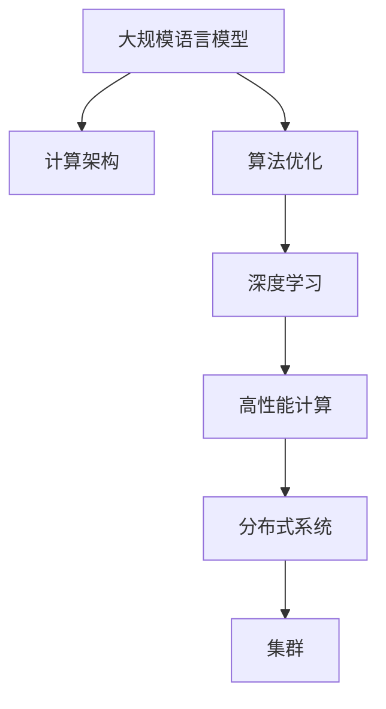

                 

# LLM:计算机架构的新时代

> 关键词：大规模语言模型,LLM,计算架构,算法优化,深度学习,高性能计算,分布式系统,人工智能

## 1. 背景介绍

### 1.1 问题由来
随着深度学习技术的飞速发展，大规模语言模型(LLM)在自然语言处理(NLP)领域取得了空前的成就。这些模型通过在大量无标签文本数据上进行预训练，学习到了强大的语言理解能力和生成能力。它们不仅在机器翻译、文本摘要、问答系统等传统任务上表现出色，还在语音识别、视觉问答、对话交互等新兴领域大放异彩。

然而，这些模型的强大也带来了新的挑战：如何高效地训练和运行这些模型，使之成为具有广泛应用价值的生产工具？如何构建稳定、可靠、可扩展的计算架构，以支持大规模LLM的部署和优化？这些问题涉及计算架构、算法优化、高性能计算、分布式系统等多个领域，急需新方法和新技术的突破。

### 1.2 问题核心关键点
本文聚焦于构建适应大规模LLM的计算架构，并通过实例探讨如何高效训练和优化这些模型，提升其性能与实用性。本文将涵盖以下几个核心关键点：

- 计算架构与算法优化：探讨构建高性能、可扩展的计算架构，以及如何针对大规模LLM进行高效算法优化。
- 深度学习与高性能计算：详细介绍深度学习与高性能计算之间的相互促进关系，以及实际应用中的优化策略。
- 分布式系统与集群优化：分析分布式系统在支撑大规模LLM中的应用，以及如何通过集群优化提升系统性能。
- 前沿技术：介绍当前研究的热点技术，如多语言预训练、自监督学习等，以及这些技术如何推动LLM的发展。

通过系统化的理论分析与实例讲解，本文将全面揭示大规模LLM的计算架构与优化方法，为从事相关研究的学者和工程师提供参考。

## 2. 核心概念与联系

### 2.1 核心概念概述

为更好地理解大规模LLM的计算架构与优化方法，本节将介绍几个密切相关的核心概念：

- 大规模语言模型(LLM)：指通过在大规模无标签文本语料上自监督训练得到的高性能语言模型，如BERT、GPT等。
- 计算架构(Computing Architecture)：指硬件和软件资源的配置与组织，用于支撑特定计算任务的需求。
- 算法优化(Algorithm Optimization)：指对计算算法进行优化，提高算法的执行效率与资源利用率。
- 深度学习(Deep Learning)：指通过多层神经网络实现复杂数据建模与预测的机器学习方法。
- 高性能计算(High Performance Computing, HPC)：指使用并行计算技术，以提升计算速度和资源利用率，解决复杂计算问题。
- 分布式系统(Distributed System)：指通过网络将多台计算资源连接起来，实现并行处理和负载均衡的系统架构。
- 集群(Cluster)：指一组协同工作的计算节点，用于提供大规模计算与数据处理能力。

这些概念之间的逻辑关系可以通过以下Mermaid流程图来展示：



这个流程图展示了LLM与计算架构、算法优化、深度学习、高性能计算、分布式系统、集群等概念之间的紧密联系：

1. 大规模语言模型通过深度学习技术在无标签数据上进行预训练，学习到语言表示。
2. 这些模型通常需要高性能计算与分布式系统的支持，以处理大规模训练和推理任务。
3. 计算架构与算法优化为大规模LLM的训练与推理提供了基础支撑。
4. 分布式集群通过并行计算提升了系统性能，支撑了大规模LLM的实际应用。

## 3. 核心算法原理 & 具体操作步骤

### 3.1 算法原理概述

大规模LLM的训练与推理过程涉及深度学习、高性能计算和分布式系统等多个领域的知识。其核心算法原理可以总结如下：

- 深度学习算法：使用多层神经网络进行语言建模，通过反向传播算法更新模型参数，优化损失函数。
- 高性能计算算法：通过并行计算、分布式计算等技术，提升计算速度与资源利用率。
- 分布式系统算法：通过数据分片、任务调度、通信协议等技术，实现并行处理与负载均衡。

### 3.2 算法步骤详解

下面详细介绍大规模LLM的训练与推理步骤：

**3.2.1 模型训练**

大规模LLM的训练过程一般包括以下几个关键步骤：

1. **数据准备**：收集大量无标签文本数据，对其进行分批次预处理，如分词、去除停用词、归一化等。
2. **构建模型**：使用深度学习框架(如PyTorch、TensorFlow)构建多层神经网络模型，并设定优化器、损失函数等关键参数。
3. **数据加载**：使用分布式数据加载技术，将数据分片并行读取到多个计算节点。
4. **前向传播**：将数据输入模型进行前向传播计算，得到模型预测结果。
5. **反向传播**：计算模型预测结果与真实标签之间的损失函数，通过反向传播算法更新模型参数。
6. **优化器更新**：使用优化器(如Adam、SGD等)更新模型参数，降低损失函数。
7. **迭代训练**：重复前向传播、反向传播与优化器更新步骤，直至损失函数收敛。

**3.2.2 模型推理**

大规模LLM的推理过程一般包括以下几个关键步骤：

1. **输入预处理**：对输入文本进行预处理，如分词、去除停用词、归一化等。
2. **模型加载**：将训练好的模型参数加载到推理引擎中。
3. **前向传播**：将预处理后的文本输入模型进行前向传播计算，得到模型预测结果。
4. **后处理**：对模型输出结果进行后处理，如去除重复、排序等，生成最终输出。

### 3.3 算法优缺点

大规模LLM的训练与推理算法具有以下优点：

- 高效性：通过并行计算与分布式系统，能够快速处理大规模数据与计算任务。
- 可扩展性：可以轻松扩展计算资源，支持更大规模的训练与推理任务。
- 灵活性：通过算法优化与架构设计，能够适应多种类型的计算需求。

同时，这些算法也存在一些缺点：

- 计算复杂度高：深度学习模型的计算复杂度较高，需要高性能计算资源。
- 数据依赖强：深度学习模型依赖大量数据进行训练，数据获取与处理成本较高。
- 模型复杂度高：深度学习模型的结构复杂，难以理解与调试。

### 3.4 算法应用领域

大规模LLM的训练与推理算法已在多个领域得到广泛应用，例如：

- 自然语言处理(NLP)：如文本分类、语言建模、机器翻译、问答系统等。
- 计算机视觉(CV)：如图像识别、目标检测、图像生成等。
- 语音识别(SR)：如语音转文字、情感分析、语音生成等。
- 推荐系统(Recommendation System)：如商品推荐、音乐推荐、电影推荐等。
- 金融分析(Financial Analysis)：如市场预测、风险评估、量化交易等。

这些应用展示了深度学习算法在多个领域的广泛适用性，为各行各业带来了新的技术变革。

## 4. 数学模型和公式 & 详细讲解 & 举例说明

### 4.1 数学模型构建

大规模LLM的训练过程涉及深度学习与高性能计算两个领域的数学模型。

**深度学习模型**

深度学习模型通常使用多层神经网络进行语言建模。以LSTM模型为例，其数学模型如下：

$$
h_t = f(W_h \cdot h_{t-1} + b_h)
$$

$$
c_t = f(W_c \cdot h_{t-1} + b_c)
$$

$$
o_t = f(W_o \cdot h_{t-1} + b_o)
$$

$$
\tilde{c_t} = f(W_{c_t} \cdot x_t + b_{c_t})
$$

$$
c_t = c_{t-1} \otimes f(W_c \cdot h_{t-1} + b_c)
$$

$$
h_t = h_{t-1} \otimes f(W_h \cdot h_{t-1} + b_h)
$$

其中，$f$表示激活函数，$h_t$表示当前时间步的隐藏状态，$c_t$表示当前时间步的细胞状态，$x_t$表示当前时间步的输入向量，$W$和$b$表示模型参数。

**高性能计算模型**

高性能计算模型通常使用并行计算技术，提升计算速度与资源利用率。以MapReduce模型为例，其数学模型如下：

$$
Map(k_i, v_i) = \{(k_j, v_j)\}
$$

$$
Reduce(k_j, \{v_j\}) = \{(k_j, \sum_{v_j \in \{v_j\}} v_j)\}
$$

其中，$k_i$和$v_i$表示Map函数的输入与输出，$k_j$和$v_j$表示Reduce函数的输入与输出。

### 4.2 公式推导过程

以下是深度学习与高性能计算模型的详细推导过程：

**深度学习模型**

以LSTM模型为例，其前向传播过程如下：

1. 计算隐藏状态：

$$
h_t = f(W_h \cdot h_{t-1} + b_h)
$$

2. 计算细胞状态：

$$
c_t = f(W_c \cdot h_{t-1} + b_c)
$$

3. 计算门向量：

$$
o_t = f(W_o \cdot h_{t-1} + b_o)
$$

4. 计算候选细胞状态：

$$
\tilde{c_t} = f(W_{c_t} \cdot x_t + b_{c_t})
$$

5. 计算细胞状态：

$$
c_t = c_{t-1} \otimes f(W_c \cdot h_{t-1} + b_c)
$$

6. 计算隐藏状态：

$$
h_t = h_{t-1} \otimes f(W_h \cdot h_{t-1} + b_h)
$$

其中，$\otimes$表示逐元素相乘操作。

**高性能计算模型**

以MapReduce模型为例，其计算过程如下：

1. Map阶段：将输入数据$k_i$和$v_i$作为Map函数的输入，输出一组键值对$(k_j, v_j)$。

2. Reduce阶段：将Map阶段输出的键值对$(k_j, \{v_j\})$作为Reduce函数的输入，输出一组键值对$(k_j, \sum_{v_j \in \{v_j\}} v_j)$。

通过上述推导，我们可以看到深度学习模型与高性能计算模型的数学模型具有不同的特点：深度学习模型涉及多层神经网络，参数复杂；高性能计算模型涉及并行计算，计算效率高。

### 4.3 案例分析与讲解

以BERT模型为例，其训练过程涉及深度学习与高性能计算两个领域的算法与模型。

**数据准备**

BERT模型使用大规模无标签文本数据进行预训练。首先，将文本数据进行分批次预处理，如分词、去除停用词、归一化等。

**构建模型**

BERT模型使用多层Transformer网络进行语言建模。其中，Transformer网络由多头自注意力机制和前向神经网络组成，其数学模型如下：

$$
Q = W_Q \cdot X + b_Q
$$

$$
K = W_K \cdot X + b_K
$$

$$
V = W_V \cdot X + b_V
$$

$$
A = Softmax(Q \cdot K^T)
$$

$$
O = A \cdot V
$$

其中，$X$表示输入向量，$W$和$b$表示模型参数，$Softmax$表示归一化操作。

**数据加载**

BERT模型使用分布式数据加载技术，将数据分片并行读取到多个计算节点。

**前向传播**

BERT模型将输入向量$X$输入Transformer网络进行前向传播，得到Transformer输出$O$。

**反向传播**

BERT模型通过反向传播算法计算模型预测结果与真实标签之间的损失函数，通过优化器更新模型参数。

**优化器更新**

BERT模型使用优化器AdamW更新模型参数，降低损失函数。

**迭代训练**

BERT模型重复前向传播、反向传播与优化器更新步骤，直至损失函数收敛。

通过以上步骤，BERT模型通过深度学习与高性能计算技术，实现了大规模语言建模与预训练。

## 5. 项目实践：代码实例和详细解释说明

### 5.1 开发环境搭建

在进行大规模LLM的训练与推理实践前，我们需要准备好开发环境。以下是使用Python进行PyTorch开发的环境配置流程：

1. 安装Anaconda：从官网下载并安装Anaconda，用于创建独立的Python环境。

2. 创建并激活虚拟环境：
```bash
conda create -n pytorch-env python=3.8 
conda activate pytorch-env
```

3. 安装PyTorch：根据CUDA版本，从官网获取对应的安装命令。例如：
```bash
conda install pytorch torchvision torchaudio cudatoolkit=11.1 -c pytorch -c conda-forge
```

4. 安装Transformers库：
```bash
pip install transformers
```

5. 安装各类工具包：
```bash
pip install numpy pandas scikit-learn matplotlib tqdm jupyter notebook ipython
```

完成上述步骤后，即可在`pytorch-env`环境中开始大规模LLM的训练与推理实践。

### 5.2 源代码详细实现

这里我们以BERT模型为例，给出使用PyTorch进行训练与推理的PyTorch代码实现。

首先，定义BERT模型：

```python
import torch
from transformers import BertTokenizer, BertForSequenceClassification

model = BertForSequenceClassification.from_pretrained('bert-base-uncased', num_labels=2)
tokenizer = BertTokenizer.from_pretrained('bert-base-uncased')

device = torch.device('cuda') if torch.cuda.is_available() else torch.device('cpu')
model.to(device)
```

然后，定义训练与评估函数：

```python
from torch.utils.data import DataLoader
from tqdm import tqdm

class BERTDataset(Dataset):
    def __init__(self, texts, labels):
        self.texts = texts
        self.labels = labels
        self.tokenizer = tokenizer
    
    def __len__(self):
        return len(self.texts)
    
    def __getitem__(self, item):
        text = self.texts[item]
        label = self.labels[item]
        
        encoding = self.tokenizer(text, return_tensors='pt', padding=True, truncation=True)
        input_ids = encoding['input_ids']
        attention_mask = encoding['attention_mask']
        return {'input_ids': input_ids, 
                'attention_mask': attention_mask,
                'labels': label}

# 加载数据集
train_dataset = BERTDataset(train_texts, train_labels)
dev_dataset = BERTDataset(dev_texts, dev_labels)
test_dataset = BERTDataset(test_texts, test_labels)

# 定义超参数
learning_rate = 2e-5
epochs = 3
batch_size = 16

# 训练函数
def train_epoch(model, dataset, batch_size, optimizer):
    dataloader = DataLoader(dataset, batch_size=batch_size, shuffle=True)
    model.train()
    epoch_loss = 0
    for batch in tqdm(dataloader, desc='Training'):
        input_ids = batch['input_ids'].to(device)
        attention_mask = batch['attention_mask'].to(device)
        labels = batch['labels'].to(device)
        model.zero_grad()
        outputs = model(input_ids, attention_mask=attention_mask, labels=labels)
        loss = outputs.loss
        epoch_loss += loss.item()
        loss.backward()
        optimizer.step()
    return epoch_loss / len(dataloader)

# 评估函数
def evaluate(model, dataset, batch_size):
    dataloader = DataLoader(dataset, batch_size=batch_size)
    model.eval()
    preds, labels = [], []
    with torch.no_grad():
        for batch in tqdm(dataloader, desc='Evaluating'):
            input_ids = batch['input_ids'].to(device)
            attention_mask = batch['attention_mask'].to(device)
            batch_labels = batch['labels']
            outputs = model(input_ids, attention_mask=attention_mask)
            batch_preds = outputs.logits.argmax(dim=1).to('cpu').tolist()
            batch_labels = batch_labels.to('cpu').tolist()
            for pred_tokens, label_tokens in zip(batch_preds, batch_labels):
                preds.append(pred_tokens)
                labels.append(label_tokens)
                
    print(classification_report(labels, preds))

# 训练流程
optimizer = AdamW(model.parameters(), lr=learning_rate)
for epoch in range(epochs):
    loss = train_epoch(model, train_dataset, batch_size, optimizer)
    print(f"Epoch {epoch+1}, train loss: {loss:.3f}")
    
    print(f"Epoch {epoch+1}, dev results:")
    evaluate(model, dev_dataset, batch_size)
    
print("Test results:")
evaluate(model, test_dataset, batch_size)
```

以上就是使用PyTorch对BERT模型进行训练与推理的完整代码实现。可以看到，得益于Transformers库的强大封装，我们可以用相对简洁的代码完成BERT模型的加载和训练。

### 5.3 代码解读与分析

让我们再详细解读一下关键代码的实现细节：

**BERTDataset类**：
- `__init__`方法：初始化文本、标签、分词器等关键组件。
- `__len__`方法：返回数据集的样本数量。
- `__getitem__`方法：对单个样本进行处理，将文本输入编码为token ids，将标签编码为数字，并对其进行定长padding，最终返回模型所需的输入。

**训练与评估函数**：
- 使用PyTorch的DataLoader对数据集进行批次化加载，供模型训练和推理使用。
- 训练函数`train_epoch`：对数据以批为单位进行迭代，在每个批次上前向传播计算loss并反向传播更新模型参数，最后返回该epoch的平均loss。
- 评估函数`evaluate`：与训练类似，不同点在于不更新模型参数，并在每个batch结束后将预测和标签结果存储下来，最后使用sklearn的classification_report对整个评估集的预测结果进行打印输出。

**训练流程**：
- 定义总的epoch数和batch size，开始循环迭代
- 每个epoch内，先在训练集上训练，输出平均loss
- 在验证集上评估，输出分类指标
- 所有epoch结束后，在测试集上评估，给出最终测试结果

可以看到，PyTorch配合Transformers库使得BERT模型的训练与推理代码实现变得简洁高效。开发者可以将更多精力放在数据处理、模型改进等高层逻辑上，而不必过多关注底层的实现细节。

当然，工业级的系统实现还需考虑更多因素，如模型的保存和部署、超参数的自动搜索、更灵活的任务适配层等。但核心的微调范式基本与此类似。

## 6. 实际应用场景

### 6.1 智能客服系统

基于大规模LLM的智能客服系统，可以大幅度提升客户服务体验和效率。传统客服系统依赖人力处理，高峰期响应缓慢，且成本高昂。而使用大规模LLM，可以通过自然语言理解和生成，自动回答常见问题，处理复杂对话，提升服务质量与覆盖范围。

在技术实现上，可以收集企业内部的历史客服对话记录，将问题和最佳答复构建成监督数据，在此基础上对大规模LLM进行微调。微调后的模型能够自动理解用户意图，匹配最合适的答复模板进行回复。对于客户提出的新问题，还可以接入检索系统实时搜索相关内容，动态生成最佳回答。如此构建的智能客服系统，能大幅提升客户咨询体验和问题解决效率。

### 6.2 金融舆情监测

金融机构需要实时监测市场舆论动向，以便及时应对负面信息传播，规避金融风险。传统的人工监测方式成本高、效率低，难以应对网络时代海量信息爆发的挑战。基于大规模LLM的文本分类与情感分析技术，为金融舆情监测提供了新的解决方案。

具体而言，可以收集金融领域相关的新闻、报道、评论等文本数据，并对其进行主题标注和情感标注。在此基础上对大规模LLM进行微调，使其能够自动判断文本属于何种主题，情感倾向是正面、中性还是负面。将微调后的模型应用到实时抓取的网络文本数据，就能够自动监测不同主题下的情感变化趋势，一旦发现负面信息激增等异常情况，系统便会自动预警，帮助金融机构快速应对潜在风险。

### 6.3 个性化推荐系统

当前的推荐系统往往只依赖用户的历史行为数据进行物品推荐，无法深入理解用户的真实兴趣偏好。基于大规模LLM的个性化推荐系统，可以更好地挖掘用户行为背后的语义信息，从而提供更精准、多样的推荐内容。

在实践中，可以收集用户浏览、点击、评论、分享等行为数据，提取和用户交互的物品标题、描述、标签等文本内容。将文本内容作为模型输入，用户的后续行为（如是否点击、购买等）作为监督信号，在此基础上微调大规模LLM。微调后的模型能够从文本内容中准确把握用户的兴趣点。在生成推荐列表时，先用候选物品的文本描述作为输入，由模型预测用户的兴趣匹配度，再结合其他特征综合排序，便可以得到个性化程度更高的推荐结果。

### 6.4 未来应用展望

随着大规模LLM的不断进步，其应用场景将不断扩展，为各个行业带来新的变革：

- 智能医疗：基于大规模LLM的医疗问答、病历分析、药物研发等应用将提升医疗服务的智能化水平，辅助医生诊疗，加速新药开发进程。
- 智能教育：微调技术可应用于作业批改、学情分析、知识推荐等方面，因材施教，促进教育公平，提高教学质量。
- 智能城市：微调模型可应用于城市事件监测、舆情分析、应急指挥等环节，提高城市管理的自动化和智能化水平，构建更安全、高效的未来城市。
- 智慧制造：基于大规模LLM的生产预测、设备维护、质量控制等应用将提升制造业的智能化水平，优化生产流程，降低成本，提高效率。
- 智慧农业：基于大规模LLM的病虫害识别、作物分析、农业机器人等应用将提升农业生产的智能化水平，优化种植管理，提高产量与质量。

未来，随着深度学习与高性能计算技术的不断突破，大规模LLM的应用场景将更加多样，为各行各业带来更多的创新与机遇。

## 7. 工具和资源推荐
### 7.1 学习资源推荐

为了帮助开发者系统掌握大规模LLM的理论基础和实践技巧，这里推荐一些优质的学习资源：

1. 《深度学习》系列书籍：由Ian Goodfellow、Yoshua Bengio、Aaron Courville等专家联合撰写，全面介绍了深度学习的基本概念、算法与实践。
2. 《TensorFlow深度学习实战》书籍：介绍了TensorFlow深度学习框架的使用，提供了丰富的实战案例，帮助读者快速上手。
3. 《大规模深度学习》课程：由斯坦福大学开设，讲解了深度学习在大规模数据上的应用，包括模型训练、优化等技术细节。
4. Coursera深度学习专项课程：由DeepLearning.AI提供，涵盖深度学习的基础理论、算法实践与应用案例。
5. Kaggle深度学习竞赛：参与Kaggle数据科学竞赛，实战训练深度学习模型，积累项目经验。

通过对这些资源的学习实践，相信你一定能够快速掌握大规模LLM的训练与推理方法，并用于解决实际的NLP问题。

### 7.2 开发工具推荐

高效的开发离不开优秀的工具支持。以下是几款用于大规模LLM训练与推理开发的常用工具：

1. PyTorch：基于Python的开源深度学习框架，灵活动态的计算图，适合快速迭代研究。大量预训练语言模型都有PyTorch版本的实现。
2. TensorFlow：由Google主导开发的开源深度学习框架，生产部署方便，适合大规模工程应用。同样有丰富的预训练语言模型资源。
3. Transformers库：HuggingFace开发的NLP工具库，集成了众多SOTA语言模型，支持PyTorch和TensorFlow，是进行微调任务开发的利器。
4. Weights & Biases：模型训练的实验跟踪工具，可以记录和可视化模型训练过程中的各项指标，方便对比和调优。与主流深度学习框架无缝集成。
5. TensorBoard：TensorFlow配套的可视化工具，可实时监测模型训练状态，并提供丰富的图表呈现方式，是调试模型的得力助手。
6. Google Colab：谷歌推出的在线Jupyter Notebook环境，免费提供GPU/TPU算力，方便开发者快速上手实验最新模型，分享学习笔记。

合理利用这些工具，可以显著提升大规模LLM的训练与推理任务的开发效率，加快创新迭代的步伐。

### 7.3 相关论文推荐

大规模LLM和微调技术的发展源于学界的持续研究。以下是几篇奠基性的相关论文，推荐阅读：

1. Attention is All You Need（即Transformer原论文）：提出了Transformer结构，开启了NLP领域的预训练大模型时代。
2. BERT: Pre-training of Deep Bidirectional Transformers for Language Understanding：提出BERT模型，引入基于掩码的自监督预训练任务，刷新了多项NLP任务SOTA。
3. Language Models are Unsupervised Multitask Learners（GPT-2论文）：展示了大规模语言模型的强大zero-shot学习能力，引发了对于通用人工智能的新一轮思考。
4. Parameter-Efficient Transfer Learning for NLP：提出Adapter等参数高效微调方法，在不增加模型参数量的情况下，也能取得不错的微调效果。
5. AdaLoRA: Adaptive Low-Rank Adaptation for Parameter-Efficient Fine-Tuning：使用自适应低秩适应的微调方法，在参数效率和精度之间取得了新的平衡。
6. OBiGAN: On-Budget GAN for Stable Text Generation：提出在预算限制下训练稳定的生成对抗网络，用于生成高质量的文本数据。

这些论文代表了大规模LLM微调技术的发展脉络。通过学习这些前沿成果，可以帮助研究者把握学科前进方向，激发更多的创新灵感。

## 8. 总结：未来发展趋势与挑战

### 8.1 总结

本文对构建适应大规模LLM的计算架构，并进行高效训练与优化的方法进行了全面系统的介绍。首先阐述了大规模LLM与计算架构、算法优化、深度学习、高性能计算、分布式系统等多个领域之间的紧密联系，明确了深度学习与高性能计算之间的相互促进关系。其次，从原理到实践，详细讲解了大规模LLM的训练与推理过程，给出了基于PyTorch的代码实现。同时，本文还探讨了基于大规模LLM的智能客服、金融舆情、个性化推荐等实际应用场景，展示了其广阔的应用前景。此外，本文精选了训练与推理任务的各类学习资源，力求为开发者提供全方位的技术指引。

通过本文的系统梳理，可以看到，大规模LLM的计算架构与优化方法在大规模数据与计算资源的支持下，能够高效地实现深度学习模型的训练与推理。随着深度学习与高性能计算技术的不断突破，大规模LLM将在更多领域展现其强大的应用潜力，带来新的技术变革。

### 8.2 未来发展趋势

展望未来，大规模LLM的计算架构与优化方法将呈现以下几个发展趋势：

1. 模型规模持续增大。随着算力成本的下降和数据规模的扩张，大规模LLM的参数量还将持续增长。超大规模语言模型蕴含的丰富语言知识，有望支撑更加复杂多变的下游任务。
2. 微调方法日趋多样。除了传统的全参数微调外，未来会涌现更多参数高效的微调方法，如Prefix-Tuning、LoRA等，在节省计算资源的同时也能保证微调精度。
3. 持续学习成为常态。随着数据分布的不断变化，微调模型也需要持续学习新知识以保持性能。如何在不遗忘原有知识的同时，高效吸收新样本信息，将成为重要的研究课题。
4. 标注样本需求降低。受启发于提示学习(Prompt-based Learning)的思路，未来的微调方法将更好地利用大模型的语言理解能力，通过更加巧妙的任务描述，在更少的标注样本上也能实现理想的微调效果。
5. 多模态微调崛起。当前的微调主要聚焦于纯文本数据，未来会进一步拓展到图像、视频、语音等多模态数据微调。多模态信息的融合，将显著提升语言模型对现实世界的理解和建模能力。
6. 模型通用性增强。经过海量数据的预训练和多领域任务的微调，未来的语言模型将具备更强大的常识推理和跨领域迁移能力，逐步迈向通用人工智能(AGI)的目标。

以上趋势凸显了大规模LLM的计算架构与优化方法的广阔前景。这些方向的探索发展，必将进一步提升NLP系统的性能和应用范围，为人类认知智能的进化带来深远影响。

### 8.3 面临的挑战

尽管大规模LLM的计算架构与优化方法已经取得了显著进展，但在迈向更加智能化、普适化应用的过程中，它仍面临着诸多挑战：

1. 计算复杂度高。深度学习模型的计算复杂度较高，需要高性能计算资源。未来需要更多研究探索新的并行计算技术，提升计算效率。
2. 数据依赖强。深度学习模型依赖大量数据进行训练，数据获取与处理成本较高。需要更多研究探索无监督、半监督学习技术，降低对标注数据的依赖。
3. 模型复杂度高。深度学习模型的结构复杂，难以理解与调试。需要更多研究探索模型的可解释性技术，增强模型的可理解性。
4. 资源消耗高。大规模LLM的训练与推理需要大量计算资源，如何优化资源使用，降低计算成本，仍需进一步研究。
5. 分布式系统复杂。大规模LLM的分布式系统设计复杂，需要更多研究探索新的分布式算法与通信协议，提升系统的可扩展性。
6. 系统鲁棒性不足。深度学习模型面对数据噪声、异常值等干扰时，鲁棒性较弱。需要更多研究探索新的鲁棒学习技术，提高系统的鲁棒性。

以上挑战需通过技术创新与工程实践不断突破，才能实现大规模LLM的实际应用与落地。

### 8.4 研究展望

面对大规模LLM计算架构与优化方法所面临的挑战，未来的研究需要在以下几个方面寻求新的突破：

1. 探索新的并行计算技术。研究分布式、异构计算技术，提升计算效率与资源利用率。
2. 开发无监督与半监督学习技术。研究利用非结构化数据进行无监督、半监督学习的技术，降低对标注数据的依赖。
3. 探索模型可解释性技术。研究模型的可解释性技术，增强模型的可理解性，降低使用门槛。
4. 优化资源使用与调度。研究资源使用与调度的优化技术，降低计算成本与能耗。
5. 研究鲁棒学习技术。研究模型的鲁棒学习技术，提高模型的鲁棒性与抗干扰能力。
6. 探索多模态融合技术。研究多模态数据的融合技术，提升语言模型对现实世界的理解能力。

这些研究方向的探索，必将引领大规模LLM计算架构与优化方法迈向更高的台阶，为构建安全、可靠、可解释、可控的智能系统铺平道路。面向未来，大规模LLM计算架构与优化方法需要与其他人工智能技术进行更深入的融合，如知识表示、因果推理、强化学习等，多路径协同发力，共同推动自然语言理解和智能交互系统的进步。只有勇于创新、敢于突破，才能不断拓展语言模型的边界，让智能技术更好地造福人类社会。

## 9. 附录：常见问题与解答

**Q1：大规模LLM的训练与推理需要哪些计算资源？**

A: 大规模LLM的训练与推理需要大量计算资源，包括GPU/TPU等高性能计算设备。一般需要至少几个至几十个计算节点，每个节点包含多个GPU/TPU，才能实现大规模数据与计算任务的并行处理。此外，还需要高速网络、大容量存储等基础设施支持。

**Q2：如何选择适合的大规模LLM模型？**

A: 选择大规模LLM模型需要考虑以下几个因素：
1. 模型规模：大规模LLM的参数量较大，需要根据计算资源选择合适的模型规模。
2. 预训练数据：模型的预训练数据规模越大，性能越好。但数据获取与处理成本较高，需平衡资源与性能。
3. 任务类型：不同任务对模型性能的需求不同，需选择适合的模型架构。
4. 实际应用场景：模型的应用场景对实时性、准确性、鲁棒性等指标有不同要求，需综合考虑。

**Q3：如何优化大规模LLM的训练与推理？**

A: 大规模LLM的训练与推理可以通过以下几种方法进行优化：
1. 数据增强：通过对输入数据进行随机裁剪、旋转、混杂等增强操作，提高模型泛化能力。
2. 模型裁剪：去除不必要的层和参数，减小模型尺寸，加快推理速度。
3. 量化加速：将浮点模型转为定点模型，压缩存储空间，提高计算效率。
4. 分布式训练：使用分布式训练技术，提高训练速度与资源利用率。
5. 模型压缩：使用模型压缩技术，如剪枝、量化等，减小模型规模，提升推理效率。

**Q4：大规模LLM在实际应用中面临哪些挑战？**

A: 大规模LLM在实际应用中面临以下挑战：
1. 计算资源消耗高：大规模LLM的训练与推理需要大量计算资源，可能超出实际部署能力。
2. 模型复杂度高：大规模LLM的模型结构复杂，难以理解与调试。
3. 数据依赖强：大规模LLM的性能依赖大量高质量数据，数据获取与处理成本较高。
4. 分布式系统复杂：大规模LLM的分布式系统设计复杂，需要高水平的网络与存储支持。
5. 模型鲁棒性不足：大规模LLM面对数据噪声、异常值等干扰时，鲁棒性较弱。

**Q5：大规模LLM的未来发展方向有哪些？**

A: 大规模LLM的未来发展方向包括：
1. 模型规模持续增大：随着算力成本的下降和数据规模的扩张，大规模LLM的参数量还将持续增长。
2. 模型可解释性增强：研究模型的可解释性技术，增强模型的可理解性，降低使用门槛。
3. 分布式系统优化：研究新的分布式算法与通信协议，提升系统的可扩展性。
4. 无监督与半监督学习：研究利用非结构化数据进行无监督、半监督学习的技术，降低对标注数据的依赖。
5. 多模态融合：研究多模态数据的融合技术，提升语言模型对现实世界的理解能力。

这些方向的研究与应用，将推动大规模LLM的实际应用与落地，带来更多创新与机遇。

---

作者：禅与计算机程序设计艺术 / Zen and the Art of Computer Programming

