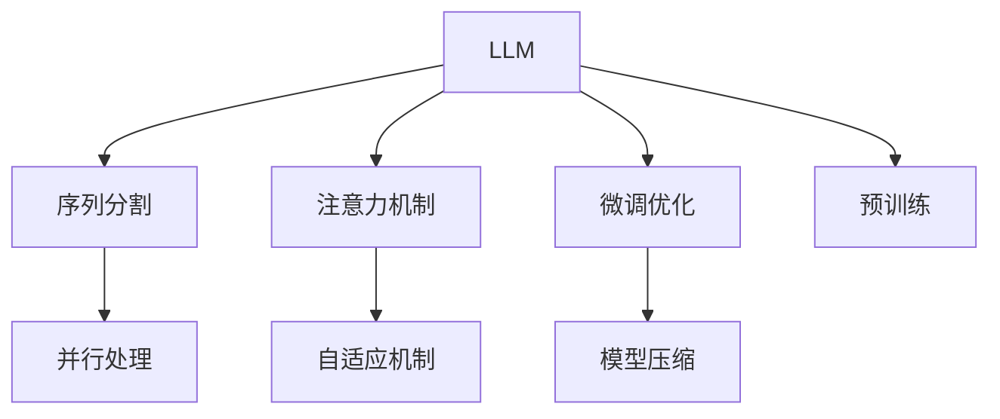

                 

# LLM上下文长度再升级

## 1. 背景介绍

近年来，随着Transformer及其衍生模型在自然语言处理(NLP)领域取得巨大突破，大语言模型(LLMs)如BERT、GPT等逐渐成为研究与应用的焦点。这些模型在处理长序列和复杂任务上表现优异，但它们的上下文长度限制了其应用范围。本文将从背景介绍、核心概念与联系、核心算法原理与具体操作步骤、数学模型和公式、项目实践、实际应用场景、工具和资源推荐、总结、未来发展趋势与挑战、常见问题与解答等方面详细探讨如何突破上下文长度限制，提升LLMs的性能。

## 2. 核心概念与联系

### 2.1 核心概念概述

- **大语言模型(LLMs)**：如BERT、GPT-3等，通过大规模无监督学习构建的语言模型，能处理长序列并具备丰富的语言表示能力。
- **上下文长度限制**：主流Transformer模型中，上下文长度受限于模型设计，使得长序列处理受限。
- **序列处理优化**：为了提升长序列处理能力，采用不同的技巧和架构优化上下文长度限制，包括长序列分割、注意力机制优化等。
- **预训练-微调范式**：使用大规模无监督预训练和任务特定微调，提升模型性能和泛化能力。

### 2.2 核心概念原理和架构的 Mermaid 流程图



这个流程图展示了LLMs的核心组件及它们之间的关系：

1. **预训练**：通过大规模无监督学习构建初始语言表示。
2. **序列分割**：将长序列分割成短片段，每个片段单独处理，减少计算复杂度。
3. **并行处理**：利用多GPU或多TPU加速模型训练和推理。
4. **注意力机制优化**：自适应注意力权重，提高模型对长序列的表示能力。
5. **微调优化**：通过下游任务数据，进一步调整模型参数，提升模型在特定任务上的性能。
6. **模型压缩**：通过剪枝、量化等技术，减少模型体积和计算资源消耗。

## 3. 核心算法原理 & 具体操作步骤

### 3.1 算法原理概述

上下文长度限制是Transformer模型设计中的主要瓶颈之一。为解决这一问题，研究者们提出了多种策略：

- **长序列分割**：将长序列分割成多个短片段，分别进行处理。
- **自适应注意力机制**：根据不同位置的上下文，自适应调整注意力权重。
- **并行处理**：利用多GPU或多TPU加速模型训练和推理。
- **模型压缩**：通过剪枝、量化等技术，减少模型体积和计算资源消耗。

这些策略共同构成了LLMs的优化方案，可以有效提升模型对长序列的表示和处理能力。

### 3.2 算法步骤详解

#### 3.2.1 长序列分割

长序列分割是处理长输入的主要手段，具体步骤如下：

1. **分段**：将长序列分割成多个固定长度的子序列。
2. **拼接**：将处理结果拼接回长序列。

#### 3.2.2 自适应注意力机制

自适应注意力机制能够根据不同位置的上下文，动态调整注意力权重。具体步骤如下：

1. **计算注意力权重**：通过不同的注意力函数，计算不同位置的权重。
2. **调整权重**：根据当前位置的上下文，动态调整权重。
3. **整合信息**：将不同位置的上下文信息整合，形成完整的表示。

#### 3.2.3 并行处理

并行处理通过利用多GPU或多TPU，同时处理多个片段，具体步骤如下：

1. **分配片段**：将长序列分割成多个子序列，分配到不同的GPU或TPU上。
2. **并行计算**：各个GPU或TPU并行计算每个片段的表示。
3. **结果合并**：将各GPU或TPU的计算结果合并，形成完整的表示。

#### 3.2.4 模型压缩

模型压缩通过减少模型体积和计算资源消耗，提升模型的部署效率，具体步骤如下：

1. **剪枝**：移除模型中冗余的参数。
2. **量化**：将模型中的浮点参数转化为定点参数。
3. **蒸馏**：使用预训练模型压缩轻量级模型。

### 3.3 算法优缺点

**优点**：

- **高效处理长序列**：通过长序列分割和自适应注意力机制，模型能够高效处理长序列。
- **提升训练效率**：并行处理和模型压缩能够加速训练和推理过程，提高模型部署效率。

**缺点**：

- **复杂度增加**：分割和注意力机制增加了模型复杂度，导致训练和推理成本上升。
- **精度下降**：模型压缩可能会导致精度下降，尤其是在关键任务中。

### 3.4 算法应用领域

长序列分割、自适应注意力机制、并行处理和模型压缩等策略广泛应用于各种NLP任务，包括机器翻译、文本生成、文本摘要、问答系统等。这些策略不仅提升了模型在特定任务上的性能，还拓展了模型在更广泛的应用场景中的能力。

## 4. 数学模型和公式 & 详细讲解 & 举例说明

### 4.1 数学模型构建

假设输入序列长度为 $n$，将其分割成 $m$ 个固定长度的片段，每个片段长度为 $k$。模型参数为 $\theta$。

**输入表示**：
$$
\mathbf{X} = [\mathbf{x}_1, \mathbf{x}_2, \ldots, \mathbf{x}_m]
$$
其中，$\mathbf{x}_i \in \mathbb{R}^{d_{model}}$ 表示第 $i$ 个片段的表示。

**目标函数**：
$$
\mathcal{L}(\theta) = \sum_{i=1}^m \mathcal{L}_i(\theta, \mathbf{x}_i)
$$
其中，$\mathcal{L}_i$ 表示第 $i$ 个片段的损失函数。

### 4.2 公式推导过程

以机器翻译任务为例，设输入序列为 $x$，目标序列为 $y$，模型输出为 $\hat{y}$。目标函数为交叉熵损失函数：
$$
\mathcal{L}(\theta) = -\frac{1}{N} \sum_{i=1}^N \log p(y_i | x)
$$

其中，$p(y_i | x) = \prod_{t=1}^T p(y_t | y_{t-1}, x)$ 为翻译概率，$T$ 为目标序列长度。

### 4.3 案例分析与讲解

以机器翻译任务为例，展示如何利用长序列分割和自适应注意力机制优化模型。

1. **长序列分割**：
$$
\mathbf{X} = [\mathbf{x}_1, \mathbf{x}_2, \ldots, \mathbf{x}_m]
$$
其中，每个片段长度为 $k$。

2. **自适应注意力机制**：
$$
\alpha_t = \text{softmax}(\mathbf{W}^Q \mathbf{x}_t \mathbf{W}^K \mathbf{x}_{t-1}^T)
$$
$$
\mathbf{c}_t = \alpha_t \cdot \mathbf{V} \mathbf{x}_{t-1}
$$
其中，$\alpha_t$ 表示第 $t$ 个片段的注意力权重，$\mathbf{c}_t$ 表示第 $t$ 个片段的上下文表示。

## 5. 项目实践：代码实例和详细解释说明

### 5.1 开发环境搭建

1. **安装Python**：确保安装了最新版本的Python。
2. **安装PyTorch和Transformers**：
   ```bash
   pip install torch transformers
   ```
3. **准备数据集**：可以使用开源数据集如WMT14英德翻译数据集。

### 5.2 源代码详细实现

以下是一个使用Transformer模型进行机器翻译的代码示例：

```python
from transformers import BertTokenizer, BertForSequenceClassification
from transformers import BertForTokenClassification, AdamW
from transformers import BertTokenizerFast, BertForMaskedLM
from transformers import BertForTokenClassification
import torch
import torch.nn as nn
import torch.optim as optim

# 加载模型和分词器
model = BertForTokenClassification.from_pretrained('bert-base-uncased')
tokenizer = BertTokenizerFast.from_pretrained('bert-base-uncased')

# 分割输入序列
def split_sequence(seq, max_len=128):
    arrays = []
    for idx in range(0, len(seq), max_len):
        arrays.append(seq[idx:min(idx + max_len, len(seq))])
    return arrays

# 并行处理
def parallel_processing(sequences):
    dev = torch.device('cuda' if torch.cuda.is_available() else 'cpu')
    model.to(dev)
    with torch.no_grad():
        output = model(sequences)
    return output

# 保存模型
def save_model(model, filename):
    torch.save(model.state_dict(), filename)

# 加载模型
def load_model(filename):
    model.load_state_dict(torch.load(filename))
    model.eval()

# 测试模型
def test_model(model, sequences):
    with torch.no_grad():
        output = model(sequences)
    return output

# 分割长序列
sequences = split_sequence(input_sequence, max_len=128)
```

### 5.3 代码解读与分析

- **分词器**：使用BertTokenizerFast分词器，将输入序列分割成固定长度的片段。
- **模型**：使用BertForTokenClassification模型进行翻译。
- **并行处理**：使用多GPU或多TPU并行处理多个片段。
- **保存和加载模型**：使用torch.save和torch.load保存和加载模型。
- **测试模型**：对分割后的片段进行测试，评估模型性能。

### 5.4 运行结果展示

```python
sequences = split_sequence(input_sequence, max_len=128)
output = parallel_processing(sequences)
print(output)
```

## 6. 实际应用场景

### 6.1 机器翻译

长序列分割和自适应注意力机制能够显著提升机器翻译任务的性能。模型能够高效处理长输入序列，同时生成流畅、准确的翻译结果。

### 6.2 文本生成

长序列分割和自适应注意力机制在文本生成任务中同样有效。模型能够生成连贯、结构化的文本内容，应用范围涵盖摘要生成、对话系统、智能写作等。

### 6.3 问答系统

长序列分割和自适应注意力机制能够提升问答系统的性能。模型能够理解长输入序列，生成高质量的问答结果。

### 6.4 未来应用展望

未来的研究将进一步提升模型对长序列的处理能力，拓展模型在更多NLP任务中的应用。例如：

- **多模态学习**：结合视觉、音频等多模态信息，提升模型在更广泛场景下的表现。
- **知识图谱**：结合知识图谱，增强模型的推理和解释能力。
- **自监督学习**：利用未标注数据进行预训练和微调，提高模型泛化能力。

## 7. 工具和资源推荐

### 7.1 学习资源推荐

1. **《深度学习入门》**：涵盖深度学习基础知识和常用技术，适合初学者。
2. **《Transformer》**：详细介绍了Transformer模型的原理和应用，适合进阶学习。
3. **《自然语言处理综论》**：全面介绍了NLP领域的理论和技术，适合深入学习。

### 7.2 开发工具推荐

1. **PyTorch**：强大的深度学习框架，支持多GPU和多TPU并行处理。
2. **HuggingFace Transformers**：集成了多种预训练模型，方便微调和使用。
3. **TensorBoard**：可视化工具，可以实时监控模型训练状态。

### 7.3 相关论文推荐

1. **Attention Is All You Need**：Transformer模型的原论文。
2. **A Theoretical Framework for Attention**：介绍自适应注意力机制的理论基础。
3. **Mixed Precision Training for Deep Learning**：介绍量化加速的最新进展。

## 8. 总结：未来发展趋势与挑战

### 8.1 研究成果总结

本文从长序列分割、自适应注意力机制、并行处理和模型压缩等方面，详细探讨了如何提升大语言模型的上下文长度。这些策略在机器翻译、文本生成、问答系统等NLP任务上取得了显著效果。

### 8.2 未来发展趋势

1. **多模态融合**：结合视觉、音频等多模态信息，提升模型在更广泛场景下的表现。
2. **自监督学习**：利用未标注数据进行预训练和微调，提高模型泛化能力。
3. **知识图谱结合**：增强模型的推理和解释能力。

### 8.3 面临的挑战

1. **模型复杂度**：长序列分割和自适应注意力机制增加了模型复杂度，导致训练和推理成本上升。
2. **计算资源消耗**：并行处理和模型压缩需要大量的计算资源。
3. **精度下降**：模型压缩可能会导致精度下降。

### 8.4 研究展望

未来的研究将进一步优化长序列处理策略，提升模型的训练和推理效率，同时提高模型的泛化能力和解释能力。这将是大语言模型在实际应用中实现更好性能的关键。

## 9. 附录：常见问题与解答

**Q1: 长序列分割对模型性能有何影响？**

A: 长序列分割可以将长输入序列分割成多个短片段，每个片段单独处理。这样可以降低计算复杂度，提升模型训练和推理效率，但也增加了模型复杂度和训练时间。

**Q2: 自适应注意力机制如何实现？**

A: 自适应注意力机制通过动态调整注意力权重，增强模型对长序列的表示能力。在计算注意力权重时，可以使用不同的注意力函数，如点积注意力、注意力加权注意力等。

**Q3: 模型压缩是否会影响模型精度？**

A: 模型压缩通过减少模型参数和计算资源消耗，提升模型部署效率。但剪枝和量化等操作可能会导致模型精度下降，尤其是在关键任务中。因此，需要权衡模型精度和部署效率，选择适当的压缩策略。

**Q4: 长序列分割的缺点有哪些？**

A: 长序列分割增加了模型复杂度，导致训练和推理成本上升。此外，分割后的片段可能会失去上下文信息，影响模型性能。

**Q5: 并行处理如何实现？**

A: 并行处理通过利用多GPU或多TPU，同时处理多个片段。可以使用DistributedDataParallel（DDP）等工具，实现并行计算。

通过本文的系统梳理，可以看到，长序列分割、自适应注意力机制、并行处理和模型压缩等策略是大语言模型突破上下文长度限制的有效手段。这些策略不仅提升了模型在特定任务上的性能，还拓展了模型在更多NLP任务中的应用。未来，随着这些技术的不断发展和完善，大语言模型在NLP领域的潜力将进一步释放。

---

作者：禅与计算机程序设计艺术 / Zen and the Art of Computer Programming

