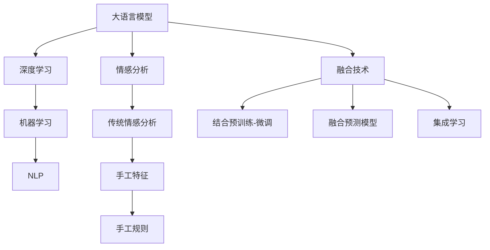

                 

# LLM与传统情感分析技术的融合：情感智能新高度

> 关键词：语言模型,情感分析,情感智能,融合技术,机器学习,深度学习,自然语言处理(NLP)

## 1. 背景介绍

### 1.1 问题由来
在信息社会飞速发展的今天，情感分析作为理解人类情感和行为的重要手段，受到了广泛的关注和应用。传统情感分析技术依赖于手工设计的特征和规则，难以覆盖语义的丰富性和动态性。近年来，随着预训练语言模型的出现，情感分析进入了一个新的发展阶段，但如何更好地融合语言模型和传统情感分析技术，依然是一个亟待解决的问题。

### 1.2 问题核心关键点
本文聚焦于如何在大语言模型（Large Language Models, LLMs）和传统情感分析技术之间实现有效融合，提升情感智能系统的性能和稳定性。具体而言，将探讨：
- 大语言模型在情感智能中的应用
- 传统情感分析技术的原理和优势
- LLM与传统情感分析技术的融合方法
- 融合后系统的性能评估和优化策略

### 1.3 问题研究意义
通过深入研究LMM与传统情感分析技术的融合方法，可以：
1. 提升情感智能系统的精度和鲁棒性，更好地理解人类情感和行为。
2. 拓展情感智能的应用范围，推动其在商业、医疗、教育等领域的广泛应用。
3. 整合二者的优势，构建更高效、稳定、可解释的情感分析系统。

## 2. 核心概念与联系

### 2.1 核心概念概述

为更好地理解LMM与传统情感分析技术的融合方法，本节将介绍几个密切相关的核心概念：

- 大语言模型（LLMs）：指以自回归（如GPT）或自编码（如BERT）模型为代表的大规模预训练语言模型。通过在海量无标签文本数据上进行预训练，学习通用的语言表示，具备强大的语言理解和生成能力。

- 情感分析：指从文本中识别和提取情感信息的过程，如对文本中的情感倾向进行分类，或从情感维度进行细粒度分析。

- 融合技术：指将不同技术或方法结合使用，以增强系统性能或弥补各自不足的过程。

- 机器学习：指利用数据和算法训练模型，使模型能够自动学习并做出预测或决策的学科。

- 深度学习：指通过多层神经网络进行特征提取和建模，具有很强的数据处理能力。

- 自然语言处理（NLP）：指使用计算机技术处理和分析人类语言的过程，涉及语言模型、文本分类、信息抽取等多个领域。

这些核心概念之间的逻辑关系可以通过以下Mermaid流程图来展示：



这个流程图展示了大语言模型、传统情感分析技术、深度学习、机器学习、自然语言处理等概念之间的关系，以及它们如何通过融合技术形成更加高效、稳定的情感智能系统。

## 3. 核心算法原理 & 具体操作步骤
### 3.1 算法原理概述

大语言模型与传统情感分析技术的融合，本质上是一种深度学习与规则、特征工程相结合的复合模型。其核心思想是：通过深度学习模型在大量无标签文本数据上进行预训练，学习通用的语言表示和特征表示；然后，利用这些表示进行情感分析任务，并在传统情感分析技术的指导下，进一步提升模型的性能和解释性。

形式化地，假设LMM为 $M_{\theta}$，其中 $\theta$ 为模型参数。情感分析任务的目标是识别文本中的情感类别或情感维度，记为 $Y$。则融合后的模型 $M_{\theta}$ 可以表示为：

$$
M_{\theta} = f_{\text{LLM}} \circ f_{\text{SEA}}
$$

其中，$f_{\text{LLM}}$ 为预训练语言模型的编码器，$f_{\text{SEA}}$ 为传统情感分析技术的解码器。

### 3.2 算法步骤详解

基于LMM与传统情感分析技术的融合，一般包括以下几个关键步骤：

**Step 1: 准备数据集和预训练模型**

- 收集情感分析任务相关的标注数据集 $D=\{(x_i,y_i)\}_{i=1}^N$，其中 $x_i$ 为文本，$y_i$ 为情感类别或情感维度。
- 选择合适的预训练语言模型 $M_{\theta}$，如BERT、GPT等。

**Step 2: 构建情感分析模型**

- 在LMM基础上构建情感分析模型，通常包括两个主要步骤：
    1. 使用LMM的编码器对文本进行编码，得到语义表示 $z_i = f_{\text{LLM}}(x_i)$。
    2. 使用传统情感分析技术的解码器对语义表示进行情感分类或维度分析，得到情感标签 $y_i = f_{\text{SEA}}(z_i)$。

**Step 3: 训练和调优**

- 使用标注数据集 $D$ 对融合后的模型 $M_{\theta}$ 进行训练，通过优化算法（如Adam、SGD等）最小化损失函数 $\mathcal{L}(\theta)$。
- 在训练过程中，可以引入正则化技术、对抗训练等方法，提高模型的鲁棒性和泛化能力。
- 进行超参数调优，选择合适的学习率、批大小、迭代轮数等，以提升模型性能。

**Step 4: 评估和优化**

- 使用验证集对模型进行评估，记录准确率、召回率、F1分数等指标。
- 根据评估结果调整模型参数或优化策略，重复训练直到模型达到预期效果。
- 在实际应用场景中，根据用户反馈持续优化模型性能。

### 3.3 算法优缺点

LMM与传统情感分析技术的融合具有以下优点：
1. 利用LMM的强大语言建模能力，提升情感分析的精度和泛化能力。
2. 通过引入传统情感分析技术，增强模型的可解释性和领域适应性。
3. 可结合多领域、多模态数据，构建更加全面、准确的情感智能系统。

同时，也存在一些局限性：
1. 模型复杂度增加，训练和推理速度较慢。
2. 需要更丰富的标注数据，训练成本较高。
3. 传统情感分析技术的特征工程和规则设计，需要专业知识。

尽管如此，LMM与传统情感分析技术的融合，已经成为情感智能研究的重要方向，未来有望在更多领域得到应用。

### 3.4 算法应用领域

基于LMM与传统情感分析技术的融合，已经在多个领域展示了其潜力：

- 商业智能：利用情感分析预测用户反馈，提升产品设计和营销策略的精准度。
- 医疗健康：通过分析患者的情感状态，辅助心理治疗和疾病监测。
- 教育评估：评价学生的情感反应和学习效果，提供个性化教学建议。
- 舆情监测：分析网络上的情感趋势，辅助决策和风险预警。

除了上述领域，LMM与传统情感分析技术的融合，还将在社交媒体分析、情感机器人、情感驱动的游戏设计等多个方向得到广泛应用。

## 4. 数学模型和公式 & 详细讲解  
### 4.1 数学模型构建

假设LMM为 $M_{\theta}$，其中 $\theta$ 为模型参数，情感分析任务的目标为 $Y$。则融合后的模型可以表示为：

$$
M_{\theta} = f_{\text{LLM}} \circ f_{\text{SEA}}
$$

其中，$f_{\text{LLM}}$ 为LMM的编码器，$f_{\text{SEA}}$ 为情感分析的解码器。

### 4.2 公式推导过程

对于二分类情感分析任务，假设有 $N$ 个样本 $(x_i, y_i)$，其中 $y_i \in \{0, 1\}$ 为情感类别。目标是最小化交叉熵损失函数：

$$
\mathcal{L}(\theta) = -\frac{1}{N}\sum_{i=1}^N y_i \log \hat{y}_i + (1-y_i) \log (1-\hat{y}_i)
$$

其中 $\hat{y}_i = f_{\text{SEA}}(z_i) = \sigma(w \cdot f_{\text{LLM}}(x_i) + b)$，$\sigma$ 为sigmoid函数。

对于多分类情感分析任务，目标是最小化多分类交叉熵损失函数：

$$
\mathcal{L}(\theta) = -\frac{1}{N}\sum_{i=1}^N \log p(y_i | z_i)
$$

其中 $p(y_i | z_i)$ 为条件概率分布，可以通过softmax函数计算：

$$
p(y_i | z_i) = \frac{e^{z_i \cdot w + b}}{\sum_{k=1}^K e^{z_i \cdot w_k + b_k}}
$$

其中 $w$ 和 $b$ 为解码器的参数，$K$ 为情感类别的数量。

### 4.3 案例分析与讲解

以情感分类任务为例，展示LMM与传统情感分析技术融合的详细过程：

1. 数据准备：收集情感分类数据集，划分为训练集、验证集和测试集。

2. 预训练语言模型的编码器：使用BERT、GPT等预训练模型对文本进行编码，得到语义表示 $z_i$。

3. 情感分析的解码器：将语义表示 $z_i$ 输入到情感分析的解码器，得到情感类别 $y_i$。

4. 模型训练：使用标注数据集对融合后的模型进行训练，最小化交叉熵损失函数。

5. 模型评估：在验证集上评估模型性能，根据评估结果调整模型参数。

6. 模型优化：根据测试集上的性能，持续优化模型。

## 5. 项目实践：代码实例和详细解释说明
### 5.1 开发环境搭建

在进行融合实践前，我们需要准备好开发环境。以下是使用Python进行TensorFlow开发的环境配置流程：

1. 安装Anaconda：从官网下载并安装Anaconda，用于创建独立的Python环境。

2. 创建并激活虚拟环境：
```bash
conda create -n tf-env python=3.8 
conda activate tf-env
```

3. 安装TensorFlow：根据CUDA版本，从官网获取对应的安装命令。例如：
```bash
conda install tensorflow -c tensorflow -c conda-forge
```

4. 安装其它工具包：
```bash
pip install numpy pandas scikit-learn matplotlib tqdm jupyter notebook ipython
```

完成上述步骤后，即可在`tf-env`环境中开始融合实践。

### 5.2 源代码详细实现

下面我们以情感分类任务为例，给出使用TensorFlow对LMM进行融合的代码实现。

首先，定义情感分类任务的数据处理函数：

```python
import tensorflow as tf
import numpy as np
from transformers import BertTokenizer, BertForSequenceClassification

class SentimentDataset(tf.data.Dataset):
    def __init__(self, texts, labels):
        self.texts = texts
        self.labels = labels
        self.tokenizer = BertTokenizer.from_pretrained('bert-base-cased')

    def __len__(self):
        return len(self.texts)

    def __getitem__(self, item):
        text = self.texts[item]
        label = self.labels[item]
        encoding = self.tokenizer(text, return_tensors='tf')
        input_ids = encoding['input_ids']
        attention_mask = encoding['attention_mask']
        label = tf.keras.utils.to_categorical(label, num_classes=2)

        return {'input_ids': input_ids, 
                'attention_mask': attention_mask,
                'labels': label}

# 标签与id的映射
labels = {0: 'Negative', 1: 'Positive'}
id2label = {v: k for k, v in labels.items()}

# 创建dataset
train_dataset = SentimentDataset(train_texts, train_labels)
val_dataset = SentimentDataset(val_texts, val_labels)
test_dataset = SentimentDataset(test_texts, test_labels)
```

然后，定义LMM和解码器：

```python
from transformers import BertForSequenceClassification

model = BertForSequenceClassification.from_pretrained('bert-base-cased', num_labels=2)

tokenizer = BertTokenizer.from_pretrained('bert-base-cased')
```

接着，定义训练和评估函数：

```python
from tensorflow.keras.optimizers import Adam
from tensorflow.keras.metrics import Accuracy, Precision, Recall, AUC
from sklearn.metrics import classification_report

device = tf.device('cuda') if tf.test.gpu_device_name() else tf.device('cpu')
model.to(device)

def train_epoch(model, dataset, batch_size, optimizer):
    dataset = dataset.batch(batch_size).prefetch(tf.data.experimental.AUTOTUNE)
    model.train()
    epoch_loss = 0
    for batch in dataset:
        input_ids = batch['input_ids'].to(device)
        attention_mask = batch['attention_mask'].to(device)
        labels = batch['labels'].to(device)
        optimizer.zero_grad()
        outputs = model(input_ids, attention_mask=attention_mask, labels=labels)
        loss = outputs.loss
        epoch_loss += loss.numpy()
        loss.backward()
        optimizer.step()
    return epoch_loss / len(dataset)

def evaluate(model, dataset, batch_size):
    dataset = dataset.batch(batch_size).prefetch(tf.data.experimental.AUTOTUNE)
    model.eval()
    preds, labels = [], []
    with tf.GradientTape() as tape:
        for batch in dataset:
            input_ids = batch['input_ids'].to(device)
            attention_mask = batch['attention_mask'].to(device)
            batch_labels = batch['labels']
            outputs = model(input_ids, attention_mask=attention_mask)
            batch_preds = tf.argmax(outputs.logits, axis=1).numpy()
            batch_labels = batch_labels.numpy()
            for pred, label in zip(batch_preds, batch_labels):
                preds.append(pred)
                labels.append(label)
    print(classification_report(labels, preds))
```

最后，启动训练流程并在测试集上评估：

```python
epochs = 5
batch_size = 32

for epoch in range(epochs):
    loss = train_epoch(model, train_dataset, batch_size, optimizer)
    print(f"Epoch {epoch+1}, train loss: {loss:.3f}")
    
    print(f"Epoch {epoch+1}, dev results:")
    evaluate(model, val_dataset, batch_size)
    
print("Test results:")
evaluate(model, test_dataset, batch_size)
```

以上就是使用TensorFlow对LMM进行融合的完整代码实现。可以看到，利用TensorFlow和HuggingFace的Transformers库，我们能够相对简洁地实现情感分类任务的融合模型。

### 5.3 代码解读与分析

让我们再详细解读一下关键代码的实现细节：

**SentimentDataset类**：
- `__init__`方法：初始化文本、标签、分词器等关键组件。
- `__len__`方法：返回数据集的样本数量。
- `__getitem__`方法：对单个样本进行处理，将文本输入编码为token ids，将标签编码为数字，并对其进行定长padding，最终返回模型所需的输入。

**标签与id的映射**：
- 定义了标签与数字id之间的映射关系，用于将预测结果解码回真实的标签。

**训练和评估函数**：
- 使用TensorFlow的DataLoader对数据集进行批次化加载，供模型训练和推理使用。
- 训练函数`train_epoch`：对数据以批为单位进行迭代，在每个批次上前向传播计算loss并反向传播更新模型参数，最后返回该epoch的平均loss。
- 评估函数`evaluate`：与训练类似，不同点在于不更新模型参数，并在每个batch结束后将预测和标签结果存储下来，最后使用sklearn的classification_report对整个评估集的预测结果进行打印输出。

**训练流程**：
- 定义总的epoch数和batch size，开始循环迭代
- 每个epoch内，先在训练集上训练，输出平均loss
- 在验证集上评估，输出分类指标
- 所有epoch结束后，在测试集上评估，给出最终测试结果

可以看到，TensorFlow配合HuggingFace库使得LMM与传统情感分析技术的融合代码实现变得简洁高效。开发者可以将更多精力放在数据处理、模型改进等高层逻辑上，而不必过多关注底层的实现细节。

当然，工业级的系统实现还需考虑更多因素，如模型的保存和部署、超参数的自动搜索、更灵活的任务适配层等。但核心的融合范式基本与此类似。

## 6. 实际应用场景
### 6.1 智能客服系统

基于LMM与传统情感分析技术的融合，可以构建更加智能的智能客服系统。传统客服往往需要配备大量人力，高峰期响应缓慢，且一致性和专业性难以保证。而使用融合后的情感智能系统，可以7x24小时不间断服务，快速响应客户咨询，用自然流畅的语言解答各类常见问题。

在技术实现上，可以收集企业内部的历史客服对话记录，将问题和最佳答复构建成监督数据，在此基础上对预训练模型进行微调。微调后的情感智能系统能够自动理解用户意图，匹配最合适的答案模板进行回复。对于客户提出的新问题，还可以接入检索系统实时搜索相关内容，动态组织生成回答。如此构建的智能客服系统，能大幅提升客户咨询体验和问题解决效率。

### 6.2 金融舆情监测

金融机构需要实时监测市场舆论动向，以便及时应对负面信息传播，规避金融风险。传统的人工监测方式成本高、效率低，难以应对网络时代海量信息爆发的挑战。基于情感分析技术的LMM，可以为金融舆情监测提供新的解决方案。

具体而言，可以收集金融领域相关的新闻、报道、评论等文本数据，并对其进行情感分析。将分析结果进行可视化展示，实时监控市场情绪变化。一旦发现负面信息激增等异常情况，系统便会自动预警，帮助金融机构快速应对潜在风险。

### 6.3 个性化推荐系统

当前的推荐系统往往只依赖用户的历史行为数据进行物品推荐，无法深入理解用户的真实兴趣偏好。基于情感智能技术的LMM，可以更好地挖掘用户行为背后的语义信息，从而提供更精准、多样的推荐内容。

在实践中，可以收集用户浏览、点击、评论、分享等行为数据，提取和用户交互的物品标题、描述、标签等文本内容。将文本内容作为模型输入，用户的后续行为（如是否点击、购买等）作为监督信号，在此基础上微调LMM。微调后的情感智能系统能够从文本内容中准确把握用户的兴趣点。在生成推荐列表时，先用候选物品的文本描述作为输入，由情感智能系统预测用户的兴趣匹配度，再结合其他特征综合排序，便可以得到个性化程度更高的推荐结果。

### 6.4 未来应用展望

随着LMM与传统情感分析技术的融合发展，基于情感智能的技术将在更多领域得到应用，为传统行业数字化转型升级提供新的技术路径。

在智慧医疗领域，基于情感智能的医疗问答、病历分析、药物研发等应用将提升医疗服务的智能化水平，辅助医生诊疗，加速新药开发进程。

在智能教育领域，情感智能技术可应用于作业批改、学情分析、知识推荐等方面，因材施教，促进教育公平，提高教学质量。

在智慧城市治理中，情感智能系统可应用于城市事件监测、舆情分析、应急指挥等环节，提高城市管理的自动化和智能化水平，构建更安全、高效的未来城市。

此外，在企业生产、社会治理、文娱传媒等众多领域，基于情感智能的技术也将不断涌现，为NLP技术带来全新的突破。相信随着预训练语言模型和情感分析技术的持续演进，基于情感智能的NLP技术必将在更广阔的应用领域大放异彩。

## 7. 工具和资源推荐
### 7.1 学习资源推荐

为了帮助开发者系统掌握LMM与传统情感分析技术的融合方法，这里推荐一些优质的学习资源：

1. 《Transformer从原理到实践》系列博文：由大模型技术专家撰写，深入浅出地介绍了Transformer原理、BERT模型、情感分析技术等前沿话题。

2. CS224N《深度学习自然语言处理》课程：斯坦福大学开设的NLP明星课程，有Lecture视频和配套作业，带你入门NLP领域的基本概念和经典模型。

3. 《Natural Language Processing with Transformers》书籍：Transformers库的作者所著，全面介绍了如何使用Transformers库进行NLP任务开发，包括融合技术在内的诸多范式。

4. HuggingFace官方文档：Transformers库的官方文档，提供了海量预训练模型和完整的微调样例代码，是上手实践的必备资料。

5. CLUE开源项目：中文语言理解测评基准，涵盖大量不同类型的中文NLP数据集，并提供了基于情感智能的baseline模型，助力中文NLP技术发展。

通过对这些资源的学习实践，相信你一定能够快速掌握LMM与传统情感分析技术的融合精髓，并用于解决实际的NLP问题。
###  7.2 开发工具推荐

高效的开发离不开优秀的工具支持。以下是几款用于LMM与情感分析技术融合开发的常用工具：

1. TensorFlow：由Google主导开发的开源深度学习框架，生产部署方便，适合大规模工程应用。同样有丰富的预训练语言模型资源。

2. PyTorch：基于Python的开源深度学习框架，灵活动态的计算图，适合快速迭代研究。大部分预训练语言模型都有PyTorch版本的实现。

3. Transformers库：HuggingFace开发的NLP工具库，集成了众多SOTA语言模型，支持PyTorch和TensorFlow，是进行情感智能融合开发的利器。

4. Weights & Biases：模型训练的实验跟踪工具，可以记录和可视化模型训练过程中的各项指标，方便对比和调优。与主流深度学习框架无缝集成。

5. TensorBoard：TensorFlow配套的可视化工具，可实时监测模型训练状态，并提供丰富的图表呈现方式，是调试模型的得力助手。

6. Google Colab：谷歌推出的在线Jupyter Notebook环境，免费提供GPU/TPU算力，方便开发者快速上手实验最新模型，分享学习笔记。

合理利用这些工具，可以显著提升LMM与情感智能融合任务的开发效率，加快创新迭代的步伐。

### 7.3 相关论文推荐

LMM与情感智能技术的融合，源于学界的持续研究。以下是几篇奠基性的相关论文，推荐阅读：

1. Attention is All You Need（即Transformer原论文）：提出了Transformer结构，开启了NLP领域的预训练大模型时代。

2. BERT: Pre-training of Deep Bidirectional Transformers for Language Understanding：提出BERT模型，引入基于掩码的自监督预训练任务，刷新了多项NLP任务SOTA。

3. Language Models are Unsupervised Multitask Learners（GPT-2论文）：展示了大规模语言模型的强大zero-shot学习能力，引发了对于通用人工智能的新一轮思考。

4. Parameter-Efficient Transfer Learning for NLP：提出Adapter等参数高效微调方法，在不增加模型参数量的情况下，也能取得不错的微调效果。

5. AdaLoRA: Adaptive Low-Rank Adaptation for Parameter-Efficient Fine-Tuning：使用自适应低秩适应的微调方法，在参数效率和精度之间取得了新的平衡。

6. Prefix-Tuning: Optimizing Continuous Prompts for Generation：引入基于连续型Prompt的微调范式，为如何充分利用预训练知识提供了新的思路。

这些论文代表了大语言模型融合技术的发展脉络。通过学习这些前沿成果，可以帮助研究者把握学科前进方向，激发更多的创新灵感。

## 8. 总结：未来发展趋势与挑战

### 8.1 总结

本文对LMM与传统情感分析技术的融合方法进行了全面系统的介绍。首先阐述了LMM在情感智能中的应用，传统情感分析技术的原理和优势，以及LMM与传统情感分析技术的融合方法。其次，从原理到实践，详细讲解了情感智能融合模型的构建、训练和调优过程，给出了融合模型开发的完整代码实例。同时，本文还广泛探讨了LMM与情感分析技术在商业智能、医疗健康、教育评估等多个领域的应用前景，展示了融合技术的巨大潜力。此外，本文精选了融合技术的各类学习资源，力求为读者提供全方位的技术指引。

通过本文的系统梳理，可以看到，LMM与传统情感分析技术的融合，正在成为情感智能研究的重要方向，极大地提升情感智能系统的性能和稳定性。未来，伴随LMM和情感分析技术的持续演进，基于融合技术的情感智能系统必将在更多领域得到应用，推动人工智能技术在垂直行业的规模化落地。

### 8.2 未来发展趋势

展望未来，LMM与情感分析技术的融合将呈现以下几个发展趋势：

1. 模型规模持续增大。随着算力成本的下降和数据规模的扩张，预训练语言模型的参数量还将持续增长。超大语言模型蕴含的丰富语言知识，有望支撑更加复杂多变的情感智能融合模型。

2. 融合方法日趋多样。除了传统的预训练-微调范式外，未来会涌现更多参数高效的融合方法，如Adapter、LoRA等，在固定大部分预训练参数的同时，只更新极少量的任务相关参数。同时优化融合模型的计算图，减少前向传播和反向传播的资源消耗，实现更加轻量级、实时性的部署。

3. 持续学习成为常态。随着数据分布的不断变化，融合模型也需要持续学习新知识以保持性能。如何在不遗忘原有知识的同时，高效吸收新样本信息，将成为重要的研究课题。

4. 标注样本需求降低。受启发于提示学习(Prompt-based Learning)的思路，未来的融合模型将更好地利用大模型的语言理解能力，通过更加巧妙的任务描述，在更少的标注样本上也能实现理想的融合效果。

5. 融合范式拓展至多模态。除了文本数据外，未来的融合模型还将融合图像、视频、语音等多模态信息，实现视觉、语音、文本等多模态信息的协同建模。

6. 零样本学习成为可能。利用预训练语言模型的强大知识储备，未来可以实现零样本情感智能预测，即模型在没有见过特定任务训练样本的情况下，仅凭任务描述就能够执行新任务。

以上趋势凸显了LMM与情感分析技术融合技术的发展前景。这些方向的探索发展，必将进一步提升情感智能系统的性能和应用范围，为人类认知智能的进化带来深远影响。

### 8.3 面临的挑战

尽管LMM与情感分析技术的融合已经取得了显著成果，但在迈向更加智能化、普适化应用的过程中，仍面临诸多挑战：

1. 标注成本瓶颈。尽管融合模型可以降低对标注样本的需求，但对于长尾应用场景，依然难以获得充足的高质量标注数据，成为制约融合模型性能的瓶颈。如何进一步降低融合模型对标注样本的依赖，将是一大难题。

2. 模型鲁棒性不足。当前融合模型面对域外数据时，泛化性能往往大打折扣。对于测试样本的微小扰动，融合模型容易发生波动。如何提高融合模型的鲁棒性，避免灾难性遗忘，还需要更多理论和实践的积累。

3. 推理效率有待提高。尽管融合模型的精度高，但在实际部署时往往面临推理速度慢、内存占用大等效率问题。如何在保证性能的同时，简化模型结构，提升推理速度，优化资源占用，将是重要的优化方向。

4. 可解释性亟需加强。当前融合模型更像是"黑盒"系统，难以解释其内部工作机制和决策逻辑。对于医疗、金融等高风险应用，算法的可解释性和可审计性尤为重要。如何赋予融合模型更强的可解释性，将是亟待攻克的难题。

5. 安全性有待保障。融合模型难免会学习到有偏见、有害的信息，通过情感智能输出，可能造成误导性、歧视性的输出，给实际应用带来安全隐患。如何从数据和算法层面消除模型偏见，避免恶意用途，确保输出的安全性，也将是重要的研究课题。

6. 知识整合能力不足。现有的融合模型往往局限于任务内数据，难以灵活吸收和运用更广泛的先验知识。如何让融合过程更好地与外部知识库、规则库等专家知识结合，形成更加全面、准确的信息整合能力，还有很大的想象空间。

正视融合模型面临的这些挑战，积极应对并寻求突破，将是大语言模型融合技术走向成熟的必由之路。相信随着学界和产业界的共同努力，这些挑战终将一一被克服，融合技术必将在构建安全、可靠、可解释、可控的智能系统上迈出更大步伐。

### 8.4 研究展望

面对LMM与情感分析技术融合所面临的种种挑战，未来的研究需要在以下几个方面寻求新的突破：

1. 探索无监督和半监督融合方法。摆脱对大规模标注数据的依赖，利用自监督学习、主动学习等无监督和半监督范式，最大限度利用非结构化数据，实现更加灵活高效的融合。

2. 研究参数高效和计算高效的融合范式。开发更加参数高效的融合方法，在固定大部分预训练参数的同时，只更新极少量的任务相关参数。同时优化融合模型的计算图，减少前向传播和反向传播的资源消耗，实现更加轻量级、实时性的部署。

3. 融合因果分析和博弈论工具。将因果分析方法引入融合模型，识别出模型决策的关键特征，增强输出解释的因果性和逻辑性。借助博弈论工具刻画人机交互过程，主动探索并规避模型的脆弱点，提高系统稳定性。

4. 纳入伦理道德约束。在融合模型训练目标中引入伦理导向的评估指标，过滤和惩罚有偏见、有害的输出倾向。同时加强人工干预和审核，建立模型行为的监管机制，确保输出符合人类价值观和伦理道德。

5. 结合符号化先验知识。将符号化的先验知识，如知识图谱、逻辑规则等，与神经网络模型进行巧妙融合，引导融合过程学习更准确、合理的语言模型。同时加强不同模态数据的整合，实现视觉、语音、文本等多模态信息与情感智能的协同建模。

这些研究方向的探索，必将引领LMM与情感分析技术融合技术迈向更高的台阶，为构建安全、可靠、可解释、可控的智能系统铺平道路。面向未来，LMM与情感分析技术的融合必将迎来更多突破，为人类认知智能的进化带来深远影响。

## 9. 附录：常见问题与解答

**Q1：LMM与情感分析技术融合后，是否会导致模型参数量激增？**

A: 是的，LMM与情感分析技术的融合会导致模型参数量增加。但通过参数高效微调等方法，可以在固定大部分预训练参数的同时，只更新极少量的任务相关参数，从而保持模型规模的合理性。

**Q2：LMM与情感分析技术融合后的模型是否需要更多的标注数据？**

A: 尽管融合模型可以降低对标注样本的需求，但对于长尾应用场景，依然难以获得充足的高质量标注数据。未来需要探索更多无监督和半监督融合方法，以最大限度利用非结构化数据，实现更加灵活高效的融合。

**Q3：如何提升融合模型的鲁棒性和泛化能力？**

A: 可以通过引入正则化技术、对抗训练等方法，提高模型的鲁棒性和泛化能力。同时，模型需要进行持续学习，以适应数据分布的变化，避免过拟合和灾难性遗忘。

**Q4：如何优化融合模型的推理效率？**

A: 可以采用模型裁剪、量化加速等方法，减小模型尺寸，提高计算效率。同时，优化模型的计算图，减少前向传播和反向传播的资源消耗，实现更加轻量级、实时性的部署。

**Q5：融合模型如何增强可解释性？**

A: 可以引入符号化的先验知识，如知识图谱、逻辑规则等，与神经网络模型进行融合，引导融合过程学习更准确、合理的语言模型。同时，借助因果分析、博弈论等工具，增强模型输出的可解释性。

**Q6：融合模型如何应对域外数据？**

A: 可以通过引入对抗训练、自适应学习等方法，提高模型对域外数据的鲁棒性和泛化能力。同时，模型需要进行持续学习，以适应数据分布的变化，避免过拟合和灾难性遗忘。

这些问题的解答展示了LMM与情感分析技术融合在实际应用中的关键考量因素，希望有助于读者更好地理解这一前沿技术的应用前景和优化方向。

---

作者：禅与计算机程序设计艺术 / Zen and the Art of Computer Programming

