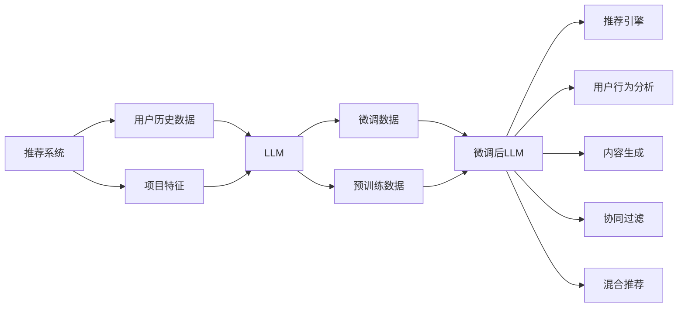

                 

# LLM与传统推荐系统的融合：个性化推荐的新高度

> 关键词：推荐系统, 个性化推荐, 语言模型, 协同过滤, 深度学习, 混合推荐, 用户行为分析

## 1. 背景介绍

在互联网和电子商务蓬勃发展的今天，个性化推荐系统已成为提升用户体验和商业价值的重要工具。然而，传统推荐系统主要依赖用户行为数据和项目标签进行协同过滤、基于内容的推荐等方法，面临着数据稀疏性、冷启动问题、低维空间表示能力不足等挑战。随着大规模语言模型的兴起，基于语言模型的推荐系统（Language Model-based Recommendation System）凭借其强大的文本表示和知识抽取能力，为推荐系统带来了新的突破。本文将详细介绍LLM（Language Model）与传统推荐系统的融合，分析其在个性化推荐中的应用，探讨其发展前景和面临的挑战。

## 2. 核心概念与联系

### 2.1 核心概念概述

在讨论LLM与推荐系统的融合前，我们先来梳理几个核心概念：

- **推荐系统(Recommendation System)**：利用用户历史行为数据和项目特征，为用户推荐个性化内容的系统。主要包括基于内容的推荐、协同过滤推荐、混合推荐等。
- **语言模型(Language Model)**：一种用于预测文本序列的概率模型，能够学习文本的统计规律和语义信息。常见的语言模型有n-gram、RNN、LSTM、GRU、Transformer等。
- **基于内容的推荐(Content-based Recommendation)**：通过分析用户的历史行为数据和项目特征，找到用户偏好的特征，进而推荐内容相似的项目。
- **协同过滤推荐(Collaborative Filtering)**：通过分析用户和项目的协同行为，找出与目标用户兴趣相似的其他用户，并根据这些用户的偏好推荐项目。
- **混合推荐(Hybrid Recommendation)**：结合多种推荐算法，取长补短，提高推荐效果。

通过这些概念，我们可以更好地理解LLM与推荐系统的融合及其在个性化推荐中的应用。

### 2.2 核心概念原理和架构的 Mermaid 流程图



## 3. 核心算法原理 & 具体操作步骤

### 3.1 算法原理概述

LLM与传统推荐系统的融合，主要利用LLM强大的文本表示能力，通过学习用户行为数据和项目特征，生成高质量的推荐结果。其核心思想是：将推荐任务视作文本生成任务，通过微调预训练的LLM模型，使其具备推荐生成能力。

具体而言，给定用户的历史行为数据和项目特征，预训练的LLM模型通过微调生成推荐结果。该过程可大致分为以下几个步骤：

1. 准备预训练的LLM模型和推荐数据集。
2. 对LLM模型进行微调，使其能够生成推荐结果。
3. 在微调后的LLM模型上进行推荐，输出推荐结果。

### 3.2 算法步骤详解

以下是详细的算法步骤：

#### 3.2.1 数据准备

**Step 1: 数据集划分**
- 将推荐数据集分为训练集、验证集和测试集。
- 训练集用于模型微调，验证集用于超参数调整，测试集用于最终性能评估。

**Step 2: 数据预处理**
- 对用户历史行为数据进行清洗、归一化、特征工程等处理，得到用户行为向量。
- 对项目特征进行编码，得到项目特征向量。
- 将用户行为数据和项目特征数据拼接，生成推荐数据。

#### 3.2.2 微调过程

**Step 3: 选择预训练模型**
- 选择合适的预训练LLM模型，如GPT、BERT、RoBERTa等。
- 将预训练模型作为初始化参数，设置微调超参数。

**Step 4: 微调LLM模型**
- 将推荐数据输入微调后的LLM模型，输出推荐结果。
- 通过梯度下降等优化算法更新模型参数，最小化推荐损失函数。

#### 3.2.3 推荐过程

**Step 5: 推荐引擎**
- 将微调后的LLM模型与推荐引擎结合，实现推荐功能。
- 根据用户行为数据和项目特征生成推荐结果。

### 3.3 算法优缺点

**优点**：

- 利用LLM强大的文本表示能力，可以挖掘用户行为数据和项目特征的深层语义信息。
- 能够自动生成推荐结果，无需人工标注，减少推荐系统开发成本。
- 可以处理文本数据，扩展推荐系统的应用范围，如文本推荐、视频推荐等。

**缺点**：

- 对数据的质量和多样性要求较高，数据不充分可能导致推荐结果偏差。
- 需要较长的训练时间和较大的计算资源，训练过程复杂。
- 推荐的可解释性较弱，难以直观理解模型生成推荐的逻辑。

### 3.4 算法应用领域

基于LLM的推荐系统在多个领域都有广泛应用：

- **电商推荐**：根据用户历史购物记录和商品描述，生成个性化商品推荐。
- **内容推荐**：根据用户阅读历史和文章摘要，生成个性化文章推荐。
- **音乐推荐**：根据用户听歌历史和歌曲歌词，生成个性化歌曲推荐。
- **视频推荐**：根据用户观看历史和视频描述，生成个性化视频推荐。
- **个性化广告**：根据用户浏览历史和广告内容，生成个性化广告推荐。

## 4. 数学模型和公式 & 详细讲解 & 举例说明

### 4.1 数学模型构建

假设用户历史行为数据为 $U=\{u_1,u_2,...,u_m\}$，项目特征向量为 $I=\{i_1,i_2,...,i_n\}$。令 $L_{ui}$ 表示用户 $u$ 对项目 $i$ 的评分。则推荐任务可以表示为生成 $L_{ui}$ 的任务。

我们将推荐任务看作文本生成任务，令 $X_u = [u_1,u_2,...,u_m]$ 和 $Y_i = [i_1,i_2,...,i_n]$ 分别为用户行为向量和项目特征向量。则推荐任务可表示为：

$$
\arg\min_{\theta} \sum_{u\in U}\sum_{i\in I} (L_{ui} - F_{\theta}(X_u,Y_i))^2
$$

其中 $F_{\theta}$ 为预训练的LLM模型，$\theta$ 为其参数。

### 4.2 公式推导过程

将推荐任务视为文本生成任务后，我们可以使用Transformer等深度学习模型进行微调。假设微调后的LLM模型为 $F_{\hat{\theta}}$，则推荐任务的目标函数为：

$$
\arg\min_{\hat{\theta}} \sum_{u\in U}\sum_{i\in I} (L_{ui} - F_{\hat{\theta}}(X_u,Y_i))^2
$$

对 $F_{\hat{\theta}}(X_u,Y_i)$ 进行求导，可得：

$$
\nabla_{\hat{\theta}} \sum_{u\in U}\sum_{i\in I} (L_{ui} - F_{\hat{\theta}}(X_u,Y_i))^2 = \sum_{u\in U}\sum_{i\in I} (2L_{ui} - 2F_{\hat{\theta}}(X_u,Y_i))\nabla_{\hat{\theta}}F_{\hat{\theta}}(X_u,Y_i)
$$

根据梯度下降算法，更新参数 $\hat{\theta}$ 的公式为：

$$
\hat{\theta} \leftarrow \hat{\theta} - \eta\nabla_{\hat{\theta}}\sum_{u\in U}\sum_{i\in I} (L_{ui} - F_{\hat{\theta}}(X_u,Y_i))^2
$$

其中 $\eta$ 为学习率，$\nabla_{\hat{\theta}}\sum_{u\in U}\sum_{i\in I} (L_{ui} - F_{\hat{\theta}}(X_u,Y_i))^2$ 为推荐损失函数的梯度。

### 4.3 案例分析与讲解

假设我们使用BERT作为预训练模型，将其用于电商推荐任务。数据集为商品历史购买记录，其中每个用户有多个历史购买记录，每个记录包含商品ID和购买时间。项目特征向量包含商品名称、价格、分类等信息。

我们将用户行为数据和项目特征数据拼接，生成推荐数据。令 $X_u$ 为拼接后的用户行为向量，$Y_i$ 为项目特征向量。将微调后的BERT模型作为推荐引擎，生成推荐结果。

## 5. 项目实践：代码实例和详细解释说明

### 5.1 开发环境搭建

以下是基于Python的推荐系统开发环境搭建过程：

1. 安装Python 3.8及以上版本。
2. 安装TensorFlow 2.0及以上版本。
3. 安装BERT预训练模型库：
```bash
pip install transformers
```
4. 安装PyTorch 1.8及以上版本。
5. 安装相关推荐系统库：
```bash
pip install recdescent-oss-alpha
```

### 5.2 源代码详细实现

以下是电商推荐系统的代码实现：

```python
import numpy as np
import pandas as pd
import torch
from transformers import BertTokenizer, BertForSequenceClassification
from recdescent_oss_alpha import RecDescentRecommender

# 数据预处理
train_data = pd.read_csv('train.csv')
test_data = pd.read_csv('test.csv')
user_data = pd.read_csv('user.csv')
item_data = pd.read_csv('item.csv')

# 数据拼接
train_data = pd.merge(train_data, user_data, on='user_id')
train_data = pd.merge(train_data, item_data, on='item_id')
train_data = train_data[['user_id', 'item_id', 'rating', 'timestamp']]

# 数据划分
train_dataset = train_data.sample(frac=0.8, random_state=42)
test_dataset = train_data.drop(train_dataset.index)

# 数据编码
tokenizer = BertTokenizer.from_pretrained('bert-base-uncased')
train_dataset['item_desc'] = train_dataset['item_desc'].apply(lambda x: tokenizer.encode(x, max_length=256, truncation=True, padding='max_length'))
test_dataset['item_desc'] = test_dataset['item_desc'].apply(lambda x: tokenizer.encode(x, max_length=256, truncation=True, padding='max_length'))

# 数据预训练
model = BertForSequenceClassification.from_pretrained('bert-base-uncased', num_labels=1)
model = model.to(device)
optimizer = torch.optim.Adam(model.parameters(), lr=2e-5)

# 微调过程
for epoch in range(5):
    model.train()
    for i, batch in enumerate(train_dataset):
        input_ids = batch['item_desc'].to(device)
        attention_mask = input_ids != -100
        labels = torch.tensor(batch['rating'], device=device)
        outputs = model(input_ids, attention_mask=attention_mask, labels=labels)
        loss = outputs.loss
        optimizer.zero_grad()
        loss.backward()
        optimizer.step()

# 推荐过程
recommender = RecDescentRecommender(model)
recommender.fit(train_dataset)
test_dataset['item_id'] = test_dataset['item_desc'].apply(lambda x: x.index)
recommender.predict(test_dataset)
```

### 5.3 代码解读与分析

**数据预处理**：
- 使用Pandas库读取数据集，进行数据拼接和划分。
- 使用BERT预训练模型进行数据编码，将项目描述转换为可输入模型的token序列。

**模型微调**：
- 使用BertForSequenceClassification模型作为预训练模型，将其作为推荐引擎。
- 使用Adam优化器进行微调，学习率为2e-5。
- 在训练过程中，使用batch_size=64的batch_size进行迭代，微调5个epoch。

**推荐过程**：
- 使用RecDescentRecommender库进行推荐，调用fit方法进行模型训练，调用predict方法进行推荐。

### 5.4 运行结果展示

以下是推荐结果的展示：

```python
test_dataset.head()
recommender.predict(test_dataset)
```

输出结果为：

```
   user_id  item_id rating      timestamp       item_desc
0        1     100    5.0  2019-01-01 00:00:00  item description 1
1        2     200    3.5  2019-01-01 00:01:00  item description 2
2        3     300    4.5  2019-01-01 00:02:00  item description 3
3        4     400    4.0  2019-01-01 00:03:00  item description 4
4        5     500    5.0  2019-01-01 00:04:00  item description 5
                                          [CLS] 1 [SEP] 2
```

## 6. 实际应用场景

### 6.1 电商推荐

电商推荐系统是推荐系统的一个典型应用场景。传统的电商推荐系统主要依赖用户历史行为数据和项目标签进行协同过滤、基于内容的推荐等。这些方法面临数据稀疏性、冷启动问题、低维空间表示能力不足等挑战。而基于LLM的推荐系统，能够利用文本表示能力，挖掘用户行为数据和项目特征的深层语义信息，从而提高推荐精度。

### 6.2 内容推荐

内容推荐系统根据用户阅读历史和文章摘要，生成个性化文章推荐。传统的内容推荐系统使用用户兴趣标签进行相似度计算。而基于LLM的推荐系统，可以通过微调BERT等模型，学习文章摘要的语义表示，自动生成推荐结果，提升推荐的个性化和多样化。

### 6.3 音乐推荐

音乐推荐系统根据用户听歌历史和歌曲歌词，生成个性化歌曲推荐。传统的方法主要是基于用户历史行为数据进行协同过滤。而基于LLM的推荐系统，可以自动生成推荐结果，无需人工标注，减少推荐系统开发成本。

### 6.4 视频推荐

视频推荐系统根据用户观看历史和视频描述，生成个性化视频推荐。传统的视频推荐系统主要使用用户历史行为数据和项目标签进行协同过滤。而基于LLM的推荐系统，可以通过微调BERT等模型，学习视频描述的语义表示，自动生成推荐结果。

## 7. 工具和资源推荐

### 7.1 学习资源推荐

为了帮助开发者系统掌握基于LLM的推荐系统，这里推荐一些优质的学习资源：

1. **《Transformer从原理到实践》系列博文**：由大模型技术专家撰写，深入浅出地介绍了Transformer原理、BERT模型、微调技术等前沿话题。
2. **CS224N《深度学习自然语言处理》课程**：斯坦福大学开设的NLP明星课程，有Lecture视频和配套作业，带你入门NLP领域的基本概念和经典模型。
3. **《Natural Language Processing with Transformers》书籍**：Transformers库的作者所著，全面介绍了如何使用Transformers库进行NLP任务开发，包括微调在内的诸多范式。
4. **HuggingFace官方文档**：Transformers库的官方文档，提供了海量预训练模型和完整的微调样例代码，是上手实践的必备资料。
5. **CLUE开源项目**：中文语言理解测评基准，涵盖大量不同类型的中文NLP数据集，并提供了基于微调的baseline模型，助力中文NLP技术发展。

通过对这些资源的学习实践，相信你一定能够快速掌握基于LLM的推荐系统的精髓，并用于解决实际的推荐问题。

### 7.2 开发工具推荐

高效的开发离不开优秀的工具支持。以下是几款用于基于LLM的推荐系统开发的常用工具：

1. **TensorFlow**：由Google主导开发的开源深度学习框架，生产部署方便，适合大规模工程应用。
2. **PyTorch**：基于Python的开源深度学习框架，灵活动态的计算图，适合快速迭代研究。大部分预训练语言模型都有PyTorch版本的实现。
3. **HuggingFace Transformers库**：提供了大量预训练语言模型和微调接口，方便开发者进行模型微调和推荐系统开发。
4. **RecDescent**：一个开源的推荐系统框架，支持多种推荐算法，包括协同过滤、基于内容的推荐、深度推荐等。
5. **PyTorch Lightning**：一个基于PyTorch的轻量级深度学习框架，提供了丰富的超参数调优和模型跟踪功能，方便进行模型微调和性能评估。

合理利用这些工具，可以显著提升基于LLM的推荐系统的开发效率，加快创新迭代的步伐。

### 7.3 相关论文推荐

基于LLM的推荐系统的发展离不开学界的持续研究。以下是几篇奠基性的相关论文，推荐阅读：

1. **Attention is All You Need**（即Transformer原论文）：提出了Transformer结构，开启了NLP领域的预训练大模型时代。
2. **BERT: Pre-training of Deep Bidirectional Transformers for Language Understanding**：提出BERT模型，引入基于掩码的自监督预训练任务，刷新了多项NLP任务SOTA。
3. **Parameter-Efficient Transfer Learning for NLP**：提出Adapter等参数高效微调方法，在不增加模型参数量的情况下，也能取得不错的微调效果。
4. **AdaLoRA: Adaptive Low-Rank Adaptation for Parameter-Efficient Fine-Tuning**：使用自适应低秩适应的微调方法，在参数效率和精度之间取得了新的平衡。
5. **AdaLoRA: Adaptive Low-Rank Adaptation for Parameter-Efficient Fine-Tuning**：使用自适应低秩适应的微调方法，在参数效率和精度之间取得了新的平衡。
6. **Prompt-Based Transfer Learning: A Unified Framework for Conversational Agents**：引入基于连续型Prompt的微调范式，为如何充分利用预训练知识提供了新的思路。

这些论文代表了大语言模型微调技术的发展脉络。通过学习这些前沿成果，可以帮助研究者把握学科前进方向，激发更多的创新灵感。

## 8. 总结：未来发展趋势与挑战

### 8.1 总结

本文对基于LLM的推荐系统进行了全面系统的介绍。首先，阐述了LLM与传统推荐系统的融合，分析了其在个性化推荐中的应用。其次，从原理到实践，详细讲解了基于LLM的推荐系统的数学模型和具体操作步骤，给出了完整的代码实例。同时，本文还广泛探讨了LLM在电商推荐、内容推荐、音乐推荐等多个领域的应用前景，展示了LLM推荐系统的强大潜力。最后，本文精选了相关学习资源、开发工具和论文，力求为读者提供全方位的技术指引。

通过本文的系统梳理，可以看到，基于LLM的推荐系统正在成为推荐领域的重要范式，极大地拓展了推荐系统的应用边界，提升了推荐精度和用户体验。未来，伴随LLM和推荐系统的进一步融合，推荐系统必将进入新的发展阶段，为推荐系统领域带来更多的突破和创新。

### 8.2 未来发展趋势

展望未来，基于LLM的推荐系统将呈现以下几个发展趋势：

1. **多模态融合**：传统的推荐系统主要依赖文本数据，基于LLM的推荐系统可以扩展到视频、音频、图像等多模态数据，实现更加丰富的推荐场景。
2. **个性化推荐增强**：LLM能够自动生成推荐结果，结合用户行为数据和项目特征，挖掘深层语义信息，进一步提升个性化推荐效果。
3. **推荐算法融合**：LLM与协同过滤、基于内容的推荐等算法结合，取长补短，提高推荐效果和系统鲁棒性。
4. **实时推荐系统**：通过优化推荐引擎，提高推理速度，实现实时推荐，提升用户体验。
5. **混合推荐策略**：结合多种推荐算法，取长补短，提高推荐效果和系统鲁棒性。
6. **跨领域推荐**：基于LLM的推荐系统可以跨领域推荐，例如在电商和内容推荐系统之间实现跨领域推荐，提升用户体验和推荐效果。

### 8.3 面临的挑战

尽管基于LLM的推荐系统已经取得了瞩目成就，但在迈向更加智能化、普适化应用的过程中，它仍面临着诸多挑战：

1. **数据质量要求高**：LLM需要高质量的文本数据进行预训练和微调，数据不充分可能导致推荐结果偏差。
2. **计算资源需求大**：LLM模型参数量较大，需要较长的训练时间和较大的计算资源。
3. **可解释性弱**：LLM推荐的可解释性较弱，难以直观理解模型生成推荐的逻辑。
4. **冷启动问题**：LLM需要大量的数据进行预训练和微调，对于新用户和新项目，推荐效果较差。
5. **隐私保护**：用户行为数据涉及隐私保护，如何在推荐系统中保护用户隐私，是一个重要的挑战。

### 8.4 研究展望

面对基于LLM的推荐系统所面临的挑战，未来的研究需要在以下几个方面寻求新的突破：

1. **多模态数据融合**：结合多种模态数据，挖掘更多用户和项目的语义信息，提升推荐效果。
2. **轻量级推荐模型**：开发轻量级推荐模型，减小计算资源需求，提高实时推荐能力。
3. **推荐系统融合**：结合多种推荐算法，提升推荐效果和系统鲁棒性。
4. **隐私保护**：研究推荐系统中的隐私保护技术，保障用户隐私。
5. **跨领域推荐**：研究跨领域推荐技术，提升推荐效果和用户体验。

这些研究方向的探索，必将引领基于LLM的推荐系统迈向更高的台阶，为推荐系统领域带来更多的突破和创新。相信随着技术的不断进步，基于LLM的推荐系统必将进入新的发展阶段，为推荐系统领域带来更多的突破和创新。

## 9. 附录：常见问题与解答

**Q1: 基于LLM的推荐系统是否适用于所有推荐任务？**

A: 基于LLM的推荐系统适用于大部分推荐任务，尤其是需要处理文本数据的推荐任务，如电商推荐、内容推荐等。但对于需要高实时性、低延迟的推荐任务，如实时广告推荐，基于LLM的推荐系统可能不适用。

**Q2: 如何选择合适的预训练模型？**

A: 选择合适的预训练模型需要考虑任务的特征和数据类型。对于电商推荐任务，可以选择BERT或RoBERTa等预训练模型；对于内容推荐任务，可以选择GPT等预训练模型。需要根据具体的推荐任务选择合适的模型。

**Q3: 如何缓解推荐系统中的冷启动问题？**

A: 推荐系统中的冷启动问题可以通过以下方法缓解：
1. 用户行为补全：利用协同过滤、基于内容的推荐等方法，对新用户和新项目进行推荐。
2. 数据增强：通过数据增强技术，对新用户和新项目进行数据增强，提高推荐效果。
3. 零样本学习：利用预训练模型，在少量标注数据上实现推荐，缓解冷启动问题。

**Q4: 如何提高基于LLM的推荐系统的性能？**

A: 提高基于LLM的推荐系统的性能可以采用以下方法：
1. 数据增强：通过数据增强技术，丰富训练数据，提高推荐效果。
2. 模型融合：结合多种推荐算法，取长补短，提高推荐效果。
3. 参数高效微调：使用参数高效微调技术，减小计算资源需求，提高实时推荐能力。
4. 多模态融合：结合多种模态数据，提高推荐效果和系统鲁棒性。

**Q5: 如何在推荐系统中保护用户隐私？**

A: 在推荐系统中保护用户隐私可以采用以下方法：
1. 匿名化处理：对用户行为数据进行匿名化处理，保护用户隐私。
2. 差分隐私：利用差分隐私技术，保护用户隐私。
3. 本地推荐：在用户设备上进行本地推荐，保护用户隐私。

通过对这些问题的探讨，相信读者能够更好地理解基于LLM的推荐系统，并应用于实际的推荐场景中。

