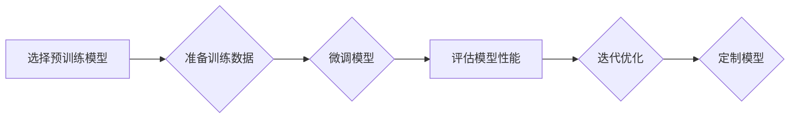

> 大规模语言模型，Transformer，深度学习，自然语言处理，模型定制，迁移学习，应用场景

## 1. 背景介绍

近年来，大规模语言模型（LLM）在自然语言处理（NLP）领域取得了令人瞩目的成就。从 GPT-3 的惊艳表现到 BERT 的广泛应用，LLM 已经成为 NLP 领域的核心技术之一。这些模型通过学习海量文本数据，能够执行各种复杂的任务，例如文本生成、翻译、问答和代码生成。

然而，现有的开源 LLM 模型通常是针对通用任务训练的，其性能在特定领域或任务上可能并不理想。因此，如何定制 LLM 模型以满足特定应用场景的需求，成为一个重要的研究方向。

## 2. 核心概念与联系

**2.1  Transformer 架构**

Transformer 架构是 LLMs 的基础，它利用自注意力机制（Self-Attention）和多头注意力机制（Multi-Head Attention）来捕捉文本序列中的长距离依赖关系。

**2.2  迁移学习**

迁移学习是指利用预训练模型在特定任务上的知识，通过微调的方式提升模型性能。在 LLM 定制中，迁移学习是一种常用的方法，可以有效降低训练成本和时间。

**2.3  模型定制流程**

模型定制流程通常包括以下步骤：

1. 选择合适的预训练模型。
2. 准备特定领域的训练数据。
3. 对预训练模型进行微调。
4. 评估模型性能。
5. 迭代优化模型参数。

**2.4  Mermaid 流程图**

## 3. 核心算法原理 & 具体操作步骤

**3.1  算法原理概述**

LLMs 的训练基于深度学习的原理，利用反向传播算法（Backpropagation）来优化模型参数。训练目标通常是最大化模型在训练数据上的似然概率。

**3.2  算法步骤详解**

1. **数据预处理:** 将文本数据转换为模型可理解的格式，例如词嵌入（Word Embedding）。
2. **模型训练:** 使用反向传播算法训练模型参数，目标是最大化模型在训练数据上的似然概率。
3. **模型评估:** 使用测试数据评估模型性能，常用的指标包括准确率、召回率和 F1-score。
4. **模型微调:** 根据评估结果，调整模型参数以提升性能。

**3.3  算法优缺点**

**优点:**

* 能够学习复杂的语言模式。
* 性能优于传统机器学习方法。
* 可用于各种 NLP 任务。

**缺点:**

* 训练成本高，需要大量计算资源。
* 训练数据质量对模型性能影响较大。
* 模型解释性较差。

**3.4  算法应用领域**

LLMs 广泛应用于以下领域：

* 文本生成
* 机器翻译
* 问答系统
* 代码生成
* 情感分析

## 4. 数学模型和公式 & 详细讲解 & 举例说明

**4.1  数学模型构建**

LLMs 通常基于 Transformer 架构，其核心是自注意力机制和多头注意力机制。

**4.2  公式推导过程**

自注意力机制的计算公式如下：

$$
Attention(Q, K, V) = softmax(\frac{QK^T}{\sqrt{d_k}})V
$$

其中：

* $Q$：查询矩阵
* $K$：键矩阵
* $V$：值矩阵
* $d_k$：键向量的维度
* $softmax$：softmax 函数

**4.3  案例分析与讲解**

假设我们有一个句子 "The cat sat on the mat"，将其转换为词嵌入向量，得到 $Q$, $K$, $V$ 三个矩阵。通过自注意力机制计算，可以得到每个词对其他词的注意力权重，从而捕捉句子中的语义关系。

## 5. 项目实践：代码实例和详细解释说明

**5.1  开发环境搭建**

使用 Python 语言和深度学习框架 TensorFlow 或 PyTorch 搭建开发环境。

**5.2  源代码详细实现**

使用预训练模型（例如 BERT 或 GPT-2）作为基础，对模型进行微调。

**5.3  代码解读与分析**

解释代码中使用的函数和参数，以及模型训练和评估过程。

**5.4  运行结果展示**

展示模型在特定任务上的性能指标，例如文本生成质量或问答准确率。

## 6. 实际应用场景

**6.1  文本生成**

LLMs 可以用于生成各种类型的文本，例如小说、诗歌、新闻报道和代码。

**6.2  机器翻译**

LLMs 可以用于将文本从一种语言翻译成另一种语言。

**6.3  问答系统**

LLMs 可以用于构建问答系统，能够回答用户提出的问题。

**6.4  未来应用展望**

LLMs 有潜力应用于更多领域，例如教育、医疗和法律。

## 7. 工具和资源推荐

**7.1  学习资源推荐**

* Transformer 原文论文
* Hugging Face 库
* TensorFlow 和 PyTorch 官方文档

**7.2  开发工具推荐**

* Jupyter Notebook
* Git

**7.3  相关论文推荐**

* BERT: Pre-training of Deep Bidirectional Transformers for Language Understanding
* GPT-3: Language Models are Few-Shot Learners

## 8. 总结：未来发展趋势与挑战

**8.1  研究成果总结**

LLMs 在 NLP 领域取得了显著进展，但仍存在一些挑战。

**8.2  未来发展趋势**

* 模型规模和性能的进一步提升
* 模型解释性和可解释性的增强
* 模型的安全性、可靠性和公平性的研究

**8.3  面临的挑战**

* 训练成本高
* 数据偏见和公平性问题
* 模型安全性问题

**8.4  研究展望**

未来研究将重点关注解决上述挑战，并探索 LLMs 在更多领域的新应用。

## 9. 附录：常见问题与解答

**9.1  常见问题**

* 如何选择合适的预训练模型？
* 如何准备训练数据？
* 如何评估模型性能？

**9.2  解答**

* 选择预训练模型应根据具体任务和数据特点进行。
* 训练数据应高质量、相关且多样化。
* 模型性能可以通过准确率、召回率和 F1-score 等指标评估。

作者：禅与计算机程序设计艺术 / Zen and the Art of Computer Programming 
<end_of_turn>