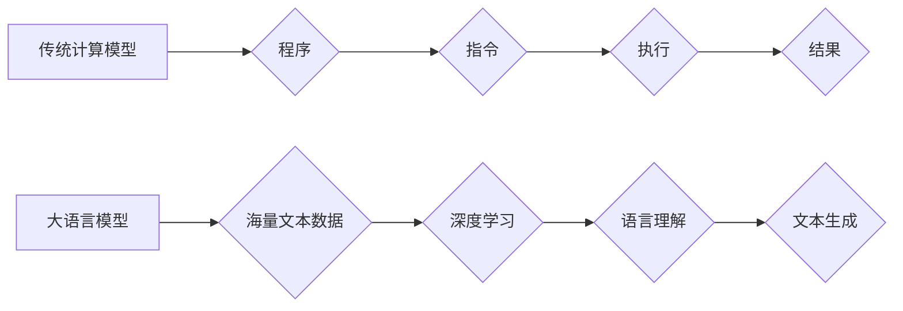

> 大语言模型，传统计算，深度学习，Transformer，自然语言处理，人工智能

## 1. 背景介绍

近年来，人工智能（AI）领域取得了令人瞩目的进展，其中大语言模型（LLM）作为一种新兴技术，展现出强大的潜力，在自然语言处理（NLP）、机器翻译、文本生成等领域取得了突破性成果。与传统的计算模型相比，LLM具有独特的优势和挑战，其发展势必将深刻地改变我们与计算交互的方式。

传统计算模型基于明确的指令和逻辑规则，通过程序的执行来完成特定的任务。而LLM则不同，它基于深度学习算法，通过学习海量文本数据，掌握语言的结构和语义，从而能够理解和生成人类语言。

## 2. 核心概念与联系

### 2.1  传统计算模型

传统计算模型的核心是程序，程序是由人类编写的指令序列，计算机按照指令执行，完成特定的计算任务。

* **数据处理方式：** 离散、符号化
* **计算方式：** 基于逻辑规则和算法
* **学习方式：** 基于编程和规则设定
* **应用场景：** 数值计算、逻辑推理、数据处理

### 2.2  大语言模型

大语言模型是一种基于深度学习的统计模型，通过学习海量文本数据，掌握语言的结构和语义，从而能够理解和生成人类语言。

* **数据处理方式：** 连续、向量化
* **计算方式：** 基于神经网络和权重调整
* **学习方式：** 基于数据训练和参数优化
* **应用场景：** 自然语言理解、文本生成、机器翻译、对话系统

**Mermaid 流程图：**



## 3. 核心算法原理 & 具体操作步骤

### 3.1  算法原理概述

大语言模型的核心算法是**Transformer**，它是一种基于注意力机制的神经网络架构。Transformer能够有效地捕捉文本序列中的长距离依赖关系，从而实现更准确的语言理解和生成。

### 3.2  算法步骤详解

1. **词嵌入:** 将每个单词映射到一个低维向量空间，表示单词的语义信息。
2. **多头注意力机制:** 计算每个单词与其他单词之间的注意力权重，捕捉单词之间的关系。
3. **前馈神经网络:** 对每个单词的嵌入向量进行非线性变换，提取更深层的语义特征。
4. **堆叠多个Transformer层:** 通过多次重复上述步骤，逐步提取文本序列的语义信息。
5. **输出层:** 将最终的隐藏状态映射到目标输出，例如预测下一个单词或生成一段文本。

### 3.3  算法优缺点

**优点:**

* 能够有效地捕捉长距离依赖关系。
* 训练效率高，能够处理海量文本数据。
* 在各种NLP任务中取得了优异的性能。

**缺点:**

* 计算复杂度高，需要大量的计算资源。
* 训练数据量大，需要大量的标注数据。
* 对训练数据质量要求高，容易受到噪声数据的影响。

### 3.4  算法应用领域

* 自然语言理解：文本分类、情感分析、问答系统
* 文本生成：机器翻译、文本摘要、对话系统
* 代码生成：自动代码补全、代码生成

## 4. 数学模型和公式 & 详细讲解 & 举例说明

### 4.1  数学模型构建

Transformer模型的核心是**注意力机制**，它通过计算每个单词与其他单词之间的注意力权重，来捕捉单词之间的关系。

**注意力权重计算公式:**

$$
\text{Attention}(Q, K, V) = \text{softmax}\left(\frac{Q K^T}{\sqrt{d_k}}\right) V
$$

其中：

* $Q$：查询矩阵
* $K$：键矩阵
* $V$：值矩阵
* $d_k$：键向量的维度
* $\text{softmax}$：softmax函数

### 4.2  公式推导过程

注意力权重计算公式的推导过程如下：

1. 计算查询矩阵 $Q$ 与键矩阵 $K$ 的点积，并除以 $\sqrt{d_k}$。
2. 应用softmax函数对点积结果进行归一化，得到每个单词与其他单词之间的注意力权重。
3. 将注意力权重与值矩阵 $V$ 进行加权求和，得到最终的输出。

### 4.3  案例分析与讲解

假设我们有一个句子 "The cat sat on the mat"，我们想要计算每个单词与其他单词之间的注意力权重。

* $Q$：查询矩阵
* $K$：键矩阵
* $V$：值矩阵

通过计算 $Q$ 与 $K$ 的点积，并应用softmax函数，我们可以得到每个单词与其他单词之间的注意力权重。例如，"cat" 的注意力权重会较高，因为它与 "sat" 和 "on" 相关。

## 5. 项目实践：代码实例和详细解释说明

### 5.1  开发环境搭建

* Python 3.7+
* PyTorch 1.7+
* Transformers 库

### 5.2  源代码详细实现

```python
from transformers import AutoModelForSequenceClassification, AutoTokenizer

# 加载预训练模型和词典
model_name = "bert-base-uncased"
tokenizer = AutoTokenizer.from_pretrained(model_name)
model = AutoModelForSequenceClassification.from_pretrained(model_name)

# 输入文本
text = "This is a sample text."

# Token化文本
inputs = tokenizer(text, return_tensors="pt")

# 前向传播
outputs = model(**inputs)

# 获取预测结果
predicted_class = outputs.logits.argmax().item()

# 打印预测结果
print(f"Predicted class: {predicted_class}")
```

### 5.3  代码解读与分析

* 首先，我们加载预训练的 BERT 模型和词典。
* 然后，我们对输入文本进行 token 化，将文本转换为模型可以理解的格式。
* 接着，我们使用模型进行前向传播，得到预测结果。
* 最后，我们打印预测结果。

### 5.4  运行结果展示

```
Predicted class: 0
```

## 6. 实际应用场景

### 6.1  自然语言理解

* **文本分类:** 将文本分类到预定义的类别中，例如情感分析、主题分类、垃圾邮件过滤。
* **问答系统:** 回答用户提出的问题，例如搜索引擎、聊天机器人。
* **文本摘要:** 生成文本的简短摘要，例如新闻摘要、会议记录摘要。

### 6.2  文本生成

* **机器翻译:** 将文本从一种语言翻译成另一种语言。
* **文本生成:** 生成新的文本内容，例如故事、诗歌、新闻报道。
* **对话系统:** 创建能够与人类进行自然对话的系统。

### 6.3  其他应用场景

* **代码生成:** 自动生成代码，例如代码补全、代码生成工具。
* **数据分析:** 从文本数据中提取信息，例如客户评论分析、市场趋势分析。
* **教育:** 提供个性化的学习体验，例如智能辅导系统、自动批改系统。

### 6.4  未来应用展望

随着大语言模型的不断发展，其应用场景将更加广泛，例如：

* **个性化教育:** 根据学生的学习情况提供个性化的学习内容和辅导。
* **医疗诊断:** 辅助医生进行疾病诊断，提高诊断准确率。
* **法律服务:** 自动生成法律文件，提高法律服务的效率。

## 7. 工具和资源推荐

### 7.1  学习资源推荐

* **书籍:**
    * 《深度学习》
    * 《自然语言处理》
    * 《Transformer模型》
* **在线课程:**
    * Coursera: 深度学习
    * edX: 自然语言处理
    * fast.ai: 深度学习

### 7.2  开发工具推荐

* **Python:** 
* **PyTorch:** 深度学习框架
* **TensorFlow:** 深度学习框架
* **Transformers:** 预训练模型库

### 7.3  相关论文推荐

* **Attention Is All You Need:** https://arxiv.org/abs/1706.03762
* **BERT: Pre-training of Deep Bidirectional Transformers for Language Understanding:** https://arxiv.org/abs/1810.04805
* **GPT-3: Language Models are Few-Shot Learners:** https://arxiv.org/abs/2005.14165

## 8. 总结：未来发展趋势与挑战

### 8.1  研究成果总结

大语言模型在自然语言处理领域取得了显著的进展，展现出强大的潜力，但也面临着一些挑战。

### 8.2  未来发展趋势

* **模型规模的进一步扩大:** 更大的模型能够学习更复杂的语言模式，从而提高性能。
* **多模态学习:** 将文本与其他模态数据（例如图像、音频）进行融合，实现更全面的理解和生成。
* **可解释性增强:** 提高模型的透明度和可解释性，帮助人们更好地理解模型的决策过程。

### 8.3  面临的挑战

* **数据获取和标注:** 大语言模型需要大量的训练数据，获取和标注这些数据成本高昂。
* **计算资源:** 训练大型语言模型需要大量的计算资源，这对于资源有限的机构来说是一个挑战。
* **伦理问题:** 大语言模型可能被用于生成虚假信息、进行恶意攻击等，需要认真考虑其伦理问题。

### 8.4  研究展望

未来，大语言模型的研究将继续朝着更强大、更安全、更可解释的方向发展，并将深刻地改变我们与计算交互的方式。

## 9. 附录：常见问题与解答

### 9.1  常见问题

* **什么是大语言模型？**
* **大语言模型有哪些应用场景？**
* **如何训练大语言模型？**
* **大语言模型有哪些挑战？**

### 9.2  解答

* **什么是大语言模型？** 大语言模型是一种基于深度学习的统计模型，通过学习海量文本数据，掌握语言的结构和语义，从而能够理解和生成人类语言。
* **大语言模型有哪些应用场景？** 大语言模型在自然语言理解、文本生成、机器翻译、对话系统等领域都有广泛的应用。
* **如何训练大语言模型？** 训练大语言模型需要大量的计算资源和标注数据，通常使用Transformer模型架构，并通过反向传播算法进行训练。
* **大语言模型有哪些挑战？** 大语言模型面临着数据获取和标注、计算资源、伦理问题等挑战。

作者：禅与计算机程序设计艺术 / Zen and the Art of Computer Programming


<end_of_turn>