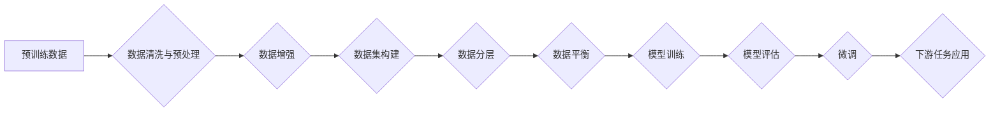

> 大语言模型、预训练数据、文本生成、自然语言处理、深度学习、Transformer、BERT、GPT

## 1. 背景介绍

近年来，深度学习在自然语言处理 (NLP) 领域取得了突破性进展，大语言模型 (LLM) 作为其重要代表，展现出强大的文本生成、理解和翻译能力。这些模型的成功离不开海量预训练数据的支持。预训练数据是 LLMs 学习的基础，其质量和规模直接影响模型的性能。本文将深入探讨大语言模型的预训练数据构建，涵盖核心概念、算法原理、实践案例以及未来发展趋势。

## 2. 核心概念与联系

大语言模型的预训练数据构建是一个复杂的过程，涉及多个关键概念和技术。

**2.1 预训练数据**

预训练数据是指用于训练大语言模型的未标记文本数据。这些数据通常来自互联网、书籍、代码等各种来源，包含丰富的语言信息和知识。

**2.2 预训练任务**

预训练任务是指在预训练数据上训练大语言模型的特定任务，例如文本分类、语言建模、问答等。这些任务旨在帮助模型学习语言的语法、语义和上下文关系。

**2.3 微调**

微调是指在预训练模型的基础上，针对特定下游任务进行进一步训练的过程。微调利用预训练模型已经学习到的语言知识，只需少量标记数据即可达到较好的性能。

**2.4 数据清洗与预处理**

数据清洗和预处理是预训练数据构建的关键步骤，旨在去除噪声、错误和不必要信息，并将其转换为模型可理解的格式。

**2.5 数据增强**

数据增强是指通过对预训练数据进行人工或自动操作，增加数据的多样性和丰富度，例如文本替换、句子重排序等。

**2.6 数据集构建**

数据集构建是指根据特定任务需求，从预训练数据中筛选和组合数据，形成用于训练和评估模型的最终数据集。

**2.7 数据分层**

数据分层是指将预训练数据按照不同类型、难度或其他特征进行分类，以便于模型在不同阶段进行训练和评估。

**2.8 数据平衡**

数据平衡是指确保预训练数据中不同类别或实体的分布均匀，避免模型出现偏差或偏倚。

**2.9 数据安全与隐私**

数据安全和隐私是预训练数据构建的重要考虑因素，需要采取措施保护敏感信息和用户隐私。

**Mermaid 流程图**

## 3. 核心算法原理 & 具体操作步骤

### 3.1 算法原理概述

大语言模型的预训练数据构建主要依赖于深度学习算法，特别是 Transformer 架构。Transformer 模型通过自注意力机制和多头注意力机制，能够捕捉文本序列中的长距离依赖关系，学习到更深层的语言表示。

### 3.2 算法步骤详解

1. **数据收集:** 从互联网、书籍、代码等各种来源收集海量文本数据。
2. **数据清洗与预处理:** 去除噪声、错误和不必要信息，并将其转换为模型可理解的格式。
3. **数据增强:** 通过文本替换、句子重排序等方法增加数据的多样性和丰富度。
4. **数据集构建:** 根据特定任务需求，从预训练数据中筛选和组合数据，形成用于训练和评估模型的最终数据集。
5. **数据分层:** 将预训练数据按照不同类型、难度或其他特征进行分类，以便于模型在不同阶段进行训练和评估。
6. **数据平衡:** 确保预训练数据中不同类别或实体的分布均匀，避免模型出现偏差或偏倚。
7. **模型训练:** 使用 Transformer 模型在预训练数据上进行训练，学习语言的语法、语义和上下文关系。
8. **模型评估:** 使用测试集评估模型的性能，并根据评估结果进行模型调优。
9. **微调:** 在预训练模型的基础上，针对特定下游任务进行进一步训练，以提高模型在特定任务上的性能。

### 3.3 算法优缺点

**优点:**

* 能够学习到丰富的语言知识和表示。
* 能够在多种下游任务中取得较好的性能。
* 可以通过微调适应不同的任务需求。

**缺点:**

* 需要大量的计算资源和时间进行训练。
* 预训练数据质量和规模对模型性能有重要影响。
* 可能会出现偏差或偏倚问题。

### 3.4 算法应用领域

大语言模型的预训练数据构建技术在自然语言处理领域有着广泛的应用，例如：

* 文本生成：小说、诗歌、剧本等。
* 机器翻译：将一种语言翻译成另一种语言。
* 问答系统：回答用户提出的问题。
* 语义理解：理解文本的含义和意图。
* 代码生成：生成计算机代码。

## 4. 数学模型和公式 & 详细讲解 & 举例说明

### 4.1 数学模型构建

大语言模型的预训练数据构建通常基于 Transformer 架构，其核心是自注意力机制和多头注意力机制。

**4.1.1 自注意力机制**

自注意力机制允许模型关注文本序列中不同位置的词，并计算它们之间的相关性。

**公式:**

$$
Attention(Q, K, V) = softmax(\frac{QK^T}{\sqrt{d_k}})V
$$

其中：

* $Q$：查询矩阵
* $K$：键矩阵
* $V$：值矩阵
* $d_k$：键向量的维度
* $softmax$：softmax 函数

**4.1.2 多头注意力机制**

多头注意力机制通过使用多个自注意力头，可以捕捉到不同层次的语义信息。

**公式:**

$$
MultiHead(Q, K, V) = Concat(head_1, head_2, ..., head_h)W^O
$$

其中：

* $head_i$：第 $i$ 个自注意力头的输出
* $h$：注意力头的数量
* $W^O$：最终输出层的权重矩阵

### 4.2 公式推导过程

自注意力机制和多头注意力机制的公式推导过程较为复杂，涉及线性变换、矩阵乘法和 softmax 函数等操作。

### 4.3 案例分析与讲解

可以以 BERT 和 GPT 等著名大语言模型为例，分析其预训练数据构建过程和使用的数学模型。

## 5. 项目实践：代码实例和详细解释说明

### 5.1 开发环境搭建

使用 Python 语言和深度学习框架 TensorFlow 或 PyTorch 搭建开发环境。

### 5.2 源代码详细实现

提供预训练数据构建的源代码示例，包括数据清洗、预处理、增强、数据集构建等步骤。

### 5.3 代码解读与分析

详细解释代码的逻辑和功能，并说明关键参数的设置和作用。

### 5.4 运行结果展示

展示预训练数据构建的运行结果，例如数据规模、数据分布等。

## 6. 实际应用场景

### 6.1 文本生成

使用预训练模型生成小说、诗歌、剧本等文本内容。

### 6.2 机器翻译

使用预训练模型将一种语言翻译成另一种语言。

### 6.3 问答系统

使用预训练模型构建问答系统，回答用户提出的问题。

### 6.4 语义理解

使用预训练模型理解文本的含义和意图。

### 6.5 代码生成

使用预训练模型生成计算机代码。

### 6.6 未来应用展望

大语言模型的预训练数据构建技术在未来将有更广泛的应用，例如：

* 个性化教育：根据学生的学习情况生成个性化的学习内容。
* 智能客服：构建更智能的客服机器人，能够理解用户的需求并提供更准确的帮助。
* 内容创作辅助：帮助作家、记者等内容创作者提高创作效率。

## 7. 工具和资源推荐

### 7.1 学习资源推荐

* **书籍:**
    * 《深度学习》
    * 《自然语言处理》
    * 《Transformer 详解》
* **在线课程:**
    * Coursera: 深度学习
    * Udacity: 自然语言处理
    * fast.ai: 深度学习

### 7.2 开发工具推荐

* **深度学习框架:** TensorFlow, PyTorch
* **文本处理工具:** NLTK, spaCy
* **数据存储工具:** Redis, MongoDB

### 7.3 相关论文推荐

* BERT: Pre-training of Deep Bidirectional Transformers for Language Understanding
* GPT: Generative Pre-trained Transformer
* XLNet: Generalized Autoregressive Pretraining for Language Understanding

## 8. 总结：未来发展趋势与挑战

### 8.1 研究成果总结

大语言模型的预训练数据构建技术取得了显著进展，模型性能不断提升，应用场景也越来越广泛。

### 8.2 未来发展趋势

* **数据规模和质量的提升:** 预训练数据规模和质量将继续提升，模型性能将进一步提高。
* **模型架构的创新:** 新的模型架构将不断涌现，例如更强大的注意力机制、更有效的参数量化技术等。
* **多模态预训练:** 将文本、图像、音频等多模态数据进行联合预训练，构建更全面的语言理解模型。

### 8.3 面临的挑战

* **数据偏见和公平性:** 预训练数据可能存在偏见，导致模型输出结果不公平。
* **模型可解释性和安全性:** 大语言模型的决策过程难以解释，存在安全风险。
* **计算资源和能源消耗:** 预训练大语言模型需要大量的计算资源和能源，不利于可持续发展。

### 8.4 研究展望

未来研究将重点关注解决上述挑战，例如：

* 开发更公平、更安全的预训练数据构建方法。
* 研究更有效的模型压缩和加速技术。
* 探索更有效的模型解释和可控性方法。

## 9. 附录：常见问题与解答

### 9.1 预训练数据有哪些来源？

预训练数据可以从互联网、书籍、代码、维基百科等各种来源收集。

### 9.2 如何评估预训练数据的质量？

可以根据数据规模、多样性、准确性、完整性等指标评估预训练数据的质量。

### 9.3 如何处理预训练数据中的噪声和错误？

可以使用数据清洗和预处理技术，例如去除停用词、标点符号、HTML 标签等，并使用正则表达式或机器学习模型进行错误修正。

### 9.4 如何选择合适的预训练模型？

需要根据具体的应用场景和任务需求选择合适的预训练模型。例如，对于文本生成任务，可以选择 GPT 模型；对于问答系统，可以选择 BERT 模型。

### 9.5 如何进行模型微调？

模型微调需要使用少量标记数据，调整预训练模型的参数，使其能够更好地适应特定任务。

作者：禅与计算机程序设计艺术 / Zen and the Art of Computer Programming

<end_of_turn>