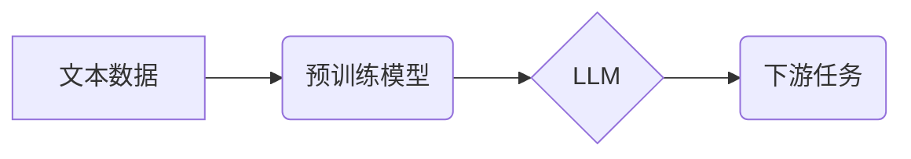

> 大语言模型、预训练模型、Transformer、BERT、GPT、LLM应用、自然语言处理

## 1. 背景介绍

近年来，深度学习技术取得了飞速发展，特别是自然语言处理（NLP）领域，大语言模型（LLM）的出现掀起了新的技术浪潮。LLM是指在海量文本数据上进行预训练的深度学习模型，能够理解和生成人类语言，并具备强大的文本生成、翻译、问答、摘要等能力。

传统的NLP模型通常需要针对特定任务进行专门训练，训练数据量相对较小，效果有限。而LLM通过预训练的方式，学习了语言的语法、语义和上下文关系，拥有更广阔的知识储备和更强的泛化能力。这意味着，无需额外训练，即可利用预训练的LLM模型进行各种NLP任务，大大降低了开发门槛和时间成本。

## 2. 核心概念与联系

**2.1 预训练模型**

预训练模型是指在大量通用数据上进行训练的模型，其目标不是解决特定任务，而是学习语言的通用表示。预训练模型可以用于各种下游任务，例如文本分类、情感分析、机器翻译等。

**2.2 Transformer**

Transformer是一种新型的深度学习架构，其核心是注意力机制，能够有效地捕捉文本序列中的长距离依赖关系。Transformer的出现极大地推动了LLM的发展，使其能够处理更长的文本序列，并获得更好的性能。

**2.3 大语言模型 (LLM)**

大语言模型是指基于Transformer架构，在海量文本数据上进行预训练的深度学习模型。LLM拥有强大的语言理解和生成能力，能够执行各种自然语言处理任务，例如文本生成、翻译、问答、摘要等。

**2.4 流程图**



## 3. 核心算法原理 & 具体操作步骤

**3.1 算法原理概述**

LLM的核心算法是Transformer，其主要特点是：

* **注意力机制:**  注意力机制能够有效地捕捉文本序列中的长距离依赖关系，提高模型的理解能力。
* **多头注意力:** 多头注意力机制使用多个注意力头，可以从不同的角度捕捉文本信息，增强模型的表达能力。
* **位置编码:**  Transformer模型无法直接理解文本序列中的位置信息，因此需要使用位置编码来嵌入位置信息。
* **堆叠结构:** Transformer模型通常由多个编码器和解码器层组成，通过堆叠结构，可以学习更深层次的语言表示。

**3.2 算法步骤详解**

1. **数据预处理:** 将文本数据进行清洗、分词、标记等预处理操作，使其能够被模型理解。
2. **模型训练:** 使用预训练模型在海量文本数据上进行训练，学习语言的通用表示。
3. **下游任务 fine-tuning:** 将预训练模型用于特定下游任务，通过微调模型参数，使其能够更好地完成目标任务。

**3.3 算法优缺点**

**优点:**

* 强大的语言理解和生成能力
* 泛化能力强，能够应用于多种下游任务
* 训练效率高，无需大量标注数据

**缺点:**

* 模型规模大，训练成本高
* 存在潜在的偏差和错误

**3.4 算法应用领域**

* 文本生成：小说、诗歌、剧本等
* 机器翻译：将一种语言翻译成另一种语言
* 问答系统：回答用户提出的问题
* 摘要生成：生成文本的简短摘要
* 情感分析：分析文本的情感倾向

## 4. 数学模型和公式 & 详细讲解 & 举例说明

**4.1 数学模型构建**

Transformer模型的核心是注意力机制，其数学模型可以表示为：

$$
Attention(Q, K, V) = softmax(\frac{QK^T}{\sqrt{d_k}})V
$$

其中：

* $Q$：查询矩阵
* $K$：键矩阵
* $V$：值矩阵
* $d_k$：键向量的维度
* $softmax$：softmax函数

**4.2 公式推导过程**

注意力机制的目的是计算查询向量 $Q$ 与键向量 $K$ 之间的相似度，然后根据相似度加权求和值向量 $V$。

* $QK^T$：计算查询向量与键向量的点积，得到一个得分矩阵。
* $\frac{QK^T}{\sqrt{d_k}}$：对得分矩阵进行归一化，使得每个元素的范围在0到1之间。
* $softmax$：对归一化后的得分矩阵进行softmax操作，得到每个键向量的权重。
* $softmax(\frac{QK^T}{\sqrt{d_k}})V$：将权重与值向量 $V$ 进行加权求和，得到最终的注意力输出。

**4.3 案例分析与讲解**

假设我们有一个句子 "The cat sat on the mat"，我们想要计算 "cat" 与 "sat" 之间的注意力权重。

* $Q$：查询向量为 "cat" 的词向量
* $K$：键向量为 "sat" 的词向量
* $V$：值向量为 "sat" 的词向量

通过计算 $QK^T$、归一化和 softmax 操作，我们可以得到 "cat" 与 "sat" 之间的注意力权重，该权重表示 "cat" 和 "sat" 之间的语义相关性。

## 5. 项目实践：代码实例和详细解释说明

**5.1 开发环境搭建**

* Python 3.7+
* PyTorch 或 TensorFlow
* CUDA 和 cuDNN (可选，用于GPU加速)

**5.2 源代码详细实现**

```python
import torch
import torch.nn as nn

class Attention(nn.Module):
    def __init__(self, d_model, num_heads):
        super(Attention, self).__init__()
        self.d_model = d_model
        self.num_heads = num_heads
        self.head_dim = d_model // num_heads

        self.query = nn.Linear(d_model, d_model)
        self.key = nn.Linear(d_model, d_model)
        self.value = nn.Linear(d_model, d_model)
        self.fc_out = nn.Linear(d_model, d_model)

    def forward(self, query, key, value, mask=None):
        batch_size = query.size(0)

        # Linear projections
        Q = self.query(query).view(batch_size, -1, self.num_heads, self.head_dim).transpose(1, 2)
        K = self.key(key).view(batch_size, -1, self.num_heads, self.head_dim).transpose(1, 2)
        V = self.value(value).view(batch_size, -1, self.num_heads, self.head_dim).transpose(1, 2)

        # Scaled dot-product attention
        scores = torch.matmul(Q, K.transpose(-2, -1)) / torch.sqrt(torch.tensor(self.head_dim, dtype=torch.float))
        if mask is not None:
            scores = scores.masked_fill(mask == 0, -1e9)
        attention_weights = torch.softmax(scores, dim=-1)

        # Weighted sum of values
        context = torch.matmul(attention_weights, V)

        # Concatenate heads and project
        context = context.transpose(1, 2).contiguous().view(batch_size, -1, self.d_model)
        output = self.fc_out(context)

        return output, attention_weights
```

**5.3 代码解读与分析**

* `Attention` 类定义了注意力机制的计算过程。
* `forward` 方法接收查询向量、键向量和值向量作为输入，并返回注意力输出和注意力权重。
* `query`、`key` 和 `value` 是线性变换层，将输入向量映射到不同的维度。
* `softmax` 函数计算注意力权重，使得每个键向量的权重在0到1之间。
* `fc_out` 是一个线性变换层，将注意力输出映射回原始维度。

**5.4 运行结果展示**

运行上述代码，可以计算出给定输入的注意力权重，并可视化注意力权重分布，观察模型对不同词语的关注程度。

## 6. 实际应用场景

**6.1 文本生成**

LLM可以用于生成各种类型的文本，例如小说、诗歌、剧本等。例如，GPT-3可以根据给定的提示生成连贯、流畅的文本。

**6.2 机器翻译**

LLM可以用于将一种语言翻译成另一种语言。例如，BERT-based机器翻译模型在多个语言对上取得了state-of-the-art的性能。

**6.3 问答系统**

LLM可以用于构建问答系统，回答用户提出的问题。例如，基于LLM的问答系统可以理解用户的自然语言问题，并从知识库中找到相应的答案。

**6.4 摘要生成**

LLM可以用于生成文本的简短摘要。例如，可以利用LLM自动生成新闻文章的摘要，节省用户阅读时间。

**6.5 情感分析**

LLM可以用于分析文本的情感倾向，例如判断文本是正面、负面还是中性的。

**6.6 未来应用展望**

LLM在未来将有更广泛的应用场景，例如：

* 个性化教育：根据学生的学习情况，提供个性化的学习内容和辅导。
* 智能客服：提供更智能、更人性化的客服服务。
* 代码生成：根据自然语言描述，自动生成代码。
* 创意写作：协助人类进行创意写作，例如写诗、写小说等。

## 7. 工具和资源推荐

**7.1 学习资源推荐**

* **书籍:**
    * 《深度学习》 by Ian Goodfellow, Yoshua Bengio, and Aaron Courville
    * 《自然语言处理》 by Dan Jurafsky and James H. Martin
* **在线课程:**
    * Stanford CS224N: Natural Language Processing with Deep Learning
    * fast.ai: Practical Deep Learning for Coders

**7.2 开发工具推荐**

* **PyTorch:** https://pytorch.org/
* **TensorFlow:** https://www.tensorflow.org/
* **Hugging Face Transformers:** https://huggingface.co/transformers/

**7.3 相关论文推荐**

* **Attention Is All You Need:** https://arxiv.org/abs/1706.03762
* **BERT: Pre-training of Deep Bidirectional Transformers for Language Understanding:** https://arxiv.org/abs/1810.04805
* **GPT-3: Language Models are Few-Shot Learners:** https://arxiv.org/abs/2005.14165

## 8. 总结：未来发展趋势与挑战

**8.1 研究成果总结**

近年来，LLM取得了显著的进展，在各种NLP任务上取得了state-of-the-art的性能。预训练模型的出现极大地降低了开发门槛，使得更多人能够利用LLM进行NLP应用。

**8.2 未来发展趋势**

* **模型规模更大:** 未来LLM模型规模将继续扩大，拥有更强的语言理解和生成能力。
* **多模态学习:** LLM将与其他模态数据（例如图像、音频）进行融合，实现多模态理解和生成。
* **可解释性增强:** 研究人员将致力于提高LLM的可解释性，使得模型的决策过程更加透明。
* **安全性和鲁棒性:** 提高LLM的安全性，防止模型被恶意利用，并增强模型的鲁棒性，使其能够应对各种输入和场景。

**8.3 面临的挑战**