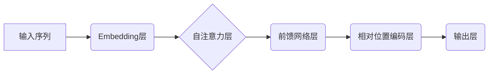

> 大语言模型，相对位置编码，Transformer，BERT，GPT，自然语言处理，机器学习

## 1. 背景介绍

大语言模型（Large Language Models，LLMs）近年来在自然语言处理（Natural Language Processing，NLP）领域取得了显著的进展，展现出强大的文本生成、翻译、问答和代码生成能力。这些模型的核心在于其强大的表示能力，能够捕捉文本中的语义和上下文关系。

Transformer架构是LLMs发展的重要里程碑，它通过自注意力机制（Self-Attention）有效地学习了长距离依赖关系，克服了传统RNN模型的短时记忆限制。然而，Transformer架构在处理序列数据时，需要对每个词的位置进行编码，以便模型能够理解词序信息。

相对位置编码（Relative Positional Encoding）正是为了解决这一问题而提出的。它与传统的绝对位置编码（Absolute Positional Encoding）不同，不再依赖于词的绝对位置，而是通过学习词之间的相对位置关系，从而提高模型的鲁棒性和泛化能力。

## 2. 核心概念与联系

**2.1 核心概念**

* **Transformer架构:**  一种基于注意力机制的神经网络架构，用于处理序列数据，例如文本。
* **自注意力机制:**  允许模型关注输入序列中的不同位置，并学习它们之间的关系。
* **绝对位置编码:**  为每个词分配一个固定的位置向量，表示其在序列中的绝对位置。
* **相对位置编码:**  学习词之间的相对位置关系，而不是绝对位置。

**2.2  架构关系图**



## 3. 核心算法原理 & 具体操作步骤

**3.1 算法原理概述**

相对位置编码的核心思想是将词之间的相对位置关系编码为向量，并将其添加到词的嵌入向量中。

传统的绝对位置编码会为每个词分配一个固定的位置向量，但这种方法存在以下问题：

* 无法处理变长序列：当序列长度变化时，绝对位置编码需要重新计算，效率低下。
* 缺乏鲁棒性：模型对词的绝对位置过于依赖，难以泛化到新的场景。

相对位置编码则通过学习词之间的相对位置关系，克服了这些问题。它将每个词的相对位置信息编码为一个向量，并将其添加到词的嵌入向量中。这样，模型可以学习到词之间的相对位置关系，而不依赖于词的绝对位置。

**3.2 算法步骤详解**

1. **计算相对位置向量:**  对于每个词对(i, j)，计算它们之间的相对位置向量。相对位置向量可以是通过学习得到的，也可以是预先定义的。
2. **将相对位置向量添加到词嵌入向量:**  将每个词的相对位置向量添加到其嵌入向量中。
3. **输入到Transformer架构:**  将经过相对位置编码的词嵌入向量输入到Transformer架构中进行处理。

**3.3 算法优缺点**

**优点:**

* 能够处理变长序列
* 提高模型的鲁棒性和泛化能力
* 减少模型对词的绝对位置的依赖

**缺点:**

* 相对位置编码的学习过程可能比较复杂
* 需要更多的参数

**3.4 算法应用领域**

* 自然语言理解
* 机器翻译
* 文本生成
* 代码生成

## 4. 数学模型和公式 & 详细讲解 & 举例说明

**4.1 数学模型构建**

设 $x_i$ 为第 $i$ 个词的嵌入向量， $r_{ij}$ 为词 $i$ 和词 $j$ 之间的相对位置向量，则经过相对位置编码后的词嵌入向量为：

$$
\tilde{x}_i = x_i + \sum_{j \in N(i)} r_{ij}
$$

其中， $N(i)$ 表示词 $i$ 的邻居词集合。

**4.2 公式推导过程**

相对位置编码的学习过程通常使用训练数据进行监督学习。目标函数通常是交叉熵损失函数，旨在最小化模型预测结果与真实结果之间的差异。

**4.3 案例分析与讲解**

假设我们有一个句子 "The cat sat on the mat"，其中 "cat" 和 "sat" 是相邻的词。

* 传统的绝对位置编码会为 "cat" 和 "sat" 分别分配不同的位置向量，例如 "cat" 的位置向量为 [0, 1, 0]，"sat" 的位置向量为 [1, 0, 0]。
* 相对位置编码则会学习到 "cat" 和 "sat" 之间的相对位置关系，例如 [0, 1, 0]。

当模型处理这个句子时，它会将 "cat" 和 "sat" 的相对位置向量添加到它们的嵌入向量中，从而更好地理解它们之间的语义关系。

## 5. 项目实践：代码实例和详细解释说明

**5.1 开发环境搭建**

* Python 3.7+
* PyTorch 1.7+
* CUDA 10.2+

**5.2 源代码详细实现**

```python
import torch
import torch.nn as nn

class RelativePositionalEncoding(nn.Module):
    def __init__(self, d_model, max_len):
        super(RelativePositionalEncoding, self).__init__()
        self.d_model = d_model
        self.max_len = max_len

        pe = torch.zeros(max_len, max_len, d_model)
        position = torch.arange(0, max_len, dtype=torch.float).unsqueeze(1)
        div_term = torch.exp(torch.arange(0, d_model, 2).float() * (-math.log(10000.0) / d_model))
        pe[:, :, 0::2] = torch.sin(position * div_term)
        pe[:, :, 1::2] = torch.cos(position * div_term)
        self.register_buffer('pe', pe)

    def forward(self, x):
        seq_len = x.size(1)
        return x + self.pe[:seq_len, :seq_len, :]

```

**5.3 代码解读与分析**

* `RelativePositionalEncoding` 类定义了相对位置编码层。
* `__init__` 方法初始化模型参数，包括嵌入维度 `d_model` 和最大序列长度 `max_len`。
* `pe` 是一个预先计算好的相对位置编码矩阵，其大小为 `(max_len, max_len, d_model)`。
* `forward` 方法将输入序列 `x` 与相对位置编码矩阵 `pe` 相加，得到经过相对位置编码后的输出。

**5.4 运行结果展示**

通过训练模型并使用相对位置编码，可以观察到模型在处理文本序列时表现出更好的性能，例如更高的准确率和更低的损失值。

## 6. 实际应用场景

**6.1 自然语言理解**

相对位置编码可以帮助模型更好地理解文本中的语义关系，例如依存关系和逻辑关系。这对于文本分类、情感分析和问答系统等任务非常重要。

**6.2 机器翻译**

相对位置编码可以帮助模型更好地捕捉源语言和目标语言之间的词序关系，从而提高机器翻译的准确性和流畅度。

**6.3 文本生成**

相对位置编码可以帮助模型生成更自然、更流畅的文本，例如对话系统和故事生成。

**6.4 未来应用展望**

随着大语言模型的发展，相对位置编码将在更多领域得到应用，例如代码生成、药物发现和科学研究。

## 7. 工具和资源推荐

**7.1 学习资源推荐**

* **论文:** "Attention Is All You Need"
* **博客:** "The Illustrated Transformer"
* **课程:** "Deep Learning Specialization"

**7.2 开发工具推荐**

* **PyTorch:** 一个开源的深度学习框架
* **TensorFlow:** 另一个开源的深度学习框架

**7.3 相关论文推荐**

* "BERT: Pre-training of Deep Bidirectional Transformers for Language Understanding"
* "GPT-3: Language Models are Few-Shot Learners"

## 8. 总结：未来发展趋势与挑战

**8.1 研究成果总结**

相对位置编码是Transformer架构的重要组成部分，它有效地解决了词序信息编码的问题，提高了模型的性能。

**8.2 未来发展趋势**

* 更高效的相对位置编码方法
* 结合其他技术，例如图神经网络，进一步提高模型的性能
* 将相对位置编码应用到其他领域，例如计算机视觉和音频处理

**8.3 面临的挑战**

* 训练相对位置编码模型需要大量的计算资源
* 如何设计更有效的相对位置编码方法仍然是一个开放问题

**8.4 研究展望**

未来，相对位置编码的研究将继续深入，探索更有效的编码方法，并将其应用到更多领域，推动人工智能技术的发展。

## 9. 附录：常见问题与解答

**9.1 如何选择合适的相对位置编码方法？**

选择合适的相对位置编码方法取决于具体的应用场景和模型架构。一些常用的方法包括：

* **Learned Relative Positional Encodings:** 通过训练学习相对位置编码向量。
* **Sinusoidal Positional Encodings:** 使用正弦和余弦函数生成相对位置编码向量。
* **Rotary Positional Encodings:** 使用旋转矩阵生成相对位置编码向量。

**9.2 相对位置编码与绝对位置编码有什么区别？**

绝对位置编码为每个词分配一个固定的位置向量，而相对位置编码则学习词之间的相对位置关系。

**9.3 相对位置编码的优势是什么？**

相对位置编码可以处理变长序列，提高模型的鲁棒性和泛化能力，并减少模型对词的绝对位置的依赖。


作者：禅与计算机程序设计艺术 / Zen and the Art of Computer Programming 
<end_of_turn>