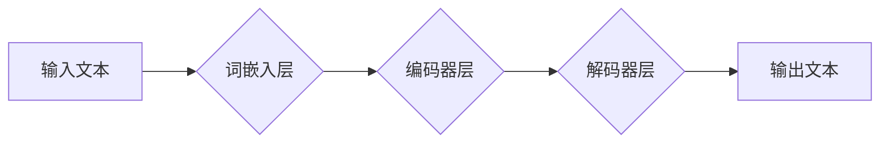

> 大语言模型、图灵机、神经网络、深度学习、自然语言处理、文本生成、机器翻译

## 1. 背景介绍

近年来，人工智能（AI）领域取得了令人瞩目的进展，其中大语言模型（LLM）作为一种强大的AI技术，在自然语言处理（NLP）领域展现出巨大的潜力。LLM能够理解和生成人类语言，并应用于各种场景，例如文本生成、机器翻译、问答系统等。

传统的NLP方法主要依赖于手工设计的规则和特征工程，而LLM则通过深度学习的方式，从海量文本数据中学习语言的模式和结构。这使得LLM能够处理更复杂的任务，并获得更准确的结果。

## 2. 核心概念与联系

### 2.1 图灵机

图灵机是理论计算机科学中的一种抽象模型，由英国数学家艾伦·图灵于1936年提出。它是一种无限的存储单元和一个有限状态机，通过一系列规则来处理输入数据。图灵机能够模拟任何算法，因此被认为是通用计算模型。

### 2.2 神经网络

神经网络是一种受生物神经网络启发的机器学习模型。它由多个层组成，每层包含多个神经元。神经元之间通过连接进行信息传递，每个连接都有一个权重。通过训练，神经网络可以学习到这些权重的最佳值，从而实现对数据的学习和预测。

### 2.3 核心概念联系

LLM本质上是一种基于深度学习的神经网络模型。它借鉴了图灵机的通用计算能力，并利用神经网络的学习能力，从海量文本数据中学习语言的模式和结构。

**Mermaid 流程图**



## 3. 核心算法原理 & 具体操作步骤

### 3.1 算法原理概述

LLM的核心算法是基于Transformer架构的深度学习模型。Transformer模型利用注意力机制，能够有效地捕捉文本序列中的长距离依赖关系。

### 3.2 算法步骤详解

1. **词嵌入:** 将输入文本中的每个词转换为一个低维向量，称为词嵌入。
2. **编码器:** 将词嵌入序列输入到编码器中，编码器通过多层Transformer模块，将文本序列编码成一个上下文向量。
3. **解码器:** 将上下文向量输入到解码器中，解码器通过自回归的方式，逐个生成输出文本的词。
4. **注意力机制:** Transformer模型中使用注意力机制，能够有效地捕捉文本序列中的长距离依赖关系。

### 3.3 算法优缺点

**优点:**

* 能够处理长文本序列
* 捕捉长距离依赖关系
* 性能优于传统的NLP方法

**缺点:**

* 计算量大
* 训练数据量大
* 容易出现过拟合

### 3.4 算法应用领域

* 文本生成
* 机器翻译
* 问答系统
* 文本摘要
* 代码生成

## 4. 数学模型和公式 & 详细讲解 & 举例说明

### 4.1 数学模型构建

LLM的数学模型主要基于神经网络，其中包括词嵌入层、编码器层和解码器层。

### 4.2 公式推导过程

Transformer模型的核心是注意力机制，其公式如下：

$$
Attention(Q, K, V) = \frac{exp(Q \cdot K^T / \sqrt{d_k})}{exp(Q \cdot K^T / \sqrt{d_k})} \cdot V
$$

其中：

* $Q$：查询矩阵
* $K$：键矩阵
* $V$：值矩阵
* $d_k$：键向量的维度

### 4.3 案例分析与讲解

注意力机制能够有效地捕捉文本序列中的长距离依赖关系。例如，在翻译句子“我爱吃苹果”时，注意力机制会将“苹果”与“吃”联系起来，从而准确地翻译为“I love eating apples”。

## 5. 项目实践：代码实例和详细解释说明

### 5.1 开发环境搭建

* Python 3.7+
* PyTorch 1.7+
* CUDA 10.2+

### 5.2 源代码详细实现

```python
import torch
import torch.nn as nn

class Transformer(nn.Module):
    def __init__(self, vocab_size, embedding_dim, num_heads, num_layers):
        super(Transformer, self).__init__()
        self.embedding = nn.Embedding(vocab_size, embedding_dim)
        self.encoder = nn.TransformerEncoder(nn.TransformerEncoderLayer(embedding_dim, num_heads), num_layers)
        self.decoder = nn.TransformerDecoder(nn.TransformerDecoderLayer(embedding_dim, num_heads), num_layers)
        self.linear = nn.Linear(embedding_dim, vocab_size)

    def forward(self, src, tgt):
        src = self.embedding(src)
        tgt = self.embedding(tgt)
        src = self.encoder(src)
        tgt = self.decoder(tgt, src)
        output = self.linear(tgt)
        return output
```

### 5.3 代码解读与分析

* `Transformer`类定义了Transformer模型的结构。
* `embedding`层将词转换为词嵌入向量。
* `encoder`层对输入序列进行编码。
* `decoder`层对输出序列进行解码。
* `linear`层将解码后的输出映射到词汇表。

### 5.4 运行结果展示

训练好的LLM模型可以用于各种NLP任务，例如文本生成、机器翻译等。

## 6. 实际应用场景

### 6.1 文本生成

LLM可以用于生成各种类型的文本，例如小说、诗歌、新闻报道等。

### 6.2 机器翻译

LLM可以用于将文本从一种语言翻译成另一种语言。

### 6.3 问答系统

LLM可以用于构建问答系统，能够回答用户提出的问题。

### 6.4 未来应用展望

LLM在未来将应用于更多领域，例如：

* 教育：个性化学习、智能辅导
* 医疗：疾病诊断、药物研发
* 法律：法律文本分析、合同审查

## 7. 工具和资源推荐

### 7.1 学习资源推荐

* **书籍:**
    * 《深度学习》
    * 《自然语言处理》
* **在线课程:**
    * Coursera: 自然语言处理
    * Udacity: 深度学习

### 7.2 开发工具推荐

* **框架:**
    * PyTorch
    * TensorFlow
* **库:**
    * Hugging Face Transformers

### 7.3 相关论文推荐

* 《Attention Is All You Need》
* 《BERT: Pre-training of Deep Bidirectional Transformers for Language Understanding》

## 8. 总结：未来发展趋势与挑战

### 8.1 研究成果总结

LLM在NLP领域取得了显著的进展，能够处理更复杂的任务，并获得更准确的结果。

### 8.2 未来发展趋势

* 模型规模更大
* 训练数据更多
* 应用场景更广泛

### 8.3 面临的挑战

* 计算资源需求大
* 训练数据标注成本高
* 伦理问题

### 8.4 研究展望

未来LLM的研究将更加注重模型的可解释性、鲁棒性和安全性。


## 9. 附录：常见问题与解答

### 9.1 什么是LLM？

LLM是指大语言模型，是一种能够理解和生成人类语言的AI模型。

### 9.2 LLM的训练数据是什么？

LLM的训练数据通常是海量文本数据，例如书籍、文章、网站内容等。

### 9.3 LLM有哪些应用场景？

LLM可以应用于各种NLP任务，例如文本生成、机器翻译、问答系统等。


作者：禅与计算机程序设计艺术 / Zen and the Art of Computer Programming 
<end_of_turn>