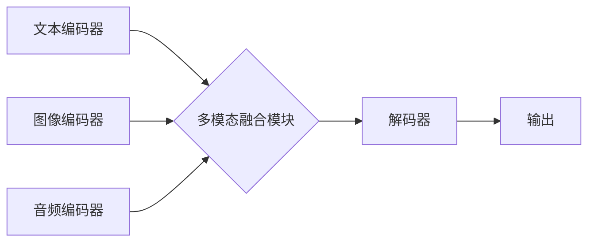

> 大语言模型、多模态学习、自然语言处理、计算机视觉、音频处理、跨模态理解、应用场景、未来趋势

## 1. 背景介绍

近年来，人工智能领域取得了令人瞩目的进展，其中大语言模型（LLM）作为一种强大的工具，在自然语言处理（NLP）领域展现出非凡的潜力。LLM能够理解和生成人类语言，并应用于各种任务，例如文本生成、翻译、问答、摘要等。然而，单模态的LLM仅限于处理文本信息，无法充分利用其他模态数据，如图像、音频等。

多模态学习旨在融合不同模态数据，构建更全面、更智能的模型。多模态大语言模型（MMLM）作为LLM的扩展，能够处理多种模态数据，并进行跨模态理解和生成。例如，MMLM可以理解图像并生成描述性文本，也可以根据音频内容进行文本摘要。

## 2. 核心概念与联系

**2.1 多模态学习概述**

多模态学习是指利用多种不同类型的数据（例如文本、图像、音频、视频等）来训练机器学习模型，以提高模型的理解能力和泛化能力。

**2.2 大语言模型概述**

大语言模型（LLM）是一种基于Transformer架构的深度学习模型，通过训练海量文本数据，学习语言的语法、语义和上下文关系。LLM能够理解和生成人类语言，并应用于各种自然语言处理任务。

**2.3 多模态大语言模型概述**

多模态大语言模型（MMLM）将大语言模型与多模态学习相结合，能够处理多种模态数据，并进行跨模态理解和生成。MMLM可以学习不同模态之间的关系，从而获得更深入的理解和更丰富的表达能力。

**2.4 MMLM 架构**



**2.5 核心概念联系**

MMLM将大语言模型的文本处理能力与多模态学习的跨模态理解能力相结合，构建了一个更强大的模型，能够处理多种模态数据，并进行更深入的理解和生成。

## 3. 核心算法原理 & 具体操作步骤

### 3.1  算法原理概述

MMLM的核心算法原理是基于Transformer架构，并结合了多模态融合技术。

* **Transformer架构:** Transformer是一种基于注意力机制的深度学习模型，能够有效地处理序列数据，例如文本和音频。
* **多模态融合技术:** 多模态融合技术旨在将不同模态数据融合在一起，形成一个统一的表示。常用的融合技术包括特征级融合、决策级融合和表示级融合。

### 3.2  算法步骤详解

1. **数据预处理:** 将文本、图像、音频等数据预处理，例如文本分词、图像裁剪、音频降噪等。
2. **模态编码:** 使用不同的编码器对每个模态数据进行编码，例如使用BERT对文本进行编码，使用ResNet对图像进行编码，使用CNN对音频进行编码。
3. **多模态融合:** 将不同模态的编码结果进行融合，形成一个统一的表示。
4. **解码:** 使用解码器将融合后的表示解码成最终输出，例如生成文本描述、识别图像内容、翻译音频内容等。

### 3.3  算法优缺点

**优点:**

* 能够处理多种模态数据，获得更全面的理解。
* 能够进行跨模态理解和生成，拓展应用场景。
* 性能优于单模态模型。

**缺点:**

* 数据收集和预处理难度较大。
* 模型训练成本较高。
* 跨模态理解和生成仍然存在挑战。

### 3.4  算法应用领域

* **计算机视觉:** 图像字幕、图像问答、图像检索、目标检测等。
* **自然语言处理:** 文本摘要、机器翻译、对话系统、情感分析等。
* **语音识别:** 语音转文本、语音搜索、语音助手等。
* **多媒体内容理解:** 视频理解、音频分析、多媒体检索等。

## 4. 数学模型和公式 & 详细讲解 & 举例说明

### 4.1  数学模型构建

MMLM的数学模型通常基于Transformer架构，并引入多模态融合模块。

**4.1.1 Transformer架构**

Transformer架构的核心是注意力机制，它能够学习序列数据之间的依赖关系。

**4.1.2 多模态融合模块**

多模态融合模块旨在将不同模态的编码结果融合在一起。常用的融合方法包括：

* **特征级融合:** 将不同模态的特征向量拼接在一起，作为模型的输入。
* **决策级融合:** 将不同模态的预测结果进行融合，例如使用投票机制或加权平均法。
* **表示级融合:** 将不同模态的表示向量进行融合，例如使用注意力机制学习不同模态之间的关系。

### 4.2  公式推导过程

**4.2.1 注意力机制**

注意力机制的公式如下：

$$
Attention(Q, K, V) = softmax(\frac{QK^T}{\sqrt{d_k}})V
$$

其中：

* $Q$：查询向量
* $K$：键向量
* $V$：值向量
* $d_k$：键向量的维度

**4.2.2 多模态融合**

特征级融合的公式如下：

$$
H = [h_t, h_i, h_a]
$$

其中：

* $H$：融合后的特征向量
* $h_t$：文本编码后的特征向量
* $h_i$：图像编码后的特征向量
* $h_a$：音频编码后的特征向量

### 4.3  案例分析与讲解

**4.3.1 图像字幕生成**

MMLM可以用于图像字幕生成任务。模型首先将图像编码成特征向量，然后将特征向量与文本编码器进行融合，最终生成图像的描述性文本。

**4.3.2 文本-图像匹配**

MMLM可以用于文本-图像匹配任务。模型首先将文本和图像分别编码成特征向量，然后计算特征向量的相似度，从而判断文本和图像是否匹配。

## 5. 项目实践：代码实例和详细解释说明

### 5.1  开发环境搭建

* Python 3.7+
* PyTorch 1.7+
* CUDA 10.2+

### 5.2  源代码详细实现

```python
# 导入必要的库
import torch
import torch.nn as nn

# 定义文本编码器
class TextEncoder(nn.Module):
    def __init__(self, vocab_size, embedding_dim, hidden_dim):
        super(TextEncoder, self).__init__()
        self.embedding = nn.Embedding(vocab_size, embedding_dim)
        self.lstm = nn.LSTM(embedding_dim, hidden_dim)

    def forward(self, text):
        embedded = self.embedding(text)
        output, (hidden, cell) = self.lstm(embedded)
        return hidden

# 定义图像编码器
class ImageEncoder(nn.Module):
    def __init__(self, image_dim, embedding_dim):
        super(ImageEncoder, self).__init__()
        self.conv = nn.Conv2d(3, 64, kernel_size=3, padding=1)
        self.pool = nn.MaxPool2d(kernel_size=2, stride=2)
        self.fc = nn.Linear(image_dim, embedding_dim)

    def forward(self, image):
        x = self.conv(image)
        x = self.pool(x)
        x = x.view(x.size(0), -1)
        return self.fc(x)

# 定义多模态融合模块
class MultimodalFusion(nn.Module):
    def __init__(self, embedding_dim):
        super(MultimodalFusion, self).__init__()
        self.fc = nn.Linear(2 * embedding_dim, embedding_dim)

    def forward(self, text_embedding, image_embedding):
        fused_embedding = torch.cat((text_embedding, image_embedding), dim=1)
        return self.fc(fused_embedding)

# 定义解码器
class Decoder(nn.Module):
    def __init__(self, embedding_dim, vocab_size):
        super(Decoder, self).__init__()
        self.lstm = nn.LSTM(embedding_dim, embedding_dim)
        self.fc = nn.Linear(embedding_dim, vocab_size)

    def forward(self, fused_embedding, text_history):
        output, (hidden, cell) = self.lstm(fused_embedding, text_history)
        return self.fc(output)

# 定义MMLM模型
class MMLM(nn.Module):
    def __init__(self, vocab_size, embedding_dim, hidden_dim, image_dim):
        super(MMLM, self).__init__()
        self.text_encoder = TextEncoder(vocab_size, embedding_dim, hidden_dim)
        self.image_encoder = ImageEncoder(image_dim, embedding_dim)
        self.multimodal_fusion = MultimodalFusion(embedding_dim)
        self.decoder = Decoder(embedding_dim, vocab_size)

    def forward(self, text, image):
        text_embedding = self.text_encoder(text)
        image_embedding = self.image_encoder(image)
        fused_embedding = self.multimodal_fusion(text_embedding, image_embedding)
        output = self.decoder(fused_embedding, None)
        return output

# 实例化模型
model = MMLM(vocab_size=10000, embedding_dim=128, hidden_dim=256, image_dim=224 * 224 * 3)

# 训练模型
# ...

```

### 5.3  代码解读与分析

* **文本编码器:** 使用LSTM网络对文本进行编码，将文本序列转换为固定长度的向量表示。
* **图像编码器:** 使用卷积神经网络对图像进行编码，将图像转换为固定长度的向量表示。
* **多模态融合模块:** 将文本和图像的编码结果进行融合，形成一个统一的表示。
* **解码器:** 使用LSTM网络解码融合后的表示，生成最终输出。

### 5.4  运行结果展示

* **图像字幕生成:** 模型能够根据图像生成描述性文本。
* **文本-图像匹配:** 模型能够判断文本和图像是否匹配。

## 6. 实际应用场景

### 6.1  教育领域

* **智能教学助手:** MMLM可以帮助学生理解复杂的课本内容，并提供个性化的学习建议。
* **虚拟实验室:** MMLM可以构建虚拟实验室环境，让学生进行实验操作和学习。

### 6.2  医疗领域

* **疾病诊断:** MMLM可以辅助医生诊断疾病，例如根据患者的症状和医学影像进行诊断。
* **药物研发:** MMLM可以帮助研究人员发现新的药物和治疗方法。

### 6.3  娱乐领域

* **游戏开发:** MMLM可以用于开发更智能的游戏角色和场景。
* **内容创作:** MMLM可以帮助创作更生动有趣的视频和音频内容。

### 6.4  未来应用展望

MMLM在未来将有更广泛的应用场景，例如：

* **智能家居:** MMLM可以理解用户的语音指令，并控制智能家居设备。
* **自动驾驶:** MMLM可以帮助自动驾驶汽车理解周围环境，并做出更安全的决策。
* **机器人:** MMLM可以赋予机器人更强的理解和交互能力。

## 7. 工具和资源推荐

### 7.