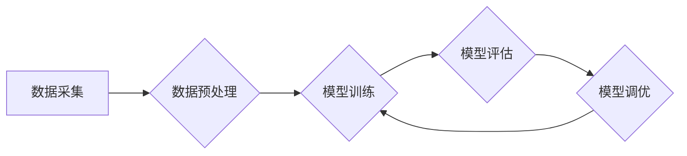

> 大语言模型、尺度定律、模型训练、参数规模、性能提升、应用场景、未来趋势

## 1. 背景介绍

近年来，大语言模型（LLM）在自然语言处理领域取得了显著的突破，展现出强大的文本生成、翻译、问答和代码生成能力。这些模型的成功离不开规模化训练和不断增长的参数规模。

尺度定律是LLM发展的重要理论基础，它指出模型性能随着参数规模的增加而呈指数级增长。然而，尺度定律并非绝对的，模型的架构、训练数据、训练方法等因素也对性能有重要影响。

本文将深入探讨LLM的尺度定律，分析其原理、应用场景以及未来发展趋势，为读者提供一个全面的理解。

## 2. 核心概念与联系

### 2.1  大语言模型（LLM）

大语言模型是指参数规模庞大、训练数据海量的人工智能模型，能够理解和生成人类语言。它们通常基于Transformer架构，并通过大量的文本数据进行预训练，学习语言的语法、语义和上下文关系。

### 2.2  尺度定律

尺度定律是指模型性能随着参数规模的增加而呈指数级增长。简单来说，如果将模型参数规模翻倍，其性能可能会显著提升。

### 2.3  模型训练

模型训练是LLM的核心过程，通过调整模型参数，使其能够准确地预测文本序列。训练数据通常包含大量的文本，模型通过学习这些数据中的模式和规律，不断优化其参数。

**Mermaid 流程图**



## 3. 核心算法原理 & 具体操作步骤

### 3.1  算法原理概述

LLM的核心算法是Transformer，它是一种基于注意力机制的深度神经网络架构。注意力机制能够帮助模型关注文本序列中重要的信息，从而提高理解和生成文本的能力。

### 3.2  算法步骤详解

1. **词嵌入:** 将文本中的每个词转换为向量表示，以便模型能够理解它们的语义。
2. **多头注意力:** 使用多个注意力头，分别关注文本序列的不同方面，并将其结果融合起来。
3. **前馈神经网络:** 对注意力机制输出的向量进行进一步处理，提取更深层次的语义信息。
4. **位置编码:** 为每个词添加位置信息，以便模型能够理解词语在句子中的顺序。
5. **解码器:** 基于编码器的输出，生成目标文本序列。

### 3.3  算法优缺点

**优点:**

* 能够处理长文本序列
* 性能优于传统的RNN模型
* 具有良好的并行化能力

**缺点:**

* 参数规模庞大，训练成本高
* 训练数据对模型性能有很大影响
* 容易出现过拟合问题

### 3.4  算法应用领域

* 文本生成
* 机器翻译
* 问答系统
* 代码生成
* 文本摘要

## 4. 数学模型和公式 & 详细讲解 & 举例说明

### 4.1  数学模型构建

LLM的数学模型通常基于概率论和统计学，目标是学习一个概率分布，能够生成符合语义和语法规则的文本序列。

### 4.2  公式推导过程

Transformer模型的核心是注意力机制，其计算公式如下：

$$
Attention(Q, K, V) = softmax(\frac{QK^T}{\sqrt{d_k}})V
$$

其中：

* $Q$：查询矩阵
* $K$：键矩阵
* $V$：值矩阵
* $d_k$：键向量的维度
* $softmax$：softmax函数

### 4.3  案例分析与讲解

假设我们有一个句子“我爱学习编程”，将其转换为词向量表示，然后使用注意力机制计算每个词与其他词之间的相关性。

通过注意力机制的计算，我们可以发现“学习”和“编程”这两个词之间的相关性较高，因为它们共同构成了一个语义单元。

## 5. 项目实践：代码实例和详细解释说明

### 5.1  开发环境搭建

* Python 3.7+
* PyTorch 或 TensorFlow
* CUDA 和 cuDNN

### 5.2  源代码详细实现

```python
import torch
import torch.nn as nn

class Transformer(nn.Module):
    def __init__(self, vocab_size, embedding_dim, num_heads, num_layers):
        super(Transformer, self).__init__()
        self.embedding = nn.Embedding(vocab_size, embedding_dim)
        self.transformer_layers = nn.ModuleList([
            nn.TransformerEncoderLayer(embedding_dim, num_heads)
            for _ in range(num_layers)
        ])

    def forward(self, x):
        x = self.embedding(x)
        for layer in self.transformer_layers:
            x = layer(x)
        return x
```

### 5.3  代码解读与分析

* `embedding`层将词向量转换为可训练的向量表示。
* `transformer_layers`是一个模块列表，包含多个Transformer编码器层。
* `forward`方法将输入序列经过嵌入层和Transformer编码器层，最终输出序列的表示。

### 5.4  运行结果展示

通过训练模型，我们可以评估其在文本生成、机器翻译等任务上的性能。

## 6. 实际应用场景

### 6.1  文本生成

LLM可以用于生成各种类型的文本，例如小说、诗歌、新闻报道、代码等。

### 6.2  机器翻译

LLM可以实现高质量的机器翻译，将文本从一种语言翻译成另一种语言。

### 6.3  问答系统

LLM可以构建智能问答系统，能够理解用户的问题并提供准确的答案。

### 6.4  未来应用展望

LLM在未来将应用于更多领域，例如：

* 个性化教育
* 医疗诊断
* 法律咨询
* 创意写作

## 7. 工具和资源推荐

### 7.1  学习资源推荐

* **书籍:**
    * 《深度学习》
    * 《自然语言处理》
* **在线课程:**
    * Coursera
    * edX
* **博客:**
    * The Gradient
    * Towards Data Science

### 7.2  开发工具推荐

* **PyTorch:** 深度学习框架
* **TensorFlow:** 深度学习框架
* **Hugging Face:** 预训练模型库

### 7.3  相关论文推荐

* 《Attention Is All You Need》
* 《BERT: Pre-training of Deep Bidirectional Transformers for Language Understanding》
* 《GPT-3: Language Models are Few-Shot Learners》

## 8. 总结：未来发展趋势与挑战

### 8.1  研究成果总结

LLM的发展取得了显著的成果，其性能不断提升，应用场景也越来越广泛。

### 8.2  未来发展趋势

* 模型规模进一步扩大
* 训练数据更加丰富多样
* 模型架构更加复杂
* 跨模态理解和生成

### 8.3  面临的挑战

* 训练成本高昂
* 数据偏见和公平性问题
* 模型可解释性和安全性问题

### 8.4  研究展望

未来研究将重点关注解决上述挑战，并探索LLM在更多领域的新应用。

## 9. 附录：常见问题与解答

### 9.1  什么是预训练？

预训练是指在大量文本数据上训练模型，使其学习语言的通用知识和规律。

### 9.2  如何评估LLM的性能？

LLM的性能通常通过在特定任务上的准确率、BLEU分数等指标进行评估。

### 9.3  LLM有哪些伦理问题？

LLM可能存在数据偏见、生成虚假信息、侵犯隐私等伦理问题。


作者：禅与计算机程序设计艺术 / Zen and the Art of Computer Programming 
<end_of_turn>