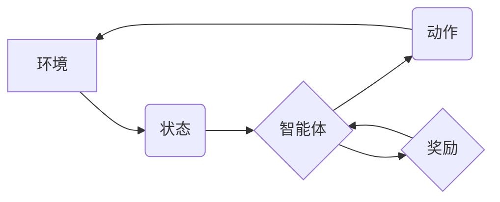

# 大语言模型应用指南：强化学习入门

> 关键词：

> 大语言模型，强化学习，RL，深度学习，神经网络，训练策略，奖励机制，应用场景

## 1. 背景介绍

近年来，人工智能（AI）领域取得了令人瞩目的进展，其中大语言模型（LLM）和强化学习（RL）作为两个重要的研究方向，在自然语言处理、计算机视觉、机器人控制等领域展现出强大的应用潜力。

大语言模型是指能够理解和生成人类语言的深度学习模型，例如GPT-3、BERT、LaMDA等。它们通过学习海量文本数据，掌握了语言的语法、语义和上下文关系，能够执行各种自然语言理解和生成任务，如文本摘要、机器翻译、对话系统等。

强化学习是一种机器学习方法，它通过设计奖励机制，让智能体在环境中学习最优策略。智能体通过与环境交互，根据环境反馈的奖励信号，不断调整行为策略，最终达到最大化累积奖励的目标。

## 2. 核心概念与联系

**2.1 强化学习的基本概念**

强化学习的核心概念包括：

* **智能体（Agent）：** 与环境交互并采取行动的实体。
* **环境（Environment）：** 智能体所处的外部世界，它会根据智能体的行动产生状态变化和奖励信号。
* **状态（State）：** 环境在特定时刻的描述，它反映了环境的当前情况。
* **动作（Action）：** 智能体在特定状态下可以采取的行动。
* **奖励（Reward）：** 环境对智能体采取的行动给予的反馈信号，它可以是正向奖励或负向惩罚。
* **策略（Policy）：** 智能体根据当前状态选择动作的规则。

**2.2 大语言模型与强化学习的结合**

大语言模型和强化学习的结合可以赋予语言模型更强的学习能力和适应性。

* **强化学习可以训练大语言模型生成更符合人类期望的文本。** 通过设计奖励机制，可以引导模型生成更流畅、更自然、更符合语境的文本。
* **强化学习可以使大语言模型具备更强的对话能力。** 通过训练模型在对话场景中进行交互，可以使其更好地理解用户意图，并生成更自然、更合理的回复。
* **强化学习可以使大语言模型具备更强的任务执行能力。** 通过训练模型完成特定任务，例如文本摘要、机器翻译、代码生成等，可以使其在特定领域表现更出色。

**2.3  RL与LLM的架构图**



## 3. 核心算法原理 & 具体操作步骤

### 3.1  算法原理概述

强化学习的核心算法是基于价值函数的策略梯度算法。价值函数用来评估智能体在特定状态下采取特定动作的长期回报。策略梯度算法通过更新策略参数，使得价值函数不断增加，从而使智能体学习到最优策略。

### 3.2  算法步骤详解

1. **初始化策略参数:**  随机初始化策略参数，定义智能体在不同状态下采取不同动作的概率分布。
2. **环境交互:** 智能体与环境交互，根据当前状态选择动作，并观察环境反馈的奖励信号和下一个状态。
3. **价值函数更新:** 根据奖励信号和下一个状态的价值函数估计，更新当前状态的价值函数。
4. **策略参数更新:**  根据策略梯度，更新策略参数，使得策略朝着提高价值函数的方向调整。
5. **重复步骤2-4:**  重复以上步骤，直到策略收敛或达到预设的训练目标。

### 3.3  算法优缺点

**优点:**

* 可以学习复杂的任务，并适应动态变化的环境。
* 不需要事先定义所有状态和动作，可以学习未知的环境。

**缺点:**

* 训练过程可能很慢，需要大量的样本数据和计算资源。
* 容易陷入局部最优解，难以找到全局最优策略。

### 3.4  算法应用领域

强化学习算法广泛应用于以下领域：

* **机器人控制:**  训练机器人完成各种复杂的任务，例如导航、抓取、组装等。
* **游戏 AI:**  训练游戏中的 AI 对手，使其能够与人类玩家进行更具挑战性的对抗。
* **推荐系统:**  根据用户的历史行为数据，推荐更符合用户兴趣的商品或服务。
* **金融交易:**  开发自动交易策略，根据市场数据进行股票或期货交易。

## 4. 数学模型和公式 & 详细讲解 & 举例说明

### 4.1  数学模型构建

强化学习的数学模型主要包括价值函数、策略函数和奖励函数。

* **价值函数 (Value Function):**  用来评估智能体在特定状态下采取特定动作的长期回报。

* **策略函数 (Policy Function):**  定义智能体在不同状态下选择动作的概率分布。

* **奖励函数 (Reward Function):**  定义环境对智能体采取的行动给予的反馈信号。

### 4.2  公式推导过程

**价值函数的更新公式:**

$$
V(s) = \max_{\pi} \mathbb{E}_{\pi}[R_{t+1} + \gamma V(s')]
$$

其中:

* $V(s)$ 是状态 $s$ 的价值函数。
* $\pi$ 是策略函数。
* $R_{t+1}$ 是下一个状态的奖励。
* $\gamma$ 是折扣因子，控制未来奖励的权重。
* $s'$ 是下一个状态。

**策略梯度的更新公式:**

$$
\theta = \theta + \alpha \nabla_{\theta} \mathbb{E}_{\pi_{\theta}}[R]
$$

其中:

* $\theta$ 是策略参数。
* $\alpha$ 是学习率。
* $\nabla_{\theta}$ 是策略参数的梯度。
* $\mathbb{E}_{\pi_{\theta}}[R]$ 是策略 $\pi_{\theta}$ 下的期望奖励。

### 4.3  案例分析与讲解

**举例说明:**

假设一个智能体在玩一个简单的游戏，目标是收集尽可能多的金币。环境会根据智能体的行动提供奖励，例如收集到金币获得正向奖励，撞到障碍物获得负向奖励。

通过强化学习算法，智能体可以学习到最优策略，即在不同状态下采取最有利于收集金币的动作。例如，如果智能体在某个状态下看到金币，它会选择移动到金币的位置；如果它看到障碍物，它会选择避开障碍物。

## 5. 项目实践：代码实例和详细解释说明

### 5.1  开发环境搭建

* **Python:**  强化学习库，例如OpenAI Gym、TensorFlow、PyTorch等。
* **IDE:**  PyCharm、VS Code等。

### 5.2  源代码详细实现

```python
import gym
import numpy as np

# 创建环境
env = gym.make('CartPole-v1')

# 定义策略网络
class PolicyNetwork(nn.Module):
    def __init__(self):
        super(PolicyNetwork, self).__init__()
        # 定义网络结构
        # ...

    def forward(self, state):
        # 计算动作概率分布
        # ...

# 定义训练循环
def train(policy_network, num_episodes):
    for episode in range(num_episodes):
        state = env.reset()
        done = False
        while not done:
            # 选择动作
            action_probs = policy_network(state)
            action = np.random.choice(env.action_space.n, p=action_probs)
            # 执行动作
            next_state, reward, done, _ = env.step(action)
            # 更新策略网络
            # ...
            state = next_state

# 训练模型
policy_network = PolicyNetwork()
train(policy_network, num_episodes=1000)

# 测试模型
state = env.reset()
while True:
    # 选择动作
    action_probs = policy_network(state)
    action = np.argmax(action_probs)
    # 执行动作
    next_state, reward, done, _ = env.step(action)
    # 显示状态
    env.render()
    if done:
        break
    state = next_state
env.close()
```

### 5.3  代码解读与分析

* **环境搭建:** 使用OpenAI Gym创建环境，例如CartPole-v1。
* **策略网络定义:** 定义一个神经网络，用于预测不同状态下采取不同动作的概率分布。
* **训练循环:** 训练循环包含以下步骤:
    * 初始化状态。
    * 在每个时间步，选择动作，执行动作，观察奖励和下一个状态。
    * 更新策略网络的参数，使其朝着提高价值函数的方向调整。
* **测试模型:** 使用训练好的模型在环境中进行测试，观察模型的行为。

### 5.4  运行结果展示

运行代码后，可以观察到智能体在环境中学习并完成任务的过程。例如，在CartPole-v1环境中，智能体可以学习平衡木杆，使其持续一段时间不倒下。

## 6. 实际应用场景

### 6.1  自然语言处理

* **对话系统:**  训练对话系统，使其能够与人类进行更自然、更流畅的对话。
* **文本摘要:**  训练模型自动生成文本摘要，提取文本的关键信息。
* **机器翻译:**  训练模型进行机器翻译，将一种语言翻译成另一种语言。

### 6.2  计算机视觉

* **图像识别:**  训练模型识别图像中的物体、场景和人物。
* **目标跟踪:**  训练模型跟踪图像中的特定物体。
* **图像生成:**  训练模型生成新的图像，例如合成人物图像、生成艺术作品等。

### 6.3  机器人控制

* **导航:**  训练机器人自主导航，避开障碍物，到达目标位置。
* **抓取:**  训练机器人抓取物体，例如抓取箱子、抓取工具等。
* **组装:**  训练机器人完成复杂的任务，例如组装电子产品、组装机械零件等。

### 6.4  未来应用展望

强化学习在未来将有更广泛的应用，例如：

* **自动驾驶:**  训练自动驾驶汽车，使其能够安全、高效地行驶。
* **医疗诊断:**  训练模型辅助医生诊断疾病，提高诊断准确率。
* **金融预测:**  训练模型预测股票价格、汇率等金融指标，帮助投资者做出更明智的决策。

## 7. 工具和资源推荐

### 7.1  学习资源推荐

* **书籍:**
    * Reinforcement Learning: An Introduction by Richard S. Sutton and Andrew G. Barto
    * Deep Reinforcement Learning Hands-On by Maxim Lapan
* **在线课程:**
    * Deep Reinforcement Learning Specialization by DeepLearning.AI
    * Reinforcement Learning by David Silver (University of DeepMind)

### 7.2  开发工具推荐

* **Python:**  强化学习库，例如OpenAI Gym、TensorFlow、PyTorch等。
* **IDE:**  PyCharm、VS Code等。

### 7.3  相关论文推荐

* **Deep Q-Network (DQN):**  Mnih et al. (2015)
* **Proximal Policy Optimization (PPO):**  Schulman et al. (2017)
* **Trust Region Policy Optimization (TRPO):**  Schulman et al. (2015)

## 8. 总结：未来发展趋势与挑战

### 8.1  研究成果总结

近年来，强化学习取得了显著进展，在许多领域取得了突破性成果。例如，AlphaGo、AlphaZero等模型在围棋、象棋等游戏中战胜了人类世界冠军。

### 8.2  未来发展趋势

* **更强大的模型:**  开发更强大的强化学习模型，能够解决更复杂的任务。
* **更有效的算法:**  设计更有效的强化学习算法，提高训练效率和收敛速度。
* **更广泛的应用:**  将强化学习应用到更多领域，例如自动驾驶。