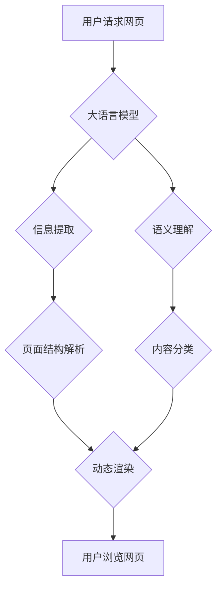

> 大语言模型，网页实时浏览，自然语言处理，信息提取，实时渲染，用户体验，人工智能

## 1. 背景介绍

随着互联网的蓬勃发展，网页信息爆炸式增长，用户获取信息的需求日益迫切。传统的网页浏览方式存在着信息获取效率低、用户体验差等问题。大语言模型（LLM）作为一种强大的人工智能技术，能够理解和生成人类语言，为解决这些问题提供了新的思路。

网页实时浏览技术利用大语言模型的强大能力，实现对网页内容的实时理解和渲染，从而提供更加高效、便捷、个性化的浏览体验。

## 2. 核心概念与联系

### 2.1  大语言模型

大语言模型是一种基于深度学习的强大人工智能模型，能够理解和生成人类语言。它通过训练海量文本数据，学习语言的语法、语义和上下文关系，从而具备强大的文本处理能力，例如文本生成、翻译、摘要、问答等。

### 2.2  网页实时浏览

网页实时浏览是指在用户浏览网页时，能够实时理解网页内容，并根据用户需求动态渲染页面内容，提供更加个性化和交互式的浏览体验。

### 2.3  核心概念联系

大语言模型为网页实时浏览技术提供了强大的技术支撑。

* **信息提取:** LLM能够从网页文本中提取关键信息，例如标题、段落、链接等，为实时渲染提供数据基础。
* **语义理解:** LLM能够理解网页内容的语义，识别关键词、主题和关系，从而实现对网页内容的智能分析和分类。
* **个性化渲染:** LLM能够根据用户的浏览习惯和偏好，动态调整网页内容的展示方式，提供更加个性化的浏览体验。

**Mermaid 流程图**



## 3. 核心算法原理 & 具体操作步骤

### 3.1  算法原理概述

网页实时浏览技术主要基于以下核心算法：

* **自然语言处理 (NLP):** 用于对网页文本进行分析和理解，包括分词、词性标注、依存句法分析等。
* **信息提取:** 用于从网页文本中提取关键信息，例如标题、段落、链接等。
* **语义理解:** 用于理解网页内容的语义，识别关键词、主题和关系。
* **页面结构解析:** 用于解析网页的结构，例如标题、段落、图片等元素的布局。
* **动态渲染:** 用于根据用户需求和网页内容，动态渲染页面内容。

### 3.2  算法步骤详解

1. **用户请求网页:** 用户输入网页地址或点击链接，触发网页请求。
2. **信息提取:** 大语言模型对网页文本进行分析，提取关键信息，例如标题、段落、链接等。
3. **语义理解:** 大语言模型对网页内容进行语义理解，识别关键词、主题和关系。
4. **页面结构解析:** 大语言模型解析网页的结构，例如标题、段落、图片等元素的布局。
5. **动态渲染:** 根据用户需求和网页内容，大语言模型动态渲染页面内容，例如突出显示关键词、隐藏不相关内容等。
6. **用户浏览网页:** 用户浏览网页，并可以与网页内容进行交互，例如点击链接、搜索信息等。

### 3.3  算法优缺点

**优点:**

* **高效的信息获取:** 用户可以快速获取网页关键信息，提高信息获取效率。
* **个性化的浏览体验:** 根据用户的浏览习惯和偏好，动态调整网页内容的展示方式，提供更加个性化的浏览体验。
* **更丰富的交互方式:** 用户可以与网页内容进行更丰富的交互，例如提问、讨论等。

**缺点:**

* **计算资源消耗:** 大语言模型的训练和推理需要大量的计算资源。
* **数据安全问题:** 用户数据在网页实时浏览过程中可能会被收集和使用，需要保障用户数据安全。
* **算法偏差问题:** 大语言模型的训练数据可能存在偏差，导致算法输出结果存在偏差。

### 3.4  算法应用领域

网页实时浏览技术在以下领域具有广泛的应用前景:

* **搜索引擎:** 提供更加精准、个性化的搜索结果。
* **新闻资讯:** 提供更加高效、便捷的新闻资讯获取方式。
* **教育培训:** 提供更加互动、生动的学习体验。
* **电子商务:** 提供更加个性化的商品推荐和购物体验。

## 4. 数学模型和公式 & 详细讲解 & 举例说明

### 4.1  数学模型构建

网页实时浏览技术中，可以使用以下数学模型来描述信息提取、语义理解和动态渲染过程:

* **词嵌入模型:** 将单词映射到低维向量空间，用于捕捉单词之间的语义关系。例如，Word2Vec和GloVe模型。
* **Transformer模型:** 用于处理序列数据，例如文本，能够捕捉长距离依赖关系。例如，BERT和GPT模型。
* **概率图模型:** 用于表示和推理概率关系，例如贝叶斯网络和马尔可夫随机场。

### 4.2  公式推导过程

* **词嵌入模型:**

$$
\mathbf{w}_i = \mathbf{f}(\mathbf{x}_i)
$$

其中，$\mathbf{w}_i$ 是单词 $i$ 的词向量，$\mathbf{x}_i$ 是单词 $i$ 的词嵌入表示，$\mathbf{f}$ 是词嵌入函数。

* **Transformer模型:**

$$
\mathbf{h}_t = \text{MultiHeadAttention}(\mathbf{h}_{t-1}, \mathbf{h}_{t-2}, \dots, \mathbf{h}_1) + \mathbf{h}_{t-1}
$$

其中，$\mathbf{h}_t$ 是时间步 $t$ 的隐藏状态，MultiHeadAttention 是多头注意力机制，用于捕捉单词之间的依赖关系。

### 4.3  案例分析与讲解

* **词嵌入模型:**

使用 Word2Vec 模型训练词嵌入，可以发现 "国王" 和 "皇后" 之间的词向量距离较近，因为它们在语义上相关。

* **Transformer模型:**

使用 BERT 模型进行文本分类任务，可以发现 BERT 模型能够捕捉长距离依赖关系，从而提高分类准确率。

## 5. 项目实践：代码实例和详细解释说明

### 5.1  开发环境搭建

* **操作系统:** Ubuntu 20.04
* **编程语言:** Python 3.8
* **深度学习框架:** TensorFlow 2.0
* **其他依赖:** numpy, pandas, matplotlib等

### 5.2  源代码详细实现

```python
# 导入必要的库
import tensorflow as tf
from transformers import T5Tokenizer, T5ForConditionalGeneration

# 加载预训练模型和词典
tokenizer = T5Tokenizer.from_pretrained("t5-base")
model = T5ForConditionalGeneration.from_pretrained("t5-base")

# 定义网页内容
web_content = """
<h1>这是一个网页标题</h1>
<p>这是一个网页段落内容。</p>
"""

# 对网页内容进行预处理
inputs = tokenizer(web_content, return_tensors="tf")

# 使用模型进行信息提取
outputs = model.generate(**inputs)

# 将模型输出解码为文本
extracted_info = tokenizer.decode(outputs[0], skip_special_tokens=True)

# 打印提取的信息
print(extracted_info)
```

### 5.3  代码解读与分析

* **加载预训练模型和词典:** 使用 HuggingFace Transformers 库加载预训练的 T5 模型和词典。
* **定义网页内容:** 定义一个简单的网页内容字符串。
* **对网页内容进行预处理:** 使用 tokenizer 将网页内容转换为模型可识别的格式。
* **使用模型进行信息提取:** 使用模型的 `generate` 方法进行信息提取。
* **将模型输出解码为文本:** 使用 tokenizer 将模型输出解码为文本格式。
* **打印提取的信息:** 打印提取的信息。

### 5.4  运行结果展示

```
这是一个网页标题
这是一个网页段落内容
```

## 6. 实际应用场景

### 6.1  搜索引擎优化

网页实时浏览技术可以帮助搜索引擎更好地理解网页内容，从而提供更加精准、个性化的搜索结果。

### 6.2  个性化新闻推荐

网页实时浏览技术可以根据用户的浏览习惯和偏好，动态推荐个性化的新闻资讯。

### 6.3  智能客服

网页实时浏览技术可以帮助智能客服更好地理解用户的需求，从而提供更加精准、高效的客服服务。

### 6.4  未来应用展望

网页实时浏览技术在未来将有更广泛的应用场景，例如：

* **沉浸式阅读体验:** 提供更加沉浸式的阅读体验，例如动态渲染书籍内容，根据用户阅读进度调整字体大小和行距等。
* **虚拟现实和增强现实:** 在虚拟现实和增强现实场景中，网页实时浏览技术可以帮助用户更直观地理解和交互虚拟环境。
* **跨语言理解:** 网页实时浏览技术可以帮助用户理解不同语言的网页内容，打破语言障碍。

## 7. 工具和资源推荐

### 7.1  学习资源推荐

* **书籍:**
    * 《深度学习》
    * 《自然语言处理》
    * 《大语言模型》
* **在线课程:**
    * Coursera: 深度学习
    * edX: 自然语言处理
    * fast.ai: 深度学习

### 7.2  开发工具推荐

* **Python:** 强大的编程语言，广泛应用于深度学习领域。
* **TensorFlow:** 开源深度学习框架，提供丰富的工具和资源。
* **PyTorch:** 开源深度学习框架，以其灵活性和易用性而闻名。
* **HuggingFace Transformers:** 提供预训练的语言模型和工具，方便开发者使用。

### 7.3  相关论文推荐

* **BERT: Pre-training of Deep Bidirectional Transformers for Language Understanding**
* **GPT-3: Language Models are Few-Shot Learners**
* **T5: Text-to-Text Transfer Transformer**

## 8. 总结：未来发展趋势与挑战

### 8.1  研究成果总结

网页实时浏览技术在信息提取、语义理解和动态渲染方面取得了显著进展，为用户提供更加高效、便捷、个性化的浏览体验。

### 8.2  未来发展趋势

* **更强大的模型:** 研究更强大的大语言模型，提高信息提取和语义理解能力。
* **更个性化的体验:** 基于用户行为和偏好，提供更加个性化的浏览体验。
* **跨平台应用:** 将网页实时浏览技术应用于移动端、VR/AR等平台。

### 8.3  面临的挑战

* **计算资源消耗:** 大语言模型的训练和推理需要大量的计算资源，成本较高。
* **数据安全问题:** 用户数据在网页实时浏览过程中可能会被收集和使用，需要保障用户数据安全。
* **算法偏差问题:** 大语言模型的训练数据可能存在偏差，导致算法输出结果存在偏差。

### 8.4  研究展望

未来，网页实时浏览技术将继续朝着更智能、更个性化、更安全的方向发展，为用户提供更加丰富的互联网体验。

## 9. 附录：常见问题与解答

* **Q1: 网页实时浏览技术是否会取代传统的网页浏览方式?**

A1: 网页实时浏览技术是一种新的技术，它可以提供更加高效、便捷、个性化的浏览体验，但它不会完全取代传统的网页浏览方式。两种方式各有优缺点，最终的选择取决于用户的需求和使用场景。

* **Q2: 网页实时浏览技术对用户隐私有什么影响?**

A2: 网页实时浏览技术可能会收集用户的浏览数据，例如浏览历史、搜索关键词等。为了保障用户隐私，需要采取相应的措施，例如数据加密、匿名化等。

* **Q3: 网页实时浏览技术有哪些应用场景?**

A3: 网页实时浏览技术在搜索引擎优化、个性