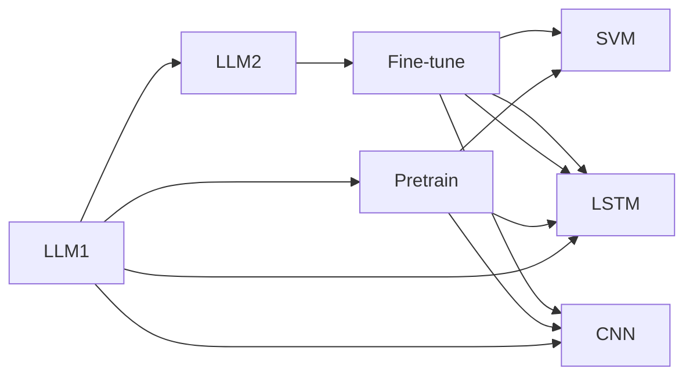

                 

## 1. 背景介绍

随着人工智能技术的快速发展，自然语言处理（NLP）领域已经逐步从传统的基于规则和手工特征的文本分类方法，转向基于深度学习的大规模语言模型（LLMs）。尤其是在大规模预训练语言模型（如GPT-3、BERT等）出现后，文本分类任务得以在更大规模和更广泛的数据集上进行预训练，并根据实际需求进行微调。相比传统方法，大语言模型在精度、泛化能力和模型通用性等方面展现出了显著优势。

本文将详细对比大语言模型与传统文本分类方法，重点关注其原理、效果、应用场景及优劣。通过对二者的深入分析，希望能为读者提供全面、系统的认识，并助力于未来文本分类技术的进一步发展。

## 2. 核心概念与联系

### 2.1 核心概念概述

在详细对比前，首先需要明确几个核心概念：

- **大语言模型（LLM）**：一类基于自回归或自编码结构的大型神经网络模型，如GPT系列、BERT等。这些模型通常在大规模无标签数据上进行预训练，以学习通用的语言表示，然后在特定任务上进行微调。

- **传统文本分类方法**：包括朴素贝叶斯、支持向量机（SVM）、逻辑回归等基于手工特征或规则的分类算法。这些方法依赖于特征工程，通过手工设计的特征进行模型训练。

- **预训练-微调范式**：即在大规模无标签数据上预训练语言模型，然后在特定任务上有监督数据上进行微调，优化模型在该任务上的性能。这种范式能够有效提升模型在特定任务上的表现。

### 2.2 核心概念原理和架构的 Mermaid 流程图



## 3. 核心算法原理 & 具体操作步骤

### 3.1 算法原理概述

大语言模型与传统文本分类方法的核心差异在于预训练和微调的范式。大语言模型在预训练阶段学习大规模无标签数据中的语言模式，然后在微调阶段通过少量有标签数据优化特定任务的性能。而传统文本分类方法则直接依赖于手工设计的特征和分类器，进行无预训练的监督学习。

大语言模型的预训练-微调范式可以概括为以下步骤：

1. **预训练**：在无标签数据上，使用自监督任务（如掩码语言模型、下一步预测等）训练大语言模型。
2. **微调**：在有标签数据上，使用监督任务（如分类、回归等）微调模型，优化模型在特定任务上的性能。

### 3.2 算法步骤详解

#### 3.2.1 预训练步骤

- **数据准备**：选择大规模无标签数据集，如Common Crawl、Wikipedia等。
- **模型构建**：使用自监督任务构建语言模型，如BERT使用掩码语言模型进行预训练。
- **训练优化**：使用随机梯度下降等优化算法，在预训练数据上迭代优化模型参数。

#### 3.2.2 微调步骤

- **任务适配**：根据微调任务的特点，设计合适的任务适配层（如线性分类器、回归器等）。
- **数据准备**：准备微调任务的标注数据集。
- **模型微调**：在微调数据上，使用监督任务训练适配后的模型，优化模型性能。
- **参数更新**：使用较小学习率更新模型参数，防止预训练参数被破坏。
- **模型评估**：在验证集和测试集上评估模型性能，决定是否停止微调。

### 3.3 算法优缺点

#### 3.3.1 大语言模型的优点

- **泛化能力强**：通过在大规模无标签数据上进行预训练，模型能够学习到通用的语言表示，在多种任务上表现优异。
- **适应性强**：模型可以根据微调任务的需求进行快速调整，适应不同的数据分布和任务特点。
- **高效利用数据**：在大规模数据上进行预训练，提升模型对新数据的泛化能力。

#### 3.3.2 大语言模型的缺点

- **计算资源需求高**：预训练阶段需要大量计算资源，增加了部署成本。
- **模型复杂度高**：模型参数众多，导致推理速度较慢，存储和加载开销大。

#### 3.3.3 传统文本分类方法的优点

- **计算资源需求低**：传统方法直接使用标签数据训练模型，无需大规模无标签数据。
- **模型结构简单**：模型通常较小，推理速度快，存储和加载开销小。

#### 3.3.4 传统文本分类方法的缺点

- **泛化能力有限**：依赖手工设计的特征，难以处理复杂的语言模式和语义关系。
- **适应性差**：模型难以根据不同任务进行快速调整。

### 3.4 算法应用领域

- **大语言模型**：适用于多种NLP任务，如文本分类、命名实体识别、情感分析、机器翻译等。
- **传统文本分类方法**：适用于小规模数据集，如垃圾邮件分类、情感极性判断等。

## 4. 数学模型和公式 & 详细讲解 & 举例说明

### 4.1 数学模型构建

大语言模型的预训练-微调过程可以表示为：

- **预训练模型**：$M_{\theta}$，其中 $\theta$ 是预训练得到的模型参数。
- **微调任务**：$T$，任务类型为二分类。
- **训练集**：$D_{train}$，标注数据集。
- **验证集**：$D_{valid}$，用于评估模型性能。
- **测试集**：$D_{test}$，用于最终评估模型效果。

### 4.2 公式推导过程

以BERT为例，其预训练过程主要使用掩码语言模型（Masked Language Model, MLM）进行训练。MLM的优化目标为：

$$
\min_{\theta} \sum_{(x,y) \in D_{train}} L_{MLM}(M_{\theta}(x), y)
$$

其中 $L_{MLM}$ 为掩码语言模型损失函数。

微调过程通常使用交叉熵损失函数（Cross-Entropy Loss），优化目标为：

$$
\min_{\theta} \sum_{(x,y) \in D_{train}} L_{CE}(M_{\theta}(x), y)
$$

其中 $L_{CE}$ 为交叉熵损失函数。

### 4.3 案例分析与讲解

以垃圾邮件分类为例，分析大语言模型和传统方法的效果。

- **传统方法**：使用朴素贝叶斯分类器，手工提取邮件中单词、标点等特征。训练集为垃圾邮件和非垃圾邮件标注数据集。
- **大语言模型**：使用BERT进行预训练，然后微调为一个二分类器。微调数据为垃圾邮件和非垃圾邮件标注数据集。

两种方法的对比如下：

- **精度**：大语言模型通常比传统方法精度更高，特别是在大规模数据集上。
- **泛化能力**：大语言模型由于预训练过程，对未见过的数据具有更好的泛化能力。
- **计算资源**：大语言模型需要大量的计算资源进行预训练，而传统方法计算资源需求较低。

## 5. 项目实践：代码实例和详细解释说明

### 5.1 开发环境搭建

- **Python**：选择Python 3.7及以上版本，并使用Anaconda创建虚拟环境。
- **深度学习框架**：选择PyTorch或TensorFlow，并安装相关依赖库。
- **预训练模型**：下载BERT预训练模型，如`bert-base-uncased`。

### 5.2 源代码详细实现

#### 5.2.1 传统方法实现

```python
import pandas as pd
from sklearn.model_selection import train_test_split
from sklearn.feature_extraction.text import CountVectorizer
from sklearn.naive_bayes import MultinomialNB

# 加载数据
df = pd.read_csv('spam.csv')
X = df['text']
y = df['label']

# 数据预处理
vectorizer = CountVectorizer(stop_words='english')
X = vectorizer.fit_transform(X)

# 划分数据集
X_train, X_test, y_train, y_test = train_test_split(X, y, test_size=0.2, random_state=42)

# 训练模型
clf = MultinomialNB()
clf.fit(X_train, y_train)

# 评估模型
accuracy = clf.score(X_test, y_test)
print('Accuracy:', accuracy)
```

#### 5.2.2 大语言模型实现

```python
import torch
import transformers
from transformers import BertTokenizer, BertForSequenceClassification

# 加载数据
tokenizer = BertTokenizer.from_pretrained('bert-base-uncased')
train_encodings = tokenizer(train_data, truncation=True, padding=True)
val_encodings = tokenizer(val_data, truncation=True, padding=True)
test_encodings = tokenizer(test_data, truncation=True, padding=True)

# 构建数据集
class CustomDataset(torch.utils.data.Dataset):
    def __init__(self, encodings, labels):
        self.encodings = encodings
        self.labels = labels
        
    def __getitem__(self, idx):
        item = {key: torch.tensor(val[idx]) for key, val in self.encodings.items()}
        item['labels'] = torch.tensor(self.labels[idx])
        return item
    
    def __len__(self):
        return len(self.labels)

train_dataset = CustomDataset(train_encodings, train_labels)
val_dataset = CustomDataset(val_encodings, val_labels)
test_dataset = CustomDataset(test_encodings, test_labels)

# 加载模型
model = BertForSequenceClassification.from_pretrained('bert-base-uncased', num_labels=2)
model.to('cuda')

# 定义训练器
optimizer = torch.optim.Adam(model.parameters(), lr=1e-5)
loss_fn = torch.nn.CrossEntropyLoss()

# 训练模型
for epoch in range(10):
    model.train()
    for batch in train_loader:
        input_ids = batch['input_ids'].to('cuda')
        attention_mask = batch['attention_mask'].to('cuda')
        labels = batch['labels'].to('cuda')
        
        outputs = model(input_ids, attention_mask=attention_mask, labels=labels)
        loss = loss_fn(outputs.logits, labels)
        optimizer.zero_grad()
        loss.backward()
        optimizer.step()

    model.eval()
    with torch.no_grad():
        val_loss, val_acc = evaluate(val_dataset, model)
    print(f'Epoch {epoch+1}, Val Loss: {val_loss:.4f}, Val Acc: {val_acc:.4f}')

# 评估模型
test_loss, test_acc = evaluate(test_dataset, model)
print(f'Test Loss: {test_loss:.4f}, Test Acc: {test_acc:.4f}')
```

### 5.3 代码解读与分析

- **传统方法**：使用朴素贝叶斯分类器，通过手工设计的特征（如单词出现频率）进行模型训练。优点是计算资源需求低，模型结构简单；缺点是泛化能力有限，难以处理复杂的语言模式。
- **大语言模型**：使用BERT预训练模型，通过微调进行特定任务训练。优点是泛化能力强，适应性高；缺点是计算资源需求高，模型结构复杂。

## 6. 实际应用场景

### 6.1 智能客服系统

智能客服系统需要快速响应客户咨询，处理各种常见问题。大语言模型可以通过微调实现自然语言理解，根据客户意图快速匹配最佳回答。例如，可以使用BERT进行微调，构建对话系统，帮助客户解决问题，提升服务体验。

### 6.2 金融舆情监测

金融机构需要实时监测市场舆论动向，及时应对负面信息传播。大语言模型可以通过微调实现文本分类和情感分析，分析网络舆情，识别负面信息，帮助机构预警风险。例如，使用BERT进行微调，分析新闻报道和社交媒体内容，提供实时舆情报告。

### 6.3 个性化推荐系统

推荐系统需要根据用户行为和偏好进行个性化推荐。大语言模型可以通过微调学习用户兴趣，提供更加精准的推荐结果。例如，使用BERT进行微调，分析用户评论和浏览历史，推荐相关商品或内容。

## 7. 工具和资源推荐

### 7.1 学习资源推荐

- **《Deep Learning for NLP》**：斯坦福大学李飞飞教授的课程，系统讲解深度学习在NLP中的应用。
- **《Natural Language Processing with Transformers》**：Hugging Face的书籍，介绍Transformer模型和相关应用。
- **PyTorch官方文档**：详细说明PyTorch的深度学习框架，包括模型构建和优化等。

### 7.2 开发工具推荐

- **PyTorch**：灵活的深度学习框架，支持动态图和静态图，广泛应用于学术研究和工程实践。
- **TensorFlow**：强大的深度学习框架，适合大规模工程应用和分布式训练。
- **Hugging Face Transformers库**：提供预训练模型和模型适配层，简化微调开发流程。

### 7.3 相关论文推荐

- **BERT: Pre-training of Deep Bidirectional Transformers for Language Understanding**：介绍BERT模型及其在NLP中的应用。
- **Attention is All You Need**：介绍Transformer模型及其原理。
- **Sequence to Sequence Learning with Neural Networks**：介绍神经网络在机器翻译中的应用。

## 8. 总结：未来发展趋势与挑战

### 8.1 研究成果总结

本文对比了大语言模型与传统文本分类方法，重点分析了二者的原理、效果和应用。结果显示，大语言模型在泛化能力和适应性方面具有显著优势，但在计算资源需求和模型复杂度方面存在不足。

### 8.2 未来发展趋势

未来，大语言模型将继续发展，预训练-微调范式将在更多领域得到应用。随着计算资源的增加和模型算法的优化，大语言模型将进一步提升性能，覆盖更广泛的应用场景。

### 8.3 面临的挑战

- **计算资源**：大语言模型需要大量的计算资源进行预训练和微调，增加了部署成本。
- **模型复杂度**：大语言模型参数众多，推理速度较慢，存储和加载开销大。
- **模型泛化能力**：大语言模型在小规模数据集上的泛化能力仍需进一步提升。

### 8.4 研究展望

未来的研究方向包括：

- **参数高效微调**：减少微调过程中需更新的参数数量，提高微调效率。
- **少样本学习和零样本学习**：利用预训练知识，在少样本甚至零样本情况下进行有效分类。
- **多模态学习**：结合视觉、语音等多模态信息，提升语言模型的泛化能力。

## 9. 附录：常见问题与解答

### Q1: 大语言模型和传统文本分类方法的主要区别是什么？

**A**: 大语言模型通过大规模无标签数据的预训练和微调，学习通用的语言表示；传统文本分类方法直接使用手工设计的特征进行监督学习。大语言模型泛化能力强，适应性好，但计算资源需求高；传统方法计算资源需求低，但泛化能力有限。

### Q2: 大语言模型在预训练和微调过程中需要注意哪些问题？

**A**: 预训练阶段需要大量的计算资源，选择合适的自监督任务和优化策略。微调阶段需要选择合适的学习率和优化器，防止预训练参数被破坏，同时避免过拟合。

### Q3: 大语言模型和传统文本分类方法在实际应用中如何选择？

**A**: 大语言模型适用于处理大规模数据集，泛化能力强，但计算资源需求高；传统方法适用于处理小规模数据集，计算资源需求低，但泛化能力有限。

---

作者：禅与计算机程序设计艺术 / Zen and the Art of Computer Programming

