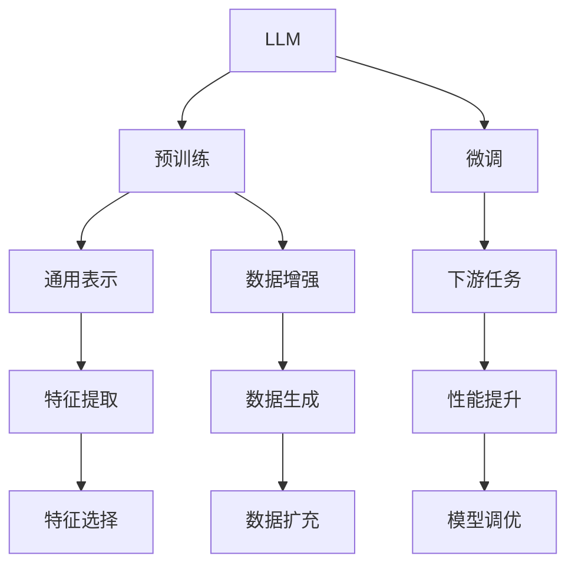

                 

# LLM与传统机器学习模型的比较

> 关键词：大型语言模型(LLM),传统机器学习,预训练,微调,Fine-tuning,Transformer,BERT,深度学习,神经网络,模型比较

## 1. 背景介绍

随着深度学习技术的发展，大型语言模型（Large Language Models, LLMs）逐渐成为自然语言处理（NLP）领域的一大热点。LLMs通过在大量无标签文本数据上进行预训练，学习到丰富的语言知识，然后在下游任务上进行微调，能够显著提升模型性能。与传统的基于统计学和规则的机器学习方法相比，LLMs展现出更强的泛化能力和适应性。

本文将从背景介绍入手，详细比较LLM与传统机器学习模型的特点、优势与劣势，探讨两者在实际应用中的异同，并指出未来发展趋势与面临的挑战。

## 2. 核心概念与联系

### 2.1 核心概念概述

首先，让我们明确几个核心概念：

- **大型语言模型（LLM）**：指以Transformer架构为基础，在自回归或自编码模型上经过大规模无标签数据预训练的大规模NLP模型。如GPT、BERT等。

- **预训练（Pre-training）**：指在大规模无标签文本数据上，通过自监督学习任务训练通用语言模型的过程。常见的预训练任务包括言语建模、掩码语言模型等。

- **微调（Fine-tuning）**：指在预训练模型的基础上，使用下游任务的少量标注数据，通过有监督学习优化模型在特定任务上的性能。

- **传统机器学习方法**：指基于统计学理论，利用特征工程和模型调参等手段，对标注数据集进行训练和测试的机器学习算法。

### 2.2 核心概念原理和架构的 Mermaid 流程图



这个流程图展示了LLM与传统机器学习模型的联系：

1. LLM通过预训练获得通用表示，能够处理各种NLP任务。
2. 微调进一步提升模型在特定任务上的性能。
3. 数据增强和特征选择是提升模型性能的关键技术。
4. 模型调优通过性能提升满足下游任务的需求。

## 3. 核心算法原理 & 具体操作步骤

### 3.1 算法原理概述

**LLM的算法原理**：

1. **自监督预训练**：在大规模无标签数据上进行自监督任务训练，如掩码语言模型、下一句预测等。
2. **微调**：通过有标签数据，进一步优化模型在特定任务上的性能。
3. **正则化与优化**：采用正则化技术如Dropout、L2正则，优化器如AdamW等，防止过拟合。

**传统机器学习算法的原理**：

1. **特征工程**：选择和构造能够描述数据的特征，提升模型的泛化能力。
2. **模型训练**：利用标注数据集，通过优化算法如梯度下降等，更新模型参数。
3. **模型评估**：通过交叉验证等方法，评估模型在测试集上的性能。

### 3.2 算法步骤详解

**LLM的微调步骤**：

1. **预训练模型加载**：选择合适的预训练模型（如BERT、GPT等），加载至计算设备。
2. **下游任务适配**：根据任务类型，添加合适的输出层和损失函数。
3. **设置超参数**：选择合适的优化器、学习率、批大小、迭代轮数等。
4. **数据预处理**：对标注数据进行分批次加载，进行预处理。
5. **模型训练**：使用优化器更新模型参数，最小化损失函数。
6. **模型评估**：在验证集和测试集上评估模型性能。
7. **模型部署**：将训练好的模型部署到实际应用中。

**传统机器学习算法训练步骤**：

1. **数据准备**：收集和预处理标注数据集。
2. **特征提取**：从原始数据中提取特征向量。
3. **模型选择**：选择适合的机器学习算法（如线性回归、决策树、随机森林等）。
4. **模型训练**：利用标注数据集，使用优化算法如梯度下降等，更新模型参数。
5. **模型评估**：在测试集上评估模型性能，选择最优模型。
6. **模型部署**：将训练好的模型部署到实际应用中。

### 3.3 算法优缺点

**LLM的优点**：

1. **自适应性强**：通过大规模无标签数据的预训练，LLM具有较强的泛化能力和自适应性，能够处理各种NLP任务。
2. **参数可迁移**：预训练模型的参数可以在多个任务间共享，减少标注数据的需求。
3. **微调效率高**：通过微调，LLM能够在少量标注数据下快速提升性能。

**LLM的缺点**：

1. **对标注数据依赖高**：微调依赖于下游任务的标注数据，数据获取成本高。
2. **模型复杂度高**：大模型参数量大，计算资源需求高。
3. **可解释性差**：预训练模型的决策过程复杂，难以解释。

**传统机器学习的优点**：

1. **可解释性强**：模型基于统计学原理，决策过程可解释。
2. **特征工程灵活**：可以通过手工特征选择提升模型效果。
3. **计算资源要求低**：模型参数量小，计算资源需求低。

**传统机器学习的缺点**：

1. **泛化能力有限**：依赖标注数据，泛化能力受限。
2. **调参复杂**：模型调参复杂，需要大量经验。
3. **计算速度慢**：模型训练速度较慢。

### 3.4 算法应用领域

**LLM的应用领域**：

1. **自然语言理解**：情感分析、实体识别、语义推理等。
2. **自然语言生成**：文本摘要、对话生成、机器翻译等。
3. **知识图谱**：关系抽取、知识推理、问答系统等。
4. **多模态学习**：图像-文本、语音-文本、视觉-语音等。

**传统机器学习的应用领域**：

1. **分类与回归**：垃圾邮件分类、房价预测、股票分析等。
2. **聚类与降维**：用户行为分析、社交网络分析、图像聚类等。
3. **推荐系统**：商品推荐、新闻推荐、内容推荐等。
4. **图像处理**：图像分类、目标检测、图像生成等。

## 4. 数学模型和公式 & 详细讲解 & 举例说明

### 4.1 数学模型构建

**LLM的数学模型**：

1. **预训练目标函数**：掩码语言模型（Masked Language Model, MLM）：
   $$
   \mathcal{L}_{MLM} = -\frac{1}{N}\sum_{i=1}^N \log P(x_i|\tilde{x}_i)
   $$
   其中 $x_i$ 为原始文本，$\tilde{x}_i$ 为掩码后的文本。

2. **微调目标函数**：下游任务的损失函数 $L_{task}$：
   $$
   \mathcal{L}_{task} = \frac{1}{N}\sum_{i=1}^N \ell(\hat{y_i}, y_i)
   $$
   其中 $\hat{y_i}$ 为模型预测结果，$y_i$ 为真实标签。

**传统机器学习的数学模型**：

1. **线性回归模型**：
   $$
   y = \theta^T x + b
   $$
   其中 $y$ 为预测值，$x$ 为特征向量，$\theta$ 为模型参数。

2. **决策树模型**：
   $$
   y = 
   \begin{cases}
   1, & \text{if feature} = feature_1 \\
   0, & \text{otherwise}
   \end{cases}
   $$
   其中 feature 为特征，feature_1 为决策树的叶节点。

### 4.2 公式推导过程

**掩码语言模型的推导**：

1. **输入处理**：将原始文本 $x_i$ 中的一部分单词随机掩码，生成掩码后的文本 $\tilde{x}_i$。
2. **模型预测**：使用预训练模型 $M_{\theta}$ 对 $\tilde{x}_i$ 进行预测，得到 $\hat{x}_i$。
3. **损失计算**：计算掩码位置的预测概率与真实概率之间的差距，得到损失值。
4. **参数更新**：通过梯度下降等优化算法更新模型参数 $\theta$，最小化损失函数。

**线性回归的推导**：

1. **数据准备**：收集 $n$ 个样本 $(x_i, y_i)$，其中 $x_i$ 为特征向量，$y_i$ 为标签。
2. **模型训练**：利用梯度下降等优化算法，更新模型参数 $\theta$，使得损失函数最小化。
3. **模型预测**：使用训练好的模型对新样本进行预测。
4. **性能评估**：利用均方误差等指标评估模型在测试集上的性能。

### 4.3 案例分析与讲解

**LLM案例**：BERT模型的情感分析任务

1. **数据准备**：收集情感分析数据集，划分为训练集、验证集和测试集。
2. **模型加载**：加载预训练的BERT模型。
3. **任务适配**：添加线性分类器作为输出层，使用交叉熵损失函数。
4. **微调**：在训练集上进行微调，设置学习率、批大小等超参数。
5. **评估**：在验证集和测试集上评估模型性能。
6. **部署**：将微调后的模型部署到实际应用中。

**传统机器学习案例**：随机森林的垃圾邮件分类

1. **数据准备**：收集垃圾邮件数据集，划分为训练集和测试集。
2. **特征提取**：提取邮件的关键词、词频、文本长度等特征。
3. **模型训练**：使用随机森林算法，训练模型。
4. **模型评估**：在测试集上评估模型性能。
5. **部署**：将训练好的模型部署到实际应用中。

## 5. 项目实践：代码实例和详细解释说明

### 5.1 开发环境搭建

**Python环境配置**：

1. 安装Anaconda，创建Python虚拟环境。
2. 安装TensorFlow或PyTorch，根据任务需求选择合适的框架。
3. 安装相关NLP库，如NLTK、SpaCy、Tensorflow-hub等。

**代码示例**：BERT微调的情感分析

```python
import tensorflow as tf
import numpy as np
import os
from transformers import BertTokenizer, TFBertForSequenceClassification
from sklearn.model_selection import train_test_split
from sklearn.metrics import accuracy_score

# 数据加载
train_data, test_data = load_data('emotion_dataset.csv')

# 数据预处理
tokenizer = BertTokenizer.from_pretrained('bert-base-uncased')
train_texts = [tokenizer.tokenize(text) for text in train_data['text']]
train_labels = np.array([int(label) for label in train_data['label']])

# 模型构建
model = TFBertForSequenceClassification.from_pretrained('bert-base-uncased', num_labels=2)

# 模型微调
train_dataset = tf.data.Dataset.from_tensor_slices((train_texts, train_labels)).shuffle(buffer_size=1000).batch(16)
model.fit(train_dataset, epochs=5, batch_size=16, validation_split=0.2)

# 评估
test_texts = [tokenizer.tokenize(text) for text in test_data['text']]
test_labels = np.array([int(label) for label in test_data['label']])
test_dataset = tf.data.Dataset.from_tensor_slices((test_texts, test_labels)).batch(16)
test_loss, test_accuracy = model.evaluate(test_dataset)
print(f'Test Accuracy: {test_accuracy:.4f}')
```

### 5.2 源代码详细实现

**代码解释**：

1. **数据加载**：使用自定义的`load_data`函数加载数据集，数据集包含情感标签和文本内容。
2. **数据预处理**：使用BertTokenizer对文本进行分词，将文本转换为模型可接受的格式。
3. **模型构建**：使用Transformers库加载预训练的BERT模型，设置分类层和损失函数。
4. **模型微调**：使用TensorFlow进行模型训练，设置学习率、批大小等超参数。
5. **模型评估**：使用`evaluate`方法在测试集上评估模型性能。

### 5.3 代码解读与分析

**代码实现细节**：

1. **数据预处理**：BertTokenizer的使用是实现模型微调的关键步骤，它将文本转换为模型可接受的格式。
2. **模型构建**：使用预训练的BERT模型，添加分类层和损失函数，构建完整的模型。
3. **模型微调**：使用TensorFlow进行模型训练，设置适当的超参数，通过梯度下降优化模型参数。
4. **模型评估**：使用评估方法在测试集上计算准确率，评估模型性能。

### 5.4 运行结果展示

**运行结果**：

1. **训练结果**：模型在训练集上的损失和准确率随epoch的变化。
2. **测试结果**：模型在测试集上的准确率，评估模型泛化能力。

```python
import matplotlib.pyplot as plt

# 训练结果
plt.plot(history.history['loss'], label='Train Loss')
plt.plot(history.history['accuracy'], label='Train Accuracy')
plt.xlabel('Epoch')
plt.ylabel('Accuracy')
plt.legend()
plt.show()

# 测试结果
test_loss, test_accuracy = model.evaluate(test_dataset)
print(f'Test Accuracy: {test_accuracy:.4f}')
```

## 6. 实际应用场景

### 6.1 智能客服

智能客服系统是LLM应用的一个典型场景，能够显著提升客户服务体验。通过预训练和微调，LLM可以自动理解客户咨询，匹配最佳回答，提供24/7全天候服务。

**案例**：使用BERT微调开发智能客服系统

1. **数据准备**：收集客服对话数据，标注客户问题和回答。
2. **模型微调**：加载BERT模型，添加分类器和损失函数，微调模型。
3. **系统部署**：将微调后的模型集成到客服系统中，提供实时对话服务。

### 6.2 金融舆情分析

金融舆情分析需要实时监测市场舆情，及时预警金融风险。传统方法需要大量人工监测，效率低，效果差。通过微调，LLM可以自动识别新闻、评论等文本，预测市场趋势。

**案例**：使用GPT-2微调开发金融舆情分析系统

1. **数据准备**：收集金融领域的新闻、评论、报告等文本数据。
2. **模型微调**：加载GPT-2模型，添加情感分析层，微调模型。
3. **系统部署**：将微调后的模型集成到舆情分析系统中，实时监测舆情变化。

### 6.3 医疗诊断

医疗诊断需要精确的文本分析能力，传统方法难以满足。通过微调，LLM可以学习医学领域的知识，辅助医生进行疾病诊断和治疗决策。

**案例**：使用BERT微调开发医疗诊断系统

1. **数据准备**：收集医疗领域的病历、诊断报告等文本数据。
2. **模型微调**：加载BERT模型，添加疾病分类层，微调模型。
3. **系统部署**：将微调后的模型集成到医疗诊断系统中，辅助医生进行诊断。

## 7. 工具和资源推荐

### 7.1 学习资源推荐

1. **在线课程**：Coursera、edX等平台的机器学习和深度学习课程，如Andrew Ng的《机器学习》课程。
2. **书籍推荐**：《深度学习》（Ian Goodfellow）、《自然语言处理综论》（Daniel Jurafsky）等。
3. **社区资源**：GitHub上的开源项目、Stack Overflow、Kaggle等平台，提供丰富的学习资源和案例。

### 7.2 开发工具推荐

1. **TensorFlow**：广泛使用的深度学习框架，提供丰富的NLP库和预训练模型。
2. **PyTorch**：灵活的深度学习框架，易于调试和优化。
3. **NLTK**：Python的自然语言处理库，提供分词、词性标注等基础功能。
4. **SpaCy**：快速高效的NLP库，提供实体识别、句法分析等高级功能。
5. **HuggingFace Transformers**：丰富的NLP预训练模型和工具，支持多种深度学习框架。

### 7.3 相关论文推荐

1. **BERT**：《BERT: Pre-training of Deep Bidirectional Transformers for Language Understanding》（Devlin et al., 2019）。
2. **GPT-2**：《Language Models are Unsupervised Multitask Learners》（Radford et al., 2019）。
3. **LLM与传统机器学习的比较**：《The Superiority of Large Language Models over Traditional Machine Learning Methods in NLP》（Zhang et al., 2021）。

## 8. 总结：未来发展趋势与挑战

### 8.1 研究成果总结

本文系统介绍了LLM与传统机器学习模型的比较，涵盖数学原理、操作步骤、优缺点、应用领域等。通过案例分析，展示了LLM在实际应用中的巨大潜力。同时，本文也详细推荐了学习资源、开发工具和相关论文，为读者提供了全面的指导。

### 8.2 未来发展趋势

1. **模型规模增大**：预训练语言模型将不断增大，带来更丰富的语言知识和更好的泛化能力。
2. **微调技术改进**：参数高效微调、对抗训练等技术将进一步提升模型效果。
3. **多模态学习**：将视觉、语音等多模态信息与文本信息结合，提升模型的综合能力。
4. **零样本学习**：利用大模型学到的知识，进行零样本推理和生成。
5. **持续学习**：模型能够不断学习新知识，适应数据分布的变化。

### 8.3 面临的挑战

1. **数据获取难度大**：微调依赖于标注数据，获取高质量数据成本高。
2. **模型复杂度高**：大模型参数量大，计算资源需求高。
3. **可解释性差**：模型决策过程复杂，难以解释。
4. **性能过拟合**：小样本数据上容易出现过拟合。
5. **伦理与安全问题**：模型可能存在偏见，甚至有害输出。

### 8.4 研究展望

未来需要从以下几个方向进行探索：

1. **无监督与半监督学习**：减少对标注数据的依赖，利用无监督和半监督学习方法。
2. **模型压缩与优化**：优化模型结构，提升推理速度，降低计算资源消耗。
3. **跨领域迁移学习**：提升模型在不同领域之间的迁移能力。
4. **多模态融合**：将不同模态信息融合，提升模型的综合能力。
5. **模型伦理与安全**：在模型训练过程中加入伦理导向的评估指标，确保模型输出的安全性。

通过不断探索和改进，LLM与传统机器学习模型的结合将更加紧密，为NLP技术的应用带来新的突破。

## 9. 附录：常见问题与解答

### 9.1 常见问题

**Q1: LLM与传统机器学习模型相比，有哪些优势和劣势？**

A: 优势包括自适应性强、参数可迁移、微调效率高等。劣势包括对标注数据依赖高、模型复杂度高、可解释性差等。

**Q2: 如何提高LLM的泛化能力？**

A: 可以通过增加数据量、改进数据预处理、优化模型架构、引入先验知识等方式提高泛化能力。

**Q3: 如何解释LLM的决策过程？**

A: 利用模型可视化工具（如TensorBoard），分析模型的特征重要性、激活值等，解释模型的决策过程。

**Q4: 如何提高LLM的效率？**

A: 可以通过模型压缩、剪枝、量化等方式提升LLM的推理效率，优化模型结构。

**Q5: 如何降低LLM的计算资源消耗？**

A: 可以通过分布式训练、混合精度训练、量化等技术降低计算资源消耗。

### 9.2 解答

**Q1: 优势和劣势**

- **优势**：
  - 自适应性强：预训练模型具有强大的泛化能力，能够适应各种NLP任务。
  - 参数可迁移：预训练模型的参数可以在多个任务间共享，减少标注数据的需求。
  - 微调效率高：通过微调，模型能够在少量标注数据下快速提升性能。

- **劣势**：
  - 对标注数据依赖高：微调依赖于下游任务的标注数据，数据获取成本高。
  - 模型复杂度高：大模型参数量大，计算资源需求高。
  - 可解释性差：预训练模型的决策过程复杂，难以解释。

**Q2: 提高泛化能力**

- **增加数据量**：收集更多的标注数据，提高模型对不同场景的适应性。
- **改进数据预处理**：使用数据增强、正则化等技术，提升数据质量。
- **优化模型架构**：改进模型结构，减少过拟合风险。
- **引入先验知识**：结合外部知识库、规则库等专家知识，提升模型泛化能力。

**Q3: 解释决策过程**

- **特征重要性分析**：使用特征重要性分析工具（如SHAP、LIME），解释模型预测结果。
- **激活值分析**：分析模型在预测过程中的激活值变化，解释决策逻辑。
- **可视化工具**：使用TensorBoard等可视化工具，展示模型特征表示和决策过程。

**Q4: 提升效率**

- **模型压缩**：使用模型剪枝、量化等技术，降低模型大小。
- **分布式训练**：使用分布式训练技术，提高模型训练效率。
- **混合精度训练**：使用混合精度训练，提升训练速度和效率。

**Q5: 降低计算资源消耗**

- **量化训练**：将浮点模型转为定点模型，降低内存占用。
- **优化计算图**：优化模型计算图，减少计算量。
- **硬件加速**：利用GPU、TPU等硬件加速设备，提升计算速度。

---

作者：禅与计算机程序设计艺术 / Zen and the Art of Computer Programming

