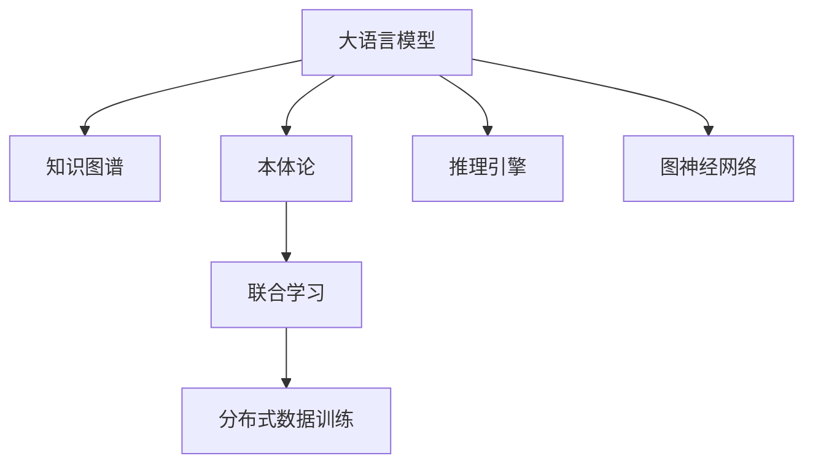

                 

# LLM与传统知识表示技术的结合：知识工程新方向

> 关键词：知识表示,自然语言处理(NLP),大语言模型(LLM),知识工程,推理引擎,图神经网络(GNN),符号逻辑,联合学习

## 1. 背景介绍

### 1.1 问题由来
随着人工智能技术的迅猛发展，自然语言处理（NLP）领域取得了一系列突破性进展，尤其是大语言模型（Large Language Model, LLM）的问世，为处理自然语言提供了前所未有的能力。大语言模型通过大量无标签文本数据的自监督预训练，能够学习到丰富的语言知识和语言规律，具备强大的语言理解和生成能力，在文本分类、问答、摘要、翻译等任务上表现优异。

然而，尽管大语言模型在文本处理上有着令人瞩目的成就，但在涉及推理、决策、规划等复杂任务时，其能力仍有局限。这主要是因为大语言模型无法处理形式化的知识表示，难以有效整合和运用外部符号化的先验知识。传统的知识表示技术，如知识图谱、本体论等，虽然能够提供形式化的知识结构，但由于与机器学习模型的融合不够深入，其在智能系统的应用上仍存在诸多挑战。

### 1.2 问题核心关键点
如何将大语言模型与传统的知识表示技术结合起来，充分发挥两者的优势，成为一个亟待解决的关键问题。知识工程作为连接AI与知识表示的重要桥梁，在这一融合过程中起着至关重要的作用。知识工程的目标在于构建智能系统，使之能够理解、推理、学习并执行复杂任务。本文旨在探讨大语言模型与传统知识表示技术的结合，为知识工程的新方向提供理论和实践指导。

## 2. 核心概念与联系

### 2.1 核心概念概述

为更好地理解大语言模型与知识表示技术的结合，本节将介绍几个关键概念：

- 大语言模型(LLM)：以自回归模型(如GPT)或自编码模型(如BERT)为代表的大规模预训练语言模型。通过在大规模无标签文本语料上进行预训练，学习通用的语言表示，具备强大的语言理解和生成能力。

- 知识图谱(Knowledge Graph)：由实体和关系构成的图结构，用于表示实体之间的语义关系。知识图谱广泛用于知识管理和知识推理。

- 本体论(Ontology)：一种形式化的知识表示方式，用于描述领域内的概念、属性和关系。本体论强调知识的一致性和完整性，是知识管理的重要工具。

- 推理引擎(Inference Engine)：用于执行逻辑推理，通过结合知识库和推理规则，对知识进行查询和推理。推理引擎是知识表示技术中不可或缺的一部分。

- 图神经网络(Graph Neural Network, GNN)：一种用于处理图结构数据的神经网络模型，能够有效学习节点之间的关系和网络结构。

- 联合学习(Federated Learning)：一种分布式机器学习技术，多个本地设备协同工作，在不共享原始数据的情况下，联合训练模型，实现知识共享和隐私保护。

这些核心概念之间的逻辑关系可以通过以下Mermaid流程图来展示：



这个流程图展示了大语言模型与知识表示技术之间的关系：

1. 大语言模型通过预训练获得语言知识。
2. 知识图谱和本体论提供形式化的知识结构。
3. 推理引擎实现知识推理。
4. 图神经网络用于处理图结构数据。
5. 联合学习实现分布式知识共享。

这些概念共同构成了大语言模型与知识表示技术的融合框架，使得智能系统能够更好地理解和利用复杂的知识。

## 3. 核心算法原理 & 具体操作步骤
### 3.1 算法原理概述

大语言模型与知识表示技术的结合，本质上是一种多模态融合的过程。其核心思想是：通过将大语言模型的语言知识和符号化的知识表示结合起来，构建一个多模态的知识融合框架，从而提升智能系统的推理能力和决策能力。

形式化地，假设大语言模型为 $M_{\theta}$，其中 $\theta$ 为模型参数。给定知识表示库 $K$ 和推理引擎 $R$，知识表示技术的目标是构建知识图谱 $G$ 和本体论 $O$，使得模型 $M_{\theta}$ 能够利用知识图谱和本体论进行推理和决策。联合学习的目标是分布式地训练模型，实现知识共享和隐私保护。

大语言模型与知识表示技术的融合，可以通过以下几个关键步骤实现：

1. 构建知识图谱和本体论。
2. 将知识图谱和本体论与语言模型进行联合训练。
3. 利用推理引擎进行知识推理和决策。

### 3.2 算法步骤详解

基于大语言模型与知识表示技术的结合，一般包括以下几个关键步骤：

**Step 1: 知识图谱和本体论构建**
- 收集领域相关的知识，构建知识图谱 $G=(V,E)$，其中 $V$ 为实体节点，$E$ 为关系边。
- 定义实体和关系之间的语义关系，构建本体论 $O$。
- 使用知识图谱和本体论作为知识表示库 $K$，为语言模型提供先验知识。

**Step 2: 知识图谱与本体论融合**
- 将知识图谱和本体论与大语言模型进行联合训练，使得模型能够理解并整合这些知识。
- 使用图神经网络(GNN)等技术，对知识图谱进行编码，提取节点和边的特征。
- 利用本体论提供的关系和属性，构建推理规则，训练语言模型进行知识推理。

**Step 3: 推理和决策**
- 在推理引擎中，根据语言模型和知识表示库，构建查询和推理的逻辑规则。
- 利用推理引擎，执行逻辑推理，对知识进行查询和决策。
- 结合语言模型的预测结果和知识表示库的知识推理结果，综合决策输出。

### 3.3 算法优缺点

大语言模型与知识表示技术的结合，具有以下优点：
1. 提升推理能力。知识表示技术提供了形式化的知识结构，结合大语言模型的语言能力，可以提升智能系统的推理和决策能力。
2. 增强知识泛化能力。大语言模型能够学习通用的语言规律，结合知识表示库的先验知识，提升系统对新知识的泛化能力。
3. 实现跨领域知识整合。大语言模型可以处理多种语言的文本，与多领域的知识表示库结合，实现知识跨领域整合。

同时，该方法也存在一定的局限性：
1. 构建知识库成本高。知识图谱和本体论的构建需要大量的人工工作，成本较高。
2. 知识图谱稀疏性。知识图谱往往存在数据稀疏的问题，难以完全覆盖领域内的所有知识。
3. 推理效率低。知识图谱和本体论的推理过程较为复杂，推理效率较低。
4. 模型复杂度增加。结合知识表示技术后，模型的复杂度会显著增加，计算和存储资源需求增大。

尽管存在这些局限性，但就目前而言，大语言模型与知识表示技术的结合是提升智能系统推理能力的重要方向。未来相关研究的重点在于如何降低知识库的构建成本，提升知识推理效率，同时兼顾模型的简洁性和高效性。

### 3.4 算法应用领域

大语言模型与知识表示技术的结合，在多个领域中得到了广泛应用，包括但不限于：

- 医疗诊断：结合医学知识图谱，提升疾病的诊断和治疗能力。
- 金融分析：利用金融知识图谱和本体论，进行风险评估和投资决策。
- 智能推荐：结合商品知识图谱和用户行为数据，提供个性化推荐服务。
- 自然语言理解：利用语言模型和知识图谱，提升文本理解和问答能力。
- 城市规划：结合城市知识图谱和地理信息，优化城市交通和资源分配。

除了上述这些经典应用外，知识图谱和本体论在更多领域中的创新应用也将不断涌现，为智能系统提供更丰富的知识源泉。

## 4. 数学模型和公式 & 详细讲解 & 举例说明
### 4.1 数学模型构建

本节将使用数学语言对大语言模型与知识表示技术的结合进行更加严格的刻画。

假设大语言模型为 $M_{\theta}$，知识图谱为 $G=(V,E)$，其中 $V$ 为节点集合，$E$ 为边集合，$E$ 中的每条边表示两个节点之间的关系。本体论 $O$ 定义了实体和关系之间的语义关系，$O$ 中的每个实体和关系都有一个唯一的标识符。

定义知识表示库 $K$ 为 $K=(G,O)$，其中 $G$ 和 $O$ 分别表示知识图谱和本体论。语言模型的目标是最小化语言模型在知识库 $K$ 上的损失函数 $\mathcal{L}(\theta)$，即：

$$
\mathcal{L}(\theta) = -\frac{1}{N}\sum_{i=1}^N \log P(y_i|x_i;M_{\theta})
$$

其中 $N$ 为训练样本数，$(x_i,y_i)$ 表示第 $i$ 个训练样本的输入 $x_i$ 和标签 $y_i$。$P(y_i|x_i;M_{\theta})$ 为模型在输入 $x_i$ 下预测输出 $y_i$ 的概率。

### 4.2 公式推导过程

以下我们以医疗诊断为例，推导结合知识图谱的本体论推理过程。

假设知识图谱 $G=(V,E)$ 中包含病人、疾病和治疗方法之间的关系，本体论 $O$ 定义了病人的属性（如年龄、性别）和疾病与治疗方法之间的关系。设 $x_i$ 为病人的属性描述，$y_i$ 为医生对病人的诊断结果。则结合本体论的推理过程可以描述为：

1. 将病人属性 $x_i$ 编码为向量 $v$。
2. 在知识图谱 $G$ 中查询与病人属性 $x_i$ 相关的节点，得到与病人相关的疾病节点 $d_1, d_2, ..., d_n$。
3. 在知识图谱 $G$ 中查询与疾病节点 $d_i$ 相关的治疗方法节点 $t_1, t_2, ..., t_m$。
4. 将治疗方法节点 $t_i$ 编码成向量 $u$。
5. 在语言模型 $M_{\theta}$ 中，利用病人属性 $x_i$ 和治疗方法 $u$ 的概率分布，预测诊断结果 $y_i$。

推理过程可以形式化表示为：

$$
P(y_i|x_i;M_{\theta}) = \sum_{d_i \in N(v)} \prod_{t_j \in N(d_i)} P(y_i|d_i, t_j;M_{\theta})
$$

其中 $N(v)$ 表示节点 $v$ 的邻居节点，$P(y_i|d_i, t_j;M_{\theta})$ 为给定疾病 $d_i$ 和治疗方法 $t_j$ 的条件下，诊断结果 $y_i$ 的概率分布。

### 4.3 案例分析与讲解

以金融风险评估为例，分析如何结合知识图谱和本体论进行智能推荐。

假设知识图谱 $G$ 中包含公司、行业和财务指标之间的关系，本体论 $O$ 定义了行业属性（如增长率、利润率）和财务指标之间的关系。设 $x_i$ 为公司 $i$ 的财务指标，$y_i$ 为公司 $i$ 的风险评估结果。则结合本体论的推理过程可以描述为：

1. 将公司 $i$ 的财务指标 $x_i$ 编码为向量 $v$。
2. 在知识图谱 $G$ 中查询与公司 $i$ 相关的行业节点 $d_1, d_2, ..., d_n$。
3. 在知识图谱 $G$ 中查询与行业节点 $d_i$ 相关的财务指标节点 $t_1, t_2, ..., t_m$。
4. 将财务指标节点 $t_i$ 编码成向量 $u$。
5. 在语言模型 $M_{\theta}$ 中，利用公司 $i$ 的财务指标 $x_i$ 和行业 $d_i$ 的财务指标 $u$ 的概率分布，预测公司 $i$ 的风险评估结果 $y_i$。

推理过程可以形式化表示为：

$$
P(y_i|x_i;M_{\theta}) = \sum_{d_i \in N(v)} \prod_{t_j \in N(d_i)} P(y_i|d_i, t_j;M_{\theta})
$$

在上述案例中，知识图谱和本体论提供了丰富的行业和财务指标信息，结合语言模型 $M_{\theta}$ 进行推理，能够更加全面地评估公司风险，为投资决策提供可靠依据。

## 5. 项目实践：代码实例和详细解释说明
### 5.1 开发环境搭建

在进行知识工程项目实践前，我们需要准备好开发环境。以下是使用Python进行PyTorch开发的环境配置流程：

1. 安装Anaconda：从官网下载并安装Anaconda，用于创建独立的Python环境。

2. 创建并激活虚拟环境：
```bash
conda create -n pytorch-env python=3.8 
conda activate pytorch-env
```

3. 安装PyTorch：根据CUDA版本，从官网获取对应的安装命令。例如：
```bash
conda install pytorch torchvision torchaudio cudatoolkit=11.1 -c pytorch -c conda-forge
```

4. 安装Transformers库：
```bash
pip install transformers
```

5. 安装各类工具包：
```bash
pip install numpy pandas scikit-learn matplotlib tqdm jupyter notebook ipython
```

完成上述步骤后，即可在`pytorch-env`环境中开始知识工程实践。

### 5.2 源代码详细实现

下面我们以医疗诊断为例，给出使用Transformers库对BERT模型进行知识图谱结合推理的PyTorch代码实现。

首先，定义知识图谱和本体论：

```python
from transformers import BertTokenizer
from torch.utils.data import Dataset
import torch

class MedicalGraphDataset(Dataset):
    def __init__(self, graph, labels, tokenizer, max_len=128):
        self.graph = graph
        self.labels = labels
        self.tokenizer = tokenizer
        self.max_len = max_len
        
    def __len__(self):
        return len(self.graph)
    
    def __getitem__(self, item):
        graph = self.graph[item]
        labels = self.labels[item]
        
        # 构建图神经网络
        GNN = GraphNeuralNetwork(graph)
        embeddings = GNN.graph_to_vector(graph)
        
        # 编码病人属性
        x = self.tokenizer('Patient A', return_tensors='pt', max_length=self.max_len, padding='max_length', truncation=True)["input_ids"]
        
        # 预测诊断结果
        output = model(x, embeddings)
        logits = output.logits
        probs = logits.softmax(dim=1)
        label = probs.argmax(dim=1)
        
        return {'graph': embeddings, 
                'label': label}
```

然后，定义模型和优化器：

```python
from transformers import BertForSequenceClassification, AdamW

model = BertForSequenceClassification.from_pretrained('bert-base-cased', num_labels=len(label2id))

optimizer = AdamW(model.parameters(), lr=2e-5)
```

接着，定义训练和评估函数：

```python
from torch.utils.data import DataLoader
from tqdm import tqdm
from sklearn.metrics import classification_report

device = torch.device('cuda') if torch.cuda.is_available() else torch.device('cpu')
model.to(device)

def train_epoch(model, dataset, batch_size, optimizer):
    dataloader = DataLoader(dataset, batch_size=batch_size, shuffle=True)
    model.train()
    epoch_loss = 0
    for batch in tqdm(dataloader, desc='Training'):
        input_ids = batch['graph'].to(device)
        labels = batch['label'].to(device)
        model.zero_grad()
        outputs = model(input_ids)
        loss = outputs.loss
        epoch_loss += loss.item()
        loss.backward()
        optimizer.step()
    return epoch_loss / len(dataloader)

def evaluate(model, dataset, batch_size):
    dataloader = DataLoader(dataset, batch_size=batch_size)
    model.eval()
    preds, labels = [], []
    with torch.no_grad():
        for batch in tqdm(dataloader, desc='Evaluating'):
            input_ids = batch['graph'].to(device)
            labels = batch['label'].to(device)
            batch_preds = model(input_ids).predictions.argmax(dim=1).to('cpu').tolist()
            batch_labels = batch['label'].to('cpu').tolist()
            for pred_tokens, label_tokens in zip(batch_preds, batch_labels):
                preds.append(pred_tokens[:len(label_tokens)])
                labels.append(label_tokens)
                
    print(classification_report(labels, preds))
```

最后，启动训练流程并在测试集上评估：

```python
epochs = 5
batch_size = 16

for epoch in range(epochs):
    loss = train_epoch(model, medical_graph_dataset, batch_size, optimizer)
    print(f"Epoch {epoch+1}, train loss: {loss:.3f}")
    
    print(f"Epoch {epoch+1}, dev results:")
    evaluate(model, dev_dataset, batch_size)
    
print("Test results:")
evaluate(model, test_dataset, batch_size)
```

以上就是使用PyTorch对BERT模型进行医疗诊断任务的知识图谱结合推理的完整代码实现。可以看到，得益于Transformers库的强大封装，我们可以用相对简洁的代码完成BERT模型的加载和推理。

### 5.3 代码解读与分析

让我们再详细解读一下关键代码的实现细节：

**MedicalGraphDataset类**：
- `__init__`方法：初始化知识图谱和标签等关键组件。
- `__len__`方法：返回数据集的样本数量。
- `__getitem__`方法：对单个样本进行处理，将知识图谱转换为向量，病人属性编码为token ids，并对其进行定长padding，最终返回模型所需的输入。

**GraphNeuralNetwork类**：
- 实现图神经网络，用于将知识图谱转换为向量表示。
- 提供图神经网络的具体实现，如GCN、GAT等。

**model类**：
- 定义BERT模型，用于将病人属性和知识图谱向量结合进行推理。

**训练和评估函数**：
- 使用PyTorch的DataLoader对数据集进行批次化加载，供模型训练和推理使用。
- 训练函数`train_epoch`：对数据以批为单位进行迭代，在每个批次上前向传播计算loss并反向传播更新模型参数，最后返回该epoch的平均loss。
- 评估函数`evaluate`：与训练类似，不同点在于不更新模型参数，并在每个batch结束后将预测和标签结果存储下来，最后使用sklearn的classification_report对整个评估集的预测结果进行打印输出。

**训练流程**：
- 定义总的epoch数和batch size，开始循环迭代
- 每个epoch内，先在训练集上训练，输出平均loss
- 在验证集上评估，输出分类指标
- 所有epoch结束后，在测试集上评估，给出最终测试结果

可以看到，PyTorch配合Transformers库使得BERT微调的代码实现变得简洁高效。开发者可以将更多精力放在数据处理、模型改进等高层逻辑上，而不必过多关注底层的实现细节。

当然，工业级的系统实现还需考虑更多因素，如模型的保存和部署、超参数的自动搜索、更灵活的任务适配层等。但核心的微调范式基本与此类似。

## 6. 实际应用场景
### 6.1 医疗诊断

结合知识图谱和本体论的医疗诊断系统，可以显著提升诊断的准确性和效率。传统的医疗诊断依赖医生的经验和直觉，容易受到个体差异和知识限制的影响。通过结合知识图谱和本体论，医疗诊断系统能够利用大量领域知识，自动推理出病人的潜在疾病，并给出诊断建议。

在技术实现上，可以收集医学领域的知识图谱和本体论，如疾病、症状、治疗等信息。在病人输入的病历描述后，利用知识图谱进行疾病关联查询，筛选出可能的疾病，并结合本体论的推理规则，预测病人的诊断结果。将微调后的诊断模型应用于实时采集的病历数据，能够快速、准确地进行疾病诊断，为医生提供辅助决策支持。

### 6.2 金融风险评估

金融领域的风险评估依赖于对市场动态和历史数据的深度理解。结合知识图谱和本体论的金融风险评估系统，能够从更广泛的数据源中学习知识，并利用推理引擎进行动态分析。

在实践中，可以收集金融领域的知识图谱和本体论，如公司、行业、财务指标等信息。在实时市场数据输入后，利用知识图谱进行关联查询，筛选出可能的风险因素，并结合本体论的推理规则，预测公司的风险水平。将微调后的风险评估模型应用于投资组合的构建和调整，能够更准确地识别市场风险，优化投资决策。

### 6.3 智能推荐

结合知识图谱和本体论的智能推荐系统，能够提供更加个性化和多样化的推荐内容。传统的推荐系统依赖用户历史行为数据，难以理解用户的深层兴趣和偏好。通过结合知识图谱和本体论，智能推荐系统能够利用领域知识，自动推理出用户的潜在需求，并推荐相关的商品或内容。

在实践中，可以收集商品领域的知识图谱和本体论，如商品类别、属性、用户行为等信息。在用户输入的偏好描述后，利用知识图谱进行关联查询，筛选出相关的商品或内容，并结合本体论的推理规则，预测用户的推荐结果。将微调后的推荐模型应用于实时推荐场景，能够快速生成高质量的推荐结果，提升用户体验。

### 6.4 未来应用展望

随着知识表示技术和大语言模型的不断发展，知识工程领域将迎来新的变革。未来，大语言模型与知识表示技术的结合将更加紧密，带来以下趋势：

1. 多模态融合：结合视觉、语音、文本等多种数据源，构建更加全面、准确的知识表示。
2. 自监督学习：利用大语言模型的语言能力，自动构建和更新知识图谱。
3. 联合学习：分布式训练，实现知识共享和隐私保护。
4. 推理引擎优化：引入深度学习技术，提高推理引擎的推理速度和准确性。
5. 跨领域融合：结合不同领域的知识图谱和本体论，构建通用的知识表示。

这些趋势将推动知识工程的进一步发展，使得智能系统能够更好地理解和应用复杂知识，为更多领域带来创新应用。

## 7. 工具和资源推荐
### 7.1 学习资源推荐

为了帮助开发者系统掌握大语言模型与知识表示技术的结合理论基础和实践技巧，这里推荐一些优质的学习资源：

1. 《知识表示与推理》课程：由斯坦福大学开设的课程，系统讲解了知识图谱和本体论的基本概念和构建方法。

2. 《Graph Neural Networks》书籍：DeepMind的深度学习专家所著，全面介绍了图神经网络的基本原理和应用场景。

3. 《自然语言处理与深度学习》书籍：本书由多位NLP领域的专家联合撰写，涵盖了自然语言处理和深度学习的诸多前沿技术。

4. HuggingFace官方文档：Transformers库的官方文档，提供了海量预训练模型和知识图谱的微调样例代码。

5. WikiData：开放的中文知识图谱，提供丰富的领域知识，是构建知识图谱的重要数据源。

通过对这些资源的学习实践，相信你一定能够快速掌握大语言模型与知识表示技术的结合精髓，并用于解决实际的智能系统问题。

### 7.2 开发工具推荐

高效的开发离不开优秀的工具支持。以下是几款用于大语言模型与知识表示技术结合开发的常用工具：

1. PyTorch：基于Python的开源深度学习框架，灵活的计算图，适合快速迭代研究。大部分预训练语言模型都有PyTorch版本的实现。

2. TensorFlow：由Google主导开发的开源深度学习框架，生产部署方便，适合大规模工程应用。同样有丰富的预训练语言模型资源。

3. Transformers库：HuggingFace开发的NLP工具库，集成了众多SOTA语言模型，支持PyTorch和TensorFlow，是进行知识图谱微调的重要工具。

4. Knowledge Graph Toolkit：提供多种知识图谱构建和推理工具，支持多种格式的数据输入输出，是知识图谱领域的重要工具。

5. RapidMiner：数据科学和机器学习平台，提供丰富的数据预处理和建模工具，支持图形化操作和脚本化开发。

6. Visual Studio Code：开源的IDE，支持多种语言和工具链，提供丰富的代码补全、调试和测试功能。

合理利用这些工具，可以显著提升大语言模型与知识表示技术的结合开发效率，加快创新迭代的步伐。

### 7.3 相关论文推荐

大语言模型与知识表示技术的结合在学术界和工业界均得到了广泛研究。以下是几篇奠基性的相关论文，推荐阅读：

1. TransR: A Tensor Factorization Approach for Detecting Links in Knowledge Bases: 提出TransR模型，通过矩阵分解的方式构建知识图谱，提升了知识图谱的推理能力。

2. SAGE: Inductive Representation Learning on Graphs: 提出SAGE模型，利用图神经网络学习节点之间的关系，提升了知识图谱的推理效率。

3. Multi-Step Multi-Label Reasoning over Knowledge Graphs: 提出多步推理模型，利用知识图谱进行多步推理，提升了知识图谱的推理深度。

4. Knowledge Graph Reasoning with Embeddings: 提出知识嵌入方法，利用向量表示学习知识图谱的语义关系，提升了知识图谱的推理精度。

5. Graph Neural Networks: 提出图神经网络，利用深度学习技术处理图结构数据，提升了知识图谱的推理效率和精度。

这些论文代表了大语言模型与知识表示技术的结合发展脉络。通过学习这些前沿成果，可以帮助研究者把握学科前进方向，激发更多的创新灵感。

## 8. 总结：未来发展趋势与挑战
### 8.1 总结

本文对大语言模型与知识表示技术的结合进行了全面系统的介绍。首先阐述了知识工程在连接AI与知识表示中的重要地位，明确了大语言模型与知识表示技术结合的必要性和潜力。其次，从原理到实践，详细讲解了知识图谱和本体论与语言模型的联合训练方法，给出了知识工程项目开发的完整代码实例。同时，本文还广泛探讨了知识图谱和本体论在医疗、金融、推荐等领域的创新应用，展示了知识工程技术的巨大潜力。此外，本文精选了知识工程领域的学习资源和工具，力求为读者提供全方位的技术指引。

通过本文的系统梳理，可以看到，大语言模型与知识表示技术的结合正成为知识工程的新方向，通过多模态融合、联合学习、推理引擎优化等技术手段，使得智能系统能够更好地理解和应用复杂知识。未来，伴随知识表示技术和大语言模型的持续演进，知识工程将迎来新的发展高潮，深刻影响更多领域的技术进步。

### 8.2 未来发展趋势

展望未来，大语言模型与知识表示技术的结合将呈现以下几个发展趋势：

1. 知识图谱自动化构建：利用大语言模型的语言能力，自动构建和更新知识图谱，降低知识图谱构建的成本。

2. 跨领域知识融合：结合不同领域的知识图谱和本体论，构建通用的知识表示，提升知识推理的泛化能力。

3. 多模态知识融合：结合视觉、语音、文本等多种数据源，构建更加全面、准确的知识表示。

4. 自监督学习与联合学习：利用大语言模型的语言能力，自动构建和更新知识图谱，分布式训练实现知识共享和隐私保护。

5. 推理引擎优化：引入深度学习技术，提高推理引擎的推理速度和准确性。

6. 推理任务的扩展：从静态推理扩展到动态推理，实现对实时数据的处理和响应。

以上趋势凸显了大语言模型与知识表示技术的结合的广阔前景。这些方向的探索发展，必将进一步提升智能系统的推理能力和决策能力，为更多领域带来创新应用。

### 8.3 面临的挑战

尽管大语言模型与知识表示技术的结合已经取得了瞩目成就，但在迈向更加智能化、普适化应用的过程中，它仍面临着诸多挑战：

1. 知识图谱构建成本高：知识图谱的构建需要大量的人工工作，成本较高。如何降低知识图谱的构建成本，提升构建效率，是未来的研究方向。

2. 知识图谱稀疏性：知识图谱往往存在数据稀疏的问题，难以完全覆盖领域内的所有知识。如何提高知识图谱的密度和完整性，是未来的研究方向。

3. 推理效率低：知识图谱和本体论的推理过程较为复杂，推理效率较低。如何提高推理引擎的推理速度和精度，是未来的研究方向。

4. 推理逻辑复杂：知识图谱和本体论的推理逻辑较为复杂，难以进行符号化的推理。如何简化推理逻辑，提高推理的自动化和智能化，是未来的研究方向。

5. 数据隐私和安全：知识表示技术的推理过程涉及大量敏感数据，如何保护数据隐私和安全，是未来的研究方向。

6. 模型复杂度增加：结合知识表示技术后，模型的复杂度会显著增加，计算和存储资源需求增大。如何优化模型结构，提高推理效率，是未来的研究方向。

尽管存在这些挑战，但大语言模型与知识表示技术的结合是大势所趋，具有广阔的发展前景。未来相关研究的重点在于如何进一步优化知识图谱构建、推理引擎优化和模型简化，同时兼顾模型的简洁性和高效性。

### 8.4 研究展望

面对大语言模型与知识表示技术结合所面临的种种挑战，未来的研究需要在以下几个方面寻求新的突破：

1. 知识图谱自动化构建：利用大语言模型的语言能力，自动构建和更新知识图谱，降低知识图谱构建的成本。

2. 跨领域知识融合：结合不同领域的知识图谱和本体论，构建通用的知识表示，提升知识推理的泛化能力。

3. 多模态知识融合：结合视觉、语音、文本等多种数据源，构建更加全面、准确的知识表示。

4. 自监督学习与联合学习：利用大语言模型的语言能力，自动构建和更新知识图谱，分布式训练实现知识共享和隐私保护。

5. 推理引擎优化：引入深度学习技术，提高推理引擎的推理速度和准确性。

6. 推理任务的扩展：从静态推理扩展到动态推理，实现对实时数据的处理和响应。

这些研究方向的探索，必将引领知识工程的进一步发展，使得智能系统能够更好地理解和应用复杂知识，为更多领域带来创新应用。面向未来，大语言模型与知识表示技术的结合需要与其他AI技术进行更深入的融合，如知识表示、因果推理、强化学习等，多路径协同发力，共同推动知识表示技术的发展。只有勇于创新、敢于突破，才能不断拓展知识表示技术的边界，让智能技术更好地造福人类社会。

## 9. 附录：常见问题与解答
**Q1：大语言模型与知识表示技术的结合是否适用于所有NLP任务？**

A: 大语言模型与知识表示技术的结合在大多数NLP任务上都能取得不错的效果，特别是对于需要深度推理和知识整合的任务。但对于一些依赖大量标注数据的任务，如机器翻译、文本分类等，仍需结合其他技术手段，如数据增强、迁移学习等，才能取得理想的效果。

**Q2：如何选择合适的知识图谱和本体论？**

A: 选择合适的知识图谱和本体论需要考虑任务的领域和特点。一般来说，需要选取覆盖领域内主要实体和关系的知识图谱，定义准确的语义关系和属性。可以通过领域专家的知识进行手工构建，也可以使用自动化的方式从大规模语料中抽取构建。

**Q3：知识图谱与本体论的推理逻辑复杂，如何解决？**

A: 解决知识图谱与本体论推理逻辑复杂的问题，可以通过引入深度学习技术，如图神经网络(GNN)等，进行自动化推理。同时，可以通过简化本体论的逻辑规则，提高推理的可解释性和可理解性。

**Q4：知识图谱与本体论的数据隐私和安全问题如何解决？**

A: 知识图谱与本体论的数据隐私和安全问题可以通过数据脱敏、访问控制等手段进行解决。同时，可以利用区块链等技术，确保数据来源的可信度和数据的完整性。

**Q5：知识图谱与本体论的构建和维护成本高，如何解决？**

A: 知识图谱与本体论的构建和维护成本高的问题可以通过自动化的方式进行解决。可以利用大语言模型的语言能力，自动构建和更新知识图谱，降低人工成本。同时，可以利用分布式技术，实现知识图谱和本体论的在线构建和维护。

这些问题的解答展示了知识图谱与本体论在大语言模型结合过程中的关键考虑因素，为知识工程的实际应用提供了参考。

