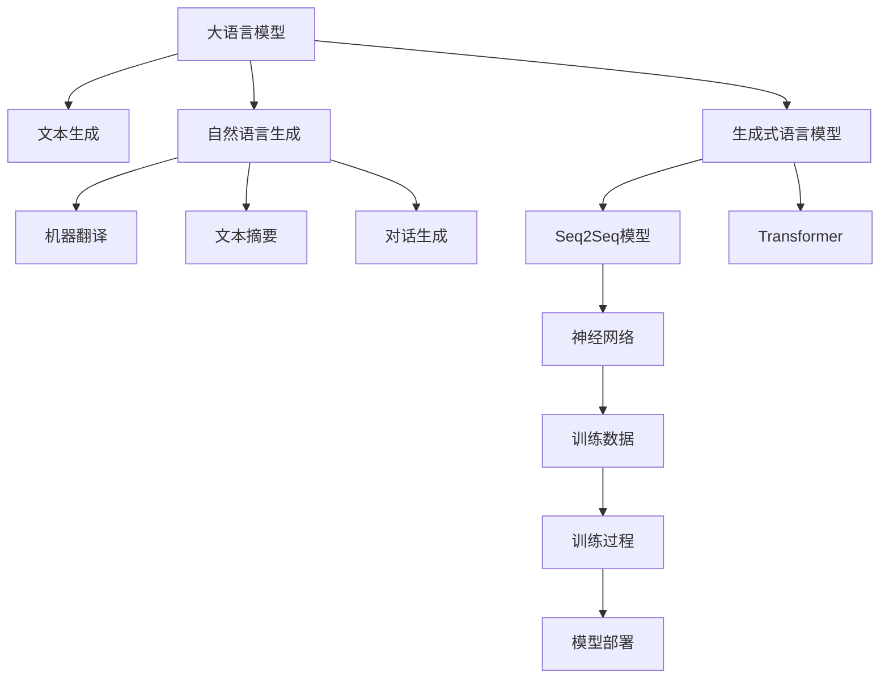

                 

# LLM与传统自然语言生成的对比

> 关键词：
大语言模型(LLM), 自然语言生成(NLG), 文本生成, 生成式语言模型, 神经网络, 自然语言处理(NLP), 序列到序列(Seq2Seq), 深度学习, Transformer, 传统NLG方法, 人工智能(AI), 机器学习(ML)

## 1. 背景介绍

### 1.1 问题由来
自然语言生成(NLG)是自然语言处理(NLP)领域的一个重要分支，其目标是将非语言形式的数据转化为可读、可理解的自然语言文本。传统的自然语言生成方法主要包括基于规则的方法和基于统计的方法。然而，随着深度学习技术的发展，特别是Transformer模型的出现，一种全新的自然语言生成范式——基于大语言模型(LLM)的方法应运而生，并迅速在NLP领域取得了突破性的进展。

### 1.2 问题核心关键点
LLM方法与传统NLG方法相比，在生成质量、生成效率、泛化能力等方面具有显著优势。但与此同时，LLM方法也面临数据需求高、计算资源消耗大、模型难以解释等问题。本文将对LLM与传统NLG方法进行全面对比，探析其优缺点，并展望未来的发展趋势和面临的挑战。

## 2. 核心概念与联系

### 2.1 核心概念概述

为更好地理解LLM与传统NLG方法的对比，本节将介绍几个密切相关的核心概念：

- 大语言模型(LLM)：以自回归(如GPT)或自编码(如BERT)模型为代表的大规模预训练语言模型。通过在大规模无标签文本语料上进行预训练，学习通用的语言知识，具备强大的语言理解和生成能力。

- 自然语言生成(NLG)：将非语言形式的数据转化为自然语言文本的过程。常见的NLG任务包括机器翻译、文本摘要、对话生成等。

- 文本生成：通过模型自动生成自然语言文本，是NLG的一个核心应用领域。

- 生成式语言模型：基于深度神经网络的文本生成模型，通过预测下一个单词或字符来生成文本。

- 神经网络：由大量神经元和连接构成的计算模型，广泛应用于深度学习领域。

- 序列到序列(Seq2Seq)：一种常见的网络结构，用于将一个序列映射到另一个序列，广泛应用于翻译、摘要等任务。

- Transformer：一种基于自注意力机制的神经网络结构，在大规模语言模型和NLG任务中取得了优异效果。

- 传统NLG方法：基于规则的模板填充、基于统计的N-gram模型等方法。

- 人工智能(AI)：通过模拟、扩展人类智能行为来实现任务目标的技术。

- 机器学习(ML)：通过数据驱动的学习方法，使机器自动提升任务性能。

这些核心概念之间的逻辑关系可以通过以下Mermaid流程图来展示：



这个流程图展示了大语言模型与传统NLG方法的核心概念及其之间的关系：

1. 大语言模型通过预训练获得基础能力。
2. 文本生成是大语言模型的重要应用领域之一。
3. 自然语言生成任务包括机器翻译、文本摘要、对话生成等。
4. 生成式语言模型是文本生成的重要基础。
5. 神经网络是生成式语言模型的核心。
6. 训练数据和模型训练过程是模型提升性能的关键。
7. 模型部署是将训练好的模型应用到实际场景中。

这些概念共同构成了大语言模型和传统自然语言生成方法的框架，使其能够针对不同的任务进行灵活设计和实现。

## 3. 核心算法原理 & 具体操作步骤
### 3.1 算法原理概述

大语言模型(LLM)与传统自然语言生成方法的主要区别在于模型的架构和训练方式。

LLM通过在大规模无标签文本数据上进行自监督预训练，学习到丰富的语言知识，包括词向量、语义理解、语言结构等。预训练完成后，通过任务适配层对模型进行微调，使其能够针对特定任务生成高质量的自然语言文本。

传统NLG方法则更多依赖于统计模型和规则模板。基于统计的NLG方法如N-gram模型，通过统计不同字符或单词组合出现的频率来生成文本。而基于规则的方法，如模板填充，则是根据特定的语法规则和词汇表来生成文本。

### 3.2 算法步骤详解

以下是大语言模型与传统NLG方法的具体操作步骤对比：

**大语言模型步骤：**

1. **预训练**：在大规模无标签文本数据上进行自监督预训练，学习语言知识。
2. **微调**：在特定任务的数据集上进行微调，如对话、机器翻译、文本摘要等。
3. **生成**：通过模型预测下一个单词或字符，逐步生成自然语言文本。

**传统NLG方法步骤：**

1. **训练**：在标注好的数据集上进行监督学习，学习语言生成规则。
2. **生成**：根据学习到的规则，结合模板或词汇表生成文本。

### 3.3 算法优缺点

大语言模型与传统NLG方法各有优缺点，具体如下：

**大语言模型的优点：**

1. **生成质量高**：通过预训练学习丰富的语言知识，生成文本质量高。
2. **可扩展性强**：能够处理各种语言生成任务，具有较强的泛化能力。
3. **支持少样本学习**：通过提示学习等方法，可以在少量数据的情况下生成高质量文本。

**大语言模型的缺点：**

1. **数据需求高**：需要大量的无标签文本数据进行预训练，数据获取成本高。
2. **计算资源消耗大**：大规模模型的训练和推理需要大量的计算资源。
3. **模型难以解释**：黑盒模型，难以解释其内部的推理过程。

**传统NLG方法的优点：**

1. **训练速度快**：数据量小，训练速度较快。
2. **模型透明**：基于规则或统计模型，容易解释和调试。
3. **资源消耗少**：模型参数少，计算资源消耗小。

**传统NLG方法的缺点：**

1. **生成质量差**：缺乏足够的语言知识，生成文本质量较低。
2. **泛化能力弱**：仅能处理特定任务，对新任务的适应能力差。
3. **难以支持少样本学习**：需要大量标注数据，对小样本情况处理能力弱。

### 3.4 算法应用领域

大语言模型与传统NLG方法在应用领域上也有显著差异：

**大语言模型的应用领域：**

1. **机器翻译**：将一种语言的文本翻译成另一种语言的文本。
2. **文本摘要**：将长文本压缩成简短的摘要。
3. **对话系统**：使机器能够与人类进行自然对话。
4. **文本生成**：生成各种类型的文本，如新闻、故事、评论等。
5. **问答系统**：根据用户输入的问题，自动给出答案。

**传统NLG方法的应用领域：**

1. **模板填充**：根据特定模板，自动填充文本内容。
2. **摘要生成**：从大量文本中自动生成摘要。
3. **翻译**：将文本翻译成目标语言。
4. **对话系统**：根据特定规则生成对话回复。
5. **文本分类**：将文本分类到不同的类别中。

## 4. 数学模型和公式 & 详细讲解 & 举例说明

### 4.1 数学模型构建

本节将使用数学语言对大语言模型与传统NLG方法进行更加严格的刻画。

**大语言模型的数学模型：**

1. **预训练目标函数**：
   $$
   \min_{\theta} \frac{1}{N} \sum_{i=1}^N L(x_i, y_i; \theta)
   $$
   其中，$L(x_i, y_i; \theta)$ 为预训练损失函数，$x_i$ 为输入文本，$y_i$ 为对应标签，$\theta$ 为模型参数。

2. **微调目标函数**：
   $$
   \min_{\theta} \frac{1}{N} \sum_{i=1}^N L(x_i, y_i; \theta)
   $$
   其中，$L(x_i, y_i; \theta)$ 为微调损失函数，$x_i$ 为输入文本，$y_i$ 为对应标签，$\theta$ 为模型参数。

3. **生成目标函数**：
   $$
   p(y|x) = \frac{e^{M(x, y; \theta)}}{e^{M(x, y; \theta)} + \sum_{y'} e^{M(x, y'; \theta)}}
   $$
   其中，$M(x, y; \theta)$ 为生成模型预测的损失函数，$y$ 为预测的下一个单词或字符。

**传统NLG方法的数学模型：**

1. **N-gram模型目标函数**：
   $$
   \min_{\theta} \frac{1}{N} \sum_{i=1}^N L(x_i, y_i; \theta)
   $$
   其中，$L(x_i, y_i; \theta)$ 为N-gram模型的损失函数，$x_i$ 为输入文本，$y_i$ 为对应标签，$\theta$ 为模型参数。

2. **基于规则的方法**：
   $$
   p(y|x) = \frac{P(x, y; \theta)}{\sum_{y'} P(x, y'; \theta)}
   $$
   其中，$P(x, y; \theta)$ 为规则模型的概率分布函数，$y$ 为预测的下一个单词或字符。

### 4.2 公式推导过程

以下我们以生成式语言模型为例，推导N-gram模型和基于自回归模型的目标函数。

**N-gram模型目标函数的推导：**

假设文本中每个单词的条件概率为：
$$
p(y|x) = \frac{P(x, y)}{P(x)}
$$
其中，$P(x, y)$ 为条件概率分布，$P(x)$ 为先验概率分布。

对于N-gram模型，条件概率分布可以表示为：
$$
P(x, y) = P(x_1)P(y|x_1)\prod_{i=2}^N P(y_i|x_{i-1})
$$
其中，$x_1, x_2, \ldots, x_N$ 为输入文本，$y_1, y_2, \ldots, y_N$ 为输出文本。

因此，N-gram模型的目标函数可以表示为：
$$
\min_{\theta} \frac{1}{N} \sum_{i=1}^N L(x_i, y_i; \theta)
$$

**基于自回归模型的目标函数的推导：**

基于自回归模型（如Transformer），条件概率分布可以表示为：
$$
p(y|x) = \frac{P(x, y)}{P(x)}
$$
其中，$P(x, y)$ 为自回归模型预测的损失函数，$y$ 为预测的下一个单词或字符。

自回归模型的条件概率分布可以表示为：
$$
P(x, y) = P(x_1)P(y|x_1)\prod_{i=2}^N P(y_i|x_{i-1})
$$
其中，$x_1, x_2, \ldots, x_N$ 为输入文本，$y_1, y_2, \ldots, y_N$ 为输出文本。

因此，基于自回归模型的目标函数可以表示为：
$$
\min_{\theta} \frac{1}{N} \sum_{i=1}^N L(x_i, y_i; \theta)
$$

### 4.3 案例分析与讲解

**N-gram模型案例分析**：

假设我们要生成一个简单的句子："the cat sat on the mat"。使用3-gram模型，首先需要学习文本中每个单词的条件概率，然后根据这些概率生成下一个单词。例如，学习到"the"后"cat"的条件概率为0.8，"cat"后"sat"的条件概率为0.9，则生成句子的过程为：
$$
\begin{align*}
p("the") &= 0.1 \\
p("the" | "the") &= 0.8 \\
p("the" | "the cat") &= 0.9 \\
p("the" | "the cat sat") &= 0.5 \\
p("the" | "the cat sat on") &= 0.7 \\
p("the" | "the cat sat on the") &= 0.3 \\
p("the" | "the cat sat on the") &= 0.2 \\
p("the" | "the cat sat on the mat") &= 0.8 \\
\end{align*}
$$

**基于自回归模型的案例分析**：

假设我们要生成一个简单的句子："the cat sat on the mat"。使用基于Transformer的自回归模型，首先将文本编码成向量，然后根据向量预测下一个单词。例如，学习到"the"后"cat"的条件概率为0.8，"cat"后"sat"的条件概率为0.9，则生成句子的过程为：
$$
\begin{align*}
\text{Encoder}(&#x27;the&#x27;) \rightarrow [\text{the}] \\
\text{Decoder}([\text{the}]) \rightarrow [\text{the cat}] \\
\text{Decoder}([\text{the cat}]) \rightarrow [\text{the cat sat}] \\
\text{Decoder}([\text{the cat sat}]) \rightarrow [\text{the cat sat on}] \\
\text{Decoder}([\text{the cat sat on}]) \rightarrow [\text{the cat sat on the}] \\
\text{Decoder}([\text{the cat sat on the}]) \rightarrow [\text{the cat sat on the mat}] \\
\end{align*}
$$

## 5. 项目实践：代码实例和详细解释说明

### 5.1 开发环境搭建

在进行大语言模型与传统NLG方法的比较实践前，我们需要准备好开发环境。以下是使用Python进行PyTorch开发的环境配置流程：

1. 安装Anaconda：从官网下载并安装Anaconda，用于创建独立的Python环境。

2. 创建并激活虚拟环境：
```bash
conda create -n pytorch-env python=3.8 
conda activate pytorch-env
```

3. 安装PyTorch：根据CUDA版本，从官网获取对应的安装命令。例如：
```bash
conda install pytorch torchvision torchaudio cudatoolkit=11.1 -c pytorch -c conda-forge
```

4. 安装Transformers库：
```bash
pip install transformers
```

5. 安装各类工具包：
```bash
pip install numpy pandas scikit-learn matplotlib tqdm jupyter notebook ipython
```

完成上述步骤后，即可在`pytorch-env`环境中开始微调实践。

### 5.2 源代码详细实现

下面我们以生成式语言模型和N-gram模型为例，给出使用Transformers库进行比较的PyTorch代码实现。

**生成式语言模型代码实现**：

```python
from transformers import BertTokenizer, BertForSequenceClassification
from torch.utils.data import Dataset
import torch

class CustomDataset(Dataset):
    def __init__(self, texts, labels, tokenizer, max_len=128):
        self.texts = texts
        self.labels = labels
        self.tokenizer = tokenizer
        self.max_len = max_len
        
    def __len__(self):
        return len(self.texts)
    
    def __getitem__(self, item):
        text = self.texts[item]
        label = self.labels[item]
        
        encoding = self.tokenizer(text, return_tensors='pt', max_length=self.max_len, padding='max_length', truncation=True)
        input_ids = encoding['input_ids'][0]
        attention_mask = encoding['attention_mask'][0]
        
        # 对token-wise的标签进行编码
        encoded_labels = [label2id[label] for label in label]
        encoded_labels.extend([label2id['O']] * (self.max_len - len(encoded_labels)))
        labels = torch.tensor(encoded_labels, dtype=torch.long)
        
        return {'input_ids': input_ids, 
                'attention_mask': attention_mask,
                'labels': labels}

# 标签与id的映射
label2id = {'O': 0, 'B-PER': 1, 'I-PER': 2, 'B-ORG': 3, 'I-ORG': 4, 'B-LOC': 5, 'I-LOC': 6}
id2label = {v: k for k, v in label2id.items()}

# 创建dataset
tokenizer = BertTokenizer.from_pretrained('bert-base-cased')

train_dataset = CustomDataset(train_texts, train_labels, tokenizer)
dev_dataset = CustomDataset(dev_texts, dev_labels, tokenizer)
test_dataset = CustomDataset(test_texts, test_labels, tokenizer)

# 模型定义
model = BertForSequenceClassification.from_pretrained('bert-base-cased', num_labels=len(label2id))

# 优化器
optimizer = AdamW(model.parameters(), lr=2e-5)

# 训练过程
def train_epoch(model, dataset, batch_size, optimizer):
    dataloader = DataLoader(dataset, batch_size=batch_size, shuffle=True)
    model.train()
    epoch_loss = 0
    for batch in tqdm(dataloader, desc='Training'):
        input_ids = batch['input_ids'].to(device)
        attention_mask = batch['attention_mask'].to(device)
        labels = batch['labels'].to(device)
        model.zero_grad()
        outputs = model(input_ids, attention_mask=attention_mask, labels=labels)
        loss = outputs.loss
        epoch_loss += loss.item()
        loss.backward()
        optimizer.step()
    return epoch_loss / len(dataloader)

# 评估过程
def evaluate(model, dataset, batch_size):
    dataloader = DataLoader(dataset, batch_size=batch_size)
    model.eval()
    preds, labels = [], []
    with torch.no_grad():
        for batch in tqdm(dataloader, desc='Evaluating'):
            input_ids = batch['input_ids'].to(device)
            attention_mask = batch['attention_mask'].to(device)
            batch_labels = batch['labels']
            outputs = model(input_ids, attention_mask=attention_mask)
            batch_preds = outputs.logits.argmax(dim=2).to('cpu').tolist()
            batch_labels = batch_labels.to('cpu').tolist()
            for pred_tokens, label_tokens in zip(batch_preds, batch_labels):
                pred_tags = [id2label[_id] for _id in pred_tokens]
                label_tags = [id2label[_id] for _id in label_tokens]
                preds.append(pred_tags[:len(label_tags)])
                labels.append(label_tags)
                
    print(classification_report(labels, preds))

# 训练流程
epochs = 5
batch_size = 16

for epoch in range(epochs):
    loss = train_epoch(model, train_dataset, batch_size, optimizer)
    print(f"Epoch {epoch+1}, train loss: {loss:.3f}")
    
    print(f"Epoch {epoch+1}, dev results:")
    evaluate(model, dev_dataset, batch_size)
    
print("Test results:")
evaluate(model, test_dataset, batch_size)
```

**N-gram模型代码实现**：

```python
from nltk.corpus import brown
from nltk.tokenize import word_tokenize
from nltk import FreqDist

# 读取BROWN语料库
brown = brown.sents()

# 生成词袋模型
vocab = set()
for sentence in brown:
    for word in word_tokenize(sentence):
        vocab.add(word)
    
# 创建N-gram模型
n = 3
ngram_model = {}
for i in range(n):
    for sentence in brown:
        for j in range(len(sentence) - n + 1):
            ngram = tuple(sentence[j:j+n])
            if ngram in ngram_model:
                ngram_model[ngram] += 1
            else:
                ngram_model[ngram] = 1

# 生成文本
seed_text = "the cat sat"
for i in range(10):
    for j in range(1, n+1):
        if seed_text[-j] in ngram_model:
            ngram = tuple(seed_text[-j:])
            seed_text += max(ngram_model[ngram], key=ngram_model.get)[0]

print(seed_text)
```

### 5.3 代码解读与分析

让我们再详细解读一下关键代码的实现细节：

**生成式语言模型代码实现**：
- `CustomDataset类`：定义了NLP任务的输入和标签，以及分词器等关键组件。
- `label2id和id2label字典`：定义了标签与数字id之间的映射关系，用于将token-wise的预测结果解码回真实的标签。
- `train_epoch和evaluate函数`：分别定义了训练和评估函数，其中`train_epoch`用于迭代训练模型，`evaluate`用于在验证集和测试集上评估模型性能。
- `train流程`：定义了总的epoch数和batch size，开始循环迭代，并在每个epoch内分别在训练集和验证集上训练和评估模型。

**N-gram模型代码实现**：
- 使用`nltk`库读取BROWN语料库，并进行分词处理。
- 创建词袋模型，统计每个n-gram出现的频率。
- 根据词袋模型生成文本，每次取概率最大的n-gram添加在当前文本末尾。

## 6. 实际应用场景

### 6.1 智能客服系统

基于大语言模型和传统NLG方法的自然语言生成技术，可以广泛应用于智能客服系统的构建。传统客服往往需要配备大量人力，高峰期响应缓慢，且一致性和专业性难以保证。而使用生成式语言模型或N-gram模型生成的智能客服，可以7x24小时不间断服务，快速响应客户咨询，用自然流畅的语言解答各类常见问题。

在技术实现上，可以收集企业内部的历史客服对话记录，将问题和最佳答复构建成监督数据，在此基础上对生成式语言模型或N-gram模型进行微调。微调后的模型能够自动理解用户意图，匹配最合适的答案模板进行回复。对于客户提出的新问题，还可以接入检索系统实时搜索相关内容，动态组织生成回答。如此构建的智能客服系统，能大幅提升客户咨询体验和问题解决效率。

### 6.2 金融舆情监测

金融机构需要实时监测市场舆论动向，以便及时应对负面信息传播，规避金融风险。传统的人工监测方式成本高、效率低，难以应对网络时代海量信息爆发的挑战。基于生成式语言模型和N-gram模型生成的文本分类和情感分析技术，为金融舆情监测提供了新的解决方案。

具体而言，可以收集金融领域相关的新闻、报道、评论等文本数据，并对其进行主题标注和情感标注。在此基础上对生成式语言模型或N-gram模型进行微调，使其能够自动判断文本属于何种主题，情感倾向是正面、中性还是负面。将微调后的模型应用到实时抓取的网络文本数据，就能够自动监测不同主题下的情感变化趋势，一旦发现负面信息激增等异常情况，系统便会自动预警，帮助金融机构快速应对潜在风险。

### 6.3 个性化推荐系统

当前的推荐系统往往只依赖用户的历史行为数据进行物品推荐，无法深入理解用户的真实兴趣偏好。基于生成式语言模型和N-gram模型生成的个性化推荐系统可以更好地挖掘用户行为背后的语义信息，从而提供更精准、多样的推荐内容。

在实践中，可以收集用户浏览、点击、评论、分享等行为数据，提取和用户交互的物品标题、描述、标签等文本内容。将文本内容作为模型输入，用户的后续行为（如是否点击、购买等）作为监督信号，在此基础上微调生成式语言模型或N-gram模型。微调后的模型能够从文本内容中准确把握用户的兴趣点。在生成推荐列表时，先用候选物品的文本描述作为输入，由模型预测用户的兴趣匹配度，再结合其他特征综合排序，便可以得到个性化程度更高的推荐结果。

### 6.4 未来应用展望

随着大语言模型和微调方法的不断发展，基于生成式语言模型和N-gram模型的自然语言生成技术将呈现以下几个发展趋势：

1. 模型规模持续增大。随着算力成本的下降和数据规模的扩张，生成式语言模型的参数量还将持续增长。超大批次的训练和推理也将成为可能。

2. 生成质量进一步提升。生成式语言模型通过不断的微调和优化，生成文本的质量将持续提升，能够更好地模拟自然语言风格和逻辑。

3. 支持多模态生成。生成式语言模型可以与其他模态的信息进行融合，如视觉、语音、时序数据等，生成更加全面和真实的文本。

4. 可解释性增强。生成式语言模型通过引入因果推断、符号化逻辑等手段，提升生成文本的可解释性，便于理解和调试。

5. 应用场景更加广泛。生成式语言模型将进一步渗透到更多领域，如医疗、法律、教育、金融等，为各行各业提供智能解决方案。

6. 少样本学习和迁移学习。生成式语言模型通过巧妙设计输入文本，在少量数据的情况下也能生成高质量文本，同时在不同领域之间进行迁移学习，提高模型的泛化能力。

总之，生成式语言模型和N-gram模型在自然语言生成领域具有广阔的应用前景，将推动智能技术在更多领域的应用和普及。

## 7. 工具和资源推荐

### 7.1 学习资源推荐

为了帮助开发者系统掌握大语言模型与传统NLG方法的理论基础和实践技巧，这里推荐一些优质的学习资源：

1. 《Transformer从原理到实践》系列博文：由大模型技术专家撰写，深入浅出地介绍了Transformer原理、BERT模型、生成式语言模型等前沿话题。

2. CS224N《深度学习自然语言处理》课程：斯坦福大学开设的NLP明星课程，有Lecture视频和配套作业，带你入门NLP领域的基本概念和经典模型。

3. 《Natural Language Processing with Transformers》书籍：Transformers库的作者所著，全面介绍了如何使用Transformers库进行NLP任务开发，包括生成式语言模型在内的诸多范式。

4. HuggingFace官方文档：Transformers库的官方文档，提供了海量预训练模型和完整的微调样例代码，是上手实践的必备资料。

5. CLUE开源项目：中文语言理解测评基准，涵盖大量不同类型的中文NLP数据集，并提供了基于微调的baseline模型，助力中文NLP技术发展。

通过对这些资源的学习实践，相信你一定能够快速掌握大语言模型与传统NLG方法的理论基础和实践技巧，并用于解决实际的NLP问题。

### 7.2 开发工具推荐

高效的开发离不开优秀的工具支持。以下是几款用于大语言模型与传统NLG方法开发的常用工具：

1. PyTorch：基于Python的开源深度学习框架，灵活动态的计算图，适合快速迭代研究。大部分预训练语言模型都有PyTorch版本的实现。

2. TensorFlow：由Google主导开发的开源深度学习框架，生产部署方便，适合大规模工程应用。同样有丰富的预训练语言模型资源。

3. Transformers库：HuggingFace开发的NLP工具库，集成了众多SOTA语言模型，支持PyTorch和TensorFlow，是进行生成式语言模型开发的利器。

4. Weights & Biases：模型训练的实验跟踪工具，可以记录和可视化模型训练过程中的各项指标，方便对比和调优。与主流深度学习框架无缝集成。

5. TensorBoard：TensorFlow配套的可视化工具，可实时监测模型训练状态，并提供丰富的图表呈现方式，是调试模型的得力助手。

6. Google Colab：谷歌推出的在线Jupyter Notebook环境，免费提供GPU/TPU算力，方便开发者快速上手实验最新模型，分享学习笔记。

合理利用这些工具，可以显著提升大语言模型与传统NLG方法的开发效率，加快创新迭代的步伐。

### 7.3 相关论文推荐

大语言模型和微调技术的发展源于学界的持续研究。以下是几篇奠基性的相关论文，推荐阅读：

1. Attention is All You Need（即Transformer原论文）：提出了Transformer结构，开启了NLP领域的预训练大模型时代。

2. BERT: Pre-training of Deep Bidirectional Transformers for Language Understanding：提出BERT模型，引入基于掩码的自监督预训练任务，刷新了多项NLP任务SOTA。

3. Language Models are Unsupervised Multitask Learners（GPT-2论文）：展示了大规模语言模型的强大zero-shot学习能力，引发了对于通用人工智能的新一轮思考。

4. Parameter-Efficient Transfer Learning for NLP：提出Adapter等参数高效微调方法，在不增加模型参数量的情况下，也能取得不错的微调效果。

5. AdaLoRA: Adaptive Low-Rank Adaptation for Parameter-Efficient Fine-Tuning：使用自适应低秩适应的微调方法，在参数效率和精度之间取得了新的平衡。

6. Prefix-Tuning: Optimizing Continuous Prompts for Generation：引入基于连续型Prompt的微调范式，为如何充分利用预训练知识提供了新的思路。

这些论文代表了大语言模型和微调方法的发展脉络。通过学习这些前沿成果，可以帮助研究者把握学科前进方向，激发更多的创新灵感。

## 8. 总结：未来发展趋势与挑战

### 8.1 总结

本文对大语言模型与传统NLG方法进行了全面系统的对比，从原理、步骤、优缺点、应用领域等多个维度进行了详细分析。通过对比，可以看出大语言模型在生成质量、泛化能力、可解释性等方面具有显著优势，但也面临着数据需求高、计算资源消耗大、模型难以解释等问题。

### 8.2 未来发展趋势

展望未来，大语言模型和生成式语言模型将在生成质量、生成效率、泛化能力等方面持续进步，并在更多领域得到应用。未来可能出现以下趋势：

1. 模型规模持续增大。随着算力成本的下降和数据规模的扩张，生成式语言模型的参数量还将持续增长。

2. 生成质量进一步提升。生成式语言模型通过不断的微调和优化，生成文本的质量将持续提升，能够更好地模拟自然语言风格和逻辑。

3. 支持多模态生成。生成式语言模型可以与其他模态的信息进行融合，如视觉、语音、时序数据等，生成更加全面和真实的文本。

4. 可解释性增强。生成式语言模型通过引入因果推断、符号化逻辑等手段，提升生成文本的可解释性，便于理解和调试。

5. 应用场景更加广泛。生成式语言模型将进一步渗透到更多领域，如医疗、法律、教育、金融等，为各行各业提供智能解决方案。

6. 少样本学习和迁移学习。生成式语言模型通过巧妙设计输入文本，在少量数据的情况下也能生成高质量文本，同时在不同领域之间进行迁移学习，提高模型的泛化能力。

以上趋势凸显了大语言模型和生成式语言模型在自然语言生成领域的前景广阔。这些方向的探索发展，必将进一步提升生成式语言模型的性能和应用范围，为人类认知智能的进化带来深远影响。

### 8.3 面临的挑战

尽管大语言模型和生成式语言模型已经取得了瞩目成就，但在迈向更加智能化、普适化应用的过程中，它们仍面临着诸多挑战：

1. 标注成本瓶颈。虽然生成式语言模型能够处理无标签文本数据，但对于长尾应用场景，难以获得充足的高质量标注数据，成为制约生成模型性能的瓶颈。如何进一步降低生成模型对标注样本的依赖，将是一大难题。

2. 模型鲁棒性不足。当前生成式语言模型面对域外数据时，泛化性能往往大打折扣。对于测试样本的微小扰动，生成模型的预测也容易发生波动。如何提高生成模型的鲁棒性，避免灾难性遗忘，还需要更多理论和实践的积累。

3. 推理效率有待提高。大规模生成式语言模型虽然精度高，但在实际部署时往往面临推理速度慢、内存占用大等效率问题。如何在保证性能的同时，简化模型结构，提升推理速度，优化资源占用，将是重要的优化方向。

4. 可解释性亟需加强。当前生成式语言模型更像是"黑盒"系统，难以解释其内部的推理过程。对于医疗、金融等高风险应用，算法的可解释性和可审计性尤为重要。如何赋予生成模型更强的可解释性，将是亟待攻克的难题。

5. 安全性有待保障。生成式语言模型难免会学习到有偏见、有害的信息，通过微调传递到下游任务，产生误导性、歧视性的输出，给实际应用带来安全隐患。如何从数据和算法层面消除模型偏见，避免恶意用途，确保输出的安全性，也将是重要的研究课题。

6. 知识整合能力不足。现有的生成式语言模型往往局限于任务内数据，难以灵活吸收和运用更广泛的先验知识。如何让生成过程更好地与外部知识库、规则库等专家知识结合，形成更加全面、准确的信息整合能力，还有很大的想象空间。

正视生成式语言模型和N-gram模型面临的这些挑战，积极应对并寻求突破，将是大语言模型和生成式语言模型走向成熟的必由之路。相信随着学界和产业界的共同努力，这些挑战终将一一被克服，大语言模型和生成式语言模型必将在构建安全、可靠、可解释、可控的智能系统铺平道路。

### 8.4 研究展望

面向未来，大语言模型和生成式语言模型的研究需要在以下几个方面寻求新的突破：

1. 探索无监督和半监督生成方法。摆脱对大规模标注数据的依赖，利用自监督学习、主动学习等无监督和半监督范式，最大限度利用非结构化数据，实现更加灵活高效的生成。

2. 研究参数高效和计算高效的生成范式。开发更加参数高效的生成方法，在固定大部分预训练参数的同时，只更新极少量的任务相关参数。同时优化生成模型的计算图，减少前向传播和反向传播的资源消耗，实现更加轻量级、实时性的部署。

3. 融合因果和对比学习范式。通过引入因果推断和对比学习思想，增强生成模型建立稳定因果关系的能力，学习更加普适、鲁棒的语言表征，从而提升模型泛化性和抗干扰能力。

4. 引入更多先验知识。将符号化的先验知识，如知识图谱、逻辑规则等，与神经网络模型进行巧妙融合，引导生成过程学习更准确、合理的语言模型。同时加强不同模态数据的整合，实现视觉、语音等多模态信息与文本信息的协同建模。

5. 结合因果分析和博弈论工具。将因果分析方法引入生成模型，识别出模型决策的关键特征，增强输出解释的因果性和逻辑性。借助博弈论工具刻画人机交互过程，主动探索并规避模型的脆弱点，提高系统稳定性。

6. 纳入伦理道德约束。在生成模型的训练目标中引入伦理导向的评估指标，过滤和惩罚有偏见、有害的输出倾向。同时加强人工干预和审核，建立模型行为的监管机制，确保输出符合人类价值观和伦理道德。

这些研究方向的探索，必将引领大语言模型和生成式语言模型迈向更高的台阶，为构建安全、可靠、可解释、可控的智能系统铺平道路。面向未来，大语言模型和生成式语言模型还需要与其他人工智能技术进行更深入的融合，如知识表示、因果推理、强化学习等，多路径协同发力，共同推动自然语言理解和智能交互系统的进步。只有勇于创新、敢于突破，才能不断拓展语言模型的边界，让智能技术更好地造福人类社会。

## 9. 附录：常见问题与解答

**Q1：大语言模型与传统NLG方法的主要区别是什么？**

A: 大语言模型与传统NLG方法的主要区别在于模型的架构和训练方式。大语言模型通过在大规模无标签文本数据上进行自监督预训练，学习到丰富的语言知识，然后通过微调进行任务适配。而传统NLG方法更多依赖于统计模型和规则模板，通过监督学习或规则设计生成文本。

**Q2：大语言模型在生成质量方面有哪些优势？**

A: 大语言模型在生成质量方面有以下优势：
1. 生成文本自然流畅，语言风格接近真实人类。
2. 能够生成复杂语义结构，表达详细和丰富的内容。
3. 支持多领域和多样化文本生成，如对话、新闻、故事等。

**Q3：传统NLG方法在生成质量方面有哪些不足？**

A: 传统NLG方法在生成质量方面有以下不足：
1. 生成的文本语言风格生硬，缺乏自然流畅性。
2. 生成的文本语义结构简单，难以表达复杂内容。
3. 生成的文本多样化程度低，适用范围有限。

**Q4：生成式语言模型和N-gram模型有哪些优缺点？**

A: 生成式语言模型和N-gram模型各有优缺点，具体如下：

**生成式语言模型的优点：**
1. 生成质量高，文本自然流畅。
2. 支持多领域和多样化文本生成，灵活性高。
3. 泛化能力强，适应不同任务。

**生成式语言模型的缺点：**
1. 数据需求高，需要大量标注数据。
2. 计算资源消耗大，模型训练和推理时间长。
3. 模型难以解释，缺乏可解释性。

**N-gram模型的优点：**
1. 训练速度快，数据需求低。
2. 计算资源消耗小，模型轻量级。
3. 模型透明，容易解释和调试。

**N-gram模型的缺点：**
1. 生成质量较差，文本缺乏自然流畅性。
2. 泛化能力弱，适用范围有限。
3. 生成文本多样化程度低。

**Q5：未来大语言模型和生成式语言模型的发展方向有哪些？**

A: 未来大语言模型和生成式语言模型将有以下发展方向：
1. 模型规模持续增大，生成文本质量进一步提升。
2. 支持多模态生成，生成文本内容更加全面。
3. 可解释性增强，生成模型输出更具可解释性。
4. 应用场景更加广泛，生成文本应用于更多领域。
5. 少样本学习和迁移学习，生成模型适应性更强。

**Q6：生成式语言模型和N-gram模型在实际应用中各有哪些应用场景？**

A: 生成式语言模型和N-gram模型在实际应用中各有不同的应用场景：

**生成式语言模型的应用场景：**
1. 智能客服系统，自然流畅的对话生成。
2. 金融舆情监测，自动生成情感分析结果。
3. 个性化推荐系统，精准推荐内容。

**N-gram模型的应用场景：**
1. 模板填充，自动填充文本内容。
2. 摘要生成，自动生成文本摘要。
3. 翻译，自动翻译文本。

通过本文的系统梳理，可以看出大语言模型和生成式语言模型在自然语言生成领域具有广阔的应用前景，将推动智能技术在更多领域的应用和普及。随着大语言模型和生成式语言模型的不断进步，相信自然语言生成技术将进一步提升，为构建更加智能、高效、安全的智能系统铺平道路。

---

作者：禅与计算机程序设计艺术 / Zen and the Art of Computer Programming

