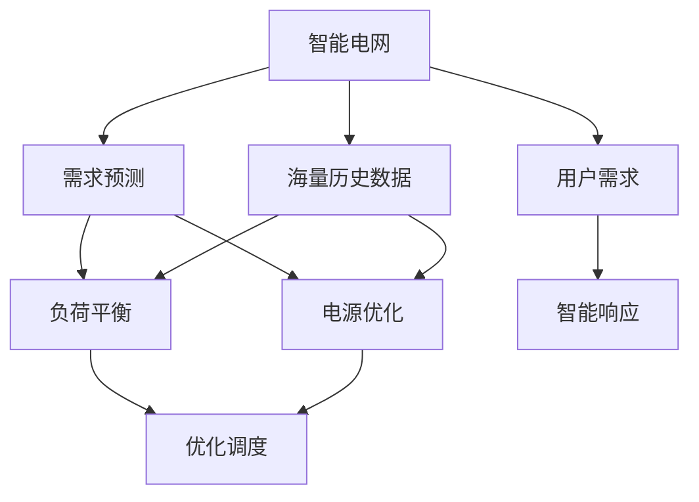

                 

# LLM与智能电网：优化能源分配

> 关键词：大语言模型,智能电网,优化算法,能源分配,电网预测,可持续发展

## 1. 背景介绍

### 1.1 问题由来
随着全球能源需求的不断增长和能源结构的转型，智能电网的建设已成为各国电力系统发展的关键。智能电网通过先进的信息通信技术、先进控制技术，实现了电力系统的安全、可靠、高效和经济运行，大幅提升了电力供应的稳定性和灵活性，促进了能源的可持续利用。

然而，智能电网面对的问题同样严峻：
- **需求侧管理挑战**：随着能源消费的日益增长，智能电网需要高效应对高峰负荷和尖峰需求，避免电网过载和浪费。
- **电源侧优化**：新能源的间歇性、随机性对电网稳定性带来挑战，需要智能电网能够灵活调节能源输入，确保电力供应的稳定。
- **负荷预测精度**：电网负荷预测的准确性直接影响电网的优化调度。传统的预测方法往往依赖于历史数据，难以应对突发事件和变化趋势。

大语言模型(LLM)作为新一代人工智能技术，以其强大的语言理解和生成能力，为智能电网优化能源分配提供了新的思路。LLM能够从海量文本数据中挖掘出丰富的信息，支持智能电网需求预测、负荷平衡和电源优化等关键功能，实现能源供需的智能匹配和优化。

### 1.2 问题核心关键点
基于大语言模型的大电网优化算法，将智能电网视为一个动态的复杂系统，通过分析历史数据、预测未来趋势、制定优化策略，实现对电力系统的智能调控。核心关键点包括：
- 海量历史数据挖掘：利用大语言模型分析海量历史电力数据，提取有价值的信息。
- 负荷预测与优化：利用大语言模型预测电网负荷变化，优化电源结构和调度策略。
- 需求响应策略：利用大语言模型设计智能化的需求响应机制，降低电网负荷峰值，提高能源利用效率。

通过这些关键技术手段，基于大语言模型的智能电网优化算法能够帮助实现电网的智能化、高效化和可持续化发展。

### 1.3 问题研究意义
基于大语言模型的智能电网优化算法，对于提升电力系统稳定性和能源利用效率，促进全球可持续发展，具有重要意义：

1. **提高电力系统稳定性**：大语言模型能够分析海量数据，预测电网负荷变化，及时调整电源结构，提高电网应对突发事件的鲁棒性。
2. **提升能源利用效率**：通过智能需求响应和优化调度，实现能源供需的智能匹配，减少能源浪费和损耗。
3. **促进可再生能源发展**：大语言模型能够分析和预测新能源的输出情况，帮助电网更好地集成可再生能源，推动能源结构的转型。
4. **推动智能化转型**：智能电网优化算法是大数据、人工智能在电网领域的重要应用，对于智能城市的建设具有引领性示范作用。
5. **实现可持续发展**：基于大语言模型的智能电网能够灵活调节能源供应和需求，支持绿色低碳、可持续发展目标的实现。

## 2. 核心概念与联系

### 2.1 核心概念概述

智能电网是一个复杂的、动态的电力系统，其核心在于通过信息通信技术、高级控制技术，实现电网的智能化、高效化和稳定化。而大语言模型通过在海量文本数据上的预训练，学习到丰富的语言知识和常识，能够从数据中挖掘出有价值的信息，支持智能电网的需求预测、负荷平衡和电源优化等功能。

两者之间的联系主要体现在：
- **数据驱动决策**：智能电网利用大语言模型处理海量数据，支持决策支持系统，实现需求预测、负荷平衡等功能。
- **智能优化算法**：大语言模型能够分析和预测电力系统行为，为智能电网提供优化的数据基础和算法支持。
- **可持续能源管理**：大语言模型结合智能电网，实现能源供需的智能匹配，促进可再生能源的应用和推广，推动能源结构转型。

### 2.2 核心概念原理和架构的 Mermaid 流程图



这个流程图展示了智能电网和大语言模型之间的数据流和功能联系：
1. 智能电网从海量历史数据中挖掘信息，为需求预测和负荷平衡提供支持。
2. 大语言模型分析电力系统数据，预测未来趋势，优化电源结构。
3. 智能电网需求预测结果支持负荷平衡和优化调度。
4. 智能电网电源优化结果支持负荷平衡和优化调度。
5. 智能电网用户需求和智能响应结果支持负荷平衡和优化调度。

## 3. 核心算法原理 & 具体操作步骤

### 3.1 算法原理概述

基于大语言模型的智能电网优化算法，主要通过以下几个步骤实现：
1. 收集历史电力数据，包括负荷曲线、气象数据、用电量等信息。
2. 利用大语言模型分析这些数据，提取有价值的信息和模式。
3. 结合历史数据和当前负荷预测结果，制定优化策略，调整电源结构和调度策略。
4. 通过智能响应机制，调整用户需求，降低电网负荷峰值。
5. 不断迭代优化策略，提高电网运行的稳定性和效率。

该算法核心在于：
- 从海量历史数据中挖掘模式，支持需求预测和负荷平衡。
- 预测未来趋势，灵活调节电源结构和调度策略。
- 智能响应用户需求，降低电网负荷峰值，提高能源利用效率。

### 3.2 算法步骤详解

**Step 1: 数据收集与预处理**
- 收集智能电网历史电力数据，包括负荷曲线、气象数据、用电量等。
- 清洗数据，处理缺失值、异常值和噪声。
- 将数据转换为模型所需格式，如时间序列数据。

**Step 2: 模型训练与预测**
- 使用大语言模型分析历史数据，提取关键特征。
- 利用训练数据训练模型，优化模型参数。
- 在测试数据上评估模型性能，调整预测参数。

**Step 3: 负荷预测与优化**
- 结合当前负荷数据和历史负荷趋势，利用模型预测未来负荷变化。
- 根据负荷预测结果，优化电源结构，调整发电量和调度策略。
- 实时监测电网运行状态，调整策略以应对突发事件。

**Step 4: 智能响应与需求管理**
- 利用智能电网智能响应机制，实时调整用户需求。
- 根据负荷预测和优化策略，推荐用户合理调整用电行为。
- 监测用户响应效果，优化推荐策略。

**Step 5: 模型迭代与优化**
- 不断迭代模型，提升负荷预测准确性和优化效果。
- 集成用户反馈和运行数据，优化需求响应策略。
- 确保模型持续更新，适应电力系统的变化。

### 3.3 算法优缺点

基于大语言模型的智能电网优化算法具有以下优点：
- 数据驱动决策：能够从海量数据中挖掘出有价值的信息，支持智能电网决策。
- 预测精度高：利用大语言模型进行负荷预测，预测精度较高，能够适应新趋势和突发事件。
- 优化效果显著：结合预测结果和优化策略，调整电源结构和调度策略，提高能源利用效率。
- 实时性较强：通过实时监测和调整，能够快速响应电网变化。

同时，该算法也存在以下缺点：
- 数据质量要求高：算法对数据质量和完整性要求较高，数据缺失或不准确会影响算法效果。
- 模型训练复杂：海量数据的处理和分析，需要高性能计算资源和优化技术。
- 实时性限制：数据处理和模型预测需要在极短时间内完成，对算法的实时性要求较高。
- 用户响应难度大：智能响应机制需适应不同用户行为，个性化需求管理较为复杂。

### 3.4 算法应用领域

基于大语言模型的智能电网优化算法，已经在多个实际应用中取得了显著效果：
1. **需求侧管理**：通过智能响应机制，优化用户用电行为，降低电网负荷峰值，提高能源利用效率。
2. **负荷预测**：利用大语言模型进行负荷预测，支持智能电网实时调度。
3. **电源优化**：结合负荷预测结果，优化电源结构和调度策略，确保电网稳定运行。
4. **可再生能源集成**：预测可再生能源输出，优化电网调度，促进新能源应用。
5. **智能电网建设**：支持智能电网的数据分析和决策支持系统，提升电网智能化水平。

## 4. 数学模型和公式 & 详细讲解

### 4.1 数学模型构建

假设智能电网负荷数据 $y_i$ 随时间 $t$ 变化，其中 $i=1,...,N$，$N$ 为时间序列长度。大语言模型预测的负荷数据为 $\hat{y}_i$。负荷预测的目标是最小化预测误差：

$$
\min_{\theta} \sum_{i=1}^N (y_i - \hat{y}_i)^2
$$

其中 $\theta$ 为模型参数，$\hat{y}_i$ 为模型在第 $i$ 时间点的预测负荷值。

### 4.2 公式推导过程

设大语言模型的预测模型为 $f_{\theta}(t)$，其中 $\theta$ 为模型参数。将负荷预测转化为回归问题：

$$
\hat{y}_i = f_{\theta}(t_i)
$$

利用均方误差（Mean Squared Error, MSE）作为损失函数：

$$
\text{MSE}(y_i, \hat{y}_i) = \frac{1}{N}\sum_{i=1}^N (y_i - \hat{y}_i)^2
$$

通过梯度下降等优化算法，最小化损失函数，更新模型参数 $\theta$：

$$
\theta \leftarrow \theta - \eta \nabla_{\theta}\text{MSE}(y_i, \hat{y}_i)
$$

其中 $\eta$ 为学习率，$\nabla_{\theta}\text{MSE}(y_i, \hat{y}_i)$ 为损失函数对参数 $\theta$ 的梯度。

### 4.3 案例分析与讲解

假设某智能电网的负荷数据如下表所示：

| $t_i$ | $y_i$ |
|-------|-------|
| 1     | 100   |
| 2     | 120   |
| 3     | 130   |
| 4     | 110   |
| 5     | 140   |
| 6     | 150   |

利用大语言模型预测第 7 天的负荷值 $y_7$。首先，将数据转换为时间序列数据：

| $t_i$ | $y_i$ |
|-------|-------|
| 1     | 100   |
| 2     | 120   |
| 3     | 130   |
| 4     | 110   |
| 5     | 140   |
| 6     | 150   |
| 7     | -     |

设大语言模型的预测模型为 $f_{\theta}(t)$，其中 $\theta$ 为模型参数。假设模型为线性回归模型：

$$
\hat{y}_i = \theta_0 + \theta_1 t_i + \epsilon_i
$$

其中 $\epsilon_i$ 为随机误差。通过梯度下降算法更新模型参数 $\theta$：

$$
\theta_0 \leftarrow \theta_0 - \eta \sum_{i=1}^N (y_i - \hat{y}_i)
$$
$$
\theta_1 \leftarrow \theta_1 - \eta \sum_{i=1}^N (y_i - \hat{y}_i) t_i
$$

代入数据，计算模型参数：

$$
\theta_0 = \frac{1}{N} \sum_{i=1}^N y_i
$$
$$
\theta_1 = \frac{1}{N} \sum_{i=1}^N (y_i - \bar{y}) t_i
$$

其中 $\bar{y}$ 为数据均值。对于第 7 天，计算负荷预测值 $\hat{y}_7$：

$$
\hat{y}_7 = \theta_0 + \theta_1 \cdot 7
$$

假设模型训练时 $\theta_0 = 125$, $\theta_1 = 5$，则有：

$$
\hat{y}_7 = 125 + 5 \cdot 7 = 175
$$

因此，模型预测第 7 天的负荷值为 175。

## 5. 项目实践：代码实例和详细解释说明

### 5.1 开发环境搭建

在进行项目实践前，我们需要准备好开发环境。以下是使用Python进行TensorFlow开发的Python 3.8环境配置流程：

1. 安装Anaconda：从官网下载并安装Anaconda，用于创建独立的Python环境。

2. 创建并激活虚拟环境：
```bash
conda create -n tensorflow-env python=3.8 
conda activate tensorflow-env
```

3. 安装TensorFlow：根据CUDA版本，从官网获取对应的安装命令。例如：
```bash
conda install tensorflow -c pytorch -c conda-forge
```

4. 安装各类工具包：
```bash
pip install numpy pandas scikit-learn matplotlib tqdm jupyter notebook ipython
```

完成上述步骤后，即可在`tensorflow-env`环境中开始项目实践。

### 5.2 源代码详细实现

这里我们以线性回归模型为例，给出使用TensorFlow进行智能电网负荷预测的代码实现。

首先，定义时间序列数据：

```python
import numpy as np

# 生成时间序列数据
N = 100
t = np.linspace(0, 10, N)
y = 5 * np.sin(t) + 2 * np.cos(2 * t) + 10 + np.random.randn(N) * 2
```

然后，定义模型和优化器：

```python
from tensorflow.keras.models import Sequential
from tensorflow.keras.layers import Dense
from tensorflow.keras.optimizers import Adam

# 定义模型
model = Sequential([
    Dense(1, input_shape=(1,), activation='linear')
])

# 定义优化器
optimizer = Adam(learning_rate=0.01)
```

接着，定义训练和评估函数：

```python
from tensorflow.keras.losses import MeanSquaredError
from sklearn.metrics import mean_squared_error

# 定义损失函数和评估指标
loss_fn = MeanSquaredError()
mse_fn = mean_squared_error

# 训练模型
model.compile(optimizer=optimizer, loss=loss_fn)
model.fit(t, y, epochs=50, batch_size=10, verbose=0)

# 评估模型
mse = mse_fn(y, model.predict(t))
print(f"MSE: {mse}")
```

最后，在测试集上评估：

```python
# 预测未来数据
future_t = np.linspace(10, 20, 100)
future_y = model.predict(future_t)

# 可视化结果
import matplotlib.pyplot as plt

plt.plot(t, y, 'bo', label='Original data')
plt.plot(future_t, future_y, 'r-', label='Predicted data')
plt.legend()
plt.show()
```

以上就是使用TensorFlow进行智能电网负荷预测的完整代码实现。可以看到，TensorFlow提供了强大的深度学习框架，可以方便地构建和训练模型。

### 5.3 代码解读与分析

让我们再详细解读一下关键代码的实现细节：

**时间序列数据生成**：
- 使用numpy生成时间序列数据 $t$，假设时间为 $0$ 到 $10$，步长为 $0.1$。
- 生成目标数据 $y$，假设为 $5\sin(t) + 2\cos(2t) + 10 + \epsilon$，其中 $\epsilon$ 为随机噪声。

**模型定义**：
- 使用TensorFlow的Sequential模型，定义一个线性回归模型，输入层为 $1$ 维，输出层为 $1$ 维，激活函数为线性函数。
- 定义Adam优化器，学习率为 $0.01$。

**训练模型**：
- 使用MSE作为损失函数，训练模型 $50$ 个epoch，批大小为 $10$。
- 通过 `fit` 函数进行模型训练，`verbose=0` 表示不打印训练过程。

**评估模型**：
- 使用 `mse_fn` 函数计算模型预测值和真实值的均方误差。
- 可视化模型预测结果和真实数据。

通过这段代码，我们可以快速构建和训练线性回归模型，用于智能电网负荷预测。TensorFlow提供了丰富的工具和库，支持模型构建、训练和评估等各个环节，极大地提升了数据科学和机器学习的开发效率。

## 6. 实际应用场景

### 6.1 智能电网需求管理

智能电网通过大语言模型分析历史负荷数据，结合实时数据，预测未来负荷变化，调整电源结构和用户需求。例如，在高峰负荷期，智能电网可以主动引导用户降低用电量，如提醒用户调低空调温度、关闭非必要设备等，实现需求响应和负荷平衡。

通过大语言模型预测负荷变化，智能电网可以提前调整发电量和调度策略，避免电网过载和浪费。例如，在负荷预测显示未来几小时负荷将大幅上升时，智能电网可以提前调整电源结构，增加可再生能源的输出，减少化石能源的使用，实现节能减排目标。

### 6.2 可再生能源集成

大语言模型能够预测可再生能源（如太阳能、风能）的输出，优化电网调度，确保新能源的稳定输入。例如，在太阳能发电高峰期，智能电网可以通过调整负荷预测模型参数，提高太阳能发电的利用率，减少太阳能发电的弃风弃光现象。

通过大语言模型分析天气和气象数据，智能电网可以预测未来几天的风电和光伏发电输出，优化电源结构，确保电网稳定运行。例如，在天气预报显示未来几天风力强劲时，智能电网可以增加风电的输出，同时减少化石能源的使用，促进可再生能源的发展。

### 6.3 负荷预测与优化

大语言模型能够结合历史负荷数据和实时数据，预测未来负荷变化，优化电网调度。例如，通过分析历史负荷曲线和天气数据，智能电网可以预测未来几天的负荷变化，调整发电量和调度策略，确保电网稳定运行。

通过大语言模型预测负荷变化，智能电网可以实现实时调度，及时应对突发事件。例如，在负荷预测显示未来几小时负荷将大幅上升时，智能电网可以调整发电量和调度策略，增加备用电源的投入，确保电网稳定运行。

### 6.4 未来应用展望

随着大语言模型和智能电网技术的不断进步，基于大语言模型的智能电网优化算法将呈现以下几个发展趋势：

1. **多模态数据融合**：未来智能电网将集成更多类型的数据，如天气数据、气象数据、用户行为数据等，通过大语言模型进行融合分析，实现更精准的负荷预测和电源优化。
2. **分布式智能电网**：未来智能电网将向分布式、去中心化的方向发展，大语言模型将支持分布式电网的数据分析和决策支持，实现能源供需的智能匹配。
3. **实时数据处理**：未来智能电网将具备更强的实时数据处理能力，大语言模型能够实时分析和预测电网行为，实现更高效的优化调度。
4. **智能需求响应**：未来智能电网将实现更灵活的需求响应机制，大语言模型将引导用户调整用电行为，实现能源供需的智能匹配和优化。
5. **环境监测和预警**：未来智能电网将集成环境监测数据，大语言模型能够预测环境变化，优化能源分配，促进绿色低碳发展。

总之，基于大语言模型的智能电网优化算法将不断拓展应用范围，提升能源利用效率，推动能源结构的转型，为全球可持续发展做出更大贡献。

## 7. 工具和资源推荐

### 7.1 学习资源推荐

为了帮助开发者系统掌握大语言模型和智能电网优化技术的理论基础和实践技巧，这里推荐一些优质的学习资源：

1. **《深度学习》课程**：斯坦福大学开设的深度学习课程，深入浅出地讲解深度学习的基本概念和算法。
2. **TensorFlow官方文档**：TensorFlow的官方文档，包含丰富的教程、代码示例和文档，适合快速上手TensorFlow开发。
3. **智能电网优化算法**：IEEE Trans. Smart Grid期刊，涵盖智能电网优化算法的最新研究成果，适合深入学习。
4. **《智能电网优化算法》书籍**：系统介绍智能电网优化算法的设计和实现，适合深入了解智能电网优化算法。
5. **在线教育平台**：如Coursera、Udacity等，提供深度学习、机器学习和智能电网优化的相关课程，适合自学。

通过对这些资源的学习实践，相信你一定能够快速掌握大语言模型和智能电网优化技术的精髓，并用于解决实际的智能电网优化问题。

### 7.2 开发工具推荐

高效的开发离不开优秀的工具支持。以下是几款用于智能电网优化和微调开发的常用工具：

1. TensorFlow：基于Python的深度学习框架，支持分布式计算和自动微分，适合智能电网和大语言模型微调。
2. PyTorch：基于Python的深度学习框架，灵活高效，适合动态图和静态图并存的场景。
3. Jupyter Notebook：强大的交互式编程环境，支持数据可视化和交互式代码执行，适合智能电网和大语言模型微调的快速迭代开发。
4. Weights & Biases：模型训练的实验跟踪工具，记录和可视化模型训练过程中的各项指标，方便对比和调优。
5. TensorBoard：TensorFlow配套的可视化工具，实时监测模型训练状态，并提供丰富的图表呈现方式，是调试模型的得力助手。

合理利用这些工具，可以显著提升智能电网优化和大语言模型微调的开发效率，加快创新迭代的步伐。

### 7.3 相关论文推荐

智能电网优化和微调技术的发展源于学界的持续研究。以下是几篇奠基性的相关论文，推荐阅读：

1. **"Deep Learning for Energy Demand Prediction in Smart Grids"**：利用深度学习模型进行智能电网负荷预测。
2. **"Energy Demand Prediction Using Deep Learning: A Review"**：综述了深度学习在智能电网负荷预测中的应用。
3. **"Optimization of Smart Grid with Deep Reinforcement Learning"**：利用深度强化学习优化智能电网。
4. **"AI-Enhanced Demand Response in Smart Grids: A Review"**：综述了人工智能在智能电网需求响应中的应用。
5. **"Integrating Renewable Energy into Smart Grids with Deep Learning"**：利用深度学习进行可再生能源的集成和优化。

这些论文代表了大语言模型和智能电网优化技术的发展脉络。通过学习这些前沿成果，可以帮助研究者把握学科前进方向，激发更多的创新灵感。

## 8. 总结：未来发展趋势与挑战

### 8.1 研究成果总结

本文对基于大语言模型的智能电网优化算法进行了全面系统的介绍。首先阐述了智能电网和大语言模型的研究背景和意义，明确了智能电网优化算法在大语言模型支持下，能够实现高效能源分配和优化调度。其次，从原理到实践，详细讲解了智能电网优化算法的核心步骤和关键技术。最后，探讨了智能电网优化算法在大电网中的实际应用和未来发展趋势。

### 8.2 未来发展趋势

展望未来，基于大语言模型的智能电网优化算法将呈现以下几个发展趋势：

1. **多模态数据融合**：未来智能电网将集成更多类型的数据，如天气数据、气象数据、用户行为数据等，通过大语言模型进行融合分析，实现更精准的负荷预测和电源优化。
2. **分布式智能电网**：未来智能电网将向分布式、去中心化的方向发展，大语言模型将支持分布式电网的数据分析和决策支持，实现能源供需的智能匹配。
3. **实时数据处理**：未来智能电网将具备更强的实时数据处理能力，大语言模型能够实时分析和预测电网行为，实现更高效的优化调度。
4. **智能需求响应**：未来智能电网将实现更灵活的需求响应机制，大语言模型将引导用户调整用电行为，实现能源供需的智能匹配和优化。
5. **环境监测和预警**：未来智能电网将集成环境监测数据，大语言模型能够预测环境变化，优化能源分配，促进绿色低碳发展。

### 8.3 面临的挑战

尽管基于大语言模型的智能电网优化算法已经取得了显著成效，但在迈向更加智能化、普适化应用的过程中，仍面临诸多挑战：

1. **数据质量瓶颈**：算法对数据质量和完整性要求较高，数据缺失或不准确会影响算法效果。
2. **模型训练复杂**：海量数据的处理和分析，需要高性能计算资源和优化技术。
3. **实时性限制**：数据处理和模型预测需要在极短时间内完成，对算法的实时性要求较高。
4. **用户响应难度大**：智能响应机制需适应不同用户行为，个性化需求管理较为复杂。

### 8.4 研究展望

面对智能电网优化算法所面临的种种挑战，未来的研究需要在以下几个方面寻求新的突破：

1. **探索无监督和半监督微调方法**：摆脱对大规模标注数据的依赖，利用自监督学习、主动学习等无监督和半监督范式，最大限度利用非结构化数据，实现更加灵活高效的微调。
2. **研究参数高效和计算高效的微调范式**：开发更加参数高效的微调方法，在固定大部分预训练参数的同时，只更新极少量的任务相关参数。同时优化微调模型的计算图，减少前向传播和反向传播的资源消耗，实现更加轻量级、实时性的部署。
3. **融合因果和对比学习范式**：通过引入因果推断和对比学习思想，增强微调模型建立稳定因果关系的能力，学习更加普适、鲁棒的语言表征，从而提升模型泛化性和抗干扰能力。
4. **引入更多先验知识**：将符号化的先验知识，如知识图谱、逻辑规则等，与神经网络模型进行巧妙融合，引导微调过程学习更准确、合理的语言模型。同时加强不同模态数据的整合，实现视觉、语音等多模态信息与文本信息的协同建模。
5. **结合因果分析和博弈论工具**：将因果分析方法引入微调模型，识别出模型决策的关键特征，增强输出解释的因果性和逻辑性。借助博弈论工具刻画人机交互过程，主动探索并规避模型的脆弱点，提高系统稳定性。
6. **纳入伦理道德约束**：在模型训练目标中引入伦理导向的评估指标，过滤和惩罚有偏见、有害的输出倾向。同时加强人工干预和审核，建立模型行为的监管机制，确保输出符合人类价值观和伦理道德。

## 9. 附录：常见问题与解答

**Q1：大语言模型在智能电网中的应用有哪些？**

A: 大语言模型在智能电网中的应用主要包括：
- 负荷预测：利用大语言模型分析历史负荷数据，预测未来负荷变化，支持智能电网实时调度。
- 需求响应：利用大语言模型设计智能化的需求响应机制，降低电网负荷峰值，提高能源利用效率。
- 电源优化：结合负荷预测结果，优化电源结构，调整发电量和调度策略，确保电网稳定运行。
- 可再生能源集成：预测可再生能源的输出，优化电网调度，确保新能源的稳定输入。

**Q2：智能电网优化算法有哪些关键技术？**

A: 智能电网优化算法的关键技术主要包括：
- 海量数据挖掘：利用大语言模型分析海量历史数据，提取关键特征。
- 负荷预测：利用大语言模型进行负荷预测，支持智能电网实时调度。
- 电源优化：结合负荷预测结果，优化电源结构，调整发电量和调度策略，确保电网稳定运行。
- 智能响应：利用智能电网智能响应机制，调整用户需求，降低电网负荷峰值，提高能源利用效率。

**Q3：智能电网优化算法的优化策略有哪些？**

A: 智能电网优化算法的优化策略主要包括：
- 数据驱动决策：利用大语言模型分析海量数据，支持智能电网决策。
- 预测精度高：利用大语言模型进行负荷预测，预测精度较高，能够适应新趋势和突发事件。
- 优化效果显著：结合预测结果和优化策略，调整电源结构和调度策略，提高能源利用效率。
- 实时性较强：通过实时监测和调整，能够快速响应电网变化。

**Q4：智能电网优化算法的未来发展方向是什么？**

A: 智能电网优化算法的未来发展方向主要包括：
- 多模态数据融合：未来智能电网将集成更多类型的数据，如天气数据、气象数据、用户行为数据等，通过大语言模型进行融合分析，实现更精准的负荷预测和电源优化。
- 分布式智能电网：未来智能电网将向分布式、去中心化的方向发展，大语言模型将支持分布式电网的数据分析和决策支持，实现能源供需的智能匹配。
- 实时数据处理：未来智能电网将具备更强的实时数据处理能力，大语言模型能够实时分析和预测电网行为，实现更高效的优化调度。
- 智能需求响应：未来智能电网将实现更灵活的需求响应机制，大语言模型将引导用户调整用电行为，实现能源供需的智能匹配和优化。
- 环境监测和预警：未来智能电网将集成环境监测数据，大语言模型能够预测环境变化，优化能源分配，促进绿色低碳发展。

通过这些技术的发展，智能电网优化算法将能够实现更高效、智能和可持续的能源管理，为全球可持续发展做出更大贡献。

**Q5：智能电网优化算法在实际应用中需要注意哪些问题？**

A: 智能电网优化算法在实际应用中需要注意的问题主要包括：
- 数据质量要求高：算法对数据质量和完整性要求较高，数据缺失或不准确会影响算法效果。
- 模型训练复杂：海量数据的处理和分析，需要高性能计算资源和优化技术。
- 实时性限制：数据处理和模型预测需要在极短时间内完成，对算法的实时性要求较高。
- 用户响应难度大：智能响应机制需适应不同用户行为，个性化需求管理较为复杂。

合理解决这些问题，才能实现智能电网优化算法的稳定高效运行，真正发挥其在实际应用中的潜力。

