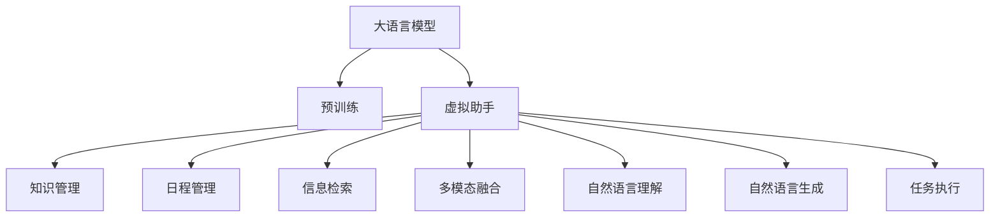

                 

# LLM与虚拟助手：打造全能AI秘书

> 关键词：大语言模型(Large Language Model, LLM),虚拟助手(Virtual Assistant),人工智能秘书(AI Secretary),任务驱动(Task-Driven),多模态数据融合(Multimodal Data Fusion),用户界面(UI),自然语言处理(NLP),深度学习(Deep Learning)

## 1. 背景介绍

在数字化和智能化的浪潮下，虚拟助手（Virtual Assistant）已成为人们日常生活和工作中不可或缺的智能伴侣。虚拟助手通过执行重复性任务、提供智能建议、管理日程等方式，极大地提升了用户的生活和工作效率。传统的虚拟助手多采用规则引擎、决策树等技术实现，但由于缺乏深度学习和自然语言处理（Natural Language Processing, NLP）背景，难以应对用户意图多样化和场景复杂化的挑战。近年来，随着大语言模型（Large Language Model, LLM）的兴起，虚拟助手逐步融合了更为强大的自然语言理解和生成能力，并开启了全新的一页。

### 1.1 问题由来

早期的虚拟助手主要依赖于预设的规则和模板，通过匹配关键词和执行预定义的逻辑流程来完成任务。这种方法在处理单一、规则化的任务时效率较高，但面对复杂多变和模糊模糊的用户需求时，往往无法给出满意的回答。此外，规则引擎的维护和更新成本较高，且缺乏对上下文的理解能力，难以处理长对话和语义复杂的对话场景。

近年来，随着深度学习特别是Transformer模型的出现，大语言模型以其强大的语言理解和生成能力，逐步替代了传统的规则引擎，成为虚拟助手领域的主流技术。通过在大规模无标签文本数据上进行预训练，大语言模型学习到了通用的语言表示和语义理解能力，能够处理更复杂的自然语言处理任务，并显著提升了用户交互的自然流畅性和智能化水平。

### 1.2 问题核心关键点

虚拟助手作为大语言模型的典型应用之一，其核心挑战在于如何高效地将模型知识融合到多模态数据中，构建任务驱动的用户界面，从而实现任务导向的自然语言交互。具体来说，核心关键点包括：

1. 多模态数据融合：虚拟助手需要整合语音、文本、图像等多种信息，实现全场景交互。
2. 任务驱动设计：虚拟助手的设计应以任务为导向，能够高效处理用户的具体需求。
3. 自然语言理解与生成：大语言模型应具备强大的语言理解和生成能力，能够对自然语言指令进行正确解读并执行。
4. 跨平台兼容性：虚拟助手应能够适配不同的设备和操作系统，提供统一的交互体验。

本节将系统地探讨大语言模型在虚拟助手中的应用，从原理到实践，介绍虚拟助手的核心算法、操作步骤及其实际应用领域，帮助读者全面理解这一前沿技术的应用潜力。

## 2. 核心概念与联系

### 2.1 核心概念概述

在虚拟助手的设计中，大语言模型充当了一种强大的特征提取器，通过在大规模语料上进行的预训练，学习到了通用的语言知识和语义表示。虚拟助手的设计主要包括以下核心概念：

1. **大语言模型(Large Language Model, LLM)**：基于Transformer架构的预训练模型，能够对大规模无标签文本数据进行深度学习，提取通用的语言知识和语义表示。
2. **虚拟助手(Virtual Assistant)**：基于人工智能技术的智能伙伴，能够理解用户自然语言指令，执行特定任务，提升用户生活和工作效率。
3. **人工智能秘书(AI Secretary)**：以任务为导向，具备知识管理、日程管理、信息检索等多种功能的虚拟助手，能够帮助用户高效处理日常事务。
4. **任务驱动(Task-Driven)**：虚拟助手的设计应以任务为导向，能够根据用户的具体需求执行相应的操作。
5. **多模态数据融合(Multimodal Data Fusion)**：虚拟助手应能够整合语音、文本、图像等多种信息，实现全场景交互。
6. **用户界面(UI)**：虚拟助手通过用户界面提供交互，应设计得简洁、易用，符合用户习惯。

这些核心概念通过大语言模型作为特征提取器，以多模态数据融合和任务驱动为设计理念，构建了虚拟助手的整体框架。大语言模型的强大预训练能力使得虚拟助手在处理自然语言任务时具备了天然的优势，能够快速响应和执行用户的各类需求。

### 2.2 核心概念原理和架构的 Mermaid 流程图



此图展示了从大语言模型到虚拟助手的关键流程，其中预训练、多模态融合、自然语言理解与生成、任务执行等步骤构成了虚拟助手的核心功能。

## 3. 核心算法原理 & 具体操作步骤
### 3.1 算法原理概述

虚拟助手的设计主要基于大语言模型的预训练和微调技术。大语言模型通过在大规模无标签文本数据上进行预训练，学习到了通用的语言知识和语义表示。虚拟助手通过微调大语言模型，使其能够适应特定任务的需求，实现自然语言理解和生成，从而高效执行任务。

形式化地，假设大语言模型为 $M_{\theta}$，其中 $\theta$ 为预训练得到的模型参数。给定虚拟助手任务 $T$ 的训练数据集 $D=\{(x_i, y_i)\}_{i=1}^N$，其中 $x_i$ 为输入的自然语言指令，$y_i$ 为任务执行结果。微调的目标是找到新的模型参数 $\hat{\theta}$，使得 $M_{\hat{\theta}}$ 在执行虚拟助手任务 $T$ 时能够最大化性能指标。

### 3.2 算法步骤详解

基于大语言模型的虚拟助手微调过程主要包括以下几个关键步骤：

**Step 1: 准备预训练模型和数据集**
- 选择合适的预训练语言模型 $M_{\theta}$ 作为初始化参数，如BERT、GPT等。
- 准备虚拟助手任务 $T$ 的训练数据集 $D$，划分为训练集、验证集和测试集。训练数据应包含多个模态的信息，如文本、语音、图像等。

**Step 2: 添加任务适配层**
- 根据任务类型，在预训练模型顶层设计合适的输出层和损失函数。
- 对于任务驱动的虚拟助手，通常需要设计不同的任务执行模块，如知识管理、日程管理、信息检索等。
- 对于多模态虚拟助手，应设计相应的数据融合和转换模块，实现不同模态数据的交互。

**Step 3: 设置微调超参数**
- 选择合适的优化算法及其参数，如 AdamW、SGD 等，设置学习率、批大小、迭代轮数等。
- 设置正则化技术及强度，包括权重衰减、Dropout、Early Stopping 等。
- 确定冻结预训练参数的策略，如仅微调顶层，或全部参数都参与微调。

**Step 4: 执行梯度训练**
- 将训练集数据分批次输入模型，前向传播计算损失函数。
- 反向传播计算参数梯度，根据设定的优化算法和学习率更新模型参数。
- 周期性在验证集上评估模型性能，根据性能指标决定是否触发 Early Stopping。
- 重复上述步骤直到满足预设的迭代轮数或 Early Stopping 条件。

**Step 5: 测试和部署**
- 在测试集上评估微调后模型 $M_{\hat{\theta}}$ 的性能，对比微调前后的精度提升。
- 使用微调后的模型对新样本进行推理预测，集成到虚拟助手系统中。
- 持续收集新的数据，定期重新微调模型，以适应数据分布的变化。

### 3.3 算法优缺点

虚拟助手作为大语言模型的典型应用，其微调方法具有以下优点：
1. 简单高效。只需准备少量标注数据，即可对预训练模型进行快速适配，获得较大的性能提升。
2. 通用适用。适用于各种虚拟助手任务，包括知识管理、日程管理、信息检索等，设计简单的任务适配层即可实现微调。
3. 参数高效。利用参数高效微调技术，在固定大部分预训练参数的情况下，仍可取得不错的提升。
4. 效果显著。在学术界和工业界的诸多任务上，基于微调的方法已经刷新了最先进的性能指标。

同时，该方法也存在一定的局限性：
1. 依赖标注数据。微调的效果很大程度上取决于标注数据的质量和数量，获取高质量标注数据的成本较高。
2. 迁移能力有限。当目标任务与预训练数据的分布差异较大时，微调的性能提升有限。
3. 负面效果传递。预训练模型的固有偏见、有害信息等，可能通过微调传递到下游任务，造成负面影响。
4. 可解释性不足。微调模型的决策过程通常缺乏可解释性，难以对其推理逻辑进行分析和调试。

尽管存在这些局限性，但就目前而言，基于监督学习的微调方法仍是大语言模型应用的最主流范式。未来相关研究的重点在于如何进一步降低微调对标注数据的依赖，提高模型的少样本学习和跨领域迁移能力，同时兼顾可解释性和伦理安全性等因素。

### 3.4 算法应用领域

虚拟助手作为大语言模型的典型应用之一，已经在多个领域得到了广泛的应用，例如：

- 知识管理：通过自然语言指令查询知识库，获取知识或解答问题。
- 日程管理：根据用户的日程安排，提醒待办事项或调整日程。
- 信息检索：根据用户的查询，在互联网或其他信息库中检索相关信息。
- 智能客服：根据用户的问题，自动生成应答或转接人工客服。
- 个性化推荐：根据用户的历史行为和偏好，提供个性化的信息推荐。
- 多模态交互：整合语音、文本、图像等多模态信息，实现全场景交互。
- 跨平台集成：适配不同的操作系统和设备，提供统一的交互体验。

除了上述这些经典任务外，虚拟助手还被创新性地应用到更多场景中，如可控文本生成、情感分析、机器翻译等，为智能生活带来了新的可能性。

## 4. 数学模型和公式 & 详细讲解
### 4.1 数学模型构建

本节将使用数学语言对虚拟助手的大语言模型微调过程进行更加严格的刻画。

记预训练语言模型为 $M_{\theta}$，其中 $\theta$ 为预训练得到的模型参数。假设虚拟助手任务 $T$ 的训练集为 $D=\{(x_i,y_i)\}_{i=1}^N, x_i \in \mathcal{X}, y_i \in \mathcal{Y}$。

定义模型 $M_{\theta}$ 在输入 $x$ 上的输出为 $\hat{y}=M_{\theta}(x) \in \mathcal{Y}$，表示模型对任务的预测结果。虚拟助手任务的损失函数定义为：

$$
\ell(y,\hat{y}) = \mathcal{L}(y, \hat{y})
$$

其中 $\mathcal{L}$ 为针对任务 $T$ 设计的损失函数，用于衡量模型预测输出与真实标签之间的差异。常见的损失函数包括交叉熵损失、均方误差损失等。

### 4.2 公式推导过程

以下我们以知识管理任务为例，推导交叉熵损失函数及其梯度的计算公式。

假设虚拟助手任务为知识管理，用户在输入文本 $x$ 中询问问题，模型需要从知识库中检索相关答案。设知识库中的答案为 $y \in \mathcal{Y}$，模型输出为 $\hat{y}=M_{\theta}(x)$。则知识管理的交叉熵损失函数定义为：

$$
\ell(y,\hat{y}) = -y\log \hat{y} + (1-y)\log (1-\hat{y})
$$

将其代入经验风险公式，得：

$$
\mathcal{L}(\theta) = -\frac{1}{N}\sum_{i=1}^N \ell(y_i,\hat{y}_i)
$$

根据链式法则，损失函数对参数 $\theta_k$ 的梯度为：

$$
\frac{\partial \mathcal{L}(\theta)}{\partial \theta_k} = -\frac{1}{N}\sum_{i=1}^N \frac{\partial \ell(y_i,\hat{y}_i)}{\partial \hat{y}_i} \frac{\partial \hat{y}_i}{\partial \theta_k}
$$

其中 $\frac{\partial \ell(y_i,\hat{y}_i)}{\partial \hat{y}_i}$ 可通过自动微分技术高效计算。

在得到损失函数的梯度后，即可带入参数更新公式，完成模型的迭代优化。重复上述过程直至收敛，最终得到适应虚拟助手任务的最优模型参数 $\theta^*$。

## 5. 项目实践：代码实例和详细解释说明
### 5.1 开发环境搭建

在进行虚拟助手开发前，我们需要准备好开发环境。以下是使用Python进行PyTorch开发的环境配置流程：

1. 安装Anaconda：从官网下载并安装Anaconda，用于创建独立的Python环境。

2. 创建并激活虚拟环境：
```bash
conda create -n pytorch-env python=3.8 
conda activate pytorch-env
```

3. 安装PyTorch：根据CUDA版本，从官网获取对应的安装命令。例如：
```bash
conda install pytorch torchvision torchaudio cudatoolkit=11.1 -c pytorch -c conda-forge
```

4. 安装Transformers库：
```bash
pip install transformers
```

5. 安装各类工具包：
```bash
pip install numpy pandas scikit-learn matplotlib tqdm jupyter notebook ipython
```

完成上述步骤后，即可在`pytorch-env`环境中开始虚拟助手开发实践。

### 5.2 源代码详细实现

下面我们以知识管理任务为例，给出使用Transformers库对BERT模型进行虚拟助手微调的PyTorch代码实现。

首先，定义知识管理任务的训练函数：

```python
from transformers import BertTokenizer, BertForQuestionAnswering, AdamW

tokenizer = BertTokenizer.from_pretrained('bert-base-cased')

model = BertForQuestionAnswering.from_pretrained('bert-base-cased', num_labels=2)

device = torch.device('cuda') if torch.cuda.is_available() else torch.device('cpu')

optimizer = AdamW(model.parameters(), lr=2e-5)

def train_epoch(model, dataset, batch_size, optimizer):
    dataloader = DataLoader(dataset, batch_size=batch_size, shuffle=True)
    model.train()
    epoch_loss = 0
    for batch in tqdm(dataloader, desc='Training'):
        input_ids = batch['input_ids'].to(device)
        attention_mask = batch['attention_mask'].to(device)
        labels = batch['labels'].to(device)
        model.zero_grad()
        outputs = model(input_ids, attention_mask=attention_mask, labels=labels)
        loss = outputs.loss
        epoch_loss += loss.item()
        loss.backward()
        optimizer.step()
    return epoch_loss / len(dataloader)

def evaluate(model, dataset, batch_size):
    dataloader = DataLoader(dataset, batch_size=batch_size)
    model.eval()
    preds, labels = [], []
    with torch.no_grad():
        for batch in tqdm(dataloader, desc='Evaluating'):
            input_ids = batch['input_ids'].to(device)
            attention_mask = batch['attention_mask'].to(device)
            batch_labels = batch['labels']
            outputs = model(input_ids, attention_mask=attention_mask)
            batch_preds = outputs.logits.argmax(dim=2).to('cpu').tolist()
            batch_labels = batch_labels.to('cpu').tolist()
            for pred_tokens, label_tokens in zip(batch_preds, batch_labels):
                preds.append(pred_tokens[:len(label_tokens)])
                labels.append(label_tokens)
    
    print(classification_report(labels, preds))
```

接着，使用训练数据进行模型训练：

```python
epochs = 5
batch_size = 16

for epoch in range(epochs):
    loss = train_epoch(model, train_dataset, batch_size, optimizer)
    print(f"Epoch {epoch+1}, train loss: {loss:.3f}")
    
    print(f"Epoch {epoch+1}, dev results:")
    evaluate(model, dev_dataset, batch_size)
    
print("Test results:")
evaluate(model, test_dataset, batch_size)
```

以上代码展示了如何使用Transformers库对BERT模型进行虚拟助手微调的完整流程。具体步骤如下：

1. 加载预训练的BERT模型和分词器。
2. 定义模型、优化器等关键组件。
3. 编写训练函数和评估函数。
4. 在训练数据集上进行模型训练，输出每个epoch的损失。
5. 在验证集上评估模型性能。
6. 在测试集上再次评估模型性能。

### 5.3 代码解读与分析

让我们再详细解读一下关键代码的实现细节：

**知识管理任务数据处理函数**：
- `train_dataset`和`dev_dataset`：为训练集和验证集创建数据集对象。
- `tokenizer`：用于将文本转换为token ids，并进行序列化。
- `input_ids`、`attention_mask`、`labels`：模型输入和输出。
- `train_epoch`函数：对数据集进行批处理，前向传播计算损失，反向传播更新模型参数。
- `evaluate`函数：在数据集上评估模型性能，并打印分类指标。

**tokenizer的初始化**：
- `BertTokenizer.from_pretrained`：从预训练模型加载分词器。

**模型初始化**：
- `BertForQuestionAnswering.from_pretrained`：加载预训练的问答模型。

**设备设置**：
- `torch.device`：选择使用GPU还是CPU进行训练。

**优化器定义**：
- `AdamW`：使用AdamW优化算法进行模型参数更新。

**训练函数**：
- 使用DataLoader对数据集进行批处理，将输入和输出转换为模型所需的格式。
- 在每个批次上前向传播计算损失，反向传播更新模型参数，并输出损失。

**评估函数**：
- 在数据集上评估模型性能，并打印分类指标。

以上代码展示了虚拟助手微调的基本流程。通过学习这一过程，开发者可以更深入地理解虚拟助手的设计原理和技术细节。

## 6. 实际应用场景
### 6.1 智能客服系统

基于大语言模型的虚拟助手，可以广泛应用于智能客服系统的构建。传统客服往往需要配备大量人力，高峰期响应缓慢，且一致性和专业性难以保证。而使用虚拟助手，可以7x24小时不间断服务，快速响应客户咨询，用自然流畅的语言解答各类常见问题。

在技术实现上，可以收集企业内部的历史客服对话记录，将问题和最佳答复构建成监督数据，在此基础上对预训练虚拟助手模型进行微调。微调后的虚拟助手能够自动理解用户意图，匹配最合适的答案模板进行回复。对于客户提出的新问题，还可以接入检索系统实时搜索相关内容，动态组织生成回答。如此构建的智能客服系统，能大幅提升客户咨询体验和问题解决效率。

### 6.2 金融舆情监测

金融机构需要实时监测市场舆论动向，以便及时应对负面信息传播，规避金融风险。传统的人工监测方式成本高、效率低，难以应对网络时代海量信息爆发的挑战。基于大语言模型的虚拟助手技术，为金融舆情监测提供了新的解决方案。

具体而言，可以收集金融领域相关的新闻、报道、评论等文本数据，并对其进行主题标注和情感标注。在此基础上对预训练虚拟助手模型进行微调，使其能够自动判断文本属于何种主题，情感倾向是正面、中性还是负面。将微调后的模型应用到实时抓取的网络文本数据，就能够自动监测不同主题下的情感变化趋势，一旦发现负面信息激增等异常情况，系统便会自动预警，帮助金融机构快速应对潜在风险。

### 6.3 个性化推荐系统

当前的推荐系统往往只依赖用户的历史行为数据进行物品推荐，无法深入理解用户的真实兴趣偏好。基于大语言模型微调的虚拟助手，能够更好地挖掘用户行为背后的语义信息，从而提供更精准、多样的推荐内容。

在实践中，可以收集用户浏览、点击、评论、分享等行为数据，提取和用户交互的物品标题、描述、标签等文本内容。将文本内容作为模型输入，用户的后续行为（如是否点击、购买等）作为监督信号，在此基础上微调预训练虚拟助手模型。微调后的模型能够从文本内容中准确把握用户的兴趣点。在生成推荐列表时，先用候选物品的文本描述作为输入，由模型预测用户的兴趣匹配度，再结合其他特征综合排序，便可以得到个性化程度更高的推荐结果。

### 6.4 未来应用展望

随着大语言模型微调技术的发展，虚拟助手将会在更多领域得到应用，为传统行业带来变革性影响。

在智慧医疗领域，基于虚拟助手的医疗问答、病历分析、药物研发等应用将提升医疗服务的智能化水平，辅助医生诊疗，加速新药开发进程。

在智能教育领域，虚拟助手可应用于作业批改、学情分析、知识推荐等方面，因材施教，促进教育公平，提高教学质量。

在智慧城市治理中，虚拟助手可应用于城市事件监测、舆情分析、应急指挥等环节，提高城市管理的自动化和智能化水平，构建更安全、高效的未来城市。

此外，在企业生产、社会治理、文娱传媒等众多领域，基于虚拟助手的AI技术也将不断涌现，为经济社会发展注入新的动力。相信随着技术的日益成熟，虚拟助手必将在构建人机协同的智能时代中扮演越来越重要的角色。

## 7. 工具和资源推荐
### 7.1 学习资源推荐

为了帮助开发者系统掌握虚拟助手技术，这里推荐一些优质的学习资源：

1. 《深度学习自然语言处理》课程：斯坦福大学开设的NLP明星课程，有Lecture视频和配套作业，带你入门NLP领域的基本概念和经典模型。
2. CS224N《自然语言处理与深度学习》课程：斯坦福大学课程，详细讲解了基于Transformer的NLP模型构建与微调。
3. 《Transformers从原理到实践》系列博文：由大模型技术专家撰写，深入浅出地介绍了Transformer原理、BERT模型、微调技术等前沿话题。
4. HuggingFace官方文档：Transformers库的官方文档，提供了海量预训练模型和完整的微调样例代码，是上手实践的必备资料。
5. 《Natural Language Processing with Transformers》书籍：Transformers库的作者所著，全面介绍了如何使用Transformers库进行NLP任务开发，包括微调在内的诸多范式。
6. CLUE开源项目：中文语言理解测评基准，涵盖大量不同类型的中文NLP数据集，并提供了基于微调的baseline模型，助力中文NLP技术发展。

通过对这些资源的学习实践，相信你一定能够快速掌握虚拟助手技术，并用于解决实际的NLP问题。

### 7.2 开发工具推荐

高效的开发离不开优秀的工具支持。以下是几款用于虚拟助手开发的常用工具：

1. PyTorch：基于Python的开源深度学习框架，灵活动态的计算图，适合快速迭代研究。大部分预训练语言模型都有PyTorch版本的实现。
2. TensorFlow：由Google主导开发的开源深度学习框架，生产部署方便，适合大规模工程应用。同样有丰富的预训练语言模型资源。
3. Transformers库：HuggingFace开发的NLP工具库，集成了众多SOTA语言模型，支持PyTorch和TensorFlow，是进行虚拟助手开发的利器。
4. Weights & Biases：模型训练的实验跟踪工具，可以记录和可视化模型训练过程中的各项指标，方便对比和调优。与主流深度学习框架无缝集成。
5. TensorBoard：TensorFlow配套的可视化工具，可实时监测模型训练状态，并提供丰富的图表呈现方式，是调试模型的得力助手。
6. Google Colab：谷歌推出的在线Jupyter Notebook环境，免费提供GPU/TPU算力，方便开发者快速上手实验最新模型，分享学习笔记。

合理利用这些工具，可以显著提升虚拟助手开发效率，加快创新迭代的步伐。

### 7.3 相关论文推荐

虚拟助手作为大语言模型的典型应用之一，其设计和优化涉及众多前沿技术。以下是几篇奠基性的相关论文，推荐阅读：

1. Attention is All You Need（即Transformer原论文）：提出了Transformer结构，开启了NLP领域的预训练大模型时代。
2. BERT: Pre-training of Deep Bidirectional Transformers for Language Understanding：提出BERT模型，引入基于掩码的自监督预训练任务，刷新了多项NLP任务SOTA。
3. Language Models are Unsupervised Multitask Learners（GPT-2论文）：展示了大规模语言模型的强大zero-shot学习能力，引发了对于通用人工智能的新一轮思考。
4. Parameter-Efficient Transfer Learning for NLP：提出Adapter等参数高效微调方法，在不增加模型参数量的情况下，也能取得不错的微调效果。
5. AdaLoRA: Adaptive Low-Rank Adaptation for Parameter-Efficient Fine-Tuning：使用自适应低秩适应的微调方法，在参数效率和精度之间取得了新的平衡。
6. Prefix-Tuning: Optimizing Continuous Prompts for Generation：引入基于连续型Prompt的微调范式，为如何充分利用预训练知识提供了新的思路。

这些论文代表了大语言模型微调技术的发展脉络。通过学习这些前沿成果，可以帮助研究者把握学科前进方向，激发更多的创新灵感。

## 8. 总结：未来发展趋势与挑战
### 8.1 研究成果总结

本文对大语言模型在虚拟助手中的应用进行了全面系统的介绍。首先阐述了虚拟助手的设计背景和意义，明确了其以任务为导向，利用大语言模型进行自然语言理解和生成，实现高效任务执行的设计理念。其次，从原理到实践，详细讲解了虚拟助手的核心算法、操作步骤及其实际应用领域，帮助读者全面理解这一前沿技术的应用潜力。

### 8.2 未来发展趋势

展望未来，虚拟助手的发展趋势将呈现以下几个方面：

1. 多模态融合能力提升：虚拟助手将整合语音、文本、图像等多种信息，实现全场景交互。
2. 自然语言理解与生成增强：虚拟助手将学习更为复杂的语言模型，提升自然语言理解与生成的准确性。
3. 任务驱动设计优化：虚拟助手将更智能地理解用户需求，执行任务。
4. 跨平台兼容性增强：虚拟助手将适配不同的操作系统和设备，提供统一的交互体验。
5. 知识管理与推理能力拓展：虚拟助手将能够进行复杂的知识管理和推理，提升决策智能化水平。

这些趋势凸显了虚拟助手技术的广阔前景。通过多模态融合、自然语言理解与生成、任务驱动设计、跨平台兼容性和知识管理与推理能力的不断提升，虚拟助手将能够在更多场景下发挥作用，推动各行各业向智能化转型。

### 8.3 面临的挑战

尽管虚拟助手技术已经取得了一定进展，但在实际应用中仍面临诸多挑战：

1. 数据获取难度高：虚拟助手需要大量高质量的标注数据，而这些数据往往难以获取。
2. 模型复杂度高：大语言模型参数量庞大，训练和推理消耗资源多。
3. 任务复杂度提升：虚拟助手需要处理更多复杂任务，如对话、情感分析、多轮交互等。
4. 用户隐私保护：虚拟助手涉及用户敏感信息，如何在保护用户隐私的同时实现高效互动，是重要挑战。
5. 多模态数据融合困难：不同模态数据的融合和转换，需要设计复杂的数据处理模块。

这些挑战需要未来的研究和实践加以克服，才能使虚拟助手技术更好地落地应用，服务大众。

### 8.4 研究展望

面对虚拟助手技术所面临的挑战，未来的研究需要在以下几个方面寻求新的突破：

1. 开发更为高效的微调方法：进一步降低对标注数据的依赖，提高模型的泛化能力和少样本学习能力。
2. 引入外部知识库：将知识图谱、逻辑规则等专家知识与虚拟助手模型进行融合，提升决策智能化水平。
3. 提升模型的推理能力：引入因果推断、博弈论等技术，增强虚拟助手的决策合理性和鲁棒性。
4. 提高用户隐私保护水平：设计更为安全的隐私保护机制，确保用户数据安全。
5. 优化多模态数据融合流程：开发更加智能和高效的多模态数据融合技术，提升虚拟助手的交互体验。

通过这些方向的探索和优化，虚拟助手技术必将实现更大的进步，成为推动人工智能技术落地应用的重要工具。

## 9. 附录：常见问题与解答

**Q1：虚拟助手的设计是否一定要依赖大语言模型？**

A: 虚拟助手的设计不一定要依赖大语言模型。对于一些简单的任务，如邮件过滤、日程提醒等，传统的规则引擎和决策树也可以实现。但对于复杂任务，如自然语言理解、对话生成等，大语言模型的引入可以显著提升系统的智能水平。

**Q2：虚拟助手在多模态融合中面临哪些技术挑战？**

A: 多模态融合是虚拟助手的重要功能，但其面临的技术挑战主要包括：

1. 不同模态数据的对齐：将语音、文本、图像等信息进行对齐，确保不同模态数据的一致性。
2. 不同模态数据的转换：将不同模态的数据转换为模型能够处理的格式，如文本、图像等。
3. 数据量大：多模态数据往往体积庞大，如何高效处理和存储多模态数据，是一个重要的技术挑战。

**Q3：虚拟助手在实际应用中需要注意哪些问题？**

A: 虚拟助手在实际应用中需要注意以下问题：

1. 系统稳定性：虚拟助手需要保持高可用性和稳定性，避免系统崩溃或响应超时。
2. 用户隐私保护：虚拟助手涉及用户敏感信息，如何在保护用户隐私的同时实现高效互动，是重要挑战。
3. 交互体验：虚拟助手应设计简洁、易用的用户界面，符合用户习惯。

通过合理设计虚拟助手的各个环节，能够提供高效、智能、安全的用户服务。

**Q4：虚拟助手在微调过程中如何避免过拟合？**

A: 虚拟助手在微调过程中可以采用以下策略避免过拟合：

1. 数据增强：通过回译、近义替换等方式扩充训练集，增加数据的多样性。
2. 正则化：使用L2正则、Dropout、Early Stopping等技术，防止模型过度适应训练集。
3. 对抗训练：加入对抗样本，提高模型鲁棒性。
4. 参数高效微调：使用如Adapter、Prefix等方法，只调整少量参数，减少过拟合风险。
5. 多模型集成：训练多个虚拟助手模型，取平均输出，抑制过拟合。

这些策略需要根据具体任务和数据特点进行灵活组合，以最大程度提高虚拟助手的性能。

**Q5：虚拟助手在实际部署中需要注意哪些问题？**

A: 虚拟助手在实际部署中需要注意以下问题：

1. 模型裁剪：去除不必要的层和参数，减小模型尺寸，加快推理速度。
2. 量化加速：将浮点模型转为定点模型，压缩存储空间，提高计算效率。
3. 服务化封装：将虚拟助手模型封装为标准化服务接口，便于集成调用。
4. 监控告警：实时采集系统指标，设置异常告警阈值，确保服务稳定性。
5. 安全防护：采用访问鉴权、数据脱敏等措施，保障数据和模型安全。

通过合理设计虚拟助手的各个环节，能够提供高效、智能、安全的用户服务。

---

作者：禅与计算机程序设计艺术 / Zen and the Art of Computer Programming

