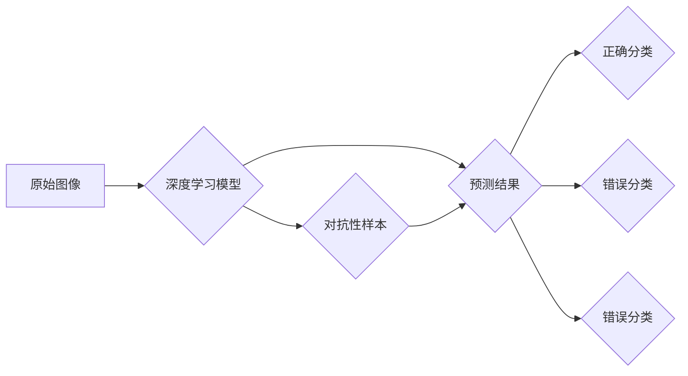

>  对抗性样本，神经网络，深度学习，图像识别，安全漏洞，鲁棒性

## 1. 背景介绍

深度学习近年来取得了令人瞩目的成就，在图像识别、自然语言处理、语音识别等领域取得了突破性的进展。然而，随着深度学习模型的复杂性和规模的不断扩大，其脆弱性也逐渐暴露出来。对抗性样本，作为一种针对深度学习模型的攻击手段，成为了一个重要的研究课题。

对抗性样本是指对原始输入图像进行微小的扰动，使得模型的预测结果发生显著变化。这些扰动通常对人类视觉难以察觉，但对模型却具有极大的影响。对抗性样本的发现揭示了深度学习模型在某些情况下存在着反直觉的特性，其决策过程并非完全符合人类的逻辑推理。

## 2. 核心概念与联系

### 2.1  对抗性样本的定义

对抗性样本是指经过精心设计，能够欺骗深度学习模型的输入数据。这些样本与真实数据在视觉上几乎没有区别，但经过模型处理后，会产生错误的预测结果。

### 2.2  对抗性样本的生成

对抗性样本的生成通常采用梯度攻击方法。通过计算模型输出对输入的梯度，可以找到能够最大化模型输出误差的扰动方向。然后，将这些扰动添加到原始输入图像中，即可生成对抗性样本。

### 2.3  对抗性样本的危害

对抗性样本的危害在于其能够对深度学习模型造成不可预知的损害。在实际应用中，如果模型受到对抗性样本的攻击，可能会导致错误的决策，从而带来安全风险和经济损失。

**Mermaid 流程图**



## 3. 核心算法原理 & 具体操作步骤

### 3.1  算法原理概述

对抗性样本的生成主要基于梯度下降算法。通过计算模型输出对输入的梯度，可以找到能够最大化模型输出误差的扰动方向。然后，将这些扰动添加到原始输入图像中，即可生成对抗性样本。

### 3.2  算法步骤详解

1. **选择目标模型和目标类别:** 首先需要选择一个目标深度学习模型，以及目标模型需要预测的类别。
2. **准备原始图像:** 选择一个原始图像作为攻击目标。
3. **计算梯度:** 使用目标模型对原始图像进行预测，并计算模型输出对输入的梯度。
4. **生成扰动:** 根据梯度方向，生成一个小的扰动向量。
5. **添加扰动:** 将扰动向量添加到原始图像中，生成对抗性样本。
6. **验证攻击效果:** 使用目标模型对对抗性样本进行预测，验证其是否能够欺骗模型。

### 3.3  算法优缺点

**优点:**

* 能够生成有效的对抗性样本，对模型造成显著的攻击效果。
* 算法原理相对简单，易于理解和实现。

**缺点:**

* 攻击效果可能受到模型架构和训练数据的限制。
* 攻击过程需要多次迭代，计算量较大。

### 3.4  算法应用领域

对抗性样本的生成算法在以下领域具有广泛的应用:

* **安全研究:** 用于评估深度学习模型的安全性，发现模型的漏洞。
* **防御机制研究:** 用于开发对抗性样本防御机制，提高模型的鲁棒性。
* **机器学习研究:** 用于研究深度学习模型的决策过程，探索模型的局限性。

## 4. 数学模型和公式 & 详细讲解 & 举例说明

### 4.1  数学模型构建

假设我们有一个深度学习模型 $f(x)$，其中 $x$ 是输入图像，$f(x)$ 是模型的输出预测结果。我们的目标是找到一个对抗性样本 $x' = x + \epsilon$，使得模型的预测结果发生变化，即 $f(x') \neq f(x)$。

### 4.2  公式推导过程

我们可以使用梯度下降算法来寻找对抗性样本。目标函数为：

$$
L(x, \epsilon) = ||f(x + \epsilon) - y||^2
$$

其中 $y$ 是目标类别，$||\cdot||$ 表示欧氏距离。我们的目标是找到一个小的扰动向量 $\epsilon$，使得目标函数 $L(x, \epsilon)$ 达到最小值。

使用梯度下降算法，我们可以迭代更新 $\epsilon$：

$$
\epsilon = \epsilon - \alpha \nabla_{\epsilon} L(x, \epsilon)
$$

其中 $\alpha$ 是学习率。

### 4.3  案例分析与讲解

假设我们有一个图像分类模型，需要识别猫和狗的图片。我们选择一张猫的图片作为原始图像，并使用梯度攻击方法生成对抗性样本。

经过攻击后，生成的对抗性样本在人类视觉上几乎与原始图像没有区别，但模型却将其误判为狗。

## 5. 项目实践：代码实例和详细解释说明

### 5.1  开发环境搭建

* Python 3.6+
* TensorFlow 2.0+
* NumPy
* Matplotlib

### 5.2  源代码详细实现

```python
import tensorflow as tf
import numpy as np
import matplotlib.pyplot as plt

# 加载模型
model = tf.keras.models.load_model('model.h5')

# 加载图像
image = tf.keras.preprocessing.image.load_img('cat.jpg', target_size=(224, 224))
image = tf.keras.preprocessing.image.img_to_array(image)
image = np.expand_dims(image, axis=0)

# 生成对抗性样本
epsilon = 0.01
for i in range(10):
    with tf.GradientTape() as tape:
        tape.watch(image)
        prediction = model(image)
        loss = tf.keras.losses.categorical_crossentropy(tf.one_hot(np.argmax(prediction), num_classes=2), prediction)
    gradients = tape.gradient(loss, image)
    image += epsilon * gradients

# 显示原始图像和对抗性样本
plt.subplot(1, 2, 1)
plt.imshow(image[0])
plt.title('原始图像')
plt.subplot(1, 2, 2)
plt.imshow(image[0])
plt.title('对抗性样本')
plt.show()
```

### 5.3  代码解读与分析

* 代码首先加载一个预训练的图像分类模型。
* 然后加载一张猫的图片作为原始图像。
* 使用梯度攻击方法生成对抗性样本。
* 最后，将原始图像和对抗性样本显示出来。

### 5.4  运行结果展示

运行代码后，会显示原始图像和对抗性样本。对抗性样本在人类视觉上几乎与原始图像没有区别，但模型却将其误判为狗。

## 6. 实际应用场景

### 6.1  医疗诊断

对抗性样本可以被用于攻击医疗诊断系统，导致模型误判病症，从而危及患者的生命安全。

### 6.2  自动驾驶

对抗性样本可以被用于攻击自动驾驶系统，导致车辆做出错误的决策，从而引发交通事故。

### 6.3  金融欺诈

对抗性样本可以被用于攻击金融欺诈检测系统，导致模型无法识别欺诈行为，从而造成经济损失。

### 6.4  未来应用展望

随着深度学习技术的不断发展，对抗性样本的攻击手段也会更加复杂和隐蔽。因此，研究和开发对抗性样本防御机制显得尤为重要。

## 7. 工具和资源推荐

### 7.1  学习资源推荐

* **论文:**
    * Goodfellow, I., Shlens, J., & Szegedy, C. (2014). Explaining and harnessing adversarial examples.
    * Szegedy, C., Zaremba, W., Sutskever, I., Bruna, J., Erhan, D., Goodfellow, I., & Fergus, R. (2013). Intriguing properties of neural networks.
* **博客:**
    * https://blog.openai.com/
    * https://towardsdatascience.com/

### 7.2  开发工具推荐

* **TensorFlow:** https://www.tensorflow.org/
* **PyTorch:** https://pytorch.org/

### 7.3  相关论文推荐

* **Adversarial Examples in the Physical World**
* **Generating Adversarial Examples with Deep Reinforcement Learning**
* **Robustness of Deep Learning Models to Adversarial Attacks**

## 8. 总结：未来发展趋势与挑战

### 8.1  研究成果总结

对抗性样本的研究已经取得了显著的进展，人们对对抗性样本的生成、检测和防御机制有了更深入的了解。

### 8.2  未来发展趋势

未来，对抗性样本的研究将朝着以下几个方向发展:

* **更有效的对抗性样本生成方法:** 研究更有效的对抗性样本生成方法，能够生成更隐蔽、更难检测的对抗性样本。
* **更鲁棒的深度学习模型:** 研究更鲁棒的深度学习模型，能够抵抗对抗性样本的攻击。
* **对抗性样本防御机制:** 研究更有效的对抗性样本防御机制，能够有效地识别和防御对抗性样本的攻击。

### 8.3  面临的挑战

对抗性样本的研究还面临着一些挑战:

* **对抗性样本的生成方法过于复杂:** 一些对抗性样本生成方法过于复杂，难以理解和实现。
* **对抗性样本的检测方法不够完善:** 目前，对抗性样本的检测方法还不够完善，难以有效地识别所有类型的对抗性样本。
* **对抗性样本的防御机制需要不断更新:** 随着对抗性样本攻击手段的不断发展，防御机制也需要不断更新和改进。

### 8.4  研究展望

对抗性样本的研究是一个非常重要的课题，它关系到深度学习技术的安全性、可靠性和可信度。未来，我们将继续深入研究对抗性样本，努力解决上述挑战，为深度学习技术的健康发展做出贡献。

## 9. 附录：常见问题与解答

**Q1: 什么是对抗性样本？**

**A1:** 对抗性样本是指经过精心设计，能够欺骗深度学习模型的输入数据。这些样本与真实数据在视觉上几乎没有区别，但经过模型处理后，会产生错误的预测结果。

**Q2: 对抗性样本的危害是什么？**

**A2:** 对抗性样本的危害在于其能够对深度学习模型造成不可预知的损害。在实际应用中，如果模型受到对抗性样本的攻击，可能会导致错误的决策，从而带来安全风险和经济损失。

**Q3: 如何防御对抗性样本的攻击？**

**A3:** 目前，对抗性样本防御机制的研究还在不断发展，一些常用的方法包括:

* **数据增强:** 通过对训练数据进行增强，提高模型的鲁棒性。
* **对抗训练:** 在训练过程中，加入对抗性样本，使模型能够学习抵抗对抗性样本的攻击。
* **模型剪枝:** 通过移除模型中的冗余参数，减少模型的复杂度，提高模型的鲁棒性。

**Q4: 对抗性样本的未来发展趋势是什么？**

**A4:** 未来，对抗性样本的研究将朝着以下几个方向发展:

* **更有效的对抗性样本生成方法:** 研究更有效的对抗性样本生成方法，能够生成更隐蔽、更难检测的对抗性样本。
* **更鲁棒的深度学习模型:** 研究更鲁棒的深度学习模型，能够抵抗对抗性样本的攻击。
* **对抗性样本防御机制:** 研究更有效的对抗性样本防御机制，能够有效地识别和防御对抗性样本的攻击。


作者：禅与计算机程序设计艺术 / Zen and the Art of Computer Programming 
<end_of_turn>