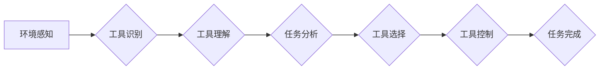

> 智能自动化、工具使用机制、机器学习、自然语言处理、机器人技术、自动化流程、可编程性

## 1. 背景介绍

智能自动化正在迅速改变着各个行业，从制造业到金融业，再到医疗保健业，自动化技术正在改变着我们工作和生活的方方面面。智能自动化背后的核心是让机器能够像人类一样理解、学习和执行任务。而工具使用机制是实现智能自动化的一个关键要素。

传统的自动化系统通常依赖于预先编程的规则和流程，缺乏灵活性。而工具使用机制则赋予机器学习和适应能力，使其能够根据不同的场景和任务选择和使用合适的工具。例如，一个智能机器人可以根据不同的任务选择不同的工具，例如钳子、螺丝刀或焊枪。

## 2. 核心概念与联系

**2.1 工具使用机制概述**

工具使用机制是指机器能够识别、理解和使用工具以完成特定任务的机制。它涉及到多个领域，包括机器学习、自然语言处理、计算机视觉和机器人技术。

**2.2 核心概念**

* **工具识别:** 机器需要能够识别不同的工具，并理解它们的属性和功能。
* **工具理解:** 机器需要能够理解工具的使用方法，以及如何将其与其他工具或环境交互。
* **工具选择:** 机器需要能够根据任务需求选择合适的工具。
* **工具控制:** 机器需要能够精确地控制工具，以完成任务。

**2.3 架构图**



**2.4 核心概念联系**

环境感知模块负责收集环境信息，例如工具的位置、姿态和周围环境。工具识别模块利用计算机视觉和深度学习技术识别工具的类型和属性。工具理解模块利用知识库和机器学习模型理解工具的使用方法和功能。任务分析模块分析用户的需求和任务目标。工具选择模块根据任务分析结果选择合适的工具。工具控制模块利用机器人技术精确地控制工具，完成任务。

## 3. 核心算法原理 & 具体操作步骤

**3.1 算法原理概述**

工具使用机制的核心算法通常基于机器学习和深度学习技术。

* **监督学习:** 利用标记数据训练模型，例如工具图像和对应的标签。
* **强化学习:** 通过试错学习，奖励模型正确使用工具，惩罚错误使用工具。
* **迁移学习:** 利用已训练好的模型，在新的任务或环境中进行微调。

**3.2 算法步骤详解**

1. **数据收集:** 收集工具图像、使用场景视频和工具属性数据。
2. **数据预处理:** 对数据进行清洗、标注和格式转换。
3. **模型训练:** 利用机器学习算法训练模型，例如卷积神经网络（CNN）用于工具识别，循环神经网络（RNN）用于工具理解。
4. **模型评估:** 利用测试数据评估模型的性能，例如识别准确率、工具使用效率等。
5. **模型部署:** 将训练好的模型部署到机器人或智能设备中。

**3.3 算法优缺点**

* **优点:** 能够学习和适应不同的工具和任务，提高自动化效率和灵活性。
* **缺点:** 需要大量的训练数据，训练过程复杂，模型部署成本较高。

**3.4 算法应用领域**

* **制造业:** 机器人使用不同工具进行生产制造。
* **物流业:** 机器人使用工具进行货物搬运和装卸。
* **医疗保健业:** 机器人使用工具进行手术和辅助治疗。
* **服务业:** 机器人使用工具进行家政服务和客户服务。

## 4. 数学模型和公式 & 详细讲解 & 举例说明

**4.1 数学模型构建**

工具使用机制可以建模为一个决策过程，其中机器需要根据环境信息和任务目标选择合适的工具。

**4.2 公式推导过程**

假设有N种工具，每个工具都有一个性能指标P_i，环境信息为E，任务目标为T。

工具选择公式：

$$
i = argmax_{i=1}^{N} P_i(E, T)
$$

其中，argmax表示选择性能指标最大的工具。

**4.3 案例分析与讲解**

例如，一个机器人需要在不同的环境中搬运不同类型的货物。

* 环境信息E包括货物的大小、重量、形状和地面类型。
* 任务目标T包括货物的位置、目的地和搬运方式。

根据环境信息和任务目标，机器人可以利用工具选择公式选择合适的工具，例如使用叉车搬运大型货物，使用手推车搬运小型货物。

## 5. 项目实践：代码实例和详细解释说明

**5.1 开发环境搭建**

* 操作系统：Ubuntu 20.04
* 编程语言：Python 3.8
* 机器学习库：TensorFlow 2.0
* 图像处理库：OpenCV

**5.2 源代码详细实现**

```python
import tensorflow as tf
from tensorflow.keras.models import Sequential
from tensorflow.keras.layers import Conv2D, MaxPooling2D, Flatten, Dense

# 定义工具识别模型
model = Sequential()
model.add(Conv2D(32, (3, 3), activation='relu', input_shape=(64, 64, 3)))
model.add(MaxPooling2D((2, 2)))
model.add(Conv2D(64, (3, 3), activation='relu'))
model.add(MaxPooling2D((2, 2)))
model.add(Flatten())
model.add(Dense(10, activation='softmax'))

# 编译模型
model.compile(optimizer='adam',
              loss='categorical_crossentropy',
              metrics=['accuracy'])

# 训练模型
model.fit(train_images, train_labels, epochs=10)

# 预测工具类型
prediction = model.predict(test_image)
```

**5.3 代码解读与分析**

* 代码首先定义了一个卷积神经网络模型，用于识别工具类型。
* 模型包含多个卷积层和池化层，用于提取图像特征。
* 全连接层用于分类工具类型。
* 模型使用Adam优化器、交叉熵损失函数和准确率指标进行训练。
* 训练完成后，模型可以用于预测工具类型。

**5.4 运行结果展示**

训练好的模型可以用于识别不同的工具类型，例如钳子、螺丝刀、扳手等。

## 6. 实际应用场景

**6.1 智能制造**

在智能制造领域，工具使用机制可以使机器人能够根据不同的生产任务选择合适的工具，提高生产效率和产品质量。例如，一个机器人可以根据不同的零件形状选择不同的钳子或扳手，进行加工和组装。

**6.2 物流自动化**

在物流自动化领域，工具使用机制可以使机器人能够根据不同的货物类型和尺寸选择合适的工具，进行搬运和装卸。例如，一个机器人可以根据货物的重量选择使用叉车或手推车，根据货物的形状选择使用夹具或搬运平台。

**6.3 医疗机器人**

在医疗机器人领域，工具使用机制可以使机器人能够根据不同的手术步骤选择合适的工具，进行手术和辅助治疗。例如，一个机器人可以根据手术部位选择使用不同的手术刀、钳子或缝合器。

**6.4 未来应用展望**

随着人工智能技术的不断发展，工具使用机制将在更多领域得到应用，例如家政服务、客户服务、教育培训等。

## 7. 工具和资源推荐

**7.1 学习资源推荐**

* **书籍:**
    * 《深度学习》
    * 《机器学习》
    * 《机器人学原理》
* **在线课程:**
    * Coursera: 深度学习
    * edX: 机器学习
    * Udacity: 机器人技术

**7.2 开发工具推荐**

* **Python:** 广泛用于机器学习和人工智能开发。
* **TensorFlow:** 开源机器学习框架。
* **PyTorch:** 开源机器学习框架。
* **ROS:** 开源机器人操作系统。

**7.3 相关论文推荐**

* **工具识别:**
    * "Object Detection in Images Using Deep Convolutional Neural Networks"
    * "YOLO: You Only Look Once: Unified, Real-Time Object Detection"
* **工具理解:**
    * "Learning to Use Tools by Imitation"
    * "Hierarchical Reinforcement Learning for Tool Use"
* **工具使用机制:**
    * "A Framework for Tool Use in Robots"
    * "Towards Generalizable Tool Use in Robots"

## 8. 总结：未来发展趋势与挑战

**8.1 研究成果总结**

近年来，工具使用机制取得了显著进展，机器能够识别、理解和使用越来越多的工具。

**8.2 未来发展趋势**

* **更智能的工具使用:** 机器能够根据更复杂的场景和任务选择和使用工具。
* **更灵活的工具使用:** 机器能够根据环境变化和用户需求动态调整工具使用策略。
* **更安全可靠的工具使用:** 机器能够安全可靠地使用工具，避免造成伤害。

**8.3 面临的挑战**

* **数据获取和标注:** 训练工具使用机制模型需要大量的标注数据，获取和标注数据成本较高。
* **模型复杂度:** 工具使用机制模型通常比较复杂，训练和部署成本较高。
* **安全性与可靠性:** 机器使用工具需要保证安全性，避免造成伤害。

**8.4 研究展望**

未来，研究人员将继续探索更智能、更灵活、更安全可靠的工具使用机制，推动智能自动化技术的发展。

## 9. 附录：常见问题与解答

**9.1 如何训练工具识别模型？**

需要收集大量的工具图像数据，并进行标注。然后使用机器学习算法，例如卷积神经网络，训练模型。

**9.2 如何评估工具使用机制的性能？**

可以使用准确率、效率、安全性等指标评估工具使用机制的性能。

**9.3 如何保证机器使用工具的安全可靠？**

需要设计安全的工具使用策略，并进行严格的测试和验证。


作者：禅与计算机程序设计艺术 / Zen and the Art of Computer Programming 
<end_of_turn>