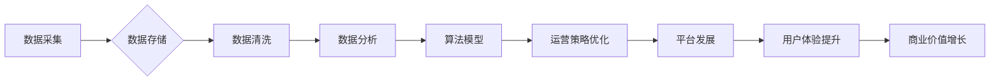

> 平台经济, 数据化, 数据驱动, 运营策略, 平台发展, 数据分析, 算法模型,  机器学习

## 1. 背景介绍

平台经济作为一种新型的经济模式，以其连接用户和提供商，创造价值和协同增长的特点，迅速崛起并成为全球经济发展的重要驱动力。从出行、餐饮到教育、金融，平台经济的应用场景日益广泛，其核心在于构建庞大的用户网络和提供高效便捷的服务。

然而，平台经济的发展也面临着新的挑战。随着平台规模的不断扩大，数据量呈指数级增长，如何有效地利用数据，提升平台运营效率和用户体验，成为平台经济发展的关键。数据化是平台经济发展的必然趋势，数据驱动是平台经济持续发展的核心动力。

## 2. 核心概念与联系

**2.1 平台经济概述**

平台经济是指通过搭建线上平台，连接用户和提供商，并通过撮合、交易、服务等方式创造价值和协同增长的经济模式。平台经济的核心要素包括：

* **平台方:** 提供平台基础设施和服务，并从中获取收益。
* **用户:** 通过平台获取商品、服务或其他资源。
* **提供商:** 通过平台提供商品、服务或其他资源。

**2.2 数据化平台经济**

数据化平台经济是指将数据作为核心资源，通过数据采集、存储、分析和应用，提升平台运营效率、用户体验和商业价值的平台经济模式。

**2.3 数据驱动平台运营**

数据驱动平台运营是指利用数据分析和算法模型，对平台运营策略进行优化，提升平台效率和用户满意度。

**2.4 数据驱动平台发展**

数据驱动平台发展是指利用数据分析和算法模型，预测平台未来发展趋势，并制定相应的战略规划。

**2.5 数据化平台经济架构**



## 3. 核心算法原理 & 具体操作步骤

**3.1 算法原理概述**

数据驱动平台运营的核心算法包括：

* **推荐算法:** 根据用户的历史行为和偏好，推荐相关商品、服务或内容。
* **个性化算法:** 根据用户的特征和需求，提供个性化的服务和体验。
* **预测算法:** 利用历史数据预测未来的趋势，例如用户行为、市场需求等。
* **优化算法:** 优化平台运营策略，例如价格调整、资源分配等。

**3.2 算法步骤详解**

以推荐算法为例，其具体步骤包括：

1. **数据采集:** 收集用户的行为数据，例如浏览记录、购买记录、评价记录等。
2. **数据预处理:** 对数据进行清洗、转换和特征提取。
3. **模型训练:** 利用机器学习算法，训练推荐模型。
4. **模型评估:** 对模型的性能进行评估，例如准确率、召回率等。
5. **模型部署:** 将训练好的模型部署到线上环境，进行实时推荐。

**3.3 算法优缺点**

推荐算法的优点包括：

* **个性化推荐:** 可以根据用户的兴趣和需求，提供更精准的推荐。
* **提升用户体验:** 可以帮助用户更快地找到所需的信息和服务。
* **增加商业价值:** 可以提高用户转化率和销售额。

推荐算法的缺点包括：

* **数据依赖:** 推荐算法的性能依赖于数据的质量和数量。
* **算法复杂度:** 训练和部署推荐模型需要一定的技术难度。
* **冷启动问题:** 对新用户和新商品的推荐效果可能较差。

**3.4 算法应用领域**

推荐算法广泛应用于以下领域：

* **电商平台:** 推荐商品、优惠券和促销活动。
* **社交媒体:** 推荐好友、内容和活动。
* **视频网站:** 推荐视频、电视剧和电影。
* **音乐平台:** 推荐歌曲、专辑和艺术家。

## 4. 数学模型和公式 & 详细讲解 & 举例说明

**4.1 数学模型构建**

推荐算法通常采用基于用户的协同过滤算法，其核心思想是：

* 如果用户A和用户B都喜欢商品X，那么用户A也可能喜欢商品Y，而用户B也可能喜欢商品Z。

**4.2 公式推导过程**

用户对商品的评分可以表示为一个矩阵，其中行代表用户，列代表商品。协同过滤算法的目标是预测用户对未评分商品的评分。

假设用户u对商品i的评分为r<sub>ui</sub>，则可以使用以下公式预测用户u对商品j的评分：

$$
\hat{r}_{uj} = \bar{r}_u + \frac{\sum_{i \in N(u)} (r_{ui} - \bar{r}_u) \cdot (r_{ij} - \bar{r}_j)}{\sum_{i \in N(u)} (r_{ui} - \bar{r}_u)^2}
$$

其中：

* $\hat{r}_{uj}$ 是预测的用户u对商品j的评分。
* $\bar{r}_u$ 是用户u的平均评分。
* $\bar{r}_j$ 是商品j的平均评分。
* $N(u)$ 是用户u评分过的商品集合。

**4.3 案例分析与讲解**

假设用户A和用户B都评分过商品X和商品Y，并且用户A对商品X的评分为5，用户B对商品X的评分为4，用户A对商品Y的评分为4，用户B对商品Y的评分为3。

根据上述公式，我们可以预测用户A对商品Y的评分为：

$$
\hat{r}_{A,Y} = 4 + \frac{(5-4) \cdot (3-4)}{(5-4)^2} = 3.5
$$

## 5. 项目实践：代码实例和详细解释说明

**5.1 开发环境搭建**

* Python 3.x
* Pandas
* Scikit-learn
* TensorFlow/PyTorch

**5.2 源代码详细实现**

```python
import pandas as pd
from sklearn.metrics.pairwise import cosine_similarity

# 数据加载
data = pd.read_csv('ratings.csv')

# 数据预处理
user_item_matrix = data.pivot_table(index='user_id', columns='item_id', values='rating').fillna(0)

# 计算用户-商品相似度矩阵
user_similarity = cosine_similarity(user_item_matrix)

# 预测用户对商品的评分
def predict_rating(user_id, item_id):
    # 获取用户评分过的商品
    rated_items = user_item_matrix.loc[user_id].nonzero()[0]
    # 计算用户与其他用户的相似度
    user_similarity_scores = user_similarity[user_id]
    # 预测用户对商品的评分
    predicted_rating = np.average(user_item_matrix.loc[rated_items, item_id] * user_similarity_scores[rated_items])
    return predicted_rating

# 预测用户1对商品5的评分
predicted_rating = predict_rating(1, 5)
print(f'Predicted rating for user 1 on item 5: {predicted_rating}')
```

**5.3 代码解读与分析**

* 代码首先加载数据，并将其转换为用户-商品评分矩阵。
* 然后，使用余弦相似度计算用户之间的相似度。
* 最后，定义一个函数`predict_rating`，用于预测用户对商品的评分。该函数根据用户评分过的商品和与其他用户的相似度，计算出对目标商品的预测评分。

**5.4 运行结果展示**

运行代码后，会输出用户1对商品5的预测评分。

## 6. 实际应用场景

**6.1 电商平台推荐**

电商平台可以利用数据驱动平台运营，推荐用户感兴趣的商品，提升用户转化率和销售额。

**6.2 社交媒体个性化推荐**

社交媒体平台可以利用数据驱动平台运营，推荐用户感兴趣的内容和好友，提升用户粘性和活跃度。

**6.3 内容平台个性化推荐**

内容平台可以利用数据驱动平台运营，推荐用户感兴趣的视频、文章和音频，提升用户体验和内容消费量。

**6.4 未来应用展望**

数据驱动平台运营将成为未来平台经济发展的重要趋势，其应用场景将更加广泛，例如：

* **智能客服:** 利用自然语言处理和机器学习，提供更智能和个性化的客服服务。
* **精准营销:** 利用用户数据，进行精准的营销推广，提升营销效果。
* **个性化教育:** 利用用户学习数据，提供个性化的学习方案和辅导。

## 7. 工具和资源推荐

**7.1 学习资源推荐**

* **书籍:**
    * 《推荐系统实践》
    * 《机器学习》
* **在线课程:**
    * Coursera: Machine Learning
    * edX: Artificial Intelligence

**7.2 开发工具推荐**

* **Python:** 
    * Pandas
    * Scikit-learn
    * TensorFlow/PyTorch
* **云平台:**
    * AWS
    * Azure
    * Google Cloud

**7.3 相关论文推荐**

* 《Collaborative Filtering for Implicit Feedback Datasets》
* 《Matrix Factorization Techniques for Recommender Systems》

## 8. 总结：未来发展趋势与挑战

**8.1 研究成果总结**

数据驱动平台运营已取得显著成果，例如推荐算法的精度不断提高，用户体验不断提升，平台运营效率不断提高。

**8.2 未来发展趋势**

未来，数据驱动平台运营将朝着以下方向发展：

* **更精准的推荐:** 利用更先进的算法和更丰富的用户数据，提供更精准的推荐。
* **更个性化的体验:** 利用用户行为和偏好，提供更个性化的服务和体验。
* **更智能的运营:** 利用人工智能和机器学习，自动优化平台运营策略。

**8.3 面临的挑战**

数据驱动平台运营也面临着一些挑战：

* **数据隐私和安全:** 如何保护用户数据隐私和安全，是平台运营面临的重要挑战。
* **算法公平性:** 如何避免算法产生偏见，确保算法公平公正，是平台运营需要关注的问题。
* **数据解释性:** 如何解释算法的决策结果，让用户理解算法是如何工作的，也是平台运营需要解决的问题。

**8.4 研究展望**

未来，数据驱动平台运营的研究方向将包括：

* **隐私保护技术:** 研究更有效的隐私保护技术，保护用户数据隐私和安全。
* **公平性算法:** 研究公平性算法，避免算法产生偏见，确保算法公平公正。
* **可解释性算法:** 研究可解释性算法，让用户理解算法的决策结果。


## 9. 附录：常见问题与解答

**9.1 如何提高推荐算法的准确率？**

* 提高数据质量：收集更丰富、更准确的用户数据。
* 尝试不同的算法：不同的算法适用于不同的场景，需要根据实际情况选择合适的算法。
* 优化算法参数：通过调优算法参数，可以提高算法的性能。

**9.2 如何解决冷启动问题？**

* 利用用户画像：根据用户的其他特征，例如年龄、性别、兴趣爱好等，进行推荐。
* 利用协同过滤的扩展方法：例如基于内容的协同过滤、基于图的协同过滤等。
* 利用人工标注数据：收集少量人工标注的数据，用于训练模型。


作者：禅与计算机程序设计艺术 / Zen and the Art of Computer Programming 
<end_of_turn>