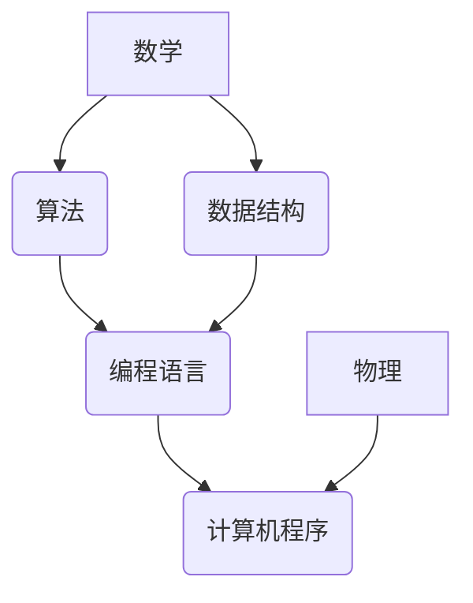

> 数学、物理、计算机、底层能力、算法、数据结构、编程、人工智能

## 1. 背景介绍

在当今科技飞速发展的时代，人工智能、大数据、云计算等领域蓬勃发展，对人才的需求量不断攀升。然而，许多人发现，即使掌握了丰富的编程知识，也难以在这些领域取得突破性进展。究其原因，在于缺乏扎实的底层能力。

底层能力，指的是理解和运用数学、物理、计算机科学基本原理的能力。这些基础知识是构建复杂系统、解决实际问题、进行创新思维的基石。

## 2. 核心概念与联系

**2.1 数学**

数学是描述和理解世界规律的语言，它为计算机科学提供了逻辑推理、抽象思维、算法设计等基础。

* **逻辑学:** 提供了计算机程序的正确性和可靠性的保证。
* **代数:** 用于表示和操作数据，是算法设计和数据结构的基础。
* **微积分:** 用于描述变化和趋势，在机器学习、图像处理等领域有广泛应用。

**2.2 物理**

物理学研究自然界的运动规律和能量转换，它为计算机硬件的设计和优化提供了理论基础。

* **电磁学:** 构成计算机硬件的基础，例如晶体管、电线等。
* **热力学:** 影响计算机硬件的性能和可靠性，例如散热设计。
* **量子力学:** 为量子计算提供了理论基础。

**2.3 计算机科学**

计算机科学是研究计算机系统及其应用的学科，它将数学和物理学应用于实际问题解决。

* **算法:** 是解决问题的步骤和规则，是计算机程序的核心。
* **数据结构:** 是用于存储和组织数据的结构，影响程序的效率和性能。
* **编程语言:** 是用于编写计算机程序的工具，不同语言有不同的特点和应用场景。

**2.4 核心概念联系**

数学、物理、计算机科学相互关联，共同构成了底层能力的框架。



## 3. 核心算法原理 & 具体操作步骤

**3.1 算法原理概述**

算法是一种解决特定问题的步骤和规则，它可以被计算机理解和执行。一个好的算法应该具有以下特点：

* **确定性:** 对于给定的输入，算法应该始终产生相同的输出。
* **有限性:** 算法的执行步骤应该有限，不能无限循环。
* **有效性:** 算法的每个步骤都应该能够被计算机执行。

**3.2 算法步骤详解**

以排序算法为例，详细说明算法步骤：

1. **输入:** 待排序的数列。
2. **比较:** 比较相邻的两个元素，判断大小关系。
3. **交换:** 如果两个元素的顺序错误，则交换它们的位置。
4. **重复:** 重复步骤2和3，直到整个数列有序。

**3.3 算法优缺点**

不同的排序算法有不同的优缺点，例如：

* **冒泡排序:** 简单易懂，但效率较低。
* **快速排序:** 效率较高，但可能存在最坏情况下的时间复杂度问题。

**3.4 算法应用领域**

算法广泛应用于各个领域，例如：

* **搜索引擎:** 用于排名网页结果。
* **推荐系统:** 用于推荐用户感兴趣的内容。
* **图像处理:** 用于图像识别和分类。

## 4. 数学模型和公式 & 详细讲解 & 举例说明

**4.1 数学模型构建**

数学模型是利用数学语言和符号来描述现实世界现象的抽象表示。

例如，我们可以用线性方程来描述物体的运动规律：

$$s = vt + \frac{1}{2}at^2$$

其中：

* $s$ 是位移
* $v$ 是初速度
* $a$ 是加速度
* $t$ 是时间

**4.2 公式推导过程**

我们可以通过物理定律和数学推导来得到公式。例如，牛顿第二定律指出：

$$F = ma$$

其中：

* $F$ 是力
* $m$ 是质量
* $a$ 是加速度

结合运动学公式，我们可以推导出物体的运动规律公式。

**4.3 案例分析与讲解**

我们可以用数学模型和公式来分析实际问题。例如，我们可以用线性回归模型来预测房价。

## 5. 项目实践：代码实例和详细解释说明

**5.1 开发环境搭建**

我们可以使用Python语言和相关库来实现算法。

**5.2 源代码详细实现**

```python
def bubble_sort(arr):
    n = len(arr)
    for i in range(n):
        for j in range(0, n-i-1):
            if arr[j] > arr[j+1]:
                arr[j], arr[j+1] = arr[j+1], arr[j]
    return arr

# 测试代码
arr = [64, 34, 25, 12, 22, 11, 90]
sorted_arr = bubble_sort(arr)
print("排序后的数组:", sorted_arr)
```

**5.3 代码解读与分析**

这段代码实现了冒泡排序算法。

* 外循环控制了排序的轮数。
* 内循环比较相邻元素，并交换位置。
* 每次排序后，最大的元素都会被“冒泡”到数组末尾。

**5.4 运行结果展示**

```
排序后的数组: [11, 12, 22, 25, 34, 64, 90]
```

## 6. 实际应用场景

**6.1 搜索引擎排名**

搜索引擎使用算法来对网页进行排名，以便用户能够快速找到相关信息。

**6.2 推荐系统**

推荐系统使用算法来分析用户的行为数据，并推荐用户可能感兴趣的内容。

**6.3 图像识别**

图像识别算法可以识别图像中的物体、场景和人脸。

**6.4 未来应用展望**

随着人工智能技术的不断发展，算法将在更多领域得到应用，例如：

* **自动驾驶:** 算法可以帮助车辆感知周围环境，并做出决策。
* **医疗诊断:** 算法可以辅助医生进行诊断，提高诊断准确率。
* **个性化教育:** 算法可以根据学生的学习情况，提供个性化的学习方案。

## 7. 工具和资源推荐

**7.1 学习资源推荐**

* **书籍:** 《算法导论》、《数据结构与算法分析》
* **在线课程:** Coursera、edX、Udacity

**7.2 开发工具推荐**

* **编程语言:** Python、Java、C++
* **IDE:** PyCharm、Eclipse、Visual Studio Code

**7.3 相关论文推荐**

* **深度学习:** 《ImageNet Classification with Deep Convolutional Neural Networks》
* **自然语言处理:** 《Attention Is All You Need》

## 8. 总结：未来发展趋势与挑战

**8.1 研究成果总结**

近年来，人工智能领域取得了显著进展，算法在各个领域得到了广泛应用。

**8.2 未来发展趋势**

未来，算法将朝着更加智能、高效、可解释的方向发展。

* **强化学习:** 算法能够通过与环境交互学习，并不断优化策略。
* **联邦学习:** 算法能够在不共享数据的情况下进行训练，保护用户隐私。
* **可解释性:** 算法能够解释自己的决策过程，提高用户信任度。

**8.3 面临的挑战**

算法发展也面临着一些挑战，例如：

* **数据安全:** 算法训练需要大量数据，如何保证数据安全和隐私保护是一个重要问题。
* **算法偏见:** 算法可能存在偏见，导致不公平的结果。
* **伦理问题:** 算法的应用可能引发伦理问题，例如自动驾驶中的道德困境。

**8.4 研究展望**

未来，我们需要更加关注算法的伦理、安全和可解释性，确保算法能够真正造福人类。

## 9. 附录：常见问题与解答

**9.1 什么是算法复杂度？**

算法复杂度是指算法执行时间或空间资源消耗的量级，通常用大O符号表示。

**9.2 如何选择合适的算法？**

选择合适的算法需要考虑算法的效率、适用场景和数据规模等因素。

**9.3 如何提高算法效率？**

可以通过优化算法的代码、使用更合适的数据结构和算法来提高算法效率。


作者：禅与计算机程序设计艺术 / Zen and the Art of Computer Programming 
<end_of_turn>