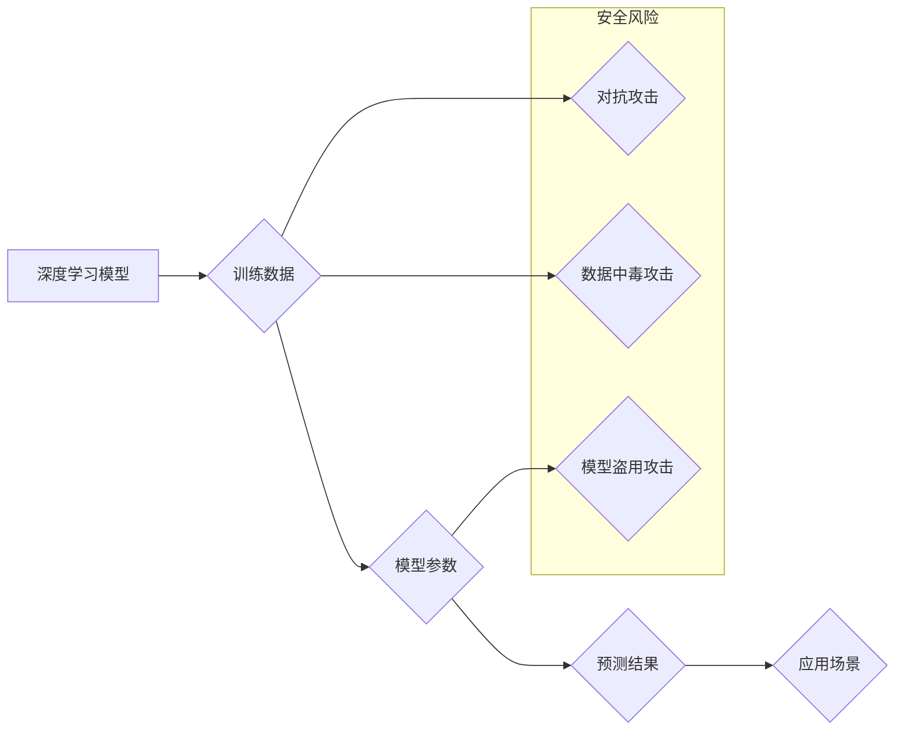

> 深度学习，不安全性，安全漏洞，对抗攻击，鲁棒性，可解释性，隐私保护

## 1. 背景介绍

深度学习作为人工智能领域最具潜力的技术之一，在图像识别、自然语言处理、语音识别等领域取得了令人瞩目的成就。然而，随着深度学习技术的广泛应用，其潜在的安全风险也日益凸显。张钹院士在多次演讲和文章中强调了深度学习的不安全性，并指出其可能带来的严重后果。

深度学习模型的训练依赖于海量数据，而这些数据可能包含敏感信息，例如个人身份信息、财务信息等。如果攻击者能够获取或篡改这些数据，就可能导致隐私泄露、身份盗窃等安全问题。此外，深度学习模型本身也存在着一些安全漏洞，例如：

* **对抗攻击：**攻击者可以设计一些微小的扰动，对输入数据进行修改，从而导致深度学习模型产生错误的预测结果。
* **数据中毒攻击：**攻击者可以将恶意数据注入到训练数据集中，从而导致深度学习模型学习到错误的知识，并产生不准确的预测结果。
* **模型盗用攻击：**攻击者可以利用深度学习模型的输出结果，推断出模型内部的结构和参数，从而窃取模型的知识产权。

## 2. 核心概念与联系

深度学习的不安全性主要体现在以下几个方面：

* **可解释性差：**深度学习模型的决策过程非常复杂，难以理解其内部的运作机制。这使得我们难以识别和修复模型中的安全漏洞。
* **鲁棒性差：**深度学习模型对输入数据的变化非常敏感，容易受到对抗攻击的影响。
* **隐私保护不足：**深度学习模型的训练和使用过程中，可能会泄露敏感信息。

**Mermaid 流程图**



## 3. 核心算法原理 & 具体操作步骤

### 3.1  算法原理概述

深度学习的核心算法是神经网络，它模仿了人脑的神经元结构和连接方式。神经网络由多个层组成，每一层都包含多个神经元。神经元之间通过连接进行信息传递，每个连接都有一个权重。通过训练，神经网络可以学习到这些权重的最佳值，从而实现对数据的学习和预测。

### 3.2  算法步骤详解

深度学习模型的训练过程通常包括以下步骤：

1. **数据预处理：**将原始数据进行清洗、转换和格式化，使其适合深度学习模型的训练。
2. **模型构建：**根据具体的应用场景，选择合适的深度学习模型架构，并定义模型的层数、神经元数量等参数。
3. **模型训练：**使用训练数据对深度学习模型进行训练，通过调整模型参数，使模型的预测结果与真实值尽可能接近。
4. **模型评估：**使用测试数据对训练好的模型进行评估，并根据评估结果进行模型调优。
5. **模型部署：**将训练好的模型部署到实际应用场景中，用于进行预测或其他任务。

### 3.3  算法优缺点

**优点：**

* **强大的学习能力：**深度学习模型能够从海量数据中学习到复杂的模式和特征。
* **高精度：**深度学习模型在许多任务中能够达到很高的精度。
* **自动化程度高：**深度学习模型的训练和部署过程可以高度自动化。

**缺点：**

* **数据依赖性强：**深度学习模型的性能取决于训练数据的质量和数量。
* **计算资源消耗大：**深度学习模型的训练和推理过程需要大量的计算资源。
* **可解释性差：**深度学习模型的决策过程难以理解，这使得我们难以识别和修复模型中的安全漏洞。

### 3.4  算法应用领域

深度学习技术在各个领域都有广泛的应用，例如：

* **计算机视觉：**图像识别、目标检测、图像分割、人脸识别等。
* **自然语言处理：**文本分类、机器翻译、情感分析、对话系统等。
* **语音识别：**语音转文本、语音合成等。
* **医疗保健：**疾病诊断、药物研发、医疗影像分析等。
* **金融科技：**欺诈检测、风险评估、投资决策等。

## 4. 数学模型和公式 & 详细讲解 & 举例说明

### 4.1  数学模型构建

深度学习模型的数学基础是神经网络，其核心是激活函数、权重和偏置。

* **激活函数：**用于引入非线性，使神经网络能够学习复杂的模式。常见的激活函数包括 sigmoid 函数、ReLU 函数、tanh 函数等。
* **权重：**连接神经元之间的参数，决定了信息传递的强度。
* **偏置：**每个神经元都有一个偏置项，用于调整神经元的激活阈值。

### 4.2  公式推导过程

深度学习模型的训练过程是通过优化模型参数来最小化损失函数的过程。损失函数衡量模型预测结果与真实值的差距。常用的损失函数包括均方误差、交叉熵等。

**均方误差 (MSE)：**

$$MSE = \frac{1}{n} \sum_{i=1}^{n} (y_i - \hat{y}_i)^2$$

其中：

* $y_i$ 是真实值
* $\hat{y}_i$ 是模型预测值
* $n$ 是样本数量

**交叉熵 (Cross-Entropy)：**

$$Cross-Entropy = -\sum_{i=1}^{n} y_i \log(\hat{y}_i)$$

其中：

* $y_i$ 是真实值（one-hot编码）
* $\hat{y}_i$ 是模型预测值（概率分布）

### 4.3  案例分析与讲解

假设我们训练一个深度学习模型用于图像分类，目标是将图像分类为猫或狗。

* **训练数据：**包含大量猫和狗的图像，每个图像都有对应的标签（猫或狗）。
* **模型架构：**可以使用卷积神经网络 (CNN) 来提取图像特征。
* **损失函数：**可以使用交叉熵作为损失函数。
* **优化算法：**可以使用梯度下降算法来优化模型参数。

通过训练，模型会学习到猫和狗的特征，并能够准确地将图像分类为猫或狗。

## 5. 项目实践：代码实例和详细解释说明

### 5.1  开发环境搭建

* **操作系统：**Linux 或 macOS
* **编程语言：**Python
* **深度学习框架：**TensorFlow 或 PyTorch
* **其他工具：**Git、Jupyter Notebook

### 5.2  源代码详细实现

```python
import tensorflow as tf

# 定义模型架构
model = tf.keras.models.Sequential([
    tf.keras.layers.Conv2D(32, (3, 3), activation='relu', input_shape=(28, 28, 1)),
    tf.keras.layers.MaxPooling2D((2, 2)),
    tf.keras.layers.Conv2D(64, (3, 3), activation='relu'),
    tf.keras.layers.MaxPooling2D((2, 2)),
    tf.keras.layers.Flatten(),
    tf.keras.layers.Dense(10, activation='softmax')
])

# 编译模型
model.compile(optimizer='adam',
              loss='sparse_categorical_crossentropy',
              metrics=['accuracy'])

# 训练模型
model.fit(x_train, y_train, epochs=10)

# 评估模型
loss, accuracy = model.evaluate(x_test, y_test)
print('Test loss:', loss)
print('Test accuracy:', accuracy)
```

### 5.3  代码解读与分析

* **模型架构：**该代码定义了一个简单的卷积神经网络 (CNN) 模型，用于图像分类。
* **编译模型：**使用 Adam 优化器、交叉熵损失函数和准确率作为评估指标。
* **训练模型：**使用训练数据训练模型，训练 10 个 epochs。
* **评估模型：**使用测试数据评估模型的性能。

### 5.4  运行结果展示

运行代码后，会输出模型在测试集上的损失值和准确率。

## 6. 实际应用场景

深度学习技术在各个领域都有广泛的应用，例如：

* **医疗保健：**疾病诊断、药物研发、医疗影像分析等。
* **金融科技：**欺诈检测、风险评估、投资决策等。
* **自动驾驶：**图像识别、目标检测、路径规划等。
* **人机交互：**语音助手、聊天机器人等。

## 7. 工具和资源推荐

### 7.1  学习资源推荐

* **书籍：**
    * 深度学习 (Deep Learning) - Ian Goodfellow, Yoshua Bengio, Aaron Courville
    * 深度学习实战 (Deep Learning with Python) - Francois Chollet
* **在线课程：**
    * TensorFlow 官方教程
    * PyTorch 官方教程
    * Coursera 深度学习课程
    * Udacity 深度学习课程

### 7.2  开发工具推荐

* **深度学习框架：**TensorFlow, PyTorch, Keras
* **编程语言：**Python
* **数据处理工具：**Pandas, NumPy
* **可视化工具：**Matplotlib, Seaborn

### 7.3  相关论文推荐

* **AlexNet：**ImageNet Classification with Deep Convolutional Neural Networks
* **VGGNet：**Very Deep Convolutional Networks for Large-Scale Image Recognition
* **ResNet：**Deep Residual Learning for Image Recognition

## 8. 总结：未来发展趋势与挑战

### 8.1  研究成果总结

深度学习技术取得了令人瞩目的成就，在各个领域都展现出巨大的潜力。

### 8.2  未来发展趋势

* **模型规模和复杂度提升：**未来深度学习模型将更加庞大，更加复杂。
* **模型可解释性增强：**研究人员将致力于提高深度学习模型的可解释性，使其决策过程更加透明。
* **模型鲁棒性提升：**研究人员将致力于提高深度学习模型的鲁棒性，使其能够更好地应对对抗攻击和数据噪声。
* **边缘计算和联邦学习：**深度学习模型将更加广泛地部署到边缘设备和分布式系统中。

### 8.3  面临的挑战

* **数据安全和隐私保护：**深度学习模型的训练和使用过程中，可能会泄露敏感信息。
* **模型可解释性和信任度：**深度学习模型的决策过程难以理解，这使得我们难以信任其结果。
* **模型公平性和偏见：**深度学习模型可能会学习到数据中的偏见，从而导致不公平的结果。

### 8.4  研究展望

未来，深度学习研究将继续朝着更加安全、可解释、鲁棒和公平的方向发展。


## 9. 附录：常见问题与解答

**Q1：深度学习模型如何进行训练？**

**A1：**深度学习模型的训练过程是通过优化模型参数来最小化损失函数的过程。损失函数衡量模型预测结果与真实值的差距。常用的优化算法包括梯度下降算法。

**Q2：深度学习模型的安全性如何保障？**

**A2：**深度学习模型的安全保障是一个复杂的问题，需要从多个方面入手，例如：

* 使用安全的训练数据
* 采用对抗训练技术提高模型的鲁棒性
* 使用可解释性高的模型
* 加强模型的隐私保护

**Q3：深度学习模型的应用场景有哪些？**

**A3：**深度学习技术在各个领域都有广泛的应用，例如：

* 计算机视觉
* 自然语言处理
* 语音识别
* 医疗保健
* 金融科技

**Q4：如何学习深度学习？**

