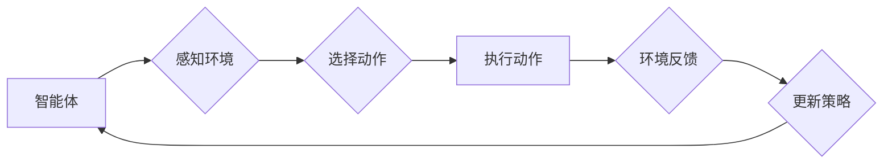

> 强化学习，机器学习，监督学习，无监督学习，深度学习，Q学习，价值函数，策略梯度

## 1. 背景介绍

机器学习作为人工智能领域的核心技术之一，近年来取得了长足的进步，并在各个领域得到了广泛应用。传统的机器学习方法主要包括监督学习、无监督学习和半监督学习。监督学习需要大量的标注数据，而无监督学习则不需要标注数据，但其效果往往不如监督学习。深度学习作为机器学习的一个分支，通过多层神经网络来学习数据特征，取得了显著的成果。

然而，传统的机器学习方法在某些场景下仍然存在局限性，例如：

* **缺乏交互性:** 传统的机器学习方法通常是静态的，无法与环境进行交互学习。
* **数据标注成本高:** 监督学习需要大量的标注数据，这在某些领域成本很高。
* **环境复杂性:** 当环境复杂度较高时，传统的机器学习方法难以有效学习。

为了解决这些问题，强化学习 (Reinforcement Learning, RL) 应运而生。强化学习是一种基于交互学习的机器学习方法，它通过让智能体与环境进行交互，学习最优的策略来最大化奖励。

## 2. 核心概念与联系

**2.1 强化学习核心概念**

* **智能体 (Agent):**  与环境交互的实体，可以做出决策。
* **环境 (Environment):** 智能体所处的外部世界，会根据智能体的动作产生状态变化和奖励。
* **状态 (State):** 环境的当前状态，描述了环境的特征。
* **动作 (Action):** 智能体可以采取的行动，会改变环境的状态。
* **奖励 (Reward):** 环境给予智能体的反馈，可以是正向奖励或负向惩罚。
* **策略 (Policy):** 智能体根据当前状态选择动作的规则。
* **价值函数 (Value Function):**  评估某个状态或状态序列的期望奖励。

**2.2 强化学习与传统机器学习的关系**

| 特征 | 强化学习 | 监督学习 | 无监督学习 |
|---|---|---|---|
| 学习方式 | 通过试错和奖励 | 从标注数据学习 | 从未标注数据学习 |
| 数据需求 | 状态、动作、奖励数据 | 标注数据 | 未标注数据 |
| 目标 | 最大化长期奖励 | 预测输出 | 发现数据模式 |
| 应用场景 | 控制、机器人、游戏 | 图像识别、自然语言处理 | 聚类、降维 |

**2.3 强化学习流程图**



## 3. 核心算法原理 & 具体操作步骤

### 3.1 算法原理概述

强化学习的核心算法包括 Q 学习、价值迭代、策略梯度等。

* **Q 学习:**  Q 学习是一种基于价值函数的强化学习算法，它通过学习状态-动作对的价值函数来选择最优动作。
* **价值迭代:** 价值迭代是一种基于价值函数的强化学习算法，它通过迭代更新价值函数来找到最优策略。
* **策略梯度:** 策略梯度是一种基于策略的强化学习算法，它通过梯度上升来更新策略，使其能够最大化奖励。

### 3.2 算法步骤详解

以 Q 学习为例，其具体步骤如下：

1. 初始化 Q 函数，将所有状态-动作对的价值函数设置为 0。
2. 在环境中与智能体交互，收集状态、动作、奖励和下一个状态的数据。
3. 使用 Bellman 方程更新 Q 函数：

$$
Q(s, a) = Q(s, a) + \alpha [r + \gamma \max_{a'} Q(s', a') - Q(s, a)]
$$

其中：

* $Q(s, a)$ 是状态 $s$ 下动作 $a$ 的价值函数。
* $\alpha$ 是学习率。
* $r$ 是奖励。
* $\gamma$ 是折扣因子。
* $s'$ 是下一个状态。
* $a'$ 是下一个状态下最优动作。

4. 重复步骤 2 和 3，直到 Q 函数收敛。

### 3.3 算法优缺点

**优点:**

* 可以学习复杂的环境。
* 不需要大量的标注数据。
* 可以在线学习。

**缺点:**

* 训练过程可能很慢。
* 容易陷入局部最优解。
* 需要设计合适的奖励函数。

### 3.4 算法应用领域

* **机器人控制:**  训练机器人完成各种任务，例如导航、抓取、操作。
* **游戏 AI:**  训练游戏中的 AI 玩家，使其能够与人类玩家进行竞争。
* **推荐系统:**  根据用户的历史行为推荐物品或服务。
* **医疗保健:**  辅助医生诊断疾病、制定治疗方案。

## 4. 数学模型和公式 & 详细讲解 & 举例说明

### 4.1 数学模型构建

强化学习的数学模型主要包括状态空间、动作空间、奖励函数和价值函数。

* **状态空间 (State Space):**  所有可能的环境状态的集合。
* **动作空间 (Action Space):**  智能体可以采取的所有动作的集合。
* **奖励函数 (Reward Function):**  将状态和动作映射到奖励的函数。
* **价值函数 (Value Function):**  评估某个状态或状态序列的期望奖励的函数。

### 4.2 公式推导过程

**4.2.1 Bellman 方程:**

Bellman 方程是强化学习的核心公式，它描述了价值函数的更新规则。

$$
V(s) = \max_{a} \mathbb{E}[r + \gamma V(s') | s, a]
$$

其中：

* $V(s)$ 是状态 $s$ 的价值函数。
* $r$ 是奖励。
* $\gamma$ 是折扣因子。
* $s'$ 是下一个状态。
* $\mathbb{E}$ 表示期望。

**4.2.2 Q 函数更新公式:**

$$
Q(s, a) = Q(s, a) + \alpha [r + \gamma \max_{a'} Q(s', a') - Q(s, a)]
$$

其中：

* $Q(s, a)$ 是状态 $s$ 下动作 $a$ 的价值函数。
* $\alpha$ 是学习率。
* $r$ 是奖励。
* $\gamma$ 是折扣因子。
* $s'$ 是下一个状态。
* $a'$ 是下一个状态下最优动作。

### 4.3 案例分析与讲解

**4.3.1 贪婪策略:**

贪婪策略是一种简单的强化学习策略，它总是选择当前状态下价值函数最大的动作。

**4.3.2 epsilon-贪婪策略:**

epsilon-贪婪策略是一种改进的贪婪策略，它在一定概率下会随机选择一个非最优动作，以避免陷入局部最优解。

## 5. 项目实践：代码实例和详细解释说明

### 5.1 开发环境搭建

* Python 3.x
* TensorFlow 或 PyTorch

### 5.2 源代码详细实现

```python
import numpy as np

# 定义环境
class Environment:
    def __init__(self):
        self.state = 0

    def step(self, action):
        if action == 0:
            self.state = max(0, self.state - 1)
        elif action == 1:
            self.state = min(10, self.state + 1)
        reward = 1 if self.state == 10 else 0
        return self.state, reward

# 定义 Q 学习算法
class QLearning:
    def __init__(self, learning_rate=0.1, discount_factor=0.9, epsilon=0.1):
        self.learning_rate = learning_rate
        self.discount_factor = discount_factor
        self.epsilon = epsilon
        self.q_table = np.zeros((11, 2))

    def choose_action(self, state):
        if np.random.uniform(0, 1) < self.epsilon:
            return np.random.choice([0, 1])
        else:
            return np.argmax(self.q_table[state, :])

    def update_q_table(self, state, action, reward, next_state):
        self.q_table[state, action] += self.learning_rate * (
            reward + self.discount_factor * np.max(self.q_table[next_state, :]) - self.q_table[state, action]
        )

# 创建环境和 Q 学习算法实例
env = Environment()
agent = QLearning()

# 训练
for episode in range(1000):
    state = env.state
    while state != 10:
        action = agent.choose_action(state)
        next_state, reward = env.step(action)
        agent.update_q_table(state, action, reward, next_state)
        state = next_state

# 展示 Q 表
print(agent.q_table)
```

### 5.3 代码解读与分析

* **环境类:** 定义了环境的状态和动作，以及环境的转移规则和奖励函数。
* **Q 学习类:** 实现 Q 学习算法，包括初始化 Q 表、选择动作、更新 Q 表等方法。
* **训练循环:** 训练 Q 学习算法，通过与环境交互，更新 Q 表，直到达到目标。

### 5.4 运行结果展示

运行代码后，会输出 Q 表，其中每个元素代表了在特定状态下采取特定动作的价值。

## 6. 实际应用场景

* **游戏 AI:** 强化学习可以训练游戏中的 AI 玩家，使其能够学习游戏规则并做出最优决策。例如，AlphaGo 使用强化学习击败了世界围棋冠军。
* **机器人控制:** 强化学习可以训练机器人完成各种任务，例如导航、抓取、操作。例如，Boston Dynamics 的机器人 Spot 使用强化学习学习行走和避障。
* **推荐系统:** 强化学习可以根据用户的历史行为推荐物品或服务。例如，Netflix 使用强化学习推荐电影和电视剧。
* **医疗保健:** 强化学习可以辅助医生诊断疾病、制定治疗方案。例如，DeepMind 的 AlphaFold 使用强化学习预测蛋白质结构。

### 6.4 未来应用展望

* **自动驾驶:** 强化学习可以训练自动驾驶汽车，使其能够在复杂环境中安全驾驶。
* **个性化教育:** 强化学习可以根据学生的学习进度和能力提供个性化的学习内容和教学方法。
* **金融交易:** 强化学习可以训练交易算法，使其能够在金融市场中做出盈利决策。

## 7. 工具和资源推荐

### 7.1 学习资源推荐

* **书籍:**
    * Reinforcement Learning: An Introduction by Richard S. Sutton and Andrew G. Barto
    * Deep Reinforcement Learning Hands-On by Maxim Lapan
* **在线课程:**
    * Coursera: Reinforcement Learning Specialization by David Silver
    * Udacity: Deep Reinforcement Learning Nanodegree

### 7.2 开发工具推荐

* **TensorFlow:** 开源深度学习框架，支持强化学习算法的实现。
* **PyTorch:** 开源深度学习框架，支持强化学习算法的实现。
* **OpenAI Gym:** 强化学习环境库，提供各种标准的强化学习环境。

### 7.3 相关论文推荐

* **Deep Q-Network (DQN):** Mnih et al., 2015
* **Proximal Policy Optimization (PPO):** Schulman et al., 2017
* **Trust Region Policy Optimization (TRPO):** Schulman et al., 2015

## 8. 总结