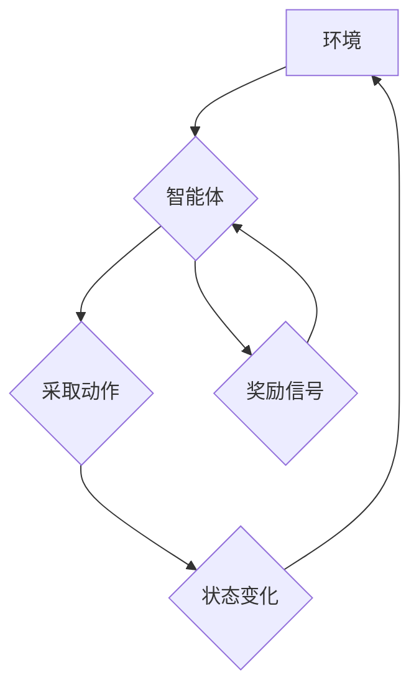

> 强化学习，自适应控制，深度强化学习，Q学习，SARSA，DDPG，代码实战，Python

## 1. 背景介绍

在现代智能系统领域，强化学习（Reinforcement Learning，RL）作为一种模仿人类学习的机器学习方法，近年来取得了显著进展，并在机器人控制、游戏 AI、自动驾驶等领域展现出强大的应用潜力。

传统的控制方法通常依赖于预先定义的规则和模型，而强化学习则通过试错学习，在环境与智能体交互的过程中不断优化策略，以最大化累积的奖励。这种自适应学习能力使其能够应对复杂、动态的环境，并实现更灵活、更智能的控制。

自适应控制则是指根据环境变化动态调整控制策略，以保证系统稳定性和性能。结合强化学习的优势，自适应控制能够实现更智能、更鲁棒的控制，适应不断变化的外部环境。

## 2. 核心概念与联系

**2.1 强化学习核心概念**

* **智能体 (Agent):** 与环境交互并采取行动的实体。
* **环境 (Environment):** 智能体所处的外部世界，会根据智能体的行动产生状态变化和奖励信号。
* **状态 (State):** 环境在特定时刻的描述。
* **动作 (Action):** 智能体在特定状态下可以采取的行动。
* **奖励 (Reward):** 环境对智能体采取的行动给予的反馈信号，可以是正向奖励或负向惩罚。
* **策略 (Policy):** 智能体在不同状态下选择动作的规则。

**2.2 自适应控制与强化学习的联系**

自适应控制的目标是根据环境变化动态调整控制策略，以保证系统稳定性和性能。强化学习的试错学习机制和策略优化能力使其成为实现自适应控制的理想工具。

通过强化学习，智能体可以从环境交互中学习到最优的控制策略，并根据环境变化不断更新策略，实现自适应控制。

**2.3  Mermaid 流程图**



## 3. 核心算法原理 & 具体操作步骤

### 3.1  算法原理概述

强化学习算法的核心是通过不断地与环境交互，学习一个能够最大化累积奖励的策略。常见的强化学习算法包括：

* **Q学习:** 基于价值函数的算法，学习每个状态-动作对的价值，选择价值最高的动作。
* **SARSA:** 与Q学习类似，但更新价值函数时使用当前状态和采取的动作，更注重在线学习。
* **DDPG:** 深度强化学习算法，使用深度神经网络来估计价值函数和策略，适用于连续动作空间。

### 3.2  算法步骤详解

以Q学习为例，其基本步骤如下：

1. 初始化Q表，每个状态-动作对的Q值都设置为0。
2. 在环境中进行交互，观察当前状态和采取的动作。
3. 根据环境反馈获得奖励信号。
4. 更新Q表，使用Bellman方程更新每个状态-动作对的Q值。
5. 重复步骤2-4，直到Q表收敛或达到预设的训练目标。

### 3.3  算法优缺点

**Q学习:**

* **优点:** 算法简单易懂，易于实现。
* **缺点:** 只能处理离散动作空间，学习效率较低。

**SARSA:**

* **优点:** 更注重在线学习，能够更好地应对动态环境。
* **缺点:** 仍然只能处理离散动作空间。

**DDPG:**

* **优点:** 可以处理连续动作空间，学习效率更高。
* **缺点:** 算法复杂度较高，需要更多的数据和计算资源。

### 3.4  算法应用领域

强化学习算法广泛应用于以下领域：

* **机器人控制:** 训练机器人完成复杂的任务，例如导航、抓取、运动控制等。
* **游戏 AI:** 开发更智能的游戏 AI，例如围棋、Go、策略游戏等。
* **自动驾驶:** 训练自动驾驶系统，使其能够安全、高效地驾驶车辆。
* **推荐系统:** 建立个性化的推荐系统，推荐用户感兴趣的内容。

## 4. 数学模型和公式 & 详细讲解 & 举例说明

### 4.1  数学模型构建

强化学习的核心是价值函数，它用来评估某个状态下采取某个动作的长期价值。

* **状态价值函数 (V(s)):** 在状态s下采取任何动作的期望累积奖励。
* **动作价值函数 (Q(s, a)):** 在状态s下采取动作a的期望累积奖励。

### 4.2  公式推导过程

**Bellman方程:**

$$
V(s) = \max_a Q(s, a)
$$

$$
Q(s, a) = R(s, a) + \gamma \max_{a'} Q(s', a')
$$

其中:

* $R(s, a)$ 是在状态s下采取动作a获得的即时奖励。
* $\gamma$ 是折扣因子，控制未来奖励的权重。
* $s'$ 是采取动作a后进入的下一个状态。

### 4.3  案例分析与讲解

假设一个机器人需要在迷宫中找到出口，每个状态代表机器人所在的位置，每个动作代表机器人可以向四个方向移动。

* **状态价值函数:**  表示机器人到达每个位置的期望累积奖励。
* **动作价值函数:** 表示机器人从每个位置采取每个动作的期望累积奖励。

通过Bellman方程，我们可以迭代更新状态价值函数和动作价值函数，最终找到通往出口的最优策略。

## 5. 项目实践：代码实例和详细解释说明

### 5.1  开发环境搭建

* Python 3.x
* TensorFlow 或 PyTorch
* OpenAI Gym

### 5.2  源代码详细实现

```python
import gym
import numpy as np

# 定义环境
env = gym.make('CartPole-v1')

# 定义学习参数
learning_rate = 0.1
discount_factor = 0.99
epsilon = 0.1

# 定义Q表
q_table = np.zeros((env.observation_space.n, env.action_space.n))

# 训练循环
for episode in range(1000):
    state = env.reset()
    done = False

    while not done:
        # 选择动作
        if np.random.uniform(0, 1) < epsilon:
            action = env.action_space.sample()
        else:
            action = np.argmax(q_table[state])

        # 执行动作
        next_state, reward, done, _ = env.step(action)

        # 更新Q表
        q_table[state, action] = (1 - learning_rate) * q_table[state, action] + learning_rate * (reward + discount_factor * np.max(q_table[next_state]))

        # 更新状态
        state = next_state

    print(f"Episode {episode+1} completed")

# 测试
state = env.reset()
while True:
    action = np.argmax(q_table[state])
    state, reward, done, _ = env.step(action)
    env.render()
    if done:
        break
env.close()
```

### 5.3  代码解读与分析

* 代码首先定义了环境和学习参数。
* 然后构建了一个Q表，用于存储每个状态-动作对的价值。
* 训练循环中，智能体从环境中获取状态和奖励，并根据Q表选择动作。
* 执行动作后，智能体更新Q表，使之更接近最优策略。
* 最后，代码测试了训练后的智能体，使其能够在环境中完成任务。

### 5.4  运行结果展示

运行代码后，智能体将在环境中学习并最终能够完成任务，例如在CartPole-v1环境中，智能体能够平衡杆子尽可能长时间。

## 6. 实际应用场景

### 6.1  机器人控制

强化学习可以用于训练机器人完成各种复杂的任务，例如导航、抓取、运动控制等。

* **导航:** 训练机器人自主导航到目标位置，避开障碍物。
* **抓取:** 训练机器人抓取特定物体，并将其放置到指定位置。
* **运动控制:** 训练机器人完成复杂运动，例如跳舞、打球等。

### 6.2  游戏 AI

强化学习可以用于开发更智能的游戏 AI，例如围棋、Go、策略游戏等。

* **围棋、Go:** 训练AI战胜人类棋手，例如AlphaGo、AlphaZero。
* **策略游戏:** 训练AI在策略游戏中取得胜利，例如StarCraft II。

### 6.3  自动驾驶

强化学习可以用于训练自动驾驶系统，使其能够安全、高效地驾驶车辆。

* **路径规划:** 训练自动驾驶系统规划最优路径，避开障碍物。
* **决策控制:** 训练自动驾驶系统做出安全、合理的驾驶决策。

### 6.4  未来应用展望

强化学习在未来将有更广泛的应用，例如：

* **医疗保健:** 训练AI辅助医生诊断疾病、制定治疗方案。
* **金融:** 训练AI进行风险管理、投资决策。
* **能源:** 训练AI优化能源使用、提高能源效率。

## 7. 工具和资源推荐

### 7.1  学习资源推荐

* **书籍:**
    * Reinforcement Learning: An Introduction by Richard S. Sutton and Andrew G. Barto
    * Deep Reinforcement Learning Hands-On by Maxim Lapan
* **在线课程:**
    * Coursera: Reinforcement Learning Specialization by David Silver
    * Udacity: Deep Reinforcement Learning Nanodegree

### 7.2  开发工具推荐

* **TensorFlow:** 深度学习框架，支持强化学习算法的实现。
* **PyTorch:** 深度学习框架，支持强化学习算法的实现。
* **OpenAI Gym:** 强化学习环境库，提供各种标准环境。

### 7.3  相关论文推荐

* Deep Q-Network (DQN)
* Proximal Policy Optimization (PPO)
* Deep Deterministic Policy Gradient (DDPG)

## 8. 总结：未来发展趋势与挑战

### 8.1  研究成果总结

近年来，强化学习取得了显著进展，在机器人控制、游戏 AI、自动驾驶等领域取得了突破性成果。

### 8.2  未来发展趋势

* **更强大的算法:** 开发更强大、更鲁棒的强化学习算法，能够解决更复杂的任务。
* **更丰富的环境:** 建立更丰富的、更真实的强化学习环境，能够更好地模拟现实世界。
* **更有效的训练方法:** 开发更有效的训练方法，能够加速强化学习算法的训练速度。

### 8.3  面临的挑战

* **样本效率:** 强化学习算法通常需要大量的样本数据进行训练，这在现实世界中可能难以实现。
* **可解释性:** 强化学习模型的决策过程往往难以解释，这可能导致模型的信任度降低。
* **安全性和可靠性:** 强化学习算法在安全性和可靠性方面仍有待提高，需要确保其在实际应用中能够安全可靠地工作。

### 8.4  研究展望

未来，强化学习将继续朝着更强大、更智能、更安全的方向发展，并在更多领域发挥重要作用。


## 9. 附录：常见问题与解答

**Q1: 强化学习和监督学习有什么区别？**

**A1:** 强化学习和监督学习都是机器学习的范式，但它们的目标和训练方式不同。

* **监督学习:** 使用标记数据训练模型，模型学习从输入到输出的映射关系。
* **强化学习:** 智能体与环境交互，通过试错学习，最终找到最优策略。

**Q2: 强化学习算法有哪些？**

**A2:** 常见的强化学习算法包括：

* **