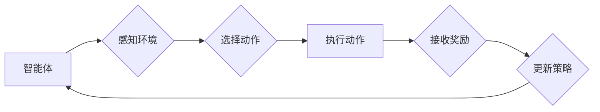

> 强化学习，强化学习算法，Q学习，SARSA，深度强化学习，强化学习应用

## 1. 背景介绍

在机器学习领域，强化学习 (Reinforcement Learning, RL) 作为一种独特的学习范式，近年来备受关注。与监督学习和无监督学习不同，强化学习的核心在于让智能体通过与环境的交互，学习最优的策略来最大化累积的奖励。

强化学习的应用场景广泛，涵盖游戏、机器人控制、推荐系统、自动驾驶等领域。其强大的泛化能力和适应性使其成为解决复杂决策问题的理想工具。

然而，强化学习算法的训练过程往往复杂且耗时，需要大量的样本数据和计算资源。优化算法在强化学习中扮演着至关重要的角色，它决定了学习速度、收敛性以及最终策略的性能。

## 2. 核心概念与联系

强化学习的核心概念包括：

* **智能体 (Agent):**  与环境交互并采取行动的学习主体。
* **环境 (Environment):** 智能体所处的外部世界，它会根据智能体的行动产生相应的状态变化和奖励信号。
* **状态 (State):** 环境的当前描述，它反映了环境的整体情况。
* **动作 (Action):** 智能体可以采取的行动，它会改变环境的状态。
* **奖励 (Reward):** 环境对智能体采取的行动的反馈，它可以是正向的或负向的，用于指导智能体的学习。
* **策略 (Policy):**  智能体在不同状态下采取行动的规则，它决定了智能体在不同情况下应该采取哪些行动。

**强化学习流程图:**



## 3. 核心算法原理 & 具体操作步骤

### 3.1  算法原理概述

Q学习是一种经典的强化学习算法，它通过学习一个Q表来估计在每个状态下采取每个动作的期望回报。Q表是一个表格，其中每个单元格存储了在特定状态下采取特定动作的期望回报。

Q学习的目标是找到一个最优的策略，使得智能体在与环境交互的过程中能够最大化累积的奖励。

### 3.2  算法步骤详解

1. **初始化Q表:** 将Q表中的所有单元格初始化为0或一个小的随机值。
2. **选择动作:** 根据当前状态和策略选择一个动作。
3. **执行动作:** 在环境中执行选择的动作。
4. **接收奖励:** 从环境接收奖励信号。
5. **更新Q值:** 根据Bellman方程更新Q表中的Q值:

 $$Q(s,a) = Q(s,a) + \alpha [r + \gamma \max_{a'} Q(s',a') - Q(s,a)]$$

其中:

* $Q(s,a)$ 是在状态 $s$ 下采取动作 $a$ 的期望回报。
* $\alpha$ 是学习率，控制着学习速度。
* $r$ 是从环境接收到的奖励。
* $\gamma$ 是折扣因子，控制着未来奖励的权重。
* $s'$ 是执行动作 $a$ 后进入的下一个状态。
* $a'$ 是在下一个状态 $s'$ 下采取的动作。

6. **重复步骤2-5:** 直到达到终止条件，例如达到最大迭代次数或策略收敛。

### 3.3  算法优缺点

**优点:**

* 算法简单易懂，易于实现。
* 可以应用于离散状态和动作空间的问题。

**缺点:**

* 随着状态和动作空间的增加，Q表的规模会指数级增长，导致存储和计算成本增加。
* 算法的收敛性依赖于学习率和折扣因子的选择。

### 3.4  算法应用领域

Q学习广泛应用于以下领域:

* **游戏:** 训练智能体玩游戏，例如围棋、Go、Atari游戏等。
* **机器人控制:** 训练机器人执行复杂的任务，例如导航、抓取、运动控制等。
* **推荐系统:** 建议用户感兴趣的内容，例如电影、音乐、商品等。
* **自动驾驶:** 训练自动驾驶汽车在复杂道路环境中行驶。

## 4. 数学模型和公式 & 详细讲解 & 举例说明

### 4.1  数学模型构建

强化学习的数学模型可以概括为一个马尔可夫决策过程 (Markov Decision Process, MDP)。

MDP由以下五个要素组成:

* **状态空间 S:** 所有可能的系统状态的集合。
* **动作空间 A:** 在每个状态下智能体可以采取的所有动作的集合。
* **转移概率 P(s',r|s,a):** 从状态 $s$ 执行动作 $a$ 后进入状态 $s'$ 的概率，以及同时获得奖励 $r$ 的概率。
* **奖励函数 R(s,a):** 在状态 $s$ 执行动作 $a$ 时获得的奖励。
* **折扣因子 γ:** 控制着未来奖励的权重，通常取值在0到1之间。

### 4.2  公式推导过程

强化学习的目标是找到一个最优策略 $\pi(s)$，使得智能体在与环境交互的过程中能够最大化累积的奖励。

最优策略可以由Bellman方程定义:

$$v_\pi(s) = \max_a \sum_{s',r} P(s',r|s,a) [R(s,a) + \gamma v_\pi(s')]$$

其中:

* $v_\pi(s)$ 是在策略 $\pi$ 下状态 $s$ 的价值函数。

### 4.3  案例分析与讲解

假设一个智能体在玩一个简单的游戏，游戏中有两种状态： "开始" 和 "结束"，两种动作： "前进" 和 "后退"。

* 从 "开始" 状态执行 "前进" 动作，进入 "结束" 状态，获得奖励 1。
* 从 "开始" 状态执行 "后退" 动作，回到 "开始" 状态，获得奖励 0。
* 从 "结束" 状态执行任何动作，都无法改变状态，获得奖励 0。

我们可以使用Bellman方程来计算最优策略的价值函数。

## 5. 项目实践：代码实例和详细解释说明

### 5.1  开发环境搭建

* Python 3.x
* TensorFlow 或 PyTorch

### 5.2  源代码详细实现

```python
import numpy as np

# 定义状态空间和动作空间
states = ['start', 'end']
actions = ['forward', 'backward']

# 定义奖励函数
rewards = {
    ('start', 'forward'): 1,
    ('start', 'backward'): 0,
    ('end', 'forward'): 0,
    ('end', 'backward'): 0,
}

# 定义Q表
q_table = np.zeros((len(states), len(actions)))

# 设置学习参数
alpha = 0.1
gamma = 0.9
episodes = 1000

# 训练Q学习算法
for episode in range(episodes):
    current_state = 'start'
    while current_state != 'end':
        # 选择动作
        action = np.argmax(q_table[states.index(current_state)])

        # 执行动作
        next_state, reward = None, None
        if current_state == 'start':
            if action == 0:  # forward
                next_state = 'end'
                reward = rewards[(current_state, action)]
            else:  # backward
                next_state = 'start'
                reward = rewards[(current_state, action)]
        else:
            next_state = current_state
            reward = rewards[(current_state, action)]

        # 更新Q值
        q_table[states.index(current_state), actions.index(action)] = q_table[states.index(current_state), actions.index(action)] + alpha * (reward + gamma * np.max(q_table[states.index(next_state)]) - q_table[states.index(current_state), actions.index(action)])

        current_state = next_state

# 打印Q表
print(q_table)
```

### 5.3  代码解读与分析

* 代码首先定义了状态空间、动作空间、奖励函数和Q表。
* 然后，使用循环迭代训练Q学习算法。
* 在每个迭代中，智能体从当前状态选择一个动作，执行动作并获得奖励和下一个状态。
* 根据Bellman方程更新Q表中的Q值。
* 训练完成后，打印Q表，可以看出每个状态下采取每个动作的期望回报。

### 5.4  运行结果展示

运行代码后，会输出一个Q表，其中每个单元格存储了在特定状态下采取特定动作的期望回报。

## 6. 实际应用场景

### 6.1  游戏

强化学习在游戏领域取得了显著的成果，例如AlphaGo、AlphaZero等程序在围棋、Go、西洋棋等游戏中战胜了世界冠军。

### 6.2  机器人控制

强化学习可以用于训练机器人执行复杂的任务，例如导航、抓取、运动控制等。

### 6.3  推荐系统

强化学习可以用于个性化推荐，例如推荐用户感兴趣的电影、音乐、商品等。

### 6.4  未来应用展望

强化学习在未来将有更广泛的应用，例如自动驾驶、医疗诊断、金融交易等领域。

## 7. 工具和资源推荐

### 7.1  学习资源推荐

* **书籍:**
    * Reinforcement Learning: An Introduction by Richard S. Sutton and Andrew G. Barto
    * Deep Reinforcement Learning Hands-On by Maxim Lapan
* **在线课程:**
    * Coursera: Reinforcement Learning Specialization by David Silver
    * Udacity: Deep Reinforcement Learning Nanodegree

### 7.2  开发工具推荐

* **TensorFlow:** Google开发的开源机器学习框架，支持强化学习算法的实现。
* **PyTorch:** Facebook开发的开源机器学习框架，也支持强化学习算法的实现。
* **OpenAI Gym:** 提供了多种强化学习环境，方便开发者测试和训练强化学习算法。

### 7.3  相关论文推荐

* **Deep Q-Network (DQN):** Mnih et al., 2015
* **Proximal Policy Optimization (PPO):** Schulman et al., 2017
* **Trust Region Policy Optimization (TRPO):** Schulman et al., 2015

## 8. 总结：未来发展趋势与挑战

### 8.1  研究成果总结

强化学习近年来取得了显著的进展，在游戏、机器人控制、推荐系统等领域取得了突破性成果。

### 8.2  未来发展趋势

* **深度强化学习:** 将深度神经网络与强化学习算法结合，提高算法的学习能力和泛化能力。
* **多智能体强化学习:** 研究多个智能体在同一个环境中交互学习的算法。
* **强化学习安全性和可解释性:** 研究强化学习算法的安全性和可解释性，使其能够在更复杂和安全的环境中应用。

### 8.3  面临的挑战

* **样本效率:** 强化学习算法通常需要大量的样本数据才能训练，这在现实世界中可能难以实现。
* **探索与利用的平衡:** 强化学习算法需要在探索新策略和利用已知策略之间找到平衡，这在某些情况下可能比较困难。
* **可解释性:** 强化学习算法的决策过程往往比较复杂，难以解释其决策背后的原因。

### 8.4  研究展望

未来，强化学习的研究将继续朝着更安全、更有效、更可解释的方向发展，并将在更多领域得到应用。

## 9. 附录：常见问题与解答

### 9.1  Q学习和SARSA的区别是什么？

Q学习和SARSA都是经典的强化学习算法，但它们在策略更新的方式上有所不同。

* Q学习是基于预测下一个状态的最佳动作来更新