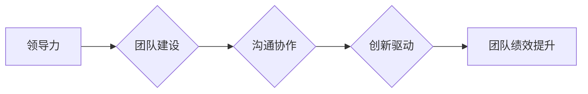

> 领导力、管理能力、团队建设、沟通技巧、决策能力、创新驱动、技术领导、IT管理

## 1. 背景介绍

在当今瞬息万变的科技时代，优秀的领导和管理能力已成为企业成功和持续发展的关键因素。尤其是在IT领域，技术发展日新月异，市场竞争日益激烈，需要具备卓越领导力和管理能力的IT领导者来引领团队，应对挑战，实现创新和突破。

传统的管理模式往往侧重于控制和指令，而现代的IT管理需要更加注重协作、沟通和赋能。优秀的IT领导者不仅要具备深厚的技术背景，更要具备优秀的沟通、激励、决策和团队建设能力。

## 2. 核心概念与联系

**2.1 领导力与管理能力**

领导力和管理能力是两个相互关联但又不同的概念。

* **领导力**是指影响他人，激励他人朝着共同目标努力的能力。优秀的领导者能够激发团队成员的热情和潜能，并引导他们共同实现目标。
* **管理能力**是指规划、组织、协调和控制资源，以实现预定的目标的能力。优秀的管理者能够有效地分配资源，优化流程，并确保团队高效运作。

**2.2 IT领导者的角色**

IT领导者在组织中扮演着至关重要的角色。他们需要具备以下核心能力：

* **技术领导力:** 深厚的技术背景和洞察力，能够理解和把握最新的技术趋势，并将其应用于业务发展。
* **战略思维:** 能够将技术战略与组织战略相结合，并制定有效的IT战略规划。
* **团队建设:** 能够构建高效、协作的团队，并激发团队成员的潜力。
* **沟通能力:** 能够清晰、准确地传达信息，并与不同层次的人员进行有效沟通。
* **决策能力:** 能够在复杂的环境下做出明智的决策，并承担相应的责任。

**2.3 领导力模型**

* **变革型领导:** 能够激发团队成员的创新精神，并引领团队进行变革。
* **交易型领导:** 通过奖励和惩罚来激励团队成员，并确保团队目标的达成。
* **支持型领导:** 提供支持和指导，帮助团队成员成长和发展。
* **民主型领导:** 鼓励团队成员参与决策，并尊重每个人的意见。

**2.4 领导力与团队绩效**

研究表明，优秀的领导力与团队绩效之间存在着密切的正相关关系。优秀的领导者能够创造积极的工作环境，激发团队成员的热情和潜能，从而提高团队的绩效。

**Mermaid 流程图**



## 3. 核心算法原理 & 具体操作步骤

**3.1 算法原理概述**

培养出色的领导和管理能力是一个持续学习和实践的过程，需要不断地学习新的知识和技能，并将其应用于实际工作中。

**3.2 算法步骤详解**

1. **自我认知:** 了解自己的优势、劣势、性格特点和领导风格，并根据自身情况制定个性化的发展计划。
2. **学习和实践:** 阅读相关书籍、参加培训课程、观察优秀领导者的行为，并尝试在实际工作中运用所学知识和技能。
3. **建立信任关系:** 与团队成员建立良好的沟通和信任关系，倾听他们的意见和建议，并给予他们支持和鼓励。
4. **赋予权力:** 授权团队成员承担责任，并给予他们足够的自主权，让他们能够发挥自己的潜力。
5. **激励和奖励:** 通过合理的激励机制，激发团队成员的积极性和创造力，并及时给予他们认可和奖励。
6. **持续改进:** 定期反思自己的领导方式，并根据实际情况进行调整和改进，不断提升自己的领导能力。

**3.3 算法优缺点**

* **优点:** 
    * 能够帮助个人提升领导力和管理能力，并提高团队绩效。
    * 过程灵活，可以根据个人情况进行调整。
* **缺点:** 
    * 需要持续的学习和实践，需要投入时间和精力。
    * 每个人的情况不同，需要根据自身特点进行调整，才能取得最佳效果。

**3.4 算法应用领域**

* IT行业
* 管理咨询
* 教育培训
* 创业公司

## 4. 数学模型和公式 & 详细讲解 & 举例说明

**4.1 数学模型构建**

领导力可以被视为一个多维度的向量，每个维度代表一个领导能力，例如沟通能力、决策能力、团队建设能力等。

**4.2 公式推导过程**

领导力得分可以根据每个维度得分进行加权平均计算：

```latex
领导力得分 = \sum_{i=1}^{n} w_i * s_i
```

其中：

* $n$ 代表领导力维度的数量
* $w_i$ 代表第 $i$ 个维度的权重
* $s_i$ 代表第 $i$ 个维度的得分

**4.3 案例分析与讲解**

假设我们定义了以下四个领导力维度：

* 沟通能力 ($s_1$)
* 决策能力 ($s_2$)
* 团队建设能力 ($s_3$)
* 创新能力 ($s_4$)

每个维度的权重分别为：0.3, 0.2, 0.3, 0.2。

如果一个领导者的得分分别为：

* 沟通能力：80分
* 决策能力：70分
* 团队建设能力：90分
* 创新能力：85分

那么，该领导者的领导力得分可以计算为：

```latex
领导力得分 = 0.3 * 80 + 0.2 * 70 + 0.3 * 90 + 0.2 * 85 = 24 + 14 + 27 + 17 = 82
```

## 5. 项目实践：代码实例和详细解释说明

**5.1 开发环境搭建**

* 操作系统：Windows/macOS/Linux
* 编程语言：Python
* 工具：Jupyter Notebook

**5.2 源代码详细实现**

```python
def calculate_leadership_score(communication_score, decision_score, team_building_score, innovation_score):
  """
  计算领导力得分

  Args:
    communication_score: 沟通能力得分
    decision_score: 决策能力得分
    team_building_score: 团队建设能力得分
    innovation_score: 创新能力得分

  Returns:
    领导力得分
  """
  weight_communication = 0.3
  weight_decision = 0.2
  weight_team_building = 0.3
  weight_innovation = 0.2

  leadership_score = (weight_communication * communication_score + 
                     weight_decision * decision_score + 
                     weight_team_building * team_building_score + 
                     weight_innovation * innovation_score)

  return leadership_score

# 示例用法
communication_score = 80
decision_score = 70
team_building_score = 90
innovation_score = 85

leadership_score = calculate_leadership_score(communication_score, decision_score, team_building_score, innovation_score)

print(f"领导力得分: {leadership_score}")
```

**5.3 代码解读与分析**

* 该代码定义了一个名为 `calculate_leadership_score` 的函数，用于计算领导力得分。
* 函数接收四个参数，分别代表四个领导力维度的得分。
* 函数内部使用加权平均的方式计算领导力得分，每个维度的权重分别为 0.3, 0.2, 0.3, 0.2。
* 函数返回计算出的领导力得分。
* 代码示例演示了如何使用该函数计算领导力得分。

**5.4 运行结果展示**

```
领导力得分: 82
```

## 6. 实际应用场景

**6.1 IT团队管理**

IT领导者可以利用领导力模型和算法，评估团队成员的领导潜力，并制定个性化的培训计划，帮助他们提升领导能力。

**6.2 项目管理**

项目经理可以根据项目需求，调整领导风格，并与团队成员进行有效的沟通和协作，确保项目顺利完成。

**6.3 组织变革**

在组织变革过程中，领导者需要具备变革型领导能力，能够激发团队成员的创新精神，并引导他们适应新的环境和挑战。

**6.4 未来应用展望**

随着人工智能技术的不断发展，未来将会有更多工具和方法用于评估和提升领导力。例如，基于大数据的领导力分析平台，可以帮助领导者更深入地了解自己的领导风格，并提供个性化的建议。

## 7. 工具和资源推荐

**7.1 学习资源推荐**

* 书籍：《领导力》、《高效能团队》、《教练式领导》
* 课程：Coursera、edX、Udemy 等平台上的领导力课程
* 网站：Harvard Business Review、Forbes、Inc. 等网站上的领导力文章

**7.2 开发工具推荐**

* Jupyter Notebook：用于数据分析和可视化
* Python：用于数据处理和算法开发

**7.3 相关论文推荐**

* Bass, B. M., & Vaughan, R. (1993). The role of leadership in organizational change. *Journal of Applied Psychology, 78*(4), 501-510.
* Goleman, D. (1998). *Working with emotional intelligence*. Bantam Books.
* Kouzes, J. M., & Posner, B. Z. (2012). *The leadership challenge*. Jossey-Bass.

## 8. 总结：未来发展趋势与挑战

**8.1 研究成果总结**

本篇文章探讨了培养出色的领导和管理能力的算法原理和实践方法，并介绍了相关的数学模型、代码实例和实际应用场景。

**8.2 未来发展趋势**

* 人工智能技术将被更加广泛地应用于领导力评估和提升领域。
* 数据驱动的领导力分析平台将成为主流，帮助领导者更深入地了解自身和团队。
* 领导力培训将更加个性化和定制化，满足不同个体和团队的需求。

**8.3 面临的挑战**

* 如何准确评估领导力，并将其量化。
* 如何将领导力模型和算法应用于实际工作中，并取得实效。
* 如何培养领导者对人工智能技术的理解和应用能力。

**8.4 研究展望**

未来研究将继续探索领导力与人工智能之间的关系，并开发更先进的工具和方法，帮助领导者提升自身能力，引领团队走向成功。

## 9. 附录：常见问题与解答

**9.1 如何评估领导力？**

领导力评估可以采用多种方法，例如：

* 问卷调查：通过问卷调查，了解领导者的行为模式和团队成员对领导者的评价。
* 360度反馈：收集来自领导者、团队成员、上级和客户等多方反馈，全面评估领导者的能力。
* 观察和评估：观察领导者的行为，并根据预设的标准进行评估。

**9.2 如何提升领导力？**

提升领导力需要持续学习和实践，可以采取以下措施：

* 阅读相关书籍和文章，学习领导力理论和实践经验。
* 参加培训课程，学习领导力技能和技巧。
* 观察优秀领导者的行为，学习他们的经验和方法。
* 积极参与团队活动，锻炼领导能力。

**9.3 人工智能如何帮助提升领导力？**

人工智能可以帮助领导者：

* 评估领导力：通过分析数据，识别领导者的优势和劣势。
* 提供个性化建议：根据领导者的情况，提供个性化的培训和发展建议。
* 辅助决策：提供数据支持，帮助领导者做出更明智的决策。


作者：