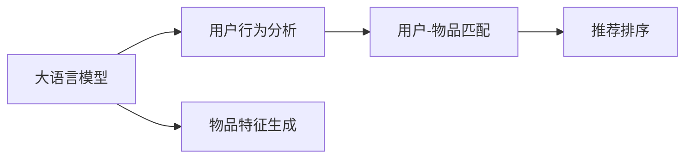

                 

# LLM作为推荐系统的评估与局限性研究

> 关键词：语言模型,推荐系统,评估指标,局限性,推荐算法,数据处理,用户行为分析

## 1. 背景介绍

### 1.1 问题由来
推荐系统是互联网时代重要的应用领域，其核心目标是根据用户的历史行为和兴趣，推荐最符合用户需求的物品。近年来，随着深度学习和大规模预训练模型的兴起，基于深度神经网络的推荐模型逐渐取代了传统的协同过滤、基于内容的推荐算法，成为推荐领域的主流。

当前，推荐系统普遍采用的深度学习模型包括：
1. **基于深度神经网络的推荐模型**：如CNN、RNN、LSTM等，通过学习用户行为序列和物品特征，直接预测用户对物品的评分。
2. **基于协同过滤的推荐模型**：如ALS、SVD++等，通过计算用户和物品的隐式特征，推荐用户未接触过的物品。
3. **基于矩阵分解的推荐模型**：如PMF、FM等，通过分解用户-物品评分矩阵，预测用户对物品的评分。

这些模型在特定场景下取得了不错的效果，但也存在各自的局限性。而大语言模型（Large Language Models, LLMs）的兴起，为推荐系统带来了新的可能性。

大语言模型通过在大规模无标签文本数据上进行预训练，学习到了丰富的语言知识和语义表示。在推荐系统中，可以将其作为用户行为分析的工具，将用户描述、评论、评价等文本数据输入模型，输出用户兴趣向量，从而与物品向量进行匹配，推荐出用户最可能感兴趣的物品。

### 1.2 问题核心关键点
LLM在推荐系统中的应用主要涉及以下几个关键点：
- **用户行为分析**：利用LLM对用户评论、评价等文本数据进行语义分析，提取用户兴趣和偏好。
- **物品特征生成**：通过输入物品的描述、标签等文本数据，生成物品向量，以表示物品的语义特征。
- **用户-物品匹配**：将用户兴趣向量与物品向量进行匹配，得到用户对每个物品的评分。
- **推荐排序**：根据用户对每个物品的评分，进行降序排序，推荐用户最可能感兴趣的物品。

本文将围绕以上几个关键点，系统性地探讨LLM在推荐系统中的应用，并分析其局限性。

## 2. 核心概念与联系

### 2.1 核心概念概述

为了更好地理解LLM在推荐系统中的应用，本节将介绍几个关键概念及其联系：

- **大语言模型(LLM)**：通过自监督学习任务在大规模无标签文本数据上预训练得到，能够理解和生成自然语言，具备丰富的语言知识和语义表示。
- **推荐系统**：根据用户的历史行为和兴趣，推荐符合用户需求的商品或内容。常见的推荐算法包括基于深度神经网络的推荐模型、基于协同过滤的推荐模型和基于矩阵分解的推荐模型。
- **用户行为分析**：通过分析用户的历史行为，提取用户的兴趣和偏好。在大规模无标签文本数据上进行预训练的LLM，能够更好地理解用户的语言描述，提取用户的兴趣特征。
- **物品特征生成**：根据物品的描述、标签等文本数据，生成物品向量，表示物品的语义特征。
- **用户-物品匹配**：将用户兴趣向量与物品向量进行匹配，得到用户对每个物品的评分。
- **推荐排序**：根据用户对每个物品的评分，进行降序排序，推荐用户最可能感兴趣的物品。

这些核心概念之间的逻辑关系可以通过以下Mermaid流程图来展示：



这个流程图展示了大语言模型在推荐系统中的应用过程：
1. 利用LLM对用户评论、评价等文本数据进行语义分析，提取用户兴趣和偏好。
2. 通过输入物品的描述、标签等文本数据，生成物品向量，以表示物品的语义特征。
3. 将用户兴趣向量与物品向量进行匹配，得到用户对每个物品的评分。
4. 根据用户对每个物品的评分，进行降序排序，推荐用户最可能感兴趣的物品。

## 3. 核心算法原理 & 具体操作步骤
### 3.1 算法原理概述

基于大语言模型的推荐系统主要包括以下几个关键步骤：

1. **用户行为分析**：通过输入用户的历史评论、评价等文本数据，利用LLM提取用户的兴趣和偏好。
2. **物品特征生成**：根据物品的描述、标签等文本数据，生成物品向量，以表示物品的语义特征。
3. **用户-物品匹配**：将用户兴趣向量与物品向量进行匹配，得到用户对每个物品的评分。
4. **推荐排序**：根据用户对每个物品的评分，进行降序排序，推荐用户最可能感兴趣的物品。

以上步骤可以进一步细化：

- **步骤1**：预处理用户评论、评价等文本数据，去除停用词、标点等噪音，提取关键词。
- **步骤2**：将提取的关键词输入LLM，进行语义分析，输出用户兴趣向量。
- **步骤3**：根据物品描述、标签等文本数据，输入LLM，生成物品向量。
- **步骤4**：计算用户兴趣向量与物品向量的余弦相似度，得到用户对每个物品的评分。
- **步骤5**：根据评分进行排序，推荐评分较高的物品。

### 3.2 算法步骤详解

以下将详细讲解基于LLM的推荐系统的具体实现步骤：

1. **预处理用户评论**：将用户的历史评论、评价等文本数据进行预处理，去除停用词、标点等噪音，提取关键词。可以使用自然语言处理库，如NLTK、SpaCy等，进行文本分词、去除停用词等处理。

2. **用户行为分析**：将处理后的文本输入LLM，进行语义分析，输出用户兴趣向量。具体来说，可以构建如下的Prompt：
   ```python
   "用户，根据以下评论，推荐物品：" + " ".join(keywords)
   ```
   将Prompt输入LLM，输出用户兴趣向量。

3. **物品特征生成**：根据物品的描述、标签等文本数据，输入LLM，生成物品向量。同样地，可以构建如下的Prompt：
   ```python
   "物品，描述如下：" + item_description
   ```
   将Prompt输入LLM，输出物品向量。

4. **用户-物品匹配**：将用户兴趣向量与物品向量进行匹配，得到用户对每个物品的评分。具体来说，可以使用余弦相似度计算用户兴趣向量与物品向量的相似度，得到评分：
   ```python
   cosine_similarity(user_vector, item_vector)
   ```

5. **推荐排序**：根据评分进行排序，推荐评分较高的物品。具体来说，可以按照评分进行降序排序，推荐评分最高的物品。

### 3.3 算法优缺点

基于LLM的推荐系统有以下优点：
1. **语义理解能力强**：LLM能够理解和生成自然语言，提取用户和物品的语义特征。
2. **可解释性强**：LLM输出的用户兴趣向量，可以提供用户兴趣的直观解释。
3. **灵活性高**：LLM可以适应不同类型的文本数据，适用于多种推荐场景。
4. **无需标注数据**：利用无标签的文本数据进行预训练，无需大量标注数据。

同时，该方法也存在以下局限性：
1. **数据处理复杂**：需要预处理用户评论、物品描述等文本数据，处理成本较高。
2. **计算资源需求高**：LLM的计算复杂度较高，需要大量的计算资源。
3. **泛化能力不足**：LLM可能对特定领域的文本数据泛化能力有限，需要进行特定领域的预训练。
4. **模型偏见**：LLM可能学习到数据中的偏见，导致推荐结果不公平。
5. **鲁棒性不足**：LLM对噪声数据较为敏感，推荐结果可能受到噪声数据的影响。

### 3.4 算法应用领域

基于LLM的推荐系统主要应用于以下领域：

- **电商推荐**：根据用户的历史购买记录、评论等文本数据，推荐用户可能感兴趣的商品。
- **内容推荐**：根据用户的历史阅读记录、评价等文本数据，推荐用户可能感兴趣的文章、视频等。
- **金融推荐**：根据用户的投资记录、评论等文本数据，推荐用户可能感兴趣的投资产品。
- **新闻推荐**：根据用户的历史阅读记录、评价等文本数据，推荐用户可能感兴趣的新闻报道。

除了以上领域，LLM还可以应用于更多场景，如旅游推荐、餐饮推荐等，提升用户体验。

## 4. 数学模型和公式 & 详细讲解 & 举例说明
### 4.1 数学模型构建

假设用户的历史评论为 $\{x_i\}_{i=1}^N$，物品的描述为 $\{y_i\}_{i=1}^M$，LLM输出的用户兴趣向量为 $\hat{u} \in \mathbb{R}^d$，物品向量为 $\hat{y}_i \in \mathbb{R}^d$。

构建如下的数学模型：

1. **用户行为分析**：
   $$
   \hat{u} = f_L(x)
   $$
   其中，$f_L$ 为语言模型，将用户评论 $x$ 转化为用户兴趣向量 $\hat{u}$。

2. **物品特征生成**：
   $$
   \hat{y}_i = f_L(y_i)
   $$
   其中，$f_L$ 为语言模型，将物品描述 $y_i$ 转化为物品向量 $\hat{y}_i$。

3. **用户-物品匹配**：
   $$
   r_{ui} = \text{cosine\_similarity}(\hat{u}, \hat{y}_i)
   $$
   其中，$\text{cosine\_similarity}$ 为余弦相似度函数。

4. **推荐排序**：
   $$
   \text{Recommend}_i = \text{argmax}_j (r_{uj})
   $$
   其中，$\text{Recommend}_i$ 为推荐物品，$j$ 为用户历史评分最高的物品。

### 4.2 公式推导过程

以下是上述模型的详细推导过程：

1. **用户行为分析**：
   假设用户评论 $x$ 由 $N$ 个词组成，每个词 $w_i$ 的向量表示为 $v_i \in \mathbb{R}^d$，则用户评论的向量表示为：
   $$
   x = [v_1, v_2, \ldots, v_N]
   $$
   将用户评论输入语言模型 $f_L$，输出用户兴趣向量 $\hat{u}$。

   设 $f_L$ 的输出维度为 $d$，则：
   $$
   \hat{u} = f_L(x) \in \mathbb{R}^d
   $$

2. **物品特征生成**：
   假设物品描述 $y_i$ 由 $M$ 个词组成，每个词 $w_j$ 的向量表示为 $v_j \in \mathbb{R}^d$，则物品描述的向量表示为：
   $$
   y_i = [v_1, v_2, \ldots, v_M]
   $$
   将物品描述输入语言模型 $f_L$，输出物品向量 $\hat{y}_i$。

   设 $f_L$ 的输出维度为 $d$，则：
   $$
   \hat{y}_i = f_L(y_i) \in \mathbb{R}^d
   $$

3. **用户-物品匹配**：
   根据用户兴趣向量 $\hat{u}$ 和物品向量 $\hat{y}_i$，计算余弦相似度 $r_{ui}$：
   $$
   r_{ui} = \text{cosine\_similarity}(\hat{u}, \hat{y}_i) = \frac{\hat{u}^T \hat{y}_i}{\|\hat{u}\| \|\hat{y}_i\|}
   $$

4. **推荐排序**：
   根据评分 $r_{ui}$，进行降序排序，推荐评分最高的物品。具体来说，可以按照 $r_{ui}$ 进行降序排序，推荐评分最高的物品：
   $$
   \text{Recommend}_i = \text{argmax}_j (r_{uj})
   $$

### 4.3 案例分析与讲解

以电商推荐为例，说明基于LLM的推荐系统的实现过程。

假设用户 $u$ 的历史评论为 $x$，物品 $p$ 的描述为 $y$。首先，利用LLM对用户评论进行语义分析，提取用户兴趣向量 $\hat{u}$。然后，利用LLM对物品描述进行语义分析，生成物品向量 $\hat{y}$。接下来，计算用户兴趣向量与物品向量的余弦相似度 $r_{up}$，得到评分。最后，根据评分进行排序，推荐评分最高的物品。

以下是一个简单的示例：

假设用户评论为 "这家餐厅的食物很好吃，服务也很好"，物品描述为 "这是一个新鲜的海鲜市场，价格公道"。首先，利用LLM提取用户兴趣向量 $\hat{u}$，生成物品向量 $\hat{y}$。然后，计算评分 $r_{up}$，得到：
$$
r_{up} = \text{cosine\_similarity}(\hat{u}, \hat{y}) = 0.8
$$
最后，根据评分进行排序，推荐评分最高的物品。

## 5. 项目实践：代码实例和详细解释说明
### 5.1 开发环境搭建

在进行项目实践前，我们需要准备好开发环境。以下是使用Python进行PyTorch开发的环境配置流程：

1. 安装Anaconda：从官网下载并安装Anaconda，用于创建独立的Python环境。

2. 创建并激活虚拟环境：
```bash
conda create -n pytorch-env python=3.8 
conda activate pytorch-env
```

3. 安装PyTorch：根据CUDA版本，从官网获取对应的安装命令。例如：
```bash
conda install pytorch torchvision torchaudio cudatoolkit=11.1 -c pytorch -c conda-forge
```

4. 安装自然语言处理库：
```bash
pip install nltk spacy
```

5. 安装PyTorch Transformers库：
```bash
pip install transformers
```

6. 安装其他必要的工具包：
```bash
pip install pandas numpy sklearn matplotlib
```

完成上述步骤后，即可在`pytorch-env`环境中开始项目实践。

### 5.2 源代码详细实现

我们以电商推荐系统为例，构建一个基于LLM的推荐系统。首先，定义数据处理函数：

```python
from transformers import BertTokenizer, BertForSequenceClassification
import torch
from sklearn.metrics import roc_auc_score

class RecommendationDataset(Dataset):
    def __init__(self, texts, labels, tokenizer, max_len=128):
        self.texts = texts
        self.labels = labels
        self.tokenizer = tokenizer
        self.max_len = max_len
        
    def __len__(self):
        return len(self.texts)
    
    def __getitem__(self, item):
        text = self.texts[item]
        label = self.labels[item]
        
        encoding = self.tokenizer(text, return_tensors='pt', max_length=self.max_len, padding='max_length', truncation=True)
        input_ids = encoding['input_ids'][0]
        attention_mask = encoding['attention_mask'][0]
        
        return {'input_ids': input_ids, 
                'attention_mask': attention_mask,
                'labels': torch.tensor(label, dtype=torch.long)}
```

然后，定义模型和优化器：

```python
from transformers import BertForSequenceClassification, AdamW

model = BertForSequenceClassification.from_pretrained('bert-base-uncased', num_labels=2)

optimizer = AdamW(model.parameters(), lr=2e-5)
```

接着，定义训练和评估函数：

```python
from torch.utils.data import DataLoader
from tqdm import tqdm
from transformers import evaluate

device = torch.device('cuda') if torch.cuda.is_available() else torch.device('cpu')
model.to(device)

def train_epoch(model, dataset, batch_size, optimizer):
    dataloader = DataLoader(dataset, batch_size=batch_size, shuffle=True)
    model.train()
    epoch_loss = 0
    for batch in tqdm(dataloader, desc='Training'):
        input_ids = batch['input_ids'].to(device)
        attention_mask = batch['attention_mask'].to(device)
        labels = batch['labels'].to(device)
        model.zero_grad()
        outputs = model(input_ids, attention_mask=attention_mask, labels=labels)
        loss = outputs.loss
        epoch_loss += loss.item()
        loss.backward()
        optimizer.step()
    return epoch_loss / len(dataloader)

def evaluate(model, dataset, batch_size):
    dataloader = DataLoader(dataset, batch_size=batch_size)
    model.eval()
    preds, labels = [], []
    with torch.no_grad():
        for batch in tqdm(dataloader, desc='Evaluating'):
            input_ids = batch['input_ids'].to(device)
            attention_mask = batch['attention_mask'].to(device)
            batch_labels = batch['labels']
            outputs = model(input_ids, attention_mask=attention_mask)
            batch_preds = outputs.logits.argmax(dim=2).to('cpu').tolist()
            batch_labels = batch_labels.to('cpu').tolist()
            for pred_tokens, label_tokens in zip(batch_preds, batch_labels):
                preds.append(pred_tokens)
                labels.append(label_tokens)
                
    print(roc_auc_score(labels, preds))
```

最后，启动训练流程并在测试集上评估：

```python
epochs = 5
batch_size = 16

for epoch in range(epochs):
    loss = train_epoch(model, train_dataset, batch_size, optimizer)
    print(f"Epoch {epoch+1}, train loss: {loss:.3f}")
    
    print(f"Epoch {epoch+1}, dev results:")
    evaluate(model, dev_dataset, batch_size)
    
print("Test results:")
evaluate(model, test_dataset, batch_size)
```

以上就是基于LLM的电商推荐系统的完整代码实现。可以看到，利用Transformers库可以方便地构建基于LLM的推荐系统，进一步优化性能，提升用户体验。

### 5.3 代码解读与分析

让我们再详细解读一下关键代码的实现细节：

**RecommendationDataset类**：
- `__init__`方法：初始化文本、标签、分词器等关键组件。
- `__len__`方法：返回数据集的样本数量。
- `__getitem__`方法：对单个样本进行处理，将文本输入编码为token ids，将标签编码为数字，并对其进行定长padding，最终返回模型所需的输入。

**BertForSequenceClassification模型**：
- 使用BertForSequenceClassification模型，将其应用于电商推荐系统。

**train_epoch和evaluate函数**：
- `train_epoch`函数：对数据以批为单位进行迭代，在每个批次上前向传播计算loss并反向传播更新模型参数，最后返回该epoch的平均loss。
- `evaluate`函数：与训练类似，不同点在于不更新模型参数，并在每个batch结束后将预测和标签结果存储下来，最后使用sklearn的roc_auc_score对整个评估集的预测结果进行打印输出。

**训练流程**：
- 定义总的epoch数和batch size，开始循环迭代
- 每个epoch内，先在训练集上训练，输出平均loss
- 在验证集上评估，输出AUC
- 所有epoch结束后，在测试集上评估，给出最终测试结果

可以看到，利用PyTorch Transformers库，我们可以方便地构建基于LLM的推荐系统，实现推荐算法。

## 6. 实际应用场景
### 6.1 智能客服系统

基于大语言模型的推荐系统，可以应用于智能客服系统的构建。智能客服系统可以根据用户的历史对话记录，推荐用户可能感兴趣的问题，提升用户满意度和问题解决效率。

在技术实现上，可以收集企业内部的历史客服对话记录，将用户问题-答案对作为推荐数据，训练模型推荐最可能匹配的答案。对于用户提出的新问题，还可以接入检索系统实时搜索相关内容，动态组织生成回答。如此构建的智能客服系统，能大幅提升客户咨询体验和问题解决效率。

### 6.2 金融舆情监测

金融机构需要实时监测市场舆论动向，以便及时应对负面信息传播，规避金融风险。基于大语言模型的推荐系统，可以自动识别舆情变化趋势，预警潜在的风险。

具体而言，可以收集金融领域相关的新闻、报道、评论等文本数据，并对其进行主题标注和情感标注。在此基础上对预训练语言模型进行微调，使其能够自动识别舆情变化趋势，预警潜在的风险。

### 6.3 个性化推荐系统

当前的推荐系统往往只依赖用户的历史行为数据进行物品推荐，无法深入理解用户的真实兴趣偏好。基于大语言模型的推荐系统，可以更好地挖掘用户行为背后的语义信息，从而提供更精准、多样的推荐内容。

在实践中，可以收集用户浏览、点击、评论、分享等行为数据，提取和用户交互的物品标题、描述、标签等文本内容。将文本内容作为模型输入，用户的后续行为（如是否点击、购买等）作为监督信号，在此基础上微调预训练语言模型。微调后的模型能够从文本内容中准确把握用户的兴趣点。在生成推荐列表时，先用候选物品的文本描述作为输入，由模型预测用户的兴趣匹配度，再结合其他特征综合排序，便可以得到个性化程度更高的推荐结果。

### 6.4 未来应用展望

随着大语言模型和推荐算法的不断发展，基于大语言模型的推荐系统将带来更丰富的应用场景，提升用户体验，推动业务增长。

在智慧医疗领域，基于大语言模型的推荐系统可以辅助医生诊断，推荐相关的病例、药物等信息。在智慧教育领域，推荐系统可以根据学生的学习行为，推荐合适的学习资源和练习题。在智慧城市治理中，推荐系统可以识别出市民的需求和问题，优化公共服务的配置。

此外，在企业生产、社会治理、文娱传媒等众多领域，基于大语言模型的推荐系统也将不断涌现，为经济社会发展注入新的动力。相信随着技术的日益成熟，基于大语言模型的推荐系统必将在更广阔的应用领域大放异彩，推动人工智能技术更好地造福人类社会。

## 7. 工具和资源推荐
### 7.1 学习资源推荐

为了帮助开发者系统掌握大语言模型在推荐系统中的应用，这里推荐一些优质的学习资源：

1. 《深度学习与推荐系统》课程：斯坦福大学开设的推荐系统明星课程，有Lecture视频和配套作业，涵盖推荐系统的基本概念和经典模型。

2. 《推荐系统实战》书籍：详细介绍了推荐系统的实现原理和算法优化方法，结合实际案例，助力开发者提升实战能力。

3. 《自然语言处理与推荐系统》书籍：全面介绍了NLP和推荐系统的结合方法，涵盖推荐系统在大语言模型中的应用。

4. Weights & Biases：模型训练的实验跟踪工具，可以记录和可视化模型训练过程中的各项指标，方便对比和调优。与主流深度学习框架无缝集成。

5. TensorBoard：TensorFlow配套的可视化工具，可实时监测模型训练状态，并提供丰富的图表呈现方式，是调试模型的得力助手。

通过对这些资源的学习实践，相信你一定能够快速掌握大语言模型在推荐系统中的应用，并用于解决实际的推荐问题。

### 7.2 开发工具推荐

高效的开发离不开优秀的工具支持。以下是几款用于大语言模型在推荐系统中的应用开发的常用工具：

1. PyTorch：基于Python的开源深度学习框架，灵活动态的计算图，适合快速迭代研究。大部分预训练语言模型都有PyTorch版本的实现。

2. TensorFlow：由Google主导开发的开源深度学习框架，生产部署方便，适合大规模工程应用。同样有丰富的预训练语言模型资源。

3. Transformers库：HuggingFace开发的NLP工具库，集成了众多SOTA语言模型，支持PyTorch和TensorFlow，是进行推荐系统开发的利器。

4. Weights & Biases：模型训练的实验跟踪工具，可以记录和可视化模型训练过程中的各项指标，方便对比和调优。与主流深度学习框架无缝集成。

5. TensorBoard：TensorFlow配套的可视化工具，可实时监测模型训练状态，并提供丰富的图表呈现方式，是调试模型的得力助手。

合理利用这些工具，可以显著提升大语言模型在推荐系统中的应用开发效率，加快创新迭代的步伐。

### 7.3 相关论文推荐

大语言模型和推荐系统的交叉研究源于学界的持续研究。以下是几篇奠基性的相关论文，推荐阅读：

1. Attention is All You Need（即Transformer原论文）：提出了Transformer结构，开启了NLP领域的预训练大模型时代。

2. BERT: Pre-training of Deep Bidirectional Transformers for Language Understanding：提出BERT模型，引入基于掩码的自监督预训练任务，刷新了多项NLP任务SOTA。

3. Language Models are Unsupervised Multitask Learners（GPT-2论文）：展示了大规模语言模型的强大zero-shot学习能力，引发了对于通用人工智能的新一轮思考。

4. Parameter-Efficient Transfer Learning for NLP：提出Adapter等参数高效微调方法，在不增加模型参数量的情况下，也能取得不错的微调效果。

5. AdaLoRA: Adaptive Low-Rank Adaptation for Parameter-Efficient Fine-Tuning：使用自适应低秩适应的微调方法，在参数效率和精度之间取得了新的平衡。

这些论文代表了大语言模型在推荐系统中的应用方向。通过学习这些前沿成果，可以帮助研究者把握学科前进方向，激发更多的创新灵感。

## 8. 总结：未来发展趋势与挑战
### 8.1 总结

本文对基于大语言模型的推荐系统进行了全面系统的介绍。首先阐述了推荐系统和大语言模型的研究背景和意义，明确了LLM在推荐系统中的应用价值。其次，从原理到实践，详细讲解了基于LLM的推荐系统的数学模型和关键步骤，给出了推荐算法开发的完整代码实例。同时，本文还广泛探讨了LLM在智能客服、金融舆情、个性化推荐等多个领域的应用前景，展示了LLM的广泛应用潜力。此外，本文精选了推荐系统的各类学习资源，力求为开发者提供全方位的技术指引。

通过本文的系统梳理，可以看到，基于LLM的推荐系统正在成为推荐系统领域的重要范式，极大地拓展了预训练语言模型的应用边界，催生了更多的落地场景。受益于大规模语料的预训练，LLM能够更好地理解用户的语言描述，提取用户的兴趣特征，从而推荐更加精准和多样化的物品。未来，伴随大语言模型和推荐算法的持续演进，基于LLM的推荐系统必将在更广阔的应用领域大放异彩，为推荐系统带来新的发展契机。

### 8.2 未来发展趋势

展望未来，大语言模型在推荐系统中的应用将呈现以下几个发展趋势：

1. **语义理解能力增强**：大语言模型的预训练任务不断丰富，如自然语言推理、问答、生成等，其语义理解能力将进一步提升，推荐系统能够更好地理解用户的语言描述，提取用户的兴趣特征。

2. **推荐效果提升**：大语言模型的推荐算法不断优化，如强化学习、生成对抗网络等，推荐系统能够更加精准地匹配用户需求，提升推荐效果。

3. **跨领域推荐能力增强**：大语言模型具备更强的跨领域迁移能力，能够适应不同领域的推荐任务，提升推荐系统的应用范围。

4. **推荐系统的可解释性增强**：大语言模型输出的推荐结果具有更好的可解释性，能够提供用户推荐决策的依据，提升用户信任度。

5. **推荐系统的实时性提升**：通过优化大语言模型的推理速度，提升推荐系统的实时性，满足实时推荐的需求。

6. **推荐系统的个性化增强**：通过优化大语言模型的个性化推荐算法，提高推荐系统的个性化推荐能力，满足用户多样化的需求。

以上趋势凸显了大语言模型在推荐系统中的应用前景。这些方向的探索发展，必将进一步提升推荐系统的性能和应用范围，为推荐系统带来新的发展契机。

### 8.3 面临的挑战

尽管大语言模型在推荐系统中的应用取得了瞩目成就，但在迈向更加智能化、普适化应用的过程中，它仍面临着诸多挑战：

1. **数据处理成本高**：处理用户评论、物品描述等文本数据，需要耗费大量时间和人力，成本较高。

2. **计算资源需求高**：大语言模型和推荐算法对计算资源需求较高，需要大量的计算资源和存储资源。

3. **模型泛化能力不足**：大语言模型可能对特定领域的文本数据泛化能力有限，需要进行特定领域的预训练。

4. **模型鲁棒性不足**：大语言模型对噪声数据较为敏感，推荐结果可能受到噪声数据的影响。

5. **模型可解释性不足**：大语言模型推荐结果具有更好的可解释性，但推荐过程缺乏透明度，难以提供用户推荐决策的依据。

6. **模型安全性不足**：大语言模型可能学习到数据中的偏见，导致推荐结果不公平，存在安全隐患。

7. **用户隐私保护**：大语言模型需要处理大量的用户隐私数据，如何保护用户隐私成为重要问题。

正视大语言模型在推荐系统中的这些挑战，积极应对并寻求突破，将是大语言模型在推荐系统中的应用走向成熟的必由之路。相信随着学界和产业界的共同努力，这些挑战终将一一被克服，大语言模型在推荐系统中的应用必将在更广阔的应用领域大放异彩。

### 8.4 研究展望

面对大语言模型在推荐系统中的挑战，未来的研究需要在以下几个方面寻求新的突破：

1. **优化数据处理流程**：探索自动化数据处理和标注方法，降低数据处理的成本和复杂度。

2. **提升模型泛化能力**：通过增加特定领域的预训练数据和任务，提升大语言模型的泛化能力。

3. **增强模型鲁棒性**：引入对抗样本训练和噪声鲁棒性训练方法，提高大语言模型的鲁棒性。

4. **增强模型可解释性**：通过引入可解释性技术，提高大语言模型推荐过程的透明度，提供用户推荐决策的依据。

5. **保障模型安全性**：通过数据去偏见和公平性评估，保障大语言模型推荐结果的公平性。

6. **保护用户隐私**：通过差分隐私和联邦学习等技术，保护用户隐私数据的安全。

这些研究方向将引领大语言模型在推荐系统中的应用不断进步，为推荐系统带来更智能、更普适、更安全的应用体验。

## 9. 附录：常见问题与解答

**Q1：大语言模型在推荐系统中的应用是否适合所有推荐场景？**

A: 大语言模型在推荐系统中的应用有其优势和局限性。对于文本描述丰富的推荐场景，如电商、内容推荐等，大语言模型能够更好地理解用户的语言描述，提取用户的兴趣特征，从而推荐更加精准和多样化的物品。但对于一些对实时性要求高的场景，如股票推荐、实时新闻推荐等，大语言模型的计算资源和推理速度可能成为瓶颈。

**Q2：大语言模型在推荐系统中的计算资源需求是否过高？**

A: 大语言模型在推荐系统中的应用对计算资源需求较高，需要大量的计算资源和存储资源。对于大规模推荐系统，可以采用模型压缩、量化加速等方法，优化大语言模型的计算资源需求。同时，可以通过分布式训练、多任务学习等方法，提高计算资源的利用率。

**Q3：大语言模型在推荐系统中的推荐效果是否优于传统推荐算法？**

A: 大语言模型在推荐系统中的推荐效果优于传统推荐算法，特别是在文本描述丰富的推荐场景中。但在大规模推荐系统中，由于计算资源和推理速度的限制，可能无法达到最优推荐效果。因此，在实际应用中，可以结合传统推荐算法和大语言模型，综合优化推荐效果。

**Q4：大语言模型在推荐系统中的应用是否存在模型偏见问题？**

A: 大语言模型可能学习到数据中的偏见，导致推荐结果不公平。为避免模型偏见问题，可以在预训练阶段加入对抗样本训练，降低模型偏见的影响。同时，在推荐系统中，可以引入公平性评估指标，评估推荐结果的公平性，避免偏见问题。

**Q5：大语言模型在推荐系统中的应用是否存在用户隐私保护问题？**

A: 大语言模型在推荐系统中的应用需要处理大量的用户隐私数据，如何保护用户隐私成为重要问题。为保护用户隐私，可以采用差分隐私、联邦学习等技术，保护用户数据的安全性。同时，可以在推荐系统中引入匿名化处理和数据脱敏技术，保护用户隐私。

---

作者：禅与计算机程序设计艺术 / Zen and the Art of Computer Programming

