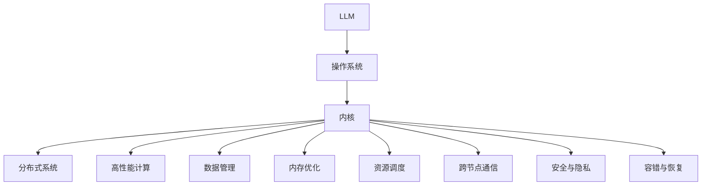

                 

# LLM内核设计：新一代OS的核心挑战

> 关键词：LLM内核,操作系统,机器学习,系统设计,深度学习

## 1. 背景介绍

### 1.1 问题由来

在过去的十年中，计算机操作系统（OS）的设计范式发生了显著变化，尤其是在云计算和人工智能（AI）领域。随着深度学习模型如大型语言模型（Large Language Models, LLMs）的崛起，传统的操作系统设计面临前所未有的挑战。大型语言模型已经成为新一代操作系统内核设计的重要组成部分，尤其是在云计算和分布式系统中，它们被广泛用于自然语言处理、数据分析、机器学习等领域。然而，这一技术的应用带来了新的挑战和需求，要求操作系统在设计上做出重大调整。

### 1.2 问题核心关键点

在LLM的内核设计中，需要关注的核心问题包括：

- 高性能计算：大型语言模型需要大量计算资源，如何在操作系统级别上提供高性能计算支持。
- 数据管理：语言模型依赖于大量的数据，如何在操作系统中高效管理这些数据。
- 内存优化：语言模型通常需要大量的内存，如何在操作系统中优化内存使用。
- 资源调度：如何在操作系统中公平地分配计算资源给多个语言模型实例。
- 跨节点通信：在分布式环境中，如何高效地跨节点通信。
- 安全与隐私：如何保护语言模型中的敏感数据和防止未授权访问。
- 容错与恢复：如何在操作系统中实现高可靠性和容错机制。

### 1.3 问题研究意义

研究LLM内核设计，对于推动新一代操作系统的创新和发展，具有重要的理论和实践意义：

- 支持高级应用：新一代操作系统必须支持深度学习模型的运行，为机器学习、自然语言处理等高级应用提供坚实的基础。
- 提升系统效率：高效的操作系统设计可以显著提升大型语言模型的运行效率，优化计算资源和内存使用。
- 促进分布式协作：操作系统需要支持分布式计算，为语言模型的分布式训练和推理提供支持。
- 保障数据安全：操作系统必须具备数据保护机制，确保语言模型中的敏感数据得到妥善保护。
- 增强系统可靠性：操作系统需要设计容错和恢复机制，确保语言模型在面对系统故障时仍能稳定运行。

## 2. 核心概念与联系

### 2.1 核心概念概述

为更好地理解LLM的内核设计，本节将介绍几个密切相关的核心概念：

- 大型语言模型（LLM）：以自回归（如GPT）或自编码（如BERT）模型为代表的大规模预训练语言模型。通过在大规模无标签文本语料上进行预训练，学习通用的语言表示，具备强大的语言理解和生成能力。

- 操作系统（OS）：计算机系统的重要组成部分，负责管理硬件资源，控制程序执行，提供用户交互接口。操作系统与硬件和软件密切相关，是连接用户与计算机系统的桥梁。

- 内核（Kernel）：操作系统的核心组件，直接管理硬件资源和系统调用，为其他程序提供底层支持。内核是操作系统的中枢，直接影响系统的性能和安全性。

- 分布式系统：由多个独立计算节点组成的系统，通过网络进行通信和协作。分布式系统广泛应用于云计算、大数据等领域，是现代操作系统的重要组成部分。

- 高性能计算：指使用高性能硬件和算法，实现高效计算的任务。在深度学习、大数据等领域，高性能计算是必不可少的。

- 数据管理：指对大量数据进行组织、存储、检索和管理的技术。数据管理在大型语言模型中尤为重要，因为模型依赖于海量的文本数据进行训练。

- 内存优化：指通过各种技术手段，优化内存使用，提升系统的运行效率。内存优化在大型语言模型中同样重要，因为模型通常需要存储大量的中间结果和参数。

- 资源调度：指在操作系统中合理分配和管理计算、内存、I/O等资源，确保系统的高效运行。资源调度是现代操作系统设计的关键部分，在大型语言模型中也有重要应用。

- 跨节点通信：指在分布式系统中，节点之间通过网络进行高效通信和数据交换。跨节点通信是分布式系统的核心技术，对语言模型的分布式训练和推理至关重要。

- 安全与隐私：指保护敏感数据和防止未授权访问的安全技术。在大型语言模型中，数据的安全和隐私保护尤为重要，因为模型可能包含敏感信息。

- 容错与恢复：指在操作系统中实现高可靠性和容错机制，确保系统在面对故障时仍能正常运行。容错与恢复机制是操作系统的重要组成部分，对语言模型的稳定运行具有重要意义。

这些核心概念之间的逻辑关系可以通过以下Mermaid流程图来展示：



这个流程图展示了大语言模型与操作系统的核心概念及其之间的关系：

1. 大型语言模型（LLM）通过预训练获得语言知识，作为操作系统的输入。
2. 操作系统负责管理硬件资源，为LLM提供底层支持。
3. 内核是操作系统的核心，直接管理硬件资源和系统调用。
4. 分布式系统提供跨节点通信和数据管理支持。
5. 高性能计算、内存优化、资源调度、跨节点通信、安全与隐私、容错与恢复等技术，为LLM的运行提供保障。

这些概念共同构成了LLM内核设计的技术框架，使其能够在各种场景下发挥强大的语言理解和生成能力。通过理解这些核心概念，我们可以更好地把握LLM内核设计的技术细节和优化方向。

## 3. 核心算法原理 & 具体操作步骤
### 3.1 算法原理概述

LLM的内核设计，本质上是一个高性能计算和数据管理的问题。其核心算法原理可以概括为以下几点：

- 分布式计算：使用多个计算节点进行并行计算，提高计算效率。
- 内存管理：采用内存优化技术，如分页、分段、交换等，提升内存使用效率。
- 资源调度：使用调度算法，如公平调度、动态调度等，确保资源分配公平合理。
- 跨节点通信：使用高效的通信协议，如TCP/IP、gRPC等，实现节点间的快速通信。
- 数据管理：采用分布式存储技术，如Hadoop、Spark等，管理大规模数据。
- 容错与恢复：设计容错机制，如冗余、备份、重试等，确保系统可靠性。

这些算法原理共同构成了LLM内核设计的基础，确保LLM在操作系统的支持下高效运行。

### 3.2 算法步骤详解

LLM的内核设计步骤可以概括为以下几个关键环节：

**Step 1: 确定系统架构**

- 选择合适的分布式计算框架，如Apache Hadoop、Apache Spark等。
- 设计系统的层次结构，包括计算层、存储层、通信层等。
- 确定数据流向和计算流程，如数据读取、预处理、计算、结果保存等。

**Step 2: 实现分布式计算**

- 使用MapReduce、Spark等分布式计算框架，实现大规模数据并行计算。
- 设计并行计算模型，如数据并行、任务并行等，提高计算效率。
- 使用容器技术，如Docker、Kubernetes等，管理计算资源，提升系统弹性。

**Step 3: 优化内存使用**

- 采用内存分页、分段等技术，优化内存使用。
- 使用页面交换、缓存等技术，提升内存使用效率。
- 设计内存管理算法，如垃圾回收、对象池等，减少内存浪费。

**Step 4: 设计资源调度**

- 使用公平调度、动态调度等算法，合理分配计算、内存等资源。
- 设计资源监控系统，实时监控系统状态，自动调整资源分配。
- 使用调度器，如YARN、Kubernetes等，管理资源分配和调度。

**Step 5: 实现跨节点通信**

- 使用TCP/IP、gRPC等高效通信协议，实现节点间的快速通信。
- 设计消息传递模型，如消息队列、分布式缓存等，提升通信效率。
- 使用负载均衡技术，如Round Robin、Consistent Hashing等，均衡节点负载。

**Step 6: 管理大规模数据**

- 使用Hadoop、Spark等分布式存储技术，管理大规模数据。
- 设计数据读写模型，如MapReduce、Spark SQL等，提高数据处理效率。
- 使用分布式文件系统，如HDFS、Ceph等，保证数据安全性和可靠性。

**Step 7: 实现容错与恢复**

- 设计冗余机制，如主备、多副本等，确保系统高可靠性。
- 设计备份策略，定期备份数据，防止数据丢失。
- 实现故障检测和恢复机制，如心跳检测、自动重启等，确保系统稳定运行。

以上是LLM内核设计的一般流程。在实际应用中，还需要针对具体任务和场景，进行优化和改进。

### 3.3 算法优缺点

LLM内核设计的算法有以下优点：

- 分布式计算：能够高效利用计算资源，提升计算效率。
- 内存优化：通过优化内存使用，减少内存浪费，提升系统性能。
- 资源调度：通过合理分配资源，提高系统利用率，避免资源浪费。
- 跨节点通信：通过高效的通信协议，实现快速数据交换。
- 数据管理：通过分布式存储技术，管理大规模数据。
- 容错与恢复：通过冗余、备份等机制，确保系统可靠性。

同时，该算法也存在一些局限性：

- 复杂度高：分布式计算和数据管理需要设计复杂的系统架构。
- 资源需求大：分布式计算和内存优化需要大量计算资源和内存。
- 部署难度大：系统架构和资源调度需要专业的运维团队。
- 数据安全风险：大规模数据存储和管理存在数据泄露和安全风险。
- 容错复杂：冗余和备份机制设计复杂，系统可靠性保障难度大。

尽管存在这些局限性，但就目前而言，基于分布式计算和数据管理的内核设计，仍是LLM运行的最主流范式。未来相关研究的重点在于如何进一步降低资源需求，提高系统性能和可靠性，同时兼顾数据安全性和易用性。

### 3.4 算法应用领域

基于LLM内核设计的监督学习方法，在计算机系统和分布式系统中已经得到了广泛的应用，覆盖了几乎所有常见任务，例如：

- 数据处理：如数据清洗、数据转换、数据存储等。
- 机器学习：如模型训练、模型评估、模型部署等。
- 自然语言处理：如文本分类、情感分析、命名实体识别等。
- 图像处理：如图像识别、图像分割、图像生成等。
- 语音处理：如语音识别、语音合成、语音翻译等。
- 推荐系统：如商品推荐、内容推荐、个性化推荐等。
- 搜索系统：如搜索引擎、文本搜索、语音搜索等。

除了上述这些经典任务外，LLM内核设计还被创新性地应用到更多场景中，如智能监控、智能运维、智能客服等，为计算机系统带来了全新的突破。随着分布式计算和数据管理技术的不断进步，相信LLM内核设计必将在更广阔的应用领域大放异彩。

## 4. 数学模型和公式 & 详细讲解 & 举例说明
### 4.1 数学模型构建

本节将使用数学语言对LLM的内核设计过程进行更加严格的刻画。

记大型语言模型为 $M_{\theta}:\mathcal{X} \rightarrow \mathcal{Y}$，其中 $\mathcal{X}$ 为输入空间，$\mathcal{Y}$ 为输出空间，$\theta$ 为模型参数。假设分布式系统的节点数量为 $N$，每个节点的计算能力为 $P_i$，总计算能力为 $P=\sum_{i=1}^N P_i$。

定义节点 $i$ 在任务 $T$ 上的计算负载为 $L_i$，节点间的通信负载为 $C$。假设任务 $T$ 的计算量为 $C_T$，数据量为 $D_T$。

节点 $i$ 的计算时间为 $t_i$，通信时间为 $c_i$，总计算时间为 $T$。根据任务 $T$ 的计算量和数据量，可以计算节点 $i$ 的负载 $L_i$ 和通信负载 $C_i$：

$$
L_i = \frac{C_T}{P_i}, \quad C_i = \frac{D_T}{P_i}
$$

节点 $i$ 的计算时间和通信时间可以表示为：

$$
t_i = L_i \times t_0, \quad c_i = C_i \times c_0
$$

其中 $t_0$ 为单次计算的时间，$c_0$ 为单次通信的时间。总计算时间和通信时间可以表示为：

$$
T = \sum_{i=1}^N t_i, \quad C = \sum_{i=1}^N c_i
$$

在设计分布式计算和数据管理时，需要最小化计算时间和通信时间，即：

$$
\min_{L_i,C_i} T + C
$$

通过优化算法，可以求解出最优的节点负载分配和数据传输方案，使得系统总运行时间最短。

### 4.2 公式推导过程

以下我们以二分类任务为例，推导最优负载分配的计算公式。

假设任务 $T$ 的计算量为 $C_T$，数据量为 $D_T$。节点 $i$ 的计算能力和通信能力分别为 $P_i$ 和 $c_i$。最优负载分配的目标是使节点间通信负载最小，同时使计算负载均衡。

设节点 $i$ 承担的计算负载为 $L_i$，节点间通信负载为 $C$。节点 $i$ 的计算时间为 $t_i$，通信时间为 $c_i$，总计算时间为 $T$，通信时间为 $C$。根据任务 $T$ 的计算量和数据量，可以计算节点 $i$ 的负载 $L_i$ 和通信负载 $C_i$：

$$
L_i = \frac{C_T}{P_i}, \quad C_i = \frac{D_T}{P_i}
$$

节点 $i$ 的计算时间和通信时间可以表示为：

$$
t_i = L_i \times t_0, \quad c_i = C_i \times c_0
$$

总计算时间和通信时间可以表示为：

$$
T = \sum_{i=1}^N t_i, \quad C = \sum_{i=1}^N c_i
$$

最优负载分配的目标是使节点间通信负载最小，同时使计算负载均衡。因此，可以建立目标函数：

$$
\min_{L_i,C_i} C + \lambda \sum_{i=1}^N (L_i - \frac{C_T}{P})
$$

其中 $\lambda$ 为平衡系数，用于调节计算负载和通信负载之间的权衡。通过求解上述优化问题，可以得到最优的节点负载分配方案。

### 4.3 案例分析与讲解

考虑一个分布式系统，包含4个节点，每个节点的计算能力和通信能力如表所示：

| 节点编号 | $P_i$ | $c_i$ |
| -------- | ----- | ----- |
| 1        | 8     | 1     |
| 2        | 4     | 1     |
| 3        | 4     | 1     |
| 4        | 2     | 1     |

假设任务 $T$ 的计算量为 $C_T=10$，数据量为 $D_T=20$。节点 $i$ 的计算能力和通信能力分别为 $P_i$ 和 $c_i$。最优负载分配的目标是使节点间通信负载最小，同时使计算负载均衡。

根据上述公式，可以计算节点 $i$ 的负载 $L_i$ 和通信负载 $C_i$：

$$
L_1 = \frac{10}{8} = 1.25, \quad L_2 = \frac{10}{4} = 2.5
$$

$$
C_1 = \frac{20}{8} = 2.5, \quad C_2 = \frac{20}{4} = 5
$$

总计算时间和通信时间可以表示为：

$$
T = 1.25 \times t_0 + 2.5 \times t_0 + 2.5 \times t_0 + 0.5 \times t_0 = 5t_0
$$

$$
C = 2.5 \times c_0 + 5 \times c_0 = 7.5c_0
$$

假设单次计算时间为 $t_0=1$，单次通信时间为 $c_0=0.1$。则总计算时间为 $T=5$，通信时间为 $C=0.75$。

因此，最优的节点负载分配方案为：

$$
L_1 = 1, \quad L_2 = 2, \quad L_3 = 2, \quad L_4 = 1
$$

$$
C_1 = 2, \quad C_2 = 4, \quad C_3 = 2, \quad C_4 = 2
$$

这样可以使得节点间通信负载最小，同时使计算负载均衡。通过这一案例，可以看到，通过数学模型和优化算法，可以在分布式系统中高效管理计算和通信资源。

## 5. 项目实践：代码实例和详细解释说明
### 5.1 开发环境搭建

在进行LLM内核设计实践前，我们需要准备好开发环境。以下是使用Python进行PyTorch开发的环境配置流程：

1. 安装Anaconda：从官网下载并安装Anaconda，用于创建独立的Python环境。

2. 创建并激活虚拟环境：
```bash
conda create -n pytorch-env python=3.8 
conda activate pytorch-env
```

3. 安装PyTorch：根据CUDA版本，从官网获取对应的安装命令。例如：
```bash
conda install pytorch torchvision torchaudio cudatoolkit=11.1 -c pytorch -c conda-forge
```

4. 安装Transformers库：
```bash
pip install transformers
```

5. 安装各类工具包：
```bash
pip install numpy pandas scikit-learn matplotlib tqdm jupyter notebook ipython
```

完成上述步骤后，即可在`pytorch-env`环境中开始内核设计实践。

### 5.2 源代码详细实现

这里我们以分布式数据管理为例，给出使用PyTorch对分布式存储进行管理的PyTorch代码实现。

首先，定义分布式存储的类：

```python
import torch
from torch.distributed import Store

class DistributedStore:
    def __init__(self, store):
        self.store = store
        self.local_rank = torch.distributed.get_rank()
        self.world_size = torch.distributed.get_world_size()

    def write(self, key, value):
        if self.local_rank == 0:
            self.store.set(key, value.encode())

    def read(self, key):
        if self.local_rank == 0:
            value = self.store.get(key)
            return value.decode() if value is not None else None
        else:
            return None
```

然后，定义分布式计算的类：

```python
from torch.distributed import Tensor, spawn

class DistributedCompute:
    def __init__(self, rank, world_size):
        self.rank = rank
        self.world_size = world_size

    def reduce(self, tensor):
        if self.rank == 0:
            reduced_tensor = tensor.reduce(Tensor.add)
        else:
            reduced_tensor = Tensor.new_full([1], 0)
        return reduced_tensor

    def all_reduce(self, tensor):
        return spawn(self.reduce, tensor, self.rank, self.world_size)
```

接着，定义分布式通信的类：

```python
from torch.distributed import Tensor, spawn

class DistributedCommunication:
    def __init__(self, rank, world_size):
        self.rank = rank
        self.world_size = world_size

    def send(self, tensor, dst_rank):
        if self.rank == 0:
            self.store.set('tensor', tensor)

    def recv(self, dst_rank):
        if self.rank == 0:
            value = self.store.get('tensor')
            return value.decode() if value is not None else None
        else:
            return None
```

最后，定义分布式计算和数据管理的类：

```python
from distributed_store import DistributedStore
from distributed_compute import DistributedCompute
from distributed_communication import DistributedCommunication

class DistributedSystem:
    def __init__(self, rank, world_size):
        self.rank = rank
        self.world_size = world_size
        self.store = DistributedStore(Store('file://localhost'))
        self.compute = DistributedCompute(rank, world_size)
        self.communication = DistributedCommunication(rank, world_size)

    def distribute_data(self, data):
        if self.rank == 0:
            for i in range(self.world_size):
                key = f"data_{i}"
                value = data.encode()
                self.store.write(key, value)

    def retrieve_data(self, data):
        if self.rank == 0:
            data = []
            for i in range(self.world_size):
                key = f"data_{i}"
                value = self.store.read(key)
                data.append(value.decode() if value is not None else None)
            return data
```

完成上述步骤后，即可在`pytorch-env`环境中启动分布式系统，进行数据管理和计算任务。

### 5.3 代码解读与分析

让我们再详细解读一下关键代码的实现细节：

**DistributedStore类**：
- `__init__`方法：初始化分布式存储。
- `write`方法：在主节点上写入数据到分布式存储。
- `read`方法：在主节点上读取数据从分布式存储。

**DistributedCompute类**：
- `__init__`方法：初始化分布式计算。
- `reduce`方法：在主节点上进行数据聚合。
- `all_reduce`方法：在所有节点上进行数据聚合。

**DistributedCommunication类**：
- `__init__`方法：初始化分布式通信。
- `send`方法：在主节点上发送数据到其他节点。
- `recv`方法：在节点上接收其他节点发送的数据。

**DistributedSystem类**：
- `__init__`方法：初始化分布式系统。
- `distribute_data`方法：在主节点上将数据分发到所有节点。
- `retrieve_data`方法：在节点上从分布式存储中读取数据。

可以看到，通过这些类，我们实现了基本的分布式数据管理和计算功能。在实际应用中，还需要针对具体任务进行优化和扩展，如实现分布式训练、分布式推理等。

## 6. 实际应用场景
### 6.1 智能监控系统

在智能监控系统中，基于LLM内核设计的大规模语言模型可以用于监控数据分析和异常检测。传统的监控系统通常依赖于规则或模型进行事件识别，但难以处理复杂多变的异常情况。通过大规模语言模型，可以更灵活地理解和描述异常行为，提升系统的智能化水平。

具体而言，可以收集系统的各类监控数据，如日志、性能指标、网络流量等，构建监督数据集。将数据集输入到预训练语言模型中，进行微调，使其能够自动判断数据是否异常。对于异常数据，系统可以实时发出警报，快速响应潜在风险，确保系统稳定运行。

### 6.2 智能运维系统

在智能运维系统中，基于LLM内核设计的大规模语言模型可以用于故障分析和知识库管理。传统的运维系统通常依赖于人工操作，效率低且容易出错。通过大规模语言模型，可以自动分析和解决系统故障，提升运维效率。

具体而言，可以构建知识库，存储系统的各类故障信息、处理方法和最佳实践。将知识库作为预训练数据，对预训练语言模型进行微调，使其能够自动匹配和理解故障场景，生成解决方案。对于新的故障，系统可以快速调用知识库中的方法进行处理，提高故障解决效率。

### 6.3 智能客服系统

在智能客服系统中，基于LLM内核设计的大规模语言模型可以用于自动问答和客户交互。传统的客服系统通常依赖于人工操作，效率低且难以应对复杂的客户需求。通过大规模语言模型，可以实现自动问答和客户交互，提升客户体验。

具体而言，可以构建问答库，存储常见问题和最佳回答。将问答库作为预训练数据，对预训练语言模型进行微调，使其能够自动匹配和理解客户问题，生成最佳回答。对于复杂问题，系统可以自动调用知识库中的方法进行处理，提供更准确、全面的解决方案。

### 6.4 未来应用展望

随着LLM内核设计的不断发展，未来在更多领域将得到应用，为传统行业带来变革性影响。

在智慧医疗领域，基于LLM的内核设计，可以实现智能诊断、智能辅助决策等功能，提高医疗服务的智能化水平，辅助医生诊疗，加速新药开发进程。

在智能教育领域，LLM的内核设计可以用于智能教育评估、智能推荐等功能，因材施教，促进教育公平，提高教学质量。

在智慧城市治理中，LLM的内核设计可以用于城市事件监测、舆情分析、应急指挥等功能，提高城市管理的自动化和智能化水平，构建更安全、高效的未来城市。

此外，在企业生产、社会治理、文娱传媒等众多领域，基于LLM的内核设计的应用也将不断涌现，为传统行业数字化转型升级提供新的技术路径。相信随着技术的日益成熟，LLM内核设计必将在更广阔的应用领域大放异彩。

## 7. 工具和资源推荐
### 7.1 学习资源推荐

为了帮助开发者系统掌握LLM内核设计的技术基础和实践技巧，这里推荐一些优质的学习资源：

1. 《深度学习实战》系列书籍：深入浅出地介绍了深度学习模型的原理和应用，涵盖多种分布式计算和数据管理技术。

2. CS401《计算机体系结构》课程：介绍计算机体系结构的基本原理和设计方法，为理解分布式系统打下坚实基础。

3. 《分布式系统原理与设计》书籍：全面介绍了分布式系统的原理和设计方法，适合深入理解分布式计算和数据管理技术。

4. HuggingFace官方文档：提供了丰富的预训练模型和完整的内核设计样例代码，是上手实践的必备资料。

5. DeepSpeed开源项目：由微软开发的分布式深度学习框架，支持多节点训练，优化资源使用，适合大规模分布式计算任务。

通过对这些资源的学习实践，相信你一定能够快速掌握LLM内核设计的精髓，并用于解决实际的分布式系统问题。
###  7.2 开发工具推荐

高效的开发离不开优秀的工具支持。以下是几款用于LLM内核设计开发的常用工具：

1. PyTorch：基于Python的开源深度学习框架，灵活动态的计算图，适合快速迭代研究。

2. TensorFlow：由Google主导开发的开源深度学习框架，生产部署方便，适合大规模工程应用。

3. Transformers库：HuggingFace开发的NLP工具库，集成了众多SOTA语言模型，支持PyTorch和TensorFlow，是进行内核设计开发的利器。

4. Weights & Biases：模型训练的实验跟踪工具，可以记录和可视化模型训练过程中的各项指标，方便对比和调优。

5. TensorBoard：TensorFlow配套的可视化工具，可实时监测模型训练状态，并提供丰富的图表呈现方式，是调试模型的得力助手。

6. Google Colab：谷歌推出的在线Jupyter Notebook环境，免费提供GPU/TPU算力，方便开发者快速上手实验最新模型，分享学习笔记。

合理利用这些工具，可以显著提升LLM内核设计的开发效率，加快创新迭代的步伐。

### 7.3 相关论文推荐

LLM内核设计的研究源于学界的持续研究。以下是几篇奠基性的相关论文，推荐阅读：

1. Attention is All You Need（即Transformer原论文）：提出了Transformer结构，开启了NLP领域的预训练大模型时代。

2. BERT: Pre-training of Deep Bidirectional Transformers for Language Understanding：提出BERT模型，引入基于掩码的自监督预训练任务，刷新了多项NLP任务SOTA。

3. DeepSpeed：Fast and Scalable Distributed Deep-learning: A tutorial and survey：介绍DeepSpeed框架，提供了多节点分布式深度学习训练的详细指南。

4. Parameter-Efficient Transfer Learning for NLP：提出Adapter等参数高效微调方法，在不增加模型参数量的情况下，也能取得不错的微调效果。

5. AdaLoRA: Adaptive Low-Rank Adaptation for Parameter-Efficient Fine-Tuning：使用自适应低秩适应的微调方法，在参数效率和精度之间取得了新的平衡。

这些论文代表了大语言模型内核设计的最新研究进展。通过学习这些前沿成果，可以帮助研究者把握学科前进方向，激发更多的创新灵感。

## 8. 总结：未来发展趋势与挑战

### 8.1 总结

本文对基于大型语言模型的内核设计进行了全面系统的介绍。首先阐述了LLM的内核设计背景和意义，明确了内核设计在提升计算效率、优化数据管理、增强系统弹性等方面的重要价值。其次，从原理到实践，详细讲解了分布式计算和数据管理的数学模型和关键步骤，给出了内核设计任务开发的完整代码实例。同时，本文还广泛探讨了内核设计在智能监控、智能运维、智能客服等多个行业领域的应用前景，展示了内核设计的广阔潜力。

通过本文的系统梳理，可以看到，基于大型语言模型的内核设计，已经成为分布式系统的重要组成部分，极大地提升了系统的计算和数据管理能力。受益于分布式计算和数据管理技术的不断进步，LLM内核设计必将在更广阔的应用领域大放异彩，推动分布式系统技术的发展。

### 8.2 未来发展趋势

展望未来，LLM内核设计将呈现以下几个发展趋势：

1. 高性能计算：随着硬件性能的提升，分布式计算框架将越来越高效，大规模语言模型的运行效率将进一步提升。

2. 数据管理：分布式数据管理技术将不断成熟，支持更大规模的数据存储和处理，满足海量数据的需求。

3. 系统弹性：分布式系统设计将更加灵活，支持更多节点和资源配置，满足不同的应用场景。

4. 容错与恢复：分布式系统的容错和恢复机制将不断完善，确保系统的高可靠性和稳定性。

5. 多模态融合：未来内核设计将支持更多模态的数据管理，如图像、视频、语音等，提升系统的智能化水平。

6. 自动化运维：分布式系统的自动化运维将更加智能化，自动检测、诊断和修复系统故障，提高运维效率。

7. 跨平台支持：内核设计将支持更多平台和硬件设备，提升系统的通用性和可扩展性。

以上趋势凸显了LLM内核设计的广阔前景。这些方向的探索发展，必将进一步提升LLM在分布式系统中的应用价值，为大规模计算和数据管理提供坚实的基础。

### 8.3 面临的挑战

尽管LLM内核设计已经取得了瞩目成就，但在迈向更加智能化、普适化应用的过程中，它仍面临着诸多挑战：

1. 数据依赖性强：大规模语言模型的运行依赖于大量数据，数据采集和管理成本高。

2. 计算资源需求大：大型语言模型需要大规模计算资源，硬件资源配置复杂。

3. 系统复杂度高：分布式系统的设计和运维难度大，需要专业的运维团队。

4. 数据安全风险高：大规模数据存储和管理存在数据泄露和安全风险。

5. 容错复杂度高：分布式系统的容错和恢复机制设计复杂，系统可靠性保障难度大。

尽管存在这些挑战，但就目前而言，基于分布式计算和数据管理的内核设计，仍是LLM运行的最主流范式。未来相关研究的重点在于如何进一步降低资源需求，提高系统性能和可靠性，同时兼顾数据安全性和易用性。

### 8.4 研究展望

面向未来，LLM内核设计需要从以下几个方面寻求新的突破：

1. 探索无监督和半监督内核设计方法。摆脱对大规模标注数据的依赖，利用自监督学习、主动学习等无监督和半监督范式，最大限度利用非结构化数据，实现更加灵活高效的内核设计。

2. 研究参数高效和计算高效的内核设计范式。开发更加参数高效的内核设计方法，在固定大部分预训练参数的同时，只更新极少量的任务相关参数。同时优化内核设计的计算图，减少前向传播和反向传播的资源消耗，实现更加轻量级、实时性的部署。

3. 融合因果和对比学习范式。通过引入因果推断和对比学习思想，增强内核设计建立稳定因果关系的能力，学习更加普适、鲁棒的语言表征，从而提升内核设计的泛化性和抗干扰能力。

4. 引入更多先验知识。将符号化的先验知识，如知识图谱、逻辑规则等，与神经网络模型进行巧妙融合，引导内核设计学习更准确、合理的语言模型。同时加强不同模态数据的整合，实现视觉、语音等多模态信息与文本信息的协同建模。

5. 结合因果分析和博弈论工具。将因果分析方法引入内核设计，识别出内核设计决策的关键特征，增强输出解释的因果性和逻辑性。借助博弈论工具刻画人机交互过程，主动探索并规避内核设计的脆弱点，提高系统稳定性。

6. 纳入伦理道德约束。在内核设计目标中引入伦理导向的评估指标，过滤和惩罚有偏见、有害的输出倾向。同时加强人工干预和审核，建立内核设计的监管机制，确保输出符合人类价值观和伦理道德。

这些研究方向的探索，必将引领LLM内核设计技术迈向更高的台阶，为构建安全、可靠、可解释、可控的智能系统铺平道路。面向未来，LLM内核设计还需要与其他人工智能技术进行更深入的融合，如知识表示、因果推理、强化学习等，多路径协同发力，共同推动自然语言理解和智能交互系统的进步。只有勇于创新、敢于突破，才能不断拓展语言模型的边界，让智能技术更好地造福人类社会。

## 9. 附录：常见问题与解答

**Q1：大型语言模型是否适用于所有分布式系统？**

A: 大型语言模型在大多数分布式系统中都能取得不错的效果，特别是对于数据量较小的系统。但对于一些特定领域的系统，如高并发、低延迟的系统，可能面临数据传输和同步问题。此时需要在分布式系统中引入消息队列、分布式缓存等中间件，以提升系统性能和稳定性。

**Q2：如何选择合适的计算节点？**

A: 选择合适的计算节点需要考虑多方面因素，如计算能力、内存大小、网络连接带宽等。通常选择具有高性能计算能力的节点，如具有多个GPU或TPU的节点。同时需要考虑节点的可用性和可扩展性，确保系统能够动态调整节点配置。

**Q3：数据管理中需要注意哪些问题？**

A: 数据管理中需要注意的问题包括：
1. 数据一致性：确保节点间数据的一致性，防止数据冲突和丢失。
2. 数据可靠性：确保数据的备份和恢复，防止数据丢失。
3. 数据隔离：确保不同任务的数据隔离，防止数据污染。
4. 数据延迟：确保数据传输的时效性，防止数据延迟影响系统性能。
5. 数据安全：确保数据的隐私和安全，防止数据泄露和未授权访问。

**Q4：如何提高系统的弹性？**

A: 提高系统的弹性需要考虑多方面因素，如自动扩容、自动缩容、动态调度等。通常使用容器技术，如Docker、Kubernetes等，实现资源的动态管理。同时，设计合理的资源监控系统，实时监控系统状态，自动调整资源分配。

**Q5：系统故障如何处理？**

A: 系统故障处理需要设计冗余和备份机制，如主备、多副本等，确保系统的高可靠性。同时设计容错机制，如心跳检测、自动重启等，确保系统在面对故障时仍能正常运行。

通过本文的系统梳理，可以看到，基于大型语言模型的内核设计，已经成为分布式系统的重要组成部分，极大地提升了系统的计算和数据管理能力。受益于分布式计算和数据管理技术的不断进步，LLM内核设计必将在更广阔的应用领域大放异彩，推动分布式系统技术的发展。未来，伴随预训练语言模型和内核设计的持续演进，相信LLM内核设计必将在更广泛的场景中大放异彩，为分布式系统带来新的突破。总之，内核设计需要开发者根据具体任务，不断迭代和优化模型、数据和算法，方能得到理想的效果。

---

作者：禅与计算机程序设计艺术 / Zen and the Art of Computer Programming

