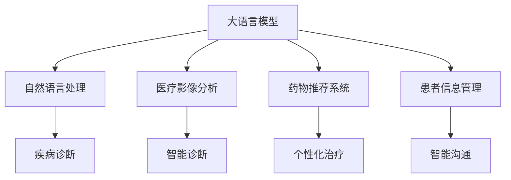

                 

# LLM在个性化医疗中的潜力：精准诊断与治疗方案

> 关键词：大语言模型(LLM), 个性化医疗, 精准诊断, 治疗方案, 自然语言处理(NLP), 医疗影像分析, 药物推荐系统, 患者信息管理, 数据驱动决策

## 1. 背景介绍

### 1.1 问题由来

现代医学已经进入数据驱动的时代，大数据和人工智能技术的飞速发展为个性化医疗提供了新的可能。但是，医疗数据的海量、异构和复杂性，使得传统的数据处理和分析方法难以满足需求。随着大语言模型(LLM)的兴起，尤其是BERT、GPT等模型的成功应用，为医疗领域的自然语言处理(NLP)、图像分析、患者信息管理等领域提供了新的解决方案。

### 1.2 问题核心关键点

LLM在医疗领域的应用主要集中在以下几个方面：

- **自然语言处理(NLP)**：通过对电子健康记录(EHR)、病历、临床报告等文本数据的处理，辅助医生进行疾病诊断、治疗方案制定、患者沟通等。
- **医疗影像分析**：利用大模型对医疗影像进行智能诊断，如CT、MRI、超声等，辅助医生快速、准确地判断病变位置和性质。
- **药物推荐系统**：根据患者病史、基因信息、治疗历史等数据，为患者推荐最合适的药物和治疗方案。
- **患者信息管理**：通过智能对话系统，提供患者信息录入、健康教育、随访服务等，提升患者管理效率。

### 1.3 问题研究意义

LLM在医疗领域的深度应用，能够显著提升诊断和治疗的精准度，减少误诊和漏诊，提高医疗效率，降低患者经济负担。同时，大模型的多模态融合能力和自适应学习机制，能够帮助医生在不同场景下做出更合理的决策，为个性化医疗提供强有力的技术支持。

## 2. 核心概念与联系

### 2.1 核心概念概述

为更好地理解LLM在个性化医疗中的应用，本节将介绍几个密切相关的核心概念：

- **大语言模型(LLM)**：以Transformer为基础的深度学习模型，具备强大的语言理解能力和生成能力，适用于处理各种文本数据。
- **自然语言处理(NLP)**：通过计算机理解和生成人类语言的技术，包括文本分类、命名实体识别、信息抽取、情感分析等。
- **医疗影像分析**：利用计算机视觉技术对医疗影像进行自动诊断，识别病变区域、评估病情等。
- **药物推荐系统**：根据患者的历史数据和基因信息，推荐最佳治疗方案和药物。
- **患者信息管理**：通过智能对话系统，收集患者信息，提供健康指导和随访服务，提高患者管理效率。

这些核心概念之间的逻辑关系可以通过以下Mermaid流程图来展示：



这个流程图展示了大语言模型的核心概念及其在医疗领域的应用：

1. 大语言模型通过NLP技术处理医疗文本数据，辅助医生进行疾病诊断和治疗方案制定。
2. 通过医疗影像分析，辅助医生对影像数据进行智能诊断。
3. 基于患者历史数据和基因信息，利用药物推荐系统提供个性化治疗方案。
4. 利用患者信息管理，进行智能沟通和健康教育，提高患者管理效率。

## 3. 核心算法原理 & 具体操作步骤

### 3.1 算法原理概述

大语言模型在个性化医疗中的应用，主要基于其强大的语言处理能力和知识整合能力。在NLP任务中，LLM可以通过训练大量无标签文本数据，学习通用的语言表示，用于解决各种自然语言处理问题。在医疗影像分析中，LLM能够利用其强大的视觉处理能力，对医疗影像进行智能诊断。在药物推荐系统中，LLM可以通过分析患者数据，辅助医生制定个性化治疗方案。

具体而言，LLM在个性化医疗中的应用流程包括以下几个关键步骤：

1. **数据预处理**：收集和整理医疗数据，进行文本清洗、标注等预处理，以便大模型进行后续分析。
2. **模型训练**：在大量无标签文本数据上预训练大语言模型，学习通用的语言表示。
3. **任务适配**：针对具体医疗任务，对大模型进行微调，使其具备处理特定任务的性能。
4. **模型评估**：在验证集上评估微调后的模型性能，根据性能指标调整模型参数。
5. **实际应用**：将微调后的模型应用于实际医疗场景，进行疾病诊断、治疗方案制定、患者沟通等。

### 3.2 算法步骤详解

以下是LLM在个性化医疗中应用的详细步骤：

**Step 1: 数据收集与预处理**

1. **数据收集**：收集患者的电子健康记录(EHR)、病历、临床报告、影像数据等，作为训练数据。
2. **数据清洗**：去除重复、无关、错误的数据，确保数据质量。
3. **数据标注**：对医疗文本数据进行标注，如疾病名称、病情描述、影像分析结果等，以便于模型训练。
4. **数据集划分**：将数据集划分为训练集、验证集和测试集，用于模型训练、评估和测试。

**Step 2: 模型训练与微调**

1. **模型选择**：选择适合的预训练模型，如BERT、GPT等。
2. **模型微调**：在医疗数据上对模型进行微调，调整顶层参数以适应具体任务。
3. **学习率设置**：设置合适的学习率，以避免过拟合和欠拟合。
4. **正则化**：应用L2正则、Dropout等技术，防止过拟合。
5. **数据增强**：通过数据增强技术扩充训练集，如近义替换、回译等。

**Step 3: 模型评估**

1. **评估指标**：选择适合的评估指标，如准确率、召回率、F1分数等，用于模型性能评估。
2. **模型测试**：在测试集上评估模型性能，检查模型泛化能力。
3. **参数优化**：根据测试结果调整模型参数，进一步提升模型性能。

**Step 4: 实际应用**

1. **系统集成**：将微调后的模型集成到实际医疗系统中，进行疾病诊断、治疗方案制定等。
2. **用户交互**：通过智能对话系统，与医生和患者进行交互，收集患者信息，提供健康指导和随访服务。
3. **反馈与优化**：根据用户反馈和医疗数据，持续优化模型性能，提升用户体验。

### 3.3 算法优缺点

大语言模型在个性化医疗中的应用，具有以下优点：

1. **高效性**：通过大模型预训练和微调，可以在较短时间内构建高效的诊断和治疗方案。
2. **准确性**：大模型的泛化能力，能够在各种医疗场景下提供精准的诊断和治疗建议。
3. **可扩展性**：大模型能够轻松应对新任务和数据，具有很强的可扩展性。
4. **多模态融合**：大模型能够整合文本、影像、基因等多模态数据，提供全面的分析结果。

同时，该方法也存在以下局限性：

1. **数据依赖**：大模型的性能很大程度上依赖于数据的质量和数量。
2. **隐私风险**：医疗数据涉及患者隐私，需要严格的隐私保护措施。
3. **解释性不足**：大模型的决策过程难以解释，缺乏可解释性。
4. **高计算需求**：大模型需要高性能计算资源，成本较高。

尽管存在这些局限性，但大语言模型在医疗领域的潜力已经得到广泛认可，其高效、准确、可扩展的特点，使其成为未来个性化医疗的重要工具。

### 3.4 算法应用领域

大语言模型在医疗领域的广泛应用，涵盖以下几个主要领域：

1. **疾病诊断**：通过自然语言处理和影像分析，辅助医生进行疾病诊断，提高诊断效率和准确性。
2. **治疗方案制定**：基于患者的病史和基因信息，利用大模型推荐最佳治疗方案，提升治疗效果。
3. **患者管理**：通过智能对话系统，提供患者信息录入、健康教育、随访服务，提高患者管理效率。
4. **医学研究**：利用大模型进行医学文献分析、研究趋势预测等，推动医学研究发展。

## 4. 数学模型和公式 & 详细讲解 & 举例说明

### 4.1 数学模型构建

在个性化医疗中，大语言模型的应用主要涉及自然语言处理和图像分析两个方面。以下将对这两个方向的数学模型进行详细讲解。

#### 4.1.1 自然语言处理(NLP)

对于文本数据，大语言模型通常使用Transformer结构，通过自监督学习任务进行预训练。在医疗领域，常见的预训练任务包括病历文本的掩码语言模型、情感分析等。

**掩码语言模型**：在大规模无标签文本数据上进行预训练，训练模型预测掩码位置的上下文信息。

设文本数据为 $T = (w_1, w_2, ..., w_n)$，其中 $w_i$ 为第 $i$ 个词。假设掩码为 $M$，则掩码语言模型的训练过程如下：

$$
L_{MLM} = \sum_{i=1}^n -log p(w_i|w_{<i})
$$

其中 $p(w_i|w_{<i})$ 为条件概率，表示在上下文 $w_{<i}$ 条件下，预测第 $i$ 个词的概率。

**情感分析**：对病历文本进行情感分类，判断其情感倾向为正面、负面或中性。

设文本数据为 $T$，情感标签为 $y$，情感分析模型的训练过程如下：

$$
L_{SE} = -\frac{1}{N} \sum_{i=1}^N (y_i \log P(y_i|T))
$$

其中 $P(y_i|T)$ 为情感分类器的输出概率，$y_i \in \{0,1\}$ 表示文本 $T$ 的情感标签。

#### 4.1.2 医疗影像分析

在医疗影像分析中，大语言模型通常用于辅助图像分类和标注。

**图像分类**：对医疗影像进行自动分类，判断其包含的病变类型。

设图像数据为 $I$，病变类型为 $C$，图像分类模型的训练过程如下：

$$
L_{CL} = -\frac{1}{N} \sum_{i=1}^N (y_i \log P(C|I))
$$

其中 $P(C|I)$ 为图像分类器的输出概率，$y_i \in \{1,0\}$ 表示图像 $I$ 是否包含病变。

**图像标注**：对医疗影像进行标注，指出病变位置和大小。

设图像数据为 $I$，病变位置为 $L$，图像标注模型的训练过程如下：

$$
L_{MA} = -\frac{1}{N} \sum_{i=1}^N (L_i \log P(L|I))
$$

其中 $P(L|I)$ 为图像标注器的输出概率，$L_i$ 表示病变位置的具体描述。

### 4.2 公式推导过程

以下以自然语言处理(NLP)中的情感分析为例，推导其训练过程的数学公式。

假设文本数据为 $T$，情感分类器的输出概率为 $P(y|T)$，则情感分析模型的损失函数为：

$$
L_{SE} = -\frac{1}{N} \sum_{i=1}^N (y_i \log P(y|T))
$$

其中 $y_i$ 为文本 $T$ 的情感标签，取值为 $\{0,1\}$。

假设情感分类器使用softmax函数作为输出层，则 $P(y|T)$ 的计算公式为：

$$
P(y|T) = \frac{e^{logit(y)}}{\sum_{j=0}^1 e^{logit(j)}}
$$

其中 $logit(y)$ 为情感分类器的输出，即 $logit(1)$ 为正面情感的log-odds，$logit(0)$ 为负面情感的log-odds。

通过最大化损失函数 $L_{SE}$，情感分类器可以学习到文本情感的判别能力，从而进行情感分析。

### 4.3 案例分析与讲解

以下以一个具体的案例来说明大语言模型在个性化医疗中的应用。

假设某医院收集了大量的电子健康记录(EHR)数据，包括患者的姓名、年龄、病史、临床报告等。医院希望利用大语言模型对这些数据进行情感分析，以便更好地理解患者的健康状况和情绪。

1. **数据收集与预处理**：医院从EHR系统中提取病历数据，进行文本清洗和标注。
2. **模型选择与微调**：选择BERT模型作为预训练模型，在病历数据上进行微调。
3. **模型训练**：在标注好的病历数据上训练BERT模型，计算损失函数 $L_{SE}$ 并更新模型参数。
4. **模型评估**：在验证集上评估模型性能，计算准确率、召回率等指标。
5. **实际应用**：将微调后的模型应用于EHR系统，对新病历进行情感分析，提供健康建议。

## 5. 项目实践：代码实例和详细解释说明

### 5.1 开发环境搭建

在进行项目实践前，我们需要准备好开发环境。以下是使用Python进行PyTorch开发的环境配置流程：

1. 安装Anaconda：从官网下载并安装Anaconda，用于创建独立的Python环境。

2. 创建并激活虚拟环境：
```bash
conda create -n pytorch-env python=3.8 
conda activate pytorch-env
```

3. 安装PyTorch：根据CUDA版本，从官网获取对应的安装命令。例如：
```bash
conda install pytorch torchvision torchaudio cudatoolkit=11.1 -c pytorch -c conda-forge
```

4. 安装Transformers库：
```bash
pip install transformers
```

5. 安装各类工具包：
```bash
pip install numpy pandas scikit-learn matplotlib tqdm jupyter notebook ipython
```

完成上述步骤后，即可在`pytorch-env`环境中开始项目实践。

### 5.2 源代码详细实现

这里以情感分析任务为例，给出使用Transformers库对BERT模型进行微调的PyTorch代码实现。

首先，定义情感分析任务的数据处理函数：

```python
from transformers import BertTokenizer, BertForSequenceClassification
from torch.utils.data import Dataset
import torch

class EHRDataset(Dataset):
    def __init__(self, texts, tags, tokenizer, max_len=128):
        self.texts = texts
        self.tags = tags
        self.tokenizer = tokenizer
        self.max_len = max_len
        
    def __len__(self):
        return len(self.texts)
    
    def __getitem__(self, item):
        text = self.texts[item]
        tags = self.tags[item]
        
        encoding = self.tokenizer(text, return_tensors='pt', max_length=self.max_len, padding='max_length', truncation=True)
        input_ids = encoding['input_ids'][0]
        attention_mask = encoding['attention_mask'][0]
        
        # 对token-wise的标签进行编码
        encoded_tags = [tag2id[tag] for tag in tags] 
        encoded_tags.extend([tag2id['O']] * (self.max_len - len(encoded_tags)))
        labels = torch.tensor(encoded_tags, dtype=torch.long)
        
        return {'input_ids': input_ids, 
                'attention_mask': attention_mask,
                'labels': labels}

# 标签与id的映射
tag2id = {'O': 0, 'Positive': 1, 'Negative': 2}
id2tag = {v: k for k, v in tag2id.items()}

# 创建dataset
tokenizer = BertTokenizer.from_pretrained('bert-base-cased')

train_dataset = EHRDataset(train_texts, train_tags, tokenizer)
dev_dataset = EHRDataset(dev_texts, dev_tags, tokenizer)
test_dataset = EHRDataset(test_texts, test_tags, tokenizer)
```

然后，定义模型和优化器：

```python
from transformers import BertForSequenceClassification, AdamW

model = BertForSequenceClassification.from_pretrained('bert-base-cased', num_labels=len(tag2id))

optimizer = AdamW(model.parameters(), lr=2e-5)
```

接着，定义训练和评估函数：

```python
from torch.utils.data import DataLoader
from tqdm import tqdm
from sklearn.metrics import classification_report

device = torch.device('cuda') if torch.cuda.is_available() else torch.device('cpu')
model.to(device)

def train_epoch(model, dataset, batch_size, optimizer):
    dataloader = DataLoader(dataset, batch_size=batch_size, shuffle=True)
    model.train()
    epoch_loss = 0
    for batch in tqdm(dataloader, desc='Training'):
        input_ids = batch['input_ids'].to(device)
        attention_mask = batch['attention_mask'].to(device)
        labels = batch['labels'].to(device)
        model.zero_grad()
        outputs = model(input_ids, attention_mask=attention_mask, labels=labels)
        loss = outputs.loss
        epoch_loss += loss.item()
        loss.backward()
        optimizer.step()
    return epoch_loss / len(dataloader)

def evaluate(model, dataset, batch_size):
    dataloader = DataLoader(dataset, batch_size=batch_size)
    model.eval()
    preds, labels = [], []
    with torch.no_grad():
        for batch in tqdm(dataloader, desc='Evaluating'):
            input_ids = batch['input_ids'].to(device)
            attention_mask = batch['attention_mask'].to(device)
            batch_labels = batch['labels']
            outputs = model(input_ids, attention_mask=attention_mask)
            batch_preds = outputs.logits.argmax(dim=2).to('cpu').tolist()
            batch_labels = batch_labels.to('cpu').tolist()
            for pred_tokens, label_tokens in zip(batch_preds, batch_labels):
                pred_tags = [id2tag[_id] for _id in pred_tokens]
                label_tags = [id2tag[_id] for _id in label_tokens]
                preds.append(pred_tags[:len(label_tags)])
                labels.append(label_tags)
                
    print(classification_report(labels, preds))
```

最后，启动训练流程并在测试集上评估：

```python
epochs = 5
batch_size = 16

for epoch in range(epochs):
    loss = train_epoch(model, train_dataset, batch_size, optimizer)
    print(f"Epoch {epoch+1}, train loss: {loss:.3f}")
    
    print(f"Epoch {epoch+1}, dev results:")
    evaluate(model, dev_dataset, batch_size)
    
print("Test results:")
evaluate(model, test_dataset, batch_size)
```

以上就是使用PyTorch对BERT进行情感分析任务微调的完整代码实现。可以看到，得益于Transformers库的强大封装，我们可以用相对简洁的代码完成BERT模型的加载和微调。

### 5.3 代码解读与分析

让我们再详细解读一下关键代码的实现细节：

**EHRDataset类**：
- `__init__`方法：初始化文本、标签、分词器等关键组件。
- `__len__`方法：返回数据集的样本数量。
- `__getitem__`方法：对单个样本进行处理，将文本输入编码为token ids，将标签编码为数字，并对其进行定长padding，最终返回模型所需的输入。

**tag2id和id2tag字典**：
- 定义了标签与数字id之间的映射关系，用于将token-wise的预测结果解码回真实的标签。

**训练和评估函数**：
- 使用PyTorch的DataLoader对数据集进行批次化加载，供模型训练和推理使用。
- 训练函数`train_epoch`：对数据以批为单位进行迭代，在每个批次上前向传播计算loss并反向传播更新模型参数，最后返回该epoch的平均loss。
- 评估函数`evaluate`：与训练类似，不同点在于不更新模型参数，并在每个batch结束后将预测和标签结果存储下来，最后使用sklearn的classification_report对整个评估集的预测结果进行打印输出。

**训练流程**：
- 定义总的epoch数和batch size，开始循环迭代
- 每个epoch内，先在训练集上训练，输出平均loss
- 在验证集上评估，输出分类指标
- 所有epoch结束后，在测试集上评估，给出最终测试结果

可以看到，PyTorch配合Transformers库使得BERT微调的代码实现变得简洁高效。开发者可以将更多精力放在数据处理、模型改进等高层逻辑上，而不必过多关注底层的实现细节。

当然，工业级的系统实现还需考虑更多因素，如模型的保存和部署、超参数的自动搜索、更灵活的任务适配层等。但核心的微调范式基本与此类似。

## 6. 实际应用场景

### 6.1 智能诊断系统

基于大语言模型的智能诊断系统，能够利用自然语言处理和医疗影像分析技术，辅助医生进行疾病诊断。

在技术实现上，可以收集医院的历史病例数据，将病历、临床报告、影像等文本和影像数据作为监督数据，在此基础上对预训练语言模型进行微调。微调后的模型能够自动理解病历和影像数据，识别病变区域和性质，辅助医生快速、准确地做出诊断。对于复杂病例，系统还可以结合专家知识和模型输出，提供诊断参考。

### 6.2 个性化治疗方案

利用大语言模型，可以根据患者的历史数据、基因信息、治疗历史等，为患者推荐最合适的治疗方案和药物。

在技术实现上，可以收集患者的电子健康记录(EHR)、基因组数据等，将其作为输入数据，通过大模型进行个性化治疗方案推荐。系统可以根据患者的病情、基因特点等，自动匹配最佳治疗方案和药物，提高治疗效果，减少副作用。

### 6.3 患者信息管理系统

基于大语言模型的智能对话系统，能够提供患者信息录入、健康教育、随访等服务，提升患者管理效率。

在技术实现上，可以采用智能对话系统，结合自然语言处理技术，实现患者信息的自动录入和处理。系统可以与患者进行智能对话，了解其健康状况、治疗需求等，提供个性化的健康建议和随访服务。对于有特殊需求的群体，系统还可以提供多语言支持和语音交互功能，提升用户体验。

### 6.4 未来应用展望

随着大语言模型和微调方法的不断发展，基于微调范式将在更多领域得到应用，为传统行业带来变革性影响。

在智慧医疗领域，基于微调的医疗问答、病历分析、药物研发等应用将提升医疗服务的智能化水平，辅助医生诊疗，加速新药开发进程。

在智能教育领域，微调技术可应用于作业批改、学情分析、知识推荐等方面，因材施教，促进教育公平，提高教学质量。

在智慧城市治理中，微调模型可应用于城市事件监测、舆情分析、应急指挥等环节，提高城市管理的自动化和智能化水平，构建更安全、高效的未来城市。

此外，在企业生产、社会治理、文娱传媒等众多领域，基于大模型微调的人工智能应用也将不断涌现，为经济社会发展注入新的动力。相信随着技术的日益成熟，微调方法将成为人工智能落地应用的重要范式，推动人工智能向更广阔的领域加速渗透。

## 7. 工具和资源推荐
### 7.1 学习资源推荐

为了帮助开发者系统掌握大语言模型在个性化医疗中的应用，这里推荐一些优质的学习资源：

1. 《Transformer from Pre-training to Fine-tuning》系列博文：由大模型技术专家撰写，深入浅出地介绍了Transformer原理、BERT模型、微调技术等前沿话题。

2. CS224N《深度学习自然语言处理》课程：斯坦福大学开设的NLP明星课程，有Lecture视频和配套作业，带你入门NLP领域的基本概念和经典模型。

3. 《Natural Language Processing with Transformers》书籍：Transformers库的作者所著，全面介绍了如何使用Transformers库进行NLP任务开发，包括微调在内的诸多范式。

4. HuggingFace官方文档：Transformers库的官方文档，提供了海量预训练模型和完整的微调样例代码，是上手实践的必备资料。

5. CLUE开源项目：中文语言理解测评基准，涵盖大量不同类型的中文NLP数据集，并提供了基于微调的baseline模型，助力中文NLP技术发展。

通过对这些资源的学习实践，相信你一定能够快速掌握大语言模型在个性化医疗中的应用精髓，并用于解决实际的医疗问题。
###  7.2 开发工具推荐

高效的开发离不开优秀的工具支持。以下是几款用于大语言模型微调开发的常用工具：

1. PyTorch：基于Python的开源深度学习框架，灵活动态的计算图，适合快速迭代研究。大部分预训练语言模型都有PyTorch版本的实现。

2. TensorFlow：由Google主导开发的开源深度学习框架，生产部署方便，适合大规模工程应用。同样有丰富的预训练语言模型资源。

3. Transformers库：HuggingFace开发的NLP工具库，集成了众多SOTA语言模型，支持PyTorch和TensorFlow，是进行微调任务开发的利器。

4. Weights & Biases：模型训练的实验跟踪工具，可以记录和可视化模型训练过程中的各项指标，方便对比和调优。与主流深度学习框架无缝集成。

5. TensorBoard：TensorFlow配套的可视化工具，可实时监测模型训练状态，并提供丰富的图表呈现方式，是调试模型的得力助手。

6. Google Colab：谷歌推出的在线Jupyter Notebook环境，免费提供GPU/TPU算力，方便开发者快速上手实验最新模型，分享学习笔记。

合理利用这些工具，可以显著提升大语言模型微调任务的开发效率，加快创新迭代的步伐。

### 7.3 相关论文推荐

大语言模型和微调技术的发展源于学界的持续研究。以下是几篇奠基性的相关论文，推荐阅读：

1. Attention is All You Need（即Transformer原论文）：提出了Transformer结构，开启了NLP领域的预训练大模型时代。

2. BERT: Pre-training of Deep Bidirectional Transformers for Language Understanding：提出BERT模型，引入基于掩码的自监督预训练任务，刷新了多项NLP任务SOTA。

3. Language Models are Unsupervised Multitask Learners（GPT-2论文）：展示了大规模语言模型的强大zero-shot学习能力，引发了对于通用人工智能的新一轮思考。

4. Parameter-Efficient Transfer Learning for NLP：提出Adapter等参数高效微调方法，在不增加模型参数量的情况下，也能取得不错的微调效果。

5. Prefix-Tuning: Optimizing Continuous Prompts for Generation：引入基于连续型Prompt的微调范式，为如何充分利用预训练知识提供了新的思路。

6. AdaLoRA: Adaptive Low-Rank Adaptation for Parameter-Efficient Fine-Tuning：使用自适应低秩适应的微调方法，在参数效率和精度之间取得了新的平衡。

这些论文代表了大语言模型微调技术的发展脉络。通过学习这些前沿成果，可以帮助研究者把握学科前进方向，激发更多的创新灵感。

## 8. 总结：未来发展趋势与挑战

### 8.1 总结

本文对基于大语言模型的个性化医疗应用进行了全面系统的介绍。首先阐述了大语言模型和微调技术的研究背景和意义，明确了其在疾病诊断、治疗方案制定、患者管理等领域的重要价值。其次，从原理到实践，详细讲解了自然语言处理、医疗影像分析、药物推荐系统等方向的数学模型和关键算法，给出了具体的代码实现和分析。同时，本文还广泛探讨了微调方法在智慧医疗、智能教育、智慧城市等多个领域的应用前景，展示了微调范式的巨大潜力。此外，本文精选了微调技术的各类学习资源，力求为读者提供全方位的技术指引。

通过本文的系统梳理，可以看到，大语言模型在个性化医疗中的高效、准确、可扩展等特点，使其成为未来医疗技术的重要工具。未来，随着大语言模型的不断演进和微调技术的多样化，其在医疗领域的潜力将得到进一步挖掘，为患者提供更加精准、便捷的医疗服务。

### 8.2 未来发展趋势

展望未来，大语言模型在个性化医疗中的应用将呈现以下几个发展趋势：

1. **模型的规模化**：随着算力成本的下降和数据规模的扩张，预训练语言模型的参数量还将持续增长。超大规模语言模型蕴含的丰富语言知识，将为个性化医疗提供更强有力的技术支持。

2. **微调的灵活性**：未来的微调方法将更加灵活多样，能够适应更多不同类型的医疗任务。例如，引入因果推断、多模态融合等方法，提升微调的稳定性和鲁棒性。

3. **知识驱动**：未来的微调模型将更加注重知识图谱、专家规则等先验知识的整合，通过多模态信息融合，提升对现实世界的理解能力。

4. **隐私保护**：随着医疗数据的隐私保护问题日益受到重视，未来的微调系统将更加注重数据隐私和安全，通过差分隐私、联邦学习等技术，保护患者隐私。

5. **解释性增强**：未来的微调模型将更加注重可解释性，通过因果推断、知识图谱等技术，提升模型的解释能力，帮助医生和患者更好地理解模型决策过程。

6. **伦理考量**：未来的微调系统将更加注重伦理和道德问题，通过公平性、透明性等技术，确保模型输出符合人类价值观和社会伦理。

这些趋势凸显了大语言模型在医疗领域的广阔前景。这些方向的探索发展，必将进一步提升医疗服务的智能化水平，为个性化医疗提供更加全面、精准的技术支持。

### 8.3 面临的挑战

尽管大语言模型在医疗领域的应用前景广阔，但在实际落地过程中，仍面临诸多挑战：

1. **数据依赖**：大模型的性能很大程度上依赖于数据的质量和数量。对于小样本、低质量的医疗数据，模型的泛化能力较弱。

2. **隐私风险**：医疗数据涉及患者隐私，需要严格的隐私保护措施，如差分隐私、联邦学习等。

3. **解释性不足**：大模型的决策过程难以解释，缺乏可解释性，影响医生和患者对模型的信任。

4. **伦理问题**：模型在做出诊断和治疗建议时，可能存在偏见和歧视，需要引入伦理考量，确保模型输出符合人类价值观。

5. **高计算需求**：大模型的训练和推理需要高性能计算资源，成本较高。

尽管存在这些挑战，但大语言模型在医疗领域的潜力已经得到广泛认可，其高效、准确、可扩展的特点，使其成为未来个性化医疗的重要工具。未来，随着技术的不断进步，这些挑战有望逐步得到解决，大语言模型将为医疗领域带来更多创新和突破。

### 8.4 研究展望

面向未来，大语言模型在个性化医疗领域的研究将更加注重以下几个方面：

1. **无监督和半监督学习**：探索如何在大规模未标注数据上训练模型，利用自监督学习、主动学习等技术，提升模型的泛化能力。

2. **知识增强**：将符号化的先验知识，如知识图谱、逻辑规则等，与神经网络模型进行融合，提升模型的推理能力和知识整合能力。

3. **多模态融合**：将文本、影像、基因等多模态信息融合，提升模型对现实世界的理解能力，为个性化医疗提供更全面的数据支持。

4. **隐私保护**：引入差分隐私、联邦学习等技术，保护患者隐私，确保医疗数据的合规使用。

5. **伦理考量**：通过公平性、透明性等技术，确保模型输出符合人类价值观和社会伦理，增强模型的可信度和可靠性。

这些研究方向将引领大语言模型在个性化医疗领域的进一步发展，推动医疗技术向更加智能化、普适化方向迈进。相信随着学界和产业界的共同努力，大语言模型将为个性化医疗带来更多的创新和突破，提升人类生活质量，推动社会进步。

## 9. 附录：常见问题与解答

**Q1：大语言模型在个性化医疗中存在哪些挑战？**

A: 大语言模型在个性化医疗中存在以下挑战：

1. **数据依赖**：大模型的性能很大程度上依赖于数据的质量和数量。对于小样本、低质量的医疗数据，模型的泛化能力较弱。

2. **隐私风险**：医疗数据涉及患者隐私，需要严格的隐私保护措施。

3. **解释性不足**：大模型的决策过程难以解释，缺乏可解释性。

4. **伦理问题**：模型在做出诊断和治疗建议时，可能存在偏见和歧视，需要引入伦理考量。

5. **高计算需求**：大模型的训练和推理需要高性能计算资源，成本较高。

这些挑战需要通过数据增强、隐私保护、模型优化等技术手段，逐步克服，以实现大语言模型在个性化医疗中的广泛应用。

**Q2：大语言模型在个性化医疗中如何保护患者隐私？**

A: 大语言模型在个性化医疗中保护患者隐私，可以通过以下几种方式：

1. **差分隐私**：在模型训练和推理过程中，引入差分隐私技术，对患者数据进行噪声化处理，确保个人隐私不被泄露。

2. **联邦学习**：采用联邦学习技术，将患者数据分布式存储在各个医疗机构，模型参数在各机构间进行联合训练，减少数据集中存储的风险。

3. **数据匿名化**：对医疗数据进行匿名化处理，去除个人标识信息，确保数据不被反向追踪。

4. **访问控制**：对医疗数据进行严格的访问控制，确保只有授权人员能够访问和处理患者数据。

5. **透明度**：保持模型训练和推理过程的透明度，让医生和患者了解模型如何处理和利用患者数据，增强信任。

通过这些技术手段，可以在保护患者隐私的前提下，充分利用大语言模型在个性化医疗中的应用。

**Q3：大语言模型在个性化医疗中的应用前景如何？**

A: 大语言模型在个性化医疗中的应用前景非常广阔，主要体现在以下几个方面：

1. **疾病诊断**：利用自然语言处理和医疗影像分析技术，辅助医生进行疾病诊断，提高诊断效率和准确性。

2. **个性化治疗方案**：根据患者的历史数据、基因信息、治疗历史等，为患者推荐最合适的治疗方案和药物，提高治疗效果。

3. **患者信息管理**：通过智能对话系统，提供患者信息录入、健康教育、随访等服务，提升患者管理效率。

4. **医学研究**：利用大语言模型进行医学文献分析、研究趋势预测等，推动医学研究发展。

未来，随着大语言模型和微调技术的不断进步，其在医疗领域的潜力将得到进一步挖掘，为个性化医疗提供更加全面、精准的技术支持。

---

作者：禅与计算机程序设计艺术 / Zen and the Art of Computer Programming

