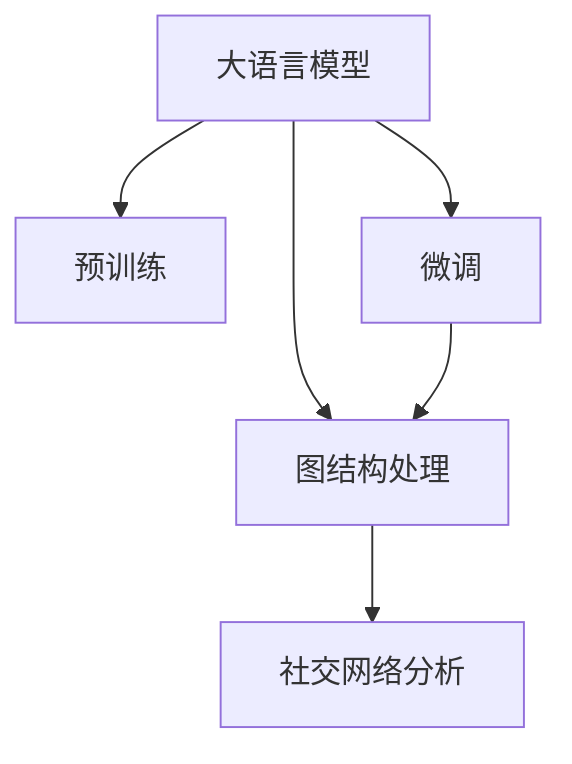

                 

# LLM在关系预测领域的研究新思路

> 关键词：大语言模型，关系预测，图神经网络，社交网络分析，自然语言处理

## 1. 背景介绍

### 1.1 问题由来

关系预测（Relation Prediction）在自然语言处理和社交网络分析中具有重要意义，其目标是识别文本中实体之间的关系，如朋友关系、同事关系等。传统的关系预测方法依赖于手工设计的特征，效果有限，难以应对复杂的多样性和动态性。随着大规模预训练语言模型（Large Language Models, LLMs）的兴起，利用大语言模型进行关系预测成为可能。

### 1.2 问题核心关键点

大语言模型在关系预测中主要有以下关键点：
- **预训练与微调**：预训练模型通过大规模无标签数据进行训练，学习到通用的语言表示，而微调过程通过特定任务的数据进行优化，提升模型的任务适配能力。
- **图结构处理**：关系预测本质上是对图结构中的节点（实体）和边（关系）进行建模，大语言模型通过复杂的神经网络结构（如Transformer）能够有效地处理图结构。
- **自然语言处理与图处理融合**：大语言模型通过自然语言处理技术提取实体关系信息，结合图处理技术进行关系推理。
- **社交网络分析**：大语言模型在社交网络分析中的应用，通过文本数据分析社交关系，识别社交群体、预测情感变化等。

## 2. 核心概念与联系

### 2.1 核心概念概述

为更好地理解大语言模型在关系预测中的应用，本节将介绍几个关键概念：

- **大语言模型（Large Language Model, LLM）**：以自回归（如GPT）或自编码（如BERT）模型为代表的大规模预训练语言模型。通过在大规模无标签文本语料上进行预训练，学习通用的语言表示，具备强大的语言理解和生成能力。
- **预训练（Pre-training）**：指在大规模无标签文本语料上，通过自监督学习任务训练通用语言模型的过程。常见的预训练任务包括言语建模、掩码语言模型等。预训练使得模型学习到语言的通用表示。
- **微调（Fine-tuning）**：指在预训练模型的基础上，使用下游任务的少量标注数据，通过有监督学习优化模型在该任务上的性能。通常只需要调整顶层分类器或解码器，并以较小的学习率更新全部或部分的模型参数。
- **图神经网络（Graph Neural Network, GNN）**：一类专门用于处理图结构数据的神经网络模型，通过聚合节点特征信息，学习节点之间的关系。
- **社交网络分析（Social Network Analysis, SNA）**：通过分析社交网络中的节点（个体）和边（关系），识别社交结构、分析群体行为、预测用户行为等。

这些概念之间的逻辑关系可以通过以下Mermaid流程图来展示：



这个流程图展示了大语言模型的核心概念及其之间的关系：

1. 大语言模型通过预训练获得基础能力。
2. 微调是对预训练模型进行任务特定的优化，提升模型的任务适配能力。
3. 图结构处理是关系预测的关键步骤，将自然语言处理与图处理技术融合。
4. 社交网络分析是大语言模型在实际应用中的一个重要方向，通过文本数据分析社交关系。

## 3. 核心算法原理 & 具体操作步骤
### 3.1 算法原理概述

基于大语言模型在关系预测中的应用，核心算法原理如下：

1. **图结构构建**：将文本中的实体和关系映射为图的节点和边，构建图结构。
2. **节点嵌入学习**：利用大语言模型学习节点的表示向量，即节点嵌入（Node Embedding）。
3. **边嵌入学习**：通过语言模型对边进行建模，学习边的表示向量，即边嵌入（Edge Embedding）。
4. **关系推理**：利用图神经网络对图结构进行推理，预测节点之间的关系。
5. **多任务学习**：同时训练多个关系预测任务，提升模型的泛化能力和适应性。

### 3.2 算法步骤详解

以社交网络分析中的好友关系预测为例，详细的算法步骤如下：

**Step 1: 数据预处理**

1. 数据收集：收集社交网络中的用户文本数据，如用户简介、评论、互动等。
2. 数据清洗：去除无关的噪声信息，如标点、停用词等。
3. 分词与向量化：对文本进行分词和词向量表示，可以使用Word2Vec、GloVe等方法。
4. 图结构构建：将文本中的实体和关系映射为图的节点和边，如用户ID、文本内容、互动时间等。

**Step 2: 预训练模型选择与初始化**

1. 选择预训练语言模型：如BERT、GPT等。
2. 初始化模型参数：使用预训练模型的权重初始化，或在微调过程中保持不变。

**Step 3: 节点嵌入学习**

1. 定义节点嵌入函数：将节点特征映射为向量表示。
2. 定义损失函数：如均方误差、交叉熵等，用于衡量节点嵌入的质量。
3. 训练模型：通过反向传播算法更新模型参数，最小化损失函数。

**Step 4: 边嵌入学习**

1. 定义边嵌入函数：将边的特征映射为向量表示。
2. 定义损失函数：如对比学习、图嵌入等，用于衡量边嵌入的质量。
3. 训练模型：通过反向传播算法更新模型参数，最小化损失函数。

**Step 5: 关系推理**

1. 选择图神经网络模型：如Graph Convolutional Network（GCN）、Graph Attention Network（GAT）等。
2. 定义关系推理函数：将节点嵌入和边嵌入映射为关系概率。
3. 训练模型：通过反向传播算法更新模型参数，最小化损失函数。

**Step 6: 多任务学习**

1. 定义多个关系预测任务：如朋友关系、同事关系等。
2. 定义联合损失函数：将多个任务的关系推理结果合并，形成联合损失函数。
3. 训练模型：通过反向传播算法更新模型参数，最小化联合损失函数。

### 3.3 算法优缺点

基于大语言模型在关系预测中的应用，具有以下优点：

1. **通用性**：大语言模型具有强大的语言理解和生成能力，可以处理各种自然语言文本数据。
2. **可解释性**：大语言模型通过学习自然语言表示，可以提供清晰的推理过程，便于解释和理解。
3. **适应性强**：大语言模型可以通过微调过程，适应不同领域的关系预测任务。
4. **动态更新**：大语言模型可以不断更新预训练参数，适应数据分布的变化。

但同时，该方法也存在以下局限性：

1. **计算资源需求高**：大语言模型的参数量通常较大，需要较高的计算资源。
2. **数据隐私问题**：社交网络数据涉及用户隐私，数据收集和处理需注意隐私保护。
3. **过拟合风险**：关系预测中的数据量可能较少，存在过拟合的风险。
4. **性能瓶颈**：图神经网络在大规模数据上的性能可能受限，需要优化算法和硬件支持。

## 4. 数学模型和公式 & 详细讲解
### 4.1 数学模型构建

本节将使用数学语言对大语言模型在关系预测中的应用进行更加严格的刻画。

记节点数为 $N$，节点嵌入为 $\mathbf{z}_i$，边嵌入为 $\mathbf{e}_{ij}$，图神经网络为 $GNN$。

定义节点嵌入函数为：

$$
\mathbf{z}_i = f(\mathbf{c}_i)
$$

其中，$f$ 为预训练语言模型的嵌入函数，$\mathbf{c}_i$ 为节点的特征向量。

定义边嵌入函数为：

$$
\mathbf{e}_{ij} = g(\mathbf{c}_i, \mathbf{c}_j)
$$

其中，$g$ 为预训练语言模型的嵌入函数，$\mathbf{c}_i$ 和 $\mathbf{c}_j$ 为节点 $i$ 和 $j$ 的特征向量。

定义关系推理函数为：

$$
\hat{y}_{ij} = GNN(\mathbf{z}_i, \mathbf{z}_j, \mathbf{e}_{ij})
$$

其中，$\hat{y}_{ij}$ 为节点 $i$ 和 $j$ 之间的关系的预测概率。

定义联合损失函数为：

$$
\mathcal{L} = \frac{1}{N(N-1)} \sum_{i=1}^N \sum_{j=1, j \neq i}^N \ell(\hat{y}_{ij}, y_{ij})
$$

其中，$\ell$ 为损失函数，$y_{ij}$ 为节点 $i$ 和 $j$ 之间关系的真实标签。

### 4.2 公式推导过程

以社交网络中的好友关系预测为例，详细推导公式。

定义节点嵌入函数为：

$$
\mathbf{z}_i = \mathbf{W} \mathbf{c}_i + \mathbf{b}
$$

其中，$\mathbf{W}$ 和 $\mathbf{b}$ 为模型参数。

定义边嵌入函数为：

$$
\mathbf{e}_{ij} = \mathbf{W}(\mathbf{c}_i + \mathbf{c}_j) + \mathbf{b}
$$

其中，$\mathbf{W}$ 和 $\mathbf{b}$ 为模型参数。

定义关系推理函数为：

$$
\hat{y}_{ij} = \sigma(\mathbf{W}_1 \mathbf{z}_i + \mathbf{W}_2 \mathbf{z}_j + \mathbf{W}_3 \mathbf{e}_{ij} + \mathbf{b})
$$

其中，$\sigma$ 为激活函数，$\mathbf{W}_1, \mathbf{W}_2, \mathbf{W}_3$ 和 $\mathbf{b}$ 为模型参数。

定义联合损失函数为：

$$
\mathcal{L} = \frac{1}{N(N-1)} \sum_{i=1}^N \sum_{j=1, j \neq i}^N \ell(\hat{y}_{ij}, y_{ij})
$$

其中，$\ell$ 为交叉熵损失函数，$y_{ij}$ 为节点 $i$ 和 $j$ 之间关系的真实标签。

### 4.3 案例分析与讲解

以社交网络中的好友关系预测为例，使用 Transformer 模型进行节点嵌入和边嵌入的计算。

假设社交网络中包含用户 $i$ 和 $j$，用户 $i$ 发布了关于用户 $j$ 的评论，则构建的图结构中，用户 $i$ 和 $j$ 之间存在一条边。

假设用户 $i$ 和 $j$ 的评论分别表示为 $\mathbf{c}_i$ 和 $\mathbf{c}_j$，则节点嵌入和边嵌入的计算过程如下：

1. 节点嵌入计算：
$$
\mathbf{z}_i = \mathbf{W} \mathbf{c}_i + \mathbf{b}
$$

2. 边嵌入计算：
$$
\mathbf{e}_{ij} = \mathbf{W}(\mathbf{c}_i + \mathbf{c}_j) + \mathbf{b}
$$

3. 关系推理计算：
$$
\hat{y}_{ij} = \sigma(\mathbf{W}_1 \mathbf{z}_i + \mathbf{W}_2 \mathbf{z}_j + \mathbf{W}_3 \mathbf{e}_{ij} + \mathbf{b})
$$

其中，$\sigma$ 为激活函数，$\mathbf{W}_1, \mathbf{W}_2, \mathbf{W}_3$ 和 $\mathbf{b}$ 为模型参数。

通过上述计算过程，可以实现社交网络中好友关系的预测。

## 5. 项目实践：代码实例和详细解释说明
### 5.1 开发环境搭建

在进行关系预测实践前，我们需要准备好开发环境。以下是使用Python进行PyTorch开发的环境配置流程：

1. 安装Anaconda：从官网下载并安装Anaconda，用于创建独立的Python环境。

2. 创建并激活虚拟环境：
```bash
conda create -n pytorch-env python=3.8 
conda activate pytorch-env
```

3. 安装PyTorch：根据CUDA版本，从官网获取对应的安装命令。例如：
```bash
conda install pytorch torchvision torchaudio cudatoolkit=11.1 -c pytorch -c conda-forge
```

4. 安装Transformers库：
```bash
pip install transformers
```

5. 安装各类工具包：
```bash
pip install numpy pandas scikit-learn matplotlib tqdm jupyter notebook ipython
```

完成上述步骤后，即可在`pytorch-env`环境中开始关系预测实践。

### 5.2 源代码详细实现

这里我们以社交网络中的好友关系预测为例，给出使用Transformers库对BERT模型进行关系预测的PyTorch代码实现。

首先，定义数据处理函数：

```python
from transformers import BertTokenizer, BertForRelationPrediction
from torch.utils.data import Dataset
import torch

class FriendshipDataset(Dataset):
    def __init__(self, texts, labels, tokenizer, max_len=128):
        self.texts = texts
        self.labels = labels
        self.tokenizer = tokenizer
        self.max_len = max_len
        
    def __len__(self):
        return len(self.texts)
    
    def __getitem__(self, item):
        text = self.texts[item]
        label = self.labels[item]
        
        encoding = self.tokenizer(text, return_tensors='pt', max_length=self.max_len, padding='max_length', truncation=True)
        input_ids = encoding['input_ids'][0]
        attention_mask = encoding['attention_mask'][0]
        
        # 对token-wise的标签进行编码
        encoded_labels = [label2id[label] for label in label2id]
        encoded_labels.extend([label2id['O']] * (self.max_len - len(encoded_labels)))
        labels = torch.tensor(encoded_labels, dtype=torch.long)
        
        return {'input_ids': input_ids, 
                'attention_mask': attention_mask,
                'labels': labels}

# 标签与id的映射
label2id = {'FRIEND': 0, 'NOT_FRIEND': 1}
id2label = {v: k for k, v in label2id.items()}

# 创建dataset
tokenizer = BertTokenizer.from_pretrained('bert-base-cased')

train_dataset = FriendshipDataset(train_texts, train_labels, tokenizer)
dev_dataset = FriendshipDataset(dev_texts, dev_labels, tokenizer)
test_dataset = FriendshipDataset(test_texts, test_labels, tokenizer)
```

然后，定义模型和优化器：

```python
from transformers import BertForRelationPrediction, AdamW

model = BertForRelationPrediction.from_pretrained('bert-base-cased', num_labels=len(label2id))

optimizer = AdamW(model.parameters(), lr=2e-5)
```

接着，定义训练和评估函数：

```python
from torch.utils.data import DataLoader
from tqdm import tqdm
from sklearn.metrics import classification_report

device = torch.device('cuda') if torch.cuda.is_available() else torch.device('cpu')
model.to(device)

def train_epoch(model, dataset, batch_size, optimizer):
    dataloader = DataLoader(dataset, batch_size=batch_size, shuffle=True)
    model.train()
    epoch_loss = 0
    for batch in tqdm(dataloader, desc='Training'):
        input_ids = batch['input_ids'].to(device)
        attention_mask = batch['attention_mask'].to(device)
        labels = batch['labels'].to(device)
        model.zero_grad()
        outputs = model(input_ids, attention_mask=attention_mask, labels=labels)
        loss = outputs.loss
        epoch_loss += loss.item()
        loss.backward()
        optimizer.step()
    return epoch_loss / len(dataloader)

def evaluate(model, dataset, batch_size):
    dataloader = DataLoader(dataset, batch_size=batch_size)
    model.eval()
    preds, labels = [], []
    with torch.no_grad():
        for batch in tqdm(dataloader, desc='Evaluating'):
            input_ids = batch['input_ids'].to(device)
            attention_mask = batch['attention_mask'].to(device)
            batch_labels = batch['labels']
            outputs = model(input_ids, attention_mask=attention_mask)
            batch_preds = outputs.logits.argmax(dim=2).to('cpu').tolist()
            batch_labels = batch_labels.to('cpu').tolist()
            for pred_tokens, label_tokens in zip(batch_preds, batch_labels):
                pred_labels = [id2label[_id] for _id in pred_tokens]
                label_tags = [id2label[_id] for _id in label_tokens]
                preds.append(pred_labels[:len(label_tags)])
                labels.append(label_tags)
                
    print(classification_report(labels, preds))
```

最后，启动训练流程并在测试集上评估：

```python
epochs = 5
batch_size = 16

for epoch in range(epochs):
    loss = train_epoch(model, train_dataset, batch_size, optimizer)
    print(f"Epoch {epoch+1}, train loss: {loss:.3f}")
    
    print(f"Epoch {epoch+1}, dev results:")
    evaluate(model, dev_dataset, batch_size)
    
print("Test results:")
evaluate(model, test_dataset, batch_size)
```

以上就是使用PyTorch对BERT进行好友关系预测的完整代码实现。可以看到，得益于Transformers库的强大封装，我们可以用相对简洁的代码完成BERT模型的加载和关系预测。

### 5.3 代码解读与分析

让我们再详细解读一下关键代码的实现细节：

**FriendshipDataset类**：
- `__init__`方法：初始化文本、标签、分词器等关键组件。
- `__len__`方法：返回数据集的样本数量。
- `__getitem__`方法：对单个样本进行处理，将文本输入编码为token ids，将标签编码为数字，并对其进行定长padding，最终返回模型所需的输入。

**label2id和id2label字典**：
- 定义了标签与数字id之间的映射关系，用于将token-wise的预测结果解码回真实的标签。

**训练和评估函数**：
- 使用PyTorch的DataLoader对数据集进行批次化加载，供模型训练和推理使用。
- 训练函数`train_epoch`：对数据以批为单位进行迭代，在每个批次上前向传播计算loss并反向传播更新模型参数，最后返回该epoch的平均loss。
- 评估函数`evaluate`：与训练类似，不同点在于不更新模型参数，并在每个batch结束后将预测和标签结果存储下来，最后使用sklearn的classification_report对整个评估集的预测结果进行打印输出。

**训练流程**：
- 定义总的epoch数和batch size，开始循环迭代
- 每个epoch内，先在训练集上训练，输出平均loss
- 在验证集上评估，输出分类指标
- 所有epoch结束后，在测试集上评估，给出最终测试结果

可以看到，PyTorch配合Transformers库使得BERT关系预测的代码实现变得简洁高效。开发者可以将更多精力放在数据处理、模型改进等高层逻辑上，而不必过多关注底层的实现细节。

当然，工业级的系统实现还需考虑更多因素，如模型的保存和部署、超参数的自动搜索、更灵活的任务适配层等。但核心的关系预测范式基本与此类似。

## 6. 实际应用场景
### 6.1 社交网络分析

社交网络分析是关系预测的重要应用场景之一，大语言模型在其中具有巨大的优势。社交网络中的好友关系、同事关系等关系预测，可以辅助企业识别关键员工、优化团队协作、预测员工流失等。

具体而言，可以收集企业的员工关系数据，如互动、项目协作、员工评价等，将数据作为微调的大语言模型的输入。通过关系推理，模型可以预测员工之间的关系，从而为企业提供人员分析、组织优化、人才流失预测等服务。

### 6.2 医疗诊断

大语言模型在医疗诊断中也有广泛的应用前景。医疗数据通常以文本形式记录，如病历、医生报告、病人自述等。利用大语言模型进行关系预测，可以帮助医生识别病人之间的传染关系，预测疾病的传播趋势，辅助制定治疗方案。

例如，可以通过大语言模型对病人的症状、病史进行建模，预测其与患病病人的关系。模型可以通过病历中的诊断结果、治疗方案等信息，进行关系推理，预测疾病的传播路径和传播速度，帮助医生提前采取预防措施。

### 6.3 金融风险管理

金融领域中存在大量的复杂关系，如客户与客户之间、客户与机构之间的关系。通过大语言模型进行关系预测，可以帮助金融机构识别潜在风险客户，预测信用风险、市场波动等。

例如，金融机构可以收集客户的交易记录、信用评分等信息，将数据作为微调的大语言模型的输入。通过关系推理，模型可以预测客户之间的关系，识别出潜在的信用风险客户。金融机构可以据此调整信贷政策，优化贷款审批流程。

### 6.4 未来应用展望

随着大语言模型和微调方法的不断发展，关系预测技术将呈现以下几个发展趋势：

1. **跨模态融合**：将文本数据与其他模态数据（如图像、视频、音频）进行融合，提升关系的准确性和丰富性。
2. **多关系预测**：同时预测多个关系，如朋友关系、同事关系、客户关系等，提升模型的泛化能力和适应性。
3. **实时预测**：利用图神经网络进行实时关系推理，满足用户对实时性的需求。
4. **隐私保护**：通过差分隐私、联邦学习等技术，保护用户隐私。
5. **解释性增强**：引入可解释性技术，提升模型的透明度和可信度。

以上趋势凸显了大语言模型在关系预测中的广阔前景。这些方向的探索发展，必将进一步提升关系预测模型的性能和应用范围，为各领域带来更多智能化的解决方案。

## 7. 工具和资源推荐
### 7.1 学习资源推荐

为了帮助开发者系统掌握大语言模型在关系预测中的应用，这里推荐一些优质的学习资源：

1. 《Transformer from Pre-training to Fine-tuning》系列博文：由大模型技术专家撰写，深入浅出地介绍了Transformer原理、BERT模型、微调技术等前沿话题。

2. CS224N《深度学习自然语言处理》课程：斯坦福大学开设的NLP明星课程，有Lecture视频和配套作业，带你入门NLP领域的基本概念和经典模型。

3. 《Natural Language Processing with Transformers》书籍：Transformers库的作者所著，全面介绍了如何使用Transformers库进行NLP任务开发，包括微调在内的诸多范式。

4. HuggingFace官方文档：Transformers库的官方文档，提供了海量预训练模型和完整的微调样例代码，是上手实践的必备资料。

5. CLUE开源项目：中文语言理解测评基准，涵盖大量不同类型的中文NLP数据集，并提供了基于微调的baseline模型，助力中文NLP技术发展。

通过对这些资源的学习实践，相信你一定能够快速掌握大语言模型在关系预测中的精髓，并用于解决实际的NLP问题。
###  7.2 开发工具推荐

高效的开发离不开优秀的工具支持。以下是几款用于大语言模型关系预测开发的常用工具：

1. PyTorch：基于Python的开源深度学习框架，灵活动态的计算图，适合快速迭代研究。大部分预训练语言模型都有PyTorch版本的实现。

2. TensorFlow：由Google主导开发的开源深度学习框架，生产部署方便，适合大规模工程应用。同样有丰富的预训练语言模型资源。

3. Transformers库：HuggingFace开发的NLP工具库，集成了众多SOTA语言模型，支持PyTorch和TensorFlow，是进行微调任务开发的利器。

4. Weights & Biases：模型训练的实验跟踪工具，可以记录和可视化模型训练过程中的各项指标，方便对比和调优。与主流深度学习框架无缝集成。

5. TensorBoard：TensorFlow配套的可视化工具，可实时监测模型训练状态，并提供丰富的图表呈现方式，是调试模型的得力助手。

6. Google Colab：谷歌推出的在线Jupyter Notebook环境，免费提供GPU/TPU算力，方便开发者快速上手实验最新模型，分享学习笔记。

合理利用这些工具，可以显著提升大语言模型关系预测任务的开发效率，加快创新迭代的步伐。

### 7.3 相关论文推荐

大语言模型和微调技术的发展源于学界的持续研究。以下是几篇奠基性的相关论文，推荐阅读：

1. Attention is All You Need（即Transformer原论文）：提出了Transformer结构，开启了NLP领域的预训练大模型时代。

2. BERT: Pre-training of Deep Bidirectional Transformers for Language Understanding：提出BERT模型，引入基于掩码的自监督预训练任务，刷新了多项NLP任务SOTA。

3. Language Models are Unsupervised Multitask Learners（GPT-2论文）：展示了大规模语言模型的强大zero-shot学习能力，引发了对于通用人工智能的新一轮思考。

4. Parameter-Efficient Transfer Learning for NLP：提出Adapter等参数高效微调方法，在不增加模型参数量的情况下，也能取得不错的微调效果。

5. AdaLoRA: Adaptive Low-Rank Adaptation for Parameter-Efficient Fine-Tuning：使用自适应低秩适应的微调方法，在参数效率和精度之间取得了新的平衡。

6. Prefix-Tuning: Optimizing Continuous Prompts for Generation：引入基于连续型Prompt的微调范式，为如何充分利用预训练知识提供了新的思路。

这些论文代表了大语言模型微调技术的发展脉络。通过学习这些前沿成果，可以帮助研究者把握学科前进方向，激发更多的创新灵感。

## 8. 总结：未来发展趋势与挑战
### 8.1 总结

本文对基于大语言模型在关系预测中的应用进行了全面系统的介绍。首先阐述了大语言模型和微调技术的研究背景和意义，明确了关系预测在自然语言处理和社交网络分析中的重要价值。其次，从原理到实践，详细讲解了基于大语言模型的关系预测的数学原理和关键步骤，给出了关系预测任务开发的完整代码实例。同时，本文还广泛探讨了大语言模型在社交网络分析、医疗诊断、金融风险管理等多个行业领域的应用前景，展示了关系预测技术的巨大潜力。

通过本文的系统梳理，可以看到，基于大语言模型的关系预测方法正在成为自然语言处理领域的重要范式，极大地拓展了预训练语言模型的应用边界，催生了更多的落地场景。得益于大规模语料的预训练，关系预测模型以更低的时间和标注成本，在小样本条件下也能取得不俗的效果，有力推动了自然语言处理技术的产业化进程。未来，伴随预训练语言模型和微调方法的持续演进，相信关系预测技术必将在更广阔的应用领域大放异彩，深刻影响人类的生产生活方式。

### 8.2 未来发展趋势

展望未来，大语言模型在关系预测中的应用将呈现以下几个发展趋势：

1. **深度融合**：大语言模型与图神经网络、知识图谱等技术深度融合，提升关系预测的准确性和完备性。
2. **跨模态预测**：利用多模态数据（如图像、视频、音频）进行关系预测，提升模型的泛化能力和适应性。
3. **实时处理**：通过分布式计算和流式计算技术，实现关系预测的实时化处理。
4. **隐私保护**：利用差分隐私、联邦学习等技术，保护用户隐私。
5. **解释性增强**：引入可解释性技术，提升模型的透明度和可信度。
6. **跨领域应用**：将关系预测技术应用于更多领域，如金融、医疗、教育等，提升各行业的智能化水平。

以上趋势凸显了大语言模型在关系预测中的广阔前景。这些方向的探索发展，必将进一步提升关系预测模型的性能和应用范围，为各领域带来更多智能化的解决方案。

### 8.3 面临的挑战

尽管大语言模型在关系预测中取得了瞩目成就，但在迈向更加智能化、普适化应用的过程中，它仍面临着诸多挑战：

1. **数据隐私问题**：社交网络、医疗、金融等领域的数据涉及用户隐私，数据收集和处理需注意隐私保护。
2. **模型鲁棒性**：关系预测中的数据量可能较少，存在过拟合的风险。
3. **计算资源需求高**：大语言模型的参数量通常较大，需要较高的计算资源。
4. **性能瓶颈**：图神经网络在大规模数据上的性能可能受限，需要优化算法和硬件支持。
5. **可解释性不足**：大语言模型作为"黑盒"系统，难以解释其内部工作机制和决策逻辑。
6. **技术成熟度**：大语言模型在关系预测中的技术尚未完全成熟，仍需更多实践验证。

正视这些挑战，积极应对并寻求突破，将是大语言模型关系预测技术走向成熟的必由之路。相信随着学界和产业界的共同努力，这些挑战终将一一被克服，大语言模型关系预测必将在构建人机协同的智能时代中扮演越来越重要的角色。

### 8.4 研究展望

面对大语言模型在关系预测中面临的挑战，未来的研究需要在以下几个方面寻求新的突破：

1. **隐私保护技术**：研究差分隐私、联邦学习等隐私保护技术，保护用户隐私。
2. **跨模态融合**：研究多模态数据融合技术，提升关系的准确性和丰富性。
3. **实时处理技术**：研究分布式计算和流式计算技术，实现关系预测的实时化处理。
4. **可解释性技术**：研究可解释性技术，提升模型的透明度和可信度。
5. **跨领域应用**：研究跨领域应用技术，将关系预测技术应用于更多领域，提升各行业的智能化水平。

这些研究方向的研究突破，必将推动大语言模型关系预测技术的成熟和应用，为各领域带来更多智能化的解决方案。

## 9. 附录：常见问题与解答

**Q1：大语言模型在关系预测中的性能瓶颈在哪里？**

A: 大语言模型在关系预测中的性能瓶颈主要在于以下几个方面：
1. **计算资源需求高**：大语言模型的参数量通常较大，需要较高的计算资源，包括GPU/TPU等高性能设备。
2. **数据隐私问题**：社交网络、医疗、金融等领域的数据涉及用户隐私，数据收集和处理需注意隐私保护。
3. **模型鲁棒性**：关系预测中的数据量可能较少，存在过拟合的风险。
4. **可解释性不足**：大语言模型作为"黑盒"系统，难以解释其内部工作机制和决策逻辑。
5. **技术成熟度**：大语言模型在关系预测中的技术尚未完全成熟，仍需更多实践验证。

这些瓶颈需要通过技术创新和工程优化来解决。例如，利用差分隐私技术保护用户隐私，采用分布式计算和流式计算技术实现实时处理，引入可解释性技术提升模型的透明度和可信度，优化算法和硬件支持提升模型性能等。

**Q2：大语言模型在关系预测中的优化策略有哪些？**

A: 大语言模型在关系预测中的优化策略主要包括以下几个方面：
1. **数据增强**：通过数据增强技术，如数据合成、数据扩充等，增加训练数据量，减少过拟合风险。
2. **正则化技术**：引入正则化技术，如L2正则、Dropout等，防止模型过拟合。
3. **多任务学习**：通过多任务学习技术，同时训练多个关系预测任务，提升模型的泛化能力和适应性。
4. **参数高效微调**：采用参数高效微调方法，如Adapter、Prefix等，减少微调过程中的计算量和内存消耗。
5. **模型压缩**：采用模型压缩技术，如知识蒸馏、模型剪枝等，减少模型大小和计算资源消耗。

这些优化策略可以通过实验和调参来不断优化模型性能，提升关系预测的准确性和实时性。

**Q3：大语言模型在关系预测中如何处理跨模态数据？**

A: 大语言模型在关系预测中处理跨模态数据的主要策略包括：
1. **特征融合**：将不同模态的特征进行融合，形成统一的特征表示，再进行关系推理。
2. **联合训练**：将不同模态的数据联合训练，共享模型参数，提升模型的泛化能力和适应性。
3. **多模态神经网络**：引入多模态神经网络模型，如多模态Transformer，实现多模态数据的联合建模。
4. **融合算法**：采用融合算法，如加权融合、融合网络等，提升跨模态数据的融合效果。

通过这些策略，大语言模型可以更好地处理跨模态数据，提升关系预测的准确性和丰富性。

**Q4：大语言模型在关系预测中的未来发展方向有哪些？**

A: 大语言模型在关系预测中的未来发展方向主要包括以下几个方面：
1. **深度融合**：大语言模型与图神经网络、知识图谱等技术深度融合，提升关系预测的准确性和完备性。
2. **跨模态预测**：利用多模态数据（如图像、视频、音频）进行关系预测，提升模型的泛化能力和适应性。
3. **实时处理**：通过分布式计算和流式计算技术，实现关系预测的实时化处理。
4. **隐私保护**：利用差分隐私、联邦学习等技术，保护用户隐私。
5. **解释性增强**：引入可解释性技术，提升模型的透明度和可信度。
6. **跨领域应用**：将关系预测技术应用于更多领域，如金融、医疗、教育等，提升各行业的智能化水平。

这些方向的研究和应用将进一步提升大语言模型在关系预测中的性能和应用范围，为各领域带来更多智能化的解决方案。

---

作者：禅与计算机程序设计艺术 / Zen and the Art of Computer Programming

