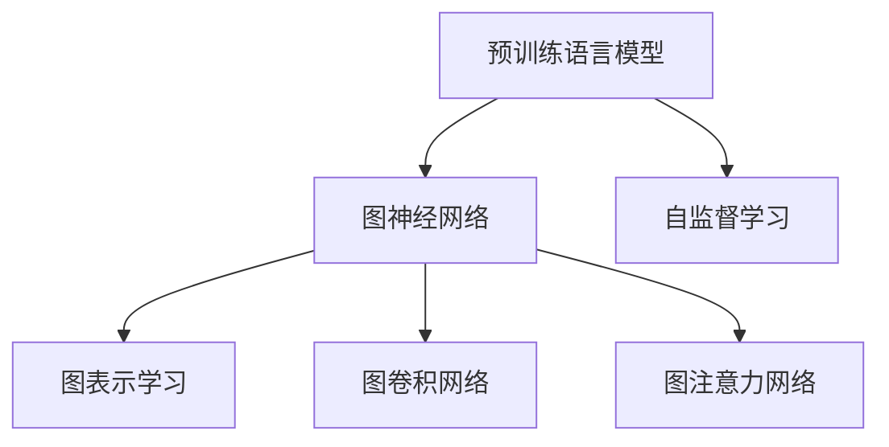

                 

# LLM在推荐系统中的图神经网络应用

## 1. 背景介绍

### 1.1 问题由来

推荐系统在电商、社交、内容娱乐等互联网行业广泛应用，帮助用户发现更多感兴趣的物品。传统推荐系统主要依赖用户历史行为数据，通过协同过滤、基于内容的推荐等方法预测用户可能感兴趣的物品，但难以解决长尾物品和冷启动问题。

近年来，基于深度学习的推荐系统开始兴起。这类推荐系统主要基于用户和物品的特征表示，通过预训练模型学习用户兴趣和物品属性，在二者间建立映射关系，生成推荐列表。但是，此类系统通常难以处理复杂的社交关系和用户个性化需求，缺乏用户行为模型和上下文感知能力。

近期，预训练语言模型(LLM)开始在推荐系统中得到了广泛应用，特别是基于图神经网络的LLM模型。图神经网络(Graph Neural Network, GNN)是一种专门处理图数据的神经网络，可以建模用户、物品之间的复杂关系，有效提升推荐系统的性能。

### 1.2 问题核心关键点

基于LLM的图神经网络推荐系统的主要目标是通过语言模型学习用户与物品的语义表示，再通过图神经网络对关系进行建模和融合，最终生成推荐列表。

核心问题包括：

1. 如何构建用户-物品的语义图？
2. 如何利用预训练语言模型学习用户和物品的语义表示？
3. 如何将语义表示与图结构结合，建模用户与物品间的复杂关系？
4. 如何在图结构上应用图神经网络，生成推荐列表？

解决这些问题需要理解LLM的预训练原理、图神经网络的建模能力，并探索二者结合的策略。

## 2. 核心概念与联系

### 2.1 核心概念概述

为更好地理解基于LLM的图神经网络推荐系统，本节将介绍几个密切相关的核心概念：

- 预训练语言模型(LLM)：如GPT、BERT等，通过大规模语料进行自监督预训练，学习自然语言表示能力。

- 图神经网络(GNN)：专门用于处理图结构数据的神经网络，通过学习节点间的邻居关系，提升图数据的表示能力。

- 自监督学习：通过无标签数据自动学习特征表示，广泛应用于预训练语言模型中。

- 图表示学习：在图数据上应用神经网络，学习图数据的表示能力，图神经网络即为此类方法的代表。

- 图卷积网络(GCN)：一种常见的图神经网络，利用图卷积操作将图数据转换为节点特征向量，便于神经网络处理。

- 图注意力网络(GAT)：另一种流行的图神经网络，通过节点间的注意力机制，学习节点间的相似度。

这些核心概念之间的逻辑关系可以通过以下Mermaid流程图来展示：



这个流程图展示了大语言模型、图神经网络和自监督学习三者的关系：

1. 预训练语言模型通过自监督学习获取语义表示能力。
2. 图神经网络利用图表示学习获取图数据表示能力。
3. 结合图卷积和图注意力机制，提升图数据的表示能力。

这些概念共同构成了基于LLM的图神经网络推荐系统的核心框架，使其能够在复杂的社交和推荐场景下，生成精准的推荐结果。

## 3. 核心算法原理 & 具体操作步骤
### 3.1 算法原理概述

基于LLM的图神经网络推荐系统的核心思想是，通过预训练语言模型学习用户与物品的语义表示，再通过图神经网络建模复杂关系，生成推荐列表。其核心步骤如下：

1. 在预训练语言模型上，通过自监督学习任务获得用户和物品的语义表示。
2. 利用图卷积或图注意力网络，构建用户-物品的语义图，学习节点间的语义关系。
3. 在图神经网络模型上，通过多跳关系传播，对用户和物品的语义表示进行融合，生成推荐列表。

具体地，算法分为预训练、图构建和推荐三个步骤：

1. 预训练步骤：利用大规模无标签文本语料，训练预训练语言模型，学习用户和物品的语义表示。
2. 图构建步骤：根据用户历史行为数据，构建用户与物品的语义图，标记用户-物品之间的语义关系。
3. 推荐步骤：利用图神经网络，对用户-物品语义图进行多跳关系传播，生成推荐列表。

### 3.2 算法步骤详解

#### 3.2.1 预训练步骤

预训练步骤的目标是学习用户和物品的语义表示。常见的方法包括：

1. 利用大规模无标签文本语料，通过自监督任务训练预训练语言模型。如Bert、GPT等。
2. 在预训练语言模型上，利用用户-物品标签对，进行有监督微调，获得更加精准的用户和物品表示。
3. 在微调过程中，可以通过加入对抗训练、正则化等技术，提高模型的鲁棒性和泛化能力。

#### 3.2.2 图构建步骤

图构建步骤的目标是构建用户-物品的语义图。常见的方法包括：

1. 收集用户历史行为数据，如浏览、点击、评分等，构建用户与物品的交互图。
2. 利用图卷积网络或图注意力网络，将用户和物品的语义表示映射为图节点特征。
3. 在图结构上，通过多跳关系传播，学习用户和物品之间的语义关系。

#### 3.2.3 推荐步骤

推荐步骤的目标是生成推荐列表。常见的方法包括：

1. 在图神经网络模型上，利用多跳关系传播，对用户和物品的语义表示进行融合。
2. 通过注意力机制，选择对用户最相关的物品，生成推荐列表。
3. 通过进一步的优化，如排序、过滤等，提高推荐列表的质量。

### 3.3 算法优缺点

基于LLM的图神经网络推荐系统具有以下优点：

1. 学习能力强：LLM具备强大的语义表示能力，可以捕捉丰富的用户和物品特征。
2. 泛化能力强：利用大规模预训练数据，可以在不同领域和场景下进行迁移学习。
3. 表现优秀：在电商、社交、内容娱乐等多个领域，基于LLM的图神经网络推荐系统均取得优异的推荐效果。

同时，该方法也存在一定的局限性：

1. 数据需求高：需要大量的用户行为数据和文本数据进行预训练和微调。
2. 计算复杂度高：由于数据量和模型规模的增大，计算成本高，资源消耗大。
3. 可解释性差：模型内部的决策逻辑难以解释，难以进行调试和优化。

尽管存在这些局限性，但就目前而言，基于LLM的图神经网络推荐系统仍然是大规模推荐系统的重要范式。未来相关研究的重点在于如何进一步降低数据需求，提高模型的可解释性和计算效率，同时兼顾泛化能力和表现力。

### 3.4 算法应用领域

基于LLM的图神经网络推荐系统已经在电商、社交、内容娱乐等多个领域得到了广泛应用，具体如下：

- 电商推荐：帮助电商用户发现更多感兴趣的商品，提升用户体验和购物转化率。
- 社交推荐：为社交网络用户推荐更多兴趣相投的内容，增强平台粘性和用户留存率。
- 视频推荐：为视频平台用户推荐更多感兴趣的影片，提升内容消费量和观看时长。
- 音乐推荐：为用户推荐更多喜欢的音乐，提升平台的用户体验和黏性。

除了上述这些经典应用外，基于LLM的图神经网络推荐系统还广泛应用于在线旅游、图书推荐、游戏推荐等场景中，为不同行业提供个性化的推荐服务。随着推荐技术的不断进步，未来该技术还将覆盖更多领域，推动各行业的数字化转型升级。

## 4. 数学模型和公式 & 详细讲解 & 举例说明
### 4.1 数学模型构建

本节将使用数学语言对基于LLM的图神经网络推荐系统进行更加严格的刻画。

记用户集合为 $U$，物品集合为 $I$。利用预训练语言模型 $M_{\theta}$，学习用户 $u$ 和物品 $i$ 的语义表示 $h_u$ 和 $h_i$。假设用户 $u$ 和物品 $i$ 之间的交互关系为 $\{(u_i,v_i)\}_{i=1}^N$，其中 $u_i \in U$，$v_i \in I$。构建用户与物品的语义图 $G=(U,I,E)$，其中 $E=\{(u_i,v_i)\}_{i=1}^N$。

定义图神经网络模型 $N_G$，通过多跳关系传播，对用户和物品的语义表示进行融合。在图卷积网络(GCN)中，用户 $u$ 的表示 $h_u^{(l+1)}$ 可以通过如下公式计算：

$$
h_u^{(l+1)} = \sum_{v_i \in N(u_i)} \frac{1}{\sqrt{d_u d_v}} h_{u_i} W_1 h_{v_i} W_2
$$

其中 $W_1$ 和 $W_2$ 为可学习的矩阵，$d_u$ 和 $d_v$ 分别为用户 $u$ 和物品 $v$ 的度数。

在图注意力网络(GAT)中，用户 $u$ 的表示 $h_u^{(l+1)}$ 可以通过如下公式计算：

$$
h_u^{(l+1)} = \sum_{v_i \in N(u_i)} \alpha_{u_i}^{(l)} h_{u_i} W_1 h_{v_i} W_2
$$

其中 $\alpha_{u_i}^{(l)}$ 为节点间的注意力权重，可以表示为：

$$
\alpha_{u_i}^{(l)} = \frac{\exp\left(\mathbf{e}_{u_i}^{(l)}\mathbf{W}_a\right)}{\sum_{v_j \in N(u_j)}\exp\left(\mathbf{e}_{u_j}^{(l)}\mathbf{W}_a\right)}
$$

其中 $\mathbf{e}_{u_i}^{(l)}$ 为节点间的边向量，$\mathbf{W}_a$ 为可学习的注意力权重矩阵。

### 4.2 公式推导过程

在图卷积网络中，用户 $u$ 的表示 $h_u^{(l+1)}$ 的推导过程如下：

1. 首先，将用户 $u$ 的语义表示 $h_u$ 和物品 $v_i$ 的语义表示 $h_{v_i}$ 进行拼接，得到边向量 $\mathbf{e}_{u_i} = [h_u, h_{v_i}]$。
2. 然后，通过线性变换 $\mathbf{e}_{u_i} \mathbf{W}_1$，得到边向量 $\mathbf{e}_{u_i}^{(l)}$。
3. 通过节点 $u$ 和物品 $v_i$ 的度数，计算节点间的注意力权重 $\alpha_{u_i}^{(l)}$。
4. 最后，对所有物品 $v_i$ 的语义表示 $h_{v_i}$ 进行加权求和，得到用户 $u$ 的表示 $h_u^{(l+1)}$。

在图注意力网络中，用户 $u$ 的表示 $h_u^{(l+1)}$ 的推导过程类似。主要区别在于，节点间注意力权重 $\alpha_{u_i}^{(l)}$ 是通过节点间的边向量 $\mathbf{e}_{u_i}^{(l)}$ 计算得到的，从而赋予重要的物品更多的权重。

### 4.3 案例分析与讲解

考虑一个简单的电商推荐场景，用户 $u$ 对物品 $i$ 进行评分，得到用户-物品交互图 $G=(U,I,E)$。假设用户 $u$ 和物品 $i$ 的语义表示 $h_u$ 和 $h_i$ 已经通过预训练语言模型学习得到。利用图卷积网络进行多跳关系传播，得到用户 $u$ 的表示 $h_u^{(l+1)}$。

在图卷积网络中，用户 $u$ 的表示 $h_u^{(l+1)}$ 的计算如下：

$$
h_u^{(l+1)} = \sum_{v_i \in N(u_i)} \frac{1}{\sqrt{d_u d_v}} h_{u_i} W_1 h_{v_i} W_2
$$

其中，$N(u_i)$ 为节点 $u_i$ 的邻居节点集合，$d_u$ 和 $d_v$ 分别为节点 $u$ 和节点 $v$ 的度数。在实际应用中，可以通过节点间的边向量 $\mathbf{e}_{u_i}^{(l)} = [h_u, h_{v_i}]$ 进行计算。

在图注意力网络中，用户 $u$ 的表示 $h_u^{(l+1)}$ 的计算如下：

$$
h_u^{(l+1)} = \sum_{v_i \in N(u_i)} \alpha_{u_i}^{(l)} h_{u_i} W_1 h_{v_i} W_2
$$

其中，$\alpha_{u_i}^{(l)}$ 为节点间的注意力权重，可以表示为：

$$
\alpha_{u_i}^{(l)} = \frac{\exp\left(\mathbf{e}_{u_i}^{(l)}\mathbf{W}_a\right)}{\sum_{v_j \in N(u_j)}\exp\left(\mathbf{e}_{u_j}^{(l)}\mathbf{W}_a\right)}
$$

其中，$\mathbf{e}_{u_i}^{(l)} = [h_u, h_{v_i}]$，$\mathbf{W}_a$ 为可学习的注意力权重矩阵。在实际应用中，可以通过节点间的边向量 $\mathbf{e}_{u_i}^{(l)}$ 进行计算。

通过多跳关系传播，用户 $u$ 的表示 $h_u^{(l+1)}$ 包含了其与物品 $v_i$ 之间关系的融合。通过进一步的优化，如排序、过滤等，生成推荐列表。

## 5. 项目实践：代码实例和详细解释说明
### 5.1 开发环境搭建

在进行项目实践前，我们需要准备好开发环境。以下是使用Python进行PyTorch开发的环境配置流程：

1. 安装Anaconda：从官网下载并安装Anaconda，用于创建独立的Python环境。

2. 创建并激活虚拟环境：
```bash
conda create -n pytorch-env python=3.8 
conda activate pytorch-env
```

3. 安装PyTorch：根据CUDA版本，从官网获取对应的安装命令。例如：
```bash
conda install pytorch torchvision torchaudio cudatoolkit=11.1 -c pytorch -c conda-forge
```

4. 安装Transformer库：
```bash
pip install transformers
```

5. 安装各类工具包：
```bash
pip install numpy pandas scikit-learn matplotlib tqdm jupyter notebook ipython
```

完成上述步骤后，即可在`pytorch-env`环境中开始项目实践。

### 5.2 源代码详细实现

下面我们以电商推荐系统为例，给出使用Transformers库对BERT模型进行图神经网络微调的PyTorch代码实现。

首先，定义电商推荐任务的数据处理函数：

```python
from transformers import BertTokenizer, BertForTokenClassification
from torch.utils.data import Dataset
import torch

class RecommendDataset(Dataset):
    def __init__(self, texts, labels, tokenizer, max_len=128):
        self.texts = texts
        self.labels = labels
        self.tokenizer = tokenizer
        self.max_len = max_len
        
    def __len__(self):
        return len(self.texts)
    
    def __getitem__(self, item):
        text = self.texts[item]
        label = self.labels[item]
        
        encoding = self.tokenizer(text, return_tensors='pt', max_length=self.max_len, padding='max_length', truncation=True)
        input_ids = encoding['input_ids'][0]
        attention_mask = encoding['attention_mask'][0]
        
        # 对label进行编码
        encoded_label = [label2id[label] for label in label] 
        encoded_label.extend([label2id['UNK']] * (self.max_len - len(encoded_label)))
        labels = torch.tensor(encoded_label, dtype=torch.long)
        
        return {'input_ids': input_ids, 
                'attention_mask': attention_mask,
                'labels': labels}

# 标签与id的映射
label2id = {'UNDEF': 0, 'POSITIVE': 1, 'NEGATIVE': 2}
id2label = {v: k for k, v in label2id.items()}
```

然后，定义模型和优化器：

```python
from transformers import BertForTokenClassification, AdamW

model = BertForTokenClassification.from_pretrained('bert-base-cased', num_labels=len(label2id))

optimizer = AdamW(model.parameters(), lr=2e-5)
```

接着，定义训练和评估函数：

```python
from torch.utils.data import DataLoader
from tqdm import tqdm
from sklearn.metrics import classification_report

device = torch.device('cuda') if torch.cuda.is_available() else torch.device('cpu')
model.to(device)

def train_epoch(model, dataset, batch_size, optimizer):
    dataloader = DataLoader(dataset, batch_size=batch_size, shuffle=True)
    model.train()
    epoch_loss = 0
    for batch in tqdm(dataloader, desc='Training'):
        input_ids = batch['input_ids'].to(device)
        attention_mask = batch['attention_mask'].to(device)
        labels = batch['labels'].to(device)
        model.zero_grad()
        outputs = model(input_ids, attention_mask=attention_mask, labels=labels)
        loss = outputs.loss
        epoch_loss += loss.item()
        loss.backward()
        optimizer.step()
    return epoch_loss / len(dataloader)

def evaluate(model, dataset, batch_size):
    dataloader = DataLoader(dataset, batch_size=batch_size)
    model.eval()
    preds, labels = [], []
    with torch.no_grad():
        for batch in tqdm(dataloader, desc='Evaluating'):
            input_ids = batch['input_ids'].to(device)
            attention_mask = batch['attention_mask'].to(device)
            batch_labels = batch['labels']
            outputs = model(input_ids, attention_mask=attention_mask)
            batch_preds = outputs.logits.argmax(dim=2).to('cpu').tolist()
            batch_labels = batch_labels.to('cpu').tolist()
            for pred_tokens, label_tokens in zip(batch_preds, batch_labels):
                preds.append(pred_tokens[:len(label_tokens)])
                labels.append(label_tokens)
                
    print(classification_report(labels, preds))
```

最后，启动训练流程并在测试集上评估：

```python
epochs = 5
batch_size = 16

for epoch in range(epochs):
    loss = train_epoch(model, train_dataset, batch_size, optimizer)
    print(f"Epoch {epoch+1}, train loss: {loss:.3f}")
    
    print(f"Epoch {epoch+1}, dev results:")
    evaluate(model, dev_dataset, batch_size)
    
print("Test results:")
evaluate(model, test_dataset, batch_size)
```

以上就是使用PyTorch对BERT模型进行电商推荐系统微调的完整代码实现。可以看到，得益于Transformers库的强大封装，我们可以用相对简洁的代码完成BERT模型的加载和微调。

### 5.3 代码解读与分析

让我们再详细解读一下关键代码的实现细节：

**RecommendDataset类**：
- `__init__`方法：初始化文本、标签、分词器等关键组件。
- `__len__`方法：返回数据集的样本数量。
- `__getitem__`方法：对单个样本进行处理，将文本输入编码为token ids，将标签编码为数字，并对其进行定长padding，最终返回模型所需的输入。

**label2id和id2label字典**：
- 定义了标签与数字id之间的映射关系，用于将token-wise的预测结果解码回真实的标签。

**训练和评估函数**：
- 使用PyTorch的DataLoader对数据集进行批次化加载，供模型训练和推理使用。
- 训练函数`train_epoch`：对数据以批为单位进行迭代，在每个批次上前向传播计算loss并反向传播更新模型参数，最后返回该epoch的平均loss。
- 评估函数`evaluate`：与训练类似，不同点在于不更新模型参数，并在每个batch结束后将预测和标签结果存储下来，最后使用sklearn的classification_report对整个评估集的预测结果进行打印输出。

**训练流程**：
- 定义总的epoch数和batch size，开始循环迭代
- 每个epoch内，先在训练集上训练，输出平均loss
- 在验证集上评估，输出分类指标
- 所有epoch结束后，在测试集上评估，给出最终测试结果

可以看到，PyTorch配合Transformers库使得BERT微调的代码实现变得简洁高效。开发者可以将更多精力放在数据处理、模型改进等高层逻辑上，而不必过多关注底层的实现细节。

当然，工业级的系统实现还需考虑更多因素，如模型的保存和部署、超参数的自动搜索、更灵活的任务适配层等。但核心的微调范式基本与此类似。

## 6. 实际应用场景
### 6.1 智能客服系统

基于大语言模型图神经网络的对话技术，可以广泛应用于智能客服系统的构建。传统客服往往需要配备大量人力，高峰期响应缓慢，且一致性和专业性难以保证。而使用图神经网络微调后的对话模型，可以7x24小时不间断服务，快速响应客户咨询，用自然流畅的语言解答各类常见问题。

在技术实现上，可以收集企业内部的历史客服对话记录，将问题和最佳答复构建成监督数据，在此基础上对预训练对话模型进行微调。微调后的对话模型能够自动理解用户意图，匹配最合适的答案模板进行回复。对于客户提出的新问题，还可以接入检索系统实时搜索相关内容，动态组织生成回答。如此构建的智能客服系统，能大幅提升客户咨询体验和问题解决效率。

### 6.2 金融舆情监测

金融机构需要实时监测市场舆论动向，以便及时应对负面信息传播，规避金融风险。传统的人工监测方式成本高、效率低，难以应对网络时代海量信息爆发的挑战。基于大语言模型图神经网络的文本分类和情感分析技术，为金融舆情监测提供了新的解决方案。

具体而言，可以收集金融领域相关的新闻、报道、评论等文本数据，并对其进行主题标注和情感标注。在此基础上对预训练语言模型进行微调，使其能够自动判断文本属于何种主题，情感倾向是正面、中性还是负面。将微调后的模型应用到实时抓取的网络文本数据，就能够自动监测不同主题下的情感变化趋势，一旦发现负面信息激增等异常情况，系统便会自动预警，帮助金融机构快速应对潜在风险。

### 6.3 个性化推荐系统

当前的推荐系统往往只依赖用户历史行为数据进行物品推荐，无法深入理解用户的真实兴趣偏好。基于大语言模型图神经网络的个性化推荐系统可以更好地挖掘用户行为背后的语义信息，从而提供更精准、多样的推荐内容。

在实践中，可以收集用户浏览、点击、评论、分享等行为数据，提取和用户交互的物品标题、描述、标签等文本内容。将文本内容作为模型输入，用户的后续行为（如是否点击、购买等）作为监督信号，在此基础上微调预训练语言模型。微调后的模型能够从文本内容中准确把握用户的兴趣点。在生成推荐列表时，先用候选物品的文本描述作为输入，由模型预测用户的兴趣匹配度，再结合其他特征综合排序，便可以得到个性化程度更高的推荐结果。

### 6.4 未来应用展望

随着大语言模型和图神经网络推荐技术的不断发展，基于微调范式将在更多领域得到应用，为传统行业带来变革性影响。

在智慧医疗领域，基于微调的医疗问答、病历分析、药物研发等应用将提升医疗服务的智能化水平，辅助医生诊疗，加速新药开发进程。

在智能教育领域，微调技术可应用于作业批改、学情分析、知识推荐等方面，因材施教，促进教育公平，提高教学质量。

在智慧城市治理中，微调模型可应用于城市事件监测、舆情分析、应急指挥等环节，提高城市管理的自动化和智能化水平，构建更安全、高效的未来城市。

此外，在企业生产、社会治理、文娱传媒等众多领域，基于大语言模型图神经网络微调的AI应用也将不断涌现，为经济社会发展注入新的动力。相信随着技术的日益成熟，微调方法将成为人工智能落地应用的重要范式，推动人工智能技术在垂直行业的规模化落地。

## 7. 工具和资源推荐
### 7.1 学习资源推荐

为了帮助开发者系统掌握大语言模型图神经网络推荐系统的理论基础和实践技巧，这里推荐一些优质的学习资源：

1. 《Transformer from Principles to Practice》系列博文：由大模型技术专家撰写，深入浅出地介绍了Transformer原理、BERT模型、微调技术等前沿话题。

2. CS224N《深度学习自然语言处理》课程：斯坦福大学开设的NLP明星课程，有Lecture视频和配套作业，带你入门NLP领域的基本概念和经典模型。

3. 《Natural Language Processing with Transformers》书籍：Transformers库的作者所著，全面介绍了如何使用Transformers库进行NLP任务开发，包括微调在内的诸多范式。

4. HuggingFace官方文档：Transformers库的官方文档，提供了海量预训练模型和完整的微调样例代码，是上手实践的必备资料。

5. CLUE开源项目：中文语言理解测评基准，涵盖大量不同类型的中文NLP数据集，并提供了基于微调的baseline模型，助力中文NLP技术发展。

通过对这些资源的学习实践，相信你一定能够快速掌握大语言模型图神经网络推荐系统的精髓，并用于解决实际的NLP问题。
###  7.2 开发工具推荐

高效的开发离不开优秀的工具支持。以下是几款用于大语言模型图神经网络推荐系统开发的常用工具：

1. PyTorch：基于Python的开源深度学习框架，灵活动态的计算图，适合快速迭代研究。大部分预训练语言模型都有PyTorch版本的实现。

2. TensorFlow：由Google主导开发的开源深度学习框架，生产部署方便，适合大规模工程应用。同样有丰富的预训练语言模型资源。

3. Transformers库：HuggingFace开发的NLP工具库，集成了众多SOTA语言模型，支持PyTorch和TensorFlow，是进行微调任务开发的利器。

4. Weights & Biases：模型训练的实验跟踪工具，可以记录和可视化模型训练过程中的各项指标，方便对比和调优。与主流深度学习框架无缝集成。

5. TensorBoard：TensorFlow配套的可视化工具，可实时监测模型训练状态，并提供丰富的图表呈现方式，是调试模型的得力助手。

6. Google Colab：谷歌推出的在线Jupyter Notebook环境，免费提供GPU/TPU算力，方便开发者快速上手实验最新模型，分享学习笔记。

合理利用这些工具，可以显著提升大语言模型图神经网络推荐系统的开发效率，加快创新迭代的步伐。

### 7.3 相关论文推荐

大语言模型和图神经网络推荐系统的发展源于学界的持续研究。以下是几篇奠基性的相关论文，推荐阅读：

1. Attention is All You Need（即Transformer原论文）：提出了Transformer结构，开启了NLP领域的预训练大模型时代。

2. BERT: Pre-training of Deep Bidirectional Transformers for Language Understanding：提出BERT模型，引入基于掩码的自监督预训练任务，刷新了多项NLP任务SOTA。

3. Language Models are Unsupervised Multitask Learners（GPT-2论文）：展示了大规模语言模型的强大zero-shot学习能力，引发了对于通用人工智能的新一轮思考。

4. Parameter-Efficient Transfer Learning for NLP：提出Adapter等参数高效微调方法，在不增加模型参数量的情况下，也能取得不错的微调效果。

5. Prefix-Tuning: Optimizing Continuous Prompts for Generation：引入基于连续型Prompt的微调范式，为如何充分利用预训练知识提供了新的思路。

6. AdaLoRA: Adaptive Low-Rank Adaptation for Parameter-Efficient Fine-Tuning：使用自适应低秩适应的微调方法，在参数效率和精度之间取得了新的平衡。

这些论文代表了大语言模型图神经网络推荐系统的发展脉络。通过学习这些前沿成果，可以帮助研究者把握学科前进方向，激发更多的创新灵感。

## 8. 总结：未来发展趋势与挑战

### 8.1 总结

本文对基于LLM的图神经网络推荐系统进行了全面系统的介绍。首先阐述了大语言模型和图神经网络推荐系统的研究背景和意义，明确了微调在拓展预训练模型应用、提升推荐系统性能方面的独特价值。其次，从原理到实践，详细讲解了基于LLM的图神经网络推荐系统的数学原理和关键步骤，给出了推荐系统开发的完整代码实例。同时，本文还广泛探讨了微调方法在智能客服、金融舆情、个性化推荐等多个行业领域的应用前景，展示了微调范式的巨大潜力。此外，本文精选了微调技术的各类学习资源，力求为读者提供全方位的技术指引。

通过本文的系统梳理，可以看到，基于LLM的图神经网络推荐系统正在成为NLP领域的重要范式，极大地拓展了预训练语言模型的应用边界，催生了更多的落地场景。受益于大规模语料的预训练，微调方法在推荐系统中的应用，提升了推荐系统的性能和泛化能力，满足了用户多样化的需求，推动了NLP技术的产业化进程。未来，伴随预训练语言模型和微调方法的持续演进，相信NLP技术将在更广阔的应用领域大放异彩，深刻影响人类的生产生活方式。

### 8.2 未来发展趋势

展望未来，大语言模型图神经网络推荐系统将呈现以下几个发展趋势：

1. 模型规模持续增大。随着算力成本的下降和数据规模的扩张，预训练语言模型的参数量还将持续增长。超大规模语言模型蕴含的丰富语言知识，有望支撑更加复杂多变的推荐系统微调。

2. 微调方法日趋多样。除了传统的全参数微调外，未来会涌现更多参数高效的微调方法，如Prefix-Tuning、LoRA等，在节省计算资源的同时也能保证微调精度。

3. 持续学习成为常态。随着数据分布的不断变化，微调模型也需要持续学习新知识以保持性能。如何在不遗忘原有知识的同时，高效吸收新样本信息，将成为重要的研究课题。

4. 标注样本需求降低。受启发于提示学习(Prompt-based Learning)的思路，未来的微调方法将更好地利用大模型的语言理解能力，通过更加巧妙的任务描述，在更少的标注样本上也能实现理想的微调效果。

5. 知识整合能力增强。现有的微调模型往往局限于任务内数据，难以灵活吸收和运用更广泛的先验知识。如何让微调过程更好地与外部知识库、规则库等专家知识结合，形成更加全面、准确的信息整合能力，还有很大的想象空间。

以上趋势凸显了大语言模型图神经网络推荐系统的广阔前景。这些方向的探索发展，必将进一步提升推荐系统的性能和应用范围，为传统行业带来变革性影响。

### 8.3 面临的挑战

尽管大语言模型图神经网络推荐系统已经取得了瞩目成就，但在迈向更加智能化、普适化应用的过程中，它仍面临着诸多挑战：

1. 数据需求高。需要大量的用户行为数据和文本数据进行预训练和微调。对于小样本领域，难以获取充足的高质量标注数据，成为制约微调性能的瓶颈。如何进一步降低微调对标注样本的依赖，将是一大难题。

2. 计算成本高。由于数据量和模型规模的增大，计算成本高，资源消耗大。尽管有了GPU/TPU等高性能设备，但超大规模训练和推理仍然面临巨大的计算压力。如何优化资源消耗，提高模型的计算效率，是未来需要重点解决的问题。

3. 可解释性差。模型内部的决策逻辑难以解释，难以进行调试和优化。对于医疗、金融等高风险应用，算法的可解释性和可审计性尤为重要。如何赋予微调模型更强的可解释性，将是亟待攻克的难题。

4. 知识整合能力不足。现有的微调模型往往局限于任务内数据，难以灵活吸收和运用更广泛的先验知识。如何让微调过程更好地与外部知识库、规则库等专家知识结合，形成更加全面、准确的信息整合能力，还有很大的想象空间。

5. 知识融合难度大。知识库和规则库往往结构复杂，与模型接口难以对接。如何将外部知识高效地整合到模型中，形成强有力的知识驱动的推荐系统，是一个重要的研究方向。

6. 鲁棒性不足。面对不同的用户和物品，微调模型的泛化能力有限，容易受到噪声和异常值的影响。如何在保持推荐系统性能的同时，提升模型的鲁棒性，避免过拟合，是一大挑战。

这些挑战意味着未来需要在数据、算法、工程、伦理等多个维度进行全面优化，才能推动大语言模型图神经网络推荐系统向更普适化、智能化方向发展。

### 8.4 未来突破

面对大语言模型图神经网络推荐系统所面临的种种挑战，未来的研究需要在以下几个方面寻求新的突破：

1. 探索无监督和半监督微调方法。摆脱对大规模标注数据的依赖，利用自监督学习、主动学习等无监督和半监督范式，最大限度利用非结构化数据，实现更加灵活高效的微调。

2. 研究参数高效和计算高效的微调范式。开发更加参数高效的微调方法，在固定大部分预训练参数的同时，只更新极少量的任务相关参数。同时优化微调模型的计算图，减少前向传播和反向传播的资源消耗，实现更加轻量级、实时性的部署。

3. 融合因果和对比学习范式。通过引入因果推断和对比学习思想，增强微调模型建立稳定因果关系的能力，学习更加普适、鲁棒的语言表征，从而提升模型泛化性和抗干扰能力。

4. 引入更多先验知识。将符号化的先验知识，如知识图谱、逻辑规则等，与神经网络模型进行巧妙融合，引导微调过程学习更准确、合理的语言模型。同时加强不同模态数据的整合，实现视觉、语音等多模态信息与文本信息的协同建模。

5. 结合因果分析和博弈论工具。将因果分析方法引入微调模型，识别出模型决策的关键特征，增强输出解释的因果性和逻辑性。借助博弈论工具刻画人机交互过程，主动探索并规避模型的脆弱点，提高系统稳定性。

6. 纳入伦理道德约束。在模型训练目标中引入伦理导向的评估指标，过滤和惩罚有偏见、有害的输出倾向。同时加强人工干预和审核，建立模型行为的监管机制，确保输出符合人类价值观和伦理道德。

这些研究方向的探索，必将引领大语言模型图神经网络推荐系统迈向更高的台阶，为构建安全、可靠、可解释、可控的智能系统铺平道路。面向未来，大语言模型图神经网络推荐技术还需要与其他人工智能技术进行更深入的融合，如知识表示、因果推理、强化学习等，多路径协同发力，共同推动自然语言理解和智能交互系统的进步。只有勇于创新、敢于突破，才能不断拓展语言模型的边界，让智能技术更好地造福人类社会。

## 9. 附录：常见问题与解答

**Q1：大语言模型图神经网络推荐系统是否适用于所有NLP任务？**

A: 大语言模型图神经网络推荐系统适用于大多数NLP任务，特别是在需要考虑用户行为和上下文信息的应用场景。对于某些任务，如特定领域的命名实体识别、关系抽取等，可能需要根据具体需求进行微调和适配。

**Q2：微调过程中如何选择合适的学习率？**

A: 微调的学习率一般要比预训练时小1-2个数量级，如果使用过大的学习率，容易破坏预训练权重，导致过拟合。一般建议从1e-5开始调参，逐步减小学习率，直至收敛。也可以使用warmup策略，在开始阶段使用较小的学习率，再逐渐过渡到预设值。需要注意的是，不同的优化器(如AdamW、Adafactor等)以及不同的学习率调度策略，可能需要设置不同的学习率阈值。

**Q3：采用大模型微调时会面临哪些资源瓶颈？**

A: 目前主流的预训练大模型动辄以亿计的参数规模，对算力、内存、存储都提出了很高的要求。GPU/TPU等高性能设备是必不可少的，但即便如此，超大批次的训练和推理也可能遇到显存不足的问题。因此需要采用一些资源优化技术，如梯度积累、混合精度训练、模型并行等，来突破硬件瓶颈。同时，模型的存储和读取也可能占用大量时间和空间，需要采用模型压缩、稀疏化存储等方法进行优化。

**Q4：如何缓解微调过程中的过拟合问题？**

A: 过拟合是微调面临的主要挑战，尤其是在标注数据不足的情况下。常见的缓解策略包括：
1. 数据增强：通过回译、近义替换等方式扩充训练集
2. 正则化：使用L2正则、Dropout、Early Stopping等避免过拟合
3. 对抗训练：引入对抗样本，提高模型鲁棒性
4. 参数高效微调：只调整少量参数(如Adapter、Prefix等)，减小过拟合风险
5. 多模型集成：训练多个微调模型，取平均输出，抑制过拟合

这些策略往往需要根据具体任务和数据特点进行灵活组合。只有在数据、模型、训练、推理等各环节进行全面优化，才能最大限度地发挥大模型微调的威力。

**Q5：微调模型在落地部署时需要注意哪些问题？**

A: 将微调模型转化为实际应用，还需要考虑以下因素：
1. 模型裁剪：去除不必要的层和参数，减小模型尺寸，加快推理速度
2. 量化加速：将浮点模型转为定点模型，压缩存储空间，提高计算效率
3. 服务化封装：将模型封装为标准化服务接口，便于集成调用
4. 弹性伸缩：根据请求流量动态调整资源配置，平衡服务质量和成本
5. 监控告警：实时采集系统指标，设置异常告警阈值，确保服务稳定性
6. 安全防护：采用访问鉴权、数据脱敏等措施，保障数据和模型安全

大语言模型图神经网络推荐系统需要在各个环节进行优化，才能真正转化为高效、可靠的服务。只有在数据、算法、工程、业务等多个维度协同发力，才能实现智能推荐系统的规模化落地。总之，微调需要开发者根据具体任务，不断迭代和优化模型、数据和算法，方能得到理想的效果。

---

作者：禅与计算机程序设计艺术 / Zen and the Art of Computer Programming

