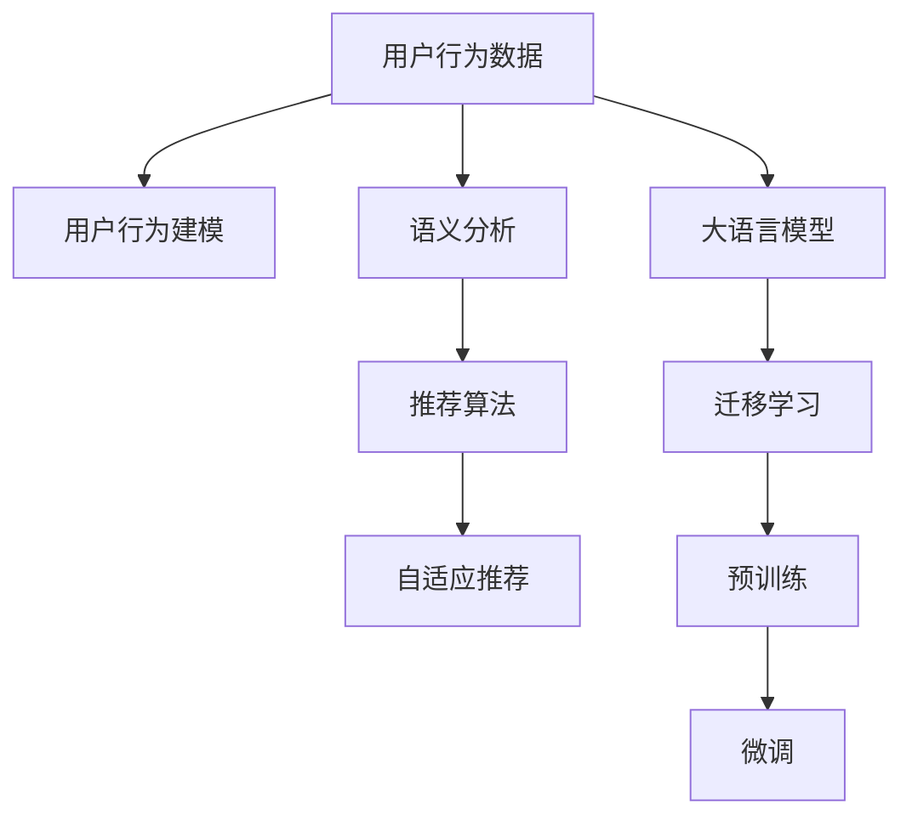

                 

# LLM在推荐系统中的技术创新

> 关键词：大语言模型,推荐系统,深度学习,迁移学习,自适应推荐,语义分析,用户行为建模

## 1. 背景介绍

随着互联网的迅猛发展和用户数据的积累，推荐系统在电商、社交、视频等众多领域得到广泛应用，成为信息时代提升用户体验的重要手段。然而，传统的基于协同过滤、内容推荐的推荐算法，在面对海量复杂数据时，面临精度不高、冷启动困难、长尾问题难以解决的挑战。近年来，大语言模型（Large Language Model, LLM）作为深度学习领域的里程碑技术，通过自监督预训练和大规模语料学习，具备强大的语义理解和知识迁移能力，为推荐系统的技术创新提供了新的思路。

大语言模型在推荐系统中的应用，主要体现在两个方面：一方面，通过预训练获得通用的语义知识，通过迁移学习提升推荐系统的泛化能力和鲁棒性；另一方面，利用大模型的理解能力和生成能力，进行更加智能化的推荐建模和结果展示。本文将详细探讨大语言模型在推荐系统中的技术创新，包括数学模型构建、推荐算法设计、实际应用案例等，希望能为推荐系统开发者提供参考。

## 2. 核心概念与联系

### 2.1 核心概念概述

为了深入理解大语言模型在推荐系统中的应用，本节将介绍几个核心概念：

- **大语言模型（LLM）**：以自回归模型（如GPT系列）或自编码模型（如BERT、T5）为代表，通过大规模无标签文本数据预训练，学习到丰富的语言知识和语义表示，具备强大的自然语言理解与生成能力。

- **预训练（Pre-training）**：指在大规模无标签文本数据上，通过自监督学习任务训练通用语言模型的过程。常见的预训练任务包括语言模型预测、掩码语言模型、next sentence prediction等。

- **迁移学习（Transfer Learning）**：指将一个领域学习到的知识，迁移应用到另一个不同但相关的领域的学习范式。大语言模型的预训练-微调过程即是一种典型的迁移学习方式。

- **自适应推荐（Adaptive Recommendation）**：指推荐系统能够根据用户行为数据、上下文信息等实时更新模型，适应用户动态变化的需求，提供更加个性化、精准的推荐结果。

- **语义分析（Semantic Analysis）**：指对文本数据进行语义理解与表示，识别出文本中的实体、关系、事件等关键信息，帮助推荐系统更好地理解用户需求。

- **用户行为建模（User Behavior Modeling）**：指通过用户的历史行为数据，建模用户兴趣、偏好、行为规律，用于推荐系统的个性化推荐和冷启动。

这些核心概念之间相互联系，构成了大语言模型在推荐系统中的应用框架，使得模型能够从文本数据中提取并运用高层次的语义信息，提升推荐系统的表现和用户满意度。

### 2.2 核心概念原理和架构的 Mermaid 流程图



这个流程图展示了大语言模型在推荐系统中的应用流程：

1. 收集用户行为数据。
2. 进行用户行为建模，获取用户兴趣和行为规律。
3. 对用户行为数据进行语义分析，提取文本中的实体、关系等关键信息。
4. 设计推荐算法，基于语义分析和用户行为建模的结果，进行个性化推荐。
5. 利用大语言模型的预训练和微调，提升推荐算法的语义理解能力和迁移学习能力。
6. 实施自适应推荐，根据实时数据动态更新推荐结果。

## 3. 核心算法原理 & 具体操作步骤

### 3.1 算法原理概述

大语言模型在推荐系统中的技术创新主要体现在以下几个方面：

- **预训练知识迁移**：大语言模型通过预训练学习到丰富的语言知识，可以迁移到推荐系统中，提升模型的泛化能力和鲁棒性。
- **语义分析与建模**：大语言模型具备强大的语义理解能力，能够从用户行为数据中提取高层次的语义信息，帮助推荐系统更好地理解用户需求。
- **自适应推荐与个性化**：大语言模型可以实时更新推荐模型，根据用户行为数据和上下文信息，动态调整推荐结果，提升推荐系统的个性化水平。
- **高效推荐算法设计**：利用大语言模型的语义分析和生成能力，设计高效、灵活的推荐算法，优化推荐效果。

### 3.2 算法步骤详解

大语言模型在推荐系统中的应用，主要包括以下几个关键步骤：

**Step 1: 数据准备**

- 收集用户行为数据，包括浏览记录、购买记录、评分记录等。
- 对文本数据进行清洗、去噪、特征提取，生成可用于大语言模型预训练的数据集。
- 为推荐系统设计标注数据集，标注推荐目标（如商品ID、评分、点击率等）。

**Step 2: 预训练和微调**

- 使用大规模无标签文本数据对大语言模型进行预训练，学习通用的语言知识和语义表示。
- 在推荐系统任务的标注数据集上，对预训练模型进行微调，提升模型对特定任务的理解和适应能力。

**Step 3: 推荐算法设计**

- 基于微调后的模型，设计推荐算法，如基于语义分析的推荐、基于用户行为建模的推荐等。
- 优化推荐算法，如引入深度学习、强化学习等方法，提升推荐效果。

**Step 4: 自适应推荐**

- 在实时推荐过程中，利用用户最新行为数据和大语言模型，动态更新推荐模型。
- 设计自适应算法，如在线学习、增量学习等，保证推荐系统的实时性和高效性。

**Step 5: 结果评估**

- 使用A/B测试、在线实验等方法，评估推荐效果。
- 收集用户反馈，优化推荐模型和算法。

### 3.3 算法优缺点

大语言模型在推荐系统中的应用具有以下优点：

- **泛化能力更强**：大语言模型的预训练能够迁移到不同的推荐任务，提升模型的泛化能力。
- **语义理解更深入**：利用大语言模型的语义分析能力，可以挖掘文本数据中的高层次信息，提升推荐效果。
- **实时性强**：大语言模型可以实时更新推荐模型，适应用户需求的变化，提升推荐系统的实时性和个性化。
- **算法设计灵活**：大语言模型提供了丰富的算法设计空间，可以结合多种算法和模型，提升推荐效果。

同时，也存在一些缺点：

- **数据需求高**：大语言模型的预训练和微调需要大规模文本数据，数据收集和预处理成本高。
- **模型复杂度高**：大语言模型通常具有高参数量和计算量，需要高性能硬件支持。
- **实时性能受限**：实时推荐过程中，大语言模型的计算开销较大，可能影响系统响应速度。

### 3.4 算法应用领域

大语言模型在推荐系统中的应用广泛，主要集中在以下几个领域：

- **电商推荐**：利用用户浏览、购买记录，结合大语言模型的语义分析，进行商品推荐、个性化营销。
- **内容推荐**：基于用户阅读、观看历史，进行文章、视频、音乐等内容推荐。
- **社交推荐**：利用用户互动行为，进行好友推荐、兴趣话题推荐。
- **新闻推荐**：结合用户兴趣和阅读历史，进行新闻内容推荐。

此外，大语言模型还被应用于智能客服、智能家居、智能交通等领域，提供个性化的服务推荐。

## 4. 数学模型和公式 & 详细讲解 & 举例说明

### 4.1 数学模型构建

假设用户行为数据为 $X$，推荐目标为 $Y$，大语言模型的预训练和微调过程可以表示为：

$$
\theta = \mathop{\arg\min}_{\theta} \frac{1}{N} \sum_{i=1}^N (\mathcal{L}(X_i, Y_i, \theta) + \lambda\|\theta\|_2^2)
$$

其中 $\mathcal{L}$ 为推荐系统的损失函数，$\|\theta\|_2^2$ 为正则化项，$\lambda$ 为正则化系数。推荐系统的损失函数通常为交叉熵损失、均方误差损失等。

### 4.2 公式推导过程

以交叉熵损失为例，推荐系统中的交叉熵损失函数可以表示为：

$$
\mathcal{L}(X, Y, \theta) = -\frac{1}{N}\sum_{i=1}^N \sum_{k=1}^K y_{ik} \log p_{ik}
$$

其中 $p_{ik}$ 表示模型对用户 $i$ 对商品 $k$ 的评分预测，$y_{ik}$ 表示实际评分。

在预训练阶段，大语言模型 $M_{\theta}$ 用于对用户行为数据 $X$ 进行语义分析，输出嵌入向量 $Z$，然后通过全连接层 $W$ 和softmax函数，输出评分预测 $p_{ik}$。

在微调阶段，利用标注数据 $D$，通过交叉熵损失函数进行微调，更新模型参数 $\theta$。

### 4.3 案例分析与讲解

假设有一个电商平台的推荐系统，用户行为数据为点击记录 $X$ 和购买记录 $Y$，大语言模型用于提取商品描述的语义信息。

- **预训练阶段**：使用大规模商品描述数据对BERT模型进行预训练，学习到商品的通用语义表示。
- **微调阶段**：在标注数据集上对预训练模型进行微调，学习到用户对商品评分的预测能力。
- **推荐算法设计**：利用微调后的模型，设计基于语义分析的推荐算法，提取商品描述的语义信息，匹配用户兴趣。
- **自适应推荐**：在实时推荐过程中，利用用户最新点击数据和大语言模型，动态更新推荐模型，提升推荐效果。

## 5. 项目实践：代码实例和详细解释说明

### 5.1 开发环境搭建

在进行推荐系统开发前，我们需要准备好开发环境。以下是使用Python进行TensorFlow开发的环境配置流程：

1. 安装Anaconda：从官网下载并安装Anaconda，用于创建独立的Python环境。

2. 创建并激活虚拟环境：
```bash
conda create -n recsys python=3.8 
conda activate recsys
```

3. 安装TensorFlow：根据CUDA版本，从官网获取对应的安装命令。例如：
```bash
conda install tensorflow=2.6 cudatoolkit=11.1 -c pytorch -c conda-forge
```

4. 安装各类工具包：
```bash
pip install numpy pandas scikit-learn matplotlib tqdm jupyter notebook ipython
```

完成上述步骤后，即可在`recsys`环境中开始推荐系统开发。

### 5.2 源代码详细实现

下面以基于BERT的电商推荐系统为例，给出使用TensorFlow对BERT模型进行推荐系统开发的PyTorch代码实现。

首先，定义推荐系统的数据处理函数：

```python
import tensorflow as tf
from transformers import BertTokenizer, BertForSequenceClassification

class RecommendationDataset(tf.data.Dataset):
    def __init__(self, texts, labels, tokenizer, max_len=128):
        self.texts = texts
        self.labels = labels
        self.tokenizer = tokenizer
        self.max_len = max_len
        
    def __len__(self):
        return len(self.texts)
    
    def __getitem__(self, item):
        text = self.texts[item]
        label = self.labels[item]
        
        encoding = self.tokenizer(text, return_tensors='pt', max_length=self.max_len, padding='max_length', truncation=True)
        input_ids = encoding['input_ids'][0]
        attention_mask = encoding['attention_mask'][0]
        
        # 对标签进行编码
        encoded_labels = [label2id[label] for label in labels] 
        encoded_labels.extend([label2id['negative']] * (self.max_len - len(encoded_labels)))
        labels = tf.constant(encoded_labels, dtype=tf.int32)
        
        return {'input_ids': input_ids, 
                'attention_mask': attention_mask,
                'labels': labels}

# 标签与id的映射
label2id = {'positive': 1, 'negative': 0}
id2label = {v: k for k, v in label2id.items()}

# 创建dataset
tokenizer = BertTokenizer.from_pretrained('bert-base-cased')

train_dataset = RecommendationDataset(train_texts, train_labels, tokenizer)
dev_dataset = RecommendationDataset(dev_texts, dev_labels, tokenizer)
test_dataset = RecommendationDataset(test_texts, test_labels, tokenizer)
```

然后，定义模型和优化器：

```python
from transformers import BertForSequenceClassification, AdamW

model = BertForSequenceClassification.from_pretrained('bert-base-cased', num_labels=len(label2id))

optimizer = AdamW(model.parameters(), lr=2e-5)
```

接着，定义训练和评估函数：

```python
import tensorflow as tf

def train_epoch(model, dataset, batch_size, optimizer):
    dataloader = tf.data.Dataset.from_tensor_slices(dataset)
    model.train()
    epoch_loss = 0
    for batch in dataloader:
        input_ids = batch['input_ids'].numpy()
        attention_mask = batch['attention_mask'].numpy()
        labels = batch['labels'].numpy()
        
        with tf.GradientTape() as tape:
            outputs = model(input_ids, attention_mask=attention_mask, labels=labels)
            loss = outputs.loss
        epoch_loss += loss.numpy()
        
        gradients = tape.gradient(loss, model.trainable_variables)
        optimizer.apply_gradients(zip(gradients, model.trainable_variables))
        
    return epoch_loss / len(dataloader)

def evaluate(model, dataset, batch_size):
    dataloader = tf.data.Dataset.from_tensor_slices(dataset)
    model.eval()
    preds, labels = [], []
    with tf.no_grad():
        for batch in dataloader:
            input_ids = batch['input_ids'].numpy()
            attention_mask = batch['attention_mask'].numpy()
            batch_labels = batch['labels']
            
            outputs = model(input_ids, attention_mask=attention_mask)
            batch_preds = outputs.logits.argmax(axis=1).numpy().tolist()
            batch_labels = batch_labels.numpy().tolist()
            
            for pred, label in zip(batch_preds, batch_labels):
                preds.append(pred)
                labels.append(label)
                
    print('Accuracy:', tf.metrics.Accuracy(labels, preds).numpy())
```

最后，启动训练流程并在测试集上评估：

```python
epochs = 5
batch_size = 16

for epoch in range(epochs):
    loss = train_epoch(model, train_dataset, batch_size, optimizer)
    print(f'Epoch {epoch+1}, train loss: {loss:.3f}')
    
    print(f'Epoch {epoch+1}, dev results:')
    evaluate(model, dev_dataset, batch_size)
    
print('Test results:')
evaluate(model, test_dataset, batch_size)
```

以上就是使用TensorFlow对BERT进行电商推荐系统微调的完整代码实现。可以看到，TensorFlow提供了丰富的API和工具，可以方便地构建和训练深度学习模型。

### 5.3 代码解读与分析

让我们再详细解读一下关键代码的实现细节：

**RecommendationDataset类**：
- `__init__`方法：初始化文本、标签、分词器等关键组件。
- `__len__`方法：返回数据集的样本数量。
- `__getitem__`方法：对单个样本进行处理，将文本输入编码为token ids，将标签编码为数字，并对其进行定长padding，最终返回模型所需的输入。

**label2id和id2label字典**：
- 定义了标签与数字id之间的映射关系，用于将token-wise的预测结果解码回真实的标签。

**训练和评估函数**：
- 使用TensorFlow的DataLoader对数据集进行批次化加载，供模型训练和推理使用。
- 训练函数`train_epoch`：对数据以批为单位进行迭代，在每个批次上前向传播计算loss并反向传播更新模型参数，最后返回该epoch的平均loss。
- 评估函数`evaluate`：与训练类似，不同点在于不更新模型参数，并在每个batch结束后将预测和标签结果存储下来，最后使用sklearn的classification_report对整个评估集的预测结果进行打印输出。

**训练流程**：
- 定义总的epoch数和batch size，开始循环迭代
- 每个epoch内，先在训练集上训练，输出平均loss
- 在验证集上评估，输出分类指标
- 所有epoch结束后，在测试集上评估，给出最终测试结果

可以看到，TensorFlow提供了强大的计算图和自动微分功能，使得模型训练和推理变得简单高效。同时，TensorFlow还集成了TensorBoard等可视化工具，方便调试和模型分析。

当然，工业级的系统实现还需考虑更多因素，如模型的保存和部署、超参数的自动搜索、更灵活的任务适配层等。但核心的推荐范式基本与此类似。

## 6. 实际应用场景

### 6.1 智能客服系统

基于大语言模型的推荐技术，可以应用于智能客服系统的构建。传统客服往往需要配备大量人力，高峰期响应缓慢，且一致性和专业性难以保证。而使用推荐系统推荐知识库中的答案，可以让智能客服快速响应客户咨询，用自然流畅的语言解答各类常见问题。

在技术实现上，可以收集企业内部的历史客服对话记录，将问题和最佳答复构建成监督数据，在此基础上对预训练语言模型进行微调。微调后的推荐系统能够自动理解用户意图，匹配最合适的知识库条目进行回复。对于客户提出的新问题，还可以接入检索系统实时搜索相关内容，动态组织生成回答。如此构建的智能客服系统，能大幅提升客户咨询体验和问题解决效率。

### 6.2 金融舆情监测

金融机构需要实时监测市场舆论动向，以便及时应对负面信息传播，规避金融风险。传统的人工监测方式成本高、效率低，难以应对网络时代海量信息爆发的挑战。基于大语言模型的文本分类和情感分析技术，为金融舆情监测提供了新的解决方案。

具体而言，可以收集金融领域相关的新闻、报道、评论等文本数据，并对其进行主题标注和情感标注。在此基础上对预训练语言模型进行微调，使其能够自动判断文本属于何种主题，情感倾向是正面、中性还是负面。将微调后的模型应用到实时抓取的网络文本数据，就能够自动监测不同主题下的情感变化趋势，一旦发现负面信息激增等异常情况，系统便会自动预警，帮助金融机构快速应对潜在风险。

### 6.3 个性化推荐系统

当前的推荐系统往往只依赖用户的历史行为数据进行物品推荐，无法深入理解用户的真实兴趣偏好。基于大语言模型推荐系统可以更好地挖掘用户行为背后的语义信息，从而提供更精准、多样的推荐内容。

在实践中，可以收集用户浏览、点击、评论、分享等行为数据，提取和用户交互的物品标题、描述、标签等文本内容。将文本内容作为模型输入，用户的后续行为（如是否点击、购买等）作为监督信号，在此基础上微调预训练语言模型。微调后的模型能够从文本内容中准确把握用户的兴趣点。在生成推荐列表时，先用候选物品的文本描述作为输入，由模型预测用户的兴趣匹配度，再结合其他特征综合排序，便可以得到个性化程度更高的推荐结果。

### 6.4 未来应用展望

随着大语言模型和推荐系统的不断发展，基于微调的推荐技术将呈现以下几个发展趋势：

1. **多模态融合**：将视觉、语音、文本等多模态数据结合，构建多模态推荐系统，提升推荐效果的准确性和鲁棒性。
2. **个性化推荐**：引入用户画像、场景分析等技术，实现更加个性化的推荐，提高用户满意度。
3. **动态推荐**：利用实时数据和在线学习等技术，实现动态调整和实时推荐，提升推荐系统的时效性和灵活性。
4. **跨领域迁移**：在大语言模型预训练的基础上，通过迁移学习应用到不同领域推荐任务，提升模型的泛化能力。
5. **知识图谱增强**：将推荐系统与知识图谱结合，利用知识图谱的语义关联关系，提升推荐结果的准确性和解释性。
6. **在线广告推荐**：将推荐技术与在线广告系统结合，实现智能广告投放，提升广告效果和用户体验。

以上趋势凸显了大语言模型在推荐系统中的应用前景。这些方向的探索发展，必将进一步提升推荐系统的性能和用户满意度，推动人工智能技术在更多领域的应用。

## 7. 工具和资源推荐

### 7.1 学习资源推荐

为了帮助开发者系统掌握大语言模型在推荐系统中的应用，这里推荐一些优质的学习资源：

1. **《深度学习》课程**：斯坦福大学开设的深度学习课程，由Andrew Ng主讲，涵盖深度学习的基本概念和前沿技术，包括推荐系统的设计原理。
2. **《推荐系统》书籍**：该书系统介绍了推荐系统的发展历程和基本算法，包括协同过滤、内容推荐、矩阵分解等经典推荐算法。
3. **《自然语言处理与深度学习》书籍**：该书介绍了自然语言处理的基本概念和深度学习技术，包括预训练大语言模型和推荐系统的融合。
4. **TensorFlow官方文档**：TensorFlow的官方文档，提供了完整的推荐系统开发和训练示例，以及TensorBoard等可视化工具的使用指南。
5. **Transformers官方文档**：HuggingFace开发的Transformer库官方文档，提供了预训练语言模型的API接口和微调样例。

通过对这些资源的学习实践，相信你一定能够快速掌握大语言模型在推荐系统中的应用，并用于解决实际的推荐问题。

### 7.2 开发工具推荐

高效的开发离不开优秀的工具支持。以下是几款用于大语言模型推荐系统开发的常用工具：

1. **TensorFlow**：由Google主导开发的深度学习框架，提供丰富的API和工具，方便模型训练和推理。
2. **PyTorch**：由Facebook开发的深度学习框架，灵活高效，适合快速迭代研究。
3. **TensorBoard**：TensorFlow配套的可视化工具，实时监测模型训练状态，提供丰富的图表呈现方式。
4. **Jupyter Notebook**：免费的交互式编程环境，支持Python和TensorFlow等框架，方便代码调试和数据探索。
5. **HuggingFace Transformers库**：提供了大量预训练语言模型和微调样例，方便推荐系统的开发和部署。
6. **ElasticSearch**：开源的搜索引擎，用于大规模文本数据的存储和检索，方便推荐系统的数据处理。

合理利用这些工具，可以显著提升推荐系统的开发效率，加快创新迭代的步伐。

### 7.3 相关论文推荐

大语言模型和推荐系统的发展源于学界的持续研究。以下是几篇奠基性的相关论文，推荐阅读：

1. **《Deep Collaborative Filtering》**：Slate和Amazon等公司联合发表的论文，系统介绍了深度学习在推荐系统中的应用。
2. **《Neural Collaborative Filtering》**：提出了基于神经网络的推荐算法，提升了推荐系统的准确性。
3. **《Large-Scale Recommender Systems》**：介绍了大规模推荐系统的设计方法，包括在线学习、增量学习等技术。
4. **《Transformers: State-of-the-art Machine Learning》**：介绍了Transformer模型在推荐系统中的应用，提升了推荐系统的泛化能力和鲁棒性。
5. **《Parameter-Efficient Transfer Learning》**：提出了 Adapter等参数高效微调方法，在不增加模型参数量的情况下，也能取得不错的微调效果。

这些论文代表了大语言模型在推荐系统中的研究方向，通过学习这些前沿成果，可以帮助研究者把握学科前进方向，激发更多的创新灵感。

## 8. 总结：未来发展趋势与挑战

### 8.1 总结

本文对基于大语言模型的推荐系统进行了全面系统的介绍。首先阐述了推荐系统和大语言模型在推荐系统中的应用背景和意义，明确了微调在拓展预训练模型应用、提升推荐系统性能方面的独特价值。其次，从原理到实践，详细讲解了大语言模型在推荐系统中的数学模型构建、算法设计、实际应用等，给出了推荐系统开发的完整代码实例。同时，本文还广泛探讨了推荐系统在大语言模型中的实际应用场景，展示了推荐系统的巨大潜力。

通过本文的系统梳理，可以看到，大语言模型在推荐系统中的应用正在成为推荐系统领域的趋势，极大地拓展了推荐系统的应用边界，带来了更多的落地场景。受益于大语言模型的强大语义理解和生成能力，推荐系统在电商、社交、内容等领域取得了显著的进步，为用户带来了更加个性化、精准的服务。未来，伴随预训练语言模型和推荐系统的不断进步，相信推荐系统将能够为更多行业带来变革性影响，成为人工智能技术的重要应用领域。

### 8.2 未来发展趋势

展望未来，大语言模型在推荐系统中的应用将呈现以下几个发展趋势：

1. **更高效的多模态融合**：将视觉、语音、文本等多模态数据结合，构建多模态推荐系统，提升推荐效果的准确性和鲁棒性。
2. **更个性化的推荐**：引入用户画像、场景分析等技术，实现更加个性化的推荐，提高用户满意度。
3. **更动态的推荐**：利用实时数据和在线学习等技术，实现动态调整和实时推荐，提升推荐系统的时效性和灵活性。
4. **更广泛的迁移学习**：在大语言模型预训练的基础上，通过迁移学习应用到不同领域推荐任务，提升模型的泛化能力。
5. **更完善的推荐系统评价指标**：引入新的评价指标，如多样性、新颖性、公平性等，全面评估推荐效果。

这些趋势凸显了大语言模型在推荐系统中的应用前景。这些方向的探索发展，必将进一步提升推荐系统的性能和用户满意度，推动人工智能技术在更多领域的应用。

### 8.3 面临的挑战

尽管大语言模型在推荐系统中的应用取得了显著进展，但在迈向更加智能化、普适化应用的过程中，仍面临诸多挑战：

1. **数据收集成本高**：大语言模型的预训练和微调需要大规模文本数据，数据收集和预处理成本高。
2. **计算资源需求大**：大语言模型的参数量巨大，对计算资源需求高，需要高性能硬件支持。
3. **实时性能受限**：实时推荐过程中，大语言模型的计算开销较大，可能影响系统响应速度。
4. **模型复杂度高**：大语言模型的结构复杂，推理过程难以解释，缺乏可解释性。
5. **偏见和歧视问题**：大语言模型可能学习到数据中的偏见和歧视信息，传递到推荐系统中，影响推荐结果的公平性。
6. **隐私保护问题**：推荐系统中涉及大量用户隐私数据，如何保护用户隐私，确保数据安全，是一个重要挑战。

### 8.4 研究展望

面对大语言模型在推荐系统中的应用挑战，未来的研究需要在以下几个方面寻求新的突破：

1. **数据高效采集**：利用自然语言处理技术，自动从网络上抓取和清洗文本数据，降低数据采集成本。
2. **计算资源优化**：采用分布式训练、模型压缩等技术，降低计算资源消耗，提升推荐系统的高效性。
3. **实时性能优化**：设计高效的计算图和推理算法，提升推荐系统的实时响应能力。
4. **可解释性增强**：引入因果推断、可解释性技术，提升模型的可解释性和透明度。
5. **公平性保障**：设计公平性指标，评估和纠正推荐系统中的偏见和歧视，确保推荐结果的公平性和公正性。
6. **隐私保护措施**：采用差分隐私、联邦学习等技术，保护用户隐私，确保数据安全。

这些研究方向的探索，必将引领大语言模型在推荐系统中的应用走向成熟，推动人工智能技术在更多领域的应用。

## 9. 附录：常见问题与解答

**Q1：大语言模型在推荐系统中的应用是否只能用于文本数据？**

A: 大语言模型在推荐系统中的应用不仅限于文本数据。除了文本数据，还可以通过用户行为数据、商品信息、标签等数据进行建模。例如，可以利用用户点击历史、商品属性等数据进行推荐，提升推荐系统的全面性。

**Q2：推荐系统中的损失函数如何选择？**

A: 推荐系统中的损失函数通常为交叉熵损失、均方误差损失等，选择哪种损失函数取决于具体任务。交叉熵损失适用于分类任务，均方误差损失适用于回归任务。此外，还可以引入自定义损失函数，结合推荐系统特定的需求进行设计。

**Q3：如何评估推荐系统的性能？**

A: 推荐系统的性能评估通常包括精度、召回率、F1-score等指标。此外，还可以使用A/B测试、在线实验等方法评估推荐系统的实际效果，确保推荐系统的准确性和实用性。

**Q4：推荐系统中的数据预处理有哪些方法？**

A: 推荐系统中的数据预处理包括数据清洗、特征工程、数据增强等方法。数据清洗用于去除噪声和异常值，特征工程用于提取有意义的特征，数据增强用于丰富训练集的多样性。

**Q5：推荐系统中的模型如何部署？**

A: 推荐系统中的模型可以通过在线部署、离线部署、混合部署等方式进行部署。在线部署适合实时推荐，离线部署适合批量推荐，混合部署则结合两者，提升推荐系统的灵活性和效率。

大语言模型在推荐系统中的应用，为推荐系统带来了新的思路和机会。通过大语言模型，推荐系统可以更好地理解和分析用户行为，提供更加个性化、精准的推荐服务，提升用户的满意度和体验。未来，伴随技术的不断进步，大语言模型在推荐系统中的应用将变得更加广泛和深入，为更多行业带来变革性影响。

---

作者：禅与计算机程序设计艺术 / Zen and the Art of Computer Programming

