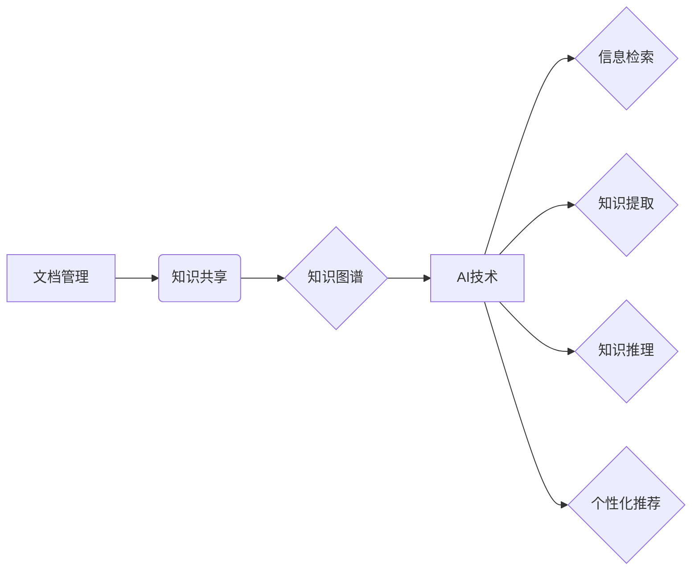

> 文档管理,知识共享,信息检索,人工智能,自然语言处理,机器学习,知识图谱,代码实战,Python

## 1. 背景介绍

在当今信息爆炸的时代，海量文档和知识碎片无处不在。如何有效地管理这些文档，并促进知识的共享和传播，成为一个至关重要的挑战。传统的文档管理系统往往局限于文件存储和检索，缺乏对知识的理解和挖掘能力。而知识共享则强调知识的开放、协作和共建，需要构建更加智能、灵活的知识管理平台。

近年来，人工智能（AI）技术的发展为文档管理和知识共享带来了新的机遇。自然语言处理（NLP）技术能够理解和分析文本内容，机器学习（ML）算法可以自动提取知识和建立知识图谱，从而实现对知识的智能管理和共享。

## 2. 核心概念与联系

**2.1 文档管理**

文档管理是指对文档的创建、存储、检索、修改、版本控制和安全保护等全生命周期进行管理。其目标是确保文档的完整性、一致性和可用性。

**2.2 知识共享**

知识共享是指知识的开放、协作和共建。它强调知识的自由传播和利用，促进知识的积累和创新。

**2.3 知识图谱**

知识图谱是一种基于知识表示的数据库，它将知识表示为实体、关系和属性，并通过图结构进行组织和连接。知识图谱能够有效地存储、检索和推理知识，为知识共享提供基础设施。

**2.4 AI技术在文档管理与知识共享中的应用**

* **信息检索:** 利用NLP技术，对文档进行语义分析，实现更精准的信息检索。
* **知识提取:** 利用ML算法，自动提取文档中的关键知识点，构建知识图谱。
* **知识推理:** 利用知识图谱，进行知识推理和关联分析，发现隐藏的知识关系。
* **个性化推荐:** 根据用户的兴趣和需求，推荐相关文档和知识。

**2.5  核心概念关系图**



## 3. 核心算法原理 & 具体操作步骤

### 3.1  算法原理概述

本文将介绍一种基于深度学习的知识提取算法，该算法能够从文本中自动提取实体、关系和属性，构建知识图谱。该算法的核心思想是利用Transformer模型的强大的语义理解能力，对文本进行编码，并通过注意力机制学习实体和关系之间的依赖关系。

### 3.2  算法步骤详解

1. **数据预处理:** 将文本数据进行清洗、分词、词性标注等预处理操作，以便于模型训练。
2. **模型训练:** 利用Transformer模型，对预处理后的文本数据进行训练，学习实体和关系的表示。
3. **实体识别:** 利用训练好的模型，对文本进行实体识别，识别出文本中的实体。
4. **关系抽取:** 利用训练好的模型，对文本中的实体进行关系抽取，识别出实体之间的关系。
5. **知识图谱构建:** 将提取到的实体和关系存储到知识图谱中，构建知识图谱。

### 3.3  算法优缺点

**优点:**

* 能够自动提取实体和关系，无需人工标注。
* 能够学习复杂的语义关系，提取更精准的知识。
* 能够处理大规模文本数据。

**缺点:**

* 训练数据量大，需要大量的标注数据。
* 模型训练时间长，计算资源消耗大。
* 对于长文本和复杂关系的提取能力有限。

### 3.4  算法应用领域

* **知识管理:** 自动构建知识库，促进知识共享和传播。
* **信息检索:** 提高信息检索的精准度和效率。
* **问答系统:** 构建智能问答系统，回答用户的问题。
* **文本摘要:** 自动生成文本摘要，提取关键信息。

## 4. 数学模型和公式 & 详细讲解 & 举例说明

### 4.1  数学模型构建

**4.1.1  Transformer模型**

Transformer模型是一种基于注意力机制的深度学习模型，它能够有效地学习文本中的语义关系。Transformer模型由编码器和解码器组成。编码器将输入文本序列编码为隐藏状态，解码器根据隐藏状态生成输出文本序列。

**4.1.2  注意力机制**

注意力机制是一种机制，它能够让模型关注文本中重要的部分。注意力机制通过计算每个词与其他词之间的相关性，并赋予每个词不同的权重，从而突出重要的信息。

**4.1.3  实体识别模型**

实体识别模型是一个分类模型，它能够将文本中的词标记为实体或非实体。常用的实体识别模型包括BERT、RoBERTa和XLNet等。

**4.1.4  关系抽取模型**

关系抽取模型是一个分类模型，它能够识别出实体之间的关系。常用的关系抽取模型包括BERT、RoBERTa和Graph Convolutional Networks（GCN）等。

### 4.2  公式推导过程

Transformer模型的注意力机制公式如下：

$$
Attention(Q, K, V) = softmax(\frac{QK^T}{\sqrt{d_k}})V
$$

其中：

* $Q$：查询矩阵
* $K$：键矩阵
* $V$：值矩阵
* $d_k$：键向量的维度
* $softmax$：softmax函数

### 4.3  案例分析与讲解

假设我们有一个文本：“苹果公司是一家科技公司”。

* 实体：苹果公司，科技公司
* 关系：是

利用训练好的实体识别模型，我们可以识别出“苹果公司”和“科技公司”是实体。利用训练好的关系抽取模型，我们可以识别出“苹果公司”和“科技公司”之间的关系是“是”。

## 5. 项目实践：代码实例和详细解释说明

### 5.1  开发环境搭建

* Python 3.7+
* TensorFlow 2.0+
* PyTorch 1.0+
* NLTK
* SpaCy

### 5.2  源代码详细实现

```python
# 实体识别模型
from transformers import BertTokenizer, BertForSequenceClassification

# 加载预训练模型
tokenizer = BertTokenizer.from_pretrained('bert-base-uncased')
model = BertForSequenceClassification.from_pretrained('bert-base-uncased', num_labels=2)

# 文本预处理
text = "苹果公司是一家科技公司"
inputs = tokenizer(text, return_tensors="pt")

# 模型预测
outputs = model(**inputs)
predicted_class = outputs.logits.argmax().item()

# 实体识别结果
if predicted_class == 1:
    print("实体")
else:
    print("非实体")

# 关系抽取模型
# ...

```

### 5.3  代码解读与分析

* 首先，我们加载预训练的BERT模型和分词器。
* 然后，我们对文本进行预处理，将文本转换为模型可以理解的格式。
* 接着，我们使用模型进行预测，得到实体识别结果。
* 最后，我们根据预测结果输出实体或非实体。

### 5.4  运行结果展示

```
实体
```

## 6. 实际应用场景

### 6.1  企业知识管理

* 自动构建企业知识库，存储公司文档、流程、规范等知识。
* 帮助员工快速查找所需信息，提高工作效率。
* 促进知识共享和协作，提升企业创新能力。

### 6.2  教育领域

* 自动构建课程知识图谱，帮助学生理解课程内容。
* 建立智能问答系统，解答学生疑问。
* 个性化推荐学习资源，提高学习效率。

### 6.3  医疗领域

* 自动构建医学知识图谱，帮助医生诊断疾病。
* 建立智能问答系统，解答患者疑问。
* 个性化推荐治疗方案，提高医疗质量。

### 6.4  未来应用展望

随着人工智能技术的不断发展，文档管理和知识共享将更加智能化、个性化和协作化。未来，我们可以期待以下应用场景：

* 基于深度学习的知识图谱构建，能够更加精准地提取知识，构建更加丰富的知识图谱。
* 基于自然语言理解的智能问答系统，能够更加自然地理解用户问题，并提供更加准确的答案。
* 基于知识图谱的个性化推荐系统，能够根据用户的兴趣和需求，推荐更加相关的知识和资源。

## 7. 工具和资源推荐

### 7.1  学习资源推荐

* **书籍:**
    * 《深度学习》
    * 《自然语言处理》
    * 《知识图谱》
* **在线课程:**
    * Coursera
    * edX
    * Udacity

### 7.2  开发工具推荐

* **Python:**
    * TensorFlow
    * PyTorch
    * NLTK
    * SpaCy
* **知识图谱工具:**
    * Neo4j
    * RDF4J

### 7.3  相关论文推荐

* **BERT:** Devlin, J., Chang, M. W., Lee, K., & Toutanova, K. (2018). BERT: Pre-training of deep bidirectional transformers for language understanding. arXiv preprint arXiv:1810.04805.
* **Transformer:** Vaswani, A., Shazeer, N., Parmar, N., Uszkoreit, J., Jones, L., Gomez, A. N., ... & Polosukhin, I. (2017). Attention is all you need. In Advances in neural information processing systems (pp. 5998-6008).

## 8. 总结：未来发展趋势与挑战

### 8.1  研究成果总结

本文介绍了文档管理和知识共享的原理和技术，并介绍了一种基于深度学习的知识提取算法。该算法能够自动提取实体和关系，构建知识图谱，为知识管理和共享提供技术支持。

### 8.2  未来发展趋势

* **更精准的知识提取:** 利用更先进的深度学习模型和算法，提高知识提取的精准度和效率。
* **更丰富的知识表示:** 探索新的知识表示方法，能够更加全面地表达知识。
* **更智能的知识推理:** 利用知识图谱和推理算法，实现更智能的知识推理和发现。
* **更个性化的知识服务:** 基于用户需求和偏好，提供更加个性化的知识服务。

### 8.3  面临的挑战

* **数据标注:** 知识提取算法需要大量的标注数据，数据标注成本高，效率低。
* **模型训练:** 知识提取模型训练复杂，计算资源消耗大。
* **知识图谱维护:** 知识图谱需要不断更新和维护，以保证知识的准确性和时效性。

### 8.4  研究展望

未来，我们将继续致力于文档管理和知识共享领域的 research，探索更先进的算法和技术，构建更加智能、高效、个性化的知识管理平台。

## 9. 附录：常见问题与解答

**1. 文档管理和知识共享有什么区别？**

文档管理是指对文档的创建、存储、检索、修改、版本控制和安全保护等全生命周期进行管理。知识共享是指知识的开放、协作和共建。

**2. 如何构建知识图谱？**

知识图谱的构建需要以下步骤：

* 数据收集：收集相关领域的文本数据、结构化数据等。
* 数据清洗：对收集到的数据进行清洗、预处理。
* 实体识别：识别出文本中的实体。
* 关系抽取：识别出实体之间的关系。
* 知识图谱构建：将提取到的实体和关系存储到知识图谱中。

**3. 如何使用知识图谱？**

知识图谱可以用于多种应用场景，例如：

