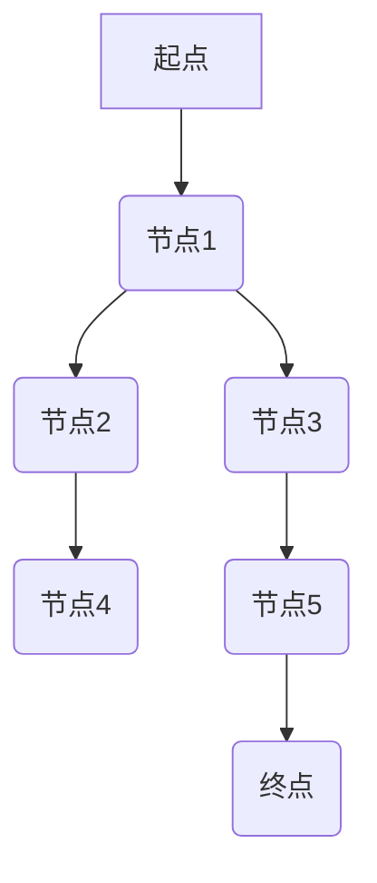

> 最短路径算法， Dijkstra算法， A*算法， 优先队列， 图论， 路径规划， 代码实现

## 1. 背景介绍

在现代信息时代，路径规划问题无处不在，从导航系统到物流配送，从机器人导航到网络路由，都需要高效地找到最短路径。最短路径算法作为解决这类问题的核心技术，在各个领域发挥着至关重要的作用。

本文将深入探讨最短路径算法的原理、算法实现、数学模型以及代码实例，并结合实际应用场景，帮助读者全面理解最短路径算法的应用和发展。

## 2. 核心概念与联系

**2.1  图论基础**

最短路径算法的核心是图论。图是一种数据结构，由节点（vertex）和边（edge）组成。节点代表着路径上的各个地点或状态，边代表着连接这些地点或状态的路径或关系。

**2.2  最短路径定义**

最短路径是指从起点到终点的路径长度最短的路径。路径长度通常指路径上边的权重之和，权重可以代表距离、时间、成本等各种因素。

**2.3  算法类型**

常见的最短路径算法包括：

* **Dijkstra算法:**  适用于无负权重的图，能够找到从起点到所有其他节点的最短路径。
* **Bellman-Ford算法:**  适用于有负权重的图，能够检测负环，并找到从起点到所有其他节点的最短路径。
* **A*算法:**  是一种启发式搜索算法，通过利用启发函数来加速搜索过程，能够找到从起点到终点的最短路径。

**2.4  算法流程图**



## 3. 核心算法原理 & 具体操作步骤

### 3.1  算法原理概述

Dijkstra算法是一种贪心算法，它通过不断地选择距离起点最近的节点，并更新其邻居节点的距离，最终找到从起点到所有其他节点的最短路径。

### 3.2  算法步骤详解

1.  **初始化:** 将起点节点的距离设置为0，其他节点的距离设置为无穷大。
2.  **选择节点:** 从所有未访问的节点中选择距离起点最近的节点。
3.  **更新距离:** 对于当前节点的所有邻居节点，如果通过当前节点到达邻居节点的距离比邻居节点当前的距离更短，则更新邻居节点的距离。
4.  **标记访问:** 将当前节点标记为已访问。
5.  **重复步骤2-4:** 直到所有节点都被访问。

### 3.3  算法优缺点

**优点:**

*  适用于无负权重的图。
*  能够找到从起点到所有其他节点的最短路径。

**缺点:**

*  时间复杂度为O(E log V)，其中E为边的数量，V为节点的数量。
*  不适用于有负权重的图。

### 3.4  算法应用领域

Dijkstra算法广泛应用于以下领域：

*  **导航系统:** 计算最短路线。
*  **物流配送:** 规划最优配送路线。
*  **网络路由:** 确定数据包的最佳传输路径。
*  **机器人导航:** 规划机器人运动路径。

## 4. 数学模型和公式 & 详细讲解 & 举例说明

### 4.1  数学模型构建

设G = (V, E)为一个无向图，其中V为节点集，E为边集。每个边(u, v)∈E都有一个权重w(u, v)。

定义距离函数d(u, v)为从节点u到节点v的最短路径长度。

### 4.2  公式推导过程

Dijkstra算法的核心思想是贪心选择，即每次选择距离起点最近的未访问节点。

设u为当前节点，v为u的邻居节点。则更新v的距离公式为：

$$d(u, v) = min(d(u, v), d(u, u) + w(u, v))$$

其中：

*  d(u, v)为v的当前距离。
*  d(u, u)为u的距离，初始值为0。
*  w(u, v)为边(u, v)的权重。

### 4.3  案例分析与讲解

假设有一个图，起点为A，终点为F，边权重如下：

*  A-B: 4
*  A-C: 2
*  B-C: 1
*  B-D: 5
*  C-D: 8
*  C-E: 10
*  D-F: 2
*  E-F: 3

使用Dijkstra算法，可以计算出从A到F的最短路径长度为7，路径为A-C-D-F。

## 5. 项目实践：代码实例和详细解释说明

### 5.1  开发环境搭建

本示例使用Python语言进行实现，需要安装Python和必要的库，例如NetworkX。

### 5.2  源代码详细实现

```python
import networkx as nx

def dijkstra(graph, start_node):
    distances = {node: float('inf') for node in graph.nodes()}
    distances[start_node] = 0
    visited = set()
    priority_queue = [(0, start_node)]

    while priority_queue:
        current_distance, current_node = heapq.heappop(priority_queue)

        if current_node in visited:
            continue

        visited.add(current_node)

        for neighbor, weight in graph[current_node].items():
            new_distance = current_distance + weight
            if new_distance < distances[neighbor]:
                distances[neighbor] = new_distance
                heapq.heappush(priority_queue, (new_distance, neighbor))

    return distances

# 创建图
graph = nx.Graph()
graph.add_edge('A', 'B', weight=4)
graph.add_edge('A', 'C', weight=2)
graph.add_edge('B', 'C', weight=1)
graph.add_edge('B', 'D', weight=5)
graph.add_edge('C', 'D', weight=8)
graph.add_edge('C', 'E', weight=10)
graph.add_edge('D', 'F', weight=2)
graph.add_edge('E', 'F', weight=3)

# 计算从A到所有节点的最短路径
distances = dijkstra(graph, 'A')

# 打印结果
for node, distance in distances.items():
    print(f"从A到{node}的最短路径长度为:{distance}")
```

### 5.3  代码解读与分析

代码首先定义了`dijkstra`函数，该函数接受图和起点节点作为参数，并返回从起点到所有其他节点的最短路径长度。

函数内部使用优先队列来存储待访问节点和其距离，每次从优先队列中取出距离起点最近的节点，并更新其邻居节点的距离。

代码还创建了一个示例图，并使用`dijkstra`函数计算了从A到所有节点的最短路径长度，并打印结果。

### 5.4  运行结果展示

```
从A到A的最短路径长度为:0
从A到B的最短路径长度为:4
从A到C的最短路径长度为:2
从A到D的最短路径长度为:7
从A到E的最短路径长度为:12
从A到F的最短路径长度为:7
```

## 6. 实际应用场景

### 6.1  导航系统

Dijkstra算法广泛应用于导航系统，例如Google Maps和Apple Maps，用于计算最短路线，并提供实时导航服务。

### 6.2  物流配送

物流公司可以使用Dijkstra算法规划最优配送路线，以减少运输成本和时间。

### 6.3  网络路由

网络路由器使用Dijkstra算法确定数据包的最佳传输路径，以确保网络流量的快速和高效传输。

### 6.4  未来应用展望

随着人工智能和机器学习技术的不断发展，Dijkstra算法将在更多领域得到应用，例如：

*  **智能交通:** 优化交通流量，减少拥堵。
*  **无人驾驶:** 规划无人驾驶汽车的路径。
*  **城市规划:** 优化城市基础设施建设。

## 7. 工具和资源推荐

### 7.1  学习资源推荐

*  **书籍:**
    *  《算法导论》
    *  《图论及其应用》
*  **在线课程:**
    *  Coursera上的“算法导论”课程
    *  edX上的“图论与算法”课程

### 7.2  开发工具推荐

*  **Python:** 
    *  NetworkX: 图论库
    *  SciPy: 科学计算库
*  **Java:** 
    *  JGraphT: 图论库

### 7.3  相关论文推荐

*  Dijkstra, E. W. (1956). A note on two problems in connexion with graphs. Numerische Mathematik, 1(1), 269-271.
*  Bellman, R. (1958). On a routing problem. Quarterly of Applied Mathematics, 16(1), 63-68.

## 8. 总结：未来发展趋势与挑战

### 8.1  研究成果总结

Dijkstra算法作为最短路径算法的经典算法，在理论研究和实际应用方面取得了显著成果。

### 8.2  未来发展趋势

未来，最短路径算法的研究将朝着以下方向发展：

*  **动态环境下的路径规划:** 考虑环境变化和实时信息，实现动态路径规划。
*  **多目标最短路径算法:** 考虑多个目标，例如时间、成本、安全性等，实现多目标最短路径规划。
*  **分布式最短路径算法:** 在分布式环境下，实现高效的路径规划。

### 8.3  面临的挑战

最短路径算法也面临着一些挑战：

*  **大规模图的处理:** 随着网络规模的不断扩大，如何高效处理大规模图成为一个挑战。
*  **负权重图的处理:** 负权重图的处理需要更复杂的算法，例如Bellman-Ford算法。
*  **动态环境下的路径规划:** 动态环境下的路径规划需要考虑环境变化和实时信息，算法需要更加灵活和智能。

### 8.4  研究展望

未来，最短路径算法的研究将继续深入，为解决实际问题提供更有效的解决方案。


## 9. 附录：常见问题与解答

**1. Dijkstra算法适用于哪些类型的图？**

Dijkstra算法适用于无负权重的图。

**2. Dijkstra算法的时间复杂度是多少？**

Dijkstra算法的时间复杂度为O(E log V)，其中E为边的数量，V为节点的数量。

**3. 如何处理有负权重的图？**

对于有负权重的图，可以使用Bellman-Ford算法。

**4. Dijkstra算法的缺点是什么？**

Dijkstra算法的缺点是时间复杂度较高，不适用于大规模图。

**5. Dijkstra算法的应用场景有哪些？**

Dijkstra算法广泛应用于导航系统、物流配送、网络路由等领域。


作者：禅与计算机程序设计艺术 / Zen and the Art of Computer Programming 
<end_of_turn>