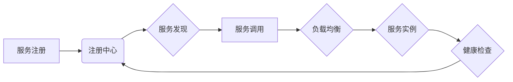

> 服务注册、负载均衡、微服务架构、服务发现、健康检查、算法原理、实践案例

## 1. 背景介绍

随着互联网技术的不断发展，软件系统架构也经历了从单体架构向微服务架构的转变。微服务架构将大型应用程序拆分成多个小型、独立的服务，每个服务负责特定的业务功能。这种架构模式带来了许多好处，例如：

* **可扩展性:** 每个服务可以独立部署和扩展，无需影响其他服务。
* **弹性:** 某个服务出现故障时，其他服务可以继续运行，保证系统整体的可用性。
* **开发效率:** 每个服务相对独立，开发团队可以更快速地迭代和部署。

然而，微服务架构也带来了新的挑战，其中之一就是服务注册和负载均衡。

在微服务架构中，服务之间需要相互发现和通信。传统的单体架构中，服务之间的通信关系是固定的，可以通过配置文件或代码直接指定。但在微服务架构中，服务数量众多，动态变化，因此需要一种机制来动态注册和发现服务。

负载均衡则是指将请求分发到多个服务器上，以提高系统的吞吐量和可用性。在微服务架构中，每个服务可能有多个实例，负载均衡器可以根据策略将请求分发到不同的实例，避免单个实例被过载。

## 2. 核心概念与联系

### 2.1 服务注册

服务注册是指将服务信息（例如服务名称、地址、端口等）注册到一个中央的注册中心。当其他服务需要调用某个服务时，可以查询注册中心获取该服务的地址和端口信息。

常见的服务注册中心有：

* **etcd:** 基于分布式键值存储的注册中心，具有高可用性和数据一致性。
* **Consul:** 基于gossip协议的注册中心，具有高性能和低延迟。
* **Eureka:** Netflix开源的服务注册中心，支持自动发现和健康检查。

### 2.2 负载均衡

负载均衡是指将请求分发到多个服务器上，以提高系统的吞吐量和可用性。常见的负载均衡器有：

* **硬件负载均衡器:** 专用的硬件设备，具有高性能和可靠性。
* **软件负载均衡器:** 基于软件实现的负载均衡器，可以部署在服务器上。
* **云平台负载均衡器:** 由云平台提供，可以自动配置和管理负载均衡器。

### 2.3 服务发现

服务发现是指服务在注册中心注册后，其他服务能够自动发现并连接到该服务的过程。服务发现通常由注册中心和服务本身实现。

### 2.4 健康检查

健康检查是指定期检查服务是否正常运行，并将服务状态更新到注册中心。当服务出现故障时，注册中心会将该服务标记为不可用，避免其他服务调用该服务。

**核心概念与联系流程图:**



## 3. 核心算法原理 & 具体操作步骤

### 3.1 算法原理概述

负载均衡算法的核心是将请求分发到不同的服务器实例，以实现流量均衡和资源利用率最大化。常见的负载均衡算法有：

* **轮询算法:** 将请求按照顺序轮流分发到不同的服务器实例。
* **加权轮询算法:** 根据服务器实例的性能或资源状况，赋予不同的权重，然后按照权重进行轮询分发请求。
* **最小连接数算法:** 选择连接数最少的服务器实例分发请求。
* **IP哈希算法:** 根据客户端的IP地址计算哈希值，将请求分发到对应的服务器实例。

### 3.2 算法步骤详解

以轮询算法为例，其具体操作步骤如下：

1. 负载均衡器维护一个服务器实例列表。
2. 当收到请求时，负载均衡器根据当前的轮询索引选择一个服务器实例。
3. 将请求转发到选中的服务器实例。
4. 轮询索引自增，循环使用。

### 3.3 算法优缺点

**轮询算法:**

* **优点:** 简单易实现，性能较好。
* **缺点:** 无法根据服务器实例的性能进行动态调整，可能导致某些服务器实例过载。

**加权轮询算法:**

* **优点:** 可以根据服务器实例的性能进行动态调整，提高资源利用率。
* **缺点:** 算法复杂度较高，需要实时监控服务器实例的性能。

**最小连接数算法:**

* **优点:** 可以避免服务器实例过载，提高系统稳定性。
* **缺点:** 可能会导致某些服务器实例闲置。

**IP哈希算法:**

* **优点:** 可以保证每个客户端的请求总是分发到同一个服务器实例，提高数据一致性。
* **缺点:** 无法根据服务器实例的性能进行动态调整。

### 3.4 算法应用领域

不同的负载均衡算法适用于不同的场景。例如，对于高并发网站，可以使用轮询算法或加权轮询算法；对于需要保证数据一致性的应用，可以使用IP哈希算法。

## 4. 数学模型和公式 & 详细讲解 & 举例说明

### 4.1 数学模型构建

假设有N个服务器实例，每个实例的处理能力为P，请求流量为Q。

负载均衡器的目标是将请求均匀地分配到所有服务器实例，以保证每个服务器实例的负载均衡。

### 4.2 公式推导过程

**平均负载:**

$$
平均负载 = \frac{Q}{N}
$$

**每个服务器实例的负载:**

$$
每个服务器实例的负载 = \frac{Q}{N}
$$

### 4.3 案例分析与讲解

假设有3个服务器实例，每个实例的处理能力为1000请求/秒，请求流量为3000请求/秒。

**平均负载:**

$$
平均负载 = \frac{3000}{3} = 1000 \text{请求/秒}
$$

**每个服务器实例的负载:**

$$
每个服务器实例的负载 = \frac{3000}{3} = 1000 \text{请求/秒}
$$

在这种情况下，每个服务器实例的负载均衡，请求流量均匀地分配到所有服务器实例。

## 5. 项目实践：代码实例和详细解释说明

### 5.1 开发环境搭建

* 操作系统: Ubuntu 20.04
* 编程语言: Python
* 框架: Flask

### 5.2 源代码详细实现

```python
from flask import Flask, request, jsonify

app = Flask(__name__)

# 模拟服务器实例列表
servers = [
    {'name': 'server1', 'address': '192.168.1.100', 'port': 8080},
    {'name': 'server2', 'address': '192.168.1.101', 'port': 8080},
    {'name': 'server3', 'address': '192.168.1.102', 'port': 8080},
]

# 轮询算法
current_index = 0

@app.route('/health', methods=['GET'])
def health_check():
    return jsonify({'status': 'OK'})

@app.route('/request', methods=['GET'])
def request_handler():
    global current_index
    server = servers[current_index]
    current_index = (current_index + 1) % len(servers)
    return jsonify({'server': server['name'], 'address': server['address'], 'port': server['port']})

if __name__ == '__main__':
    app.run(host='0.0.0.0', port=8081)
```

### 5.3 代码解读与分析

* **服务器实例列表:** `servers` 列表存储了每个服务器实例的信息，包括名称、地址和端口。
* **轮询算法:** `current_index` 变量记录当前轮询到的服务器实例索引，每次请求都会将索引自增，循环使用。
* **健康检查:** `/health` 路由用于健康检查，返回 `OK` 状态码表示服务正常运行。
* **请求处理:** `/request` 路由处理请求，根据轮询算法选择一个服务器实例并返回其信息。

### 5.4 运行结果展示

启动服务后，访问 `/request` 路由，每次请求都会返回不同的服务器实例信息，实现请求的轮询分发。

## 6. 实际应用场景

### 6.1 微服务架构

在微服务架构中，服务注册和负载均衡是必不可少的组件。

### 6.2 云平台

云平台通常提供负载均衡服务，可以帮助用户轻松部署和管理负载均衡器。

### 6.3 高并发网站

高并发网站需要使用负载均衡器来提高吞吐量和可用性。

### 6.4 容器化部署

容器化部署通常使用 Kubernetes 等容器编排平台，这些平台内置了负载均衡功能。

## 7. 工具和资源推荐

### 7.1 学习资源推荐

* **书籍:**
    * 《微服务架构实践》
    * 《分布式系统设计与实践》
* **博客:**
    * Martin Fowler 的博客
    * Netflix Tech Blog

### 7.2 开发工具推荐

* **注册中心:** etcd, Consul, Eureka
* **负载均衡器:** Nginx, HAProxy, AWS Elastic Load Balancing

### 7.3 相关论文推荐

* **论文:**
    * "The Twelve-Factor App"
    * "Microservices Patterns"

## 8. 总结：未来发展趋势与挑战

### 8.1 研究成果总结

服务注册和负载均衡技术已经发展成熟，并广泛应用于各种场景。

### 8.2 未来发展趋势

* **更智能的负载均衡算法:** 基于机器学习和人工智能的负载均衡算法，能够更智能地根据服务器实例的性能和请求流量进行动态调整。
* **服务网格:** 服务网格是一种将服务注册、负载均衡、安全等功能整合在一起的平台，可以简化微服务架构的管理。
* **Serverless 架构:** Serverless 架构将服务部署到云平台上，云平台会自动管理服务器资源，无需用户手动配置负载均衡器。

### 8.3 面临的挑战

* **复杂性:** 微服务架构的复杂性不断增加，服务注册和负载均衡的管理也变得更加困难。
* **安全:** 服务注册和负载均衡器需要保证服务的安全性，防止攻击和数据泄露。
* **可观测性:** 需要能够对服务注册和负载均衡器进行监控和分析，以便及时发现问题并进行优化。

### 8.4 研究展望

未来，服务注册和负载均衡技术将继续朝着更智能、更自动化、更安全的方向发展。


## 9. 附录：常见问题与解答

### 9.1 什么是服务注册？

服务注册是指将服务信息（例如服务名称、地址、端口等）注册到一个中央的注册中心。

### 9.2 什么是负载均衡？

负载均衡是指将请求分发到多个服务器上，以提高系统的吞吐量和可用性。

### 9.3 常见的负载均衡算法有哪些？

常见的负载均衡算法有轮询算法、加权轮询算法、最小连接数算法和IP哈希算法。

### 9.4 如何选择合适的负载均衡算法？

不同的负载均衡算法适用于不同的场景。例如，对于高并发网站，可以使用轮询算法或加权轮询算法；对于需要保证数据一致性的应用，可以使用IP哈希算法。

### 9.5 如何实现服务注册和负载均衡？

可以使用现有的注册中心和负载均衡器工具，也可以自行开发。

作者：禅与计算机程序设计艺术 / Zen and the Art of Computer Programming


<end_of_turn>