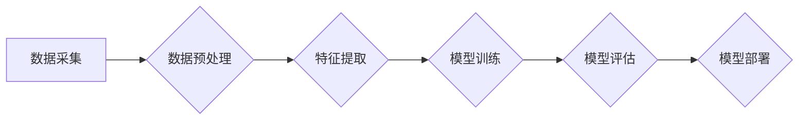

> MCI, 疾病分类, 机器学习, 深度学习, 神经网络, 诊断, 预后

## 1. 背景介绍

随着全球人口老龄化进程的加速，认知障碍（Cognitive Impairment，CI）已成为一个日益严峻的公共卫生问题。其中，轻度认知障碍（Mild Cognitive Impairment，MCI）作为一种介于正常衰老和阿尔茨海默病（Alzheimer's Disease，AD）之间的认知功能下降状态，其发生率较高，且具有发展为AD的风险。因此，准确识别和分类MCI患者对于早期干预、延缓疾病进展和减轻患者及家属负担具有重要意义。

传统上，MCI的诊断主要依赖于临床评估和神经影像学检查，但这些方法存在着主观性强、成本高、时间耗长等缺点。近年来，机器学习（Machine Learning，ML）技术在医疗领域取得了显著进展，为MCI的诊断和分类提供了新的思路和方法。

## 2. 核心概念与联系

机器学习是一种人工智能技术，它通过算法学习数据中的模式和规律，从而实现对未知数据的预测和分类。在MCI疾病分类中，机器学习算法可以利用患者的临床特征、神经影像学数据、基因信息等多模态数据，构建预测模型，识别MCI患者。

**核心概念：**

* **机器学习：** 一种人工智能技术，通过算法学习数据中的模式和规律，实现对未知数据的预测和分类。
* **深度学习：** 一种机器学习的子集，利用多层神经网络模拟人类大脑的学习过程，能够学习更复杂的模式和特征。
* **神经网络：** 由多个神经元组成的网络结构，能够学习数据中的非线性关系。
* **分类算法：** 用于将数据划分为不同类别的一种机器学习算法。

**核心架构：**



## 3. 核心算法原理 & 具体操作步骤

### 3.1  算法原理概述

在MCI疾病分类中，常用的机器学习算法包括支持向量机（Support Vector Machine，SVM）、决策树（Decision Tree）、随机森林（Random Forest）、逻辑回归（Logistic Regression）和深度学习算法等。

* **支持向量机（SVM）：** 通过寻找数据中最佳的分隔超平面，将数据点划分为不同的类别。
* **决策树：** 通过一系列的决策规则，将数据点逐步分类。
* **随机森林：** 通过构建多个决策树，并对它们的预测结果进行投票，提高分类精度。
* **逻辑回归：** 通过建立一个逻辑函数，将数据点映射到0或1的类别。
* **深度学习算法：** 利用多层神经网络，学习数据中的更复杂的特征和模式。

### 3.2  算法步骤详解

以随机森林算法为例，其具体操作步骤如下：

1. **数据采集：** 收集MCI患者的临床特征、神经影像学数据、基因信息等多模态数据。
2. **数据预处理：** 对数据进行清洗、缺失值处理、特征缩放等操作，以提高算法的性能。
3. **特征提取：** 从原始数据中提取有用的特征，例如年龄、性别、教育水平、记忆力测试结果、脑部结构和功能等。
4. **模型训练：** 将数据划分为训练集和测试集，使用训练集训练随机森林模型，并调整模型参数以获得最佳性能。
5. **模型评估：** 使用测试集评估模型的性能，例如准确率、召回率、F1-score等指标。
6. **模型部署：** 将训练好的模型部署到实际应用场景中，用于预测新的MCI患者。

### 3.3  算法优缺点

**随机森林算法的优点：**

* **鲁棒性强：** 对噪声数据和异常值具有较强的鲁棒性。
* **泛化能力强：** 能够有效地推广到新的数据。
* **易于解释：** 可以通过分析决策树的结构来理解模型的决策过程。

**随机森林算法的缺点：**

* **训练时间长：** 训练多个决策树需要较长的计算时间。
* **内存消耗大：** 需要存储多个决策树模型。

### 3.4  算法应用领域

随机森林算法在MCI疾病分类之外，还广泛应用于其他医疗领域，例如：

* **肿瘤诊断和分类**
* **心血管疾病预测**
* **糖尿病管理**
* **药物研发**

## 4. 数学模型和公式 & 详细讲解 & 举例说明

### 4.1  数学模型构建

随机森林算法的核心是构建多个决策树，每个决策树都是通过一系列的决策规则将数据点逐步分类。决策规则的构建基于特征选择和阈值分割。

**特征选择：**

随机森林算法使用随机子采样法选择特征，即在每次决策节点选择特征时，随机选择一部分特征进行比较。

**阈值分割：**

对于每个特征，随机森林算法会计算所有可能的阈值，并选择能够将数据点最好地分割的阈值。

### 4.2  公式推导过程

随机森林算法的训练过程可以看作是多个决策树的训练过程。每个决策树的训练过程可以表示为以下公式：

$$
\text{决策树} = \text{决策节点} \rightarrow \text{决策规则} \rightarrow \text{叶子节点}
$$

其中，决策节点表示决策树的内部节点，决策规则表示将数据点分类的条件，叶子节点表示决策树的终端节点，每个叶子节点对应一个类别。

### 4.3  案例分析与讲解

假设我们有一个包含MCI患者和正常人群的数据集，我们需要使用随机森林算法进行分类。

1. **数据预处理：** 对数据进行清洗、缺失值处理、特征缩放等操作。
2. **特征提取：** 从原始数据中提取有用的特征，例如年龄、性别、教育水平、记忆力测试结果等。
3. **模型训练：** 使用训练集训练随机森林模型，并调整模型参数以获得最佳性能。
4. **模型评估：** 使用测试集评估模型的性能，例如准确率、召回率、F1-score等指标。

假设模型的准确率达到80%，这意味着该模型能够正确识别80%的MCI患者和正常人群。

## 5. 项目实践：代码实例和详细解释说明

### 5.1  开发环境搭建

* **操作系统：** Ubuntu 20.04 LTS
* **编程语言：** Python 3.8
* **机器学习库：** scikit-learn、TensorFlow、PyTorch
* **数据处理库：** Pandas、NumPy

### 5.2  源代码详细实现

```python
from sklearn.ensemble import RandomForestClassifier
from sklearn.model_selection import train_test_split
from sklearn.metrics import accuracy_score

# 加载数据
data = pd.read_csv('MCI_data.csv')

# 分割特征和标签
X = data.drop('MCI', axis=1)
y = data['MCI']

# 将数据划分为训练集和测试集
X_train, X_test, y_train, y_test = train_test_split(X, y, test_size=0.2, random_state=42)

# 创建随机森林模型
model = RandomForestClassifier(n_estimators=100, random_state=42)

# 训练模型
model.fit(X_train, y_train)

# 预测测试集
y_pred = model.predict(X_test)

# 计算模型准确率
accuracy = accuracy_score(y_test, y_pred)
print(f'模型准确率: {accuracy}')
```

### 5.3  代码解读与分析

* **数据加载和预处理：** 使用Pandas库加载数据，并进行必要的预处理操作，例如缺失值处理、特征缩放等。
* **特征和标签分离：** 将数据分为特征（X）和标签（y）两部分。
* **数据分割：** 将数据划分为训练集和测试集，用于模型训练和评估。
* **模型创建：** 使用scikit-learn库创建随机森林模型，并设置模型参数，例如树的数量（n_estimators）。
* **模型训练：** 使用训练集训练模型，并调整模型参数以获得最佳性能。
* **模型预测：** 使用训练好的模型预测测试集的标签。
* **模型评估：** 使用测试集评估模型的性能，例如准确率。

### 5.4  运行结果展示

运行上述代码后，会输出模型的准确率。

## 6. 实际应用场景

MCI疾病分类的机器学习模型可以应用于以下场景：

* **临床诊断辅助：** 帮助医生更准确地识别MCI患者，并进行早期干预。
* **疾病预后预测：** 根据患者的特征和数据，预测MCI患者发展为AD的风险。
* **个性化治疗方案：** 根据患者的个体特征，制定个性化的治疗方案。

### 6.4  未来应用展望

随着人工智能技术的不断发展，机器学习在MCI疾病分类领域的应用前景广阔。未来，我们可以期待以下应用：

* **多模态数据融合：** 将临床特征、神经影像学数据、基因信息等多模态数据融合，构建更准确的预测模型。
* **实时监测和预警：** 利用 wearable 设备实时监测患者的生理指标，并进行早期预警。
* **智能辅助诊断系统：** 开发智能辅助诊断系统，帮助医生更快、更准确地诊断MCI患者。

## 7. 工具和资源推荐

### 7.1  学习资源推荐

* **在线课程：** Coursera、edX、Udacity 等平台提供机器学习和深度学习相关的在线课程。
* **书籍：** 《机器学习实战》、《深度学习》等书籍是机器学习和深度学习的经典教材。
* **博客和论坛：** 机器学习和深度学习领域的博客和论坛可以获取最新的研究进展和技术分享。

### 7.2  开发工具推荐

* **Python：** 机器学习和深度学习的常用编程语言。
* **scikit-learn：** Python机器学习库，提供各种机器学习算法和工具。
* **TensorFlow、PyTorch：** 深度学习框架，用于构建和训练深度学习模型。

### 7.3  相关论文推荐

* **Alzheimer's Disease Neuroimaging Initiative (ADNI) 数据集：** https://adni.loni.usc.edu/
* **机器学习在MCI疾病分类中的研究论文：** https://www.ncbi.nlm.nih.gov/pubmed/?term=machine+learning+mild+cognitive+impairment

## 8. 总结：未来发展趋势与挑战

### 8.1  研究成果总结

机器学习在MCI疾病分类领域取得了显著进展，能够有效地识别MCI患者，并预测疾病进展。

### 8.2  未来发展趋势

未来，机器学习在MCI疾病分类领域的应用将朝着以下方向发展：

* **多模态数据融合：** 将更多类型的医疗数据融合，构建更准确的预测模型。
* **个性化治疗方案：** 根据患者的个体特征，制定个性化的治疗方案。
* **实时监测和预警：** 利用 wearable 设备实时监测患者的生理指标，并进行早期预警。

### 8.3  面临的挑战

尽管机器学习在MCI疾病分类领域取得了进展，但仍面临一些挑战：

* **数据质量和可用性：** MCI患者的数据往往具有不完整、不一致等问题，需要进行有效的数据清洗和预处理。
* **模型解释性和可信度：** 许多机器学习模型的决策过程难以解释，需要提高模型的透明度和可信度。
* **伦理和隐私问题：** 使用患者的医疗数据进行机器学习训练和应用，需要考虑伦理和隐私问题。

### 8.4  研究展望

未来，需要进一步研究以下问题：

* 如何提高MCI患者数据的质量和可用性。
* 如何开发更准确、更可