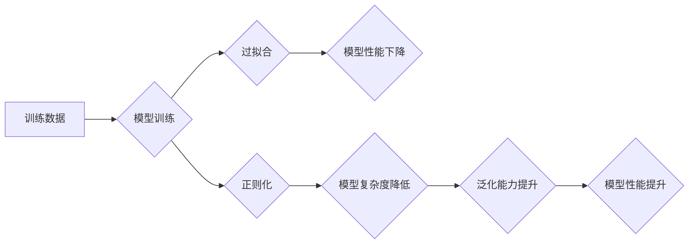

> 正则化，过拟合，L1正则化，L2正则化，Elastic Net正则化，模型复杂度，泛化能力

## 1. 背景介绍

在机器学习领域，模型的泛化能力是至关重要的。泛化能力是指模型在训练数据之外的新数据上也能表现良好。然而，在训练过程中，模型可能会过拟合训练数据，即模型在训练数据上表现出色，但在新数据上表现不佳。过拟合是机器学习中常见的问题，会导致模型的性能下降。

正则化是一种常用的技术，用于防止模型过拟合。正则化通过在模型的损失函数中添加惩罚项，来限制模型的复杂度。惩罚项通常与模型参数的绝对值或平方值相关。通过添加惩罚项，正则化可以鼓励模型学习更简单的模型，从而提高模型的泛化能力。

## 2. 核心概念与联系

正则化旨在解决机器学习模型过拟合的问题。过拟合是指模型在训练数据上表现出色，但在测试数据上表现不佳。这是因为模型过于复杂，学习了训练数据中的噪声和随机性，而不是真正的模式。

正则化通过在模型的损失函数中添加惩罚项，来限制模型的复杂度。惩罚项通常与模型参数的绝对值或平方值相关。通过添加惩罚项，正则化可以鼓励模型学习更简单的模型，从而提高模型的泛化能力。



## 3. 核心算法原理 & 具体操作步骤

### 3.1  算法原理概述

正则化算法的核心思想是通过在模型的损失函数中添加一个惩罚项，来限制模型的复杂度。惩罚项通常与模型参数的绝对值或平方值相关。

### 3.2  算法步骤详解

1. **定义损失函数:** 首先，定义模型的损失函数，该函数衡量模型预测值与真实值的差异。
2. **添加惩罚项:** 在损失函数中添加一个惩罚项，该项与模型参数的绝对值或平方值相关。
3. **优化模型参数:** 使用优化算法，例如梯度下降，来最小化损失函数加上惩罚项。

### 3.3  算法优缺点

**优点:**

* 可以有效防止模型过拟合。
* 可以提高模型的泛化能力。

**缺点:**

* 需要额外的参数调整，例如惩罚项的权重。
* 可能导致模型欠拟合，如果惩罚项过大。

### 3.4  算法应用领域

正则化算法广泛应用于各种机器学习领域，例如：

* **分类:** 线性回归、逻辑回归、支持向量机等。
* **回归:** 线性回归、岭回归、套索回归等。
* **神经网络:** 深度学习模型的正则化。

## 4. 数学模型和公式 & 详细讲解 & 举例说明

### 4.1  数学模型构建

假设我们有一个线性回归模型，其损失函数为均方误差：

$$
L(w) = \frac{1}{2} \sum_{i=1}^{n} (y_i - \hat{y}_i)^2
$$

其中：

* $w$ 是模型参数向量。
* $y_i$ 是第 $i$ 个样本的真实值。
* $\hat{y}_i$ 是第 $i$ 个样本的预测值。

为了进行正则化，我们可以在损失函数中添加一个惩罚项，例如L2正则化：

$$
L_{reg}(w) = L(w) + \lambda ||w||^2
$$

其中：

* $\lambda$ 是正则化参数，控制惩罚项的强度。
* $||w||^2$ 是模型参数向量的L2范数，即所有参数的平方和。

### 4.2  公式推导过程

L2正则化惩罚项的目的是限制模型参数的幅值。当$\lambda$较大时，惩罚项对损失函数的影响较大，模型倾向于学习更小的参数值，从而降低模型的复杂度。

### 4.3  案例分析与讲解

假设我们有一个线性回归模型，用于预测房价。训练数据包含房屋面积、房间数量等特征，以及对应的房价。如果模型过于复杂，可能会过拟合训练数据，导致在测试数据上表现不佳。

我们可以使用L2正则化来防止模型过拟合。通过添加L2正则化惩罚项，我们可以限制模型参数的幅值，从而降低模型的复杂度。

## 5. 项目实践：代码实例和详细解释说明

### 5.1  开发环境搭建

* Python 3.x
* scikit-learn

### 5.2  源代码详细实现

```python
from sklearn.linear_model import LinearRegression
from sklearn.model_selection import train_test_split
from sklearn.metrics import mean_squared_error

# 准备数据
# ...

# 将数据分割为训练集和测试集
X_train, X_test, y_train, y_test = train_test_split(X, y, test_size=0.2, random_state=42)

# 创建线性回归模型
model = LinearRegression()

# 使用L2正则化
model = LinearRegression(penalty='l2', C=1.0)

# 训练模型
model.fit(X_train, y_train)

# 预测测试集
y_pred = model.predict(X_test)

# 计算均方误差
mse = mean_squared_error(y_test, y_pred)
print(f'均方误差: {mse}')
```

### 5.3  代码解读与分析

* `LinearRegression()` 创建线性回归模型。
* `penalty='l2'` 设置正则化类型为L2正则化。
* `C=1.0` 设置正则化参数，控制惩罚项的强度。
* `model.fit(X_train, y_train)` 训练模型。
* `model.predict(X_test)` 预测测试集。
* `mean_squared_error()` 计算均方误差。

### 5.4  运行结果展示

运行代码后，会输出测试集的均方误差。

## 6. 实际应用场景

正则化在机器学习领域有着广泛的应用场景，例如：

* **图像识别:** 在图像识别任务中，正则化可以防止模型过拟合训练数据，从而提高模型在新的图像上的识别准确率。
* **自然语言处理:** 在自然语言处理任务中，正则化可以防止模型过拟合训练数据，从而提高模型在新的文本上的理解和生成能力。
* **推荐系统:** 在推荐系统中，正则化可以防止模型过拟合训练数据，从而提高模型在新的用户和物品上的推荐准确率。

### 6.4  未来应用展望

随着机器学习技术的不断发展，正则化技术也将不断得到改进和完善。未来，正则化技术可能会应用于更多领域，例如：

* **医疗诊断:** 正则化可以帮助医生更准确地诊断疾病。
* **金融预测:** 正则化可以帮助金融机构更准确地预测市场趋势。
* **自动驾驶:** 正则化可以帮助自动驾驶系统更安全地行驶。

## 7. 工具和资源推荐

### 7.1  学习资源推荐

* **书籍:**
    * The Elements of Statistical Learning
    * Pattern Recognition and Machine Learning
* **在线课程:**
    * Coursera: Machine Learning
    * edX: Introduction to Machine Learning

### 7.2  开发工具推荐

* **Python:** 
    * scikit-learn
    * TensorFlow
    * PyTorch

### 7.3  相关论文推荐

* **Regularization and Variable Selection via Elastic Net**
* **Dropout: A Simple Way to Prevent Neural Networks from Overfitting**

## 8. 总结：未来发展趋势与挑战

### 8.1  研究成果总结

正则化技术已经取得了显著的成果，有效地解决了机器学习模型过拟合的问题，提高了模型的泛化能力。

### 8.2  未来发展趋势

未来，正则化技术将朝着以下方向发展：

* **更有效的正则化方法:** 研究更有效的正则化方法，例如自适应正则化、动态正则化等。
* **更广泛的应用场景:** 将正则化技术应用于更多领域，例如医疗诊断、金融预测、自动驾驶等。
* **理论研究:** 深入研究正则化技术的理论基础，例如正则化与模型复杂度之间的关系、正则化与泛化能力之间的关系等。

### 8.3  面临的挑战

正则化技术也面临一些挑战：

* **参数选择:** 正则化参数的选择对模型性能有重要影响，需要进行仔细的调优。
* **计算复杂度:** 一些正则化方法的计算复杂度较高，需要更高效的算法实现。
* **解释性:** 一些正则化方法的解释性较差，难以理解模型的决策过程。

### 8.4  研究展望

未来，正则化技术的研究将继续深入，探索更有效的正则化方法，并将其应用于更多领域，为人工智能的发展做出更大的贡献。

## 9. 附录：常见问题与解答

**问题:** 什么是正则化？

**答案:** 正则化是一种技术，用于防止机器学习模型过拟合。

**问题:** 正则化有哪些类型？

**答案:** 常见的正则化类型包括L1正则化、L2正则化和Elastic Net正则化。

**问题:** 如何选择正则化参数？

**答案:** 正则化参数的选择需要根据具体问题和数据集进行调优。可以使用交叉验证等方法进行参数选择。


作者：禅与计算机程序设计艺术 / Zen and the Art of Computer Programming 
<end_of_turn>