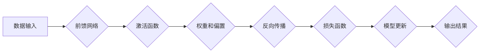

> 深度学习、神经网络、卷积神经网络、循环神经网络、梯度下降、反向传播、TensorFlow、PyTorch

## 1. 背景介绍

深度学习作为机器学习领域的一个重要分支，近年来取得了令人瞩目的成就，在图像识别、自然语言处理、语音识别等领域展现出强大的应用潜力。深度学习的核心在于利用多层神经网络来模拟人类大脑的学习过程，通过对大量数据进行训练，能够自动学习特征并进行复杂的任务处理。

传统的机器学习方法通常需要人工提取特征，而深度学习则能够自动学习特征，这使得其在处理复杂数据和模式方面具有显著优势。随着计算能力的提升和数据量的爆炸式增长，深度学习的研究和应用得到了快速发展。

## 2. 核心概念与联系

深度学习的核心概念包括：

* **神经网络:** 仿照人脑神经元结构的计算模型，由多个层级的神经元组成，每个神经元接收来自上一层的输入，进行处理后传递给下一层。
* **激活函数:** 用于引入非线性，使神经网络能够学习复杂的模式。常见的激活函数包括 sigmoid、ReLU、tanh 等。
* **权重和偏置:** 神经网络的参数，通过训练过程不断调整，以最小化预测误差。
* **反向传播算法:** 用于更新神经网络权重和偏置的算法，通过计算误差梯度，反向传播到各层神经元，并调整权重和偏置。
* **损失函数:** 用于衡量模型预测结果与真实值的差异，常用的损失函数包括均方误差、交叉熵等。

**核心概念架构流程图:**



## 3. 核心算法原理 & 具体操作步骤

### 3.1  算法原理概述

深度学习的核心算法是反向传播算法，它通过迭代更新神经网络的权重和偏置，使模型的预测结果越来越接近真实值。

反向传播算法的基本步骤如下：

1. **前向传播:** 将输入数据通过神经网络传递，计算输出结果。
2. **损失函数计算:** 计算模型预测结果与真实值的差异，即损失值。
3. **反向传播:** 计算损失值对各层神经元的梯度，并反向传播到各层。
4. **权重更新:** 根据梯度信息，更新神经网络的权重和偏置。

### 3.2  算法步骤详解

1. **初始化:** 随机初始化神经网络的权重和偏置。
2. **前向传播:** 将输入数据输入到神经网络的第一层，并依次传递到下一层，直到计算出输出结果。
3. **损失函数计算:** 使用损失函数计算模型预测结果与真实值的差异。
4. **反向传播:** 计算损失值对各层神经元的梯度，并反向传播到各层。
5. **权重更新:** 使用梯度下降算法更新神经网络的权重和偏置。
6. **重复步骤2-5:** 迭代执行上述步骤，直到损失值达到预设阈值或训练次数达到上限。

### 3.3  算法优缺点

**优点:**

* 自动学习特征，无需人工提取。
* 能够处理复杂数据和模式。
* 性能优异，在许多领域取得了突破性进展。

**缺点:**

* 训练数据量大，需要大量计算资源。
* 训练过程复杂，需要专业知识和经验。
* 模型解释性差，难以理解模型的决策过程。

### 3.4  算法应用领域

深度学习算法广泛应用于以下领域:

* **图像识别:** 人脸识别、物体检测、图像分类等。
* **自然语言处理:** 机器翻译、文本摘要、情感分析等。
* **语音识别:** 语音转文本、语音助手等。
* **推荐系统:** 商品推荐、内容推荐等。
* **医疗诊断:** 病情预测、疾病诊断等。

## 4. 数学模型和公式 & 详细讲解 & 举例说明

### 4.1  数学模型构建

深度学习模型通常由多层神经网络组成，每层神经元之间通过权重连接，并使用激活函数进行非线性变换。

**神经网络模型:**

$$
y = f(W^L x^L + b^L)
$$

其中:

* $y$ 是输出结果
* $x^L$ 是第 $L$ 层的输入
* $W^L$ 是第 $L$ 层的权重矩阵
* $b^L$ 是第 $L$ 层的偏置向量
* $f$ 是激活函数

### 4.2  公式推导过程

反向传播算法的核心是计算损失函数对各层神经元的梯度。

**梯度计算公式:**

$$
\frac{\partial L}{\partial w_{ij}^l} = \frac{\partial L}{\partial y} \cdot \frac{\partial y}{\partial z_{j}^l} \cdot \frac{\partial z_{j}^l}{\partial w_{ij}^l}
$$

其中:

* $L$ 是损失函数
* $w_{ij}^l$ 是第 $l$ 层第 $i$ 个神经元到第 $j$ 个神经元的权重
* $y$ 是输出结果
* $z_{j}^l$ 是第 $l$ 层第 $j$ 个神经元的激活值

### 4.3  案例分析与讲解

以图像分类为例，假设我们使用卷积神经网络进行训练，目标是将图像分类为不同的类别。

在训练过程中，我们首先将图像输入到卷积层，卷积层会提取图像的特征。然后，特征会传递到全连接层，全连接层会将特征映射到不同的类别。

损失函数通常是交叉熵损失函数，它衡量模型预测结果与真实类别之间的差异。

反向传播算法会计算损失函数对各层神经元的梯度，并根据梯度更新权重和偏置。

## 5. 项目实践：代码实例和详细解释说明

### 5.1  开发环境搭建

深度学习开发环境通常需要安装以下软件:

* Python 语言
* 深度学习框架 (例如 TensorFlow、PyTorch)
* 数据处理库 (例如 NumPy、Pandas)
* 可视化库 (例如 Matplotlib、Seaborn)

### 5.2  源代码详细实现

以下是一个使用 TensorFlow 实现图像分类的简单代码示例:

```python
import tensorflow as tf

# 定义模型
model = tf.keras.models.Sequential([
    tf.keras.layers.Conv2D(32, (3, 3), activation='relu', input_shape=(28, 28, 1)),
    tf.keras.layers.MaxPooling2D((2, 2)),
    tf.keras.layers.Conv2D(64, (3, 3), activation='relu'),
    tf.keras.layers.MaxPooling2D((2, 2)),
    tf.keras.layers.Flatten(),
    tf.keras.layers.Dense(10, activation='softmax')
])

# 编译模型
model.compile(optimizer='adam',
              loss='sparse_categorical_crossentropy',
              metrics=['accuracy'])

# 训练模型
model.fit(x_train, y_train, epochs=5)

# 评估模型
loss, accuracy = model.evaluate(x_test, y_test)
print('Test loss:', loss)
print('Test accuracy:', accuracy)
```

### 5.3  代码解读与分析

这段代码定义了一个简单的卷积神经网络模型，用于图像分类任务。

* `tf.keras.models.Sequential` 创建了一个顺序模型，层级结构清晰。
* `tf.keras.layers.Conv2D` 定义卷积层，用于提取图像特征。
* `tf.keras.layers.MaxPooling2D` 定义最大池化层，用于降维和提高模型鲁棒性。
* `tf.keras.layers.Flatten` 将多维特征转换为一维向量。
* `tf.keras.layers.Dense` 定义全连接层，用于分类。
* `model.compile` 编译模型，指定优化器、损失函数和评价指标。
* `model.fit` 训练模型，使用训练数据进行训练。
* `model.evaluate` 评估模型，使用测试数据计算损失和准确率。

### 5.4  运行结果展示

训练完成后，模型会输出测试集上的损失和准确率。

## 6. 实际应用场景

深度学习在各个领域都有广泛的应用场景，例如:

### 6.1  图像识别

* **人脸识别:** 用于解锁手机、身份验证等。
* **物体检测:** 用于自动驾驶、安防监控等。
* **图像分类:** 用于医学影像诊断、产品识别等。

### 6.2  自然语言处理

* **机器翻译:** 将文本从一种语言翻译成另一种语言。
* **文本摘要:** 自动生成文本的简短摘要。
* **情感分析:** 分析文本的情感倾向，例如正面、负面或中性。

### 6.3  语音识别

* **语音转文本:** 将语音转换为文本。
* **语音助手:** 例如 Siri、Alexa 等。

### 6.4  未来应用展望

深度学习技术还在不断发展，未来将有更多新的应用场景出现，例如:

* **个性化推荐:** 基于用户的行为和偏好，提供个性化的商品、内容推荐。
* **自动驾驶:** 深度学习可以帮助自动驾驶汽车感知周围环境、做出决策。
* **医疗诊断:** 深度学习可以辅助医生进行疾病诊断，提高诊断准确率。

## 7. 工具和资源推荐

### 7.1  学习资源推荐

* **书籍:**
    * 深度学习 (Deep Learning) - Ian Goodfellow, Yoshua Bengio, Aaron Courville
    * 深度学习实践 (Deep Learning with Python) - Francois Chollet
* **在线课程:**
    * Coursera: 深度学习 Specialization
    * Udacity: 深度学习 Nanodegree
    * fast.ai: 深度学习课程

### 7.2  开发工具推荐

* **TensorFlow:** Google 开发的开源深度学习框架。
* **PyTorch:** Facebook 开发的开源深度学习框架。
* **Keras:** TensorFlow 上的深度学习 API，易于使用。

### 7.3  相关论文推荐

* **ImageNet Classification with Deep Convolutional Neural Networks** - Alex Krizhevsky, Ilya Sutskever, Geoffrey E. Hinton
* **Sequence to Sequence Learning with Neural Networks** - Ilya Sutskever, Oriol Vinyals, Quoc V. Le
* **Attention Is All You Need** - Ashish Vaswani, Noam Shazeer, Niki Parmar, Jakob Uszkoreit, Llion Jones, Aidan N. Gomez, Łukasz Kaiser, Illia Polosukhin

## 8. 总结：未来发展趋势与挑战

### 8.1  研究成果总结

深度学习在过去几年取得了显著的进展，在图像识别、自然语言处理、语音识别等领域取得了突破性成果。

### 8.2  未来发展趋势

* **模型规模和复杂度提升:** 随着计算能力的提升，深度学习模型将变得更大、更复杂。
* **模型解释性和可解释性增强:** 研究如何更好地理解和解释深度学习模型的决策过程。
* **跨模态学习:** 研究如何让深度学习模型能够处理多种模态数据，例如文本、图像、音频等。
* **边缘计算和部署:** 将深度学习模型部署到边缘设备，实现更快速的推理和更低的延迟。

### 8.3  面临的挑战

* **数据获取和标注:** 深度学习模型需要大量的数据进行训练，数据获取和标注成本较高。
* **计算资源需求:** 训练