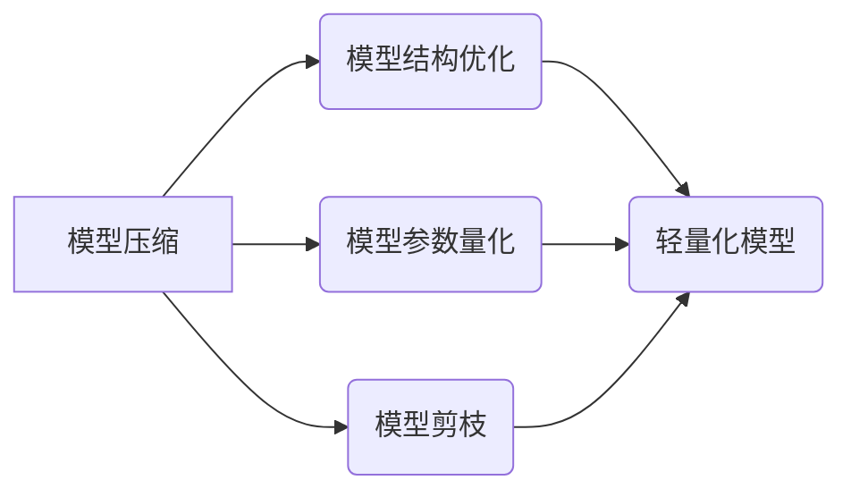

> 深度学习，模型压缩，轻量化，效率，可部署性，精度

## 1. 背景介绍

深度学习在图像识别、自然语言处理、语音识别等领域取得了突破性的进展，但其模型规模庞大，计算资源需求高，部署成本高昂，这限制了其在移动设备、嵌入式系统等资源受限环境中的应用。因此，深度学习模型的压缩与轻量化技术成为一个重要的研究方向。

模型压缩是指通过减少模型参数数量、减少模型层数或减少模型计算量来减小模型规模，从而降低模型存储和计算成本。轻量化模型是指经过压缩和优化后，模型规模更小、计算效率更高，同时保持一定精度。

## 2. 核心概念与联系

**2.1 模型压缩与轻量化技术的关系**

模型压缩与轻量化技术是相辅相成的，模型压缩是实现轻量化模型的基础。轻量化模型不仅体现在模型规模的减小，还包括模型结构的优化、算法的加速等方面。

**2.2 核心概念**

* **模型参数:** 深度学习模型的核心组成部分，存储模型的知识和特征。
* **模型结构:** 深度学习模型的框架和层次结构，决定了模型的输入、输出和中间层之间的关系。
* **模型计算量:** 模型进行推理时所需的计算次数，与模型规模和结构密切相关。
* **模型精度:** 模型预测结果的准确性，通常用准确率、召回率、F1-score等指标衡量。

**2.3 核心概念架构**



## 3. 核心算法原理 & 具体操作步骤

### 3.1 算法原理概述

模型压缩与轻量化技术主要包括以下几种算法：

* **模型结构优化:** 通过设计更紧凑的模型结构，减少模型层数和参数数量。
* **模型参数量化:** 将模型参数从高精度浮点数转换为低精度整数，减少参数存储空间和计算量。
* **模型剪枝:** 通过移除模型中不重要的参数或连接，减少模型规模。

### 3.2 算法步骤详解

**3.2.1 模型结构优化**

1. **选择合适的模型架构:** 针对不同的任务选择合适的模型架构，例如MobileNet、EfficientNet等轻量化模型架构。
2. **通道注意力机制:** 利用通道注意力机制，学习每个通道的重要性，并动态调整通道权重，减少冗余信息。
3. **深度可分离卷积:** 使用深度可分离卷积，将卷积操作分解为深度卷积和空间卷积，减少计算量。

**3.2.2 模型参数量化**

1. **选择量化方法:** 常用的量化方法包括均匀量化、非均匀量化、动态量化等。
2. **量化精度:** 根据模型精度需求选择合适的量化精度，例如8位、4位等。
3. **量化后训练:** 量化模型参数后，需要进行微调训练，以恢复模型精度。

**3.2.3 模型剪枝**

1. **选择剪枝方法:** 常用的剪枝方法包括随机剪枝、梯度剪枝、结构剪枝等。
2. **剪枝比例:** 根据模型规模和精度需求选择合适的剪枝比例。
3. **剪枝后训练:** 剪枝后需要进行微调训练，以恢复模型精度。

### 3.3 算法优缺点

| 算法 | 优点 | 缺点 |
|---|---|---|
| 模型结构优化 | 减少模型参数数量，提高模型效率 | 需要设计新的模型架构，可能需要更多的计算资源进行训练 |
| 模型参数量化 | 显著减少模型存储空间和计算量 | 量化精度降低，可能导致模型精度下降 |
| 模型剪枝 | 可以有效减少模型规模，提高模型效率 | 剪枝后模型精度可能下降，需要进行微调训练 |

### 3.4 算法应用领域

模型压缩与轻量化技术广泛应用于以下领域：

* **移动设备:** 压缩模型可以部署在资源受限的移动设备上，例如智能手机、平板电脑等。
* **嵌入式系统:** 压缩模型可以部署在嵌入式系统上，例如物联网设备、无人机等。
* **边缘计算:** 压缩模型可以部署在边缘设备上，例如工业自动化设备、医疗设备等。

## 4. 数学模型和公式 & 详细讲解 & 举例说明

### 4.1 数学模型构建

**4.1.1 模型参数量化**

假设模型参数为浮点数，量化精度为k位，则量化后的参数可以表示为：

$$
q(w) = round(w / 2^{k-1}) * 2^{k-1}
$$

其中，w为原始参数，q(w)为量化后的参数。

**4.1.2 模型剪枝**

模型剪枝可以采用梯度下降法来选择剪枝的权重。

$$
\frac{\partial Loss}{\partial w}
$$

其中，Loss为模型损失函数，w为模型权重。

剪枝策略可以根据梯度的大小来选择剪枝的权重，例如，将梯度绝对值小于阈值的权重剪枝。

### 4.2 公式推导过程

**4.2.1 量化后精度损失分析**

量化后的参数精度损失主要来自于量化过程中的舍入误差。

$$
Error = w - q(w)
$$

其中，Error为量化误差。

**4.2.2 剪枝后模型精度恢复分析**

剪枝后模型精度损失主要来自于剪枝过程中移除的权重信息。

可以通过微调训练来恢复模型精度，微调训练的目标是最小化模型损失函数。

$$
Loss = \sum_{i=1}^{N} (y_i - \hat{y}_i)^2
$$

其中，y_i为真实标签，\hat{y}_i为模型预测值。

### 4.3 案例分析与讲解

**4.3.1 模型量化案例**

将一个深度卷积神经网络模型从32位浮点数量化为8位整数，可以显著减少模型存储空间和计算量，同时保持一定的精度。

**4.3.2 模型剪枝案例**

通过移除一个深度卷积神经网络模型中不重要的权重，可以有效减少模型规模，提高模型效率。

## 5. 项目实践：代码实例和详细解释说明

### 5.1 开发环境搭建

* 操作系统: Ubuntu 20.04
* Python 版本: 3.8
* 深度学习框架: TensorFlow 2.x

### 5.2 源代码详细实现

```python
import tensorflow as tf

# 定义一个简单的卷积神经网络模型
model = tf.keras.models.Sequential([
    tf.keras.layers.Conv2D(32, (3, 3), activation='relu', input_shape=(28, 28, 1)),
    tf.keras.layers.MaxPooling2D((2, 2)),
    tf.keras.layers.Flatten(),
    tf.keras.layers.Dense(10, activation='softmax')
])

# 编译模型
model.compile(optimizer='adam',
              loss='sparse_categorical_crossentropy',
              metrics=['accuracy'])

# 加载 MNIST 数据集
(x_train, y_train), (x_test, y_test) = tf.keras.datasets.mnist.load_data()

# 数据预处理
x_train = x_train.astype('float32') / 255.0
x_test = x_test.astype('float32') / 255.0
x_train = x_train.reshape((x_train.shape[0], 28, 28, 1))
x_test = x_test.reshape((x_test.shape[0], 28, 28, 1))

# 模型训练
model.fit(x_train, y_train, epochs=5)

# 模型评估
loss, accuracy = model.evaluate(x_test, y_test, verbose=0)
print('Test loss:', loss)
print('Test accuracy:', accuracy)
```

### 5.3 代码解读与分析

* 代码首先定义了一个简单的卷积神经网络模型。
* 然后编译模型，指定优化器、损失函数和评估指标。
* 加载 MNIST 数据集，并进行数据预处理。
* 训练模型，并评估模型性能。

### 5.4 运行结果展示

运行代码后，可以得到模型的训练损失和测试精度。

## 6. 实际应用场景

### 6.1 移动设备应用

深度学习模型的压缩与轻量化技术可以将大型深度学习模型部署在移动设备上，例如智能手机、平板电脑等。

### 6.2 嵌入式系统应用

深度学习模型的压缩与轻量化技术可以将大型深度学习模型部署在嵌入式系统上，例如物联网设备、无人机等。

### 6.3 边缘计算应用

深度学习模型的压缩与轻量化技术可以将大型深度学习模型部署在边缘设备上，例如工业自动化设备、医疗设备等。

### 6.4 未来应用展望

随着深度学习技术的不断发展，模型压缩与轻量化技术将得到更广泛的应用，例如：

* **自动驾驶:** 将深度学习模型部署在自动驾驶汽车中，实现更智能的驾驶辅助功能。
* **医疗诊断:** 将深度学习模型部署在医疗设备中，辅助医生进行疾病诊断。
* **人机交互:** 将深度学习模型部署在虚拟现实和增强现实设备中，实现更自然的人机交互。

## 7. 工具和资源推荐

### 7.1 学习资源推荐

* **书籍:**
    * 《深度学习》 - Ian Goodfellow, Yoshua Bengio, Aaron Courville
    * 《深度学习模型压缩与加速》 -  Andrew Trask
* **在线课程:**
    * Coursera: 深度学习
    * Udacity: 深度学习工程师

### 7.2 开发工具推荐

* **TensorFlow Lite:** TensorFlow 的轻量化版本，用于部署模型在移动设备和嵌入式系统上。
* **PyTorch Mobile:** PyTorch 的轻量化版本，用于部署模型在移动设备和嵌入式系统上。
* **ONNX Runtime:** 一个跨平台的深度学习推理引擎，支持多种深度学习框架的模型。

### 7.3 相关论文推荐

* **MobileNet: Efficient Convolutional Neural Networks for Mobile Vision Applications**
* **EfficientNet: Rethinking Model Scaling for Convolutional Neural Networks**
* **Quantization-aware Training: A Methodology for Quantized Neural Network Training**

## 8. 总结：未来发展趋势与挑战

### 8.1 研究成果总结

近年来，深度学习模型的压缩与轻量化技术取得了显著进展，模型规模和计算量显著减少，同时保持一定的精度。

### 8.2 未来发展趋势

* **更有效的压缩算法:** 研究更有效的模型压缩算法，例如基于知识蒸馏、模型架构搜索等方法。
* **硬件加速:** 利用专用硬件加速深度学习模型推理，例如GPU、TPU等。
* **联邦学习:** 利用联邦学习技术，在不共享原始数据的情况下进行模型训练和压缩。

### 8.3 面临的挑战

* **精度损失:** 模型压缩可能会导致精度损失，需要找到平衡模型规模和精度的方法。
* **通用性:** 现有的压缩算法往往针对特定的模型架构和任务，缺乏通用性。
* **可解释性:** 深度学习模型的压缩过程往往是黑盒操作，缺乏可解释性。

### 8.4 研究展望

未来，深度学习模型的压缩与轻量化技术将继续发展，朝着更有效、更通用、更可解释的方向发展，为深度学习技术的广泛应用提供技术支持。

## 9. 附录：常见问题与解答