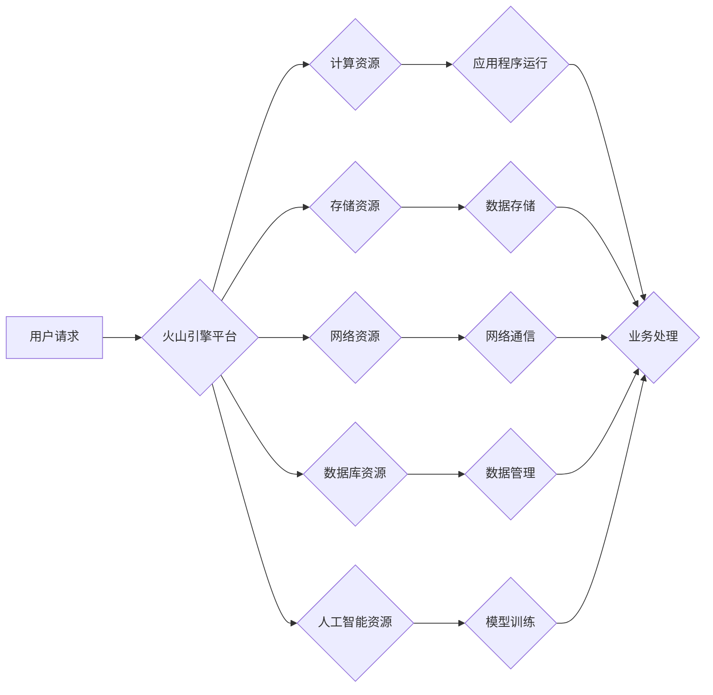

> 火山引擎，企业级云计算，人工智能，大数据，机器学习，云原生，容器化，DevOps

## 1. 背景介绍

在当今数字化转型加速的时代，企业迫切需要强大的技术基础设施来支撑业务发展。云计算作为一种新型的计算模式，凭借其弹性、可扩展性和成本效益，已成为企业数字化转型的关键驱动力。火山引擎作为阿里云旗下的企业级云计算平台，为企业用户提供了一系列全面的云计算服务，包括计算、存储、网络、数据库、人工智能等。

火山引擎的出现，标志着阿里云在企业级云计算领域的又一次突破。它不仅继承了阿里云成熟的云计算技术和经验，更针对企业用户的需求，提供了一套更加完善、安全、可靠的云计算解决方案。

## 2. 核心概念与联系

火山引擎的核心概念是“云原生”。云原生是指一种基于云计算平台的软件开发和部署模式，其特点是：

* **微服务架构:** 将应用程序拆分成多个独立的服务，每个服务负责特定的功能，并通过API进行通信。
* **容器化:** 将应用程序及其依赖环境打包成容器，方便部署和管理。
* **自动化:** 利用自动化工具来简化开发、测试和部署流程。
* **弹性伸缩:** 根据业务需求动态调整资源规模。

火山引擎通过提供云原生平台和工具，帮助企业用户构建和运行云原生应用，实现业务敏捷化、高效化和可扩展性。

**火山引擎架构流程图:**



## 3. 核心算法原理 & 具体操作步骤

火山引擎采用多种核心算法来实现其强大的功能，例如：

* **负载均衡算法:** 将用户请求分配到不同的服务器，确保应用程序的高可用性和性能。
* **容器调度算法:** 将容器分配到合适的节点，优化资源利用率。
* **机器学习算法:** 用于数据分析、预测和智能化决策。

**3.1 算法原理概述**

火山引擎的核心算法原理基于以下几个方面：

* **高可用性:** 通过冗余部署、负载均衡等技术，确保应用程序即使部分节点故障也能正常运行。
* **高性能:** 通过优化资源分配、缓存机制等技术，提高应用程序的响应速度和处理能力。
* **可扩展性:** 通过弹性伸缩、容器化等技术，方便用户根据业务需求动态调整资源规模。
* **安全性:** 通过身份认证、访问控制等技术，保障用户数据和应用程序的安全。

**3.2 算法步骤详解**

以负载均衡算法为例，其具体操作步骤如下：

1. 用户发送请求到负载均衡器。
2. 负载均衡器根据预设的策略，例如轮询、加权轮询等，选择一个健康的服务器转发请求。
3. 服务器处理请求并返回结果。
4. 负载均衡器将结果转发给用户。

**3.3 算法优缺点**

**优点:**

* 高可用性
* 高性能
* 可扩展性

**缺点:**

* 算法复杂度较高
* 需要专业的运维人员进行管理

**3.4 算法应用领域**

火山引擎的核心算法广泛应用于以下领域:

* **电商平台:** 负载均衡、推荐算法、个性化营销等。
* **金融服务:** 风险控制、欺诈检测、智能客服等。
* **医疗健康:** 病例诊断、药物研发、远程医疗等。
* **教育培训:** 在线学习、个性化辅导、智能测评等。

## 4. 数学模型和公式 & 详细讲解 & 举例说明

火山引擎的许多功能都依赖于复杂的数学模型和算法。例如，机器学习算法的训练过程就需要用到大量的数学公式和计算。

**4.1 数学模型构建**

机器学习算法的训练过程可以看作是一个数学模型的构建过程。

假设我们有一个数据集，包含许多样本和对应的标签。我们的目标是找到一个函数，能够将样本映射到对应的标签。这个函数就是我们的数学模型。

**4.2 公式推导过程**

机器学习算法的训练过程通常使用梯度下降法来优化模型参数。梯度下降法的核心思想是：

* 计算模型预测值与真实值的误差。
* 根据误差反向传播，更新模型参数，使得误差最小化。

梯度下降法的公式如下：

$$
\theta = \theta - \alpha \nabla J(\theta)
$$

其中：

* $\theta$ 是模型参数
* $\alpha$ 是学习率
* $\nabla J(\theta)$ 是损失函数 $J(\theta)$ 的梯度

**4.3 案例分析与讲解**

例如，在训练一个图像分类模型时，我们可以使用卷积神经网络 (CNN) 作为数学模型。CNN 可以学习图像的特征，并将其映射到不同的类别。

训练过程中，我们会使用大量的图像数据，并根据模型预测值与真实标签的误差，更新模型参数。通过反复迭代，模型的预测精度会逐渐提高。

## 5. 项目实践：代码实例和详细解释说明

**5.1 开发环境搭建**

为了使用火山引擎，我们需要先搭建开发环境。

* 安装阿里云 SDK
* 创建阿里云账号并获取访问凭证
* 配置开发环境变量

**5.2 源代码详细实现**

以下是一个使用火山引擎部署简单Web应用程序的代码示例：

```python
import os
from alibabacloud_core import Client
from alibabacloud_ecs_20140526 import EcsClient

# 配置阿里云访问凭证
access_key_id = os.environ.get("ACCESS_KEY_ID")
access_key_secret = os.environ.get("ACCESS_KEY_SECRET")

# 创建阿里云客户端
client = EcsClient(access_key_id=access_key_id, access_key_secret=access_key_secret)

# 创建ECS实例
response = client.create_instance(
    instance_name="my-web-app",
    image_id="centos-7",
    instance_type="ecs.t2.small",
    security_group_ids=["sg-xxxxxxxx"],
)

# 获取实例ID
instance_id = response["InstanceId"]

# 等待实例启动
client.wait_instance_running(instance_id=instance_id)

# 连接到实例并部署应用程序
# ...
```

**5.3 代码解读与分析**

这段代码首先配置了阿里云访问凭证，然后创建了一个ECS客户端。

接着，代码调用了`create_instance`方法创建了一个名为`my-web-app`的ECS实例，并指定了镜像、实例类型和安全组。

最后，代码等待实例启动，然后连接到实例并部署应用程序。

**5.4 运行结果展示**

部署成功后，我们可以访问应用程序的URL，查看应用程序的运行状态。

## 6. 实际应用场景

火山引擎的应用场景非常广泛，以下是一些具体的例子：

* **电商平台:** 利用火山引擎的弹性计算、存储和数据库服务，构建高性能、高可用的电商平台，支持海量用户访问和交易。
* **金融服务:** 利用火山引擎的机器学习和人工智能服务，构建智能风控系统、欺诈检测系统和个性化金融服务。
* **医疗健康:** 利用火山引擎的云存储和数据分析服务，构建电子病历系统、远程医疗平台和疾病诊断系统。
* **教育培训:** 利用火山引擎的云计算和容器化服务，构建在线学习平台、个性化辅导系统和智能测评系统。

**6.4 未来应用展望**

随着云计算技术的不断发展，火山引擎的应用场景将会更加广泛。未来，火山引擎将更加注重以下几个方面：

* **边缘计算:** 将计算能力部署到更靠近用户的数据中心或边缘节点，降低延迟，提高实时性。
* **Serverless:** 提供无服务器计算服务，让用户无需关心服务器管理，专注于业务逻辑的开发。
* **人工智能:** 提供更强大的人工智能服务，帮助用户构建更智能的应用。

## 7. 工具和资源推荐

**7.1 学习资源推荐**

* 阿里云火山引擎官方文档: https://www.alibabacloud.com/help/doc-detail/100000
* 阿里云云原生技术社区: https://developer.aliyun.com/community/topic/100000

**7.2 开发工具推荐**

* 阿里云SDK: https://github.com/aliyun/alibabacloud-sdk-python
* Docker: https://www.docker.com/

**7.3 相关论文推荐**

* Kubernetes: https://kubernetes.io/docs/home/
* Serverless Computing: https://arxiv.org/abs/1703.04914

## 8. 总结：未来发展趋势与挑战

**8.1 研究成果总结**

火山引擎作为阿里云的企业级云计算平台，在云原生、人工智能、大数据等领域取得了显著的成果。其强大的功能和完善的生态系统，为企业用户提供了构建和运行现代化应用的强大支撑。

**8.2 未来发展趋势**

未来，火山引擎将继续朝着以下几个方向发展：

* **更强大的云原生能力:** 提供更完善的容器化、微服务化和自动化工具，帮助企业用户构建更敏捷、高效和可扩展的应用。
* **更智能的人工智能服务:** 提供更强大的机器学习和深度学习服务，帮助企业用户构建更智能的应用。
* **更广泛的应用场景:** 将火山引擎的应用场景扩展到更多领域，例如边缘计算、物联网和区块链。

**8.3 面临的挑战**

火山引擎的发展也面临着一些挑战：

* **技术复杂性:** 云原生技术和人工智能技术都非常复杂，需要不断进行研究和创新。
* **安全性和可靠性:** 企业级云计算平台需要保证高安全性、高可靠性和高可用性。
* **人才短缺:** 云原生和人工智能领域的人才需求量很大，需要加强人才培养和引进。

**8.4 研究展望**

火山引擎的未来发展充满机遇和挑战。我们相信，通过不断的技术创新和生态建设，火山引擎将成为企业用户构建和运行现代化应用的最佳选择。

## 9. 附录：常见问题与解答

**常见问题:**

* 如何使用火山引擎？
* 火山引擎有哪些功能？
* 火山引擎的收费标准是什么？

**解答:**

* 您可以访问阿里云火山引擎官方文档，了解如何使用火山引擎。
* 火山引擎提供了一系列功能，包括计算、存储、网络、数据库、人工智能等。
* 火山引擎的收费标准根据实际使用情况而定，您可以访问阿里云官网了解详细的收费标准。


作者：禅与计算机程序设计艺术 / Zen and the Art of Computer Programming 
<end_of_turn>