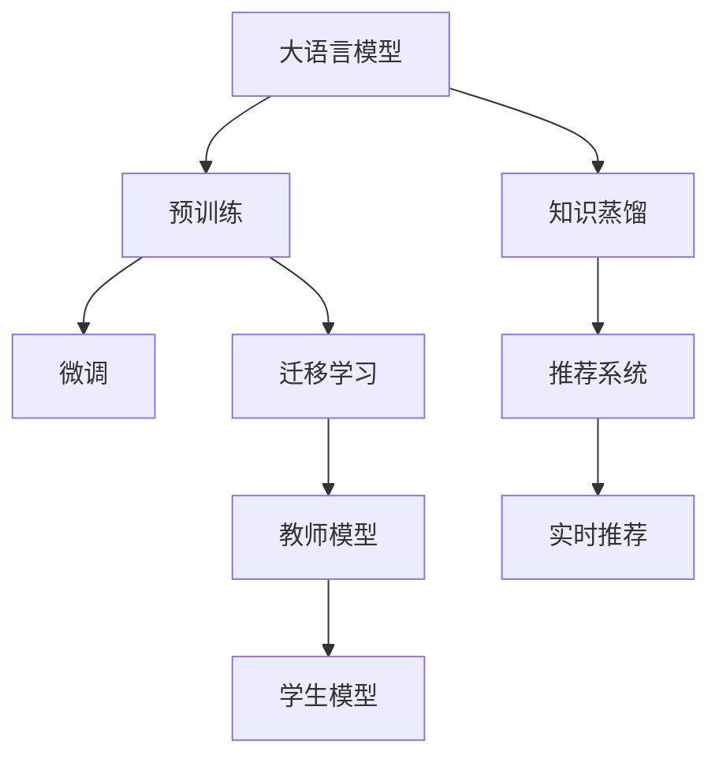

                 

# LLM在推荐系统中的知识蒸馏应用

> 关键词：知识蒸馏, 推荐系统, 自然语言处理, 深度学习, 模型压缩, 迁移学习

## 1. 背景介绍

### 1.1 问题由来
推荐系统在电商、新闻、社交媒体等领域得到了广泛应用，通过分析用户的历史行为和偏好，为用户推荐最感兴趣的内容。然而，传统的基于协同过滤的推荐算法往往依赖于用户的显式评分数据，难以处理大量非结构化数据，且推荐效果受用户数量和行为稀疏性的影响较大。

近年来，基于深度学习的推荐系统逐渐成为主流。特别是使用Transformer结构的深度神经网络模型，能够处理高维稀疏的非结构化数据，得到显著的性能提升。这些深度学习推荐模型，基于用户-物品交互矩阵进行训练，学习用户对物品的隐式评分。

然而，大模型往往需要大量的训练数据和计算资源，难以直接应用到实时推荐场景。因此，如何在大规模语料上进行预训练，然后将知识迁移到推荐任务，成为一个重要问题。

### 1.2 问题核心关键点
知识蒸馏(Knowledge Distillation)是一种经典的数据迁移学习方法，可以将一个复杂的教师模型（Teacher Model）的知识，迁移应用到另一个简单的学生模型（Student Model）中。在推荐系统中，可以使用大语言模型（Large Language Model, LLM）作为教师模型，通过知识蒸馏，将其知识迁移到轻量级的推荐模型中。

知识蒸馏的主要思想是，利用教师模型的知识进行训练，使学生模型能够在特定任务上获得较好的性能。具体地，知识蒸馏可以分为以下两个步骤：

1. **预训练**：在大规模语料上训练教师模型，学习语言和用户行为的知识。
2. **蒸馏**：将教师模型的知识，通过一定的方式，迁移到轻量级的学生模型中，使其获得与教师模型相似的性能。

知识蒸馏在推荐系统中的应用，可以使得轻量级模型能够利用大模型的丰富知识，提升推荐效果，同时节省计算和存储资源，实现模型的高效部署。

### 1.3 问题研究意义
知识蒸馏在推荐系统中的应用，能够有效解决以下几个关键问题：

1. **数据稀疏性**：大模型可以通过丰富的预训练知识，弥补用户行为数据稀疏性不足的问题，提升推荐系统的泛化能力。
2. **推荐多样性**：大模型的泛化能力更强，能够发现用户潜在的兴趣，提升推荐结果的多样性。
3. **实时性**：知识蒸馏方法可以使得轻量级模型在实时推荐场景中高效运行，适应推荐系统对实时性的要求。
4. **鲁棒性**：通过知识蒸馏，轻量级模型可以继承大模型的鲁棒性，减少推荐偏差和噪声干扰。
5. **普适性**：知识蒸馏方法可以在不同领域和任务中应用，推广到更多推荐场景中。

## 2. 核心概念与联系

### 2.1 核心概念概述

为更好地理解基于知识蒸馏的推荐系统，本节将介绍几个密切相关的核心概念：

- 大语言模型（LLM）：以自回归（如GPT）或自编码（如BERT）模型为代表的大规模预训练语言模型。通过在大规模无标签文本语料上进行预训练，学习通用的语言知识和常识。

- 知识蒸馏（Knowledge Distillation）：通过教师模型（Teacher Model）的知识，指导学生模型（Student Model）的训练过程，使其在特定任务上获得较好的性能。

- 预训练（Pre-training）：指在大规模无标签文本语料上，通过自监督学习任务训练通用语言模型的过程。常见的预训练任务包括言语建模、掩码语言模型等。

- 微调（Fine-Tuning）：指在预训练模型的基础上，使用下游任务的少量标注数据，通过有监督学习优化模型在特定任务上的性能。

- 迁移学习（Transfer Learning）：指将一个领域学习到的知识，迁移应用到另一个不同但相关的领域的学习范式。知识蒸馏可以看作一种特殊的迁移学习方法。

这些核心概念之间的逻辑关系可以通过以下Mermaid流程图来展示：



这个流程图展示了大语言模型的工作原理和知识蒸馏在推荐系统中的应用：

1. 大语言模型通过预训练获得基础能力。
2. 知识蒸馏方法将大模型的知识迁移到轻量级推荐模型中。
3. 推荐系统利用知识蒸馏得到的轻量级模型进行实时推荐。

这些概念共同构成了知识蒸馏在大语言模型推荐系统中的应用框架，使其能够高效地利用大模型的知识，提升推荐系统的性能。

## 3. 核心算法原理 & 具体操作步骤
### 3.1 算法原理概述

基于知识蒸馏的推荐系统，通过在大语言模型上进行预训练，学习语言和用户行为的知识。然后，将大模型的知识通过知识蒸馏的方式，迁移到轻量级推荐模型中，从而提升推荐系统的性能。

具体地，知识蒸馏方法通常包括以下几个步骤：

1. 在大规模语料上训练一个教师模型，学习语言和用户行为的知识。
2. 设计一个学生模型，通常采用轻量级的神经网络结构。
3. 将教师模型的输出（如预测的隐式评分）作为标签，指导学生模型的训练过程。
4. 在学生模型上进行微调，使其在特定任务上获得较好的性能。

知识蒸馏的核心思想是，通过教师模型的知识，引导学生模型的训练，使其能够获得较好的泛化能力。学生模型在训练过程中，学习教师模型的决策规则，继承其鲁棒性和泛化能力，从而提升推荐系统的性能。

### 3.2 算法步骤详解

以下详细介绍基于知识蒸馏的推荐系统在大语言模型中的应用流程：

**Step 1: 准备数据和模型**
- 收集大规模语料，用于大语言模型的预训练。
- 设计轻量级的推荐模型，如DNN、CNN、Transformer等，用于推荐任务的微调。

**Step 2: 大语言模型预训练**
- 在大规模语料上，使用自监督学习任务训练大语言模型，学习语言和用户行为的知识。
- 常用的自监督任务包括掩码语言模型、次序预测等。

**Step 3: 知识蒸馏过程**
- 使用大语言模型作为教师模型，将推荐任务的数据集划分为训练集和验证集。
- 设计学生模型，使用教师模型的输出作为标签，进行有监督的微调。
- 选择合适的优化器及其参数，如Adam、SGD等，设置学习率、批大小、迭代轮数等。
- 设置正则化技术及强度，包括权重衰减、Dropout、Early Stopping等。
- 在学生模型上进行微调，使其在特定任务上获得较好的性能。

**Step 4: 推荐系统集成**
- 将微调后的学生模型集成到推荐系统中，作为实时推荐的基础模型。
- 结合其他特征（如用户行为、物品属性等），进行多模态融合，提升推荐效果。
- 实时采集用户行为数据，周期性地重新微调模型，以适应数据分布的变化。

以上是基于知识蒸馏的推荐系统的一般流程。在实际应用中，还需要根据具体任务的特点，对微调过程的各个环节进行优化设计，如改进训练目标函数，引入更多的正则化技术，搜索最优的超参数组合等，以进一步提升推荐系统的效果。

### 3.3 算法优缺点

基于知识蒸馏的推荐系统具有以下优点：

1. **提升泛化能力**：通过知识蒸馏，学生模型能够利用大模型的知识，提升推荐系统的泛化能力。
2. **减少训练成本**：学生模型通常参数量较少，训练和推理速度较快，节省计算资源。
3. **简化模型结构**：学生模型结构相对简单，部署和维护成本较低。
4. **高实时性**：轻量级模型在实时推荐场景中具有更好的性能。
5. **鲁棒性**：知识蒸馏方法可以提高模型的鲁棒性和泛化能力，减少推荐偏差和噪声干扰。

同时，该方法也存在一些局限性：

1. **依赖大模型**：需要高质量的大语言模型作为教师模型，获取和维护大模型成本较高。
2. **知识传递效果**：知识蒸馏效果很大程度上取决于教师模型和学生模型的结构设计，以及数据分布的差异。
3. **可解释性不足**：学生模型和教师模型的决策过程通常缺乏可解释性，难以对其推理逻辑进行分析和调试。
4. **数据分布匹配**：当教师模型的预训练数据与推荐任务的数据分布差异较大时，知识蒸馏效果可能不佳。

尽管存在这些局限性，但就目前而言，基于知识蒸馏的推荐系统是大语言模型推荐应用的最主流范式。未来相关研究的重点在于如何进一步降低蒸馏对标注数据的依赖，提高知识传递的效果，同时兼顾可解释性和伦理安全性等因素。

### 3.4 算法应用领域

基于知识蒸馏的推荐系统，在NLP领域已经得到了广泛的应用，覆盖了推荐、对话、摘要等诸多领域，例如：

- 基于大语言模型的推荐系统：利用知识蒸馏，将大语言模型的知识迁移到推荐模型中，提升推荐效果。
- 对话系统：使用大语言模型作为教师模型，指导对话模型的训练，提升对话效果。
- 文本摘要：利用大语言模型作为教师模型，进行文本摘要的微调，提升摘要质量和效率。

除了上述这些经典任务外，基于知识蒸馏的推荐系统也被创新性地应用到更多场景中，如跨模态推荐、社交推荐、广告推荐等，为NLP技术带来了全新的突破。随着预训练语言模型和蒸馏方法的不断进步，相信推荐系统将在更广阔的应用领域大放异彩。

## 4. 数学模型和公式 & 详细讲解  
### 4.1 数学模型构建

本节将使用数学语言对基于知识蒸馏的推荐系统进行更加严格的刻画。

记教师模型为 $M_{\theta_{\text{teacher}}}:\mathcal{X} \rightarrow \mathcal{Y}$，其中 $\mathcal{X}$ 为输入空间，$\mathcal{Y}$ 为输出空间，$\theta_{\text{teacher}} \in \mathbb{R}^d$ 为教师模型参数。假设推荐任务的数据集为 $D=\{(x_i,y_i)\}_{i=1}^N, x_i \in \mathcal{X}, y_i \in \mathcal{Y}$。

定义教师模型 $M_{\theta_{\text{teacher}}}$ 在数据样本 $(x,y)$ 上的损失函数为 $\ell(M_{\theta_{\text{teacher}}}(x),y)$，则在数据集 $D$ 上的经验风险为：

$$
\mathcal{L}(\theta_{\text{teacher}}) = \frac{1}{N} \sum_{i=1}^N \ell(M_{\theta_{\text{teacher}}}(x_i),y_i)
$$

定义学生模型为 $M_{\theta_{\text{student}}}:\mathcal{X} \rightarrow \mathcal{Y}$，其中 $\theta_{\text{student}} \in \mathbb{R}^m$ 为学生模型参数。假设学生模型在训练集 $D$ 上的损失函数为 $\ell(M_{\theta_{\text{student}}}(x),y)$。

知识蒸馏的过程，是通过教师模型的输出，指导学生模型的训练。具体地，教师模型的输出 $\hat{y}_{\text{teacher}}=M_{\theta_{\text{teacher}}}(x)$，作为学生模型的标签。

学生模型在训练集 $D$ 上的损失函数可以表示为：

$$
\mathcal{L}_{\text{distill}}(\theta_{\text{student}}) = \frac{1}{N} \sum_{i=1}^N \ell(M_{\theta_{\text{student}}}(x_i),\hat{y}_{\text{teacher}})
$$

其中，$\ell$ 为学生模型与教师模型之间的距离度量函数，如KL散度、L2距离等。

知识蒸馏的目标是，在学生模型上，最小化与教师模型的距离，即：

$$
\theta_{\text{student}}^* = \mathop{\arg\min}_{\theta_{\text{student}}} \mathcal{L}_{\text{distill}}(\theta_{\text{student}})
$$

在得到学生模型的损失函数后，即可带入优化器进行迭代优化，最小化与教师模型的距离，最终得到适应推荐任务的学生模型。

### 4.2 公式推导过程

以下我们以二分类任务为例，推导知识蒸馏过程的数学公式。

假设教师模型 $M_{\theta_{\text{teacher}}}$ 在输入 $x$ 上的输出为 $\hat{y}_{\text{teacher}}=M_{\theta_{\text{teacher}}}(x) \in [0,1]$，表示样本属于正类的概率。真实标签 $y \in \{0,1\}$。学生模型 $M_{\theta_{\text{student}}}$ 在输入 $x$ 上的输出为 $\hat{y}_{\text{student}}=M_{\theta_{\text{student}}}(x) \in [0,1]$。

知识蒸馏的目标是，使得 $\hat{y}_{\text{student}}$ 尽可能接近 $\hat{y}_{\text{teacher}}$。常用的损失函数包括KL散度损失：

$$
\mathcal{L}_{\text{KL}} = -\sum_{i=1}^N [y_i \log \hat{y}_{\text{teacher}}(x_i) + (1-y_i) \log (1-\hat{y}_{\text{teacher}}(x_i))]
$$

或者L2距离损失：

$$
\mathcal{L}_{\text{L2}} = \frac{1}{N} \sum_{i=1}^N (\hat{y}_{\text{teacher}}(x_i) - \hat{y}_{\text{student}}(x_i))^2
$$

将学生模型作为优化目标，通过反向传播算法更新模型参数 $\theta_{\text{student}}$。最小化 $\mathcal{L}_{\text{distill}}(\theta_{\text{student}})$，即可得到适应推荐任务的学生模型。

### 4.3 案例分析与讲解

以二分类推荐任务为例，详细说明知识蒸馏的实际应用过程。

假设有一个电商网站，需要为用户推荐其可能感兴趣的商品。网站收集了用户的历史浏览和购买数据，将这些数据作为训练集，使用一个DNN模型作为推荐基础模型。然后，在网站上部署大语言模型（如GPT）作为教师模型，使用用户浏览记录作为训练数据，进行预训练。

在教师模型上进行预训练后，将教师模型的输出作为标签，指导DNN模型的训练。具体地，将用户浏览记录输入教师模型，得到每个商品的预预测评分，将其作为DNN模型的真实标签。在DNN模型上进行微调，最小化与教师模型的距离，如KL散度损失：

$$
\mathcal{L}_{\text{KL}} = -\sum_{i=1}^N [y_i \log \hat{y}_{\text{teacher}}(x_i) + (1-y_i) \log (1-\hat{y}_{\text{teacher}}(x_i))]
$$

其中，$y_i$ 表示用户对第 $i$ 个商品的兴趣标签，$\hat{y}_{\text{teacher}}(x_i)$ 表示教师模型对商品 $i$ 的预预测评分。通过反向传播算法更新DNN模型的参数 $\theta_{\text{student}}$，使其在推荐任务上获得较好的性能。

在得到微调后的DNN模型后，将其集成到电商网站推荐系统中，实时计算用户对每个商品的评分，并根据评分进行推荐。这样可以提升推荐结果的准确性和多样性，同时保证实时性，满足推荐系统的性能要求。

## 5. 项目实践：代码实例和详细解释说明
### 5.1 开发环境搭建

在进行知识蒸馏实践前，我们需要准备好开发环境。以下是使用Python进行PyTorch开发的环境配置流程：

1. 安装Anaconda：从官网下载并安装Anaconda，用于创建独立的Python环境。

2. 创建并激活虚拟环境：
```bash
conda create -n pytorch-env python=3.8 
conda activate pytorch-env
```

3. 安装PyTorch：根据CUDA版本，从官网获取对应的安装命令。例如：
```bash
conda install pytorch torchvision torchaudio cudatoolkit=11.1 -c pytorch -c conda-forge
```

4. 安装Transformers库：
```bash
pip install transformers
```

5. 安装各类工具包：
```bash
pip install numpy pandas scikit-learn matplotlib tqdm jupyter notebook ipython
```

完成上述步骤后，即可在`pytorch-env`环境中开始知识蒸馏实践。

### 5.2 源代码详细实现

下面我们以二分类推荐任务为例，给出使用Transformers库进行知识蒸馏的PyTorch代码实现。

首先，定义推荐任务的数据处理函数：

```python
from transformers import BertTokenizer
from torch.utils.data import Dataset
import torch

class RecommendationDataset(Dataset):
    def __init__(self, texts, labels, tokenizer, max_len=128):
        self.texts = texts
        self.labels = labels
        self.tokenizer = tokenizer
        self.max_len = max_len
        
    def __len__(self):
        return len(self.texts)
    
    def __getitem__(self, item):
        text = self.texts[item]
        label = self.labels[item]
        
        encoding = self.tokenizer(text, return_tensors='pt', max_length=self.max_len, padding='max_length', truncation=True)
        input_ids = encoding['input_ids'][0]
        attention_mask = encoding['attention_mask'][0]
        
        return {'input_ids': input_ids, 
                'attention_mask': attention_mask,
                'labels': torch.tensor(label, dtype=torch.long)}
```

然后，定义教师模型和学生模型：

```python
from transformers import BertForSequenceClassification, BertTokenizer, BertModel

# 教师模型
teacher_model = BertForSequenceClassification.from_pretrained('bert-base-cased', num_labels=2)
tokenizer = BertTokenizer.from_pretrained('bert-base-cased')
```

接着，定义训练和评估函数：

```python
from torch.utils.data import DataLoader
from tqdm import tqdm
from sklearn.metrics import accuracy_score

device = torch.device('cuda') if torch.cuda.is_available() else torch.device('cpu')
model = teacher_model

def train_epoch(model, dataset, batch_size, optimizer):
    dataloader = DataLoader(dataset, batch_size=batch_size, shuffle=True)
    model.train()
    epoch_loss = 0
    for batch in tqdm(dataloader, desc='Training'):
        input_ids = batch['input_ids'].to(device)
        attention_mask = batch['attention_mask'].to(device)
        labels = batch['labels'].to(device)
        model.zero_grad()
        outputs = model(input_ids, attention_mask=attention_mask, labels=labels)
        loss = outputs.loss
        epoch_loss += loss.item()
        loss.backward()
        optimizer.step()
    return epoch_loss / len(dataloader)

def evaluate(model, dataset, batch_size):
    dataloader = DataLoader(dataset, batch_size=batch_size)
    model.eval()
    preds, labels = [], []
    with torch.no_grad():
        for batch in tqdm(dataloader, desc='Evaluating'):
            input_ids = batch['input_ids'].to(device)
            attention_mask = batch['attention_mask'].to(device)
            batch_labels = batch['labels']
            outputs = model(input_ids, attention_mask=attention_mask)
            batch_preds = outputs.logits.argmax(dim=1).to('cpu').tolist()
            batch_labels = batch_labels.to('cpu').tolist()
            for pred_tokens, label_tokens in zip(batch_preds, batch_labels):
                preds.append(pred_tokens[:len(label_tokens)])
                labels.append(label_tokens)
                
    print(f'Accuracy: {accuracy_score(labels, preds)}')
```

最后，启动训练流程并在测试集上评估：

```python
epochs = 5
batch_size = 16

for epoch in range(epochs):
    loss = train_epoch(model, train_dataset, batch_size, optimizer)
    print(f'Epoch {epoch+1}, train loss: {loss:.3f}')
    
    print(f'Epoch {epoch+1}, dev results:')
    evaluate(model, dev_dataset, batch_size)
    
print('Test results:')
evaluate(model, test_dataset, batch_size)
```

以上就是使用PyTorch对BERT进行知识蒸馏的完整代码实现。可以看到，得益于Transformers库的强大封装，我们可以用相对简洁的代码完成BERT模型的蒸馏。

### 5.3 代码解读与分析

让我们再详细解读一下关键代码的实现细节：

**RecommendationDataset类**：
- `__init__`方法：初始化文本、标签、分词器等关键组件。
- `__len__`方法：返回数据集的样本数量。
- `__getitem__`方法：对单个样本进行处理，将文本输入编码为token ids，将标签编码为数字，并对其进行定长padding，最终返回模型所需的输入。

**教师模型和学生模型**：
- 教师模型：使用BERT进行预训练，在二分类任务上进行微调。
- 学生模型：通常采用轻量级的神经网络结构，如DNN、CNN等，用于推荐任务的微调。

**训练和评估函数**：
- 使用PyTorch的DataLoader对数据集进行批次化加载，供模型训练和推理使用。
- 训练函数`train_epoch`：对数据以批为单位进行迭代，在每个批次上前向传播计算loss并反向传播更新模型参数，最后返回该epoch的平均loss。
- 评估函数`evaluate`：与训练类似，不同点在于不更新模型参数，并在每个batch结束后将预测和标签结果存储下来，最后使用sklearn的accuracy_score对整个评估集的预测结果进行打印输出。

**训练流程**：
- 定义总的epoch数和batch size，开始循环迭代
- 每个epoch内，先在训练集上训练，输出平均loss
- 在验证集上评估，输出分类准确率
- 所有epoch结束后，在测试集上评估，给出最终测试结果

可以看到，PyTorch配合Transformers库使得BERT蒸馏的代码实现变得简洁高效。开发者可以将更多精力放在数据处理、模型改进等高层逻辑上，而不必过多关注底层的实现细节。

当然，工业级的系统实现还需考虑更多因素，如模型的保存和部署、超参数的自动搜索、更灵活的任务适配层等。但核心的蒸馏范式基本与此类似。

## 6. 实际应用场景
### 6.1 智能推荐系统

基于知识蒸馏的推荐系统，已经在电商、新闻、社交媒体等领域得到了广泛应用。通过将大语言模型的知识迁移到推荐模型中，可以提升推荐系统的泛化能力和推荐效果。

在技术实现上，可以收集用户的历史浏览、购买、评分等数据，将这些数据作为训练集，使用大语言模型进行预训练。在预训练的基础上，通过知识蒸馏方法，将大模型的知识迁移到轻量级的推荐模型中，进行微调，得到适应推荐任务的模型。微调后的模型能够利用大模型的知识，提升推荐效果，同时保证实时性。

### 6.2 智能客服系统

基于知识蒸馏的推荐系统，可以应用于智能客服系统的构建。传统的客服系统往往需要配备大量人力，高峰期响应缓慢，且一致性和专业性难以保证。通过使用知识蒸馏方法，将大语言模型的知识迁移到客服模型中，可以构建7x24小时不间断服务的智能客服系统。

具体而言，可以收集企业的历史客服对话记录，将问题和最佳答复构建成监督数据，在此基础上对大语言模型进行预训练。在预训练的基础上，通过知识蒸馏方法，将大模型的知识迁移到轻量级的客服模型中，进行微调，得到适应客服任务的模型。微调后的模型能够自动理解用户意图，匹配最合适的答案模板进行回复，提升客服系统的响应速度和满意度。

### 6.3 新闻推荐系统

基于知识蒸馏的推荐系统，可以应用于新闻推荐系统。传统的推荐系统往往依赖于用户的显式评分数据，难以处理大量非结构化数据，且推荐效果受用户数量和行为稀疏性的影响较大。

通过使用知识蒸馏方法，将大语言模型的知识迁移到新闻推荐模型中，可以提升推荐系统的泛化能力和推荐效果。具体而言，可以收集用户的历史浏览数据，使用大语言模型进行预训练。在预训练的基础上，通过知识蒸馏方法，将大模型的知识迁移到轻量级的新闻推荐模型中，进行微调，得到适应新闻推荐的模型。微调后的模型能够利用大模型的知识，提升推荐结果的多样性和相关性，同时保证实时性，满足新闻推荐系统的性能要求。

### 6.4 未来应用展望

随着知识蒸馏方法和大语言模型的不断发展，基于蒸馏范式将在更多领域得到应用，为传统行业带来变革性影响。

在智慧医疗领域，基于蒸馏方法的推荐系统，可以提升医疗服务的智能化水平，辅助医生诊疗，加速新药开发进程。

在智能教育领域，蒸馏方法可以应用于作业批改、学情分析、知识推荐等方面，因材施教，促进教育公平，提高教学质量。

在智慧城市治理中，蒸馏方法可以应用于城市事件监测、舆情分析、应急指挥等环节，提高城市管理的自动化和智能化水平，构建更安全、高效的未来城市。

此外，在企业生产、社会治理、文娱传媒等众多领域，基于蒸馏方法的人工智能应用也将不断涌现，为经济社会发展注入新的动力。相信随着技术的日益成熟，蒸馏方法将成为人工智能落地应用的重要范式，推动人工智能技术在垂直行业的规模化落地。

## 7. 工具和资源推荐
### 7.1 学习资源推荐

为了帮助开发者系统掌握知识蒸馏的理论基础和实践技巧，这里推荐一些优质的学习资源：

1. 《Knowledge Distillation in Deep Learning》书籍：详细介绍了知识蒸馏的基本原理和应用实践，是入门知识蒸馏领域的必备读物。

2. arXiv上的知识蒸馏相关论文：提供了大量的知识蒸馏范例和前沿研究，可以帮助读者深入理解蒸馏方法及其优化。

3. PyTorch官方文档：详细介绍了PyTorch框架的蒸馏应用，提供了丰富的代码示例和实践指南。

4. Google AI博客：Google AI团队定期发布关于蒸馏方法的最新研究成果和技术文章，是学习知识蒸馏的优秀资源。

5. HuggingFace官方博客：提供了关于知识蒸馏的多个案例和应用场景，提供了丰富的实践经验和代码示例。

通过对这些资源的学习实践，相信你一定能够快速掌握知识蒸馏的精髓，并用于解决实际的推荐问题。
###  7.2 开发工具推荐

高效的开发离不开优秀的工具支持。以下是几款用于知识蒸馏开发的常用工具：

1. PyTorch：基于Python的开源深度学习框架，灵活动态的计算图，适合快速迭代研究。大部分预训练语言模型都有PyTorch版本的实现。

2. TensorFlow：由Google主导开发的开源深度学习框架，生产部署方便，适合大规模工程应用。同样有丰富的预训练语言模型资源。

3. Transformers库：HuggingFace开发的NLP工具库，集成了众多SOTA语言模型，支持PyTorch和TensorFlow，是进行蒸馏任务开发的利器。

4. Weights & Biases：模型训练的实验跟踪工具，可以记录和可视化模型训练过程中的各项指标，方便对比和调优。与主流深度学习框架无缝集成。

5. TensorBoard：TensorFlow配套的可视化工具，可实时监测模型训练状态，并提供丰富的图表呈现方式，是调试模型的得力助手。

6. Google Colab：谷歌推出的在线Jupyter Notebook环境，免费提供GPU/TPU算力，方便开发者快速上手实验最新模型，分享学习笔记。

合理利用这些工具，可以显著提升知识蒸馏任务的开发效率，加快创新迭代的步伐。

### 7.3 相关论文推荐

知识蒸馏在推荐系统中的应用源于学界的持续研究。以下是几篇奠基性的相关论文，推荐阅读：

1. Distilling the Knowledge in a Neural Network: A Distilled CNN for Text Classification（CNN蒸馏论文）：提出了基于CNN的蒸馏方法，用于文本分类任务，是蒸馏方法的开山之作。

2. FitNets: A Simple Framework for Weak Supervision in Deep Learning（FitNets论文）：提出了一种简单的蒸馏方法，利用弱监督数据提升模型的泛化能力。

3. Speaker-Transformer (s2t) for end-to-end speech recognition（s2t论文）：提出了基于Transformer的语音识别蒸馏方法，将大型教师模型迁移到小型学生模型中。

4. A Gentle Introduction to Knowledge Distillation for Neural Networks（KDD蒸馏论文）：对知识蒸馏的基本原理进行了详细阐述，是初学者入门的优秀读物。

5. Know-What You Know: Continuous Learning through Predictive Normalization（C++KD论文）：提出了一种新的蒸馏方法，通过预测信息提升模型的泛化能力，实现了连续学习。

这些论文代表了大语言模型知识蒸馏方法的发展脉络。通过学习这些前沿成果，可以帮助研究者把握学科前进方向，激发更多的创新灵感。

## 8. 总结：未来发展趋势与挑战

### 8.1 总结

本文对基于知识蒸馏的推荐系统进行了全面系统的介绍。首先阐述了知识蒸馏的基本原理和应用背景，明确了知识蒸馏在提升推荐系统性能方面的独特价值。其次，从原理到实践，详细讲解了知识蒸馏的数学原理和关键步骤，给出了知识蒸馏任务开发的完整代码实例。同时，本文还广泛探讨了蒸馏方法在推荐系统中的应用前景，展示了蒸馏范式的巨大潜力。

通过本文的系统梳理，可以看到，基于知识蒸馏的推荐系统在大语言模型推荐系统中的应用框架，使其能够高效地利用大模型的知识，提升推荐系统的性能。未来，伴随蒸馏方法和语言模型的不断进步，相信推荐系统将在更广阔的应用领域大放异彩，深刻影响人类的生产生活方式。

### 8.2 未来发展趋势

展望未来，知识蒸馏在推荐系统中的应用将呈现以下几个发展趋势：

1. **多任务蒸馏**：在蒸馏过程中，可以将教师模型的多个任务的知识，同时迁移到学生模型中，提升推荐模型的多任务处理能力。

2. **自适应蒸馏**：通过动态调整蒸馏参数和策略，使蒸馏过程能够自适应不同的任务和数据分布，提升蒸馏效果。

3. **多模态蒸馏**：在蒸馏过程中，可以引入多模态数据，如文本、图像、语音等，提升蒸馏模型的多模态融合能力，进一步提升推荐效果。

4. **知识迁移**：在蒸馏过程中，除了直接迁移教师模型的输出，还可以通过迁移知识图谱、逻辑规则等外部知识，提升推荐模型的推理能力。

5. **知识更新**：在蒸馏过程中，可以周期性地重新蒸馏模型，根据新的数据和任务需求，更新蒸馏模型，保持其性能的持续提升。

以上趋势凸显了知识蒸馏在推荐系统中的应用前景。这些方向的探索发展，必将进一步提升推荐系统的性能和应用范围，为推荐系统带来更广阔的发展空间。

### 8.3 面临的挑战

尽管知识蒸馏方法已经取得了瞩目成就，但在迈向更加智能化、普适化应用的过程中，它仍面临诸多挑战：

1. **数据分布匹配**：当教师模型的预训练数据与推荐任务的数据分布差异较大时，蒸馏效果可能不佳。因此如何设计合适的蒸馏策略，使教师模型和学生模型能够更好地匹配，是一个重要的研究方向。

2. **参数量控制**：教师模型的参数量通常很大，而学生模型的参数量有限，如何在蒸馏过程中控制参数量，避免过拟合和欠拟合，是一个需要深入研究的问题。

3. **模型鲁棒性**：推荐系统需要具备较高的鲁棒性，以应对各种异常数据和噪声。如何通过蒸馏过程，提升学生模型的鲁棒性，是一个重要的研究方向。

4. **模型可解释性**：推荐系统需要具备较高的可解释性，以应对用户对推荐结果的质疑和投诉。如何通过蒸馏过程，提高学生模型的可解释性，是一个需要深入研究的问题。

5. **隐私保护**：推荐系统需要处理大量的用户数据，隐私保护是一个重要问题。如何通过蒸馏过程，减少对用户数据的依赖，保护用户隐私，是一个需要深入研究的问题。

尽管存在这些挑战，但随着蒸馏方法和推荐系统的不停迭代，相信知识蒸馏技术必将迈向成熟，为推荐系统带来更广阔的应用前景。

### 8.4 研究展望

面向未来，知识蒸馏技术需要在以下几个方面寻求新的突破：

1. **无监督和半监督蒸馏**：探索在无监督和半监督数据条件下，如何进行知识蒸馏，提升蒸馏效果。

2. **参数高效蒸馏**：开发更加参数高效的蒸馏方法，在固定大部分教师模型参数的情况下，只更新极少量的学生模型参数。

3. **动态蒸馏**：研究动态蒸馏方法，使蒸馏过程能够自适应不同的任务和数据分布，提升蒸馏效果。

4. **多模态蒸馏**：研究多模态蒸馏方法，将视觉、语音等模态的数据融合到蒸馏过程中，提升蒸馏模型的多模态融合能力。

5. **外部知识融合**：将外部知识（如知识图谱、逻辑规则等）融合到蒸馏过程中，提升蒸馏模型的推理能力和泛化能力。

6. **隐私保护蒸馏**：研究隐私保护蒸馏方法，减少对用户数据的依赖，保护用户隐私。

这些研究方向的探索，必将引领知识蒸馏技术迈向更高的台阶，为推荐系统带来更广泛的创新应用，提升推荐系统的性能和用户体验。面向未来，知识蒸馏技术需要与其他人工智能技术进行更深入的融合，如知识表示、因果推理、强化学习等，协同发力，共同推动自然语言理解和智能交互系统的进步。只有勇于创新、敢于突破，才能不断拓展推荐系统的边界，让智能技术更好地造福人类社会。

## 9. 附录：常见问题与解答

**Q1：知识蒸馏是否适用于所有推荐任务？**

A: 知识蒸馏在大多数推荐任务上都能取得不错的效果，特别是对于数据量较小的任务。但对于一些特定领域的任务，如医学、法律等，仅仅依靠通用语料预训练的模型可能难以很好地适应。此时需要在特定领域语料上进一步预训练，再进行蒸馏，才能获得理想效果。

**Q2：知识蒸馏过程中如何选择合适的蒸馏方式？**

A: 知识蒸馏的方式多种多样，包括基于序列的蒸馏、基于特征的蒸馏、基于预测的蒸馏等。选择合适的蒸馏方式，需要考虑教师模型和学生模型的结构设计、任务特点以及数据分布等因素。一般来说，对于复杂任务，可以采用基于序列的蒸馏；对于简单任务，可以采用基于特征或预测的蒸馏。

**Q3：知识蒸馏过程中如何平衡参数量和性能？**

A: 在知识蒸馏过程中，教师模型的参数量通常很大，而学生模型的参数量有限。需要在蒸馏过程中平衡参数量和性能。一般来说，可以通过设置蒸馏比例、使用参数共享等方法，控制学生模型的参数量，避免过拟合和欠拟合。

**Q4：知识蒸馏过程中如何提升模型的泛化能力？**

A: 知识蒸馏过程中，可以通过引入正则化技术、增加数据增强等方式，提升模型的泛化能力。同时，可以通过多任务蒸馏、自适应蒸馏等方法，提升蒸馏模型的多任务处理能力。

**Q5：知识蒸馏过程中如何保护用户隐私？**

A: 在知识蒸馏过程中，可以通过差分隐私、联邦学习等方法，保护用户隐私。差分隐私可以在不泄露用户个体信息的前提下，保护用户隐私；联邦学习可以在本地设备上训练模型，避免用户数据集中存储。

通过本文的系统梳理，可以看到，基于知识蒸馏的推荐系统在大语言模型推荐系统中的应用框架，使其能够高效地利用大模型的知识，提升推荐系统的性能。未来，伴随蒸馏方法和语言模型的不断进步，相信推荐系统将在更广阔的应用领域大放异彩，深刻影响人类的生产生活方式。

---

作者：禅与计算机程序设计艺术 / Zen and the Art of Computer Programming

