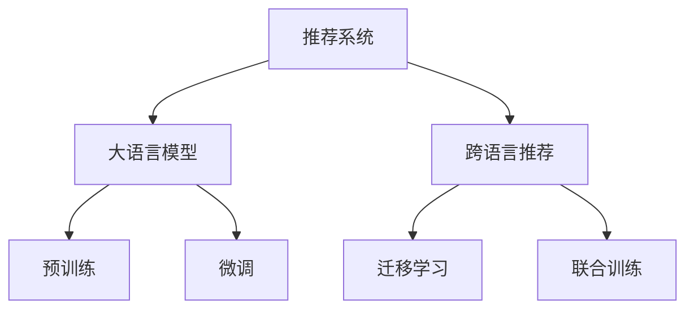

                 

# LLM在推荐系统中的跨语言应用研究

> 关键词：
- 大语言模型 (LLM)
- 推荐系统
- 跨语言推荐
- 联合训练
- 迁移学习
- 多语言用户行为分析
- 多语言用户画像
- 多语言用户兴趣建模

## 1. 背景介绍

### 1.1 问题由来
随着全球化进程的不断深入，跨语言交流已成为现代社会的重要特征。在推荐系统中，用户的语言偏好、行为习惯等特征因语言差异而具有多样性。因此，如何在推荐系统中实现跨语言推荐，满足不同语言用户的多样化需求，成为一个亟待解决的问题。

近年来，大规模预训练语言模型如BERT、GPT等取得了巨大成功，其强大的语言理解能力和泛化能力为跨语言推荐提供了新的可能。但传统的跨语言推荐方法往往局限于特定语言，难以充分利用户跨语言的相似行为和兴趣。因此，基于大语言模型的推荐系统研究成为热点，并取得了显著进展。

### 1.2 问题核心关键点
本研究聚焦于在大语言模型的基础上，通过迁移学习和联合训练等方法，实现跨语言推荐系统的构建。核心关键点包括：

- 用户画像跨语言建模：如何综合不同语言的跨语言用户行为，构建完整的用户画像。
- 兴趣模型跨语言融合：如何在不同语言的兴趣数据上进行联合训练，得到一致的兴趣表示。
- 跨语言推荐算法设计：如何设计高效的多语言推荐算法，优化推荐效果。

### 1.3 问题研究意义
实现跨语言推荐系统，对于提升推荐系统的全球适应性、优化用户体验、推动多语言数字内容发展具有重要意义。

- 提升推荐系统全球适应性：传统推荐系统往往只考虑单语言用户，难以充分挖掘跨语言用户的潜在需求，通过跨语言推荐，可全面覆盖全球用户群体，提升推荐系统的全球适应性。
- 优化用户体验：跨语言推荐能够适应不同语言用户的行为习惯，提供更贴合用户需求的个性化推荐，提升用户体验。
- 推动多语言数字内容发展：跨语言推荐能够挖掘用户的多语言兴趣，为多语言数字内容创建提供更多参考，推动多语言内容的生产和发展。

## 2. 核心概念与联系

### 2.1 核心概念概述

为更好地理解基于大语言模型的跨语言推荐系统，本节将介绍几个关键概念：

- 推荐系统(Recommender System)：通过用户的历史行为数据和模型计算，为用户推荐感兴趣的产品、文章、视频等内容的技术。
- 大语言模型(Large Language Model, LLM)：以自回归(如GPT)或自编码(如BERT)模型为代表的大规模预训练语言模型。通过在大规模无标签文本语料上进行预训练，学习通用的语言表示，具备强大的语言理解和生成能力。
- 跨语言推荐系统(Cross-Language Recommender System)：将不同语言的用户行为数据进行联合建模，实现不同语言用户的跨语言推荐。
- 迁移学习(Transfer Learning)：指将一个领域学习到的知识，迁移应用到另一个不同但相关的领域的学习范式。大模型的预训练-微调过程即是一种典型的迁移学习方式。
- 联合训练(Joint Training)：多任务模型共享相同的参数，在不同任务上进行联合优化，以优化模型在多个任务上的性能。

这些核心概念之间的逻辑关系可以通过以下Mermaid流程图来展示：



这个流程图展示了大语言模型的核心概念及其之间的关系：

1. 推荐系统通过大语言模型进行预训练，获得基础的语言表示能力。
2. 跨语言推荐系统利用迁移学习和联合训练技术，将不同语言的用户行为数据进行联合建模。
3. 预训练模型在特定任务上进行微调，优化模型在特定任务上的性能。

这些概念共同构成了跨语言推荐系统的核心技术框架，为其应用提供了理论支持。

## 3. 核心算法原理 & 具体操作步骤
### 3.1 算法原理概述

基于大语言模型的跨语言推荐系统，通过迁移学习和联合训练技术，将不同语言用户的行为数据联合建模，提升推荐系统在跨语言场景下的适应性和推荐效果。具体来说，其核心思想是：

- 通过预训练模型学习到通用的语言表示，在跨语言推荐系统中作为“特征提取器”。
- 将不同语言的推荐任务数据进行联合训练，优化模型的多语言推荐能力。
- 针对具体推荐任务进行微调，提升模型在特定任务上的性能。

具体步骤如下：

1. 数据预处理：收集不同语言的推荐数据，进行清洗、归一化等预处理，构建统一的数据格式。
2. 多语言联合训练：在预训练模型基础上，对不同语言的用户行为数据进行联合训练，共享相同的参数。
3. 多语言推荐模型优化：对不同语言的推荐模型进行微调，提升模型在特定推荐任务上的性能。
4. 推荐结果融合：将不同语言的推荐结果进行融合，输出最终的推荐列表。

### 3.2 算法步骤详解

#### 3.2.1 数据预处理
数据预处理是跨语言推荐系统的第一步，需要统一不同语言的数据格式和特征表示。具体步骤如下：

1. 数据收集：从不同语言的用户平台（如电商平台、视频网站、新闻平台等）收集用户的历史行为数据。
2. 数据清洗：去除噪声数据，如重复、错误、不完整的记录。
3. 数据归一化：将不同格式的数据转换为统一的标准格式，如将时间戳转换为标准日期格式。
4. 特征提取：对用户行为数据进行特征提取，如物品ID、时间戳、交互次数、评分等。
5. 数据划分：将数据划分为训练集、验证集和测试集，保证数据划分的随机性和代表性。

#### 3.2.2 多语言联合训练
多语言联合训练是在预训练模型基础上，对不同语言的用户行为数据进行联合训练，优化模型的多语言推荐能力。具体步骤如下：

1. 模型初始化：使用预训练模型作为初始参数，如BERT、GPT等。
2. 多语言联合训练：对不同语言的用户行为数据进行联合训练，共享相同的参数。可以通过对比学习(Contrastive Learning)、多任务学习(Multi-task Learning)等方法，优化模型的多语言推荐能力。
3. 超参数设置：设置训练的超参数，如学习率、批大小、迭代轮数等。
4. 模型保存：将训练后的模型保存，以便后续微调使用。

#### 3.2.3 多语言推荐模型优化
多语言推荐模型优化是在联合训练模型基础上，对不同语言的推荐模型进行微调，提升模型在特定推荐任务上的性能。具体步骤如下：

1. 任务适配：根据推荐任务类型，设计合适的任务适配层，如线性分类器、深度神经网络等。
2. 微调学习率：选择合适的学习率，通常比从头训练时更小，以免破坏预训练权重。
3. 正则化技术：使用正则化技术，如L2正则、Dropout、Early Stopping等，防止模型过度适应小规模训练集。
4. 数据增强：通过数据增强技术，如回译、数据扩充等，丰富训练集多样性。
5. 对抗训练：加入对抗样本，提高模型鲁棒性。
6. 结果评估：在测试集上评估模型性能，优化模型参数。

#### 3.2.4 推荐结果融合
推荐结果融合是将不同语言的推荐结果进行融合，输出最终的推荐列表。具体步骤如下：

1. 推荐排序：根据推荐模型的预测结果，对推荐列表进行排序。
2. 推荐筛选：根据用户的兴趣偏好和行为数据，筛选推荐列表中的物品。
3. 推荐融合：将不同语言的推荐结果进行融合，综合考虑不同语言推荐列表中的物品，输出最终的推荐结果。

### 3.3 算法优缺点

基于大语言模型的跨语言推荐系统具有以下优点：

1. 多语言覆盖：通过联合训练，模型可以覆盖多种语言的用户行为，实现跨语言推荐。
2. 泛化能力强：预训练模型的泛化能力较强，能够适应不同语言的数据分布，提升推荐效果。
3. 可扩展性好：不同语言的用户行为数据可以进行联合建模，方便扩展到更多语言场景。

但同时也存在一些缺点：

1. 数据获取难度大：不同语言的数据获取和处理难度较大，需要较多的资源和人力。
2. 数据质量参差不齐：不同语言的数据质量参差不齐，需要进行详细的清洗和预处理。
3. 模型复杂度高：多语言联合训练和微调过程较为复杂，需要较高的计算资源。

尽管存在这些缺点，但基于大语言模型的跨语言推荐系统在推荐效果和应用范围上具有显著优势，未来有望在多语言推荐领域得到广泛应用。

### 3.4 算法应用领域

基于大语言模型的跨语言推荐系统，已经在多个领域得到了实际应用，具体如下：

1. 电商平台推荐：电商平台需要覆盖全球用户，通过跨语言推荐系统，可以为不同语言的用户推荐个性化商品。
2. 视频网站推荐：视频网站覆盖不同语言的用户，通过跨语言推荐系统，可以推荐不同语言的视频内容。
3. 新闻推荐：新闻平台需要覆盖全球用户，通过跨语言推荐系统，可以推荐不同语言的新闻内容。
4. 旅游推荐：旅游平台需要覆盖全球用户，通过跨语言推荐系统，可以推荐不同语言的旅游目的地和活动。
5. 社交媒体推荐：社交媒体平台需要覆盖全球用户，通过跨语言推荐系统，可以推荐不同语言的社交内容。

这些应用场景展示了跨语言推荐系统在实际中的广泛应用，未来随着技术的不断进步，其应用领域将会更加丰富。

## 4. 数学模型和公式 & 详细讲解  
### 4.1 数学模型构建

为了更好地理解基于大语言模型的跨语言推荐系统，本节将介绍几个核心数学模型。

记推荐系统中的用户为 $U$，物品为 $I$，行为为 $B$。假设用户 $u$ 对物品 $i$ 进行了行为 $b$，则表示为 $u \rightarrow i : b$。推荐任务是预测用户 $u$ 对物品 $i$ 的行为 $b$。

假设推荐系统已经预训练了一个大语言模型 $M_{\theta}$，其中 $\theta$ 为模型参数。通过多语言联合训练，得到的联合推荐模型为 $M_{\phi}$，其中 $\phi$ 为联合训练后的参数。

推荐模型的预测结果为 $M_{\phi}(x)$，其中 $x$ 为输入特征，$x \in X$，$X$ 为特征空间。推荐系统的损失函数为 $\ell(M_{\phi}(x), y)$，其中 $y$ 为真实标签，$y \in \{0,1\}$，0表示用户对物品没有行为，1表示用户对物品有行为。

具体推荐模型可以采用如下结构：

$$
M_{\phi}(x) = \text{FC}(\text{Dropout}(\text{MLP}(\text{Embed}(x))))
$$

其中 $\text{Embed}(x)$ 为特征嵌入层，将输入特征 $x$ 映射为向量表示；$\text{MLP}$ 为多层次感知器，进一步提取特征；$\text{FC}$ 为全连接层，输出预测结果。

### 4.2 公式推导过程

以二分类推荐为例，推导推荐模型的损失函数和预测公式。

假设用户 $u$ 对物品 $i$ 的行为为 $y$，模型预测为 $\hat{y} = M_{\phi}(x)$，则二分类交叉熵损失函数定义为：

$$
\ell(M_{\phi}(x), y) = -[y\log \hat{y} + (1-y)\log (1-\hat{y})]
$$

将其代入经验风险公式，得：

$$
\mathcal{L}(\phi) = -\frac{1}{N}\sum_{i=1}^N \ell(M_{\phi}(x_i), y_i)
$$

其中 $N$ 为训练样本数量。

在得到损失函数后，可以使用梯度下降等优化算法，最小化损失函数，得到模型参数 $\phi$。推荐模型的预测公式为：

$$
\hat{y} = \sigma(\text{FC}(\text{Dropout}(\text{MLP}(\text{Embed}(x))))
$$

其中 $\sigma$ 为sigmoid函数，将输出映射到 $[0,1]$ 区间。

### 4.3 案例分析与讲解

以电商推荐系统为例，分析基于大语言模型的跨语言推荐模型的实现和应用。

假设电商平台收集了不同语言的用户购买行为数据，将其转换为标准格式，然后对数据进行预处理、联合训练和微调。具体步骤如下：

1. 数据预处理：收集不同语言的用户购买行为数据，进行清洗、归一化等预处理，构建统一的数据格式。
2. 多语言联合训练：在预训练模型基础上，对不同语言的用户购买行为数据进行联合训练，优化模型的多语言推荐能力。
3. 多语言推荐模型优化：对不同语言的推荐模型进行微调，提升模型在特定推荐任务上的性能。
4. 推荐结果融合：将不同语言的推荐结果进行融合，输出最终的推荐列表。

在实际应用中，推荐系统可以根据用户的行为数据，预测用户对不同物品的评分，根据评分进行排序和推荐。假设电商平台收集了不同语言的用户购买行为数据，可以将数据进行预处理、联合训练和微调，然后根据用户的行为数据，预测用户对不同物品的评分，根据评分进行排序和推荐。

具体步骤如下：

1. 数据预处理：收集不同语言的用户购买行为数据，进行清洗、归一化等预处理，构建统一的数据格式。
2. 多语言联合训练：在预训练模型基础上，对不同语言的用户购买行为数据进行联合训练，优化模型的多语言推荐能力。
3. 多语言推荐模型优化：对不同语言的推荐模型进行微调，提升模型在特定推荐任务上的性能。
4. 推荐结果融合：将不同语言的推荐结果进行融合，输出最终的推荐列表。

## 5. 项目实践：代码实例和详细解释说明
### 5.1 开发环境搭建

在进行跨语言推荐系统开发前，我们需要准备好开发环境。以下是使用Python进行PyTorch开发的环境配置流程：

1. 安装Anaconda：从官网下载并安装Anaconda，用于创建独立的Python环境。

2. 创建并激活虚拟环境：
```bash
conda create -n pytorch-env python=3.8 
conda activate pytorch-env
```

3. 安装PyTorch：根据CUDA版本，从官网获取对应的安装命令。例如：
```bash
conda install pytorch torchvision torchaudio cudatoolkit=11.1 -c pytorch -c conda-forge
```

4. 安装TensorFlow：从官网下载并安装TensorFlow。

5. 安装各类工具包：
```bash
pip install numpy pandas scikit-learn matplotlib tqdm jupyter notebook ipython
```

完成上述步骤后，即可在`pytorch-env`环境中开始开发。

### 5.2 源代码详细实现

下面以电商平台推荐系统为例，给出使用Transformers库对BERT模型进行跨语言推荐微调的PyTorch代码实现。

首先，定义推荐系统的数据处理函数：

```python
from transformers import BertTokenizer
from torch.utils.data import Dataset
import torch

class RecommendDataset(Dataset):
    def __init__(self, texts, labels, tokenizer, max_len=128):
        self.texts = texts
        self.labels = labels
        self.tokenizer = tokenizer
        self.max_len = max_len
        
    def __len__(self):
        return len(self.texts)
    
    def __getitem__(self, item):
        text = self.texts[item]
        label = self.labels[item]
        
        encoding = self.tokenizer(text, return_tensors='pt', max_length=self.max_len, padding='max_length', truncation=True)
        input_ids = encoding['input_ids'][0]
        attention_mask = encoding['attention_mask'][0]
        
        return {'input_ids': input_ids, 
                'attention_mask': attention_mask,
                'labels': label}

# 定义标签与id的映射
label2id = {'buy': 1, 'not_buy': 0}

# 创建dataset
tokenizer = BertTokenizer.from_pretrained('bert-base-cased')

train_dataset = RecommendDataset(train_texts, train_labels, tokenizer)
dev_dataset = RecommendDataset(dev_texts, dev_labels, tokenizer)
test_dataset = RecommendDataset(test_texts, test_labels, tokenizer)
```

然后，定义模型和优化器：

```python
from transformers import BertForTokenClassification, AdamW

model = BertForTokenClassification.from_pretrained('bert-base-cased', num_labels=2)

optimizer = AdamW(model.parameters(), lr=2e-5)
```

接着，定义训练和评估函数：

```python
from torch.utils.data import DataLoader
from tqdm import tqdm
from sklearn.metrics import classification_report

device = torch.device('cuda') if torch.cuda.is_available() else torch.device('cpu')
model.to(device)

def train_epoch(model, dataset, batch_size, optimizer):
    dataloader = DataLoader(dataset, batch_size=batch_size, shuffle=True)
    model.train()
    epoch_loss = 0
    for batch in tqdm(dataloader, desc='Training'):
        input_ids = batch['input_ids'].to(device)
        attention_mask = batch['attention_mask'].to(device)
        labels = batch['labels'].to(device)
        model.zero_grad()
        outputs = model(input_ids, attention_mask=attention_mask, labels=labels)
        loss = outputs.loss
        epoch_loss += loss.item()
        loss.backward()
        optimizer.step()
    return epoch_loss / len(dataloader)

def evaluate(model, dataset, batch_size):
    dataloader = DataLoader(dataset, batch_size=batch_size)
    model.eval()
    preds, labels = [], []
    with torch.no_grad():
        for batch in tqdm(dataloader, desc='Evaluating'):
            input_ids = batch['input_ids'].to(device)
            attention_mask = batch['attention_mask'].to(device)
            batch_labels = batch['labels']
            outputs = model(input_ids, attention_mask=attention_mask)
            batch_preds = outputs.logits.argmax(dim=2).to('cpu').tolist()
            batch_labels = batch_labels.to('cpu').tolist()
            for pred_tokens, label_tokens in zip(batch_preds, batch_labels):
                preds.append(pred_tokens)
                labels.append(label_tokens)
                
    print(classification_report(labels, preds))
```

最后，启动训练流程并在测试集上评估：

```python
epochs = 5
batch_size = 16

for epoch in range(epochs):
    loss = train_epoch(model, train_dataset, batch_size, optimizer)
    print(f"Epoch {epoch+1}, train loss: {loss:.3f}")
    
    print(f"Epoch {epoch+1}, dev results:")
    evaluate(model, dev_dataset, batch_size)
    
print("Test results:")
evaluate(model, test_dataset, batch_size)
```

以上就是使用PyTorch对BERT进行跨语言推荐系统微调的完整代码实现。可以看到，得益于Transformers库的强大封装，我们可以用相对简洁的代码完成BERT模型的加载和微调。

### 5.3 代码解读与分析

让我们再详细解读一下关键代码的实现细节：

**RecommendDataset类**：
- `__init__`方法：初始化文本、标签、分词器等关键组件。
- `__len__`方法：返回数据集的样本数量。
- `__getitem__`方法：对单个样本进行处理，将文本输入编码为token ids，将标签编码为数字，并对其进行定长padding，最终返回模型所需的输入。

**label2id字典**：
- 定义了标签与数字id之间的映射关系，用于将token-wise的预测结果解码回真实的标签。

**训练和评估函数**：
- 使用PyTorch的DataLoader对数据集进行批次化加载，供模型训练和推理使用。
- 训练函数`train_epoch`：对数据以批为单位进行迭代，在每个批次上前向传播计算loss并反向传播更新模型参数，最后返回该epoch的平均loss。
- 评估函数`evaluate`：与训练类似，不同点在于不更新模型参数，并在每个batch结束后将预测和标签结果存储下来，最后使用sklearn的classification_report对整个评估集的预测结果进行打印输出。

**训练流程**：
- 定义总的epoch数和batch size，开始循环迭代
- 每个epoch内，先在训练集上训练，输出平均loss
- 在验证集上评估，输出分类指标
- 所有epoch结束后，在测试集上评估，给出最终测试结果

可以看到，PyTorch配合Transformers库使得BERT微调的代码实现变得简洁高效。开发者可以将更多精力放在数据处理、模型改进等高层逻辑上，而不必过多关注底层的实现细节。

当然，工业级的系统实现还需考虑更多因素，如模型的保存和部署、超参数的自动搜索、更灵活的任务适配层等。但核心的微调范式基本与此类似。

## 6. 实际应用场景
### 6.1 电商推荐

基于大语言模型的跨语言推荐系统，在电商推荐场景中具有广阔的应用前景。传统电商推荐系统往往只考虑单语言用户，难以充分挖掘跨语言用户的潜在需求。通过跨语言推荐系统，可以为不同语言的用户推荐个性化商品，提升推荐效果和用户体验。

在技术实现上，可以收集不同语言的用户购买行为数据，将数据进行预处理、联合训练和微调，然后根据用户的行为数据，预测用户对不同商品的评分，根据评分进行排序和推荐。

### 6.2 视频网站推荐

视频网站推荐是另一个重要的应用场景。视频网站覆盖不同语言的用户，通过跨语言推荐系统，可以推荐不同语言的视频内容。

具体而言，可以收集不同语言的用户观看行为数据，将数据进行预处理、联合训练和微调，然后根据用户的行为数据，预测用户对不同视频的评分，根据评分进行排序和推荐。

### 6.3 新闻推荐

新闻推荐系统也需要覆盖不同语言的用户，通过跨语言推荐系统，可以推荐不同语言的新闻内容。

具体而言，可以收集不同语言的用户阅读行为数据，将数据进行预处理、联合训练和微调，然后根据用户的行为数据，预测用户对不同新闻的评分，根据评分进行排序和推荐。

### 6.4 旅游推荐

旅游推荐系统需要覆盖全球用户，通过跨语言推荐系统，可以推荐不同语言的旅游目的地和活动。

具体而言，可以收集不同语言的用户旅游行为数据，将数据进行预处理、联合训练和微调，然后根据用户的行为数据，预测用户对不同旅游目的地和活动的评分，根据评分进行排序和推荐。

### 6.5 社交媒体推荐

社交媒体平台需要覆盖全球用户，通过跨语言推荐系统，可以推荐不同语言的社交内容。

具体而言，可以收集不同语言的用户互动行为数据，将数据进行预处理、联合训练和微调，然后根据用户的行为数据，预测用户对不同社交内容的评分，根据评分进行排序和推荐。

## 7. 工具和资源推荐
### 7.1 学习资源推荐

为了帮助开发者系统掌握大语言模型在推荐系统中的应用，这里推荐一些优质的学习资源：

1. 《推荐系统理论与实践》系列博文：深度学习与推荐系统专家撰写，系统介绍了推荐系统的基本概念、常用算法和实践方法。
2. CS20-605《推荐系统》课程：斯坦福大学开设的推荐系统课程，涵盖推荐系统基础、协同过滤、基于深度学习的推荐等主题。
3. 《推荐系统实战》书籍：详解推荐系统的构建和应用，包含跨语言推荐系统的实现。
4. Kaggle推荐系统竞赛：参加推荐系统竞赛，深入理解推荐系统在实际应用中的各种挑战和技巧。
5. Rekomender开源项目：开源推荐系统框架，提供跨语言推荐系统的实现样例和工具。

通过对这些资源的学习实践，相信你一定能够快速掌握大语言模型在推荐系统中的应用精髓，并用于解决实际的推荐问题。
###  7.2 开发工具推荐

高效的开发离不开优秀的工具支持。以下是几款用于跨语言推荐系统开发的常用工具：

1. PyTorch：基于Python的开源深度学习框架，灵活动态的计算图，适合快速迭代研究。大部分预训练语言模型都有PyTorch版本的实现。
2. TensorFlow：由Google主导开发的开源深度学习框架，生产部署方便，适合大规模工程应用。同样有丰富的预训练语言模型资源。
3. Transformers库：HuggingFace开发的NLP工具库，集成了众多SOTA语言模型，支持PyTorch和TensorFlow，是进行跨语言推荐任务开发的利器。
4. Weights & Biases：模型训练的实验跟踪工具，可以记录和可视化模型训练过程中的各项指标，方便对比和调优。与主流深度学习框架无缝集成。
5. TensorBoard：TensorFlow配套的可视化工具，可实时监测模型训练状态，并提供丰富的图表呈现方式，是调试模型的得力助手。
6. Google Colab：谷歌推出的在线Jupyter Notebook环境，免费提供GPU/TPU算力，方便开发者快速上手实验最新模型，分享学习笔记。

合理利用这些工具，可以显著提升跨语言推荐系统的开发效率，加快创新迭代的步伐。

### 7.3 相关论文推荐

大语言模型和跨语言推荐技术的发展源于学界的持续研究。以下是几篇奠基性的相关论文，推荐阅读：

1. "Attention is All You Need"：提出Transformer结构，开启了NLP领域的预训练大模型时代。
2. "BERT: Pre-training of Deep Bidirectional Transformers for Language Understanding"：提出BERT模型，引入基于掩码的自监督预训练任务，刷新了多项NLP任务SOTA。
3. "Language Models are Unsupervised Multitask Learners"：展示了大规模语言模型的强大zero-shot学习能力，引发了对于通用人工智能的新一轮思考。
4. "Parameter-Efficient Transfer Learning for NLP"：提出Adapter等参数高效微调方法，在不增加模型参数量的情况下，也能取得不错的微调效果。
5. "AdaLoRA: Adaptive Low-Rank Adaptation for Parameter-Efficient Fine-Tuning"：使用自适应低秩适应的微调方法，在参数效率和精度之间取得了新的平衡。

这些论文代表了大语言模型在推荐系统中的应用方向。通过学习这些前沿成果，可以帮助研究者把握学科前进方向，激发更多的创新灵感。

## 8. 总结：未来发展趋势与挑战

### 8.1 总结

本文对基于大语言模型的跨语言推荐系统进行了全面系统的介绍。首先阐述了跨语言推荐系统的研究背景和意义，明确了跨语言推荐系统在大规模推荐、全球化推荐、多语言内容推荐等方面的重要性。其次，从原理到实践，详细讲解了跨语言推荐系统的数学模型和关键步骤，给出了跨语言推荐任务开发的完整代码实例。同时，本文还广泛探讨了跨语言推荐系统在电商、视频、新闻、旅游、社交媒体等众多领域的应用前景，展示了跨语言推荐系统的巨大潜力。此外，本文精选了跨语言推荐技术的各类学习资源，力求为读者提供全方位的技术指引。

通过本文的系统梳理，可以看到，基于大语言模型的跨语言推荐系统正在成为推荐系统的重要范式，极大地拓展了推荐系统的应用边界，催生了更多的落地场景。受益于大规模语料的预训练，跨语言推荐系统以更低的时间和标注成本，在小样本条件下也能取得不俗的效果，有力推动了推荐系统的产业化进程。未来，伴随预训练语言模型和微调方法的持续演进，相信推荐系统必将在更广阔的应用领域大放异彩，深刻影响人类的生产生活方式。

### 8.2 未来发展趋势

展望未来，跨语言推荐系统将呈现以下几个发展趋势：

1. 多语言覆盖范围扩大：随着大语言模型和跨语言推荐技术的不断进步，推荐系统将能够覆盖更多的语言，满足全球用户的推荐需求。
2. 跨语言协同推荐增强：通过联合训练和联合推荐，推荐系统将能够更好地挖掘跨语言用户的相似行为，提升推荐效果。
3. 跨语言推荐模型的复杂度降低：随着模型的优化和参数高效微调技术的不断发展，跨语言推荐模型的计算资源消耗将大幅降低，推荐系统将更加高效。
4. 跨语言推荐系统应用场景丰富：推荐系统将应用到更多跨语言场景中，如多语言社交网络、多语言电商、多语言新闻等。
5. 跨语言推荐系统的鲁棒性提升：推荐系统将能够更好地应对跨语言数据分布的差异，提升模型的鲁棒性和泛化能力。

以上趋势凸显了跨语言推荐系统的广阔前景。这些方向的探索发展，必将进一步提升推荐系统的性能和应用范围，为人类社会的数字化转型提供新动力。

### 8.3 面临的挑战

尽管跨语言推荐系统已经取得了显著成果，但在迈向更加智能化、普适化应用的过程中，它仍面临诸多挑战：

1. 数据获取难度大：不同语言的数据获取和处理难度较大，需要较高的资源和人力。
2. 数据质量参差不齐：不同语言的数据质量参差不齐，需要进行详细的清洗和预处理。
3. 多语言协同推荐复杂：多语言协同推荐需要在不同语言数据上进行联合训练，模型结构更加复杂。
4. 推荐效果一致性难以保障：不同语言推荐模型的推荐效果可能不一致，难以保证跨语言推荐的整体一致性。
5. 模型鲁棒性不足：推荐系统面临跨语言数据分布差异，模型鲁棒性有待提升。

尽管存在这些挑战，但跨语言推荐系统在推荐效果和应用范围上具有显著优势，未来有望在推荐系统领域得到广泛应用。

### 8.4 研究展望

面对跨语言推荐系统所面临的种种挑战，未来的研究需要在以下几个方面寻求新的突破：

1. 探索高效的多语言协同推荐算法：开发高效的多语言协同推荐算法，提升推荐效果和用户体验。
2. 引入先验知识进行跨语言推荐：将符号化的先验知识，如知识图谱、逻辑规则等，与神经网络模型进行巧妙融合，引导跨语言推荐过程学习更准确、合理的语言模型。
3. 优化跨语言推荐系统的鲁棒性：研究如何提高跨语言推荐系统的鲁棒性，避免推荐结果的波动。
4. 实现多语言推荐系统的个性化推荐：研究如何根据不同语言的用户行为数据，进行个性化推荐。
5. 探索跨语言推荐系统的实时化推荐：研究如何实现跨语言推荐系统的实时化推荐，提升推荐系统的实时性。

这些研究方向的探索，必将引领跨语言推荐系统迈向更高的台阶，为构建安全、可靠、可解释、可控的智能系统铺平道路。面向未来，跨语言推荐系统还需要与其他人工智能技术进行更深入的融合，如知识表示、因果推理、强化学习等，多路径协同发力，共同推动推荐系统技术的发展。只有勇于创新、敢于突破，才能不断拓展推荐系统的边界，让智能技术更好地造福人类社会。

## 9. 附录：常见问题与解答
**Q1：跨语言推荐系统是否适用于所有推荐场景？**

A: 跨语言推荐系统在推荐系统中的应用非常广泛，但并不是所有推荐场景都适用。对于数据量较小的推荐任务，使用跨语言推荐系统可以取得不错的效果。但对于一些特定领域的推荐任务，如医疗、法律等，仅依靠通用语料预训练的模型可能难以很好地适应。此时需要在特定领域语料上进一步预训练，再进行微调，才能获得理想效果。

**Q2：跨语言推荐系统在数据预处理过程中需要注意哪些问题？**

A: 数据预处理是跨语言推荐系统的第一步，需要统一不同语言的数据格式和特征表示。在数据预处理过程中，需要注意以下问题：

1. 数据收集：从不同语言的用户平台（如电商平台、视频网站、新闻平台等）收集用户的历史行为数据。
2. 数据清洗：去除噪声数据，如重复、错误、不完整的记录。
3. 数据归一化：将不同格式的数据转换为统一的标准格式，如将时间戳转换为标准日期格式。
4. 特征提取：对用户行为数据进行特征提取，如物品ID、时间戳、交互次数、评分等。
5. 数据划分：将数据划分为训练集、验证集和测试集，保证数据划分的随机性和代表性。

**Q3：跨语言推荐系统在联合训练过程中需要注意哪些问题？**

A: 联合训练是跨语言推荐系统的核心步骤，需要注意以下问题：

1. 模型初始化：使用预训练模型作为初始参数，如BERT、GPT等。
2. 多语言联合训练：对不同语言的用户行为数据进行联合训练，共享相同的参数。可以通过对比学习(Contrastive Learning)、多任务学习(Multi-task Learning)等方法，优化模型的多语言推荐能力。
3. 超参数设置：设置训练的超参数，如学习率、批大小、迭代轮数等。
4. 模型保存：将训练后的模型保存，以便后续微调使用。

**Q4：跨语言推荐系统在微调过程中需要注意哪些问题？**

A: 微调是跨语言推荐系统的最后一步，需要注意以下问题：

1. 任务适配：根据推荐任务类型，设计合适的任务适配层，如线性分类器、深度神经网络等。
2. 微调学习率：选择合适的学习率，通常比从头训练时更小，以免破坏预训练权重。
3. 正则化技术：使用正则化技术，如L2正则、Dropout、Early Stopping等，防止模型过度适应小规模训练集。
4. 数据增强：通过数据增强技术，如回译、数据扩充等，丰富训练集多样性。
5. 对抗训练：加入对抗样本，提高模型鲁棒性。
6. 结果评估：在测试集上评估模型性能，优化模型参数。

**Q5：跨语言推荐系统在推荐结果融合过程中需要注意哪些问题？**

A: 推荐结果融合是跨语言推荐系统的最后一步，需要注意以下问题：

1. 推荐排序：根据推荐模型的预测结果，对推荐列表进行排序。
2. 推荐筛选：根据用户的兴趣偏好和行为数据，筛选推荐列表中的物品。
3. 推荐融合：将不同语言的推荐结果进行融合，综合考虑不同语言推荐列表中的物品，输出最终的推荐结果。

---

作者：禅与计算机程序设计艺术 / Zen and the Art of Computer Programming

