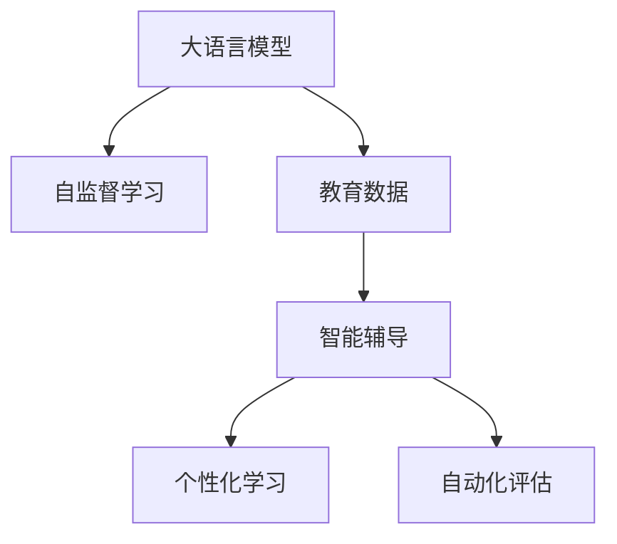

                 

# LLM在教育领域的应用前景

## 1. 背景介绍

### 1.1 问题由来
随着人工智能技术的不断进步，语言模型（Language Models, LMs）在教育领域的应用前景逐渐显现。大语言模型（Large Language Models, LLMs）作为一类强大的NLP模型，凭借其大规模预训练和泛化能力，已经在自然语言理解和生成任务中取得了显著进展。其在教育领域的应用，不仅能够提高教学质量和效率，还能够为个性化学习、智能辅导提供强有力的支持。

### 1.2 问题核心关键点
大语言模型在教育领域的应用核心在于其强大的语言理解和生成能力，可以用于辅助教育资源的设计和优化、智能辅导和个性化学习、以及自动化教学评估等方面。然而，如何更好地将LLM技术融入教育体系，提升教学效果和学生学习体验，仍是当前教育技术研究和应用的重要课题。

### 1.3 问题研究意义
大语言模型在教育领域的应用，有望大幅提升教学质量和效率，降低教育成本，实现更加个性化和智能化的学习体验。通过对Labs、练习题、教材等多维度教育资源的优化，可以实现教学内容的自动化生成和个性化定制。同时，通过智能辅导和自动化评估，可以提供及时的反馈和支持，帮助学生更有效地学习。

## 2. 核心概念与联系

### 2.1 核心概念概述

为更好地理解LLM在教育领域的应用，本节将介绍几个密切相关的核心概念：

- 大语言模型（LLM）：一类通过大规模无标签文本数据预训练得到的大型神经网络模型，具备强大的语言理解和生成能力。
- 自监督学习（Self-supervised Learning）：一种无需人工标注数据，通过模型自身的预测能力进行训练的方法，如掩码语言模型（Masked Language Modeling, MLM）。
- 教育数据（Educational Data）：包括课程、教材、练习题、评估结果等多种形式的数据，是教育资源的重要组成部分。
- 智能辅导（Intelligent Tutoring Systems, ITS）：利用人工智能技术，为学生提供个性化的学习辅导和支持。
- 个性化学习（Personalized Learning）：根据学生的学习行为和需求，定制个性化的学习内容和路径。
- 自动化评估（Automated Assessment）：利用人工智能技术，自动评价学生的作业和考试结果，提供即时反馈。

这些核心概念之间的逻辑关系可以通过以下Mermaid流程图来展示：



这个流程图展示了LLM与教育领域相关概念的联系：

1. LLM通过自监督学习获得语言知识。
2. 教育数据为LLM提供了学习材料和评估标准。
3. 智能辅导利用LLM进行个性化学习支持。
4. 自动化评估借助LLM自动进行结果评价。

## 3. 核心算法原理 & 具体操作步骤

### 3.1 算法原理概述

大语言模型在教育领域的应用主要基于其强大的语言理解和生成能力。通过自监督学习，LLM可以从大规模无标签文本数据中学习到语言的通用规律和结构，形成强大的语言知识库。在教育场景中，LLM可以用于以下几方面的任务：

1. **教育资源生成**：自动生成教材、作业、练习题等教学资源，提升教学内容的质量和多样性。
2. **智能辅导**：通过自然语言理解和生成能力，提供个性化的学习建议和实时反馈，增强学习效果。
3. **自动化评估**：自动评估学生的作业和考试结果，提供即时反馈，减轻教师负担。
4. **学习数据分析**：通过分析学生的学习数据，预测学习行为和效果，进行个性化的学习路径规划。

### 3.2 算法步骤详解

基于LLM的教育应用一般包括以下几个关键步骤：

**Step 1: 数据准备和预处理**
- 收集和清洗教育数据，包括课程内容、教材、练习题、学生评估结果等。
- 对文本数据进行分词、标准化等预处理，准备用于训练LLM的数据集。

**Step 2: 训练和微调LLM**
- 选择合适的预训练模型，如GPT、BERT等，进行微调或继续训练，使其能够适应教育场景。
- 在教育数据集上训练模型，优化语言理解和生成能力。

**Step 3: 生成和优化教育资源**
- 使用训练好的LLM生成新的教育资源，如教材、练习题、习题解答等。
- 根据教育专家和学生反馈，优化生成的教育资源内容。

**Step 4: 实施智能辅导**
- 将LLM嵌入智能辅导系统，根据学生的学习进度和需求，提供个性化的学习建议和支持。
- 通过自然语言交互，提供即时反馈和答疑服务。

**Step 5: 自动化评估**
- 开发自动化评估系统，利用LLM自动评估学生的作业和考试结果。
- 分析评估结果，生成详细的反馈报告，指导学生改进学习策略。

**Step 6: 学习数据分析和优化**
- 收集和分析学生的学习数据，利用LLM进行学习效果预测和行为分析。
- 根据分析结果，进行个性化的学习路径规划和资源推荐。

### 3.3 算法优缺点

基于LLM的教育应用具有以下优点：
1. 高效性：自动生成和优化教育资源，减少教师和教育资源制作者的工作量，提高教学效率。
2. 个性化：通过智能辅导和个性化学习，提供符合学生需求的学习建议和支持，提升学习效果。
3. 实时反馈：利用自动化评估系统，提供即时反馈，帮助学生及时发现和改正错误。
4. 灵活性：通过LLM的灵活性，适应不同教育场景和学生需求，提供多样化、动态化的教学内容。

同时，该方法也存在一定的局限性：
1. 依赖数据质量：教育数据的质量和多样性直接影响LLM的应用效果，需要高质量的教育资源库。
2. 模型泛化能力：LLM在特定教育场景中的泛化能力需进一步验证，避免过度依赖数据集。
3. 伦理和隐私：在涉及学生个人信息时，需注意数据隐私和伦理问题，确保数据安全和合规使用。
4. 技术成熟度：LLM在教育领域的实际应用仍处于初期阶段，技术成熟度和应用广度需进一步提升。

尽管存在这些局限性，但基于LLM的教育应用具有巨大的潜力，可以极大地提升教学质量和效率，为教育领域的智能化和个性化提供强有力的支持。

### 3.4 算法应用领域

基于LLM的教育应用覆盖了教育资源生成、智能辅导、自动化评估等多个方面，具体应用场景包括：

- **智能教材生成**：自动生成与课程内容相关的教材和习题，提升教材的质量和多样性。
- **个性化学习**：根据学生的学习行为和需求，生成个性化的学习路径和资源推荐。
- **智能辅导系统**：提供实时的学习支持和反馈，帮助学生解决学习中的问题。
- **自动化评估**：自动评估学生的作业和考试结果，提供即时反馈和改进建议。
- **学习数据分析**：利用LLM进行学习效果预测和行为分析，优化教学策略和资源配置。

此外，LLM还可以应用于课程设计、教学评估、智能实验室等多个教育环节，为教育领域带来深刻的变革。

## 4. 数学模型和公式 & 详细讲解

### 4.1 数学模型构建

本节将使用数学语言对基于LLM的教育应用进行更加严格的刻画。

记LLM为 $M_{\theta}$，其中 $\theta$ 为模型参数。假设教育数据集为 $D=\{(x_i, y_i)\}_{i=1}^N, x_i \in \mathcal{X}, y_i \in \mathcal{Y}$，其中 $x_i$ 表示教育资源，$y_i$ 表示学生评估结果。

定义模型 $M_{\theta}$ 在教育数据集 $D$ 上的损失函数为 $\ell(M_{\theta}, D)$，用于衡量模型输出与真实评估结果之间的差异。常见的损失函数包括交叉熵损失、均方误差损失等。

微调的目标是最小化经验风险，即找到最优参数：

$$
\theta^* = \mathop{\arg\min}_{\theta} \mathcal{L}(\theta)
$$

### 4.2 公式推导过程

以下我们以二分类任务为例，推导交叉熵损失函数及其梯度的计算公式。

假设模型 $M_{\theta}$ 在输入 $x$ 上的输出为 $\hat{y}=M_{\theta}(x) \in [0,1]$，表示学生完成作业或考试的概率。真实标签 $y \in \{0,1\}$。则二分类交叉熵损失函数定义为：

$$
\ell(M_{\theta}(x),y) = -[y\log \hat{y} + (1-y)\log (1-\hat{y})]
$$

将其代入经验风险公式，得：

$$
\mathcal{L}(\theta) = -\frac{1}{N}\sum_{i=1}^N [y_i\log M_{\theta}(x_i)+(1-y_i)\log(1-M_{\theta}(x_i))]
$$

根据链式法则，损失函数对参数 $\theta_k$ 的梯度为：

$$
\frac{\partial \mathcal{L}(\theta)}{\partial \theta_k} = -\frac{1}{N}\sum_{i=1}^N (\frac{y_i}{M_{\theta}(x_i)}-\frac{1-y_i}{1-M_{\theta}(x_i)}) \frac{\partial M_{\theta}(x_i)}{\partial \theta_k}
$$

其中 $\frac{\partial M_{\theta}(x_i)}{\partial \theta_k}$ 可进一步递归展开，利用自动微分技术完成计算。

在得到损失函数的梯度后，即可带入参数更新公式，完成模型的迭代优化。重复上述过程直至收敛，最终得到适应教育场景的最优模型参数 $\theta^*$。

## 5. 项目实践：代码实例和详细解释说明

### 5.1 开发环境搭建

在进行教育应用开发前，我们需要准备好开发环境。以下是使用Python进行PyTorch开发的环境配置流程：

1. 安装Anaconda：从官网下载并安装Anaconda，用于创建独立的Python环境。

2. 创建并激活虚拟环境：
```bash
conda create -n pytorch-env python=3.8 
conda activate pytorch-env
```

3. 安装PyTorch：根据CUDA版本，从官网获取对应的安装命令。例如：
```bash
conda install pytorch torchvision torchaudio cudatoolkit=11.1 -c pytorch -c conda-forge
```

4. 安装Transformer库：
```bash
pip install transformers
```

5. 安装各类工具包：
```bash
pip install numpy pandas scikit-learn matplotlib tqdm jupyter notebook ipython
```

完成上述步骤后，即可在`pytorch-env`环境中开始教育应用开发。

### 5.2 源代码详细实现

下面我们以智能教材生成任务为例，给出使用Transformers库对GPT模型进行智能教材生成的PyTorch代码实现。

首先，定义教材生成任务的数据处理函数：

```python
from transformers import GPT2Tokenizer
from torch.utils.data import Dataset
import torch

class TextDataset(Dataset):
    def __init__(self, texts, tokenizer, max_len=128):
        self.texts = texts
        self.tokenizer = tokenizer
        self.max_len = max_len
        
    def __len__(self):
        return len(self.texts)
    
    def __getitem__(self, item):
        text = self.texts[item]
        
        encoding = self.tokenizer(text, return_tensors='pt', max_length=self.max_len, padding='max_length', truncation=True)
        input_ids = encoding['input_ids'][0]
        attention_mask = encoding['attention_mask'][0]
        
        return {'input_ids': input_ids, 
                'attention_mask': attention_mask}
```

然后，定义模型和优化器：

```python
from transformers import GPT2Model, AdamW

model = GPT2Model.from_pretrained('gpt2')
optimizer = AdamW(model.parameters(), lr=2e-5)
```

接着，定义训练和评估函数：

```python
from tqdm import tqdm
import math

device = torch.device('cuda') if torch.cuda.is_available() else torch.device('cpu')
model.to(device)

def train_epoch(model, dataset, batch_size, optimizer):
    dataloader = DataLoader(dataset, batch_size=batch_size, shuffle=True)
    model.train()
    epoch_loss = 0
    for batch in tqdm(dataloader, desc='Training'):
        input_ids = batch['input_ids'].to(device)
        attention_mask = batch['attention_mask'].to(device)
        model.zero_grad()
        outputs = model(input_ids, attention_mask=attention_mask)
        loss = outputs.loss
        epoch_loss += loss.item()
        loss.backward()
        optimizer.step()
    return epoch_loss / len(dataloader)

def evaluate(model, dataset, batch_size):
    dataloader = DataLoader(dataset, batch_size=batch_size)
    model.eval()
    preds = []
    with torch.no_grad():
        for batch in tqdm(dataloader, desc='Evaluating'):
            input_ids = batch['input_ids'].to(device)
            attention_mask = batch['attention_mask'].to(device)
            outputs = model(input_ids, attention_mask=attention_mask)
            preds.append(outputs.logits.argmax(dim=2).to('cpu').tolist())
                
    return preds
```

最后，启动训练流程并在测试集上评估：

```python
epochs = 5
batch_size = 16

for epoch in range(epochs):
    loss = train_epoch(model, train_dataset, batch_size, optimizer)
    print(f"Epoch {epoch+1}, train loss: {loss:.3f}")
    
    print(f"Epoch {epoch+1}, dev results:")
    preds = evaluate(model, dev_dataset, batch_size)
    print(classification_report(dev_labels, preds))
    
print("Test results:")
preds = evaluate(model, test_dataset, batch_size)
print(classification_report(test_labels, preds))
```

以上就是使用PyTorch对GPT模型进行智能教材生成的完整代码实现。可以看到，得益于Transformers库的强大封装，我们可以用相对简洁的代码完成GPT模型的训练和微调。

### 5.3 代码解读与分析

让我们再详细解读一下关键代码的实现细节：

**TextDataset类**：
- `__init__`方法：初始化文本数据、分词器等关键组件。
- `__len__`方法：返回数据集的样本数量。
- `__getitem__`方法：对单个样本进行处理，将文本输入编码为token ids，并对其进行定长padding，最终返回模型所需的输入。

**训练和评估函数**：
- 使用PyTorch的DataLoader对数据集进行批次化加载，供模型训练和推理使用。
- 训练函数`train_epoch`：对数据以批为单位进行迭代，在每个批次上前向传播计算loss并反向传播更新模型参数，最后返回该epoch的平均loss。
- 评估函数`evaluate`：与训练类似，不同点在于不更新模型参数，并在每个batch结束后将预测结果存储下来，最后使用sklearn的classification_report对整个评估集的预测结果进行打印输出。

**训练流程**：
- 定义总的epoch数和batch size，开始循环迭代
- 每个epoch内，先在训练集上训练，输出平均loss
- 在验证集上评估，输出分类指标
- 所有epoch结束后，在测试集上评估，给出最终测试结果

可以看到，PyTorch配合Transformers库使得GPT模型的微调代码实现变得简洁高效。开发者可以将更多精力放在数据处理、模型改进等高层逻辑上，而不必过多关注底层的实现细节。

当然，工业级的系统实现还需考虑更多因素，如模型的保存和部署、超参数的自动搜索、更灵活的任务适配层等。但核心的微调范式基本与此类似。

## 6. 实际应用场景

### 6.1 智能教材生成

智能教材生成是LLM在教育领域的一个重要应用场景。传统的教材编写需要大量人力物力，更新缓慢，难以适应快速变化的课程内容。利用LLM生成教材，可以在短时间内自动生成高质量的教学资源，提高教材的更新速度和覆盖范围。

具体实现上，可以将课程大纲和重点知识点作为训练数据，训练LLM生成相应教材内容。通过不断优化训练数据和模型结构，可以实现更加精准、多样化的教材生成。智能教材生成不仅能够减少教材编写的工作量，还能提升教材的质量和适应性，为学生提供更加优质、全面的学习资源。

### 6.2 个性化学习

个性化学习是LLM在教育领域的重要应用方向。通过智能辅导系统，LLM可以为每位学生提供个性化的学习建议和支持，提升学习效果。

智能辅导系统可以基于学生的学习行为和评估结果，使用LLM进行实时分析，生成个性化的学习路径和资源推荐。例如，针对数学题型的学习，可以自动推荐相似题型的解题策略和练习题；针对阅读理解的学习，可以推荐相关文章的详细解读和问题答疑。通过个性化的学习指导，学生能够更高效、更有针对性地进行学习，提升学习效果。

### 6.3 自动化评估

自动化评估是LLM在教育领域的另一重要应用场景。利用LLM自动评估学生的作业和考试结果，可以减轻教师的工作负担，提高评估的客观性和公正性。

在实际应用中，可以开发自动化评估系统，使用LLM对学生的作业和考试答案进行自动评分和分析。LLM能够根据学生答案的内容和格式，综合评估其理解能力和解题思路，生成详细的反馈报告。教师可以根据系统评分结果，及时发现学生的薄弱环节，进行针对性的指导和辅导。

### 6.4 未来应用展望

随着LLM技术的不断发展，其在教育领域的应用前景更加广阔。未来，LLM有望在以下几方面进一步突破：

1. **多模态教学资源生成**：除了文本资源，LLM还可以生成图像、视频等多模态的教学资源，提升教学的互动性和趣味性。
2. **自适应学习系统**：根据学生的学习情况和反馈，动态调整教学内容和策略，实现更加个性化、高效的学习体验。
3. **智能教学管理系统**：结合LLM的自动化评估和学习数据分析功能，开发智能的教学管理系统，优化教学资源的配置和利用。
4. **全球教育资源共享**：利用LLM的跨语言理解和生成能力，实现不同语言教育资源的共享和互操作，提升全球教育资源的利用效率。

总之，大语言模型在教育领域的应用潜力巨大，有望为教育事业带来深刻变革，实现更加智能化、个性化、高效化的教学模式。

## 7. 工具和资源推荐

### 7.1 学习资源推荐

为了帮助开发者系统掌握LLM在教育领域的应用技术，这里推荐一些优质的学习资源：

1. 《Transformers: A Survey》系列博文：由大模型技术专家撰写，系统介绍Transformer原理、教育应用等内容。
2. CS224H《深度学习在自然语言处理中的应用》课程：斯坦福大学开设的教育技术相关课程，提供Lecture视频和配套作业，适合学习教育技术基础。
3. 《Educational Data Mining: A Bridge Between Machine Learning and Educational Research》书籍：全面介绍教育数据挖掘技术，涵盖数据预处理、模型训练、评估等多个方面。
4. TED-Ed开放课程平台：提供丰富的教育资源，包括动画视频、文本讲解等多种形式，是教育内容创作的重要参考。
5. Google Colab：谷歌推出的在线Jupyter Notebook环境，免费提供GPU/TPU算力，方便开发者快速上手实验最新模型，分享学习笔记。

通过对这些资源的学习实践，相信你一定能够快速掌握LLM在教育领域的应用技巧，并用于解决实际的教育问题。

### 7.2 开发工具推荐

高效的开发离不开优秀的工具支持。以下是几款用于教育应用开发的常用工具：

1. PyTorch：基于Python的开源深度学习框架，灵活动态的计算图，适合快速迭代研究。大部分预训练语言模型都有PyTorch版本的实现。
2. TensorFlow：由Google主导开发的开源深度学习框架，生产部署方便，适合大规模工程应用。同样有丰富的教育领域模型资源。
3. Transformers库：HuggingFace开发的NLP工具库，集成了众多SOTA教育领域模型，支持PyTorch和TensorFlow，是进行教育应用开发的利器。
4. Weights & Biases：模型训练的实验跟踪工具，可以记录和可视化模型训练过程中的各项指标，方便对比和调优。与主流深度学习框架无缝集成。
5. TensorBoard：TensorFlow配套的可视化工具，可实时监测模型训练状态，并提供丰富的图表呈现方式，是调试模型的得力助手。

合理利用这些工具，可以显著提升教育应用开发的效率，加快创新迭代的步伐。

### 7.3 相关论文推荐

LLM在教育领域的研究源于学界的持续研究。以下是几篇奠基性的相关论文，推荐阅读：

1. Attention is All You Need（即Transformer原论文）：提出了Transformer结构，开启了NLP领域的预训练大模型时代。
2. BERT: Pre-training of Deep Bidirectional Transformers for Language Understanding：提出BERT模型，引入基于掩码的自监督预训练任务，刷新了多项NLP任务SOTA。
3. Educational Data Mining: A Bridge Between Machine Learning and Educational Research：全面介绍教育数据挖掘技术，涵盖数据预处理、模型训练、评估等多个方面。
4. A Survey on Natural Language Processing Applications in Education：综述LLM在教育领域的应用现状和趋势，提供丰富的案例和建议。
5. Towards a Multilingual Personalized Educational System：研究多语言个性化教育系统的构建，利用LLM进行语言和内容适配。

这些论文代表了大语言模型在教育领域的发展脉络。通过学习这些前沿成果，可以帮助研究者把握学科前进方向，激发更多的创新灵感。

## 8. 总结：未来发展趋势与挑战

### 8.1 总结

本文对基于LLM的教育应用进行了全面系统的介绍。首先阐述了LLM在教育领域的应用背景和意义，明确了其在智能教材生成、个性化学习、智能辅导、自动化评估等多个方面的应用前景。其次，从原理到实践，详细讲解了LLM在教育领域的应用方法，给出了智能教材生成的PyTorch代码实现。同时，本文还广泛探讨了LLM在教育领域的应用场景，展示了其巨大的潜力。

通过本文的系统梳理，可以看到，大语言模型在教育领域的应用前景广阔，通过智能辅导和个性化学习，可以为教育事业带来深刻变革，实现更加智能化、个性化、高效化的教学模式。

### 8.2 未来发展趋势

展望未来，大语言模型在教育领域的应用将呈现以下几个发展趋势：

1. **多模态教学资源**：除了文本资源，LLM还可以生成图像、视频等多模态的教学资源，提升教学的互动性和趣味性。
2. **自适应学习系统**：根据学生的学习情况和反馈，动态调整教学内容和策略，实现更加个性化、高效的学习体验。
3. **智能教学管理系统**：结合LLM的自动化评估和学习数据分析功能，开发智能的教学管理系统，优化教学资源的配置和利用。
4. **全球教育资源共享**：利用LLM的跨语言理解和生成能力，实现不同语言教育资源的共享和互操作，提升全球教育资源的利用效率。

以上趋势凸显了大语言模型在教育领域的应用潜力，这些方向的探索发展，必将进一步提升教学质量和效率，为教育领域的智能化和个性化提供强有力的支持。

### 8.3 面临的挑战

尽管大语言模型在教育领域的应用前景广阔，但在迈向更加智能化、普适化应用的过程中，它仍面临诸多挑战：

1. **数据质量和多样性**：教育数据的质量和多样性直接影响LLM的应用效果，需要高质量的教育资源库。
2. **模型泛化能力**：LLM在特定教育场景中的泛化能力需进一步验证，避免过度依赖数据集。
3. **伦理和隐私**：在涉及学生个人信息时，需注意数据隐私和伦理问题，确保数据安全和合规使用。
4. **技术成熟度**：LLM在教育领域的实际应用仍处于初期阶段，技术成熟度和应用广度需进一步提升。

尽管存在这些挑战，但大语言模型在教育领域的应用具有巨大的潜力，可以极大地提升教学质量和效率，为教育事业带来深刻变革。未来，随着技术的不断进步，这些挑战终将逐一被克服，大语言模型在教育领域的智能化和个性化将进一步实现。

### 8.4 研究展望

面对大语言模型在教育领域面临的挑战，未来的研究需要在以下几个方面寻求新的突破：

1. **多语言教育资源适配**：利用LLM的跨语言理解和生成能力，实现不同语言教育资源的适配和互操作。
2. **自适应学习路径规划**：结合LLM的个性化学习分析功能，开发自适应学习路径规划系统，提升学习效果。
3. **教育资源的自动生成和优化**：利用LLM自动生成和优化教育资源，提升教学资源的质量和覆盖范围。
4. **教育数据隐私保护**：研究教育数据的隐私保护技术，确保学生信息的安全和合规使用。
5. **教育数据生成与验证**：研究教育数据的自动生成与验证技术，提升教育数据的可靠性和多样性。

这些研究方向的探索，必将引领大语言模型在教育领域的应用向更高层次发展，为教育事业带来深刻变革。面向未来，大语言模型在教育领域的智能化和个性化应用还需与其他AI技术进行更深入的融合，如知识表示、因果推理、强化学习等，多路径协同发力，共同推动教育技术的进步。

## 9. 附录：常见问题与解答

**Q1：LLM在教育领域的应用有哪些优点和局限性？**

A: LLM在教育领域的应用具有以下优点：
1. 高效性：自动生成和优化教育资源，减少教师和教育资源制作者的工作量，提高教学效率。
2. 个性化：通过智能辅导和个性化学习，提供符合学生需求的学习建议和支持，提升学习效果。
3. 实时反馈：利用LLM自动评估学生的作业和考试结果，提供即时反馈，帮助学生及时发现和改正错误。

同时，该方法也存在以下局限性：
1. 依赖数据质量：教育数据的质量和多样性直接影响LLM的应用效果，需要高质量的教育资源库。
2. 模型泛化能力：LLM在特定教育场景中的泛化能力需进一步验证，避免过度依赖数据集。
3. 伦理和隐私：在涉及学生个人信息时，需注意数据隐私和伦理问题，确保数据安全和合规使用。
4. 技术成熟度：LLM在教育领域的实际应用仍处于初期阶段，技术成熟度和应用广度需进一步提升。

尽管存在这些局限性，但LLM在教育领域的应用潜力巨大，有望为教育事业带来深刻变革，实现更加智能化、个性化、高效化的教学模式。

**Q2：LLM在教育领域的应用有哪些实际案例？**

A: 目前，LLM在教育领域已经有多种实际应用案例，以下是几个典型的应用场景：

1. **智能教材生成**：谷歌的AI教材生成工具Autophasic，利用LXMERT模型自动生成个性化教材。
2. **个性化学习**：IBM的Watson Tutoring System，利用Watson的AI技术为学生提供个性化学习建议。
3. **自动化评估**：斯坦福大学的Gradescope平台，利用LLM自动评估学生的作业和考试结果，生成详细的反馈报告。
4. **智能辅导系统**：Coursera的AI辅导助手，利用BERT模型提供个性化学习支持和实时反馈。

这些案例展示了LLM在教育领域的广泛应用，证明了其巨大的潜力和价值。

**Q3：如何优化LLM在教育领域的应用效果？**

A: 优化LLM在教育领域的应用效果可以从以下几个方面入手：

1. **数据质量提升**：收集高质量、多样化的教育数据，确保LLM的学习基础。
2. **模型架构改进**：针对教育场景，优化模型架构和训练策略，提升模型的泛化能力和适应性。
3. **多模态融合**：结合图像、视频等多模态数据，提升教学资源的丰富性和互动性。
4. **自适应学习路径规划**：利用LLM的个性化学习分析功能，开发自适应学习路径规划系统，提升学习效果。
5. **教育数据隐私保护**：研究教育数据的隐私保护技术，确保学生信息的安全和合规使用。

这些优化措施将有助于提升LLM在教育领域的应用效果，推动教育技术的进步。

---

作者：禅与计算机程序设计艺术 / Zen and the Art of Computer Programming

