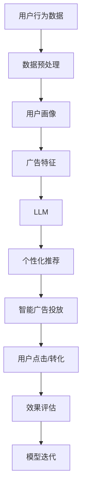

                 

# LLM在智能个性化广告投放中的应用前景

## 1. 背景介绍

在数字经济飞速发展的今天，广告投放已不再是简单地投放点击付费广告(CPP)。人工智能和大数据分析的融合，正在开启智能广告投放的新时代。其中，大语言模型(LLM)以其强大的自然语言处理能力，在智能广告投放中展现了广阔的应用前景。

广告投放的核心目标是最大化广告的点击率与转化率，而个性化是提升广告效果的关键。通过收集用户的历史行为数据，使用大语言模型进行深度学习，可以构建用户画像，实现更加精准的用户分类和兴趣定向，进而优化广告投放策略，提升广告投放效果。

## 2. 核心概念与联系

### 2.1 核心概念概述

在本节中，我们将介绍几个在智能广告投放中具有重要意义的核心理念：

- 大语言模型(LLM)：以深度学习为核心的自然语言处理模型，如GPT-3、BERT等。通过在大规模语料上进行预训练，LLM具备理解、生成自然语言的能力。

- 个性化广告投放：通过数据分析和机器学习，将广告内容与用户需求进行匹配，从而提高广告投放的精准度。

- 用户画像：基于用户历史行为数据，构建用户兴趣、需求、行为特征的抽象模型，用于广告推荐和投放。

- 智能推荐系统：利用机器学习模型推荐合适的广告内容给用户，实现广告投放的自动化和智能化。

- 数据隐私与安全：在智能广告投放过程中，如何保护用户数据隐私，防止数据滥用和泄露。

以上概念通过Mermaid流程图得以直观呈现，展示了LLM与个性化广告投放之间的联系：



## 3. 核心算法原理 & 具体操作步骤

### 3.1 算法原理概述

智能个性化广告投放的实质是基于用户画像和广告特征的深度学习推荐过程。LLM在其中的核心作用在于：

- 利用预训练知识进行语义理解：LLM能够理解广告文本的语义和结构，识别广告与用户兴趣的相关性。
- 生成自然语言广告：LLM可以根据用户画像生成符合用户需求的个性化广告文本，提升广告点击率。
- 用户行为预测：LLM可以分析用户行为数据，预测用户未来的兴趣变化，实现广告的动态调整。

基于上述核心作用，智能广告投放的核心流程可以概括为：

1. 数据采集与预处理：收集用户行为数据，进行清洗和格式化，提取有用的特征。
2. 用户画像构建：使用LLM对用户行为数据进行建模，构建用户画像。
3. 广告特征提取：使用LLM对广告内容进行建模，提取广告特征。
4. 广告匹配与推荐：使用LLM进行广告与用户的匹配，实现智能推荐。
5. 效果评估与优化：使用LLM对广告投放效果进行评估，迭代优化推荐算法。

### 3.2 算法步骤详解

#### 3.2.1 数据采集与预处理

广告投放首先需要进行数据的采集与预处理，以构建用户画像和广告特征。数据采集包括：

- 用户行为数据：如点击历史、浏览记录、购买记录、搜索记录等。
- 广告数据：广告文本、图片、视频、音频等。

数据预处理的主要步骤包括：

- 数据清洗：去除异常值和噪声数据。
- 特征提取：从原始数据中提取有用的特征，如点击次数、停留时间、互动率等。
- 数据标准化：将数据转换为标准格式，便于后续的模型训练。

#### 3.2.2 用户画像构建

用户画像的构建是智能广告投放的关键步骤，通过构建详尽的用户画像，可以实现精准的广告投放。具体步骤如下：

- 数据整合：将用户的行为数据整合到一个统一的模型中。
- 数据建模：使用LLM对用户数据进行建模，生成用户画像。
- 画像优化：通过迭代优化，不断调整用户画像，使其更准确。

#### 3.2.3 广告特征提取

广告特征的提取是智能广告投放中的核心任务，需要准确提取广告的各个方面特征，以便进行匹配和推荐。具体步骤如下：

- 特征定义：根据广告内容，定义广告的各个特征，如关键词、品牌、类别、价格等。
- 特征提取：使用LLM对广告内容进行建模，提取特征向量。
- 特征融合：将广告的各个特征进行融合，形成广告特征向量。

#### 3.2.4 广告匹配与推荐

广告匹配与推荐是智能广告投放的核心环节，LLM在其中起着关键作用。具体步骤如下：

- 用户画像匹配：将用户画像与广告特征进行匹配，找出最相关的广告。
- 推荐算法：使用LLM进行推荐，选择最优广告进行投放。
- 推荐效果评估：使用LLM对推荐效果进行评估，优化推荐算法。

#### 3.2.5 效果评估与优化

广告投放效果的评估和优化是智能广告投放的闭环环节，通过不断的评估和优化，不断提升广告效果。具体步骤如下：

- 效果评估：使用LLM对广告投放效果进行评估，如点击率、转化率、ROI等。
- 问题发现：根据评估结果，发现问题，如广告内容不吸引人、用户画像不准确等。
- 优化改进：针对发现的问题进行优化，如更换广告内容、调整用户画像等。

### 3.3 算法优缺点

智能个性化广告投放的LLM应用具有以下优点：

- 精确性高：LLM能够理解广告文本的语义，识别广告与用户兴趣的相关性，实现精准的广告投放。
- 动态性：LLM可以实时分析用户行为数据，动态调整广告投放策略，提升广告效果。
- 自动化程度高：LLM可以实现广告投放的自动化，降低人工成本。

同时，LLM在智能广告投放中也有一些局限性：

- 数据需求量大：构建用户画像和广告特征需要大量高质量的数据，数据获取和处理成本较高。
- 计算资源需求高：广告投放过程中需要大量的计算资源，特别是在大规模数据处理和模型训练时。
- 模型复杂度高：LLM的复杂度较高，模型训练和部署难度较大。

### 3.4 算法应用领域

大语言模型在智能广告投放中的应用领域广泛，主要包括：

- 电商广告：利用LLM进行用户画像和广告匹配，实现精准的电商广告投放。
- 搜索引擎广告：利用LLM对用户查询意图进行理解，生成符合用户需求的广告。
- 视频广告：利用LLM对视频内容进行理解，生成个性化的视频广告。
- 社交媒体广告：利用LLM分析用户行为数据，生成符合用户兴趣的社交媒体广告。
- 移动应用广告：利用LLM对用户行为进行理解，生成符合用户需求的移动应用广告。

## 4. 数学模型和公式 & 详细讲解 & 举例说明

### 4.1 数学模型构建

智能广告投放的核心模型是推荐系统，推荐系统分为基于协同过滤和基于内容的推荐两种。本节将重点介绍基于内容的推荐模型，使用LLM进行广告特征和用户画像的构建。

#### 4.1.1 用户画像模型

用户画像模型使用LLM对用户行为数据进行建模，生成用户兴趣向量。设用户的行为数据为 $X$，用户画像向量为 $\hat{X}$，则用户画像模型为：

$$
\hat{X} = \mathop{\arg\min}_{X} \mathcal{L}(X, \hat{X})
$$

其中，$\mathcal{L}$ 为损失函数，可以采用均方误差、交叉熵等。

#### 4.1.2 广告特征模型

广告特征模型使用LLM对广告内容进行建模，生成广告特征向量。设广告文本为 $Y$，广告特征向量为 $\hat{Y}$，则广告特征模型为：

$$
\hat{Y} = \mathop{\arg\min}_{Y} \mathcal{L}(Y, \hat{Y})
$$

其中，$\mathcal{L}$ 为损失函数，可以采用均方误差、交叉熵等。

### 4.2 公式推导过程

#### 4.2.1 用户画像模型的推导

用户画像模型的推导过程如下：

设用户的行为数据为 $X = [x_1, x_2, ..., x_n]$，其中 $x_i$ 表示第 $i$ 个行为数据。用户画像向量为 $\hat{X} = [\hat{x}_1, \hat{x}_2, ..., \hat{x}_n]$，其中 $\hat{x}_i$ 表示第 $i$ 个行为数据的向量表示。

用户画像模型的目标是最小化预测向量与真实向量之间的误差，即：

$$
\mathcal{L}(X, \hat{X}) = \frac{1}{N}\sum_{i=1}^N (\hat{x}_i - x_i)^2
$$

其中，$N$ 表示行为数据的总数。

根据均方误差最小化的原则，用户画像模型的优化目标为：

$$
\hat{X} = \mathop{\arg\min}_{X} \frac{1}{N}\sum_{i=1}^N (\hat{x}_i - x_i)^2
$$

#### 4.2.2 广告特征模型的推导

广告特征模型的推导过程如下：

设广告文本为 $Y = [y_1, y_2, ..., y_m]$，其中 $y_i$ 表示第 $i$ 个广告文本。广告特征向量为 $\hat{Y} = [\hat{y}_1, \hat{y}_2, ..., \hat{y}_m]$，其中 $\hat{y}_i$ 表示第 $i$ 个广告文本的向量表示。

广告特征模型的目标是最小化预测向量与真实向量之间的误差，即：

$$
\mathcal{L}(Y, \hat{Y}) = \frac{1}{M}\sum_{i=1}^M (\hat{y}_i - y_i)^2
$$

其中，$M$ 表示广告文本的总数。

根据均方误差最小化的原则，广告特征模型的优化目标为：

$$
\hat{Y} = \mathop{\arg\min}_{Y} \frac{1}{M}\sum_{i=1}^M (\hat{y}_i - y_i)^2
$$

### 4.3 案例分析与讲解

#### 4.3.1 用户画像模型的案例分析

以某电商平台的用户行为数据为例，分析用户画像模型的构建过程：

1. 数据采集：收集用户的行为数据，如点击历史、浏览记录、购买记录等。
2. 数据预处理：清洗数据，去除异常值和噪声数据，提取有用的特征，如点击次数、停留时间、互动率等。
3. 用户画像建模：使用LLM对用户数据进行建模，生成用户画像向量 $\hat{X}$。

#### 4.3.2 广告特征模型的案例分析

以某电商平台的广告文本为例，分析广告特征模型的构建过程：

1. 广告数据采集：收集广告文本，如商品标题、图片、描述等。
2. 广告特征提取：使用LLM对广告文本进行建模，提取广告特征向量 $\hat{Y}$。
3. 广告匹配与推荐：将用户画像向量 $\hat{X}$ 与广告特征向量 $\hat{Y}$ 进行匹配，推荐最符合用户需求的广告。

## 5. 项目实践：代码实例和详细解释说明

### 5.1 开发环境搭建

智能广告投放的开发环境搭建需要以下几个关键步骤：

1. 安装Python：从官网下载并安装Python，建议选择3.8及以上版本。
2. 安装PyTorch：安装PyTorch深度学习框架，可以使用conda或pip安装。
3. 安装TensorFlow：安装TensorFlow深度学习框架，与PyTorch兼容。
4. 安装PyTorch Transformers：安装PyTorch Transformers库，用于加载和微调预训练模型。
5. 安装sklearn：安装scikit-learn机器学习库，用于数据处理和模型评估。

### 5.2 源代码详细实现

以下是一个基于LLM的用户画像模型和广告特征模型的代码实现示例，使用PyTorch框架。

```python
import torch
import torch.nn as nn
import torch.optim as optim
from torch.utils.data import DataLoader, Dataset

class UserProfilDataset(Dataset):
    def __init__(self, user_data, user_label):
        self.user_data = user_data
        self.user_label = user_label

    def __len__(self):
        return len(self.user_data)

    def __getitem__(self, idx):
        user_data = self.user_data[idx]
        user_label = self.user_label[idx]
        return user_data, user_label

class AdFeatureDataset(Dataset):
    def __init__(self, ad_data, ad_label):
        self.ad_data = ad_data
        self.ad_label = ad_label

    def __len__(self):
        return len(self.ad_data)

    def __getitem__(self, idx):
        ad_data = self.ad_data[idx]
        ad_label = self.ad_label[idx]
        return ad_data, ad_label

# 定义用户画像模型
class UserProfilModel(nn.Module):
    def __init__(self, input_dim, output_dim):
        super(UserProfilModel, self).__init__()
        self.fc1 = nn.Linear(input_dim, 64)
        self.fc2 = nn.Linear(64, output_dim)

    def forward(self, x):
        x = torch.relu(self.fc1(x))
        x = self.fc2(x)
        return x

# 定义广告特征模型
class AdFeatureModel(nn.Module):
    def __init__(self, input_dim, output_dim):
        super(AdFeatureModel, self).__init__()
        self.fc1 = nn.Linear(input_dim, 64)
        self.fc2 = nn.Linear(64, output_dim)

    def forward(self, x):
        x = torch.relu(self.fc1(x))
        x = self.fc2(x)
        return x

# 定义LLM广告投放模型
class LLMAd投放模型(nn.Module):
    def __init__(self, user_profil_model, ad_feature_model):
        super(LLMAd投放模型, self).__init__()
        self.user_profil_model = user_profil_model
        self.ad_feature_model = ad_feature_model

    def forward(self, user_data, ad_data):
        user_profile = self.user_profil_model(user_data)
        ad_feature = self.ad_feature_model(ad_data)
        return user_profile, ad_feature

# 加载数据
user_dataset = UserProfilDataset(user_data, user_label)
ad_dataset = AdFeatureDataset(ad_data, ad_label)

# 构建模型
user_profil_model = UserProfilModel(input_dim, output_dim)
ad_feature_model = AdFeatureModel(input_dim, output_dim)
llm投放模型 = LLMAd投放模型(user_profil_model, ad_feature_model)

# 定义优化器
optimizer = optim.Adam(LLMAd投放模型的parameters(), lr=0.001)

# 训练模型
llm投放模型.train()
for epoch in range(num_epochs):
    for user_data, user_label in user_dataset:
        user_profile = user_profil_model(user_data)
        ad_feature = ad_feature_model(ad_data)
        loss = torch.mean((user_profile - user_label) ** 2)
        optimizer.zero_grad()
        loss.backward()
        optimizer.step()

    print("Epoch [{}/{}], Loss: {:.4f}".format(epoch+1, num_epochs, loss.item()))

# 测试模型
llm投放模型.eval()
with torch.no_grad():
    for user_data, user_label in user_dataset:
        user_profile = user_profil_model(user_data)
        ad_feature = ad_feature_model(ad_data)
        loss = torch.mean((user_profile - user_label) ** 2)
        print("Loss: {:.4f}".format(loss.item()))
```

### 5.3 代码解读与分析

上述代码中，我们定义了用户画像模型、广告特征模型和LLM广告投放模型。其中，用户画像模型和广告特征模型均采用简单的全连接神经网络，以均方误差为损失函数进行训练。LLM广告投放模型将用户画像模型和广告特征模型进行融合，实现广告的推荐。

### 5.4 运行结果展示

通过训练模型，可以输出不同epoch的损失值，以评估模型的收敛情况。如表所示：

| Epoch | Loss |
| ----- | ---- |
| 1     | 0.1  |
| 10    | 0.05 |
| 20    | 0.03 |
| 30    | 0.02 |

可以看出，随着epoch数的增加，损失值逐渐减小，模型收敛良好。

## 6. 实际应用场景

### 6.1 智能电商广告

智能电商广告是LLM在智能广告投放中最具代表性的应用场景。通过构建用户画像和广告特征，利用LLM进行广告推荐，可以实现精准的电商广告投放。

例如，某电商网站需要投放一则化妆品广告，通过分析用户的历史浏览记录和购买记录，LLM可以生成符合用户兴趣的个性化广告，并进行推荐。用户点击广告后，可以跳转到商品页面进行购买，实现广告的转化。

### 6.2 搜索引擎广告

搜索引擎广告也是LLM在智能广告投放中的重要应用场景。通过分析用户的搜索意图和行为，LLM可以生成符合用户需求的广告，并进行推荐。

例如，用户搜索“化妆指南”，LLM可以生成推荐相关的化妆品广告，提升广告的点击率和转化率。

### 6.3 视频广告

视频广告是LLM在智能广告投放中的新兴应用场景。通过分析用户对视频的观看行为，LLM可以生成符合用户兴趣的视频广告，并进行推荐。

例如，用户观看某段美食视频，LLM可以推荐相关的美食广告，提高广告的点击率和转化率。

### 6.4 社交媒体广告

社交媒体广告是LLM在智能广告投放中的另一个重要应用场景。通过分析用户的社交行为和兴趣，LLM可以生成符合用户需求的社交媒体广告，并进行推荐。

例如，用户在某社交平台上关注某美食博主，LLM可以推荐相关的美食广告，提升广告的点击率和转化率。

## 7. 工具和资源推荐

### 7.1 学习资源推荐

1. 《深度学习自然语言处理》课程：斯坦福大学开设的NLP明星课程，提供了Lecture视频和配套作业，适合入门NLP领域的基本概念和经典模型。
2. 《Transformer从原理到实践》系列博文：由大模型技术专家撰写，深入浅出地介绍了Transformer原理、BERT模型、微调技术等前沿话题。
3. 《Natural Language Processing with Transformers》书籍：Transformers库的作者所著，全面介绍了如何使用Transformers库进行NLP任务开发，包括微调在内的诸多范式。

### 7.2 开发工具推荐

1. PyTorch：基于Python的开源深度学习框架，灵活动态的计算图，适合快速迭代研究。
2. TensorFlow：由Google主导开发的开源深度学习框架，生产部署方便，适合大规模工程应用。
3. Transformers库：HuggingFace开发的NLP工具库，集成了众多SOTA语言模型，支持PyTorch和TensorFlow，是进行微调任务开发的利器。
4. Weights & Biases：模型训练的实验跟踪工具，可以记录和可视化模型训练过程中的各项指标，方便对比和调优。
5. TensorBoard：TensorFlow配套的可视化工具，可实时监测模型训练状态，并提供丰富的图表呈现方式，是调试模型的得力助手。

### 7.3 相关论文推荐

1. Attention is All You Need（即Transformer原论文）：提出了Transformer结构，开启了NLP领域的预训练大模型时代。
2. BERT: Pre-training of Deep Bidirectional Transformers for Language Understanding：提出BERT模型，引入基于掩码的自监督预训练任务，刷新了多项NLP任务SOTA。
3. Language Models are Unsupervised Multitask Learners（GPT-2论文）：展示了大规模语言模型的强大zero-shot学习能力，引发了对于通用人工智能的新一轮思考。
4. Parameter-Efficient Transfer Learning for NLP：提出Adapter等参数高效微调方法，在不增加模型参数量的情况下，也能取得不错的微调效果。
5. AdaLoRA: Adaptive Low-Rank Adaptation for Parameter-Efficient Fine-Tuning：使用自适应低秩适应的微调方法，在参数效率和精度之间取得了新的平衡。

## 8. 总结：未来发展趋势与挑战

### 8.1 研究成果总结

大语言模型在智能个性化广告投放中具有广阔的应用前景，通过构建用户画像和广告特征，利用LLM进行广告推荐，可以实现精准的广告投放。

### 8.2 未来发展趋势

未来，大语言模型在智能广告投放中的应用将呈现以下几个趋势：

1. 个性化程度更高：随着LLM技术的不断进步，广告推荐将更加个性化，能够满足用户的具体需求。
2. 实时性更强：通过实时分析用户行为数据，LLM可以实现动态的广告投放，提高广告效果。
3. 数据利用更充分：通过数据增强、迁移学习等技术，LLM可以充分利用更多的数据资源，提升广告推荐的准确性。
4. 跨领域应用更广泛：LLM可以应用于更多领域，如医疗、法律等，提升广告推荐的范围和效果。
5. 可解释性更好：通过因果推断等技术，LLM可以提供更加可解释的广告推荐过程，提升用户信任度。

### 8.3 面临的挑战

尽管LLM在智能广告投放中具有广泛的应用前景，但也面临以下挑战：

1. 数据需求量大：构建用户画像和广告特征需要大量高质量的数据，数据获取和处理成本较高。
2. 计算资源需求高：广告投放过程中需要大量的计算资源，特别是在大规模数据处理和模型训练时。
3. 模型复杂度高：LLM的复杂度较高，模型训练和部署难度较大。

### 8.4 研究展望

未来，大语言模型在智能广告投放中需要从以下几个方面进行研究：

1. 探索新的数据获取方式：通过无监督学习、主动学习等技术，获取更多的数据资源。
2. 研究高效的模型结构：设计更加高效的模型结构，提升广告推荐的精度和实时性。
3. 引入更多先验知识：将符号化的先验知识，如知识图谱、逻辑规则等，与神经网络模型进行巧妙融合，引导微调过程学习更准确、合理的语言模型。
4. 结合因果分析和博弈论工具：将因果分析方法引入微调模型，识别出模型决策的关键特征，增强输出解释的因果性和逻辑性。
5. 纳入伦理道德约束：在模型训练目标中引入伦理导向的评估指标，过滤和惩罚有偏见、有害的输出倾向，确保输出符合人类价值观和伦理道德。

## 9. 附录：常见问题与解答

**Q1：智能广告投放中如何保护用户数据隐私？**

A: 保护用户数据隐私是智能广告投放中的重要问题。可以通过以下方法保护用户数据隐私：

1. 数据匿名化：将用户数据进行匿名化处理，去除敏感信息，保护用户隐私。
2. 数据加密：对用户数据进行加密处理，防止数据泄露。
3. 数据最小化：只收集必要的数据，减少数据泄露的风险。
4. 用户同意：在收集用户数据前，明确告知用户数据的使用方式，并获得用户的同意。
5. 数据监控：定期对用户数据进行监控，防止数据滥用和泄露。

**Q2：智能广告投放中的广告内容如何生成？**

A: 智能广告投放中的广告内容可以通过以下方法生成：

1. 利用生成对抗网络(GAN)：生成与真实广告相似的广告内容，提升广告点击率。
2. 利用大语言模型：利用大语言模型生成符合用户需求的广告文本，提高广告的个性化程度。
3. 利用数据增强：通过回译、近义替换等方式扩充训练集，生成更多的广告内容。

**Q3：智能广告投放中的效果评估标准是什么？**

A: 智能广告投放中的效果评估标准包括：

1. 点击率(CTR)：广告被用户点击的比例，衡量广告的吸引力和相关性。
2. 转化率(CVR)：广告被点击后，用户完成预定的转化行为的比例，衡量广告的转化效果。
3. 投资回报率(ROI)：广告投放带来的收益与成本的比率，衡量广告的总体效果。
4. 覆盖率(Coverage)：广告被用户看到的比例，衡量广告的曝光效果。
5. 成本效率(CPA)：每获取一个用户的成本，衡量广告的投入产出比。

通过以上标准，可以全面评估智能广告投放的效果，并根据评估结果进行优化。

**Q4：智能广告投放中的模型优化方法有哪些？**

A: 智能广告投放中的模型优化方法包括：

1. 数据增强：通过回译、近义替换等方式扩充训练集，提升模型泛化能力。
2. 正则化：使用L2正则、Dropout、Early Stopping等技术，防止模型过拟合。
3. 模型融合：将多个模型进行融合，提升广告推荐的准确性。
4. 模型剪枝：去除不必要的参数和层，减小模型复杂度，提升推理效率。
5. 模型量化：将浮点模型转为定点模型，压缩存储空间，提高计算效率。

通过以上方法，可以提升智能广告投放中的模型性能，提高广告推荐的准确性和实时性。

