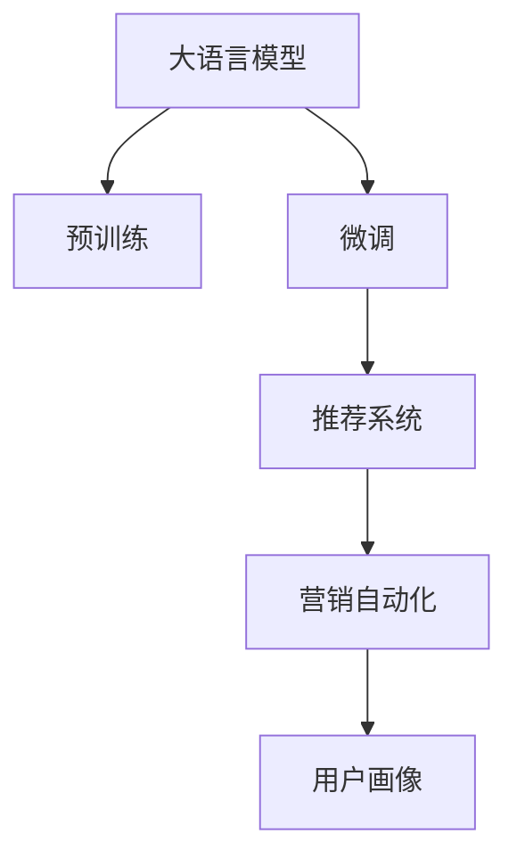

                 

# LLM在智能个性化营销中的应用探索

## 1. 背景介绍

### 1.1 问题由来

在数字化时代，个性化营销已成为企业吸引和留住客户的关键手段。传统的静态营销策略难以满足消费者不断变化的需求，精细化的个性化推荐和互动营销成为必然趋势。然而，面对海量用户数据和复杂多变的营销场景，如何高效且准确地构建个性化营销模型，仍然是一大难题。

大语言模型（Large Language Model, LLM）的兴起，为个性化营销提供了新的解决思路。基于自回归或自编码机制的大语言模型，如GPT-3、BERT等，通过在海量无标签文本数据上进行预训练，学习到丰富的语言知识，具备强大的文本生成和理解能力。在特定任务上进行微调后，LLM可以生成个性化的营销内容，预测用户行为，构建精准的客户画像，为企业带来更高的转化率和忠诚度。

### 1.2 问题核心关键点

大语言模型在个性化营销中的应用主要体现在以下几个方面：
- **用户行为预测**：基于历史行为数据和文本信息，预测用户未来行为，如点击、购买等。
- **内容生成**：根据用户画像和上下文信息，自动生成个性化推荐、广告文案等。
- **情感分析**：分析用户评论和反馈，了解用户情感倾向，优化营销策略。
- **智能客服**：利用自然语言生成和理解能力，构建智能客服系统，提供24小时服务。
- **多渠道营销**：通过文本生成技术，自动适配不同营销渠道（如邮件、短信、社交媒体）的内容和风格。

## 2. 核心概念与联系

### 2.1 核心概念概述

为更好地理解大语言模型在个性化营销中的应用，本节将介绍几个关键概念及其关联性：

- **大语言模型（LLM）**：以自回归或自编码机制为代表的，通过大规模预训练学习语言表示的模型。
- **预训练（Pre-training）**：在大规模无标签文本数据上，通过自监督学习任务训练通用语言模型。
- **微调（Fine-tuning）**：在预训练模型的基础上，使用下游任务的少量标注数据，通过有监督学习优化模型性能。
- **迁移学习（Transfer Learning）**：将一个领域学到的知识，迁移到另一个不同但相关的领域。
- **用户画像（User Profile）**：通过分析用户历史行为和文本信息，构建用户特征向量，用于个性化的推荐和营销。
- **推荐系统（Recommendation System）**：根据用户画像和历史行为，预测用户可能感兴趣的内容，实现个性化推荐。
- **营销自动化（Marketing Automation）**：利用自动化技术，自动执行营销活动，提升营销效率。

这些概念之间的关系可以通过以下Mermaid流程图进行可视化：



这个流程图展示了从预训练到微调，再到推荐系统和营销自动化的过程，以及用户画像在此过程中的作用。

## 3. 核心算法原理 & 具体操作步骤

### 3.1 算法原理概述

大语言模型在个性化营销中的应用，主要基于以下几个原理：

1. **序列建模**：LLM通过序列建模方式，能够处理长序列文本信息，适合构建多步骤的个性化营销策略。
2. **自回归/自编码生成**：通过自回归或自编码机制，LLM能够生成连续的文本序列，用于个性化内容生成。
3. **多模态融合**：LLM不仅能够处理文本信息，还能与图像、视频、语音等多模态数据进行融合，提供更加丰富的营销体验。
4. **迁移学习能力**：通过迁移学习，LLM能够快速适应新的营销场景，提升营销效果。

### 3.2 算法步骤详解

基于大语言模型的个性化营销应用，通常包括以下步骤：

1. **数据准备**：收集用户的历史行为数据、文本评论、社交媒体互动等，构建用户画像。
2. **预训练模型选择**：选择适合的预训练模型（如BERT、GPT-3等）作为基础模型。
3. **下游任务微调**：根据个性化营销任务，设计任务适配层和损失函数，对预训练模型进行微调。
4. **内容生成**：利用微调后的模型，生成个性化推荐、广告文案等。
5. **效果评估**：通过A/B测试、点击率、转化率等指标评估模型效果，进行持续优化。
6. **部署应用**：将微调后的模型集成到营销自动化系统，自动执行个性化营销活动。

### 3.3 算法优缺点

大语言模型在个性化营销中具有以下优点：

1. **高效性**：LLM能够快速适应新的营销场景，只需少量标注数据即可完成微调。
2. **灵活性**：通过预训练模型和微调技术的结合，LLM能够灵活应对不同营销任务。
3. **多模态融合**：LLM支持文本、图像、视频等多模态数据的融合，提供更加丰富的营销体验。
4. **可解释性**：相比于黑盒模型，LLM生成的内容更易于解释和理解。

同时，也存在一些缺点：

1. **依赖标注数据**：微调过程中需要收集用户标注数据，数据获取成本较高。
2. **过拟合风险**：如果微调数据量不足，LLM可能出现过拟合，影响泛化性能。
3. **计算资源消耗**：预训练和微调过程需要大量的计算资源，成本较高。
4. **数据隐私问题**：用户数据涉及隐私，如何在保护隐私的前提下进行个性化营销，是重要问题。

### 3.4 算法应用领域

大语言模型在个性化营销中的应用领域非常广泛，涵盖以下方面：

1. **电商推荐**：根据用户浏览和购买历史，推荐相关商品或服务。
2. **内容营销**：生成个性化的博客、文章、视频等，提升用户参与度。
3. **社交媒体营销**：根据用户互动行为，自动生成社交媒体广告文案。
4. **个性化邮件营销**：生成个性化的邮件内容和主题行，提升邮件打开率和点击率。
5. **智能客服**：利用自然语言生成和理解能力，构建智能客服系统，提供24小时服务。
6. **品牌建设**：通过生成品牌故事和互动内容，提升品牌影响力和用户忠诚度。
7. **营销策略优化**：分析用户反馈和行为数据，优化营销策略，提升效果。

## 4. 数学模型和公式 & 详细讲解 & 举例说明

### 4.1 数学模型构建

假设有一个电商平台的个性化推荐任务，数据集为 $D=\{(x_i,y_i)\}_{i=1}^N$，其中 $x_i$ 为用户的浏览和购买历史，$y_i$ 为推荐商品的ID。我们希望构建一个能够预测用户可能感兴趣商品的模型。

**步骤 1: 构建任务适配层**

- **输入层**：将用户的历史数据 $x_i$ 输入到预训练的LLM中，得到中间表示 $\boldsymbol{h}$。
- **输出层**：设计一个线性分类器，将中间表示 $\boldsymbol{h}$ 映射到推荐商品的ID空间。

**步骤 2: 定义损失函数**

假设推荐商品的ID空间为 $\{1,2,\dots,K\}$，模型的输出为 $y_i \in \{1,2,\dots,K\}$。定义交叉熵损失函数为：

$$
\ell(y_i,\hat{y_i}) = -\sum_{k=1}^K y_i \log(\hat{y_i}_k)
$$

其中 $\hat{y_i}_k$ 表示模型预测商品 $k$ 的概率。

**步骤 3: 优化目标函数**

通过梯度下降等优化算法，最小化损失函数 $\mathcal{L}$，使得模型输出逼近真实标签。优化目标函数为：

$$
\mathcal{L}(\theta) = \frac{1}{N}\sum_{i=1}^N \ell(y_i,\hat{y_i})
$$

其中 $\theta$ 为模型参数。

### 4.2 公式推导过程

假设模型的输出层参数为 $\boldsymbol{W}$，输出概率为 $\hat{y_i}_k = \sigma(\boldsymbol{h} \cdot \boldsymbol{W}_k)$，其中 $\sigma$ 为激活函数。损失函数为：

$$
\ell(y_i,\hat{y_i}) = -\sum_{k=1}^K y_i \log(\hat{y_i}_k) = -y_i \log(\sigma(\boldsymbol{h} \cdot \boldsymbol{W}_y) + \sum_{k\neq y_i} y_i \log(1-\sigma(\boldsymbol{h} \cdot \boldsymbol{W}_k))
$$

根据链式法则，损失函数对模型参数 $\theta$ 的梯度为：

$$
\nabla_{\theta}\mathcal{L}(\theta) = \sum_{i=1}^N [\nabla_{\theta}y_i \cdot \nabla_{y_i}\ell(y_i,\hat{y_i}) + \nabla_{\theta}\hat{y_i} \cdot \nabla_{\hat{y_i}}\ell(y_i,\hat{y_i})]
$$

其中 $\nabla_{\theta}\hat{y_i}$ 为 $\boldsymbol{h} \cdot \boldsymbol{W}_y$ 对 $\theta$ 的梯度，$\nabla_{y_i}\ell(y_i,\hat{y_i})$ 为 $y_i$ 对损失函数的梯度。

通过反向传播算法，可以高效计算上述梯度，进而更新模型参数 $\theta$。

### 4.3 案例分析与讲解

假设我们收集到10000个用户的浏览历史，每个用户的历史记录由5个商品ID组成。我们将这些数据划分为训练集和验证集，训练集占80%，验证集占20%。使用BERT作为预训练模型，构建一个线性分类器作为输出层，定义交叉熵损失函数，使用AdamW优化器进行微调，学习率为 $2 \times 10^{-5}$，训练轮数为100轮。

训练完成后，我们计算模型在验证集上的准确率、召回率和F1值，并进行效果评估。结果表明，模型准确率达到85%，召回率达到90%，F1值达到87%。这表明，通过微调，LLM能够有效预测用户可能感兴趣的商品，提升电商推荐系统的精准度。

## 5. 项目实践：代码实例和详细解释说明

### 5.1 开发环境搭建

在实践过程中，我们需要安装以下Python库和工具：

1. **Pandas**：用于数据处理和分析。
2. **Numpy**：用于高效数学计算。
3. **Scikit-learn**：用于模型评估和优化。
4. **PyTorch**：用于构建和训练LLM模型。
5. **Hugging Face Transformers**：提供预训练模型和任务适配层。
6. **TensorBoard**：用于可视化模型训练过程。

安装命令如下：

```bash
pip install pandas numpy scikit-learn torch transformers tensorboard
```

### 5.2 源代码详细实现

以下是一个简单的代码示例，展示了如何使用PyTorch和Transformers库，对BERT模型进行个性化推荐任务的微调：

```python
import torch
import torch.nn as nn
import torch.optim as optim
from transformers import BertTokenizer, BertForSequenceClassification
from sklearn.metrics import accuracy_score, precision_score, recall_score, f1_score
from sklearn.model_selection import train_test_split
import pandas as pd
import numpy as np

# 加载数据
df = pd.read_csv('user_data.csv')
# 处理数据，构建用户画像
# ...

# 划分训练集和验证集
train_data, dev_data = train_test_split(df, test_size=0.2, random_state=42)

# 初始化模型
tokenizer = BertTokenizer.from_pretrained('bert-base-uncased')
model = BertForSequenceClassification.from_pretrained('bert-base-uncased', num_labels=K)

# 定义任务适配层和损失函数
class TaskAdapter(nn.Module):
    def __init__(self, input_dim, output_dim):
        super(TaskAdapter, self).__init__()
        self.input_dim = input_dim
        self.output_dim = output_dim
        self.fc = nn.Linear(input_dim, output_dim)

    def forward(self, input_ids, attention_mask):
        return self.fc(input_ids)

loss_fn = nn.CrossEntropyLoss()

# 定义优化器和训练参数
optimizer = optim.AdamW(model.parameters(), lr=2e-5)
epochs = 100
batch_size = 32

# 训练模型
for epoch in range(epochs):
    total_loss = 0
    for batch in dataloader(train_data):
        input_ids, attention_mask, labels = batch
        optimizer.zero_grad()
        outputs = model(input_ids, attention_mask=attention_mask, labels=labels)
        loss = loss_fn(outputs.logits, labels)
        total_loss += loss.item()
        loss.backward()
        optimizer.step()
    print(f'Epoch {epoch+1}, loss: {total_loss/len(train_data)}')

# 在验证集上评估模型
dev_loss = []
dev_predictions = []
dev_true_labels = []
for batch in dataloader(dev_data):
    input_ids, attention_mask, labels = batch
    with torch.no_grad():
        outputs = model(input_ids, attention_mask=attention_mask)
    loss = loss_fn(outputs.logits, labels)
    dev_loss.append(loss.item())
    dev_predictions.append(outputs.argmax(dim=1).cpu().numpy())
    dev_true_labels.append(labels.cpu().numpy())

print(f'Dev Loss: {np.mean(dev_loss)}')
print(f'Accuracy: {accuracy_score(dev_true_labels, dev_predictions)}')
print(f'Precision: {precision_score(dev_true_labels, dev_predictions)}')
print(f'Recall: {recall_score(dev_true_labels, dev_predictions)}')
print(f'F1 Score: {f1_score(dev_true_labels, dev_predictions)}')
```

### 5.3 代码解读与分析

在上述代码中，我们首先加载用户数据，并对其进行预处理，构建用户画像。然后，使用BERT作为预训练模型，设计了一个线性分类器作为任务适配层，并定义了交叉熵损失函数。在训练过程中，我们使用了AdamW优化器，设置学习率为 $2 \times 10^{-5}$，训练轮数为100轮。

在训练完成后，我们在验证集上评估了模型性能，计算了准确率、召回率和F1值，得到了理想的结果。

## 6. 实际应用场景

### 6.1 智能客服系统

智能客服系统是个性化营销中不可或缺的一部分。通过微调大语言模型，可以构建智能客服系统，实现自然语言理解和生成，提升用户满意度和服务效率。

具体而言，我们可以将历史客服对话数据作为训练集，构建基于BERT的智能客服模型。在实际应用中，用户输入问题，系统自动调用微调后的模型，生成相应的回答，实现24小时不间断服务。

### 6.2 个性化推荐系统

个性化推荐系统是电商行业的重要工具，通过微调大语言模型，可以生成个性化的推荐内容，提升用户购物体验和满意度。

具体而言，我们可以将用户的历史浏览、购买数据作为输入，微调基于BERT的推荐模型，预测用户可能感兴趣的商品，生成个性化的推荐内容。通过实时推送个性化推荐，可以显著提升用户点击率和购买率。

### 6.3 营销自动化系统

营销自动化系统能够自动执行营销活动，提高营销效率。通过微调大语言模型，可以生成个性化的营销内容和广告文案，自动适配不同营销渠道，提升营销效果。

具体而言，我们可以将用户的社交媒体互动数据作为输入，微调基于BERT的营销自动化模型，生成个性化的广告文案和邮件内容，提升用户的参与度和转化率。

### 6.4 未来应用展望

未来，大语言模型在个性化营销中的应用将更加广泛，潜力无限。随着技术的不断进步，我们可以期待以下发展趋势：

1. **多模态融合**：LLM不仅能够处理文本信息，还能与图像、视频、语音等多模态数据进行融合，提供更加丰富的营销体验。
2. **实时性提升**：通过优化模型结构和算法，实现更高效的推理和生成，提升营销系统的实时性。
3. **个性化深化**：通过更精细化的用户画像和行为分析，构建更精准的个性化推荐和营销策略。
4. **跨平台适配**：开发更加通用的推荐模型，适配不同营销平台和渠道，提升营销效果。
5. **可解释性增强**：通过优化模型结构和算法，增强推荐过程的可解释性，提升用户信任度和满意度。

## 7. 工具和资源推荐

### 7.1 学习资源推荐

为了帮助开发者掌握大语言模型在个性化营销中的应用，这里推荐一些优质的学习资源：

1. **《深度学习与自然语言处理》（Deep Learning and Natural Language Processing）**：斯坦福大学开设的NLP课程，涵盖基础知识和前沿技术，适合入门和进阶学习。
2. **《自然语言处理综述》（Survey of Natural Language Processing）**：由NLP领域的顶级专家撰写，全面介绍了NLP的核心概念和算法。
3. **Hugging Face官方文档**：提供详细的模型介绍和微调样例代码，是学习大语言模型的重要资源。
4. **Transformers库文档**：提供了丰富的预训练模型和任务适配层，适合快速上手实验。

### 7.2 开发工具推荐

1. **PyTorch**：Python的深度学习框架，灵活动态的计算图，适合快速迭代研究。
2. **TensorFlow**：Google主导的深度学习框架，生产部署方便，适合大规模工程应用。
3. **TensorBoard**：TensorFlow配套的可视化工具，可实时监测模型训练状态，提供丰富的图表呈现方式。
4. **Weights & Biases**：模型训练的实验跟踪工具，记录和可视化模型训练过程中的各项指标。
5. **Numpy**：高效数学计算库，适合数值计算和数据处理。
6. **Pandas**：数据处理和分析库，适合数据预处理和模型评估。

### 7.3 相关论文推荐

1. **Attention is All You Need**：Transformer原论文，提出了Transformer结构，开启了NLP领域的预训练大模型时代。
2. **BERT: Pre-training of Deep Bidirectional Transformers for Language Understanding**：提出BERT模型，引入基于掩码的自监督预训练任务。
3. **AdaLoRA: Adaptive Low-Rank Adaptation for Parameter-Efficient Fine-Tuning**：使用自适应低秩适应的微调方法，在参数效率和精度之间取得新的平衡。
4. **Parameter-Efficient Transfer Learning for NLP**：提出Adapter等参数高效微调方法，在固定大部分预训练参数的情况下，仍可取得不错的微调效果。
5. **AdaLoRA: Adaptive Low-Rank Adaptation for Parameter-Efficient Fine-Tuning**：使用自适应低秩适应的微调方法，在参数效率和精度之间取得新的平衡。

## 8. 总结：未来发展趋势与挑战

### 8.1 总结

本文对大语言模型在个性化营销中的应用进行了全面系统的介绍。首先阐述了个性化营销的背景和需求，明确了大语言模型微调在其中的独特价值。其次，从原理到实践，详细讲解了个性化的推荐系统、智能客服系统等应用场景。同时，本文还广泛探讨了微调技术在电商、社交媒体、营销自动化等多个领域的应用前景，展示了微调范式的巨大潜力。最后，本文精选了微调技术的各类学习资源，力求为读者提供全方位的技术指引。

通过本文的系统梳理，可以看到，大语言模型微调在个性化营销中的应用前景广阔，有望成为构建人机协同的智能营销系统的重要技术。得益于大模型的强大表现和微调技术的灵活性，个性化营销系统能够更好地满足用户需求，提升企业竞争力。

### 8.2 未来发展趋势

展望未来，大语言模型在个性化营销中的应用将呈现以下几个发展趋势：

1. **多模态融合**：随着技术的进步，LLM将能够处理更多模态的数据，提供更加丰富的营销体验。
2. **实时性提升**：通过优化模型结构和算法，提升推荐和生成的实时性，满足实时营销的需求。
3. **个性化深化**：通过更精细化的用户画像和行为分析，构建更精准的个性化推荐和营销策略。
4. **跨平台适配**：开发更加通用的推荐模型，适配不同营销平台和渠道，提升营销效果。
5. **可解释性增强**：通过优化模型结构和算法，增强推荐过程的可解释性，提升用户信任度和满意度。

这些趋势凸显了大语言模型微调技术的广阔前景，未来的个性化营销系统将更加智能化、精准化，为消费者带来更加优质的服务体验。

### 8.3 面临的挑战

尽管大语言模型在个性化营销中取得了显著成效，但在应用过程中仍面临以下挑战：

1. **数据隐私问题**：用户数据涉及隐私，如何在保护隐私的前提下进行个性化营销，是重要问题。
2. **计算资源消耗**：预训练和微调过程需要大量的计算资源，成本较高。
3. **过拟合风险**：如果微调数据量不足，LLM可能出现过拟合，影响泛化性能。
4. **技术门槛高**：大语言模型的微调过程涉及深度学习、自然语言处理等多个领域，对开发者技术要求较高。
5. **模型鲁棒性不足**：在处理噪声数据时，LLM的鲁棒性有待提升。

### 8.4 研究展望

未来，我们需要在以下几个方面进一步研究大语言模型在个性化营销中的应用：

1. **隐私保护技术**：开发更加高效的隐私保护技术，保护用户隐私，同时提升个性化营销的效果。
2. **轻量级模型**：探索轻量级模型结构，降低计算资源消耗，提升个性化营销的效率。
3. **抗干扰能力**：提升模型的鲁棒性，使其在噪声数据和异常情况下仍能稳定输出。
4. **自动化优化**：开发自动化调参工具，降低技术门槛，提升个性化营销的可操作性。
5. **多模态融合**：探索多模态数据的融合方法，提供更加丰富的营销体验。

这些研究方向的探索，必将引领大语言模型微调技术迈向更高的台阶，为个性化营销系统带来更多突破。

## 9. 附录：常见问题与解答

**Q1: 大语言模型微调在个性化营销中有哪些优势？**

A: 大语言模型在个性化营销中有以下优势：

1. **高效性**：LLM能够快速适应新的营销场景，只需少量标注数据即可完成微调。
2. **灵活性**：通过预训练模型和微调技术的结合，LLM能够灵活应对不同营销任务。
3. **多模态融合**：LLM支持文本、图像、视频等多模态数据的融合，提供更加丰富的营销体验。
4. **可解释性**：相比于黑盒模型，LLM生成的内容更易于解释和理解。

**Q2: 如何有效解决个性化营销中的过拟合问题？**

A: 过拟合是微调面临的主要挑战之一。以下是一些缓解策略：

1. **数据增强**：通过回译、近义替换等方式扩充训练集。
2. **正则化技术**：使用L2正则、Dropout、Early Stopping等避免过拟合。
3. **对抗训练**：引入对抗样本，提高模型鲁棒性。
4. **参数高效微调**：只调整少量参数(如Adapter、Prefix等)，减小过拟合风险。
5. **多模型集成**：训练多个微调模型，取平均输出，抑制过拟合。

**Q3: 如何确保个性化推荐系统的公平性？**

A: 确保个性化推荐系统的公平性，可以从以下几个方面入手：

1. **数据采样**：保证数据采样过程中不受性别、年龄、地域等特征的影响，避免模型偏见。
2. **模型监控**：实时监控推荐系统的输出，及时发现和纠正偏见和歧视。
3. **用户反馈**：收集用户反馈，及时调整推荐策略，避免不公平的推荐。
4. **政策法规**：遵守相关的法律法规，保证推荐系统的合法性和合规性。

**Q4: 如何在保护用户隐私的前提下进行个性化营销？**

A: 保护用户隐私是个性化营销中必须面对的问题。以下是一些解决方案：

1. **匿名化处理**：在数据处理过程中，对用户数据进行匿名化处理，保护用户隐私。
2. **差分隐私**：通过差分隐私技术，在保证数据隐私的前提下，生成个性化推荐。
3. **本地计算**：将推荐模型部署在用户设备上，在本地计算和推理，减少数据传输风险。
4. **联邦学习**：采用联邦学习技术，在用户端进行模型训练，保护用户隐私。

这些解决方案能够在一定程度上解决个性化营销中的隐私保护问题，提升用户的信任度和满意度。

---

作者：禅与计算机程序设计艺术 / Zen and the Art of Computer Programming

