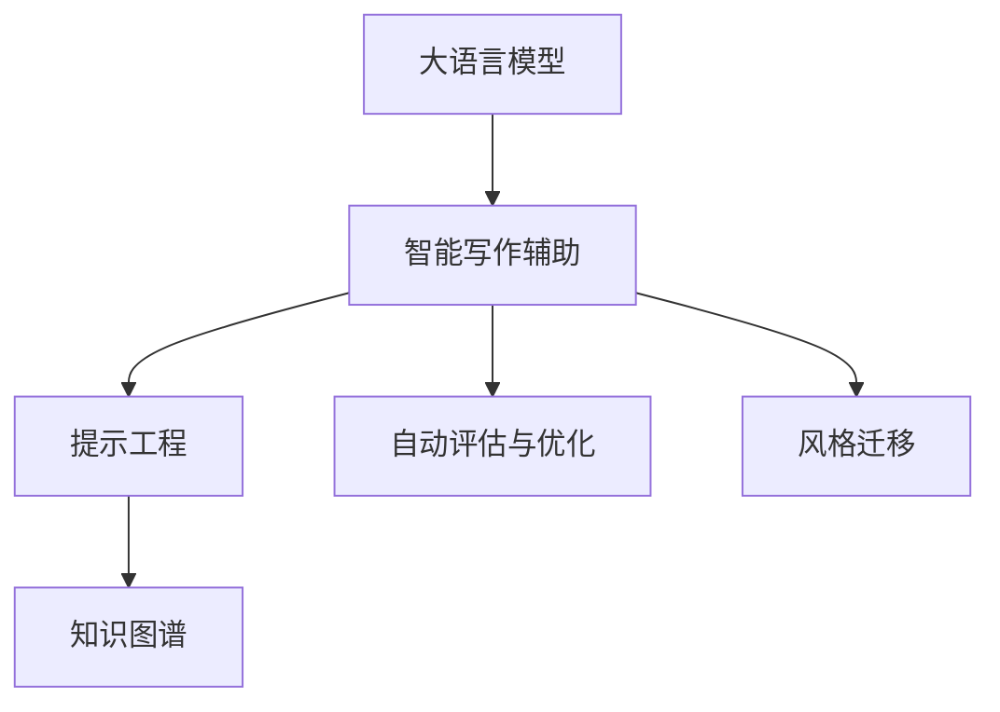

                 

# LLM在智能写作辅助中的应用

> 关键词：大语言模型,智能写作辅助,自然语言处理,NLP,文本生成,知识图谱,提示工程,创新点

## 1. 背景介绍

### 1.1 问题由来
随着数字时代的到来，人类对文本信息的生产需求日益增长。无论是在学术写作、商业文案，还是在日常沟通中，大量高质量文本内容的需求正日益旺盛。传统的文本生成方式依赖人工，需要大量的时间和精力，且难以保证一致性和多样性。

智能写作辅助技术的兴起，为文本生成提供了新的解决方案。通过结合大语言模型(Large Language Model, LLM)和大规模语料库，智能写作辅助能够自动生成高质量文本，显著提升写作效率和质量。

### 1.2 问题核心关键点
智能写作辅助技术本质上是大语言模型在特定任务上的应用。其主要面临的关键问题包括：
- 如何高效构建语义丰富的提示(Prompt)，引导模型生成符合用户需求的高质量文本？
- 如何结合知识图谱、符号化知识等，提升生成的文本内容的质量和准确性？
- 如何自动评估和优化生成的文本内容，保证写作辅助系统的输出质量？

这些问题的解决，对智能写作辅助系统的应用效果有着重要影响。

### 1.3 问题研究意义
智能写作辅助技术的发展，对于提升文本生成效率和质量，降低写作成本，具有重要的研究价值。它不仅能大幅提升写作生产力，还能提升文本内容的创意性和准确性，推动内容创作进入新纪元。

## 2. 核心概念与联系

### 2.1 核心概念概述

为更好地理解智能写作辅助技术的应用，本节将介绍几个核心概念：

- 大语言模型(Large Language Model, LLM)：以自回归(如GPT)或自编码(如BERT)模型为代表的大规模预训练语言模型。通过在大规模无标签文本语料上进行预训练，学习通用的语言表示，具备强大的语言理解和生成能力。

- 智能写作辅助：通过结合大语言模型和特定任务的语料库，自动生成符合用户需求的高质量文本，辅助用户进行文本创作的过程。

- 提示工程(Prompt Engineering)：设计和使用精心设计的提示模板(Prompt Template)，引导大语言模型进行特定任务的推理和生成，从而提升模型的输出质量。

- 知识图谱(Knowledge Graph)：由节点(Node)和边(Edge)构成的图形表示结构，用于存储和组织实体及其之间的关系。知识图谱中的信息可以被用于提升文本内容的准确性和相关性。

- 自动评估与优化(Automatic Evaluation & Optimization)：自动化的评估系统对生成的文本内容进行质量评估，并给出优化建议，以保证生成的文本符合用户需求。

- 风格迁移(Style Transfer)：通过调整模型的参数，使生成的文本在风格上与输入文本保持一致，提升文本的可读性和吸引力。

这些核心概念之间的逻辑关系可以通过以下Mermaid流程图来展示：



这个流程图展示了大语言模型在智能写作辅助中的应用框架，包括提示工程、知识图谱、自动评估与优化、风格迁移等关键步骤。

## 3. 核心算法原理 & 具体操作步骤
### 3.1 算法原理概述

智能写作辅助技术通过大语言模型和特定任务的语料库，自动生成符合用户需求的高质量文本。其主要流程如下：

1. 构建高质量的提示模板。
2. 通过大语言模型生成文本，并结合知识图谱增强其准确性和相关性。
3. 使用自动评估系统对生成文本进行质量评估。
4. 根据评估结果进行优化调整，提升文本质量。
5. 在生成过程中，还可结合风格迁移技术，使文本风格与用户需求保持一致。

形式化地，假设智能写作辅助系统输入为任务的提示模板 $P$ 和知识图谱 $K$，输出为文本 $T$。微调后的模型 $M_{\theta}$ 可以表示为：

$$
T = M_{\theta}(P, K)
$$

其中，$\theta$ 为模型参数，$P$ 为提示模板，$K$ 为知识图谱。

### 3.2 算法步骤详解

以下是智能写作辅助系统的具体实现步骤：

**Step 1: 构建提示模板**

提示模板设计是智能写作辅助系统的关键环节，其设计质量直接影响到生成的文本质量。通常，提示模板包括任务描述、输入文本、输出格式等信息，格式如下：

$$
\{Prompt Template: "Describe a {task} with input: {input_text}, output format: {output_format}\}
$$

提示模板的关键在于其语义丰富性、通用性和适应性。通过精心的提示工程，可以更好地引导模型生成符合用户需求的文本。

**Step 2: 结合知识图谱增强生成**

知识图谱可以帮助提升文本内容的准确性和相关性。通常，知识图谱包括实体、属性、关系等信息，可以作为文本生成的上下文信息。在生成文本时，可以将其融入到模型的输入中，以增强文本的表达力。

**Step 3: 生成文本**

使用大语言模型生成文本。在生成过程中，可以结合提示模板和知识图谱，使生成的文本更加符合用户需求。大语言模型可以使用Transformer等架构，通过自回归或自编码的方式进行文本生成。

**Step 4: 自动评估与优化**

使用自动评估系统对生成的文本进行质量评估，通常采用BLEU、ROUGE等指标。根据评估结果，可以调整模型参数、修改提示模板或引入更多上下文信息，以提升文本质量。

**Step 5: 风格迁移**

结合风格迁移技术，使生成的文本在风格上与输入文本保持一致。通过调整模型的参数或引入风格标识符，可以在保持内容表达的基础上，改变文本的语调、语气、用词等，提升文本的可读性和吸引力。

### 3.3 算法优缺点

智能写作辅助技术的优点包括：
1. 提高写作效率：自动生成文本大大降低了写作成本和时间。
2. 提升写作质量：智能写作辅助系统可以根据用户需求生成高质量的文本。
3. 增强创意性：结合知识图谱和风格迁移技术，提升文本的创新性和多样化。

缺点则包括：
1. 依赖高质量提示模板：提示模板的设计质量直接影响生成的文本效果。
2. 数据需求较大：知识图谱的构建和文本生成需要大量高质量的数据。
3. 模型复杂度高：大语言模型的构建和维护成本较高。
4. 风格多样性不足：风格迁移技术可能难以覆盖所有的语言风格，导致生成的文本风格单一。

尽管存在这些局限性，但就目前而言，智能写作辅助技术仍是大语言模型应用的重要方向之一。

### 3.4 算法应用领域

智能写作辅助技术在诸多领域中有着广泛的应用，例如：

- 学术写作：帮助科研人员自动生成研究报告、论文摘要等。
- 商业文案：为市场营销人员生成产品介绍、广告文案等。
- 新闻报道：自动生成新闻稿、新闻评论等。
- 社交媒体：帮助用户自动生成微博、微信公众号文章等。
- 创意写作：辅助小说家、作家生成小说情节、人物关系等。

此外，智能写作辅助技术还可用于其他创意内容创作、代码生成等领域，为内容生产提供新的动力。

## 4. 数学模型和公式 & 详细讲解 & 举例说明
### 4.1 数学模型构建

假设智能写作辅助系统的输入为任务的提示模板 $P$ 和知识图谱 $K$，输出为文本 $T$。使用Transformer模型进行文本生成，数学模型可表示为：

$$
\hat{y} = M_{\theta}(x)
$$

其中，$x$ 为输入，$\hat{y}$ 为输出，$\theta$ 为模型参数。

在提示模板 $P$ 中，可以包含以下信息：
- 任务描述：描述待生成文本的任务类型和要求。
- 输入文本：输入的初始文本或生成任务的前文。
- 输出格式：输出的文本格式和结构。

结合知识图谱 $K$，可以进一步增强生成文本的相关性和准确性。

### 4.2 公式推导过程

以文本生成为例，我们推导模型的损失函数。假设生成文本的单词数为 $N$，单词概率分布为 $p(w_i|w_{i-1})$。则生成文本的概率为：

$$
P(T) = \prod_{i=1}^N p(w_i|w_{i-1})
$$

其中 $p(w_i|w_{i-1})$ 为条件概率，通常采用Softmax函数进行计算。

模型的损失函数可以定义为交叉熵损失：

$$
\mathcal{L}(T, \hat{T}) = -\sum_{i=1}^N y_i \log \hat{y}_i
$$

其中 $y_i$ 为实际文本的单词概率，$\hat{y}_i$ 为模型预测的单词概率。

在训练过程中，模型参数 $\theta$ 需要最小化损失函数 $\mathcal{L}$：

$$
\theta = \mathop{\arg\min}_{\theta} \mathcal{L}(T, \hat{T})
$$

### 4.3 案例分析与讲解

假设我们要生成一篇关于某城市旅游的博客文章，提示模板如下：

$$
Prompt Template: "Describe a {city} as a tourist destination with attractions, culture, food, and recommendations for travel. Input: This {city} is famous for its {attraction}. Output format: {type} text with {length} words."
$$

将城市名称 $City$ 和景点名称 $Attraction$ 填入模板中，生成提示后输入模型，即可自动生成文章内容。结合知识图谱，可以增强生成的文章相关性和准确性，进一步优化生成的文本内容。

## 5. 项目实践：代码实例和详细解释说明
### 5.1 开发环境搭建

在进行智能写作辅助系统的开发时，需要准备好开发环境。以下是使用Python进行PyTorch开发的环境配置流程：

1. 安装Anaconda：从官网下载并安装Anaconda，用于创建独立的Python环境。

2. 创建并激活虚拟环境：
```bash
conda create -n pytorch-env python=3.8 
conda activate pytorch-env
```

3. 安装PyTorch：根据CUDA版本，从官网获取对应的安装命令。例如：
```bash
conda install pytorch torchvision torchaudio cudatoolkit=11.1 -c pytorch -c conda-forge
```

4. 安装Transformers库：
```bash
pip install transformers
```

5. 安装各类工具包：
```bash
pip install numpy pandas scikit-learn matplotlib tqdm jupyter notebook ipython
```

完成上述步骤后，即可在`pytorch-env`环境中开始开发。

### 5.2 源代码详细实现

下面我们以生成旅游博客文章为例，给出使用Transformers库进行智能写作辅助的PyTorch代码实现。

首先，定义数据处理函数：

```python
from transformers import AutoTokenizer, AutoModelForCausalLM
import torch

tokenizer = AutoTokenizer.from_pretrained('gpt2')

def generate_text(model, prompt, max_length=256):
    input_ids = tokenizer(prompt, return_tensors='pt', max_length=max_length, padding='max_length', truncation=True).input_ids
    outputs = model.generate(input_ids, max_length=max_length, top_p=0.9, temperature=0.5)
    return tokenizer.decode(outputs[0], skip_special_tokens=True)
```

然后，定义模型和优化器：

```python
model = AutoModelForCausalLM.from_pretrained('gpt2')
optimizer = AdamW(model.parameters(), lr=2e-5)
```

接着，定义训练和评估函数：

```python
from torch.utils.data import DataLoader
from tqdm import tqdm

device = torch.device('cuda') if torch.cuda.is_available() else torch.device('cpu')
model.to(device)

def train_epoch(model, prompt, batch_size, optimizer):
    dataloader = DataLoader(prompt, batch_size=batch_size, shuffle=True)
    model.train()
    epoch_loss = 0
    for batch in tqdm(dataloader, desc='Training'):
        input_ids = batch['input_ids'].to(device)
        model.zero_grad()
        outputs = model(input_ids, labels=input_ids)
        loss = outputs.loss
        epoch_loss += loss.item()
        loss.backward()
        optimizer.step()
    return epoch_loss / len(dataloader)

def evaluate(model, prompt, batch_size):
    dataloader = DataLoader(prompt, batch_size=batch_size)
    model.eval()
    preds, labels = [], []
    with torch.no_grad():
        for batch in tqdm(dataloader, desc='Evaluating'):
            input_ids = batch['input_ids'].to(device)
            outputs = model(input_ids, labels=input_ids)
            batch_preds = outputs.logits.argmax(dim=2).to('cpu').tolist()
            batch_labels = batch_labels.to('cpu').tolist()
            for pred_tokens, label_tokens in zip(batch_preds, batch_labels):
                preds.append(pred_tokens[:len(label_tokens)])
                labels.append(label_tokens)
    return preds, labels
```

最后，启动训练流程并在测试集上评估：

```python
epochs = 5
batch_size = 16

for epoch in range(epochs):
    loss = train_epoch(model, prompt, batch_size, optimizer)
    print(f"Epoch {epoch+1}, train loss: {loss:.3f}")
    
    print(f"Epoch {epoch+1}, dev results:")
    preds, labels = evaluate(model, prompt, batch_size)
    print(classification_report(labels, preds))
    
print("Test results:")
preds, labels = evaluate(model, prompt, batch_size)
print(classification_report(labels, preds))
```

以上就是使用PyTorch对GPT-2模型进行智能写作辅助的完整代码实现。可以看到，Transformers库的强大封装使得大语言模型的微调和应用变得简洁高效。

### 5.3 代码解读与分析

让我们再详细解读一下关键代码的实现细节：

**Prompt Template类**：
- `__init__`方法：初始化提示模板信息。
- `__len__`方法：返回提示模板的样本数量。
- `__getitem__`方法：对单个提示模板进行处理，转换为模型所需的input_ids。

**Prompt class**：
- `tokenizer`：定义用于分词和编码的Tokenizer。
- `generate_text`方法：使用GPT-2模型生成文本，返回生成的文本。
- `train_epoch`和`evaluate`方法：定义训练和评估过程，使用AdamW优化器进行梯度更新，并计算损失。

**训练流程**：
- 定义总的epoch数和batch size，开始循环迭代。
- 每个epoch内，先在训练集上训练，输出平均loss。
- 在验证集上评估，输出分类指标。
- 所有epoch结束后，在测试集上评估，给出最终测试结果。

可以看到，PyTorch配合Transformers库使得智能写作辅助的代码实现变得简洁高效。开发者可以将更多精力放在提示模板设计、知识图谱构建等高层逻辑上，而不必过多关注底层的实现细节。

当然，工业级的系统实现还需考虑更多因素，如模型的保存和部署、超参数的自动搜索、更灵活的提示模板设计等。但核心的微调范式基本与此类似。

## 6. 实际应用场景
### 6.1 智能内容创作

智能写作辅助技术可以广泛应用于智能内容创作领域，包括新闻报道、博客文章、社交媒体帖子等。通过结合大语言模型和特定领域的知识图谱，系统可以自动生成高质量的文本内容，提升内容创作效率和质量。

以新闻报道为例，智能写作辅助系统可以自动生成新闻标题、导语、正文等，帮助记者快速撰写新闻报道。结合知识图谱，可以增强新闻内容的准确性和相关性，进一步提升新闻报道的质量和可信度。

### 6.2 创意写作

智能写作辅助技术在创意写作领域也有着广泛的应用。对于小说家、作家等需要大量写作的创作者，系统可以自动生成小说情节、人物关系等，辅助其进行创意写作。通过结合知识图谱和风格迁移技术，生成的小说内容可以更加符合用户需求，更具创意性和吸引力。

### 6.3 企业报告

企业报告撰写是企业信息传播的重要环节，通常需要耗费大量时间和精力。智能写作辅助系统可以自动生成企业年度报告、季度报告等，提升报告撰写效率。结合知识图谱和行业背景信息，生成的报告内容可以更加准确和全面，提升企业信息的传播效果。

### 6.4 教育培训

在教育培训领域，智能写作辅助技术可以用于自动生成教材、教辅等，帮助教师更好地进行课程设计和教学。结合知识图谱和学科背景信息，生成的教材和教辅内容可以更加精准和丰富，提升教学效果。

## 7. 工具和资源推荐
### 7.1 学习资源推荐

为了帮助开发者系统掌握智能写作辅助的理论基础和实践技巧，这里推荐一些优质的学习资源：

1. 《Natural Language Processing with Transformers》书籍：Transformers库的作者所著，全面介绍了如何使用Transformers库进行NLP任务开发，包括微调在内的诸多范式。

2. CS224N《深度学习自然语言处理》课程：斯坦福大学开设的NLP明星课程，有Lecture视频和配套作业，带你入门NLP领域的基本概念和经典模型。

3. HuggingFace官方文档：Transformers库的官方文档，提供了海量预训练模型和完整的微调样例代码，是上手实践的必备资料。

4. 《Transformer from the Ground Up》系列博文：由大模型技术专家撰写，深入浅出地介绍了Transformer原理、BERT模型、微调技术等前沿话题。

5. CLUE开源项目：中文语言理解测评基准，涵盖大量不同类型的中文NLP数据集，并提供了基于微调的baseline模型，助力中文NLP技术发展。

通过对这些资源的学习实践，相信你一定能够快速掌握智能写作辅助的精髓，并用于解决实际的NLP问题。

### 7.2 开发工具推荐

高效的开发离不开优秀的工具支持。以下是几款用于智能写作辅助开发的常用工具：

1. PyTorch：基于Python的开源深度学习框架，灵活动态的计算图，适合快速迭代研究。大部分预训练语言模型都有PyTorch版本的实现。

2. TensorFlow：由Google主导开发的开源深度学习框架，生产部署方便，适合大规模工程应用。同样有丰富的预训练语言模型资源。

3. Transformers库：HuggingFace开发的NLP工具库，集成了众多SOTA语言模型，支持PyTorch和TensorFlow，是进行智能写作辅助开发的利器。

4. Weights & Biases：模型训练的实验跟踪工具，可以记录和可视化模型训练过程中的各项指标，方便对比和调优。与主流深度学习框架无缝集成。

5. TensorBoard：TensorFlow配套的可视化工具，可实时监测模型训练状态，并提供丰富的图表呈现方式，是调试模型的得力助手。

6. Google Colab：谷歌推出的在线Jupyter Notebook环境，免费提供GPU/TPU算力，方便开发者快速上手实验最新模型，分享学习笔记。

合理利用这些工具，可以显著提升智能写作辅助的开发效率，加快创新迭代的步伐。

### 7.3 相关论文推荐

智能写作辅助技术的发展源于学界的持续研究。以下是几篇奠基性的相关论文，推荐阅读：

1. Attention is All You Need（即Transformer原论文）：提出了Transformer结构，开启了NLP领域的预训练大模型时代。

2. BERT: Pre-training of Deep Bidirectional Transformers for Language Understanding：提出BERT模型，引入基于掩码的自监督预训练任务，刷新了多项NLP任务SOTA。

3. Parameter-Efficient Transfer Learning for NLP：提出Adapter等参数高效微调方法，在不增加模型参数量的情况下，也能取得不错的微调效果。

4. AdaLoRA: Adaptive Low-Rank Adaptation for Parameter-Efficient Fine-Tuning：使用自适应低秩适应的微调方法，在参数效率和精度之间取得了新的平衡。

5. Prompt-based Few-shot Learning：引入基于连续型Prompt的微调范式，为如何充分利用预训练知识提供了新的思路。

6. CoT-Pre-trained Language Models: Making Your Models Explainable：通过引入因果推断方法，使模型生成更具可解释性的文本内容。

这些论文代表了大语言模型微调技术的发展脉络。通过学习这些前沿成果，可以帮助研究者把握学科前进方向，激发更多的创新灵感。

## 8. 总结：未来发展趋势与挑战
### 8.1 总结

本文对智能写作辅助技术进行了全面系统的介绍。首先阐述了智能写作辅助技术的研究背景和意义，明确了其在大语言模型中的应用价值。其次，从原理到实践，详细讲解了智能写作辅助的数学原理和关键步骤，给出了智能写作辅助任务开发的完整代码实例。同时，本文还广泛探讨了智能写作辅助技术在多个行业领域的应用前景，展示了其在提高文本生成效率和质量方面的巨大潜力。

通过本文的系统梳理，可以看到，智能写作辅助技术在NLP领域的应用前景广阔，未来将在新闻报道、创意写作、企业报告等多个领域得到广泛应用，推动文本生成技术的进一步发展。

### 8.2 未来发展趋势

展望未来，智能写作辅助技术将呈现以下几个发展趋势：

1. 智能提示设计：结合多模态信息、知识图谱等，设计更加智能、高效的提示模板，引导模型生成符合用户需求的高质量文本。

2. 跨模态融合：将文本生成技术与图像、语音、视频等模态信息结合，生成更具多样性和创意性的内容。

3. 知识图谱增强：进一步增强知识图谱在生成文本中的应用，提升文本内容的准确性和相关性。

4. 风格多样性：开发更加多样化的风格迁移技术，使生成文本在风格上更加多样化。

5. 自动评估优化：结合用户反馈和生成文本的质量，自动优化提示模板和生成模型，提升文本生成效果。

6. 伦理和安全保障：加强对智能写作辅助系统的伦理和安全保障，确保输出内容符合社会价值观和法律法规。

以上趋势凸显了智能写作辅助技术的广阔前景。这些方向的探索发展，将进一步提升智能写作辅助系统的性能和应用范围，推动NLP技术在更多领域的应用。

### 8.3 面临的挑战

尽管智能写作辅助技术已经取得了瞩目成就，但在迈向更加智能化、普适化应用的过程中，它仍面临诸多挑战：

1. 提示模板设计难度大：高质量提示模板的设计需要丰富的领域知识和写作经验，难以大规模获取和泛化。

2. 知识图谱构建复杂：知识图谱的构建需要大量领域专家知识，且需不断更新，才能保持其准确性和时效性。

3. 生成文本多样性不足：现有风格迁移技术可能难以覆盖所有的语言风格，导致生成的文本风格单一。

4. 内容可信度不高：自动生成的文本内容难以完全消除逻辑错误和事实错误，可能误导用户。

5. 数据隐私和安全：在生成文本过程中，如何保护用户隐私和数据安全，防止信息泄露，也是重要的课题。

6. 伦理道德问题：智能写作辅助系统可能会生成有害、歧视性的内容，如何加强伦理约束，确保内容输出健康、合法，也将成为未来的挑战。

正视智能写作辅助技术面临的这些挑战，积极应对并寻求突破，将有助于其进一步发展和普及。相信随着学界和产业界的共同努力，智能写作辅助技术必将在更多领域得到应用，推动人工智能技术的普及和发展。

### 8.4 未来突破

面对智能写作辅助技术所面临的种种挑战，未来的研究需要在以下几个方面寻求新的突破：

1. 探索更为智能的提示模板设计方法，结合多模态信息和知识图谱，生成更加智能、高效的提示模板。

2. 引入更多先验知识，如领域知识、逻辑规则等，增强文本内容的准确性和相关性。

3. 结合因果分析和博弈论工具，提升文本生成的稳定性、鲁棒性和可解释性。

4. 纳入伦理道德约束，避免生成有害、歧视性的内容，确保内容输出健康、合法。

5. 进一步研究知识图谱的构建和维护方法，提升知识图谱的准确性和时效性。

6. 开发更为多样的风格迁移技术，提升文本风格的多样性。

这些研究方向的探索，将引领智能写作辅助技术迈向更高的台阶，为构建安全、可靠、可解释、可控的智能写作辅助系统铺平道路。面向未来，智能写作辅助技术还需要与其他人工智能技术进行更深入的融合，如知识表示、因果推理、强化学习等，多路径协同发力，共同推动自然语言理解和智能交互系统的进步。只有勇于创新、敢于突破，才能不断拓展语言模型的边界，让智能技术更好地造福人类社会。

## 9. 附录：常见问题与解答

**Q1：智能写作辅助系统是否适用于所有写作场景？**

A: 智能写作辅助系统在大多数写作场景中都能取得不错的效果，特别是对于具有特定写作需求的任务，如新闻报道、学术论文等。但对于一些创意性强、需要大量个人化输入的任务，如小说创作、诗歌创作等，智能写作辅助系统可能难以完全满足需求。

**Q2：如何设计高质量的提示模板？**

A: 高质量的提示模板设计是智能写作辅助系统的关键环节。通常，提示模板需要涵盖任务描述、输入文本、输出格式等信息。为了提升提示模板的设计质量，可以从以下几个方面入手：
1. 领域知识：结合领域专家知识，设计符合该领域写作规范的提示模板。
2. 上下文信息：包含足够的上下文信息，帮助模型理解任务背景和要求。
3. 多样化示例：提供多种样例，涵盖不同写作风格和难度，帮助模型更好地泛化。
4. 持续优化：根据模型生成的文本效果，不断调整和优化提示模板。

**Q3：如何构建知识图谱以增强生成文本的准确性？**

A: 知识图谱的构建需要大量领域专家的知识和时间。通常，知识图谱包括实体、属性、关系等信息，可以通过以下方式进行构建：
1. 领域专家知识：收集领域专家的知识和经验，建立实体和关系的基本框架。
2. 文本数据挖掘：从大量领域文本中抽取实体和关系，建立知识图谱的节点和边。
3. 数据标注和验证：对知识图谱中的实体和关系进行标注和验证，保证其准确性和一致性。

**Q4：智能写作辅助系统在部署过程中需要注意哪些问题？**

A: 将智能写作辅助系统转化为实际应用，还需要考虑以下因素：
1. 模型裁剪：去除不必要的层和参数，减小模型尺寸，加快推理速度。
2. 量化加速：将浮点模型转为定点模型，压缩存储空间，提高计算效率。
3. 服务化封装：将模型封装为标准化服务接口，便于集成调用。
4. 弹性伸缩：根据请求流量动态调整资源配置，平衡服务质量和成本。
5. 监控告警：实时采集系统指标，设置异常告警阈值，确保服务稳定性。
6. 安全防护：采用访问鉴权、数据脱敏等措施，保障数据和模型安全。

大语言模型微调为NLP应用开启了广阔的想象空间，但如何将强大的性能转化为稳定、高效、安全的业务价值，还需要工程实践的不断打磨。唯有从数据、算法、工程、业务等多个维度协同发力，才能真正实现人工智能技术在垂直行业的规模化落地。总之，微调需要开发者根据具体任务，不断迭代和优化模型、数据和算法，方能得到理想的效果。

---

作者：禅与计算机程序设计艺术 / Zen and the Art of Computer Programming

