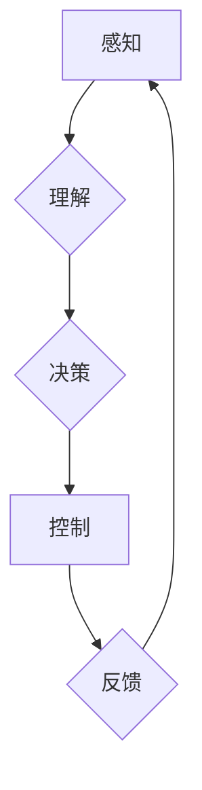

> 物理实体、自动化、机器学习、计算机视觉、机器人技术、深度强化学习、工业自动化、智能制造

## 1. 背景介绍

随着人工智能技术的飞速发展，物理实体的自动化已成为一个备受关注的领域。从传统的工业自动化到现代的智能制造，自动化技术正在深刻地改变着我们生产生活的方式。物理实体的自动化涉及到多个领域，包括机器学习、计算机视觉、机器人技术、深度强化学习等。

传统的自动化系统主要依赖于预先编程的规则和逻辑，难以应对复杂、多变的现实世界。而人工智能技术的引入，特别是深度学习的突破，为物理实体的自动化带来了新的机遇。深度学习算法能够从海量数据中学习，并自动提取特征，从而实现对物理实体的感知、理解和控制。

## 2. 核心概念与联系

物理实体的自动化本质上是将人工智能技术应用于物理世界，使机器能够感知、理解和控制物理环境中的物体和过程。

**核心概念：**

* **物理实体：**指可以感知和交互的物理世界中的物体或系统，例如机器人、车辆、工业设备等。
* **自动化：**指通过程序或算法自动执行任务，减少人工干预。
* **人工智能：**指模拟人类智能的计算机系统，例如机器学习、深度学习、自然语言处理等。

**核心联系：**

物理实体的自动化通过以下核心环节实现：

1. **感知：**利用传感器收集物理实体周围的环境信息，例如图像、声音、温度、压力等。
2. **理解：**利用人工智能算法对感知到的信息进行分析和理解，例如识别物体、预测运动轨迹、判断环境状态等。
3. **决策：**根据理解到的信息，制定控制策略，例如规划运动路径、调整工作参数、执行操作指令等。
4. **控制：**通过执行器将决策转化为实际动作，例如驱动电机、控制阀门、调节温度等。

**Mermaid 流程图：**



## 3. 核心算法原理 & 具体操作步骤

### 3.1  算法原理概述

物理实体的自动化中，常用的算法包括机器学习、深度学习、强化学习等。

* **机器学习：**通过训练模型，使模型能够从数据中学习规律，并对新数据进行预测或分类。
* **深度学习：**一种更高级的机器学习方法，利用多层神经网络模拟人类大脑的学习过程，能够处理更复杂的数据和任务。
* **强化学习：**通过奖励机制，训练智能体在环境中学习最优策略，以最大化奖励。

### 3.2  算法步骤详解

**以机器学习为例，其基本步骤如下：**

1. **数据收集：**收集与目标任务相关的训练数据。
2. **数据预处理：**对收集到的数据进行清洗、转换、特征提取等处理，使其适合模型训练。
3. **模型选择：**根据任务需求选择合适的机器学习模型，例如线性回归、逻辑回归、决策树、支持向量机等。
4. **模型训练：**利用训练数据训练模型，调整模型参数，使其能够准确地预测或分类。
5. **模型评估：**利用测试数据评估模型的性能，例如准确率、召回率、F1-score等。
6. **模型部署：**将训练好的模型部署到实际应用场景中，用于预测或分类新数据。

### 3.3  算法优缺点

**机器学习算法的优缺点：**

* **优点：**能够自动学习数据规律，无需人工编程；能够处理海量数据；性能优于传统算法。
* **缺点：**需要大量训练数据；训练过程耗时；对数据质量要求高；解释性较差。

### 3.4  算法应用领域

机器学习算法广泛应用于物理实体的自动化领域，例如：

* **机器人控制：**利用机器学习算法训练机器人进行自主导航、目标识别、抓取等操作。
* **工业自动化：**利用机器学习算法进行设备故障预测、生产过程优化、质量控制等。
* **智能制造：**利用机器学习算法实现智能生产线、个性化定制、柔性制造等。

## 4. 数学模型和公式 & 详细讲解 & 举例说明

### 4.1  数学模型构建

物理实体的自动化中，常用的数学模型包括状态空间模型、动态系统模型、控制理论模型等。

**状态空间模型：**

状态空间模型将系统描述为状态变量、输入变量和输出变量之间的关系。其数学形式为：

$$
\dot{x}(t) = f(x(t), u(t))
$$

$$
y(t) = h(x(t))
$$

其中：

* $x(t)$：系统状态变量
* $u(t)$：系统输入变量
* $y(t)$：系统输出变量
* $f(x(t), u(t))$：状态转移方程
* $h(x(t))$：输出方程

### 4.2  公式推导过程

**控制理论中的PID控制器：**

PID控制器是一种常用的控制算法，其控制输出为：

$$
u(t) = K_p e(t) + K_i \int e(t) dt + K_d \frac{de(t)}{dt}
$$

其中：

* $u(t)$：控制输出
* $K_p$：比例系数
* $K_i$：积分系数
* $K_d$：微分系数
* $e(t)$：误差信号

### 4.3  案例分析与讲解

**机器人导航：**

利用状态空间模型和控制理论，可以设计机器人导航算法。机器人可以根据传感器信息感知周围环境，并利用控制算法规划运动路径，实现自主导航。

## 5. 项目实践：代码实例和详细解释说明

### 5.1  开发环境搭建

* 操作系统：Ubuntu 20.04
* 编程语言：Python 3.8
* 库依赖：OpenCV、NumPy、PyTorch

### 5.2  源代码详细实现

```python
import cv2
import numpy as np
from torch import nn

# 定义目标检测模型
class YOLOv3(nn.Module):
    # ... 模型结构定义 ...

# 加载预训练模型
model = YOLOv3()
model.load_state_dict(torch.load('yolov3.pth'))

# 读取图像
image = cv2.imread('image.jpg')

# 前处理图像
image = cv2.cvtColor(image, cv2.COLOR_BGR2RGB)
image = cv2.resize(image, (416, 416))
image = image / 255.0
image = image.unsqueeze(0)

# 进行目标检测
with torch.no_grad():
    outputs = model(image)

# 后处理检测结果
# ...

# 显示检测结果
cv2.imshow('Detection Result', image)
cv2.waitKey(0)
```

### 5.3  代码解读与分析

* 代码首先定义了目标检测模型YOLOv3，并加载预训练模型。
* 然后读取图像并进行前处理，例如颜色转换、尺寸调整、归一化等。
* 将预处理后的图像输入模型进行目标检测。
* 最后对检测结果进行后处理，例如非极大值抑制、置信度筛选等，并显示检测结果。

### 5.4  运行结果展示

运行代码后，将显示检测结果图像，其中包含检测到的目标的边界框和类别标签。

## 6. 实际应用场景

### 6.1  工业自动化

* **缺陷检测：**利用机器视觉技术，对生产线上的产品进行缺陷检测，提高产品质量。
* **机器人协作：**利用机器人技术，实现人机协作，提高生产效率。
* **智能仓储：**利用机器人技术和人工智能算法，实现智能仓储管理，提高物流效率。

### 6.2  智能制造

* **个性化定制：**利用3D打印技术和人工智能算法，实现个性化产品定制。
* **柔性制造：**利用人工智能算法，实现生产线的灵活配置和调整，适应多品种小批量生产需求。
* **预测性维护：**利用机器学习算法，对设备进行故障预测，提前进行维护，降低设备停机时间。

### 6.3  自动驾驶

* **环境感知：**利用传感器和计算机视觉技术，感知周围环境信息，例如道路、车辆、行人等。
* **路径规划：**利用人工智能算法，规划最优行驶路径，避免碰撞事故。
* **车辆控制：**利用控制算法，控制车辆的加速、减速、转向等动作。

### 6.4  未来应用展望

物理实体的自动化技术将继续发展，并应用于更多领域，例如：

* **医疗保健：**利用机器人技术和人工智能算法，实现手术辅助、康复训练、药物配送等。
* **农业：**利用无人机和机器人技术，实现精准农业、智能种植、自动收割等。
* **教育：**利用虚拟现实和增强现实技术，实现沉浸式教育、个性化学习等。

## 7. 工具和资源推荐

### 7.1  学习资源推荐

* **书籍：**
    * 《深度学习》
    * 《机器学习》
    * 《强化学习：原理、算法和应用》
* **在线课程：**
    * Coursera
    * edX
    * Udacity

### 7.2  开发工具推荐

* **编程语言：**Python
* **机器学习库：**TensorFlow、PyTorch、Scikit-learn
* **计算机视觉库：**OpenCV、Dlib
* **机器人控制库：**ROS

### 7.3  相关论文推荐

* **目标检测：**
    * You Only Look Once: Unified, Real-Time Object Detection
* **机器人导航：**
    * A Survey of Robot Navigation Algorithms
* **强化学习：**
    * Deep Reinforcement Learning: An Overview

## 8. 总结：未来发展趋势与挑战

### 8.1  研究成果总结

物理实体的自动化取得了显著进展，人工智能技术为其提供了强大的支持。

### 8.2  未来发展趋势

* **更智能的自动化：**利用更先进的人工智能算法，实现更智能的自动化，例如自主学习、自适应、协同工作等。
* **更安全可靠的自动化：**提高自动化系统的安全性和可靠性，确保其在实际应用中能够安全稳定运行。
* **更广泛的应用场景：**将自动化技术应用于更多领域，例如医疗保健、农业、教育等。

### 8.3  面临的挑战

* **数据获取和标注：**训练人工智能模型需要大量数据，而获取和标注高质量数据是一个挑战。
* **算法解释性和可信度：**许多人工智能算法是黑箱模型，难以解释其决策过程，这降低了其可信度。
* **伦理和社会影响：**自动化技术可能会导致失业等社会问题，需要认真考虑其伦理和社会影响。

### 8.4  研究展望

未来，物理实体的自动化将继续是一个重要的研究方向，需要进一步探索更智能、更安全、更可靠的自动化技术，并解决其带来的伦理和社会挑战。

## 9. 附录：常见问题与解答

**Q1：物理实体的自动化与传统自动化有什么区别？**

**A1：**传统自动化主要依赖于预先编程的规则和逻辑，难以应对复杂、多变的现实世界。而物理实体的自动化则利用人工智能技术，能够自动学习数据规律，并对新数据进行预测或分类，从而实现更灵活、更智能的自动化。

**Q2：物理实体的自动化有哪些应用场景？**

**A2：**物理实体的自动化应用场景非常广泛，例如工业自动化、智能制造、自动驾驶、医疗保健、农业等。

**Q3：物理实体的自动化技术有哪些挑战？**

**A3：**物理实体的自动化技术面临着数据获取和标注